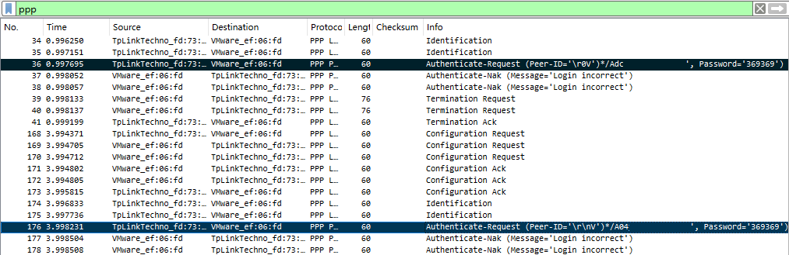

目前，许多家庭都采用拨号上网方式，运营商会提供一组账号与密码，用于对用户进行认证

你是否也曾经历过换路由器后绞尽脑汁想不起来密码的痛苦？你是否在帮助他人维修配置路由器时因对方不知道宽带密码而备受掣肘？不妨抛开运营商重置的复杂步骤，直接用Wireshark让路由器把密码直接讲给你听！

<!--truncate-->

## 1 前提条件

* 你正在使用路由器拨号上网（拨号过程不能由光猫进行）
* 你的电脑有一个以太网网口
* 你的电脑支持虚拟化，可以使用VMware Workstation等虚拟化平台


## 2 操作步骤

### 2.1 创建虚拟运营商主机

目前绝大多数运营商拨号上网都是通过PPPoE协议实现的，由于PPPoE是明文传输，这意味着我们只需要用Wireshark抓包即可捕获明文传输的账号密码

不幸的是，PPPoE协议的发现阶段分为4步：PADI-PADO-PADR-PADS，PADI包会广播用于发现可用的服务器，而服务器则返回PADO包应答，主机将从所有应答的PADO中选择一个，发送PADR请求服务，服务器返回PADS后成功建立会话

相信你已经注意到了，在服务器应答前，主机并不会传输我们所需的密码，因此，我们必须想办法响应主机的PADI，并返回正确的PADO，诱骗主机开始认证过程，也就是本步骤要创建的虚拟运营商主机

* 创建虚拟机

  为了方便，我们选择在虚拟机中运行[routerOS](https://www.mikrotik-routeros.net/download.aspx)，让它作为虚拟的运营商主机从路由器套话

  > 你可以参考以下这篇安装教程创建RouterOS虚拟机：
  > https://blog.csdn.net/xiaozhongda/article/details/39614587
  >
  > 值得注意的是，启动虚拟机后初始化服务时，仅需要选择System和PPP即可

* 输入以下命令，配置PPPoE服务

  ```
  /interface pppoe-server server add interface=ether1 service-name=Fake-PPPoE-Server authentication=pap
  /interface pppoe-server server enable 0
  ```


### 2.2 连接路由器

进行本步骤时，请用一根网线分别连接电脑以太网口和路由器的**WAN口**

为了让虚拟机能正常与路由器通信，我们需要将其桥接到以太网卡，因此需要暂时禁用无线网卡

右键右下角网络图标，点选网络和Internet设置


* Windows11 用户

  点选高级网络设置，并点选禁用无线网卡

  

* Windows10 用户

  点选右侧更改适配器选项，打开适配器列表

  

  右键点击无线网卡，选择禁用

  

完成操作后，按相反方式操作即可恢复网络


### 2.3 捕捉账号密码

* 启动Wireshark，选择捕捉以太网卡，并过滤ppp协议`ppp`

* 关闭后重新接通路由器的电源

* 查看Wireshark捕捉到的ppp协议数据包

  可以看到账号（打码部分）和密码都直接显示了出来，观察多次认证请求中账号重合的部分即可确定账号

  


祝大家都能有愉快的维修排障体验（）

也希望大家不要像我一样遇到220V的PoE（Power Over Ethernet）

