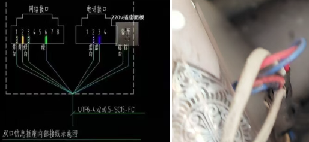
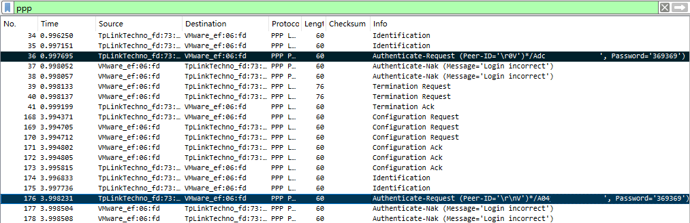

你是否也曾经历过更换路由器时，面对密码输入框绞尽脑汁的窘境？或是帮助亲友配置网络时，因对方忘记了运营商提供的宽带密码而一筹莫展？其实，不必经过联系客服、重置密码的繁琐流程，我们可以用技术手段，让路由器“亲口”把密码告诉你

这篇指南将带你走近PPPoE协议，学习如何利用Wireshark，破译路由器与运营商间的握手过程，轻松找回遗忘的密码

<!--truncate-->

## 1 前提条件

* 你正在使用路由器拨号上网（拨号过程不能由光猫进行）
* 你的电脑有一个以太网网口
* 你的电脑支持虚拟化，可以使用VMware Workstation等虚拟化平台

## 2 操作步骤

### 2.1 创建虚拟运营商主机

目前绝大多数运营商拨号上网都是通过PPPoE协议实现的，由于PPPoE是明文传输，这意味着观察它的连接建立过程能够很容易地截获密码；PPPoE协议的建立过程主要包含“发现”和“会话”两个阶段，标准的发现流程如下：
1.  **PADI (PPPoE Active Discovery Initiation):** 路由器（客户端）在网络中广播一个PADI报文，寻找可用的PPPoE服务器
2.  **PADO (PPPoE Active Discovery Offer):** 网络中所有收到PADI的PPPoE服务器，回复一个PADO报文，表示“我可以提供服务”
3.  **PADR (PPPoE Active Discovery Request):** 路由器从收到的所有PADO中选择一个，并发送一个PADR报文，请求建立连接
4.  **PADS (PPPoE Active Discovery Session-confirmation):** 被选中的服务器回复PADS报文，会话建立成功，随后开始认证和数据传输

我们的目标是在“发现”阶段介入，让路由器误认为我们的设备是合法的运营商服务器（PPPoE Server），从而向我们发送包含认证信息的请求
不幸的是，客户端并不会在一开始就广播认证密码，因此，我们必须想办法响应主机的PADI，让路由器误认为我们的设备是合法的运营商服务器（PPPoE Server），从而向我们发送包含认证信息的请求

* 创建虚拟机

  为了方便，我们选择在虚拟机中运行[routerOS](https://www.mikrotik-routeros.net/download.aspx)，让它作为虚拟的运营商主机从路由器套话

  > 你可以参考以下这篇安装教程创建RouterOS虚拟机：
  > https://blog.csdn.net/xiaozhongda/article/details/39614587
  >
  > 值得注意的是，启动虚拟机后初始化服务时，仅需要选择System和PPP即可

* 输入以下命令，配置PPPoE服务

  ```
  /interface pppoe-server server add interface=ether1 service-name=Fake-PPPoE-Server authentication=pap
  /interface pppoe-server server enable 0
  ```


### 2.2 连接路由器

进行本步骤时，请用一根网线分别连接电脑以太网口和路由器的**WAN口**

<details>
<summary>接线时，小心神人弱电</summary>

你可能了解过48V的PoE（Power Over Ethernet），但220V的PoE你见过吗？



很不幸，TA在一次维修时就遇到了，8根线芯中的4根被用来直接接入220V交流电

能帮助家人维修网络虽好，但也一定要小心这些装修的“小巧思”，安全第一！

</details>

为了让虚拟机能正常与路由器通信，我们需要将其桥接到以太网卡，因此需要暂时禁用无线网卡

右键右下角网络图标，点选网络和Internet设置


* Windows11 用户

  点选高级网络设置，并点选禁用无线网卡

  

* Windows10 用户

  点选右侧更改适配器选项，打开适配器列表

  

  右键点击无线网卡，选择禁用

  

完成操作后，按相反方式操作即可恢复网络


### 2.3 捕捉账号密码

* 启动Wireshark，选择捕捉以太网卡，并过滤ppp协议`ppp`
* 关闭后重新接通路由器的电源
* 查看Wireshark捕捉到的ppp协议数据包

  可以看到账号（打码部分）和密码都直接显示了出来，观察多次认证请求中账号重合的部分即可确定账号

  


祝大家都能有愉快的维修排障体验（）

