import FileCard from '@site/src/components/FileCard';

:::warning 该文档存在待解决问题

Hyper-V不提供NAT/DHCP服务，这会使你无法实验中测试与外网通信的2个步骤

GNS3 3.*版本已经解决了过往强制虚拟化造成的问题，推荐选择使用VMware Workstation运行GNS3虚拟机

如你有解决该问题的方式，欢迎向助教反馈或提交PR，非常感谢！

:::

## 1 配置Hyper-V管理器

:::important[解析]

虚拟机有两种常见架构：寄生架构（VMware Workstation/VirtualBox）/原生or裸金属架构（Hyper-V/VMware Exsi），前者虚拟机运行在宿主机操作系统上，而后者所有操作系统均平等地运行在轻量化的虚拟化平台上，使所有虚拟机可享受与物理机基本一致的性能与体验 [在操作系统课程-虚拟机部分了解更多]

同学们常用的Windows Subsystem Linux（以下简称WSL）即是微软基于Hyper-V提供的Linux兼容层，由于Hyper-V的使用，安装WSL后你正在运行的Windows实质上也成为了虚拟机，当你使用寄生架构的虚拟化平台时，实际上是在虚拟机中创建虚拟机（考虑到你还需要在GNS3 VM中运行QEMU，这实际上是虚拟机嵌套虚拟机嵌套虚拟机），不幸的是许多虚拟化平台对此很不开心；（

为了在不必移除WSL的情况下更顺畅地使用GNS3 VM，我们不妨使用为Hyper-V创建的GNS3 VM，从而避开使用不支持嵌套虚拟化的虚拟化平台。**如果你不需要使用WSL或已经安装了VMware Workstation/Virtualbox等虚拟化平台，你可以选择直接按照历史教程操作，并参考后文教程解决启动虚拟机过程中遇到的问题**
:::

### 1.1 Windows 专业版/Pro

#### 1.1.1 Windows 10

* 导航到“控制面板”，选择“程序”，然后选择“程序和功能”
* 选择“打开或关闭 Windows 功能”
* 选择“Hyper-V”、“虚拟化平台”，然后选择“确定”

  

  安装完成后，系统会提示你重启计算机。

#### 1.1.2 Windows 11

* 打开设置-系统-可选功能
* 点击最下方的“更多Windows功能”
* 后续步骤同上

### 1.2 Windows 家庭版

由于Windows家庭版并不提供Hyper-V管理功能，我们需要手动进行安装启用

* 在不含中文/特殊符号的路径下创建文本文档

  ```bat title="hyper-v-install.bat"
  pushd "%~dp0"
  dir /b %SystemRoot%\servicing\Packages\*Hyper-V*.mum >hv.txt
  for /f %%i in ('findstr /i . hv.txt 2^>nul') do dism /online /norestart /add-package:"%SystemRoot%\servicing\Packages\%%i"
  del hv.txt
  Dism /online /enable-feature /featurename:Microsoft-Hyper-V -All /LimitAccess /ALL
  Pause
  ```

* 保存并将该文档扩展名由"txt"修改为"bat"，右键该文件，选择“以管理员身份运行”

* 安装完成后，重新启动计算机


## 2  配置GNS3 VM

### 2.1 导入GNS3 VM

* 下载GNS3 VM 3.0.0rc1（或更新版本）

  > 旧版Hyper-V GNS3 VM对网络适配器切换支持不佳，可能影响部分实验的正常进行
  >
  > 建议选择较新的、与已安装GNS3客户端版本匹配的VM

  <FileCard link="https://pan.zju.edu.cn/share/ffaff71dfd3be31ac90c2a5c0f" name="浙大云盘" size={1116691496} file_type="cloud"/>
  <FileCard link="https://github.com/GNS3/gns3-gui/releases" name="Github官方仓库" size={1116691496} file_type="github"/>


* 解压压缩包到合适存储位置

  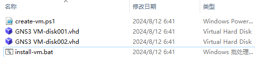

* 右键`install-vm.bat`，选择“以管理员身份运行”

  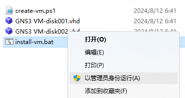

* 运行完成后，打开Hyper-V管理器（可Win+S打开Windows搜索，搜索“Hyper-V”找到）

  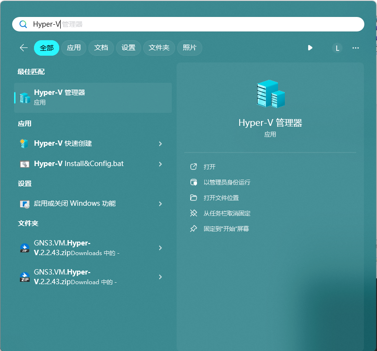

* 此时，你应当可以看到导入成功的GNS3 VM，双击可打开虚拟机连接

  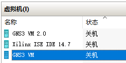

* 点击启动，启动GNS3 VM

  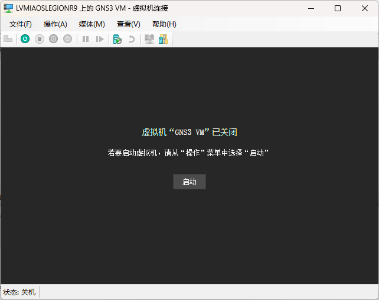

* 完成启动后耐心等待，GNS3服务器将会启动，界面如下，请留意图中的IP与端口

    :::important[每次启动后，IP会发生变化，请留意使用新IP连接]
    :::

  

* 打开GNS3，点击Edit-Preferences进入首选项

  

* 点击左侧Controller，填入虚拟机中展示的IP与端口（用户名/密码均为admin，通常无需修改），点击Connect连接

  


### 2.2 创建网络适配器

实验中用到的网络适配器对应关系如下

|         |    eth0    |                             eth1                             |                             eth2                             |                              -                               |
| :-----: | :--------: | :----------------------------------------------------------: | :----------------------------------------------------------: | :----------------------------------------------------------: |
| VMware  | 仅主机模式 |                           NAT模式                            |                           桥接模式                           |                              -                               |
| Hyper-V |    内部    |                             内部                             |                             外部                             |                             专用                             |


Hyper-V自带的`Default Switch`为内部网络，即对应Vmware下NAT模式的`eth0，eth1`，为了在实验中模拟不同的网络环境，我们需要添加一个外部网络适配器

* 关闭GNS3 VM（如已经打开）

    :::important 请选择关闭而非保存，否则将无法修改虚拟机设备

* 在Hyper-V管理器右侧操作栏中，点击虚拟交换机管理器

  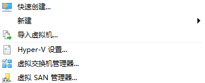

* 选择新建虚拟网络交换机-外部/外部-创建虚拟交换机

  

* 选择希望桥接的网络设备，应用并等待完成更改

  :::note
  使用无线网连接校园网时，请选择无线网卡（名称内通常包含Wifi）

  使用有线网连接校园网时，请选择有线网卡（名称内通常包含Ethernet）
  :::

  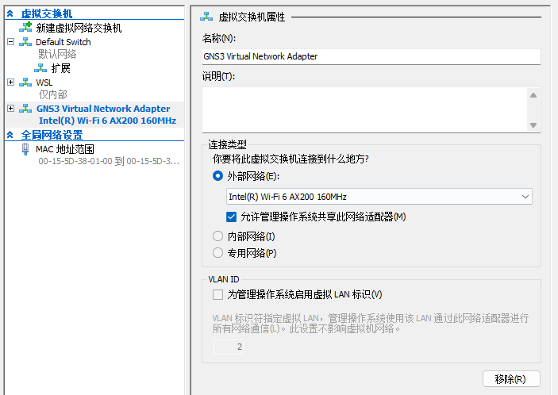

* 再次选中GNS3 VM，右键-设置，选择添加硬件-网络适配器-添加

  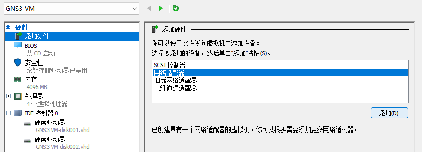

* 指定我们刚刚添加好的虚拟网络交换机并应用

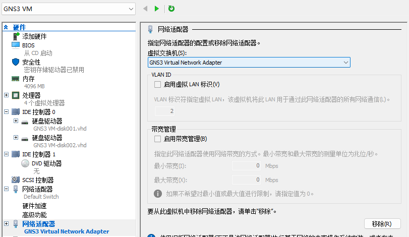

* 应用后，虚拟机即有eth0/eth1两个虚拟网络适配器，分别对应实验指导的eth0/eth2


## Q&A

* 无法Ping通虚拟机内网络设备

  尝试关闭Windows网络防火墙，并在Windows Defender防火墙中取消对GNS VM相应虚拟交换机的保护

  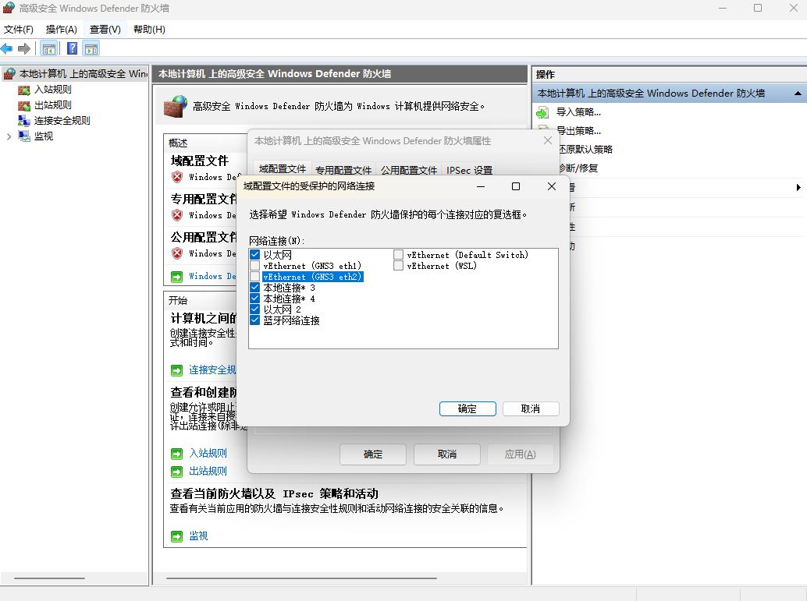

* Dynamips error when running command 'nio create_udp udp-f21f8df5-b82c-41e7-a31a-88119fd84746 10010 127.0.0.1 10011 ': unable to create UDP NIO

  端口占用，参考以下方式查找并停止相应软件

  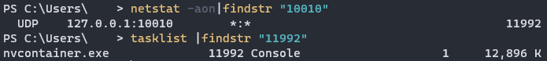

