import FileCard from '@site/src/components/FileCard';
import LinkCard from '@site/src/components/LinkCard';

## 1 安装VMWare Workstation

同学们可在白洪欢老师的课程网站上下载VMWare Workstation

<LinkCard url="http://cc.zju.edu.cn/bhh/" title="Black White's Homepage" icon="https://www.zju.edu.cn/_upload/tpl/0b/bf/3007/template3007/favicon.ico">白洪欢老师课程网站</LinkCard>
 

在页面内搜索VMware，下载相应版本，注意不要下载VMWare Player

## 2 导入GNS3虚拟机

:::warning 注意

下载的GNS3 VM版本号需要与GNS3 客户端匹配

如在官方仓库下载请选择中缀"VM.VMware.Workstation"

使用2.*版本GNS3虚拟机的同学，请务必阅读第4部分Q&A

:::

* 下载并解压GNS3虚拟机

  <FileCard link="https://pan.zju.edu.cn/share/f8b99eeebe605bef1fded196b15" name="浙大云盘" size={1116691496} file_type="cloud"/>
  <FileCard link="https://github.com/GNS3/gns3-gui/releases" name="Github官方仓库" size={1116691496} file_type="github"/>

* 打开VMware Workstation，选择打开虚拟机

  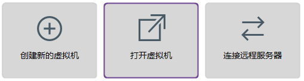

* 选择解压得到的GNS3 VM.ova

  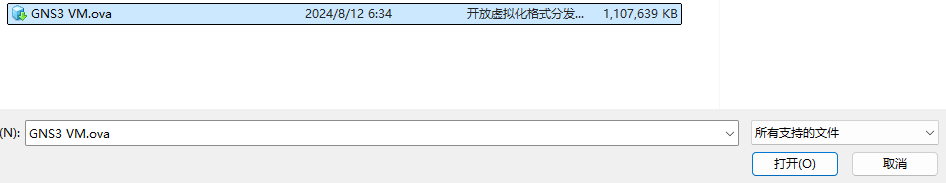

* 指定虚拟机的名称与存储路径

  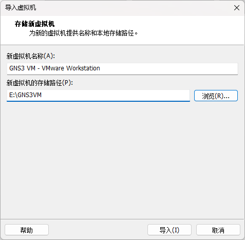

## 3 配置GNS3虚拟机

* 选择创建好的虚拟机，点选编辑虚拟机设置

  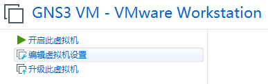

* 点选添加硬件

  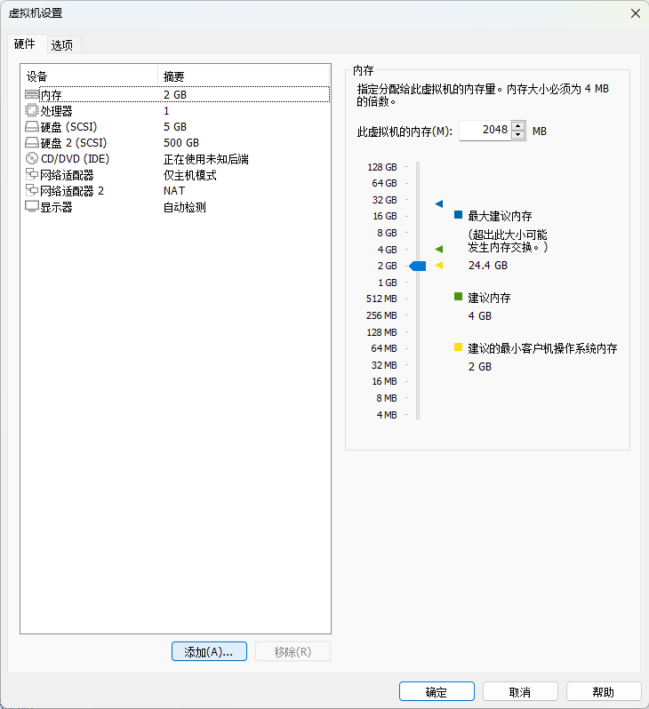

* 选择网络适配器

  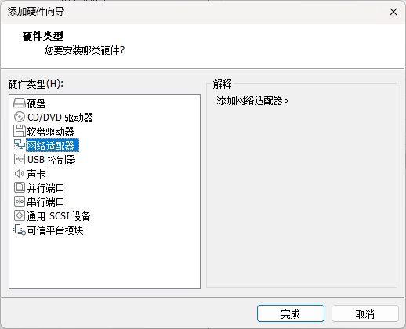

* 将网络连接更改为“桥接模式”

  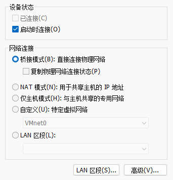

* 在左侧点选处理器，取消勾选虚拟化引擎中全部项目，点击确定保存设置

  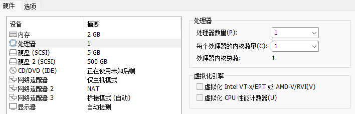

* 在VMware Workstation中，点选编辑-虚拟网络编辑器

  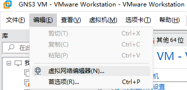

* 点选更改设置，并授予管理员权限

  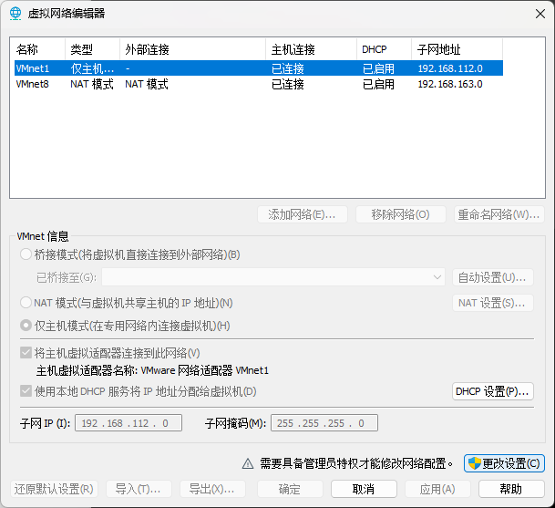

* 选择VMnet0，更改已桥接至的设备为当前上网所用设备（请根据你的实际情况选择，如果找不到使用的网卡，请参考Q&A）

  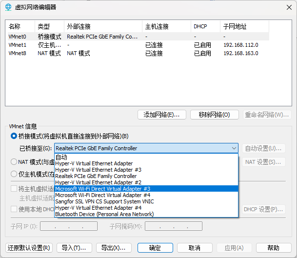

* 点选应用保存设置

## 4 Q&A

* 虚拟机启动时，总是因为虚拟化问题导致启动失败，如何解决？

  旧版GNS3客户端启动时，会自动尝试调用VMware workstation启动虚拟机，且会强制启用虚拟化，由于同学们几乎全部在使用WSL，其基于的Hyper-V的虚拟化方式将与VMware产生冲突，导致启动失败（对GNS3客户端的逆天逻辑送上一个大大的F）

  为了避免虚拟化引起的问题，我们必须在GNS3客户端启动前，先在VMware Workstation中关闭GNS3虚拟机的虚拟化（参见3.5），再启动GNS3虚拟机，待GNS3虚拟机启动后，打开GNS3客户端

  由于此时GNS3虚拟机已经启动，GNS3客户端不会再尝试修改虚拟机设置，我们就可以正常使用虚拟机了

* 在配置VMnet0桥接的网络时，无法找到我正在使用的网络适配器

  * 确认VPN等工具没有启用虚拟网卡（如Clash的TUN Mode）

  * 打开控制面板-网络与Internet-网络和共享中心，点击左侧更改适配器设置

    

  * 选择正在使用的网络适配器，右键打开属性，将VMware Bridge Protocal勾选并确定保存

  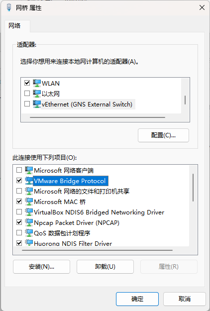