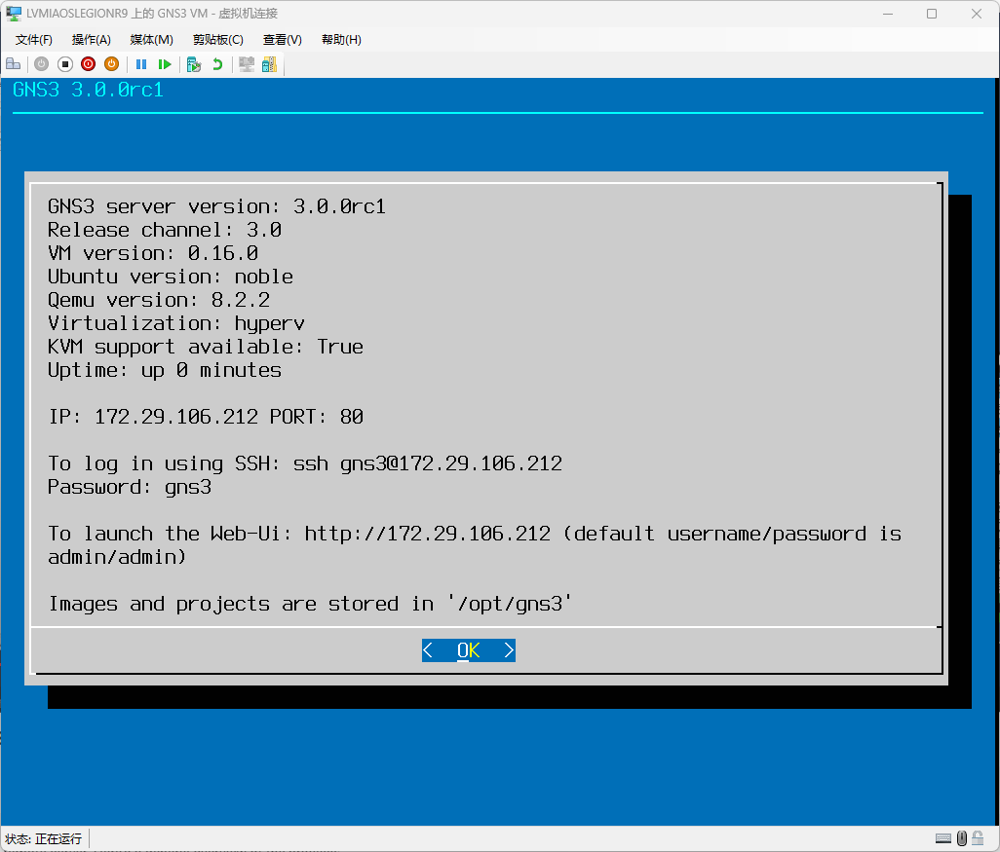
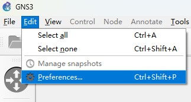
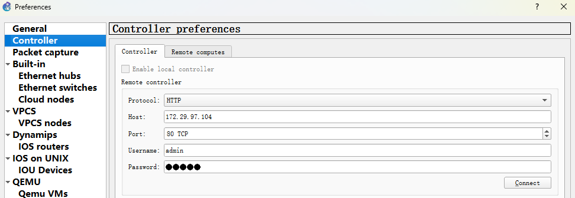
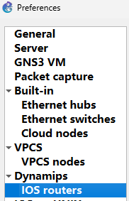
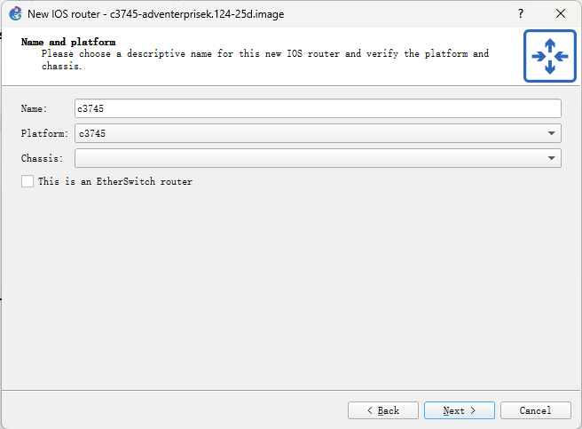
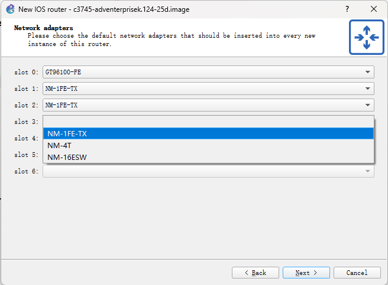
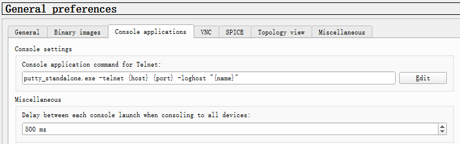
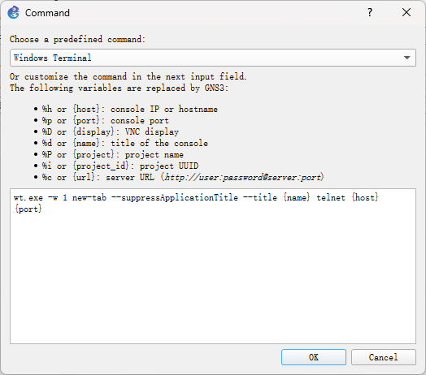

## 1 连接 GNS3 虚拟机

* 启动虚拟机后，耐心等待GNS3服务器程序启动，启动完成后，记录图中的IP与端口

  

* 打开GNS3，点击Edit-Preferences进入首选项

  

* 点击左侧Controller，填入虚拟机中展示的IP与端口（用户名/密码均为admin，通常无需修改），点击Connect连接

  

## 2 添加路由器镜像

* 确保已完成第2部分连接操作

* 点击Dynamips下的IOS routers

  

* 点击New，浏览路由器映像文件

  

* 根据镜像选择正确的平台型号，如提示无法自动检测型号，可忽略警告

  

* 指定路由器内存大小，保持默认即可，如内存严重不足，可降低为128MB

  

* 为路由器添加一些接口模块

  * NM-1FE-TX 以太网接口模块（建议添加至少3个）
  * NM-4T 高速串口模块
  * NM-16ESW 以太网交换模块

  

* 添加广域网模块，推荐添加1-2个WIC-2T高速串口模块

  

* 点击Idle-PC finder，设置Idle-PC值，避免路由器过度占用CPU资源

  

## 3 配置自定义终端（可选）

本部分为**可选步骤**，请根据需求权衡是否需要，**实验对使用的终端没有任何要求**

优点：UI美观，字体清晰，支持多标签页，便于同时管理多个设备

缺点：滚动缓冲无效，只能看到当前屏幕的输出

* 如果没有Windows Terminal，可在Microsoft Store下载安装

* 打开GNS3，点击Edit-Preferences进入首选项

  

* 选择Console applications，并点选Edit

  

* 选择Windows Terminal

  

