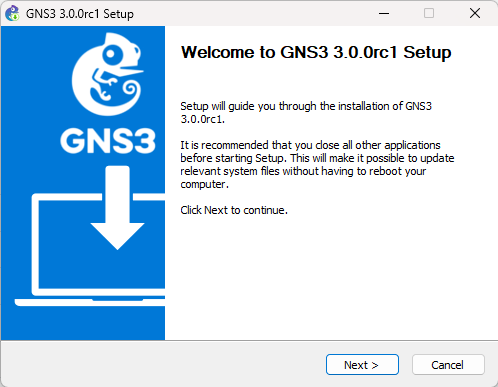
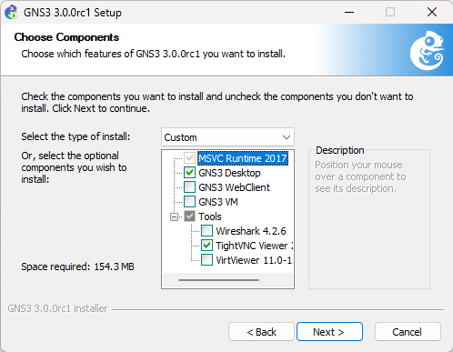
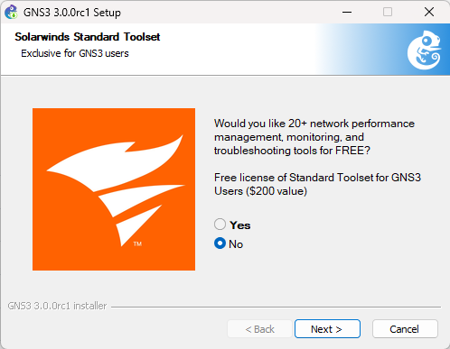

import FileCard from '@site/src/components/FileCard';

* 下载GNS3 3.0.0rc1（或更新版本）

  <FileCard link="https://pan.zju.edu.cn/share/57acd2792d40b041e5b1ba8df5" name="浙大云盘" size={75078041} file_type="cloud"/>
  <FileCard link="https://github.com/GNS3/gns3-gui/releases" name="Github官方仓库" size={75078041} file_type="github"/>

* 下载完成后运行安装程序，阅读并同意EULA，设置安装路径等信息

  

* 指定安装组件，至少需选择GNS3 Desktop，你可以根据需求额外安装其他组件

    :::tip 安装向导下载GNS3 VM的速度较慢，你可以按照后续步骤指导单独配置GNS3 VM，不影响正常使用
    :::

  

* Solarwinds广告选择No即可

      

* 完成安装向导

