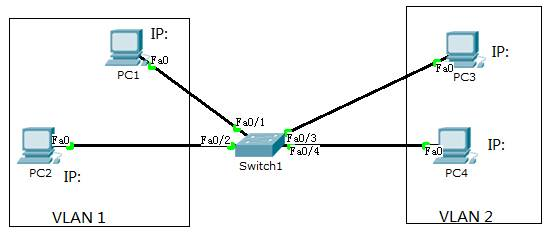
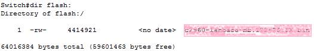
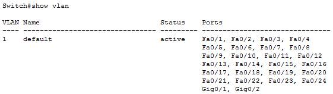
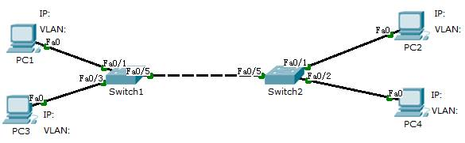
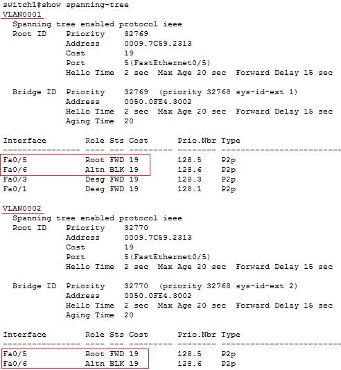

import LinkCard from '@site/src/components/LinkCard';
import FileCard from '@site/src/components/FileCard';
import DeadlineProcess from '@site/src/components/DeadlineProcess';

<h3 style={{color: '#006d75', marginTop: 0, marginBottom: 8}}>实验资源</h3>
<DeadlineProcess start={'2024-09-24 13:25:00'} end={'2024-10-15 23:59:59'}/>
<FileCard file_type={'pdf'} name={'Lab2 使用二层交换机组网 实验课件'} size={'122365'} link={'http://10.214.0.253/network/exercise/courseware/upload/110/luxq_Lab2.pdf'} />
<FileCard file_type={'md'} name={'Lab2 实验报告模板 Markdown版本'} size={'180289'} link={'https://pan.zju.edu.cn/share/7ee6f68ad4bad4181d6c831f36'} />
<FileCard file_type={'doc'} name={'Lab2 实验报告模板 Word版本'} size={'214016'} link={'http://10.214.0.253/network/download/Assignments/FundOfNetworks/2024/%e5%ae%9e%e9%aa%8c%e6%8a%a5%e5%91%8a%e6%a8%a1%e7%89%88_%e5%ae%9e%e9%aa%8c2.doc'} />

### 一、实验目的
* 掌握交换机的工作原理、管理配置方法
* 掌握VLAN的工作原理、配置方法
* 掌握跨交换机的VLAN Trunk配置方法
* 掌握多个交换机的冗余组网、负载平衡的配置方法

### 二、实验内容

* 使用网线连接PC，让PC彼此能够互相Ping通
* 配置和管理交换机：使用Console线连接交换机，运行Putty等终端软件，对交换机进行配置
* 通过Telnet远程管理交换机
* 配置镜像端口，用Wireshark软件抓取交换机各端口的数据
* 配置VLAN Access端口和VLAN Trunk端口
* 配置交换机的冗余备份
* 配置交换机的负载均衡

### 三、主要仪器设备

PC机、路由器、交换机、Console连接线、直联网络线、交叉网络线。

### 四、操作方法与实验步骤

#### IOS软件的基本操作：

* 进入特权模式：`enable`；该模式下才能查看重要信息，并可进入配置模式；
* 进入配置模式：`configure terminal`；在这个模式下才可以修改配置；
* 进入到某个接口的配置模式：`interface 接口名 模块号/端口号`，例如`interface ethernet 0/1`；
* 命令可以不输全，只要能够被唯一识别；
* 输入？可以显示当前上下文环境下可用命令；
* 在命令后面输入？可以显示命令的参数提示；
* 输入命令的前一部分，再按`tab`，可以自动完成完整的命令输入；
* 按上箭头可以重复输入上次打过的命令；
* 鼠标左键选择需要截取的文本内容，鼠标右键粘贴复制好的文本的内容。

#### Part 1. 单交换机

1. 用1台二层交换机和4台PC组成一个小型局域网

   * 使用直联网络线，将每个PC机都连接到交换机的不同端口
   * 使用Console线，连接到交换机的Console端口和控制台PC的串口，并在控制台PC上运行Putty等终端软件
   * 观察交换机的每个端口状态指示，确认PC机都正确连接到了交换机的端口
   * 查看当前哪些端口已连接，哪些端口未连接，连接的速率和模式，收发统计
   * 在控制台输入命令查看当前设置了哪些VLAN，缺省所有的端口都属于同一个VLAN 1，如果有端口属于非默认VLAN，输入命令取消该VLAN
   * 在每个PC机上互相用Ping来测试连通性，验证局域网已经建立
   * 手工关闭某个端口，然后查看端口关闭后的效果，在对应的PC机上使用Ping测试连通性
   * 给交换机配置一个IP地址，并在交换机上用Ping命令测试与PC间的连通性
   * 在非控制台PC机上，通过telnet连接交换机，进行远程配置。

2. 设置交换机的镜像端口

   * 确定某个PC（假设为PC1）连接的端口为镜像端口
   * 在该PC机上运行包捕获软件，抓取数据包
   * 在其他2个PC机上运行Ping，互相测试彼此的连通
   * 查看是否能抓取到其他2个PC机之间的Ping响应包，正常情况下，由于交换机是根据MAC地址直接转发的，所以PC1是收不到其他PC之间的响应包
   * 在交换机上将连接PC1的端口配置为镜像端口，被镜像的端口分别为另外2个PC连接的端口
   * 在PC1上再次启动包捕获软件，抓取数据包
   * 在其他PC机上运行Ping，测试彼此的连通性
   * 查看是否能抓取到其他2个PC机之间的Ping响应包。镜像端口设置后，交换机将把被镜像的源端口收发数据复制一份给镜像目的端口。同时该端口的正常收发功能关闭。

3. 在交换机上设置VLAN

   * 输入命令，在交换机上增加1个新的VLAN
   * 将PC3和PC4加入新的VLAN
   * 通过PING验证PC之间的连通性

4. 如果交换机上有密码，请按照下面的步骤清除密码：

   * 用控制线连接PC和交换机的Console口，PC上运行Putty软件
   * 断开交换机电源，然后按住交换机的mode键不放，重新打开交换机电源，直到mode灯闪烁十秒左右后再放开mode键
   * 在Putty软件上观察交换机启动过程，直到出现`Switch:`的提示符
   * 输入`dir flash:`查看是否存在config.txt文件，如果不能列出目录，输入命令`flash_init`，待flash加载成功后再输入命令`rename flash: config.text flash: configX.text`将配置文件改名
   * 输入命令`reload`或`reset`重新启动。

#### Part 2. 多交换机

1. 用2台交换设备和4台PC组成一个小型局域网，每个交换机都连接2台PC机；
2. 在交换机上都设置2个VLAN，将每个交换机上的PC都分成2组，各属于1个VLAN；
3. 将两个交换机连起来，设置互联端口为VLAN Trunk模式，并测试同一组VLAN跨交换机的联通性；普通模式的端口只允许一个VLAN的数据通过，VLAN Trunk模式允许多个VLAN数据同时通过一个端口。
4. 用2条网线连接2个交换机，验证Spanning-tree的作用。交换机之间自动会运行Spanning-tree协议，避免产生转发回路。如果关闭Spanning-tree,存在物理回路的网络很容易产生广播风暴，从而导致网络瘫痪。
5. Spanning-tree是按照VLAN进行管理的，不同VLAN的Spanning-tree可以有不同的设置，因此，可以利用这点实现在两个交换机上的负载平衡。测试2条网线均连接时，数据是否从2条网线分别传送，而当1条网线断开时，数据是否全部改从另外1条网线和传送。

### 五、实验数据记录和处理

:::important 报告要求
以下实验记录均需结合屏幕截图，进行文字标注和描述，图片应大小合适、关键部分清晰可见，可直接在图片上进行标注，也可以单独用文本进行描述。
:::

####  Part 1

1. 在实验拓扑图上标记交换机的IP地址、PC的IP地址及所属VLAN、交换机的与PC的连接端口）

   拓扑图参考，请替换成实际使用的：

   

2. 找一台有串口的PC机和一根串口控制线，将控制线的一头连接交换机的Console口，另一头连接PC机的串口。

   在PC机上运行Putty软件，选择Serial方式，默认为9600, COM1。按两下回车，检查是否已经连上交换机。并输入`enable`命令进入到特权模式。如果有密码，请参考第四章的第4小节进行密码清除。

   输入命令`show version`查看当前交换机型号信息并记录：设备型号、IOS软件版本、软件映像文件名、端口数量。

3. 输入命令`show flash`或`dir flash`: 查看当前文件系统的内容，并将展示结果截图

   截图参考：

   

4. 显示交换机的VLAN数据（命令`show vlan`），并将展示结果截图

   所有的端口应该都属于VLAN 1，如果存在其他VLAN，请先通过命令`no vlan id`删除

   截图参考：

   

5. 用直连网线（straight through）将PC按照前述拓扑结构连接到交换机。然后给各PC配置IP地址，并用Ping检查各PC之间的联通性，确保都能Ping通，否则请检查网线连接。

   手工关闭某端口（命令：`shutdown`)，输入命令查看该端口状态（命令：`show interface端口号`，如`show interface e0/1`），在其他PC上使用Ping命令检测连接在该端口的PC是否能够联通。

   **请截图**：命令输出、Ping结果

6. 重新打开该端口（命令：`no shutdown`），输入命令查看交换机上端口状态。使用Ping命令检测连接在该端口的PC是否能够联通

   **请截图**：命令输出、Ping结果

7. 进入VLAN1接口配置模式（命令：`interface vlan 1`），给VLAN 1配置IP地址即是给交换机配置管理IP地址（命令：`ip address 地址 掩码`）。测试PC是否能Ping通交换机的IP地址；如果不通，查看VLAN 1端口的状态是否是up，如果不是，则打开VLAN端口（`no shutdown`）。

   **请截图**：输入的命令

8. 输入以下命令：打开虚拟终端（命令`line vty 0 4`），允许远程登录（命令： `login`），设置登密码（命令：`password 密码`）

   **请截图**：输入的命令

9. 在PC上运行Putty软件，选择telnet协议，输入交换机的IP地址，通过网络远程连接交换机，并输入密码。

   **请截图**：连接成功结果

10. 在PC1上运行Wireshark，在另外2台（PC2、PC3）上互相持续的Ping（运行`ping IP地址 -t`），观察在PC1上是否能抓取到PC2和PC3发出的ARP广播包以及ICMP响应包。如果不能抓取到PC2、PC3发送的ARP广播包，在PC2、PC3上先运行`arp –d *`删除所有主机的ARP缓存。正常情况下，ICMP响应包是不能被抓取到的。

    **请截图**：Wireshark抓包情况

11. 选择一个交换机端口配置为镜像端口（命令：`monitor session 1 destination interface 端口`），将PC1的网线切换到该端口，将PC2和PC3所连端口配置为被镜像端口（命令：`monitor session 1 source interface 端口`）。继续运行Wireshark，观察在PC1上是否能抓取到PC2和PC3的ICMP响应包。

    **请截图**：输入的命令、Wireshark抓包情况

12. 关闭PC1端口的镜像功能（命令：`no monitor session 1 destination interface 端口`)，否则该端口不能正常收发数据。

    **请截图**：输入的命令

13. 在交换机上增加VLAN 2（命令：`vlan database`或`config terminal`，`vlan 2`），将PC3、PC4所连端口加入到VLAN 2（命令：`interface 端口`，`switchport access vlan 2`）。用Ping检查PC之间的联通性（同一VLAN的PC之间能够通，不同VLAN的PC之间不能通）。

    **请截图**：输入的命令、PC1→PC2、PC1→PC3、PC4→PC2、PC4→PC3间共4组连通性检测截图

14. 查看交换机上的运行配置（命令`show running-config`），复制粘贴本节相关的文本。

#### Part 2

15. 增加一台交换机（Switch2），将PC2、PC4连接到该交换机，并用一根交叉网线（Cross-over）将两个交换机连接起来。在拓扑图上记录各PC的IP地址、连接端口及所在VLAN：

    拓扑图参考，请替换成实际使用的：

    

    在Switch2上增加VLAN 2，将PC4所连端口加入到VLAN 2。用Ping检查不同交换机上属于同一VLAN的PC之间的联通性（即PC1与PC2应该通，PC3与PC4不能通）。然后显示2个交换机的VLAN数据（命令`show vlan`)

    **请截图**：Switch1的vlan数据、Switch2的vlan数据、PC1→PC2、PC3→PC4间共2组连通性检测截图

16. 将交换机之间的互联端口配置为VLAN Trunk模式（命令：`switchport mode trunk`，部分型号的设备可能要先设置封装协议，命令：`switchport trunk encapsulation dot1q`），再次用Ping检查属于同一VLAN但在不同交换机的PC之间的联通性（即PC1与PC2应该通，PC3与PC4也应该通）。

    **请截图**：输入的命令、PC1→PC2、PC3→PC4间共2组连通性检测截图

17. 再增加一根网线，把2个交换机的另外2个端口连接起来。并将这2个端口都配置成VLAN Trunk模式。稍等片刻，查看4个互联端口的状态（命令：`show spanning-tree`），分别在2个VLAN中标出: 哪个交换机是根网桥？哪些端口处于转发状态（FWD），哪些端口处于阻塞状态（BLK）。

    Spanning-tree数据截图示例（请替换成实际显示的）：

    

    ___

    

18. 关闭2个VLAN的STP（命令：`no spanning-tree vlan ID`），观察两个交换机的端口状态指示灯（急速闪动），并在PC上用Ping测试网络的延迟是否加大（甚至可能出现超时或丢包）。

    **请截图**：Ping结果

19. 重新打开2个VLAN的STP（命令：`spanning-tree vlan ID`）, 观察两个交换机的端口状态指示灯（缓慢闪动），并在PC上用Ping测试网络的延迟是否恢复正常。

    **请截图**：Ping结果

20. 拔掉连接在2个处于FWD状态端口之间的网线，等待一会儿，查看4个互联端口的状态（命令：`show spaning-tree`）（有些端口可能已经消失）。标出原BLK状态的端口是否变成了FWD状态。

    **请截图**：Spanning-tree数据截图（分交换机显示）

21. 配置2个交换机的互联端口优先级(默认优先级128)，使VLAN1的数据优先通过第1对互联端口传送（命令：`interface 端口`, `spanning-tree vlan 1 port-priority 16`）。使VLAN2的数据优先通过第2对互联端口传送（命令：`interface 端口`, `spanning-tree vlan 2 port-priority 16`）。此处只记录2个交换机各自所使用的命令及参数即可。

    **请截图**：Switch1、Switch2上输入的命令

22. 拔掉剩下的1根连接互联端口的网线，稍后2根网线重新插上，等待一会儿，查看4个互联端口的状态，分别在2个VLAN中标出:各端口的优先级，哪些端口处于转发状态，哪些端口处于阻塞状态。

    **请截图**：Spanning-tree数据截图（分交换机显示）

23. 拔掉其中1根连接互联端口的网线，查看4个互联端口中原先处于BLK状态的端口，是否变成了FWD状态（哪个VLAN发生了变化）

    **请截图**：Spanning-tree数据截图（分交换机显示）

24. 记录2个交换机上的运行配置（命令:`show running-config`），复制粘贴本节相关的文本（完整的内容请放在文件中，每个交换机一个文件，分别命名为S1.txt、S2.txt）。

### 六、实验结果与分析

根据你观察到的实验数据和对实验原理的理解，分别解答以下问题：

* 端口状态显示为administratively down，意味着什么意思？

* 在交换机配置为镜像端口前，为什么可以抓取到其他PC之间的ARP请求包，而不能抓取ARP响应包？

* PC属于哪个VLAN，是由PC自己可以配置的，还是由交换机决定的？

* 同一个VLAN的PC，如果配置了不同长度的子网掩码，能够互相Ping通吗？

* 为什么在划分为2个VLAN后，两组PC之间就不能进行IP通信了呢？

* 交换机在VLAN Trunk模式下使用的封装协议是什么？

* 未启用STP（Spanning Tree Protocol）协议时，交换机之间连接了多条网线后，为什么Ping测试的响应会延迟很大甚至超时？

* 从插上网线后开始，交换机的端口状态出现了哪些变化？大约需要多少时间才能成为FWD状态？期间，连接在该端口的计算机是否能够Ping通？

  

