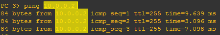

import LinkCard from '@site/src/components/LinkCard';
import FileCard from '@site/src/components/FileCard';
import DeadlineProcess from '@site/src/components/DeadlineProcess';

<h3 style={{color: '#006d75', marginTop: 0, marginBottom: 8}}>实验资源</h3>
<DeadlineProcess start={'2024-10-15 13:25:00'} end={'2024-10-29 23:59:59'}/>
<FileCard file_type={'pdf'} name={'Lab3 使用三层交换机组网 实验课件'} size={'650417'} link={'http://10.214.0.253/network/exercise/courseware/upload/110/luxq_Lab3-%E4%BD%BF%E7%94%A8%E4%B8%89%E5%B1%82%E4%BA%A4%E6%8D%A2%E6%9C%BA%E7%BB%84%E7%BD%91.pdf'} />
<FileCard file_type={'md'} name={'Lab3 实验报告模板 Markdown版本'} size={'194092'} link={'https://pan.zju.edu.cn/share/0d3c6e0a67dfdeb5ae6a0be984'} />
<FileCard file_type={'doc'} name={'Lab3 实验报告模板 Word版本'} size={'247296'} link={'http://10.214.0.253/network/download/Assignments/FundOfNetworks/2024/%e5%ae%9e%e9%aa%8c%e6%8a%a5%e5%91%8a%e6%a8%a1%e7%89%88_%e5%ae%9e%e9%aa%8c3.doc'} />


### 一、实验目的

* 掌握并比较两种VLAN间数据交换的方法。
* 学习如何配置子接口；
* 学习掌握三层交换机的工作原理；
* 学习如何配置三层交换机；


### 二、实验内容

由于二层交换机不转发不同VLAN间的数据，所以有2种方式让不同VLAN的PC能够相互通信。第一种方式称为单臂路由器，是利用路由器的子接口功能，将路由器的物理接口逻辑上分为多个子接口，每个子接口属于不同的VLAN，能够接收到不同的VLAN数据，然后在路由器内部通过第三层进行数据交换，实现VLAN间通信。第二种方式是采用三层交换机，是将二层交换机的功能加入了三层路由功能的做法。实验分为两部分，将分别按照两种方式进行。


### 三、主要仪器设备

PC机、路由器、Console连接线、直联网络线、交叉网络线

:::important 提示
本实验可使用模拟器，如使用模拟器完成实验，需独立完成实验全部步骤
:::


### 四、操作方法与实验步骤

#### Part 1. 单臂路由

-   将2台PC（PC1、PC2）和一台路由器都连接到一台二层交换机；
-   在交换机上增加1个VLAN，并使得2台PC所连端口分别属于2个VLAN。给2个PC配置不同子网的IP地址；
-   将二层交换机和路由器连接的端口配置成VLAN Trunk模式；
-   在路由器连接交换机的端口上创建2个子接口，并配置子接口所属的VLAN，分别给2个子接口配置IP地址，并激活端口；
-   将2台PC的默认网关分别设置为路由器的2个子接口的IP地址；
-   测试2台PC能否互相Ping通。


#### Part 2. 三层交换

-   将第一部分的路由器删除后，将二层交换机和一台三层交换机连接，并新增2台PC（PC3、PC4）直接连接到三层交换机；
-   在三层交换机上增加1个VLAN，并使得PC3、PC4所连端口分别属于2个VLAN。给这2个VLAN接口配置IP地址，并启用路由功能；
-   给PC3、PC4配置所在VLAN内的合适IP地址，并将2台PC的默认网关分别设置为三层交换机2个VLAN接口的IP地址；
-   测试PC3、PC4能否互相Ping通。
-   测试不同交换机上的PC间（如PC1、PC3）能否互相Ping通。


### 五、实验数据记录和处理

:::important 提示
以下实验记录均需结合屏幕截图，进行文字标注和描述，图片应大小合适、关键部分清晰可见，可直接在图片上进行标注，也可以单独用文本进行描述。
:::

#### Part 1 单臂路由

1. 将2台PC和一台路由器都连接到一台二层交换机，在交换机上增加1个VLAN，并使得2台PC所连端口分别属于2个VLAN。给2个PC分配不同子网的IP地址。

   参考拓扑图，请在完成实验后根据你实验中的实际情况进行替换：

   

2. 验证两个PC之间能否Ping通（不同的VLAN之间不通）

   结果截图：

   


3. 将二层交换机和路由器连接的端口配置成VLAN Trunk模式（使用GNS3的内建交换机模块时，请参考指南“十四、二层交换机”进行配置并截图，使用实际设备时，请参考实验2 进行配置并截图）。

   配置截图：（示例为GNS3模拟的配置截图，如使用实际设备，请参考实验2截图）

   

   配置后的结果截图（示例为GNS3模拟的结果截图，如使用实际设备，请参考实验2截图）

   


4. 连接路由器的Console口，进入路由器的配置模式。在路由器连接交换机的端口上创建2个子接口（命令：`interface [type] [slot/unit.sub]`，如：`interface e0/1.1`），并配置子接口所属的VLAN（命令：`encapsulation dot1q VLAN编号`），然后使用与2台PC一致的子网，分别给2个子接口配置IP地址，最后激活端口（命令：`no shutdown`）

   记录输入的命令，保留命令前提示符，如`R1(config)#`


5. 按照前述拓扑图，给PC配置IP地址，并将默认路由器地址（gateway）按照所属VLAN，分别设置为路由器的2个子接口的IP地址。

   配置截图：

   

   


6. 测试2台PC能否Ping通各自的路由器子接口地址

   结果截图：

   

   


7. 测试2台PC能否互相Ping通

   结果截图：

   


8. 记录路由器的路由表内容（命令：`show ip route`）

   结果截图：

   


9. 记录路由器上的运行配置（命令：`show running-config`)，复制粘贴本节相关的文本（完整的内容请放在文件中，命名为R1.txt）。

   本节相关的运行配置：

   ```
   示例：
   !
   interface FastEthernet0/0
     no ip address
     duplex auto
     speed auto
   !
   interface FastEthernet0/0.1
     encapsulation dot1Q 1 native
     ip address [ip] [mask]
   !
   interface FastEthernet0/0.2
     encapsulation dot1Q 2
     ip address [ip] [mask]
   !
   ```


#### Part 2 三层交换

1. 将第一部分的路由器移除后，将二层交换机和一台三层交换机连接（使用GNS3模拟时，请参见指南中“十五、使用路由器模拟三层交换机”的具体步骤，创建一个三层交换机设备），并新增2台PC（PC3、PC4）直接连接到三层交换机，为PC3、PC4分配所在VLAN内的合适IP地址，并在图中标记各设备的IP地址和VLAN

   拓扑图参考，请替换成实际使用的：

   


2. 在三层交换机上增加1个VLAN，并使得2台PC所连端口分别属于2个VLAN。

   记录输入的命令，保留命令前提示符，如`R1(config)#`

   配置结果截图（命令`show vlan`或者`show vlan-switch`）：

   


3. 给2个VLAN接口配置IP地址（命令：interface vlan VLAN编号，ip address IP地址）

   记录输入的命令，保留命令前提示符，如`R1(config)#`


4. 在三层交换机上启用路由功能（命令：ip routing）（在GNS3上用路由器模拟三层交换机时，此步骤不需要）

5. 按照前述拓扑图，给PC3、PC4配置IP地址，并将PC3、PC4的默认路由器分别设置为三层交换机2个VLAN接口的IP地址。

   配置截图：

   

   


6. 测试PC3、PC4能否Ping通各自的VLAN接口地址

   结果截图：

   

   


7. 测试PC3、PC4能否互相Ping通。

   结果截图：

   


8. 测试不同交换机上属于不同VLAN的PC间的连通性（如PC1-\>PC4, PC2-\>PC3）

   结果截图：

    * PC1→PC4

      

    * PC2→PC3

      


9. 如果有些PC之间是不能Ping通的，思考一下是什么原因造成的。接下来在三层交换机上把与二层交换机互联的端口设置成Trunk模式。

   记录输入的命令，保留命令前提示符，如`R1(config)#`


10. 再次测试之前不通的PC间的连通性。

    结果截图：

    * PC2→PC3

      


11. 显示三层交换机上的路由信息

    结果截图：

    


12. 记录三层交换机上的当前运行配置, 复制粘贴本节相关的文本（完整的内容请放在文件中，命名为S2.txt）。

    本节相关的运行配置：

    ```
    示例：
    !
    interface FastEthernat1/1
      switchport access vlan 2
    !
    interface FastEthernet1/2
      switchport mode trunk
    !
    !
    interface Vlan1
      ip address [ip] [mask]
    !
    interface Vlan2
      ip address [ip] [mask]
    !
    ```


### 六、实验结果与分析

根据你观察到的实验数据和对实验原理的理解，分别解答以下问题：

* 为什么路由器的端口可以配置IP地址，而三层交换机的端口跟二层交换机一样不能配置IP地址？

* 本实验中为什么要用子接口？有什么好处？使用物理接口可以吗？

* 直连三层交换机的PC的默认路由器地址应该设为什么？

* 三层交换机和二层交换机互联时，连在二层交换机上VLAN2的PC为什么Ping不通连在三层交换机上VLAN 1的PC？

* Ping测试时，为什么一开始有几次不通，后面又通了？

* 既然路由器可以实现VLAN间数据交换，为何还要设计三层交换机呢？