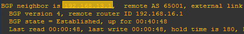
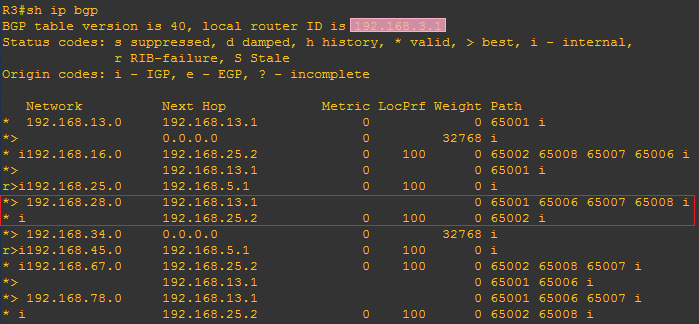
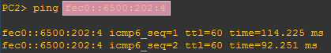

import LinkCard from '@site/src/components/LinkCard';
import FileCard from '@site/src/components/FileCard';
import DeadlineProcess from '@site/src/components/DeadlineProcess';

<h3 style={{color: '#006d75', marginTop: 0, marginBottom: 8}}>实验资源</h3>
<DeadlineProcess start={'2024-11-26 13:25:00'} end={'2024-12-10 23:59:59'}/>
<FileCard file_type={'md'} name={'Lab6 实验报告模板 Markdown版本'} size={'935496'} link={'https://pan.zju.edu.cn/share/b1414b2af157824b46b862e038'} />
<FileCard file_type={'doc'} name={'Lab6 实验报告模板 Word版本'} size={'1111552'} link={'http://10.214.0.253/network/download/Assignments/FundOfNetworks/2024/%e5%ae%9e%e9%aa%8c%e6%8a%a5%e5%91%8a%e6%a8%a1%e7%89%88_%e5%ae%9e%e9%aa%8c6.doc'} />

### 一、实验目的

* 理解距离向量路由协议的工作原理。
* 理解BGP协议的工作机制。
* 掌握配置和调试BGP协议的方法。


### 二、实验内容

-   创建多种类型的网络，各自成为一个独立的AS
-   AS内部路由器配置成启用OSPF路由协议
-   在同一个AS边界上的路由器启用BGP协议，形成邻居关系
-   在不同AS边界路由器上启用BGP协议，直连路由器之间建立邻居关系
-   观察各路由器上的路由表和BGP运行数据，并验证各PC能够相互Ping通
-   断开某些链路，观察BGP事件和路由表变化
-   在AS边界路由器上配置路由聚合
-   在AS间进行多径负载均衡


### 三、主要仪器设备

PC机、路由器、Console连接线、直联网络线、交叉网络线

如果物理设备不足，可以使用模拟软件，建议使用GNS3软件,详情请参考《使用GNS3软件模拟IOS指南》。


### 四、操作方法与实验步骤

按照下面的拓扑图连接路由器和PC机。每个自治系统（AS）均分配1个独立的AS号。其中，AS 65003内部运行OSPF路由协议，R6、R7、R8分别代表一个AS。


###### 实验主要步骤：

* 配置路由器各接口的IP地址（除了R1的f0/1、R2的f0/0接口配置IPv6的地址外，其他均配置IPv4的地址）, 使直连的2个路由器能相互Ping通，为方便记忆，建议使用192.168.xy.x/24、192.168.xy.y/24形式的地址，其中x,y分别是相连路由器的编号, 例如可以设置R1连接R3的f1/0接口IP为192.168.13.1，R3连接R1的f1/0接口IP为192.168.13.3，其他类推；
* 在各AS边界路由器之间建立邻居关系；
* 在AS 65003内部的两头边界路由器（R3、R5）之间建立邻居关系；
* 在AS 65003内部启用OSPF路由协议，并启用重分发机制，让OSPF和BGP之间信息互通；
* 在R8上配置路由过滤，使得到达PC3子网的路由不经过AS 65008；
* 给PC1、PC3配置IPv4地址，使用10.0.x.y/24的形式的私网地址，其中x为子网号，y为主机地址；
* 给R1、R2、R6的f0/1接口、R1、R6的f2/0接口以及PC2、PC4、PC5配置IPv6的地址，使用FEC0:\: x:y:z/112形式的站点本地地址，其中x、y为子网号，z为主机地址；
* IPv6的地址分配规则：
    * FEC0::/10前缀的地址是IPv6站点本地地址段（site-local），相当于IPv4的私网地址段；
    * FE80::/10前缀的地址是用于IPv6链路本地的地址段（link-local）。给接口配置site-local地址时会自动分配link-local地址，也可以手工配置link-local地址。由于同一个接口可以配置多个IPv6地址，为避免路由学习时产生多个Next-hop，路由器只把link-local地址作为Next-hop。路由器会自动通告link-local地址的前缀，PC可以根据这些信息自动配置link-local地址，并发现路由。
* 在R1和R2之间建立隧道，使得配置了IPv6的主机之间能通过中间的IPv4网络相互通信。


###### BGP知识点：

* 64512-65534之间的AS号属于私有AS号，不在互联网出现。
* 两个路由器都在同一个AS，称为iBGP邻居，链路称为内部link。iBGP邻居之间的链路可以为非直连链路，数据需要通过其他路由器转发。
* 两个路由器分属于不同的AS，称为eBGP邻居，链路称为外部link。
* BGP路由状态：*表示有效路由，>表示最佳路由，i表示内部路由，r表示写入路由表时被拒绝，原因可能是路由表中已存在优先级更高的同样路由。比如OSPF属于内部网关路由协议，优先级比外部网关路由协议BGP高。
* 多个AS之间互相连接，从R1到R2存在多条AS间的路径，例如：
    * 65001->65003->65002
    * 65001->65006->65007-65009->65002
    * 65001->65006->65008->65009->65002
* BGP选择最佳路由的依据有很多，默认是选择经过最少AS数量的路径，不以接口速度带宽为标准。
* 路由器在发送BGP消息时，可能使用物理接口的IP地址作为源地址，这样会因为与对方配置的邻居地址不符，导致无法建立邻居关系。因此需要设置更新源为回环接口，可以避免这种情况发生。
* 同步功能是让BGP等待内部路由器(如R4)学到了外部路由后才对外发布。重分发功能是把其他路由协议（如BGP）学习到的路由添加到自己数据库中(如OSPF)。
* 路由聚合是将路由表中下一跳相同的多个网络合并成一个网络，这样可以减少路由表的大小，加速路由器转发处理速度。


###### BGP相关命令：

* 在路由器R1上启用BGP协议, 设置AS号，并宣告直连网络：
  ```bash
  R1(config)# router bgp <AS-Number>
  R1(config-router)# network x.x.x.x mask x.x.x.x
  ```
* 把对方增加为AS内部的邻居（AS-Number设置为相同的AS号）
  ```bash
  R1(config-router)# neighbor [IP-Address] remote-as [AS-Number]
  ```
* 对方增加为AS间的邻居（IP-Address为对方的IP，AS-Number设置为对方的AS号）：
  ```bash
  R1(config-router)# neighbor [IP-Address] remote-as [AS-Number]
  ```
* 查看邻居关系：
  ```bash
  R1# show ip bgp neighbor
  ```
* 打开bgp调试：
  ```bash
  R1# debug ip bgp
  ```
* 查看BGP数据库：
  ```bash
  R1# show ip bgp
  ```
* 启用BGP同步功能：
  ```bash
  R1(config-router)# synchronization
  ```
* 设置BGP更新源为回环接口（IP-Addr设置为对方的回环口IP）：
  ```bash
  R1(config-router)# neighbor [IP-Addr] update-source loopback 0
  ```
* 在BGP中启用路由重分发功能，从OSPF中重分发路由信息：
  ```bash
  R1(config)# router bgp [AS-Number]
  R1(config-router)# redistribute ospf [process-id]
  ```
* 在OSPF中启用重分发功能，从BGP中重分发路由信息：
  ```bash
  R1(config)# router ospf [process-id]
  R1(config-router)# redistribute bgp [AS-Number] subnets
  ```
* 聚合路由（summary-only参数的含义是只传递聚合后的路由，as-set参数的含义是在传播网络时加上AS属性，避免出现循环路由）：
  ```bash
  R1(config-route)# aggregate-address [ip network] [subnet mask] summary-only as-set
  ```
* 设置允许多条路径：
  ```bash
  R1(config-route)# maximum-paths 2
  ```


### 五、实验数据记录和处理

:::important 提示
以下实验记录均需结合屏幕截图，进行文字标注和描述，图片应大小合适、关键部分清晰可见，可直接在图片上进行标注，也可以单独用文本进行描述。
:::

1. 参考实验操作方法的说明，设计好每个PC、路由器各接口的IP地址及掩码（除了PC2、PC4、PC5以及与之相连的路由器接口配置IPv6的地址外，其他均配置IPv4的地址），并标注在拓扑图上。


#### Part 1. 配置iBGP

2. 分别在R3、R4、R5上配置回环端口、各物理接口的IP地址，激活OSPF动态路由协议，宣告直连网络。其中进程ID请设置为学号的后2位（全0者往前取值）。

   R3配置命令：

   ```bash
   R3(config)#interface f0/0
   R3(config-if)#
   R3(config-if)#
   R3(config)#interface f1/0
   R3(config-if)#
   R3(config-if)#
   R3(config)#interface loopback 0
   R3(config-if)#
   R3(config)# router ospf
   R3(config-router)#
   ```

   R4配置命令：

   ```
   R5(config)#interface f0/0
   R5(config-if)#
   R5(config-if)#
   R5(config)#interface f0/1
   R5(config-if)#
   R5(config-if)#
   R5(config)#interface loopback 0
   R5(config-if)#
   R5(config)#
   R5(config-router)#
   ```

   R5配置命令：

   ```bash
   R5(config)#interface f0/1
   R5(config-if)#
   R5(config-if)#
   R5(config)#interface f1/0
   R5(config-if)#
   R5(config-if)#
   R5(config)#interface loopback 0
   R5(config-if)#
   R5(config)#
   R5(config-router)#
   ```


3. 查看R3、R4、R5的路由表，并在R3上用Ping测试与R5的回环口（用回环口作为源地址，命令：`ping [IP-addr] source loopback 0`）之间的联通性。

   截图：R3 / R4 / R5路由表：

   

   截图：R3 → R5的Ping结果：

   


4. 启动R3、R5上的BGP协议（配置成同一个AS），宣告直连网络，然后把对方增加为AS内部的邻居（命令：`neighbor [IP-Address] remote-as [AS-Number]`），IP-Address为对方回环接口的IP，AS-Number设置为相同的AS号。

   R3配置命令：

   

   R5配置命令：

   ```bash
   R5(config)#
   R5(config-router)#
   R5(config-router)#
   R5(config-router)#
   ```


5. 分别在R3、R5上查看BGP邻居关系（命令：`show ip bgp neighbor`），标出Link类型和对方的IP、连接状态。如果没有活动的TCP连接，打开调试开关（命令：`debug ip bgp`），查看错误原因。观察完毕关掉调试（命令：`no debug ip bgp`）。

   R3的邻居关系：观察得知，邻居的IP是\_\_\_\_\_\_，链路类型属于\_\_\_\_\_\_，状态是\_\_\_\_\_\_，但现象是没有活动的TCP连接。

   

   R5的邻居关系：观察得知，邻居的IP是\_\_\_\_\_\_，链路类型属于\_\_\_\_\_\_，状态是\_\_\_\_\_\_，但现象是没有活动的TCP连接。

   打开debug后的消息：错误原因是被对方拒绝连接，是因为R3默认使用了物理接口的IP地址作为源地址，而R5配置的邻居地址是R3的
   ，因邻居地址不符被拒绝。

   


6. 在R3、R5上设置BGP更新源为回环接口（命令：`neighbor [IP-Addr] update-source loopback 0`），等待一会儿，再次查看邻居关系，标记连接状态是否已建立（ESTAB）。

   R3配置命令：

   

   R5配置命令：

   ```bash
   R5(config)#
   R5(config-router)#
   ```

   R3的邻居关系（选取关键信息进行截图）：观察得知，与R5的邻居关系已经建立，对方的连接端口是\_\_\_\_\_\_。

   

   

   R5的邻居关系（选取关键信息进行截图）：观察得知，与R3的邻居关系已经建立，对方的连接端口是\_\_\_\_\_\_。


7. 在R3、R5上查看BGP数据库（命令：`show ip bgp`），并查看路由表信息。

   R3的BGP数据库（标出iBGP路由）：观察得知，存在\_\_\_\_\_\_条状态码=r的路由（表示没有成功写入路由表）。

   

   R3的路由表：观察得知，网络地址\_\_\_\_\_\_、\_\_\_\_\_\_在路由表中已存在比BGP优先级高的OSPF路由，所以BGP的路由信息没有成功写入。

   

   截图：R5的BGP数据库（标出iBGP路由）、R5的路由表（标出在BGP数据库中存在，但优先级更高的OSPF路由）

#### Part 2. 配置eBGP

8. 在R1、R2、R6、R7、R8上激活路由器互联的接口，配置IP地址，启用BGP协议，每个路由器使用不同的AS号，宣告所有直连网络，把直接连接的对方增加为AS间的邻居（命令：`neighbor [IP-Address] remote-as [AS-Number]`），IP-Address为对方的IP，AS-Number设置为对方的AS号。

   R1的配置命令：（截图仅供参考，请替换成文本形式的配置命令）

   

   ```bash
   R1(config)#interface f1/0
   R1(config-if)#
   R1(config-if)#
   R1(config)#interface f2/0
   R1(config-if)#
   R1(config-if)#
   R1(config)#
   R1(config-router)#
   R1(config-router)#
   R1(config-router)#
   R1(config-router)#
   ```

   R2的配置命令：

   ```bash
   R2(config)#interface f1/0
   R2(config-if)#
   R2(config-if)#
   R2(config)#interface f2/0
   R2(config-if)#
   R2(config-if)#
   R2(config)#
   R2(config-router)#
   R2(config-router)#
   R2(config-router)#
   R2(config-router)#
   ```

   R6的配置命令：

   ```bash
   R6(config)#interface f0/0
   R6(config-if)#
   R6(config-if)#
   R6(config)#interface f2/0
   R6(config-if)#
   R6(config-if)#
   R6(config)#
   R6(config-router)#
   R6(config-router)#
   R6(config-router)#
   R6(config-router)#
   ```

   R7的配置命令：

   ```bash
   R7(config)#interface f0/0
   R7(config-if)#
   R7(config-if)#
   R7(config)#interface f0/1
   R7(config-if)#
   R7(config-if)#
   R7(config)#
   R7(config-router)#
   R7(config-router)#
   R7(config-router)#
   R7(config-router)#
   ```

   R8的配置命令：

   ```bash
   R8(config)#interface f0/1
   R8(config-if)#
   R8(config-if)#
   R8(config)#interface f2/0
   R8(config-if)#
   R8(config-if)#
   R8(config)#
   R8(config-router)#
   R8(config-router)#
   R8(config-router)#
   R8(config-router)#
   ```


9. 在R3、R5上分配配置R1、R2为外部BGP邻居。

   R3的配置命令：

   ```bash
   R3(config)#
   R3(config-router)#
   ```

   R5的配置命令：

   ```bash
   R5(config)#
   R5(config-router)#
   ```


10. 在各路由器上查看邻居关系，标出Link类型和对方的IP、连接状态（找出关键信息进行截图）。

    R1的邻居关系：R1的两个邻居的IP分别为\_\_\_\_\_\_、\_\_\_\_\_\_，链路类型均为\_\_\_\_\_\_。

    

    

    R2的邻居关系：R2邻居的IP分别为\_\_\_\_\_\_、\_\_\_\_\_\_，链路类型均为\_\_\_\_\_\_。


    R3的邻居关系：R3的iGP邻居的IP为\_\_\_\_\_\_，eBGP邻居的IP为\_\_\_\_\_\_。

    

    

    R5的邻居关系：R3的iGP邻居的IP为为\_\_\_\_\_\_，eBGP邻居的IP为为\_\_\_\_\_\_。

    

    R6的邻居关系：R6的两个邻居的IP分别为\_\_\_\_\_\_、\_\_\_\_\_\_，链路类型均为\_\_\_\_\_\_。

    

    R7的邻居关系：R7的两个邻居的IP分别为\_\_\_\_\_\_、\_\_\_\_\_\_，链路类型均为\_\_\_\_\_\_。

    

    R8的邻居关系：R8的两个邻居的IP分别为\_\_\_\_\_\_、\_\_\_\_\_\_，链路类型均为\_\_\_\_\_\_。


11. 等待一会儿，在路由器R1查看BGP数据库，标出到达R2-R5间子网、R6-R7间子网、R7-R8间子网以及R2-R8间子网的最佳路由（标记为
    \> 的为最佳路由）、经过的AS路径。

    R1的BGP数据库：

    

    观察得知：

    * 到达R2-R5间子网的下一跳是\_\_\_\_\_\_，经过的AS路径为\_\_\_\_\_\_；
    * 到达R6-R7间子网的下一跳是\_\_\_\_\_\_，经过的AS路径为\_\_\_\_\_\_；
    * 到达R7-R8间子网的路由有\_\_\_\_\_\_条，其中最佳路由的下一跳是\_\_\_\_\_\_，经过的AS路径最短，AS号依次为\_\_\_\_\_\_；
    * 到达R8-R2间子网的路由有\_\_\_\_\_\_条，其中最佳路由的下一跳是\_\_\_\_\_\_，经过的AS路径最短，AS号依次为\_\_\_\_\_\_。


12. 在路由器R2查看BGP数据库，标出到达R1-R3间子网、R1-R6间子网、R6-R7间子网以及R7-R8间子网的最佳路由、经过的AS路径。

    R2的BGP数据库：


    观察得知：

    * 到达R1-R3间子网的下一跳是\_\_\_\_\_\_，经过的AS路径为\_\_\_\_\_\_；
    * 到达R7-R8间子网的下一跳是\_\_\_\_\_\_，经过的AS路径为\_\_\_\_\_\_ ；
    * 到达R1-R6间子网的路由有\_\_\_\_\_\_条，其中最佳路由的下一跳是\_\_\_\_\_\_，经过的AS路径最短，AS号依次为\_\_\_\_\_\_；
    * 到达R6-R7间子网的路由有\_\_\_\_\_\_条，其中最佳路由的下一跳是\_\_\_\_\_\_，经过的AS路径最短，AS号依次为\_\_\_\_\_\_ 。


13. 在路由器R1上查看路由表，标出到达R2-R5间子网、R6-R7间子网、R7-R8间子网以及R2-R8间子网的路由，是否与BGP数据库中的最佳路由一致。

    截图：R2的路由表

14. 在路由器R2上查看路由表，标出到达R1-R3间子网、R1-R6间子网、R6-R7间子网以及R7-R8间子网的路由，是否与BGP数据库中的最佳路由一致。

    截图：R1的路由表

15. 在路由器R6查看BGP数据库，标出到达R2-R5间子网的最佳路由、经过的AS路径。然后在R1上关闭R1-R3互联端口后（命令：`interface f1/0`, `shutdown`），在R6上观察到达R2-R5间子网的最佳路由有无变化。

    R6的BGP数据库（当前）：到达R2-R5间子网的最佳路由的下一跳为\_\_\_\_\_\_。

    

    R6的BGP数据库（断开连接后）：观察得知，到达R2-R5间子网的最佳路由的下一跳变为\_\_\_\_\_\_。


#### Part 3. 路由重分发

16. 重新激活R1-R3之间的端口（命令：`no shutdown`），等待R1重新选择R3作为到达R2-R8间子网的最佳BGP路由。然后测试R1是否能Ping通R2-R8互联端口，并跟踪R1到该子网的路由（命令：`traceroute ip-addr`，如果提前终止，可按Ctrl+6）。

    Ping结果：

    

    路由跟踪结果：得到的现象是在路由器\_\_\_\_\_\_中断了。

    


17. 查看R3的BGP数据库和路由表，标记到达R2-R8间子网的BGP最佳路由。查看R4的路由表是否存在R2-R8间子网的路由信息。

    R3的BGP数据库：观察得知，到达R2-R8间子网的最佳路由的下一跳IP地址是\_\_\_\_\_\_。

    

    R3的路由表：观察得知，

    * 到达R2-R8间子网的下一跳IP地址\_\_\_\_\_\_（属于R2）是由BGP写入的。
    * 去往该地址的下一跳IP地址\_\_\_\_\_\_（属于R4）是由OSPF写入的。

    

    R4的路由表：观察得知，由于R4上缺少相应的路由，因此不能Ping通。默认情况下，未启用同步功能，BGP就不会考虑AS内部是否存在相关路由，导致路由黑洞。

    


18. 打开R3、R5的BGP同步功能（命令：`synchronization`），等一会儿查看R3、R1到达R2-R8间子网的BGP最佳路由是否发生变化。用Ping测试R1到达R2-R8互联端口的联通性，并跟踪路由。

    R3的配置命令：

    ```bash
    R3(config)#
    R3(config-router)#
    ```

    R5的配置命令：

    ```bash
    R5(config)#
    R5(config-router)#
    ```

    R3的BGP数据库：观察得知，

    * 到达R2-R8间子网的路由有\_\_\_\_\_\_条
    * 其中最佳路由的下一跳为\_\_\_\_\_\_（属于R1），因为同步功能打开后，BGP判断AS内部缺少相应的路由，因此不选择本AS作为转发路径。

    

    R3的路由表：到达R2-R8间子网的下一跳IP为\_\_\_\_\_\_，属于路由器\_\_\_\_\_\_。

    

    R1的BGP数据库：观察得知，

    * 到达R2-R8间子网的最佳路由的下一跳为\_\_\_\_\_\_
    * 属于路由器\_\_\_\_\_\_。由于使用了水平分裂方式，R3并没有向R1报告关于这个子网的路由，因为R3选的下一跳是R1。

    

    Ping结果：

    

    路由跟踪结果：观察得知，依次经过了这些路由器：\_\_\_\_\_\_、\_\_\_\_\_\_、\_\_\_\_\_\_、\_\_\_\_\_\_。


19. 在R3、R5的OSPF协议中启用BGP重分发功能（命令：`router ospf [pid]`，`redistribute bgp [AS-number] subnets`），等一会儿，查看R3、R5的OSPF数据库，以及R4的路由表是否出现了AS外部的路由信息。

    R3的配置命令：

    ```bash
    R3(config)#
    R3(config-router)#
    ```

    R5的配置命令：

    ```bash
    R5(config)#
    R5(config-router)#
    ```

    R3的OSPF数据库：观察得知，OSPF从BGP中重分发了AS外部链路的信息，但是R3-R1的直连网络\_\_\_\_\_\_没有被本路由器重分发。

    

    R5的OSPF数据库：观察得知，OSPF从BGP中重分发了AS外部链路的信息，但是R5-R2的直连网络\_\_\_\_\_\_没有被本路由器重分发。

    

    R4的路由表：观察得知，R4上增加了AS外部的路由信息。此时，到达R2-R8间子网的下一跳为\_\_\_\_\_\_和 \_\_\_\_\_\_(优先级相同)。因为重分发后，OSPF将在AS内部传播BGP的外部路由信息。

    


20. 在R3上清除BGP信息（命令：`clear ip bgp *`），等待一段时间后，在R1上查看到达R2-R8间子网的最佳BGP路由，以及R1的路由表，并在R1上跟踪到达R2-R8间子网的路由。

    R1的BGP数据库：观察得知，

    * 到达R2-R8间子网的路由有\_\_\_\_\_\_条
    * 其中最佳路由的下一跳为\_\_\_\_\_\_（属于路由器\_\_\_\_\_\_）。

    

    R1的路由表：到达R2-R8间子网的下一跳IP为\_\_\_\_\_\_，属于路由器\_\_\_\_\_\_。

    

    路由跟踪结果：观察得知，依次经过了这些路由器：\_\_\_\_\_\_、\_\_\_\_\_\_、\_\_\_\_\_\_、\_\_\_\_\_\_。

    


21. 在R3上的BGP中启用OSPF路由重分发功能（命令：router bgp [AS-bnumber], redistribute ospf [pid]），然后查看R3的BGP数据库，标记新增的路由信息。等待一会，在R8上查看AS 65003的内部相关路由信息是否存在。

    R3的配置命令：

    ```bash
    R3(config)#
    R3(config-router)#
    ```

    R3的BGP数据库：观察得知，新增的路由分别是：\_\_\_\_\_\_、\_\_\_\_\_\_、\_\_\_\_\_\_。因为重分发后，BGP将在AS之间传播OSPF的内部路由信息。

    

    R8的BGP数据库：观察得知，AS 65003内部子网的路由有\_\_\_\_\_\_条，其中到达R3的回环口的最佳路由的下一跳为\_\_\_\_\_\_，到达R4的回环口的最佳路由的下一跳为\_\_\_\_\_\_。

    


22. 激活R1上的f0/0端口，配置IP地址，宣告BGP直连网络。配置PC1的IP地址和默认网关。

    R1的配置命令：

    ```bash
    R1(config)#interface f0/0
    R1(config-if)#
    R1(config-if)#
    R1(config)#
    R1(config-router)#
    ```

    PC1的配置命令：

    ```bash
    PC1>
    ```


23. 激活R2上的f0/0端口，配置IP地址，宣告BGP直连网络。配置PC3的IP地址和默认网关。测试PC1-PC3之间的连通性。

    R2的配置命令：

    ```bash
    R2(config)#interface f0/0
    R2(config-if)#
    R2(config-if)#
    R2(config)#
    R2(config-router)#
    ```

    PC3的配置命令：

    ```bash
    PC3>
    ```

    截图：Ping结果


#### Part 4. 路由过滤

24. 查看R7的BGP数据库中PC3所在子网的最佳路由。

    R7的BGP数据库：当前，到达PC3子网的最佳路由的下一跳是\_\_\_\_\_\_。

    


25. 在R8上创建访问列表（命令：`access-list [id] deny [subnet] [mask]`），配置路由过滤（命令：`neighbor [router-id] distribute-list [access-list-id] out`），用于抑制向R7传播关于PC3子网的更新（这样可以实现前往PC3子网的数据不经过AS 65008），等待一段时间后再次查看R7、R8的BGP数据库中PC3所在子网的最佳路由（可以通过命令`clear ip bgp *`强制更新）。

    R8的配置命令：

    

    查看R8生效的访问列表：（访问列表是有顺序的，前面优先。如需修改，请全部删除后重新按顺序添加）

    

    R8的BGP数据库：

    

    R7的BGP数据库：

    

    观察得知：R8上到达PC3子网的最佳路由的下一跳是\_\_\_\_\_\_，该路由被过滤，没有传递给R7，因此，R7上到达PC3子网的最佳路由的下一跳是\_\_\_\_\_\_，数据不再经过AS 65008了。


#### Part 5. IPv6双栈路由

26. 激活R1上的f0/1端口，配置IPv6的site-local地址；给f2/0口配置IPv6的site-local地址。查看IPv6接口（命令：`show ipv6 interface`），标记自动分配的link-local地址。

    R1的配置命令：（截图仅供参考，请替换成文本形式）

    ```bash
    示例
    R1(config)#interface f0/1
    R1(config-if)#ipv6 address [ip]
    R1(config-if)#no shutdown
    R1(config-if)#exit
    R1(config)#interface f2/0
    R1(config-if)#ipv6 address [ip]
    R1(config-if)#exit
    ```

    查看R1的IPv6接口：

    

    

    观察得知：

    * 系统为f0/1端口自动分配的链路本地地址为\_\_\_\_\_\_。
    * 系统为f2/0端口自动分配的链路本地地址为\_\_\_\_\_\_。


27. 给R6的f2/0、f0/1端口配置IPv6的site-local地址，查看IPv6接口，标记自动分配的link-local地址。在R1上分别测试到R6的site-local和link-local地址的连通性。

    R6的配置命令：

    ```bash
    R6(config)#interface f2/0
    R6(config-if)#
    R6(config)#interface f0/1
    R6(config-if)#
    R6(config-if)# （激活端口）
    ```

    查看R6的IPv6接口：

    

    

    观察得知：

    * 系统为f0/1端口自动分配的链路本地地址为\_\_\_\_\_\_。
    * 系统为f2/0端口自动分配的链路本地地址为\_\_\_\_\_\_。

    Ping测试结果：

    


28. 分别在R1、R6上启用IPv6单播路由（命令：`ipv6 unicast-routing`），宣告直连网络，互相设置对方为IPv6邻居。然后查看IPv6单播邻居信息（命令：`show ip bgp ipv6 unicast neighbors`）。

    R1的配置命令：

    ```bash
    R1(config)#ipv6 unicast-routing
    R1(config)#router bgp 65001
    R1(config-router)#address-family ipv6
    R1(config-router-af)#network fec0::6500:101:0/112
    R1(config-router-af)#network fec0::6500:16:0/112
    R1(config-router-af)#neighbor [ip] remote-as 65006
    R1(config-router-af)#exit
    R1(config-router)#exit
    ```

    R6的配置命令：

    ```bash
    R6(config)# （启用IPv6单播路由）
    R6(config)# （进入BGP配置）
    R6(config-router)# （进入IPv6地址族配置模式）
    R6(config-router-af)# （宣告直连网络）
    R6(config-router-af)# （宣告直连网络）
    R6(config-router-af)# （设置邻居关系）
    ```

    查看R6的IPv6的邻居信息：与IPv6地址\_\_\_\_\_\_的邻居状态关系已为Established。

    

    查看R1的IPv6的邻居信息：与IPv6地址\_\_\_\_\_\_的邻居状态关系已为Established。

    


29. 给PC2配置IPv6的site-local地址（系统会自动配置链路本地的地址，并发现本地链路上的默认路由器，因此不需要配置默认路由器）。查看IPv6信息（命令：`show ipv6`），标出链路本地地址及路由器的MAC地址。测试下与R1的连通性。

    PC2的配置命令：

    ```bash
    PC2> ip [ip]
    PC1 : [ip]
    ```

    查看PC2的IPv6配置：

    

    链路本地地址为：\_\_\_\_\_\_，路由器的MAC地址为：\_\_\_\_\_\_。

    PC2→R1的Ping测试结果：

    


30. 给PC5配置IPv6地址。查看IPv6信息，标出链路本地地址及路由器的MAC地址。测试下与R6的连通性。

    PC5的配置命令：

    ```
    PC5>
    ```

    查看PC5的IPv6配置：


    链路本地地址为：\_\_\_\_\_\_，路由器的MAC地址为：\_\_\_\_\_\_。

    PC5→R6的Ping测试结果：


31. 查看R1的IPv6路由表（命令：`show ipv6 route`），标出BGP路由，并测试PC2到PC5的连通性。

    R1的IPv6路由表：

    

    PC2→PC5的Ping测试结果：

    


32. 激活R2上的f0/1端口，配置IPv6的site-local地址；启用IPv6单播路由。给PC4配置IPv6地址，并测试下PC4和R2、PC2的连通性。

    R2的配置命令：

    ```bash
    R2(config)#interface f0/1
    R2(config-if)#
    R2(config-if)#
    R2(config)# （启用IPv6单播路由）
    ```

    PC4的配置命令：

    ```bash
    PC4>
    ```

    截图：PC4→R2的Ping测试结果

    PC4→PC2的Ping测试结果：此时由于路由器\_\_\_\_\_\_没有\_\_\_\_\_\_的IPv6路由，无法Ping通。

33. 分别在R1和R2上创建IPv6隧道（命令：`interface Tunnel [id]`），设置隧道IPv6地址（命令：`ipv6 address [address]/[mask_length]`），设置隧道源接口（命令：`tunnel source [interface-number]`），设置隧道的目标IPv4地址（命令：`tunnel destination [ipv4-address]`），设置隧道模式为手工配置（命令：`tunnel mode ipv6ip`）。两路由器隧道的IPv6地址要在同一个子网，目标地址设置为对方的IPv4接口地址。隧道源接口必须使用配置了IPv4地址的接口。

    R1的配置命令：

    

    R2的配置命令：

    


34. 在R1、R2上为对方的IPv6子网设置静态路由（命令：`ipv6 route [ipv6-network] Tunnel [id]`）,下一跳为隧道接口。然后在PC2上测试到PC4之间的连通性。

    R1的配置命令：

    

    R2的配置命令：

    ```bash
    R2(config)#
    ```

    PC2→PC4的Ping测试结果：

    


35. 在R2上为PC5的子网设置静态路由，下一跳为隧道接口。然后在PC5上测试到PC4之间的连通性。如果不通，查看R6上的路由信息，思考下为什么。

    R2的配置命令：

    ```bash
    R2(config)# （设置静态路由）
    ```

    PC5→PC4的Ping测试结果：观察得知，从路由器\_\_\_\_\_\_返回没有路由的错误。


    R6的IPv6路由表：观察得知，R6上没有\_\_\_\_\_\_的路由。


36. 在R1的BGP中重分发IPv6的静态路由（命令：`redistribute static`），然后查看R6的BGP数据库，标记新出现的R2的IPv6网络路由。再次在PC5上测试到PC4之间的连通性。

    R1的配置命令：

    

    R6的BGP数据库：

    

    R6的路由表：

    

    PC5PC4的Ping测试结果：

    

37. 整理各路由器的当前运行配置，选择与本实验相关的内容记录在文本文件中，每个设备一个文件，分别命名为R1.txt、R2.txt等，随实验报告一起打包上传。


### 六、实验结果与分析

根据你观察到的实验数据和对实验原理的理解，分别解答以下问题：

- 在AS内部两个BGP邻居是否一定要直接连接？如果不直接连接，它们之间是如何获得到达对方的路由的？需要和OSPF那样建立虚链路吗？
- 默认情况下，BGP根据什么条件决定最佳路由？
- 为什么未启用同步时，R1选择AS65003作为到达R2的转发路径时，R3和R5的路由表都存在去往R2的路由，但实际却不能Ping通？
- 为什么未启用路由重分发时，R4没有外部网络的路由？
- 为什么PC可以不设置IPv6的默认路由器？路由器可以吗？
- R1和R2两边的IPv6网络是采用什么技术通过IPv4的网络进行通信的？R6的IPv6网络又是如何实现与R2的IPv6网络通信的？