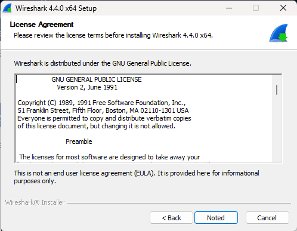
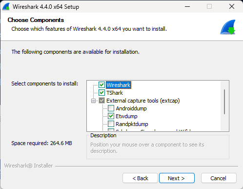
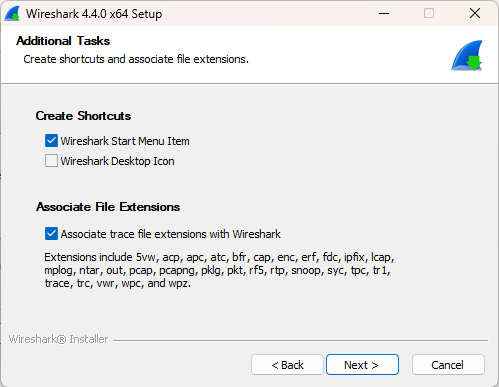
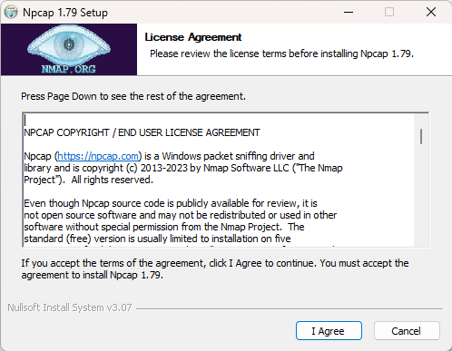

Windows是较多同学通常使用的系统，本文将引导你完成Windows端Wireshark安装，用于捕捉Windows端网络通信数据包

## 1 下载Wireshark

> 官方网站： https://www.wireshark.org/

* 打开Wireshark官方网站，点击“Download”

  

* 页面将跳转至下载选项，请根据系统情况选择对应版本
  * X86架构：Windows x64 Installer，可选免安装版本PortableApps
  
  * ARM架构：Windows Arm 64 Installer
  
     

* 如使用免安装版本，下载完成后即可直接启动，无需另行安装

##  2 安装WireShark

* 打开下载完成的WireShark安装包，阅读并同意EULA

  

* 选择要安装的组件，请至少选择默认组件

  

* 配置附加任务，建议选择扩展名关联，以便快速打开捕捉记录文件

  

* 选择合适的安装目录

  

* 选择安装Npcap，该项为网络抓包用途必选

  

* 如无捕捉USB通讯流量需求，无需选择安装USBcap

  

* 安装过程中，安装向导将同时启动Npcap安装，可保持默认选项

  

* Npcap安装完成后，请留意完成安装向导，否则将持续阻塞Wireshark安装过程

  