import LinkCard from '@site/src/components/LinkCard';
import Tabs from '@theme/Tabs';
import TabItem from '@theme/TabItem';
import {Alert} from 'antd';

请根据你的设备平台，阅读相应的安装指导：

## 1 下载Wireshark
<Tabs className="unique-tabs"  groupId="operating-systems">
  <TabItem value="Windows">

* 打开Wireshark官方网站，点击“Download”

<LinkCard title="Wireshark官方网站" url="https://www.wireshark.org/" > 
The world's most popular network protocol analyzer
Get started with Wireshark today and see why it is the standard across many commercial and non-profit enterprises.
</LinkCard>
<br/>

    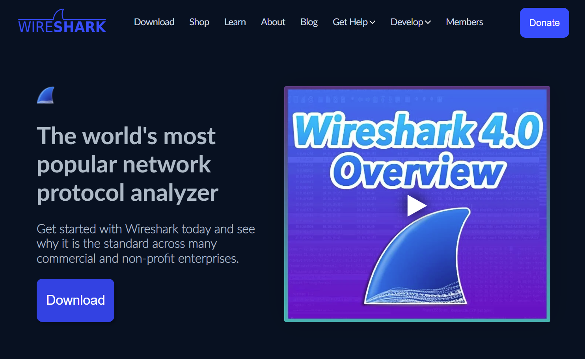

* 页面将跳转至下载选项，请根据系统情况选择对应版本
  * X86架构：Windows x64 Installer，可选免安装版本PortableApps

  * ARM架构：Windows Arm 64 Installer

    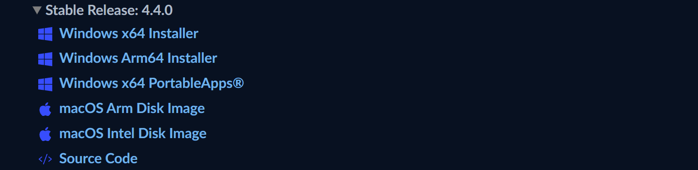

* 如使用免安装版本，下载完成后即可直接启动，无需另行安装

</TabItem>
<TabItem value="Linux">
Linux用户无需从官方网站下载安装包，请直接进行安装

</TabItem>
<TabItem value="macOS">
<Alert
message="该文档存在待解决问题"
type="warning"
showIcon
description="由于助教没有macOS设备，无法测试教程的有效性，如遇到问题请联系助教更正，感谢理解"
/>
<br/>
* 打开Wireshark官方网站，点击“Download”

<LinkCard title="Wireshark官方网站" url="https://www.wireshark.org/" > 
The world's most popular network protocol analyzer
Get started with Wireshark today and see why it is the standard across many commercial and non-profit enterprises.
</LinkCard>

  

* 页面将跳转至下载选项，请根据系统情况选择对应版本
  * M* Soc：macOS Arm Disk Image

  * 使用Intel芯片的旧Mac：macOS Intel Disk Image

    

</TabItem>
</Tabs>
##  2 安装WireShark

<Tabs className="unique-tabs"  groupId="operating-systems">
  <TabItem value="Windows">

* 打开下载完成的WireShark安装包，阅读并同意EULA

  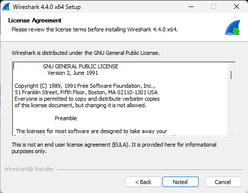

* 选择要安装的组件，请至少选择默认组件

  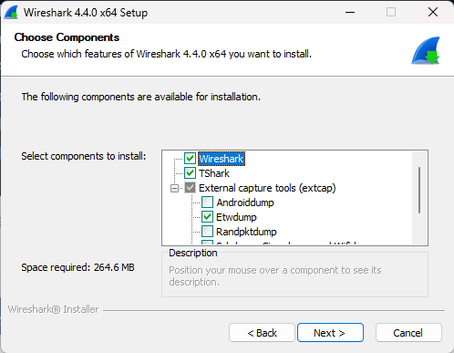

* 配置附加任务，建议选择扩展名关联，以便快速打开捕捉记录文件

  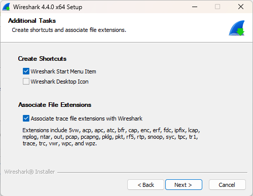

* 选择合适的安装目录

  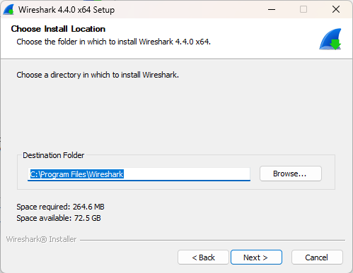

* 选择安装Npcap，该项为网络抓包用途必选

  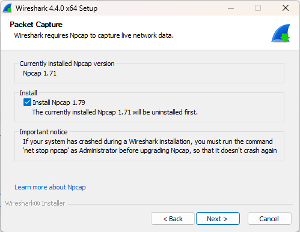

* 如无捕捉USB通讯流量需求，无需选择安装USBcap

  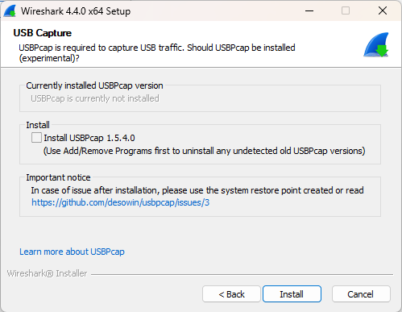

* 安装过程中，安装向导将同时启动Npcap安装，可保持默认选项

  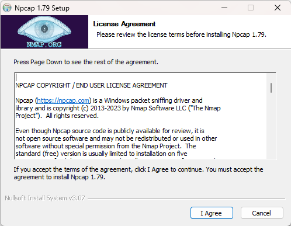

* Npcap安装完成后，请留意完成安装向导，否则将持续阻塞Wireshark安装过程

  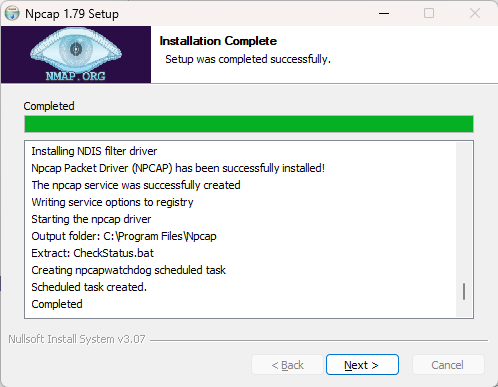
  在Lab7/8中，较多同学会选择在WSL上完成实验，此时宿主机Windows无法捕获WSL内部的网络活动。为了对实现的程序抓包，你将需要在其运行的Linux发行版上安装Wireshark

</TabItem>
<TabItem value="Linux">

:::warning 安装要求

如果你正在为WSL安装Wireshark，为了正常使用GUI页面操作，请使用WSL2版本的Linux发行版

:::


* 打开终端

* 更新包列表

<Tabs className="unique-tabs"  groupId="operating-systems">
  <TabItem value="基于Debian(Ubuntu, Mint, Kali Linux等)">
    ```
    sudo apt update
    ```
  </TabItem>
  <TabItem value="基于Red Hat(Fedora, CentOS, RHEL等)">
    ```
    sudo yum update
    ```
  </TabItem>
    <TabItem value="基于Arch Linux">
  ```
  sudo pacman -Syy
  ```
  </TabItem>
</Tabs>

* 安装Wireshark

<Tabs className="unique-tabs"  groupId="distros">
  <TabItem value="基于Debian(Ubuntu, Mint, Kali Linux等)">
    ```
    sudo apt install wireshark
    ```
  </TabItem>
  <TabItem value="基于Red Hat(Fedora, CentOS, RHEL等)">

  ```
  sudo yum install wireshark
  ```
  </TabItem>
  <TabItem value="基于Arch Linux">
  ```
  sudo pacman -S wireshark
  ```
  </TabItem>
</Tabs>


安装完成后，你可能可在开始菜单中看到有Tux角标的Wireshark：


</TabItem>
<TabItem value="macOS">


* 打开下载完成的WireShark安装包，将Wireshark拖动到Applications中进行安装

  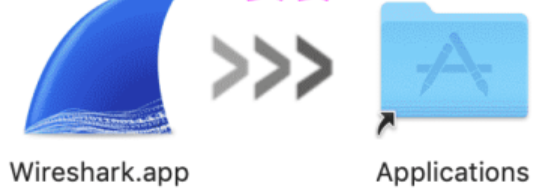

* 安装ChmodBPF

  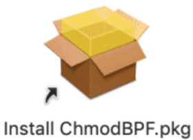

  :::important 提示

  如安装完成后，仍提示“You don’t hava permission to capture. You can install ChmodBPF to fix this.”，则该提示通常可忽略

  :::

* 如无法抓包，则可能需要配置授权，打开终端，执行以下命令：

  ```
  sudo chmod 777 /dev/bpf*
  ```

</TabItem>
</Tabs>

## 3 配置Wireshark权限
<Tabs className="unique-tabs"  groupId="operating-systems">
  <TabItem value="Windows">

通常你无需关注该步骤，如无法检测到部分NIC，请尝试使用管理员权限启动Wireshark

</TabItem>
<TabItem value="Linux">

:::info

本步骤不是必须的，如果你不想执行该操作，也可选择在每次启动时使用以下命令：

```
sudo wireshark
```

请注意，在Windows中选择以管理员身份启动与以上命令不等效，无法正常进行捕获

:::

由于Wireshark可以捕获网络数据包，通常需要root权限运行，为了简化操作并保证权限安全，你可将使用的用户添加到wireshark用户组

```
sudo usermod -aG wireshark [你的用户名]
```

执行完成后，**关闭当前终端会话**，重新启动终端后再通过命令/Windows快捷方式启动Wireshark即可正常捕获网络数据包
</TabItem>
<TabItem value="macOS">


  :::important 提示

  如安装完成后，仍提示“You don’t hava permission to capture. You can install ChmodBPF to fix this.”，则该提示通常可忽略

  :::

如无法抓包，则可能需要配置授权，打开终端，执行以下命令：

  ```
  sudo chmod 777 /dev/bpf*
  ```

</TabItem>
</Tabs>