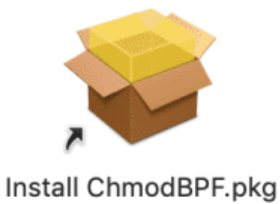

:::warning 该文档存在待解决问题

由于助教没有macOs设备，无法测试教程的有效性，如遇到问题请联系助教更正，感谢理解

:::

## 1 下载Wireshark

> 官方网站： https://www.wireshark.org/

* 打开Wireshark官方网站，点击“Download”

  

* 页面将跳转至下载选项，请根据系统情况选择对应版本
  * M* Soc：macOS Arm Disk Image
  
  * 使用Intel芯片的旧Mac：macOS Intel Disk Image
  
     


##  2 安装WireShark

* 打开下载完成的WireShark安装包，将Wireshark拖动到Applications中进行安装

  

* 安装ChmodBPF

  

  :::important 提示

  如安装完成后，仍提示“You don’t hava permission to capture. You can install ChmodBPF to fix this.”，则该提示通常可忽略

  :::

* 如无法抓包，则可能需要配置授权，打开终端，执行以下命令：

  ```
  sudo chmod 777 /dev/bpf*
  ```

  