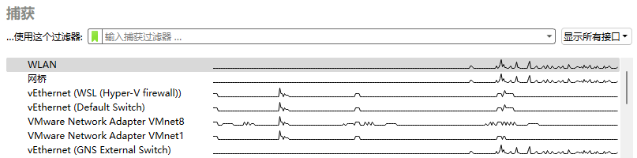
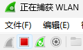
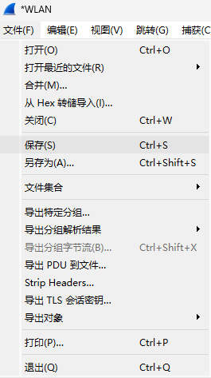
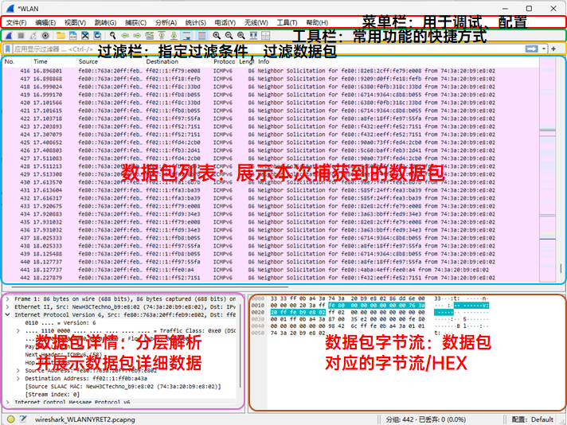
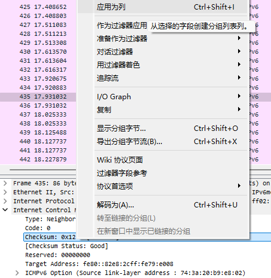
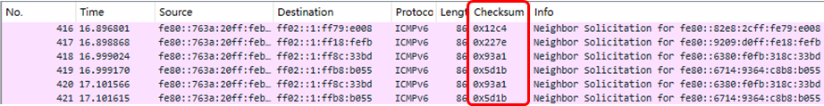
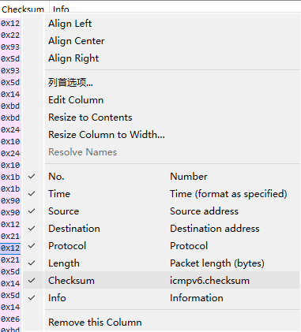
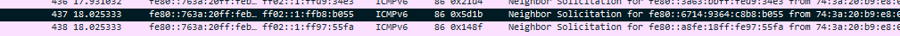
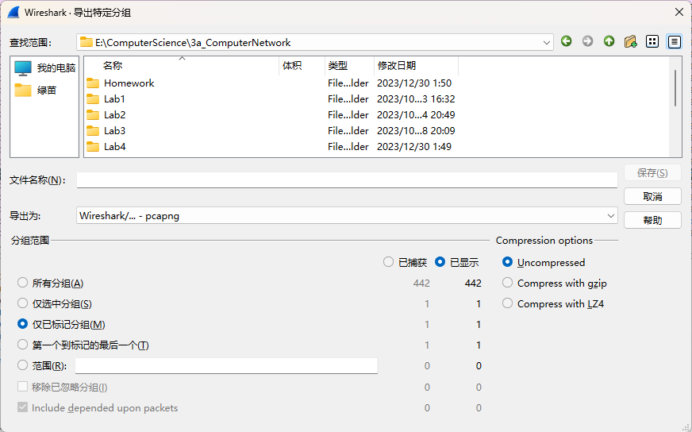
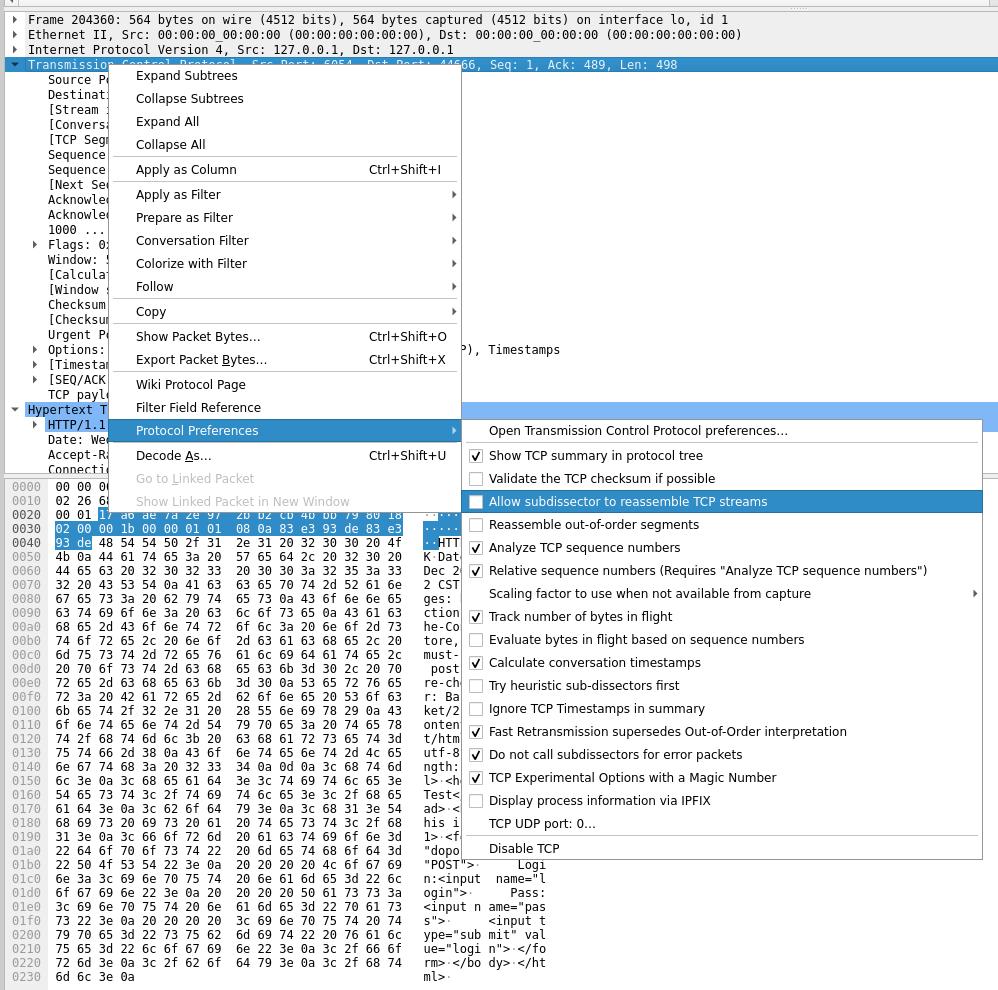

import LinkCard from '@site/src/components/LinkCard';
import Tabs from '@theme/Tabs';
import TabItem from '@theme/TabItem';
import {Alert} from 'antd';

## 1 安装Wireshark

请根据你的设备平台，阅读相应的安装指导：

<Tabs className="unique-tabs">
  <TabItem value="Windows">
    <LinkCard title="Windows端安装" url="../wireshark/Windows">本文将引导你在运行Windows的设备上下载并安装Wireshark，点击跳转至相应文档</LinkCard>
  </TabItem>
  <TabItem value="Linux">
    <LinkCard title="Linux端安装" url="../wireshark/Linux">本文将引导你在运行不同Linux发行版的设备上安装Wireshark并配置权限，点击跳转至相应文档</LinkCard>
  </TabItem>
  <TabItem value="macOS">
    <LinkCard title="macOS端安装" url="../wireshark/mac">本文将引导你在macOS设备上下载安装Wireshark并配置权限，点击跳转至相应文档</LinkCard>
  </TabItem>
</Tabs>

## 2 WireShark上手应用

:::warning 启动前注意事项
建议在启动Wireshark前关闭VPN，避免对数据包抓取产生干扰
建议尽可能多地关闭当前使用网络的应用程序，或直接运行在虚拟环境中，以免无关数据包影响分析
:::

### 2.1 抓包基本流程

* 启动Wireshark后，首页会展示可捕获的网络接口列表，右侧折线表示相应设备的网络活动流量

  * 如你希望捕捉单个NIC的流量，可直接双击相应的接口开始捕获
  * 如需要同时捕获多个NIC的流量，请按住Ctrl，同时点选所需的NIC，选择完成后按Enter开始捕捉

  

* 开始捕获后，可点击工具栏上的红色按钮停止抓包，绿色鲨鱼鳍按钮重新开始对当前选定NIC的抓包

  

* 停止抓包后，可点选文件-保存，将抓包得到的数据保存供后续使用

  

### 2.2 Wireshark 功能与界面介绍

* 设置显示列

  我们可能希望关注捕获得到数据包中的特定字段，逐一展开每个数据包相当繁琐，此时我们可以自定义Wireshark需要展示的列

  点击一个数据包，在数据包详情中点选关注的字段，右键-选择应用为列

  

  可见数据流列表内直接展示了我们关注的信息

  

* 取消展示列

  当我们浏览完关注的列，可在数据包列表右键相应列，点击勾选的该列取消展示，即可隐藏该列

  

* 标记数据包

  当数据包量较多时，寻找刚刚浏览过的数据包可能变得非常麻烦，我们可对其进行标记，方便后续查看

  点选数据包，按下Ctrl+M即可进行标记，对标记的数据包再次按下Ctrl+M即可取消

  

* 分组导出数据包

  许多时候，由于无关软件的干扰，我们会捕获海量无关数据包，使最后保存的文件体积过大，我们可以利用标记数据包的功能，有选择性地仅需要的数据包

  点击菜单栏-文件-导出特定分组，选择"Marked packets only/仅已标记分组"即可

  

### 2.3 过滤器的使用

过滤器分为抓包过滤器和显示过滤器，前者在抓包前配置，配置后仅捕获过滤后的数据包；后者捕获所有数据包，但仅展示过滤后的数据包

Wireshark的过滤器使用LibPcap编写，如需了解完整内容，请参阅官方文档：

<LinkCard title="pcap-filter(7) man page" url="https://www.tcpdump.org/manpages/pcap-filter.7.html" style={{marginBottom: 20}}>
This man page documents libpcap version 1.11.0-PRE-GIT (see also: [1.10.5](https://www.tcpdump.org/manpages/libpcap-1.10.5/pcap-filter.7.html), [1.10.4](https://www.tcpdump.org/manpages/libpcap-1.10.4/pcap-filter.7.html), [1.10.2](https://www.tcpdump.org/manpages/libpcap-1.10.2/pcap-filter.7.html), [1.10.1](https://www.tcpdump.org/manpages/libpcap-1.10.1/pcap-filter.7.html), [1.10.0](https://www.tcpdump.org/manpages/libpcap-1.10.0/pcap-filter.7.html), [1.9.1](https://www.tcpdump.org/manpages/libpcap-1.9.1/pcap-filter.7.html), [1.8.1](https://www.tcpdump.org/manpages/libpcap-1.8.1/pcap-filter.7.html), [1.7.4](https://www.tcpdump.org/manpages/libpcap-1.7.4/pcap-filter.7.html), [1.6.2](https://www.tcpdump.org/manpages/libpcap-1.6.2/pcap-filter.7.html), [1.5.3](https://www.tcpdump.org/manpages/libpcap-1.5.3/pcap-filter.7.html)).
Your system may have a different version installed, possibly with some local modifications. To achieve the best results, please make sure this version of this man page suits your needs. If necessary, try to look for a different version on this web site or in the man pages available in your installation.
</LinkCard>
 

:::important 提示
[]表示可出现0/1次，|表示可选择任一，纯大写字母表示过滤内容

例：`ether [src|dst] host MAC`

`ether host FF……`筛选该MAC来往数据包，`ether src host FF……`筛选该MAC发送数据包
:::

* 数据链路层过滤
  * 指定MAC地址 `ether [src|dst] host MAC` 
  * 指定广播/多播 `[ether] broadcast|multicast`
  * 指定VLAN `vlan <vlan>`
* 网络层过滤
  * 过滤IP地址 `[ip|ip6|arp|rarp] [src|dst] host IP`
  * 过滤子网 `[src|dst] net SUBNET [{mask MASK}|{/LEN}]`
* 传输层过滤
  * 过滤端口号 `[tcp|udp] [src|dst] port|portrange PORT`
  * 过滤协议 `协议名称`（如ip, arp, ip6）
* 过滤表达式复合
  * 与、或、非 `%%、||、!`
  * 指定协议数据包引用位置 `协议名称 [所取首字节偏移量:总截取长度]`
  * 数据包长度 `len`
  * 算术表达式  由整型常量、二元运算符（支持+、-、*、/、%、&、|、^、位运算）、长度运算符和对指定协议数据包数据引用运算符
  * 关系表达式 `算术表达式 关系运算符 算术表达式`

## 3 Wireshark使用延伸

<Alert
message="该部分存在待解决问题"
type="warning"
showIcon
description="本节将列举一些Wireshark实际应用的例子，这些文章还没有完成格式适配，请稍后再来延伸阅读查看吧"
/>

## 4 Q&A

* Lab8可以正常加载网页/图片，完成登录验证，但Wireshark里响应包不能被正常识别为HTTP数据包/解析混乱

  部分版本的Wireshark默认启用了TCP reassembly，请在数据包详情栏右键HTTP协议，选择ProtocalPreferences/协议首选项，关闭"Allow subdissector to reassemble TCP streams"

  

  
