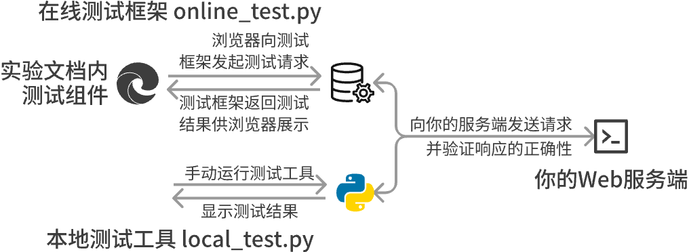
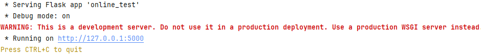
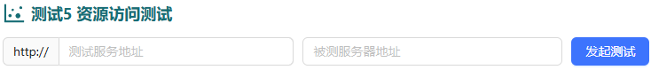
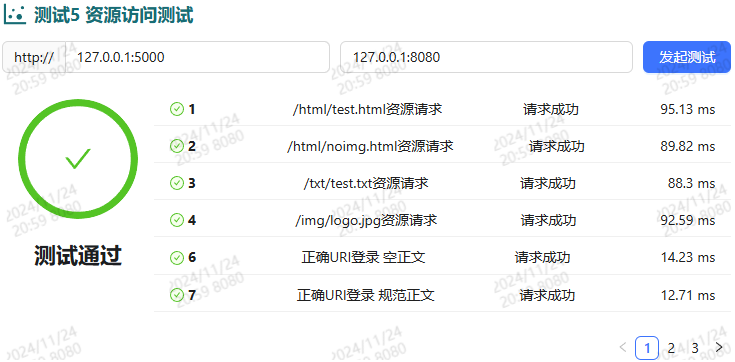

import LinkCard from '@site/src/components/LinkCard';
import Tabs from '@theme/Tabs';
import TabItem from '@theme/TabItem';

## 1 测试框架运行环境配置

Lab7-8分别要求你实现Socket 服务端+客户端/Web服务器，为了测试正确性，我们为你提供了一套测试框架，可在能与服务端建立连接的环境内，与你编写的服务端进行连接与功能验证

### 1.1 拉取测试仓库代码

请在可与被测试服务端建立连接的系统环境下，Clone该仓库

<LinkCard title="编程实验测试框架" url="https://github.com/lvmiao233/NetLabFramework"  icon="https://github.githubassets.com/favicons/favicon.svg">
    {"计算机网络 Lab7-8 测试框架"}
</LinkCard>

```
git clone https://github.com/lvmiao233/NetLabFramework.git
```

### 1.2 安装Python

我们的测试框架使用Python编写，在Python3.10+进行了测试，根据依赖包/特性需求，至少需要Python3.8+，如果你尝试使用较老版本运行时出现问题，请先尝试更新/使用较新版本

如果你测试的系统环境没有安装Python，可参考以下方式：

* 直接安装Python3

  <Tabs className="unique-tabs"  groupId="operating-systems">
  <TabItem value="Linux">

  ```bash
  sudo apt update
  sudo apt install python3
  # 默认安装的可能并非预期版本，你可以指定安装版本，但安装源不一定有相应包
  # sudo apt install python3.12
  ```

  </TabItem>
  <TabItem value="macOS">

  macOS通常自带一个较老版本的Python，你可以使用以下命令检查安装的Python版本

  ```
  python --version
  ```

  如果需要安装Python，请使用：

  ```
  brew install python
  ```

  </TabItem>
  <TabItem value="Windows">

  <LinkCard title="在Windows上使用Python" url="https://learn.microsoft.com/zh-cn/windows/python/beginners" icon="https://learn.microsoft.com/favicon.ico">
      {"Microsoft Learn"}
  </LinkCard>

  </TabItem>
  </Tabs>

* 安装Anaconda/MiniConda/Pixi等包/环境管理器

  实际使用中，很多项目对Python版本/依赖包版本有严格的要求，微小的差别都可能会导致项目运行出现严重问题，为了在同一台设备的不同项目间便捷地切换不同版本的Python/依赖，你可以选择Anaconda等发行版

  目前使用较多的是Anaconda/MiniConda（后者预置的科学计算包较少，你可以手动安装所需依赖），你可以通过以下文档了解其区别，并选择需要的进行安装

  <LinkCard title="Anaconda Documentation" url="https://docs.anaconda.com/distro-or-miniconda/"  icon="https://docs.anaconda.com/_static/img/favicon.ico">
      {"Should I use Anaconda Distribution or Miniconda?"}
  </LinkCard>

  目前较新推出的一些环境管理工具在环境解析等方面具有较好的性能，你也可以选择了解使用

### 1.3 安装依赖包

安装`requirements.txt`中列出的依赖包

```bash
pip install -r requirements.txt
```


## 2 测试框架使用

Lab7-8中，我们分别实现了Socket服务端/客户端、WEB服务端，为了能够测试服务端实现的正确性，我们需要模拟客户端的连接，并对相应部分的功能进行请求与测试

为了便于你进行测试，我们提供了在线与本地测试两种版本，在与你的被测程序交互方面，两者使用完全一致的逻辑，其主要区别体现在发起测试的方式



* 在线版本

  运行在线版本的测试框架后，可在实验文档网站内填入相关信息发起测试，浏览器会向测试框架发起请求，测试框架对你的被测程序进行测试并返回测试结果，由浏览器在网页上呈现

  因此，在线测试框架本质上是在浏览器和你的Web服务端之间的一个**中介**Web服务端，我们使用了较为流行的Flask进行实现，这一版本同时也作为目前主流Web服务端的简单DEMO，供你学习与参考

* 本地版本

  可直接通过CLI运行测试工具，直接对你的被测程序进行测试，并输出测试结果，不需要持续启用服务/网站内操作

### 2.1 框架解释

**我们提供给你下载运行的框架**
* 测试服务地址： 测试框架运行时监听的IP与端口号，测试页面需要通过该地址连接到测试服务，发起测试请求并根据响应展示结果

**你的被测程序**
* Socket服务端地址：Socket服务端运行的IP与端口号，测试服务需要通过该地址和你的被测程序建立连接并测试功能实现的正确性
* Web服务器地址：Web服务器运行的IP与端口号，测试页面需要通过该地址和你的被测程序建立连接并测试功能实现的正确性

**测试结果**
* 请求成功：该用例测试通过
* 响应错误：你的被测程序成功返回了内容，但与预期响应内容不符
* 运行错误：你的被测程序运行时发生了问题，或返回了测试框架无法解析的内容
* 请求超时：规定时间内（800ms）未能完整返回响应

### 2.2 确认服务所在IP与端口

通常情况下，对于宿主机→WSL / 同系统环境的测试，使用本地环回地址`127.0.0.1`均能完成测试

如果无法连接到服务端，请检查端口是否填写正确，且未被拦截（如：防火墙/VPN）

测试服务端默认运行于`5000`端口，你可以在服务端启动时观察运行地址



Socket服务端端口为你的学号后4位，如果后4位中首位为0，请在最前添加1将其补全到5位

Socket服务端如存在缺陷，可能导致无法正确释放端口，此时你可能无法使用指定的端口进行连接，建议退出后等待2分钟左右重试

### 2.3 进行测试

<Tabs className="unique-tabs">
<TabItem value="在线测试">

使用以下指令启动在线测试服务：

```
python online_test.py
```

启动后，打开实验文档网址，填入测试服务IP+端口号（如：`127.0.0.1:5000`）/被测程序Socket服务端地址（如：`127.0.0.1:8080`），并指定其他测试参数（如有），点击发起测试进行测试



测试完成后，将会显示包含用例名称、测试状态、测试用时的测试结果，你可以翻页对每个测试用例进行查看



</TabItem>
<TabItem value="本地测试">

测试需要指定Socket服务端地址`host`、端口`port`、测试线程数等参数

```bash
python local_test.py --lab [实验序号] --test [测试序号] --host [被测程序IP] --port [被测程序端口] --threads [测试使用线程数]
```

测试完成后，将会显示测试结果

```kotlin
+-------+--------------------------+--------+-----------+
| Index |           Name           | Status | Time (ms) |
+-------+--------------------------+--------+-----------+
|   1   |  /html/test.html资源请求  |  Pass  | 89.70 ms  |
|   2   |  /html/noimg.html资源请求 |  Pass  | 88.50 ms  |
|   3   |   /txt/test.txt资源请求   |  Pass  | 80.74 ms  |
|   4   |   /img/logo.jpg资源请求   |  Pass  | 88.89 ms  |
|   6   |     正确URI登录 空正文     |  Pass  | 12.42 ms  |
|   7   |    正确URI登录 规范正文    |  Pass  | 12.89 ms  |
|   8   |    正确URI登录 错误正文    |  Pass  | 10.64 ms  |
|   9   |     错误URI登录 空正文     |  Pass  | 11.17 ms  |
|  10   |    错误URI登录 规范正文    |  Pass  | 9.814 ms  |
|  11   |    错误URI登录 错误正文    |  Pass  | 9.984 ms  |
|  12   |     错误URI 1 资源请求    |  Pass  | 9.407 ms  |
|  13   |     错误URI 2 资源请求    |  Pass  | 9.203 ms  |
|  14   |     错误URI 3 资源请求    |  Pass  | 6.705 ms  |
|  15   |     错误URI 4 资源请求    |  Pass  | 6.419 ms  |
+-------+--------------------------+--------+-----------+
Lab8 测试5 资源访问测试 Test Passed
```

</TabItem>
</Tabs>
