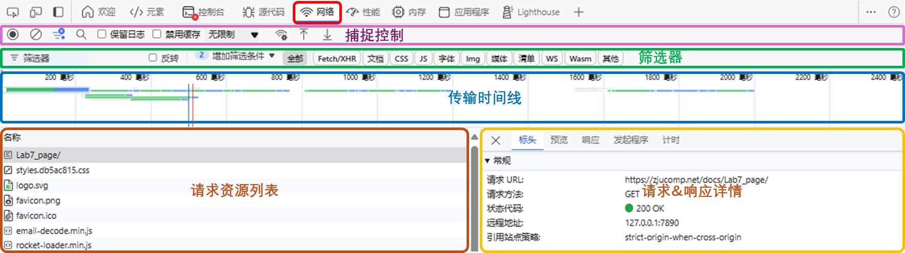
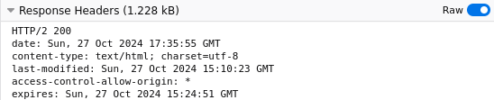

import LinkCard from '@site/src/components/LinkCard';
import Tabs from '@theme/Tabs';
import TabItem from '@theme/TabItem';

## 1 系统配置（仅Windows用户）

上学期开始，MiniSQL、MiniOS等较多实验均会在WSL上完成，对于我们的编程实验，我们同样推荐你在WSL上完成

微软提供了一套WSL开发配置的最佳实践，在我们的实验中，你只需要完成以下的必要部分即可

* 安装WSL

  <LinkCard title="安装WSL" url="https://learn.microsoft.com/zh-cn/windows/wsl/install"  icon="https://learn.microsoft.com/favicon.ico">
  {"如何使用 WSL 在 Windows 上安装 Linux"}
  </LinkCard>


  你可以使用`wsl --list --online`列出可安装的WSL发行版，并选择合适的版本，使用`wsl --install -d [DistroName]`安装相应发行版

  这里推荐使用Ubuntu22.04或更新的版本，尽管我们的实验在稍旧的版本上应当能正常完成，但完成OS实验时你可能就会遭重了（

  安装完成后，如果你的C盘剩余空间较小，建议你在创建用户前，按照以下教程将WSL迁移到剩余空间较多的盘符中
  <LinkCard title="迁移WSL到其他磁盘" url="https://developer.baidu.com/article/details/3335475"  icon="https://developer-resource.bj.bcebos.com/images/developerLogo.ico">
  {"WSL迁移全攻略：从C盘到其他盘区的无缝迁移"}
  </LinkCard>


* 配置WSL用户与密码

  <LinkCard title="配置WSL用户与密码" url="https://learn.microsoft.com/zh-cn/windows/wsl/setup/environment?source=recommendations#set-up-your-linux-username-and-password"  icon="https://learn.microsoft.com/favicon.ico">
  {"安装完成后，系统将要求你创建用户名和密码。"}
  </LinkCard>


* 更新、升级包

  <LinkCard title="更新、升级包" url="https://learn.microsoft.com/zh-cn/windows/wsl/setup/environment?source=recommendations#update-and-upgrade-packages"  icon="https://learn.microsoft.com/favicon.ico">
  {"建议使用发行版的首选包管理器定期更新和升级包。"}
  </LinkCard>


  如使用默认源速度较慢，请切换至清华源（建议不要使用浙大源），可参考清华源提供的文档

  <LinkCard title="Ubuntu 软件仓库" url="https://mirrors.tuna.tsinghua.edu.cn/help/ubuntu/"  icon="https://mirrors.tuna.tsinghua.edu.cn/static/img/favicon.png">
  {"Ubuntu 软件仓库 | 清华大学开源软件镜像站"}
  </LinkCard>


* 设置Windows Terminal

  <LinkCard title="设置Windows Terminal" url="https://learn.microsoft.com/zh-cn/windows/wsl/setup/environment?source=recommendations#set-up-windows-terminal"  icon="https://learn.microsoft.com/favicon.ico">
  {"主要功能包括多个选项卡、窗格、Unicode 和 UTF-8 字符支持、GPU加速文本呈现引擎"}</LinkCard>


  这一步并不是必选的，但Windows Terminal可提供显著优于自带的命令提示符/PowerShell的使用体验，我们强烈推荐你进行安装

* 安装Git

  <LinkCard title="使用 Git 设置版本管理" url="https://learn.microsoft.com/zh-cn/windows/wsl/tutorials/wsl-git"  icon="https://learn.microsoft.com/favicon.ico">
  {"使用Git，可以跟踪对文件所做的更改，简化协作，使多个人员所做的更改全部合并到一个源中。"}</LinkCard>


  如果你选择独立完成实验，本步骤不是必须的，但我们仍然推荐你使用git进行版本管理，保留版本间追溯/回退的空间

  如果你选择组队完成实验，你的代码必须以**私有**仓库的形式托管在[Github](https://github.com/)/[GitLab](https://gitlab.com/users/sign_in)/[ZJUGit](https://git.zju.edu.cn)等代码托管平台上，不得公开存储

## 2 编译环境配置


<Tabs className="unique-tabs"  groupId="operating-systems">
  <TabItem value="Linux">

* 更新软件源 `sudo apt-get update`

  可能需要输入密码；如使用默认源速度较慢，请切换至清华源（建议不要使用浙大源）

  <LinkCard title="Ubuntu 软件仓库" url="https://mirrors.tuna.tsinghua.edu.cn/help/ubuntu/"  icon="https://mirrors.tuna.tsinghua.edu.cn/static/img/favicon.png">
  {"Ubuntu 软件仓库 | 清华大学开源软件镜像站"}</LinkCard>


* 安装/更新编译工具 `sudo apt install gcc g++ cmake`

  确认安装时，输入`Y`并回车进行确认

* 检查安装状态

  依次输入以下指令，观察是否报错，如正确显示相应工具的版本则说明已成功安装

  ```
  gcc --version
  g++ --version
  ```

</TabItem>
<TabItem value="macOS">

macOS通常自带Apple Clang，无需手动安装，如需检查安装状态，请在终端中依次输入以下指令，观察是否报错，如正确显示相应工具的版本则说明已成功安装

```
gcc --version
g++ --version
```

</TabItem>
<TabItem value="Windows">

* 安装tdm-gcc（或你喜欢的编译环境）

  <LinkCard title="tdm-gcc" url="https://jmeubank.github.io/tdm-gcc/"  icon="https://jmeubank.github.io/tdm-gcc/favicon.png">
  {"GCC compiler, Windows-friendly."}
  </LinkCard>


* 检查安装状态

  在终端中依次输入以下指令，观察是否报错，如正确显示相应工具的版本则说明已成功安装

  ```
  gcc --version
  g++ --version
  ```
</TabItem>
</Tabs>

## 3 辅助工具安装

* Glog安装

  Glog是Google推出的一款应用级日志库，能够提供强大的日志记录功能，便于区分日志等级、触发记录代码位置、记录时间等，简化开发排障的过程

  这一步骤不是必须的，你可以根据自己的需求选择

  <Tabs className="unique-tabs"  groupId="operating-systems">
  <TabItem value="Linux">

  使用以下命令，安装Glog

  ```bash
  sudo apt-get install libgoogle-glog-dev
  ```

  如果无法使用包管理器安装，请参考Glog官方文档编译安装，编译所需的CMake在前序步骤已经准备好

  <LinkCard title="Google Logging Library" url="https://google.github.io/glog/stable/build/#bazel"  icon="https://google.github.io/glog/stable/assets/images/favicon.png">
  {"Building From Source"}
  </LinkCard>

  </TabItem>
  <TabItem value="macOS">

  ```
  brew install glog
  ```
  </TabItem>
  <TabItem value="Windows">

  <LinkCard title="window下glog编译" url="https://www.cnblogs.com/cyssmile/p/14570719.html"  icon="https://jmeubank.github.io/tdm-gcc/favicon.png">{"Windows下使用CMake编译Glog"}</LinkCard>

  </TabItem>
  </Tabs>

* Firefox浏览器（仅WSL）

  由于Visual Studio Code / Clion的端口转发功能存在一定问题，在宿主机内访问WSL内HTTP服务器网页可能无法正常加载，我们需要借助WSL2的GUI应用运行能力，在WSL内运行浏览器进行测试

  ```bash
  sudo apt update
  sudo apt install firefox
  sudo apt-get install fonts-wqy-zenhei # 解决中文乱码问题
  ```

  完成安装后，在终端内输入`firefox`启动Firefox浏览器，你的Windows宿主机应当会出现一个浏览器窗口


## 4 编辑器连接WSL（仅Windows用户）

<Tabs className="unique-tabs"  groupId="ide">
  <TabItem value="Visual Studio Code用户">


请参考微软提供的实践方式，连接WSL进行开发

<LinkCard title="开始通过适用于 Linux 的 Windows 子系统使用 Visual Studio Code" url="https://learn.microsoft.com/zh-cn/windows/wsl/tutorials/wsl-vscode"  icon="https://learn.microsoft.com/favicon.ico">
{"Visual Studio Code 以及 WSL 扩展使你能够直接从 VS Code 使用 WSL 作为实时开发环境。"}
</LinkCard>
</TabItem>
<TabItem value="Clion用户">

* 安装Clion

  <LinkCard title="下载Clion" url="https://www.jetbrains.com.cn/clion/download/#section=windows"  icon="https://www.jetbrains.com.cn/favicon.ico?r=1234">
  {"下载Clion：用于C/C++开发的智能跨平台IDE"}
  </LinkCard>

* 获取Clion许可证

  你可以通过以下链接申请Jetbrains教育许可证，获取旗下所有IDE的使用权限，需要提交学信网在读证明，申请通常7日内审核，期间你可以暂时使用提供的30天试用期

  <LinkCard title="免费教育许可证" url="https://www.jetbrains.com/zh-cn/community/education/#students/"  icon="https://www.jetbrains.com.cn/favicon.ico?r=1234">
  {"使用 JetBrains 一流的开发工具学习或教授编程！"}
  </LinkCard>

* 连接WSL开发

  打开Clion，选择Remote Development - WSL，点击右上角的New Project创建项目

  

  选择使用的WSL发行版，上传工作进程

  

  选择要使用的Clion版本及项目所在目录，启动IDE并连接

  

</TabItem>
</Tabs>

## 5 浏览器开发人员工具使用

为了让我们能观察网页加载时浏览器和Web服务器间发生的交互，绝大多数浏览器都为我们提供了开发人员工具（按下F12打开），你可以选择其中的网络Tab后刷新页面重载，观察网页加载过程发生的动作，加深对相应知识的理解



如果你的列表中显示的信息较少，可以右键顶部字段（如“名称”），并勾选想要查看的字段，我们推荐你选择方法、状态、域

为了便于你清晰地观察和筛选头字段，开发人员工具有时会对头部进行结构化解析，这个过程可能会丢弃HTTP版本等信息，你可以开启Raw开关查看原始响应（Edge不支持该特性）



关于更多信息，请参见你所使用的浏览器的开发者文档

<Tabs className="unique-tabs"  groupId="browser">
    <TabItem value="Microsoft Edge">
        <LinkCard title="网络功能参考" url="https://learn.microsoft.com/zh-cn/microsoft-edge/devtools-guide-chromium/network/reference"  icon="https://learn.microsoft.com/favicon.ico">
            {"网络功能参考 - Microsoft Edge Developer Documentation | Microsoft Learn"}
        </LinkCard>
    </TabItem>
    <TabItem value="Google Chrome">
        <LinkCard title="网络功能参考" url="https://developer.chrome.com/docs/devtools/network/reference?hl=zh-cn"  icon="https://www.gstatic.com/devrel-devsite/prod/v0e3f58103119c4df6fb3c3977dcfd0cb669bdf6385f895761c1853a4b0b11be9/chrome/images/favicon.png">
            {"网络功能参考 | Chrome Dev Tools | Chrome for Developers"}
        </LinkCard>
    </TabItem>
    <TabItem value="Mozilla Firefox">
        <LinkCard title="Network Monitor" url="https://firefox-source-docs.mozilla.org/devtools-user/network_monitor/"  icon="https://firefox-source-docs.mozilla.org/_static/firefox.ico">
            {"Network Monitor - Firefox  Source Docs Documentation"}
        </LinkCard>
    </TabItem>
</Tabs>
