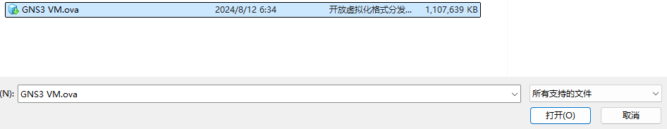
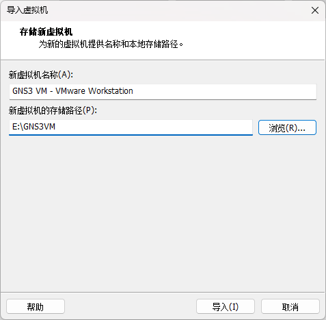
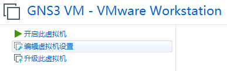
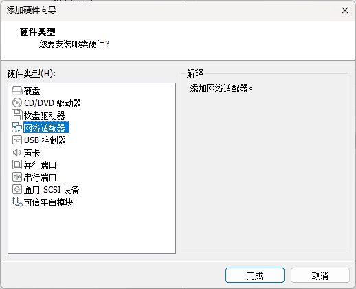
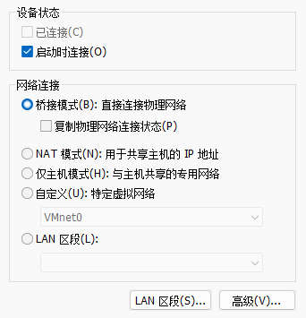
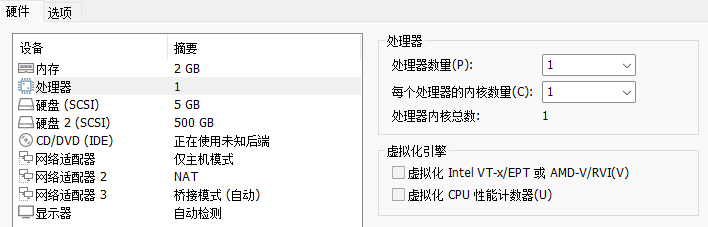
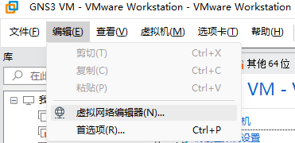
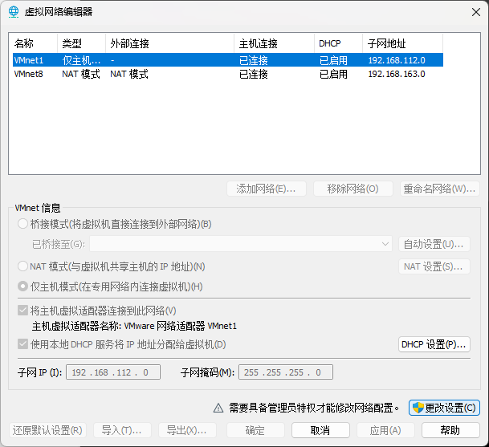
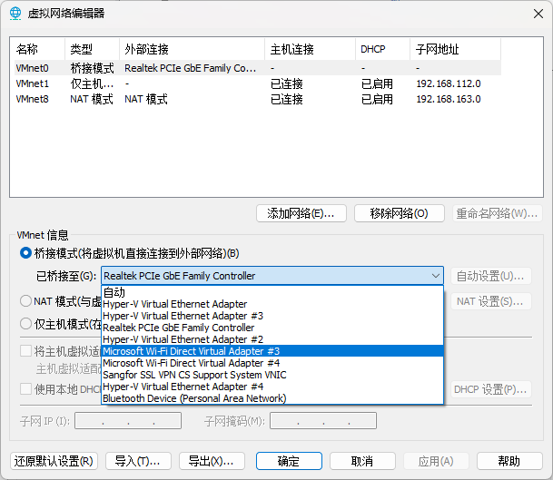
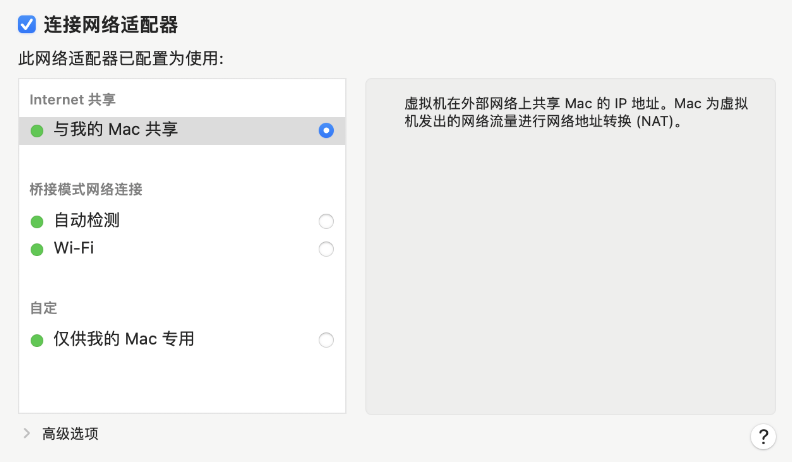

import FileCard from '@site/src/components/FileCard';
import LinkCard from '@site/src/components/LinkCard';
import { Row, Col } from 'antd';
import Tabs from '@theme/Tabs';
import TabItem from '@theme/TabItem';

## 1 安装VMWare Workstation

### 1.1 启用虚拟化平台 [Windows]

对于使用Windows的同学，由于其他实验需要使用WSL，Hyper-V特性会自动启用，为了保证VMWare Workstation的兼容性，需要启用虚拟化平台

<Tabs className="unique-tabs"  groupId="operating-systems">
    <TabItem value="Windows 10">

* 导航到“控制面板”，选择“程序”，然后选择“程序和功能”
* 选择“打开或关闭 Windows 功能”
* 勾选“虚拟化平台”，然后选择“确定”

安装完成后，系统会提示你重启计算机。
    </TabItem>
    <TabItem value="Windows 11">

* 打开设置-系统-可选功能
* 点击最下方的“更多Windows功能”
* 勾选“虚拟化平台”，然后选择“确定”

安装完成后，系统会提示你重启计算机。

    </TabItem>
</Tabs>

### 1.2 下载并安装

博通收购VMWare后，宣布VMWare Workstation Pro等产品面向个人用户免费，因此你现在不必使用任何破解版本

以下是24.10.22为你转存至浙大云盘的版本，较老的版本不影响实验正常进行，但**不能使用VMWare Player**

<Tabs className="unique-tabs"  groupId="operating-systems">
    <TabItem value="Windows">
        <LinkCard url="https://oss.zjucomp.net/VMware-workstation-full-17.6.1-24319023.exe" title="VMware Workstation Pro" icon="https://support.broadcom.com/o/ecx-standard-theme/images/favicon.ico">VMware Workstation Pro for Personal Use (For Windows) 17.6.1</LinkCard>
    </TabItem>
    <TabItem value="macOS">
        <LinkCard url="https://pan.zju.edu.cn/share/89422b3ae5ab1f720cc9ac378b/" title="VMware Funsion Pro" icon="https://support.broadcom.com/o/ecx-standard-theme/images/favicon.ico">VMware Fusion Pro for Personal Use (For Intel-based and Apple silicon Macs) 13.6.1</LinkCard>
    </TabItem>
    <TabItem value="Linux">
        <LinkCard url="https://pan.zju.edu.cn/share/d4cfd82e4a0a8d23ebba08a7f1" title="VMware Workstation Pro" icon="https://support.broadcom.com/o/ecx-standard-theme/images/favicon.ico">VMware Workstation Pro for Personal Use (For Linux) 17.6.1</LinkCard>
    </TabItem>
</Tabs>

如果你希望下载后续推出的最新版本，可前往博通官网

<LinkCard url="https://support.broadcom.com/group/ecx/downloads" title="My Downloads - Support Portal - Broadcom Support Portal" icon="https://support.broadcom.com/o/ecx-standard-theme/images/favicon.ico">My Downloads - VMware Cloud Foundation</LinkCard>
 

## 2 导入GNS3虚拟机

:::warning 注意

如在官方仓库下载，请选择中缀"VM.VMware.Workstation"+与客户端匹配的版本号

GNS3 3.0.0无法正确获取Idle PC，会导致卡死，如果你已经安装了该版本，请卸载客户端与虚拟机后重新安装较老版本，给你带来不便非常抱歉

:::

<Tabs className="unique-tabs"  groupId="platform">
    <TabItem value="Windows / macOS (Intel) / Linux">
        <Row gutter={[16, 4]} justify="space-between">
            <Col xs={24} sm={12}>
                <FileCard link="https://oss.zjucomp.net/GNS3.VM.VMware.Workstation.2.2.50.zip" name="本站镜像源" size={946080449} file_type="cloud"/>
            </Col>
            <Col xs={24} sm={12}>
                <FileCard link="https://github.com/GNS3/gns3-gui/releases" name="Github官方仓库" size={946080449} file_type="github"/>
            </Col>
        </Row>

        * 下载并解压GNS3虚拟机

        * 打开VMware Workstation，选择打开虚拟机

            

        * 选择解压得到的GNS3 VM.ova (macOS请不要使用默认解压，否则会将解压得到的.ova文件再次解压)

            

        * 指定虚拟机的名称与存储路径

            

    </TabItem>
    <TabItem value="macOS (Apple Silicon)">
        <Row gutter={[16, 4]} justify="space-between">
            <Col xs={24} sm={12}>
                <FileCard link="https://oss.zjucomp.net/GNS3.VM.ARM64.2.2.48.zip" name="本站镜像源" size={909808022} file_type="cloud"/>
            </Col>
            <Col xs={24} sm={12}>
                <FileCard link="https://github.com/GNS3/gns3-gui/releases" name="Github官方仓库" size={909808022} file_type="github"/>
            </Col>
        </Row>

        * 下载并解压GNS3虚拟机

        * 打开VMware Workstation，选择创建自定虚拟机，指定系统类型为Linux - Ubuntu 64-bit arm

        * 选择使用现有的虚拟硬盘，选择解压好的两个虚拟磁盘文件中的disk1，确定并完成向导

        * 不要开机，进入虚拟机设置，选择添加设备，选择使用现有的虚拟磁盘，选择解压好的两个虚拟磁盘文件中的disk2

    </TabItem>
</Tabs>

## 3 配置GNS3虚拟机

<Tabs className="unique-tabs"  groupId="operating-systems">
    <TabItem value="Windows / Linux">
        * 选择创建好的虚拟机，点选编辑虚拟机设置

            

        * 点选添加硬件，此时默认已有“仅主机模式”和“NAT模式”两个虚拟网络适配器，我们需要再添加1个桥接网络适配器

            

        * 选择网络适配器

            

        * 将网络连接更改为“桥接模式”（如果缺少仅主机模式/NAT模式的虚拟网络适配器，请按类似方法分别进行添加）

            

        * 在左侧点选**处理器**，**取消勾选虚拟化引擎中全部项目**，并增加“处理器数量”（推荐4个）

            点选**内存**，增加至4G左右（如果内存充裕，可增加更多，但不要超过VMWare的建议上限）点击确定保存设置

            

        * 在VMware Workstation中，点选编辑-虚拟网络编辑器

            

        * 点选更改设置，并授予管理员权限

            

        * 选择VMnet0，更改已桥接至的设备为当前上网所用设备

            :::danger 注意
            如果你使用无线网卡上网，你的无线网卡名称可能类似：Intel® Wifi6 xxxx 或 Realtek xxx Wifi6 或 Mediatek Wifi6 xxxx

            如果你使用有线网卡上网，你的有线网卡名称可能类似：Realtek PCIe GbE Family Controller 或 Realtek PCIe FE Family Controller

            请根据你的实际情况选择，不要照搬图片中的选项，如果找不到使用的网卡，请参考Q&A
            :::

            

        * 点选应用保存设置
    </TabItem>
    <TabItem value="macOS">
        * 选择创建好的虚拟机，点选编辑虚拟机设置，此时默认仅有“与我的Mac共享”1个虚拟网络适配器，我们需要再添加1个“桥接模式”网络适配器、1个“仅供我的Mac专用”网络适配器

        * 点击添加设备，选择网络适配器，选择桥接模式，选择Wifi

            

        * 点击添加设备，选择网络适配器，选择仅供我的Mac专用

            

        * 点选**处理器**，增加“处理器数量”（推荐4个）

        * 点选**内存**，增加至4G左右（如果内存充裕，可增加更多，但不要超过VMWare的建议上限）

    </TabItem>
</Tabs>
