import FileCard from '@site/src/components/FileCard';
import { Alert } from 'antd';
import GridContainer from '@site/src/components/GridContainer';
import Tabs from '@theme/Tabs';
import TabItem from '@theme/TabItem';

## 1 安装 GNS3 客户端

<Alert title="GNS3 3.0.0-3.0.3无法正确获取Idle PC，会导致卡死，如不慎安装，请卸载客户端与虚拟机后重新安装较老或更新版本" type="error" showIcon />

* 下载GNS3 2.2.50（不要下载GNS3 3.0.0-3.0.3版本，Apple Silicon Mac用户请下载2.2.48版本）

    <Tabs className="unique-tabs"  groupId="operating-systems">
        <TabItem value="Windows">
            <GridContainer>
                <FileCard link="https://oss.zjucomp.net/GNS3-2.2.50-all-in-one.exe" name="本站镜像源" size={109551360} file_type="cloud"/>
                <FileCard link="https://github.com/GNS3/gns3-gui/releases" name="Github官方仓库" size={117268057} file_type="github"/>
            </GridContainer>
        </TabItem>
        <TabItem value="macOS (Intel)">
            <GridContainer>
                <FileCard link="https://oss.zjucomp.net/GNS3-2.2.50.dmg" name="本站镜像源" size={117268057} file_type="cloud"/>
                <FileCard link="https://github.com/GNS3/gns3-gui/releases" name="Github官方仓库" size={117268057} file_type="github"/>
            </GridContainer>
        </TabItem>
        <TabItem value="macOS (Apple Silicon)">
            <GridContainer>
                <FileCard link="https://oss.zjucomp.net/GNS3-2.2.48.dmg" name="本站镜像源" size={75917281} file_type="cloud"/>
                <FileCard link="https://github.com/GNS3/gns3-gui/releases" name="Github官方仓库" size={75917281} file_type="github"/>
            </GridContainer>
        </TabItem>
    </Tabs>

* 下载完成后运行安装程序，阅读并同意EULA，设置安装路径等信息

  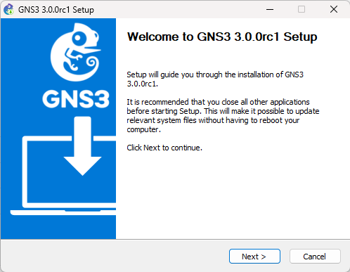

* 指定安装组件，至少需选择GNS3 Desktop，你可以根据需求额外安装其他组件，但**不要选择GNS3 VM**

    :::danger 请按照后续步骤指导单独导入并配置GNS3 VM，**不要勾选这里的GNS3 VM**
    :::

  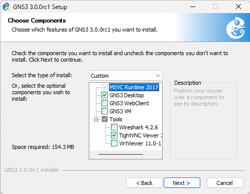

* Solarwinds广告选择No即可

      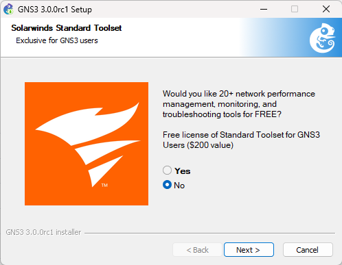

* 完成安装向导

## 2 连接 GNS3 虚拟机

* 启动虚拟机后，耐心等待GNS3服务器程序启动，启动完成后，记录图中的IP与端口

  

* 打开GNS3，点击Edit-Preferences进入首选项

  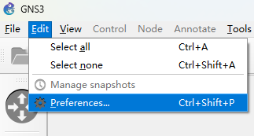

* 点击左侧Server，取消勾选“Enable Local Server“，并填入虚拟机中展示的IP与端口（用户名/密码均为admin，一般请保持默认），点击Apply应用

  

## 3 添加路由器镜像

:::important 请确保已完成第2部分连接操作
:::

* 下载路由器IOS镜像（推荐使用3745）

    <GridContainer>
        <FileCard link="https://oss.zjucomp.net/c3745-adventerprisek.124-25d.bin" name="Cisco 3745" size={39900084} file_type="cloud"/>
        <FileCard link="https://oss.zjucomp.net/cisco2-c3725.bin" name="Cisco 3725" size={22674684} file_type="cloud"/>
        <FileCard link="https://oss.zjucomp.net/c3660-jk9o3s-mz.124-15.T5.bin" name="Cisco 3660" size={90835908} file_type="cloud"/>
    </GridContainer>

* 点击Dynamips下的IOS routers

  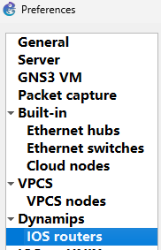

* 点击New，浏览路由器映像文件

  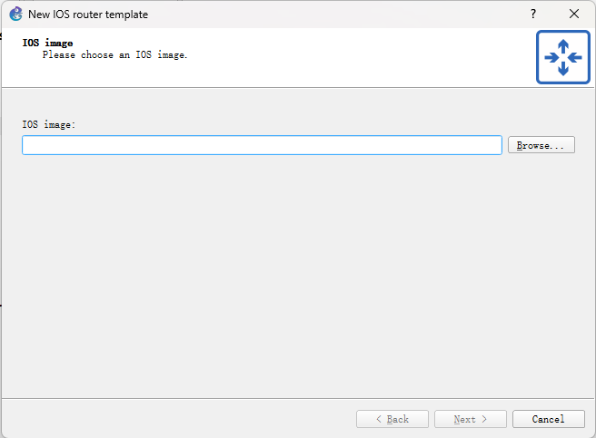

* 根据镜像选择正确的平台型号，如提示无法自动检测型号，可忽略警告

  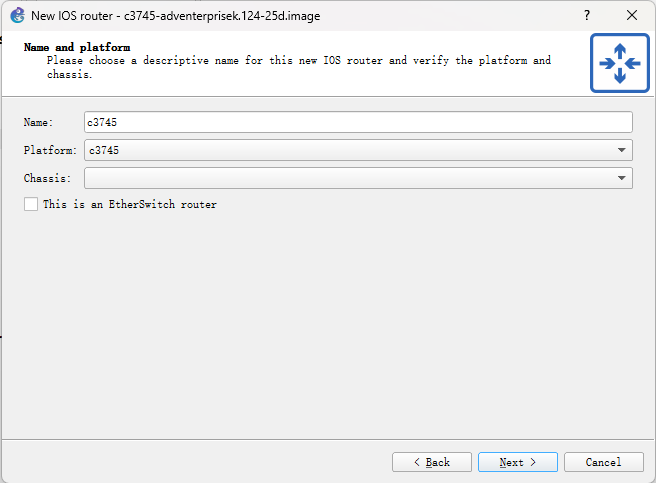

* 指定路由器内存大小，保持默认即可，在完成需较多路由器的实验时，如内存不足可修改为128MB

  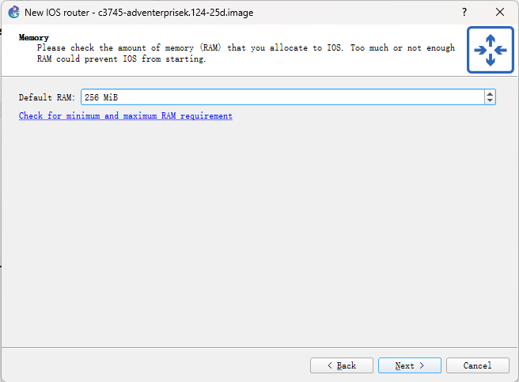

* 为路由器添加一些接口模块

    :::important 根据需求适当添加即可，不需要加满插槽，后续可通过配置重新修改模块类型与数量
    :::

  * NM-1FE-TX 以太网接口模块
  * NM-4T 高速串口模块
  * NM-16ESW 以太网交换模块

  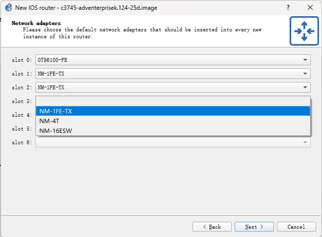

* 添加广域网模块，推荐添加1-2个WIC-2T高速串口模块

  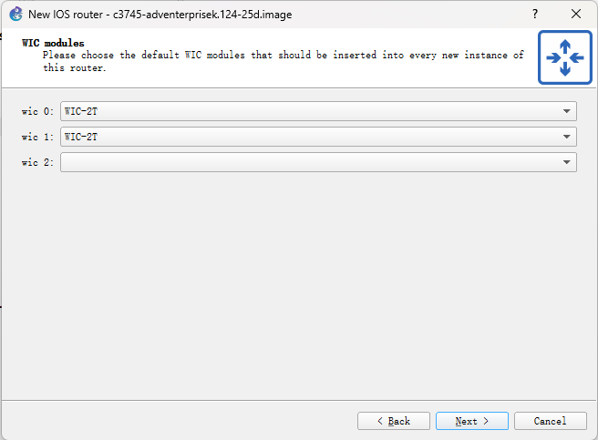

* 点击Idle-PC finder，设置Idle-PC值，避免路由器过度占用CPU资源

  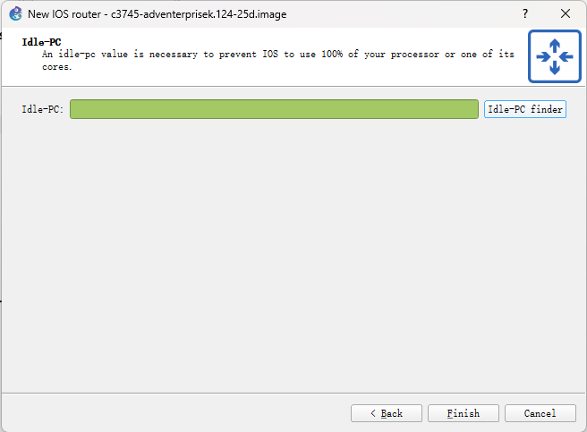
