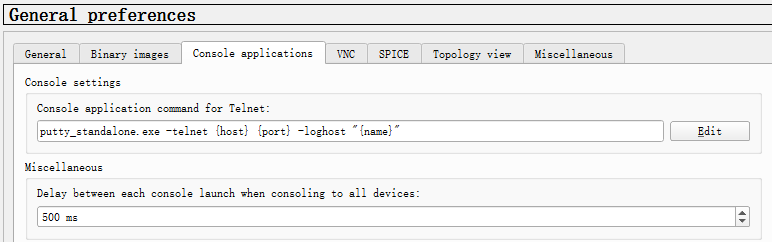
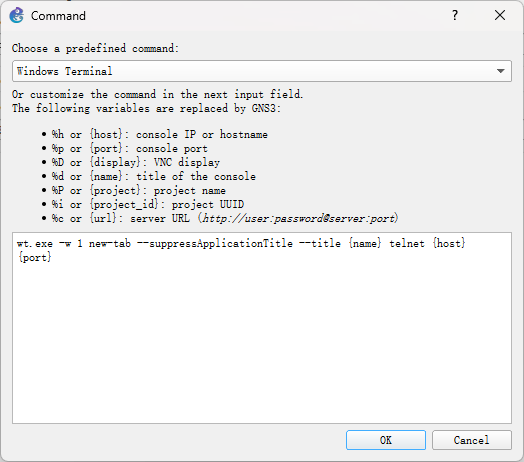

import FileCard from '@site/src/components/FileCard';
import { Row, Col } from 'antd';

## 1 安装 GNS3 客户端

* 下载GNS3 3.0.0rc1（或更新版本）

    <Row gutter={[16, 4]} justify="space-between">
        <Col xs={24} sm={12}>
            <FileCard link="https://pan.zju.edu.cn/share/57acd2792d40b041e5b1ba8df5" name="浙大云盘" size={75078041} file_type="cloud"/>
        </Col>
        <Col xs={24} sm={12}>
            <FileCard link="https://github.com/GNS3/gns3-gui/releases" name="Github官方仓库" size={75078041} file_type="github"/>
        </Col>
    </Row>

* 下载完成后运行安装程序，阅读并同意EULA，设置安装路径等信息

  

* 指定安装组件，至少需选择GNS3 Desktop，你可以根据需求额外安装其他组件

    :::tip 安装向导下载GNS3 VM的速度较慢，你可以按照后续步骤指导单独配置GNS3 VM，不影响正常使用
    :::

  

* Solarwinds广告选择No即可

      

* 完成安装向导

## 2 连接 GNS3 虚拟机

* 启动虚拟机后，耐心等待GNS3服务器程序启动，启动完成后，记录图中的IP与端口

  

* 打开GNS3，点击Edit-Preferences进入首选项

  

* 点击左侧Controller，填入虚拟机中展示的IP与端口（用户名/密码均为admin，通常无需修改），点击Connect连接

  

## 3 添加路由器镜像

:::important 请确保已完成第2部分连接操作
:::

* 下载路由器IOS镜像（推荐使用3745）

    <Row gutter={[16, 4]} justify="space-between">
        <Col xs={24} sm={12}>
            <FileCard link="http://10.214.0.253/network/IOS/CiscoIOS/c3745-adventerprisek.124-25d.bin" name="Cisco 3745" size={39900084} file_type="cloud"/>
        </Col>
        <Col xs={24} sm={12}>
            <FileCard link="http://10.214.0.253/network/IOS/CiscoIOS/cisco2-c3725.bin" name="Cisco 3725" size={22674684} file_type="cloud"/>
        </Col>
        <Col xs={24} sm={12}>
            <FileCard link="http://10.214.0.253/network/IOS/CiscoIOS/c3660-jk9o3s-mz.124-15.T5.bin" name="Cisco 3660" size={90835908} file_type="cloud"/>
        </Col>
    </Row>

* 点击Dynamips下的IOS routers

  

* 点击New，浏览路由器映像文件

  

* 根据镜像选择正确的平台型号，如提示无法自动检测型号，可忽略警告

  

* 指定路由器内存大小，保持默认即可，如内存严重不足，可降低为128MB

  

* 为路由器添加一些接口模块

  * NM-1FE-TX 以太网接口模块（建议添加至少3个）
  * NM-4T 高速串口模块
  * NM-16ESW 以太网交换模块

  

* 添加广域网模块，推荐添加1-2个WIC-2T高速串口模块

  

* 点击Idle-PC finder，设置Idle-PC值，避免路由器过度占用CPU资源

  

## 4 配置自定义终端（可选）

本部分为**可选步骤**，请根据需求权衡是否需要，**实验对使用的终端没有任何要求**

优点：UI美观，字体清晰，支持多标签页，便于同时管理多个设备

缺点：滚动缓冲无效，只能看到当前屏幕的输出

* 如果没有Windows Terminal，可在Microsoft Store下载安装

* 打开GNS3，点击Edit-Preferences进入首选项

  

* 选择Console applications，并点选Edit

  

* 选择Windows Terminal

  

