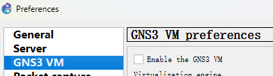
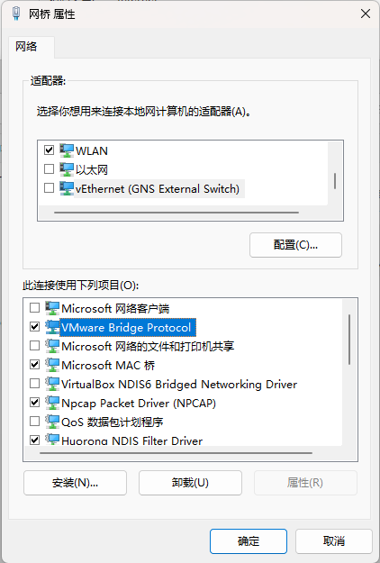
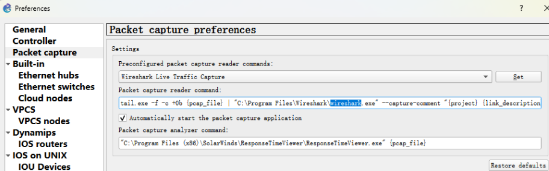
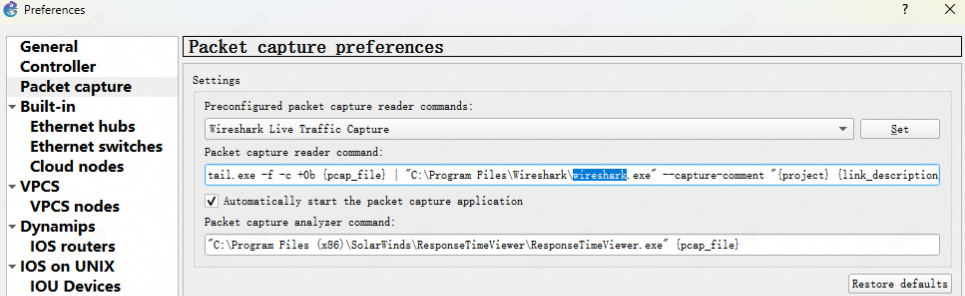
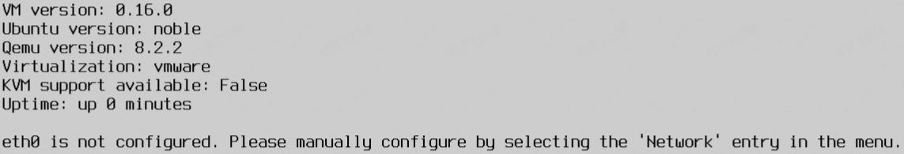
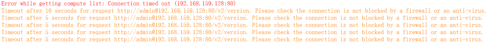

本页面将收集并解答一些 GNS3 使用中遇到的问题，欢迎你提问/分享你解决遇到问题的方法

### 虚拟机启动时，提示此平台不支持虚拟化的xxxx，导致启动失败

旧版GNS3客户端启动时，会自动尝试调用VMware workstation启动虚拟机，且会强制启用虚拟化，由于同学们几乎全部在使用WSL，其基于的Hyper-V的虚拟化方式将与VMware产生冲突，导致启动失败（对GNS3客户端的逆天逻辑送上一个大大的F）

请根据自己的实际操作情况，执行相应的解决步骤：

* 在安装GNS3客户端时，勾选了GNS3 VM，让安装向导一并为你导入了GNS3虚拟机

    * 打开GNS3，点击Edit-Preferences进入首选项

        

    * 在左侧导航栏选择GNS3 VM，取消勾选Enable the GNS3 VM
    
        
    
    * 参考[配置GNS3虚拟机](/docs/GNS3/VM-VMware#3-配置gns3虚拟机)中第5步，重新禁用GNS3 VM的虚拟化
    
    * 改用[连接虚拟机](/docs/GNS3/client-install#2-%E8%BF%9E%E6%8E%A5-gns3-%E8%99%9A%E6%8B%9F%E6%9C%BA)步骤的方式，重新连接GNS3 VM
    
* 配置虚拟机时，没有禁用GNS3 VM的虚拟化

    参考[配置GNS3虚拟机](/docs/GNS3/VM-VMware#3-配置gns3虚拟机)中第5步，重新禁用GNS3 VM的虚拟化

* 使用的GNS3不支持用[连接虚拟机](/docs/GNS3/client-install#2-%E8%BF%9E%E6%8E%A5-gns3-%E8%99%9A%E6%8B%9F%E6%9C%BA)步骤的方式禁用Local Server

    * 在GNS3客户端启动前，参考[配置GNS3虚拟机](/docs/GNS3/VM-VMware#3-配置gns3虚拟机)中第5步，重新禁用GNS3 VM的虚拟化，并启动GNS3虚拟机
    * GNS3虚拟机完成启动后，打开GNS3客户端

    由于此时GNS3虚拟机已经启动，GNS3客户端不会再尝试修改虚拟机设置，我们就可以正常使用虚拟机了

### 配置VMnet0桥接的网络时，无法找到正在使用的网络适配器

* 确认VPN等工具没有启用虚拟网卡（如Clash的TUN Mode）

* 打开控制面板-网络与Internet-网络和共享中心，点击左侧更改适配器设置

	

* 选择正在使用的网络适配器，右键打开属性，将VMware Bridge Protocal勾选并确定保存

	

### 无法使用Wireshark捕捉链路上的数据包

请根据你遇到的问题，尝试以下可能的解决步骤：

* GNS3找不到指定的文件（Wireshark安装位置）

  

  * 打开GNS3，点击Edit-Preferences进入首选项

    

  * 在左侧导航栏选择Packet capture

    

  * 将Wireshark文件路径修改为你电脑上实际安装位置，并应用更改

* Wireshark成功启动，GNS3没有报错，但无法捕捉到数据包

  * 打开GNS3，点击Edit-Preferences进入首选项

    

  * 在左侧导航栏选择Packet capture

    

  * 如"Preconfigured packet capture render commands"一项是"Wireshark Traditional Capture"，将其改选为"Wireshark Live Traffic Capture"，并点击右侧Set，并应用更改

### 提示"eth0 is not configured"

请检查以下几种可能的情况：

* 没有给GNS3 VM添加三种虚拟网络适配器

  参考[配置GNS3虚拟机](/docs/GNS3/VM-VMware#3-配置gns3虚拟机)进行配置，确保配置完成后，虚拟机有3张虚拟网络适配器，分别为“仅主机模式”、“NAT模式”、“桥接模式”

  请注意，虚拟网络适配器必须添加到虚拟机才会生效，不能仅配置虚拟网络编辑器

* VMware安装时网络配置存在问题

  参考[配置GNS3虚拟机](/docs/GNS3/VM-VMware#3-配置gns3虚拟机)中第7步，打开虚拟网络编辑器，检查NAT模式的VMnet8获得的子网地址是否正常，如为`169.254.*.*`类似的IP，说明VMware虚拟网络DHCP服务存在问题，请尝试重新安装VMware Workstation Pro

* 虚拟机未成功通过DHCP获取IP

  * 虚拟机内选择OK-Networking
  * 解除以下部分的注释，并将`dhcp4: no`修改为`dhcp4: yes`
  * 按下Ctrl+O，按下Ctrl+X，保存配置，虚拟机会自动重启 
  * 观察问题是否得到解决

* 虚拟机导入存在问题

  删除该虚拟机，重新导入并进行配置

* VMware Workstation Pro 版本存在问题

  尝试升级/重装VMware Workstation Pro

* 使用VMware Workstation **Player**运行虚拟机

  卸载并改用VMware Workstation Pro

### GNS3客户端和虚拟机的连接频繁断开

请检查虚拟网络编辑器内是否正确配置了虚拟网络适配器，具体来说，配置应该是：

* VMnet0：桥接模式
* VMnet1：仅主机模式
* VMnet8：NAT模式

如果虚拟网络适配器名称与类型的对应关系不正确，建议选择还原默认设置后重新进行配置