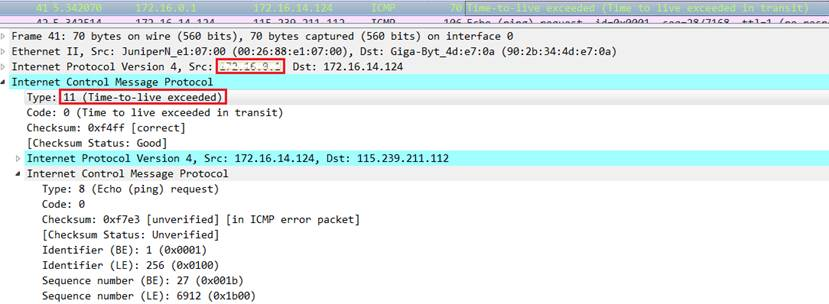
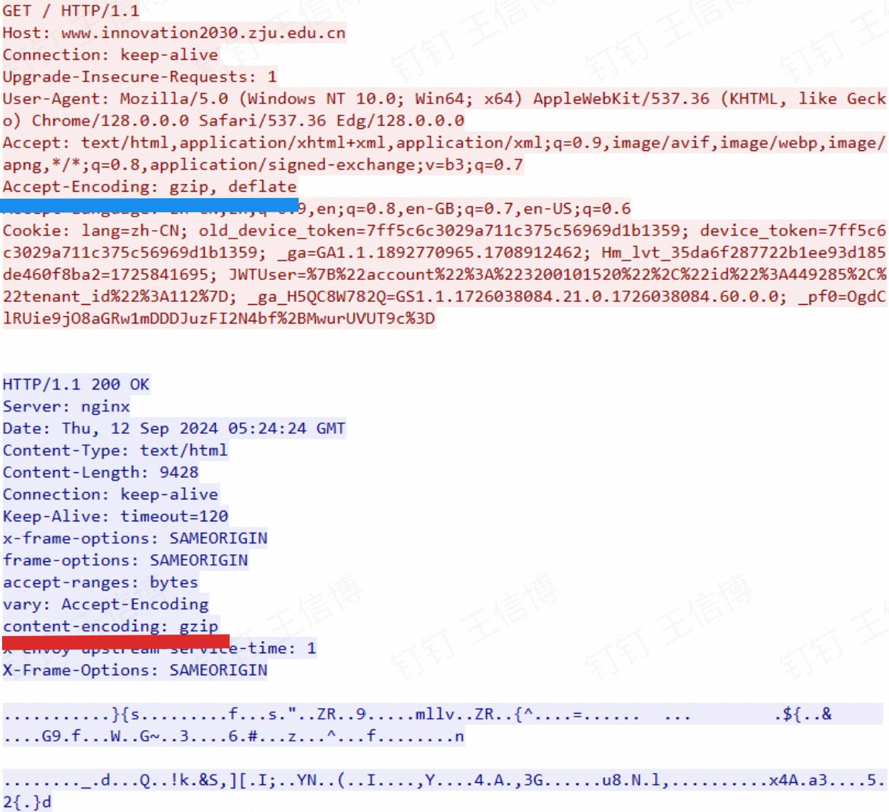

import LinkCard from '@site/src/components/LinkCard';
import TaskCard from '@site/src/components/TaskCard';
import '@site/src/css/TaskCard.css';

import FileCard from '@site/src/components/FileCard';
import DeadlineProcess from '@site/src/components/DeadlineProcess';
import GridContainer from "@site/src/components/GridContainer";
import ModernInput from '@site/src/components/ModernInput';
import ImageUploader from '@site/src/components/ImageUploader';
import ExportButton from '@site/src/components/ExportButton';
import ScreenshotCard from '@site/src/components/ScreenshotCard';

<h3 style={{color: '#006d75', marginTop: 0, marginBottom: 8}}>实验资源</h3>
<DeadlineProcess start={'2025-09-16 18:50:00'} end={'2025-09-30 23:59:59'}/>

<GridContainer>
    <FileCard file_type={'md'} name={'Lab1 实验报告模板 Markdown版本'} size={'562679'} link={require('@site/assets/templete/md/Lab1 实验报告模板.zip').default} />
    <FileCard file_type={'doc'} name={'Lab1 实验报告模板 Word版本'} size={'738304'} link={require('@site/assets/templete/word/实验报告模版_实验1.doc').default} />
    <FileCard file_type={'pdf'} name={'Lab1 Wireshark 实验课件'} size={'2874374'} link={require('@site/assets/slides/luxq_Wireshark.pdf').default} />
</GridContainer>

## 1 实验目的

你是否曾好奇，当你在浏览器中输入一个网址，按下回车后，屏幕上绚丽的网页是如何在瞬间呈现的？当你在社交软件上发出一条消息，它又是如何穿越千山万水，精准地送达到朋友的手机上？

这些日常操作的背后，是一个由无数数据包在其中奔跑的复杂而有序的世界，一个个数据包按照各自的规范在庞大的网络穿梭，支撑着我们的信息化生活，但这个世界对我们来说是隐形的，要亲眼见证这一切，窥探网络世界的内部运行层次与机理，我们就需要利用**Wireshark**这样的抓包工具

<LinkCard title={'Wireshark安装'} url={'/docs/Wireshark/install'} icon="https://www.wireshark.org/assets/icons/wireshark-fin@2x.png">在开始实验之前，请务必参考该文档，在你的电脑上成功安装 Wireshark</LinkCard>
 

Wireshark 是一款免费、开源、功能强大的网络协议分析工具，能够捕获设备上所有进出的网络数据包，并为我们清晰直观地展示每个数据包的详细内容，本次实验我们就将利用Wireshark：

*   **直观感受** 网络中各种协议的存在
*   **深入学习** 数据包的分层结构和格式
*   **清晰理解** 各种常见网络协议的交互过程

## 2 实验步骤

### 2.1 利用Wireshark捕获所需的数据包

本部分，我们将捕获设备上进出的数据包，并从中筛选出我们分析所需的关键部分，为后续更深度的分析和理解做好准备；为了更高效的完成实验，建议你先阅读一下Wireshark上手文档

<LinkCard title={'Wireshark使用'} url={'/docs/Wireshark/tutorial'} icon="https://www.wireshark.org/assets/icons/wireshark-fin@2x.png">请参考该文档了解Wireshark基本界面与操作</LinkCard>
 

<TaskCard number={1} needScreenshot={false} title="运行Wireshark软件，开始捕获数据包，观察出现的协议">

深入理解：网络协议——实体间的通用语言

想象一下，互联网就像一个巨大的地球村，村里居民（也就是我们的电脑、手机、服务器、路由器等网络设备）来自四面八方，为了让大家能顺畅地交流信息，他们需要一套通用的“语言”和“交流规则”，这套规则就是我们所说的**网络协议（Network Protocol）**

简单来说，网络协议就是网络中进行数据交换所必须遵循的规则、标准或约定，它确保了不同设备之间能够“听懂”彼此，并正确地发送、接收和处理数据

一个完整的网络协议通常由三部分组成，我们可以用“人与人对话”的方式来理解它们：

* **语法**（Syntax）定义了数据和控制信息的格式，就像我们说话需要遵循主谓宾定状补的语法规则一样，如果信息格式混乱，比如把“我吃饭了”说成“了吃饭我”，对方就很难理解；网络协议中的语法就是规定数据包的结构，确保信息能够被正确解析

* **语义**（Semantics）定义了每条指令或数据的含义以及接收方需要做出何种响应，就像我们对话时，你说“你好”，我知道这是打招呼，我说“请帮我开门”，你理解并采取行动去开门；网络协议的语义就是规定数据包中的每个字段代表什么意义，以及接收设备收到后该如何处理

* **同步**（Synchronization）定义了事件发生的顺序、速度和时间限制，就像我们说话需要掌握节奏，不能东一句西一句，或者说得太快太慢，比如我问你一个问题后，我会等待你回答后再提下一个问题；网络协议中的时序确保了数据包按照正确的顺序发送和接收，避免信息混乱或丢失

为了帮助你对实验中涉及的协议有一点初步的印象，我们这里先为你简单罗列与介绍，你将在后续的步骤及理论课程中学到它们详细的设计目的与实现：

*   **HTTP (HyperText Transfer Protocol)**: 用于浏览器和服务器之间传输网页内容
*   **DNS (Domain Name System)**: 当你输入网址时，负责将网站域名“翻译”成 IP 地址
*   **TCP (Transmission Control Protocol)**: 确保数据能够稳定、可靠传输
*   **ICMP (Internet Control Message Protocol)**: 诊断与报告网络状态
*   **ARP (Address Resolution Protocol)**: 负责在局域网内将 IP 地址解析为物理地址

正是有了这成百上千或强大鲁棒或奇奇怪怪的网络协议，信息得以在不同设备间畅通无阻，形成我们今天所依赖的丰富多彩的数字世界

1.  打开 Wireshark
2.  在主界面，你会看到一个网络接口列表（如 “WLAN”、“以太网”），选择你当前正在用于上网的那个接口（通常是流量图表有波动的那个）
   
    

    :::tip 提示
    如果你使用了Clash等网络工具/VMWare等虚拟化平台，或有多张网卡，你的网络接口列表可能会非常复杂，如果难以确定需要捕获的接口，你可以按住Ctrl并多选要捕获的接口，选择完成后按Enter对这些接口批量捕获
    :::

3.  双击选中的接口，Wireshark 就会立刻开始捕获流经该接口的所有数据包
4.  让它运行一小段时间（例如15-30秒），你可能会惊讶地发现，即使你没有进行任何操作，后台依然有大量的网络活动
5.  点击左上角的红色方块按钮 **停止捕获**
    
    

6.  在协议（Protocol）列，捕获到的数据包包含的协议有：<ModernInput questionId="lab1-q1-protocols" size="large"/>（请记录至少5个）

</TaskCard>

<TaskCard number={2} title="找一个包含IP的数据包，分析其分层结构与地址信息">

初步理解：协议分层与数据封装——“信件与信封”模型

经过了一年多的计科专业学习，相信你已经充分领略到了计算机科学领域分层思想的魅力，通过对一个庞大问题进行分层，我们能充分隐藏复杂性，让每一层面对的问题都能在过度烧脑前得到很好的解决

计算机网络恰恰也是这一思想的充分体现，理解网络的分层模型是网络学习的重要部分，为了帮助你快速理解，我们不妨用一个经典的“寄信”模型来类比：

> 你要寄送一封信（**应用层数据**，比如一个 HTTP GET 请求）
> 1.  首先，你会把信纸装进一个信封，写上收信人和寄信人的端口号等信息，这个信封就是 **传输层** (TCP/UDP等协议)的数据包
> 2.  接着，为了让信件能在巨大的城市网络中找到正确的街道，邮局会把你的信件再放进一个更大的快递信封，上面写着最终的家庭住址和寄件人地址，这个大信封就是 **网络层** (IP等协议)的数据包，地址就是 IP 地址
> 3.  最后，为了让快递员能在具体的某个小区或楼栋里找到你，需要一个更具体的门牌号，快递包裹会被贴上一个包含这个门牌号（MAC地址）的快递单，这个最终的包裹就是 **数据链路层** (Ethernet等协议)的数据帧
> 4.  这个包裹最终通过物理的传输介质（**物理层**，如网线、光纤、无线电波）发送出去

这个从上到下，层层包装的过程，我们称之为 **数据封装 (Data Encapsulation)**，Wireshark 最强大的功能之一就是能为我们清晰地展示出这个层层包裹的结构

1.  在刚才捕获到的数据包列表中，找到一个包含 **IP** （Internet Protocal V4/6均可）的数据包
2.  用鼠标单击选中这个 IP 包
3.  观察主界面下方的分组详情面板，你会看到类似下面这样的分层结构：
    *   Frame (物理层)
    *   Ethernet II (数据链路层)
    *   Internet Protocol Version 4 (网络层)
    *   Transmission Control Protocol / User Datagram Protocol / … (传输层)
    *   应用层协议
4.  分析：
    * 这个数据包有<ModernInput size="small" questionId="lab1-packet-analysis-layer-count"/>层
    * 最高层的协议是<ModernInput questionId="lab1-packet-analysis-top-protocol"/>
    * 从Ethernet开始往上，各层协议的名字分别是：<ModernInput questionId="lab1-q2-protocol-names" size="large"/>
5.  展开 **Internet Protocol** 层，找到并在图中标出以下信息位置：
    *   源 IP 地址 (Source Address)
    *   目标 IP 地址 (Destination Address)
6.  展开 **Ethernet II** 层，找到并在图中标出以下信息位置：
    *   源 MAC 地址 (Source)
    *   目标 MAC 地址 (Destination)

<ScreenshotCard 
  questionId="Lab1-p1-s2"
  title="IP层数据包抓取截图参考"
  uploadOptions={[
    { id: 'ip', label: '上传并标记截图' }
  ]}
>
    
</ScreenshotCard>

</TaskCard>

<TaskCard number={3} title="配置应用显示过滤器，让界面只显示某一协议类型的数据包">

初步理解：捕获过滤器与显示过滤器

当你开始捕获网络流量后，你会发现自己很快就被海量的数据包淹没，然而成千上万的数据包中往往只有极小一部分是我们真正关心的，如果手动查找无异于大海捞针，此时**过滤器 (Filter)** 就派上了用场

Wireshark 提供两种主要的过滤器，它们的区别非常重要：

*   **捕获过滤器 (Capture Filter)**: **在捕获开始前设置，捕获开始后不可改变**，它告诉 Wireshark “弱水三千，只取一瓢”，只有符合规则的数据包才会被 Wireshark 记录下来，其他的数据包则会被**直接丢弃**

    :::note 提示
    为了实现捕获过滤以尽可能减少内核态向用户态的传输，Linux引入了eBPF（扩展伯克利包过滤器），这一为实现动态调整内核内包过滤逻辑的技术意外开启了内核可编程化的一条可行技术路线，让我们能在运行时低开销、高灵活地观测与改变内核运行，如果你有相关的需求，不妨了解一下
    :::

*   **显示过滤器 (Display Filter)**: **在捕获时/完成后使用，可以随时修改**，它主要用于**已经捕获**到的数据包中筛选出感兴趣的部分，不会改变任何已经捕获的数据，只是改变了它们的显示方式

捕获过滤器和显示过滤器可以结合使用，以尽可能减少不必要的数据包干扰，但使用时请注意这两者有着完全不同的语法

除实验步骤明确要求使用哪种过滤器外，你可以任选其一使用

1. 在顶部的 **应用显示过滤器 / Apply a display filter...** 输入框中，直接输入你感兴趣的协议名称，例如 `dns`
2. 按下回车，观察主窗口的变化，现在应该只剩下 DNS 协议的数据包了
3. 尝试不同的协议，例如 `http`，`arp`，`icmp` 等

**记录数据：** 使用的过滤器：<ModernInput questionId="lab1-filter-used-protocol"/>，希望显示的协议类型：<ModernInput questionId="lab1-filter-protocol-type"/>

<ScreenshotCard questionId="Lab1-p1-s3"/>

</TaskCard>

<TaskCard number={4} title="配置应用显示过滤器，让界面只显示某个IP地址的数据包">

IP地址：互联网上的“门牌号”

把互联网想象成一个巨大的城市，你的电脑、手机等设备就是这个城市里的一座座高楼。要想准确地在高楼间收发信件（也就是数据），每座高楼都需要一个独一无二的地址，这个地址就是**IP地址**；IP地址由网络层的IP协议规定，它为网络中的每一台设备提供了一个逻辑上的位置标识

一个IPv4地址（目前最常见的IP地址类型）是一个32位的二进制数字，但一长串的0和1（比如 `11000000101010000000000100000001`）对人类来说太难记了；因此通常的做法是把它分成4段，每段8位，并将每段转换成十进制数，中间用点隔开就成了我们熟悉的样子（比如 `192.168.1.1`），这种表示方法叫做“点分十进制表示法”

类似的，IPv6地址是一个128位的二进制数字，采用16位1段，并把每段转换为十六进制数表示（比如`2001:db8:3333:4444:5555:6666:7777:8888`）

1. 在显示过滤器输入框中，输入 `ip.addr == x.x.x.x`，其中 `x.x.x.x` 替换为数据包列表中你感兴趣的具体IP地址
2. 按下回车，观察筛选结果

**记录数据：** 使用的过滤器：<ModernInput questionId="lab1-filter-used-ip"/>，希望显示的IP地址：<ModernInput questionId="lab1-filter-ip-address"/>

<ScreenshotCard questionId="Lab1-p1-s4"/>

</TaskCard>

<TaskCard number={5} title="配置捕获过滤器，只捕获某个IP地址的数据包">

1.  在 Wireshark 主界面，点击 **“Capture” -> “Options...”** (或直接点击齿轮图标)
2.  在弹出的“Wireshark Capture Interface Settings”窗口中，选择你正在使用的网络接口
3.  在“Capture Filter”输入框中，输入 `host x.x.x.x`，其中 `x.x.x.x` 替换为你感兴趣的具体IP地址
4.  点击“Start”开始捕获
5.  尝试Ping该IP地址（例如 `ping x.x.x.x`），观察 Wireshark 是否只捕获到与该IP相关的流量

> **常用测试IP**：浙江大学DNS `10.10.0.21`，114 DNS `114.114.114.114`，Cloudflare `1.1.1.1`

**记录数据：** 使用的过滤器：<ModernInput questionId="lab1-task5-filter"/>，希望捕获的IP地址：<ModernInput questionId="lab1-task5-protocol"/>

<ScreenshotCard questionId="Lab1-p1-s5"/>

</TaskCard>

<TaskCard number={6} title="配置捕获过滤器，只捕获某类协议的数据包">

1.  与上一个任务类似，在捕获选项的“Capture Filter”输入框中进行设置
2.  启动捕获，并执行相应的网络操作（如访问一个 `http://` 网站或执行 `nslookup`），观察结果

> **常用测试协议**：HTTPS `tcp port 443`（访问HTTPS网站使用），HTTP `tcp port 80`（访问HTTP网站使用），DNS `udp port 53`（域名查询使用，如`nslookup baidu.com`）

**记录数据：** 使用的过滤器：<ModernInput questionId="lab1-task6-filter"/>，希望显示的协议类型：<ModernInput questionId="lab1-task6-protocol"/>

<ScreenshotCard questionId="Lab1-p1-s6"/>

</TaskCard>

### 2.2 常见网络协议的交互分析

掌握了 Wireshark 的基本操作后，我们现在可以开始对不同协议的数据包进行分析了，本部分我们将逐个捕捉常用协议的数据包，并观察这些数据包的结构，从数据包内的信息一窥协议的行为与设计

:::important 注意

请在下面的每次捕获任务完成后，保存Wireshark抓包记录（.pcap格式），随报告一起提交，每一个任务一个单独文件（如dns.pcap、ping.pcap、tracert.pcap），请捕获尽可能短的时间，以免文件大小超过系统限制

:::

<TaskCard number={1} title="使用nslookup命令，查询某个域名，并使用Wireshark捕获DNS数据包">

初步理解：DNS——互联网的“电话簿”

电脑在网络中互相通信时，依靠的是数字形式的 IP 地址（例如 `192.168.1.1`），然而对于人类来说，记忆一长串无规律的数字未免太过困难，我们天生就更喜欢使用易于记忆的域名（Domain Name），比如 `zju.edu.cn` 或者 `google.com`

**域名系统 (Domain Name System, DNS)** 就扮演了互联网世界中“电话簿”的角色，它的核心任务就是：当你输入一个域名时能帮你自动“查号”，找到并返回该域名对应的 IP 地址，从而让你的浏览器向正确的服务器发起连接，获取网页数据，这个“查号”的过程，就是一次 **DNS 查询 (DNS Query)**

通常，在互联网中会有一些专门的DNS服务器为我们提供域名解析服务，这些服务器可以是你的网络服务提供商（如信息技术服务中心、电信、移动）自动为你指定的，也可以是一些公共的、任何人都可以使用的服务器，比如114 DNS提供的 114.114.114.114 和 Cloudflare 提供的 1.1.1.1 ，后续的实验中你甚至可以尝试手动指定使用这些公共服务器来进行域名查询

关于DNS协议的详细设计与使用，我们还将在课程的Chapter 7中进一步学习，敬请期待

1. **准备Wireshark捕获**: 打开 Wireshark，在**捕获过滤器**中输入 `udp port 53` 并选择正确的网络接口，启动捕获（DNS 查询通常使用 UDP 协议，标准端口号为 53）
2. **执行 `nslookup` 命令**:
    * 在Windows的`命令提示符`/`PowerShell`中，或macOS/Linux的`Terminal`中，执行 `nslookup www.zju.edu.cn`
    * 命令成功后，回到 Wireshark 停止捕获，你应该能看到几个数据包
    * 请分析：组成DNS数据包的各层协议分别是：<ModernInput size="large" questionId="lab1-dns-protocols"/>，使用的服务方端口是：<ModernInput questionId="lab1-dns-ports"/>
3. **分析DNS数据包**：分别选择一个 **DNS Query (查询)** 包和一个 **DNS Response (响应)** 包（分别截图），展开最高层协议 **Domain Name System** 的详细内容，在两个包中分别找到并标记以下关键字段：
    *   **交易ID（Transaction ID）**: 用来匹配一组查询和响应
    *   **查询类型**：用来标记查询的类型，例如 A（IPv4 地址）、AAAA（IPv6 地址）、CNAME（别名）等
    *   **Queries (查询内容)**: 你想要查询的域名
    *   **Answers (应答内容)**: 服务器返回的 IP 地址

    <ScreenshotCard 
    questionId="Lab1-p2-s1"
    title="DNS查询包截图示例"
    uploadOptions={[
        { id: 'query', label: '上传查询包截图' },
        { id: 'response', label: '上传响应包截图' }
    ]}
    >
        
    </ScreenshotCard>

</TaskCard>

<TaskCard number={2} title="使用ping命令测试连通性，并捕获ARP和ICMP数据包">

深入理解：ARP & ICMP——确认“邻居”和“远方朋友”

拿到了 IP 地址后，数据包就可以立刻发送出去了吗？不完全是，这里还有两个关键的底层协议在默默工作：ARP 和 ICMP

*   **ARP (Address Resolution Protocol): 解决“最后一公里”的投递问题**

    回到“寄信”模型，你知道了对方的 IP 地址（街道地址），但在一个局域网（比如你连接的 Wi-Fi 网络）内，数据包最终需要被送到一个具体的“门牌号”，这个门牌号就是 **MAC 地址**（物理地址）

    **地址解析协议 (ARP)** 的作用，就是在同一个局域网内通过广播的方式“喊话”：“嘿，IP 地址是 `192.168.1.2` 的设备，你的 MAC 地址是多少？” 收到这个“喊话”后，对应的设备就会回应自己的 MAC 地址，这样你的电脑就知道了应该把数据包交给哪个具体的设备了

    为了效率（也为了避免网络被反反复复的ARP广播淹没），电脑会把获取到的 IP-MAC 地址对应关系缓存一段时间（存入“ARP缓存表”），下次再给同一个 IP 地址发包时就不用再发 ARP 请求了

*   **ICMP (Internet Control Message Protocol): 网络世界的探针**

    **互联网控制消息协议 (ICMP)** 并不用于传输用户数据，而是用于在 IP 网络中发送控制消息和错误报告，帮助我们了解网络是否通畅、主机是否可达、路由是否出错等情况

    我们最常用的 `ping` 命令就是 ICMP 最典型的应用，`ping` 会发送一个 **ICMP Echo Request (回显请求)** 包给目标地址，如果目标设备收到了，就会回复一个 **ICMP Echo Reply (回显应答)** 包，如果能收到应答，就说明网络是通的

    :::warning 注意
    为了避免潜在的攻击，较新版本的Windows等系统被配置为默认不回应任何ICMP请求，如果你希望Ping一台Windows设备，请记得临时关闭系统的防火墙（至少Lab2/3的时候要记得！）

    具体来说，请搜索Windows安全中心，进入防火墙和网络保护，将各个网络的防火墙逐个关闭
    :::

:::warning 注意
为了避免大量ARP包在网络中造成拥塞，绝大多数系统都实现了ARP表缓存过去的ARP查询，因此为了确保能捕获到 ARP 包，我们将必须在 Ping 之前清空 ARP 缓存，并赶在其他网络流量触发ARP请求前发送 Ping 命令，否则当缓存中已有记录时系统将不会发送 ARP 请求
:::

1.  **找到你的网关地址**: 打开命令行，输入 `ipconfig` (Windows) 或 `ifconfig` (macOS/Linux)，找到你当前网络的“默认网关 (Default Gateway)”地址，这通常是你的路由器地址，是一个理想的局域网 Ping 对象

2.  **准备捕获**: 打开 Wireshark，在**显示过滤器**中输入 `arp or icmp`，然后开始捕获

3.  **清空 ARP 缓存并进行Ping**:
    *   (Windows)打开一个**管理员权限**的命令行窗口，输入 `netsh interface IP delete arpcache` 清空 ARP 缓存
    *   (macOS/Linux) 输入`sudo arp -d -a` 清空 ARP 缓存
    *   **立刻**输入 `ping <你的网关地址>`，例如 `ping 192.168.1.1`    

4.  **分析捕获到的相关协议数据包**：
    *   Ping 结束后，停止 Wireshark 捕获，你应该能看到一个清晰的过程：先是 ARP 请求与响应，然后是 ICMP 请求与响应
    *   Ping IP地址时，捕获到的**相关**数据包的协议有：<ModernInput questionId="lab1-ping-ip-protocols"/>
    *   Ping 域名时，捕获到的**相关**数据包的协议有：<ModernInput questionId="lab1-ping-domain-protocols"/>
    *   组成ICMP数据包的各层协议有<ModernInput size="large" questionId="lab1-icmp-layers"/>

5.  **分析 ARP 包**: 选择一个 ARP 请求包和响应包（分别截图），展开 **Address Resolution Protocol** 层，标记：
    * 操作码：请求`request (1)` 或 响应`reply (2)`
    * 发送者IP地址：ARP请求包中->请求方的IP地址 / ARP响应包中->被请求方的IP地址
    * 发送者MAC地址：ARP请求包中->请求方的MAC地址 / ARP响应包中->被请求方的MAC地址
    * 目标IP地址：ARP请求包中->被请求方的IP地址 / ARP响应包中->请求方的IP地址
    * Ethernet层的目标MAC地址：ARP请求包中->广播地址（FF:FF:FF:FF:FF:FF） / ARP响应包中->请求方的MAC地址
    * 查询结果：ARP响应包中被请求方的MAC地址

    <ScreenshotCard 
    questionId="Lab1-p2-s2"
    title="ARP查询包截图示例"
    uploadOptions={[
        { id: 'arp-request', label: '上传ARP请求包截图' },
        { id: 'arp-response', label: '上传ARP响应包截图' }
    ]}
    >
        
    </ScreenshotCard>

6.  **分析 ICMP 包**: 选择一个 ICMP 请求包和响应包（分别截图），展开 **Internet Control Message Protocol** 层，标记：
    * **类型（Type）**： `8`（ICMP请求），`0`（ICMP响应）
    * **序号（Sequence Number）**：相同的序号标记一对请求与响应

    <ScreenshotCard 
    questionId="Lab1-p2-s2"
    title="ARP查询包截图示例"
    uploadOptions={[
        { id: 'icmp-request', label: '上传ICMP请求包截图' },
        { id: 'icmp-response', label: '上传ICMP响应包截图' }
    ]}
    >
        
    </ScreenshotCard>

</TaskCard>

<TaskCard number={3} title="使用tracert命令跟踪路由">

Tracert追踪路由的原理

假设一个数据包传输过程中因为各种原因始终无法到达目的地，我们要让它继续在网络内打转吗？答案显然是否定的，因为它会消耗网络资源，导致网络拥堵；而解决这一问题的具体方式就是IP协议的**TTL**（Time To Live）字段

你可以将TTL理解为数据包的“生命值” or “磨损度”，每当一个数据包经过一个路由器，其TTL值就会被减1；当TTL变为0时，路由器会丢弃这个数据包，并向源主机发送一个**ICMP Time Exceeded** 的错误报告消息

看到这里，不妨先不要往下滑，看看能否自己想出`Traceroute`探测到达目标主机路径上每个路由器的巧妙设计？

`Traceroute`正是利用了IP协议的TTL机制，构造并发送一系列特殊的探测包：
1.  第一个包的TTL设置为1，它到达第一个路由器后，TTL变为0，该路由器便会回复一个“时间超时”消息，由于承载ICMP消息的IP数据包包含了源IP地址，我们就知道了路径上的第一个路由器的IP
2.  第二个包的TTL设置为2，它能安全通过第一个路由器，但在第二个路由器处“阵亡”，第二个路由器同样会发回“时间超时”消息，于是我们知道了第二个路由器的IP
3.  以此类推，通过不断增加TTL的值，`Traceroute`能够逐跳发现从源到目的地的完整路径，直到数据包最终到达目的地，目的地主机会根据收到的协议类型（通常是UDP或ICMP）回复一个“端口不可达”或“回显应答”消息，标志着追踪结束

1.  **启动Wireshark捕获**：在你的电脑上打开Wireshark，选择正确的网络接口，开始捕获数据包
2.  **执行 `tracert` 命令并分析**：
    *   （Windows）打开命令提示符 或 PowerShell / （macOS/Linux）打开终端
    *   输入命令 `tracert [IP地址]` 并回车
    *   观察命令输出，它会逐行列出经过的路由器的IP地址以及延迟信息
    *   待运行完成后返回Wireshark停止捕获，在Wireshark的显示过滤器中输入 `icmp`，筛选出与本次追踪相关的数据包
    *   分析：跟踪路由使用的数据包协议类型是<ModernInput questionId="lab1-tracert-protocol"/>，构成数据包的几层协议分别是<ModernInput size="large" questionId="lab1-tracert-layers"/>
3.  **分析请求包**：观察并记录请求包（请对数据包**列表**截图）中IP协议层的TTL字段变化规律，第一个请求的TTL等于<ModernInput size="small" questionId="lab1-tracert-ttl-start"/>，同样TTL的请求连续发送了<ModernInput size="small" questionId="lab1-tracert-ttl-repeats"/>个，然后每次TTL增加了<ModernInput size="small" questionId="lab1-tracert-ttl-increment"/>，最后一个请求的TTL等于<ModernInput size="small" questionId="lab1-tracert-ttl-end"/>
   
    <ScreenshotCard 
    questionId="Lab1-p2-s3"
    title="捕获包列表截图示例"
    uploadOptions={[
        { id: 'request-list', label: '上传捕获包列表截图' }
    ]}
    >
        
    </ScreenshotCard>

4.  **分析响应包**：观察并记录响应包的信息（截图第一组、最后一组，并分别标记ICMP层的类型字段），第一组响应包的发送者IP是：<ModernInput questionId="lab1-tracert-resp-ip-first"/>；最后一组响应包的发送者IP是：<ModernInput questionId="lab1-tracert-resp-ip-last"/>
   
    <ScreenshotCard 
    questionId="Lab1-p2-s3"
    title="第一组截图示例"
    uploadOptions={[
        { id: 'response-first', label: '上传第一组截图' }
    ]}
    >
        
    </ScreenshotCard>

    <ScreenshotCard 
    questionId="Lab1-p2-s3"
    title="最后一组截图示例"
    uploadOptions={[
        { id: 'response-last', label: '上传最后一组截图' }
    ]}
    >
        
    </ScreenshotCard>

</TaskCard>

### 2.3 网页访问过程的协议分析

<TaskCard number={1} title="捕获网页访问过程中的数据包">

概念引入

* 数据包如何找到正确的应用程序？—— 端口 (Port)

    IP地址解决了数据包从主机到主机的寻址问题（能够找到门牌号），但一台主机上可能同时运行着多个网络程序（需要找到具体交给家里的哪个人），为了精确地将数据包交给目标程序，操作系统引入了**端口 (Port)** 的概念，一对`IP地址 + 端口号` 组合能够唯一锁定特定设备上一个正在通信的网络应用

* 浏览器和服务器怎样交换数据？—— HTTP 请求与响应

    浏览器和Web服务器之间通过**HTTP (HyperText Transfer Protocol)** 协议进行沟通，它本质上是一个**请求-响应 (Request-Response)** 模型

    *   **请求 (Request)**：浏览器向服务器发起，意图是从服务器上获取资源，或向服务器上提交资源
    *   **响应 (Response)**：服务器收到请求后返回处理结果和（可能）请求的资源

* HTTP和TCP是什么关系？—— 再看分层

    在Wireshark的报文详情中，你总会看到HTTP协议被“包裹”在TCP协议之内，这是因为它们扮演着不同角色：

    *   **TCP (Transmission Control Protocol)**：负责在客户端和服务器之间建立一条**可靠的、稳定的数据传输通道**，它确保数据能完整、有序地送达，不关心传输的内容是什么
    *   **HTTP**：负责定义在通道里传输的**内容的格式**，它将自己的请求和响应报文，整体打包交给下层服务TCP完成实际的传输工作

    这种“内容”与“通道”的分工，也是网络协议分层思想的一个体现

1.  **清空DNS缓存**：
    * （Windows）以管理员身份打开命令提示符或PowerShell，运行命令 `ipconfig /flushdns`
    * （macOS）在终端中运行命令`sudo dscacheutil -flushcache; sudo killall -HUP mDNSResponder`
    * （Linux）在终端中运行命令`sudo systemctl status systemd-resolved`，如果状态为active，请运行命令`sudo systemd-resolve --flush-caches`，否则运行命令`sudo systemctl restart nsc`
2.  **启动Wireshark捕获**：选择正确的网络接口，设置捕获过滤器只捕获访问该网站的数据（`tcp port 80 or udp port 53`仅捕获HTTP与DNS）并开始捕获
3.  **访问HTTP网站**： 打开你的浏览器，访问一个纯HTTP的网站，网站加载完成后停止捕获

    :::warning 注意
    HTTPS会对数据进行加密以确保安全传输，使我们无法观测数据包内部，因此请确保你访问的是纯HTTP网站，如：
    * NeverSSL: `http://slowclearinnermagic.neverssl.com/online/`
    * 浙江大学竺可桢学院办公网：`http://office.ckc.zju.edu.cn/`

    网站使用的协议以最终加载为准，即使你将HTTPS网址中的`https://`强制替换为`http://`，仍有可能被服务器强制301重定向到`https://`页面（比如我们的文档网站就启用了[自动HTTPS重写](https://developers.cloudflare.com/ssl/edge-certificates/additional-options/automatic-https-rewrites/#_top)）
    :::

4.  **分析捕获结果**：
    * 组成捕获到的DNS协议数据包的各层协议是：<ModernInput size="large" questionId="lab1-web-dns-layers"/>，选取一个DNS查询数据包截图并标记源/目标IP地址、源/目标端口

        <ScreenshotCard 
            questionId="Lab1-p3-s1"
            title="DNS数据包截图示例"
            uploadOptions={[
                { id: 'dns', label: '上传DNS数据包截图' }
            ]}
        >
            
        </ScreenshotCard>

    * 组成捕获到的HTTP协议数据包的各层协议是：<ModernInput size="large" questionId="lab1-web-http-layers"/>，选取一个HTTP请求数据包截图并标记源/目标IP地址、源/目标端口

        <ScreenshotCard 
            questionId="Lab1-p3-s1"
            title="HTTP数据包截图示例"
            uploadOptions={[
                { id: 'http', label: '上传HTTP数据包截图' }
            ]}
        >
            
        </ScreenshotCard>

</TaskCard>

<TaskCard number={2} title="分析打开网页中查询的域名" needScreenshot={false}>

:::tip 提示
除了你的操作，系统后台众多程序运行时的域名查询也可能造成干扰，请认真区分哪些是真正和你打开的网页相关的域名查询
:::

为了打开网页，浏览器查询的域名有：<ModernInput size="large" questionId="lab1-web-queried-domains"/>

</TaskCard>

<TaskCard number={3} title="分析TCP连接数" needScreenshot={false}>

使用显示过滤器`tcp.stream eq X`，让X从0开始变化，直到没有数据，分析浏览器为了获取网页数据总共建立了<ModernInput size="small" questionId="lab1-web-tcp-connections"/>个连接（一个TCP流对应一个TCP连接）

</TaskCard>

<TaskCard number={4} title="分析HTTP会话" needScreenshot={false}>

:::tip 提示
一个TCP流上可能存在多个HTTP会话
:::

右键点击某个HTTP数据包，选择跟踪TCP流查看HTTP会话的数据，分析浏览器与WEB服务器之间进行了<ModernInput size="small" questionId="lab1-web-http-sessions"/>次HTTP会话（一对HTTP请求和响应对应一次HTTP会话）

</TaskCard>

<TaskCard number={5} title="查看一个HTTP请求的完整TCP流">

选择一个HTTP的TCP流进行截图，标出请求和响应部分（最好在一个TCP流中包含多个HTTP会话）

<ScreenshotCard 
    questionId="Lab1-p3-s5"
    title="TCP流截图示例"
    uploadOptions={[
        { id: 'tcp', label: '上传TCP流截图' }
    ]}
>
    
</ScreenshotCard>

</TaskCard>

## 3 实验结果分析与思考

* 如果只想捕获某个特定WEB服务器IP地址相关的HTTP数据包，捕获过滤器应该怎么写？
    <ModernInput size="exlarge" questionId="lab1-analysis-q1"/>

* Ping发送的是什么类型的协议数据包？什么情况下会出现ARP数据包？ Ping一个域名和Ping一个IP地址出现的数据包有什么不同？
    <ModernInput size="exlarge" questionId="lab1-analysis-q2"/>

* Tracert/Traceroute发送的是什么类型的协议数据包，整个路由跟踪过程是如何进行的？
    <ModernInput size="exlarge" questionId="lab1-analysis-q3"/>

* 如何理解TCP连接和HTTP会话？他们之间存在什么关系？
    <ModernInput size="exlarge" questionId="lab1-analysis-q4"/>

* DNS为什么选择使用UDP协议进行传输？而HTTP为什么选择使用TCP协议？
    <ModernInput size="exlarge" questionId="lab1-analysis-q5"/>

## 4 常见问题

* ARP包不是向子网内广播的吗，为什么我捕获到了有目的地MAC地址的ARP包？

   > RFC 826
   >
   > Another alternative is to have a daemon perform the timeouts. After a suitable time, the daemon considers removing an entry. It first sends (with a small number of retransmissions if needed) an address resolution packet with opcode REQUEST directly to the Ethernet address in the table. If a REPLY is not seen in a short amount of time, the entry is deleted. The request is sent directly so as not to bother every station on the Ethernet. Just forgetting entries will likely cause useful information to be forgotten, which must be regained.

   TLDR: ARP表项过期前，守护程序可以给对应的主机发一个ARP请求，如果有响应则不删除表项并更新生存期，这样可以减少1次广播，降低开销

* Ping一个IP/域名时，为什么没有ICMP包

   请检查Ping时显示的是否是IPv4地址，如显示正在Ping IPv6地址，则只会出现ICMPv6包；要使用IPv4地址，可通过`ping -4 addr`指定

* HTTP会话中的数据为什么是乱码？
   
   为了节省带宽，提高网页加载速度，现代浏览器与HTTP服务器通常支持对内容进行压缩
   
    

   可以看到浏览器发送请求时，标明了接受`gzip/deflate`两种压缩方式（蓝线）；因此服务器返回内容时，采用了gzip对内容进行压缩，并用`Content-Encoding: gzip`标头告知我们的浏览器用`gzip`解压（红线），“乱码”即是Wireshark尝试直接解析压缩后内容导致的

## 5 导出实验报告

<ExportButton templatePath={require('@site/assets/base_report/Lab1.zip').default} labName="Lab1" labId="lab1-" />