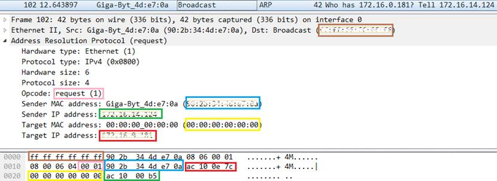
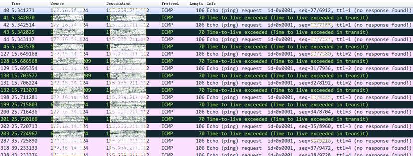
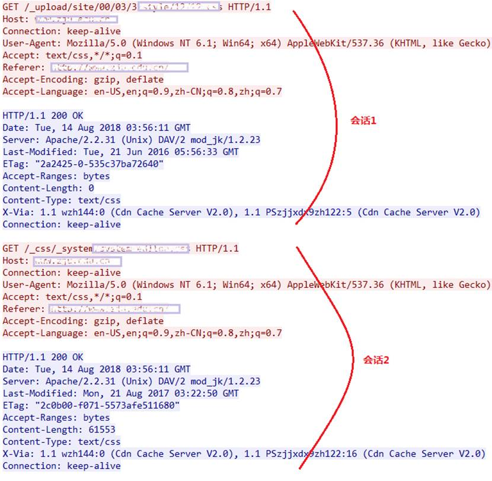

import LinkCard from '@site/src/components/LinkCard';
import FileCard from '@site/src/components/FileCard';
import DeadlineProcess from '@site/src/components/DeadlineProcess';

<h3 style={{color: '#006d75', marginTop: 0, marginBottom: 8}}>实验资源</h3>
<DeadlineProcess start={'2024-09-10 13:25:00'} end={'2024-09-24 23:59:59'}/>
<FileCard file_type={'pdf'} name={'Lab1 Wireshark 实验课件'} size={'2874374'} link={'http://10.214.0.253/network/exercise/courseware/upload/110/luxq_Wireshark.pdf'} />
<FileCard file_type={'md'} name={'Lab1 实验报告模板 Markdown版本'} size={'562679'} link={'https://pan.zju.edu.cn/share/a6b1603118146a62c2254439ff'} />
<FileCard file_type={'doc'} name={'Lab1 实验报告模板 Word版本'} size={'738304'} link={'http://10.214.0.253/network/download/Assignments/FundOfNetworks/2018/%e5%ae%9e%e9%aa%8c%e6%8a%a5%e5%91%8a%e6%a8%a1%e7%89%88_%e5%ae%9e%e9%aa%8c1.doc'} />

### 一、实验目的
* 学习使用Wireshark抓包工具
* 观察和理解常见网络协议的交互过程
* 理解数据包分层结构和格式

### 二、实验内容
* Wireshark是PC上使用最广泛的免费抓包工具，可以分析大多数常见的协议数据包。
* 掌握网络协议分析软件Wireshark的使用，学会配置过滤器
* 观察所在网络出现的各类网络协议，了解其种类和分层结构
* 观察捕获到的数据包格式，理解各字段含义 
* 根据要求配置Wireshark，捕获某一类协议的数据包，并分析解读

### 三、主要仪器设备

* 联网的PC机、Windows、Linux或Mac操作系统、浏览器软件
* WireShark协议分析软件
<LinkCard title={'Wireshark安装与使用'} url={'/docs/category/wireshark%E5%AE%89%E8%A3%85%E4%B8%8E%E4%BD%BF%E7%94%A8'} icon="https://www.wireshark.org/assets/icons/wireshark-fin@2x.png">
请在实验进行前，参考实验文档完成Wireshark安装与基本配置
</LinkCard>

 

### 四、操作方法与实验步骤

:::important 温馨提示
为了避免捕获到大量无关数据包，影响实验观察，建议关闭所有无关软件。实验之前可以提前了解下第六部分有哪些问题
:::

* 安装网络包捕获软件Wireshark
* 配置网络包捕获软件，捕获所有机器的数据包
* 观察捕获到的数据包，并对照解析结果和原始数据包
* 配置网络包捕获软件，只捕获特定IP或特定类型的包
* 抓取以下通信协议数据包，观察通信过程和数据包格式
  * PING：测试一个目标地址是否可达
  * TRACE ROUTE：跟踪一个目标地址的途经路由
  * NSLOOKUP：查询一个域名
  * HTTP：访问一个网页

### 五、 实验数据记录和处理

:::important 温馨提示

以下实验记录均需结合屏幕截图，进行文字标注和描述，图片应大小合适、关键部分清晰可见，可直接在图片上进行标注，也**可以单独用文本进行描述**
:::

#### Part One

1. 运行**Wireshark**软件，开始捕获数据包，列出你看到的协议名字（至少**5**个）。

   协议名：_________

2. 找一个包含**IP**的数据包，这个数据包有_________层？最高层协议是_________，从**Ethernet**开始往上，各层协议的名字分别为_________。

   展开**IP**层协议，标出源**IP**地址、目标**IP**地址及其在数据包中的具体位置，展开**Ethernet**层，标出源**MAC**地址和目标**MAC**地址及其在数据包中的具体位置。

   截图参考（此处应替换成实际截获的数据）：

   

3. 配置应用显示过滤器，让界面只显示某一协议类型的数据包（输入协议名称）。

   | 使用的过滤器 | 希望显示的协议类型 |
   | :----------: | :----------------: |
   |              |                    |

   截图：

   

4. 配置应用显示过滤器，让界面只显示某个**IP**地址的数据包（`ip.addr==x.x.x.x`）。

   | 使用的过滤器 | 希望显示的IP地址 |
   | :----------: | :--------------: |
   |              |                  |

   截图：

   

5. 配置捕获过滤器，只捕获某个**IP**地址的数据包（`host x.x.x.x`）。

   | 使用的过滤器 | 希望捕获的IP地址 |
   | :----------: | :--------------: |
   |              |                  |

   截图：

   

6. 配置捕获过滤器，只捕获某类协议的数据包（`tcp port xx` 或者`udp port xx`）。

   | 使用的过滤器 | 希望捕获的协议类型 |
   | :----------: | :----------------: |
   |              |                    |

   截图：

:::important 温馨提示
请在下面的每次捕获任务完成后，保存Wireshark抓包记录（.pcap格式），随报告一起提交

每一个任务一个单独文件（如dns.pcap、ping.pcap、tracert.pcap），请捕获尽可能短的时间，以免文件大小超过系统限制

如果难以将捕获文件降低到合适大小，请参考[导出标记数据包](/docs/Wireshark/tutorial#2-wireshark-%E5%8A%9F%E8%83%BD%E4%B8%8E%E7%95%8C%E9%9D%A2%E4%BB%8B%E7%BB%8D)部分，仅导出所需数据包
:::

#### Part Two

* **任务1**：使用nslookup命令，查询某个域名，并捕获这次的数据包。

  DNS数据包由哪几层协议构成？___________。 使用的服务方端口是：_______。

  分别选择一个请求包和一个响应包，展开最高层协议的详细内容，标出交易ID、查询类型、查询的域名内容以及查询结果。

  截图参考（此处应替换成实际截获的数据，请求和响应各一个）：

  

:::warning 注意
为了加速访问，已获取到的 IP-Mac 对应关系会存储在 ARP 表缓存中，在下一次访问时就不必再次发送 ARP 请求

如果你无法捕获到 ARP 包，可能是 ARP 表缓存的原因，请在命令行中使用 `netsh interface IP delete arpcache` 清除 ARP缓存后再次尝试捕获

建议流程：开始Wireshark捕获 - 清除ARP缓存 - 立刻Ping
:::

* **任务2**：使用Ping命令，分别测试某个IP地址和某个域名的连通性，并捕获数据包。捕获到了哪些相关协议数据包？

  Ping IP地址时：____________________________

  Ping域名时：______________________________

  ICMP数据包分别由哪几层协议构成？ ___________________________

  分别选择一个ARP请求和响应数据包，展开最高层协议的详细内容，标出操作码、发送者IP地址、发送者MAC地址、查询的目标IP地址、Ethernet层的目标MAC地址以及查询结果。

  截图参考（此处应替换成实际截获的数据，请求和响应各一）：

  

  分别选择一个ICMP请求和响应数据包，展开最高层协议的详细内容，标出类型、序号。

  截图参考（此处应替换成实际截获的数据，请求和响应各一）：

  

* **任务3**：使用Tracert命令（Mac下使用Traceroute命令），跟踪某个外部IP地址的路由，并捕获这次的数据包。

  跟踪路由使用的数据包协议类型是：______，数据包由几层协议构成？___________。

  观察并记录请求包中IP协议层的TTL字段变化规律，第一个请求的TTL等于_________，同样TTL的请求连续发送了_________个，然后每次TTL增加了_________，最后一个请求的TTL等于_________。附上截图：

  截图参考（此处应替换成实际截获的数据）：
  
  
  
  观察并记录响应包的信息，第一组响应包的发送者IP是：___________，标记ICMP层的类型字段。最后一组响应包的发送者IP是：_______，标记ICMP层的类型字段。附上截图：
  
  截图参考（此处应替换成实际截获的数据）：
  
  * 第一组：
  
    
  
  * 最后一组：
  
    

:::important 温馨提示

请在下面的捕获任务完成后，保存Wireshark抓包记录（.pcap格式），随报告一起提交。文件名http.pcap。
:::

#### Part Three

:::warning 注意

HTTPS会对数据进行加密，无法观察到TCP流的情况，因此完成以下任务时**必须选择使用HTTP协议的网站**，如：

* [浙江大学面向2030的科研汇聚计划](http://www.innovation2030.zju.edu.cn/)
* [竺可桢学院办公网](http://office.ckc.zju.edu.cn/)

如无法捕获HTTP数据包，你可能访问到了一个HTTPS协议的网站（端口号443的HTTPS协议将被下述过滤器屏蔽）

网站使用的协议以最终加载为准，对HTTPS网站强制指定了`http://`前缀后，仍有可能被服务器强制301重定向到`https://`页面（比如我们的文档网站就启用了[自动HTTPS重写](https://developers.cloudflare.com/ssl/edge-certificates/additional-options/automatic-https-rewrites/#_top)）

:::

1. 运行ipconfig /flushdns命令清空DNS缓存，然后打开浏览器，访问一个HTTP协议网站，并使用捕获过滤器只捕获访问该网站的数据（过滤器设置：`tcp port 80 or udp port 53`），网页完全打开后，停止捕获。

   捕获到的这些最高层的协议数据包分别由哪几层协议构成？

   DNS： __________________

   HTTP:  __________________

   每种协议选取一个代表展开后截图，并标出源和目标IP地址、源和目标端口）

   截图参考（此处应替换成实际截获的数据）：

   

   

 

2. 为了打开网页，浏览器查询了哪些相关的域名？

   域名列表：___________________________

 

3. 使用显示过滤器`tcp.stream eq X`，让X从0开始变化，直到没有数据。分析浏览器为了获取网页数据，总共建立了几个连接？（一个TCP流对应一个TCP连接）

   TCP连接数：___________________________

 

4. 右键点击某个HTTP数据包，选择跟踪TCP流，可以看到HTTP会话的数据。分析浏览器与WEB服务器之间进行了几次HTTP会话（一对HTTP请求和响应对应一次HTTP会话）？注意：一个TCP流上可能存在多个HTTP会话。

   HTTP会话数：___________________________

 

5.  选择一个HTTP的TCP流进行截图，标出请求和响应部分（最好有多个HTTP会话的）：

   截图示例（此处应替换成实际截获的数据）：

   

 

### 六、实验结果分析与思考

* 如果只想捕获某个特定WEB服务器IP地址相关的HTTP数据包，捕获过滤器应该怎么写？

* Ping发送的是什么类型的协议数据包？什么情况下会出现ARP数据包？ Ping一个域名和Ping一个IP地址出现的数据包有什么不同？

* Tracert/Traceroute发送的是什么类型的协议数据包，整个路由跟踪过程是如何进行的？

* 如何理解TCP连接和HTTP会话？他们之间存在什么关系？

* DNS为什么选择使用UDP协议进行传输？而HTTP为什么选择使用TCP协议？ 

### Q&A

1. ARP包不是向子网内广播的吗，为什么我捕获到了有目的地MAC地址的ARP包？

   > RFC 826
   >
   > ——Another alternative is to have a daemon perform the timeouts. After a suitable time, the daemon considers removing an entry. It first sends (with a small number of retransmissions if needed) an address resolution packet with opcode REQUEST directly to the Ethernet address in the table. If a REPLY is not seen in a short amount of time, the entry is deleted. The request is sent directly so as not to bother every station on the Ethernet. Just forgetting entries will likely cause useful information to be forgotten, which must be regained.

   TLDR: ARP表项过期前，守护程序可以给对应的主机发一个ARP请求，如果有响应则不删除表项并更新生存期，这样可以减少1次广播，降低开销

2. Ping一个IP/域名时，为什么没有ICMP包

   请检查Ping时显示的是否是IPv4地址，如显示正在Ping IPv6地址，则只会出现ICMPv6包

   要使用IPv4地址，可通过`ping -4 addr`指定

### 延伸阅读

<LinkCard url={'https://zhuanlan.zhihu.com/p/382459372'} title={'TTL、Ping包最大字节数、网络时延、抖动、丢包率，看完瞬间变大神！'} icon="https://static.zhihu.com/heifetz/favicon.ico">Ping是工作在 TCP/IP网络体系结构中应用层的一个服务命令，用于测试网络连接量，以及DNS解析是否正常。通过向特定的目的主机发送 ICMP Echo 请求报文，测试目的站是否可达及了解其有关状态。</LinkCard>
