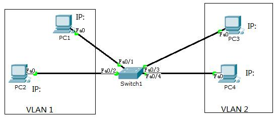
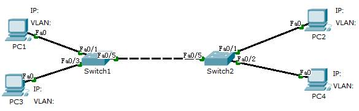

import FileCard from '@site/src/components/FileCard';
import DeadlineProcess from '@site/src/components/DeadlineProcess';
import TaskCard from '@site/src/components/TaskCard';
import ScreenshotCard from '@site/src/components/ScreenshotCard';
import ModernInput from '@site/src/components/ModernInput';
import PlaceHolder from '@site/src/components/PlaceHolder'
import ExportButton from '@site/src/components/ExportButton';
import { Row, Col } from 'antd';

<h3 style={{color: '#006d75', marginTop: 0, marginBottom: 8}}>实验资源</h3>
<DeadlineProcess start={'2025-10-14 18:50:00'} end={'2025-10-28 23:59:59'}/>
<Row gutter={[16, 4]} justify="space-between" style={{marginBottom: -25}}>
    <Col xs={24} sm={24} md={12} lg={24} xl={12} xxl={12}>
        <FileCard file_type={'md'} name={'Lab2 实验报告模板 Markdown版本'} size={'180289'} link={require('@site/assets/templete/md/Lab2 实验报告模板.zip').default} />
    </Col>
    <Col xs={24} sm={24} md={12} lg={24} xl={12} xxl={12}>
        <FileCard file_type={'doc'} name={'Lab2 实验报告模板 Word版本'} size={'214016'} link={require('@site/assets/templete/word/实验报告模版_实验2.doc').default} />
    </Col>
    <Col xs={24} sm={24} md={12} lg={24} xl={12} xxl={12}>
        <FileCard file_type={'pdf'} name={'Lab2 使用二层交换机组网 实验课件'} size={'122365'} link={require('@site/assets/slides/luxq_Lab2.pdf').default} />
    </Col>
</Row>

<PlaceHolder>

## 1 实验目的
* 掌握交换机的工作原理、管理配置方法
* 掌握VLAN的工作原理、配置方法
* 掌握跨交换机的VLAN Trunk配置方法
* 掌握多个交换机的冗余组网、负载平衡的配置方法

## 2 实验步骤

### 2.1 单交换机

<TaskCard number={1} title="绘制网络拓扑图" needScreenshot={false}>

在实验拓扑图上标记交换机的IP地址、PC的IP地址及所属VLAN、交换机的与PC的连接端口

<ScreenshotCard 
  questionId="Lab2-s1"
  title="拓扑图参考"
  uploadOptions={[
    { id: 'topology', label: '上传实际拓扑图' }
  ]}
>
  
</ScreenshotCard>

</TaskCard>

<TaskCard number={2} title="建立Console连接并查看交换机信息" needScreenshot={false}>

找一台有串口的PC机和一根串口控制线，将控制线的一头连接交换机的Console口，另一头连接PC机的串口

在PC机上运行Putty软件，选择Serial方式，默认为9600, COM1。按两下回车，检查是否已经连上交换机。并输入`enable`命令进入到特权模式。如果有密码，请参考[4.清除密码步骤](/docs/Lab2/Lab2_Concise#part-1--单交换机)

输入命令`show version`查看当前交换机型号信息并记录：

设备型号：<ModernInput size="large" questionId="lab2-s2-device-model"/>，IOS软件版本：<ModernInput size="large" questionId="lab2-s2-ios-version"/>，

软件映像文件名：<ModernInput size="large" questionId="lab2-s2-image-file"/>，端口数量：<ModernInput size="large" questionId="lab2-s2-port-count"/>。

</TaskCard>

<TaskCard number={3} title="查看交换机文件系统">

输入命令`show flash`或`dir flash`: 查看当前文件系统的内容

<ScreenshotCard 
  questionId="Lab2-s3"
  title="交换机文件系统截图"
  uploadOptions={[
    { id: 'flash', label: '截图文件系统内容' }
  ]}
>
  
</ScreenshotCard>

</TaskCard>

<TaskCard number={4} title="查看VLAN配置">

显示交换机的VLAN数据（命令`show vlan`）

所有的端口应该都属于VLAN 1，如果存在其他VLAN，请先通过命令`no vlan id`删除

<ScreenshotCard 
  questionId="Lab2-s4"
  title="VLAN配置截图"
  uploadOptions={[
    { id: 'vlan', label: '截图VLAN数据' }
  ]}
>
  
</ScreenshotCard>

</TaskCard>

<TaskCard number={5} title="连接PC并测试端口关闭功能">

用直连网线（straight through）将PC按照前述拓扑结构连接到交换机。然后给各PC配置IP地址，并用Ping检查各PC之间的联通性，确保都能Ping通，否则请检查网线连接。

手工关闭某端口（命令：`shutdown`），输入命令查看该端口状态（命令：`show interface端口号`，如`show interface e0/1`），在其他PC上使用Ping命令检测连接在该端口的PC是否能够联通。

<ScreenshotCard 
  questionId="Lab2-s5"
  title="端口关闭测试截图"
  uploadOptions={[
    { id: 'interface-status', label: '截图命令输出' },
    { id: 'ping-result', label: '截图Ping结果' }
  ]}
/>

</TaskCard>

<TaskCard number={6} title="重新启用端口并测试连通性">

重新打开该端口（命令：`no shutdown`），输入命令查看交换机上端口状态。使用Ping命令检测连接在该端口的PC是否能够联通

<ScreenshotCard 
  questionId="Lab2-s6"
  title="端口启用测试截图"
  uploadOptions={[
    { id: 'interface-up', label: '截图命令输出' },
    { id: 'ping-success', label: '截图Ping结果' }
  ]}
></ScreenshotCard>

</TaskCard>

<TaskCard number={7} title="配置交换机管理IP地址" needRecord={true}>

进入VLAN1接口配置模式（命令：`interface vlan 1`），给VLAN 1配置IP地址即是给交换机配置管理IP地址（命令：`ip address 地址 掩码`）。测试PC是否能Ping通交换机的IP地址；如果不通，查看VLAN 1端口的状态是否是up，如果不是，则打开VLAN端口（`no shutdown`）。

<ScreenshotCard 
  questionId="Lab2-s7"
  title="交换机IP配置截图"
  uploadOptions={[
    { id: 'cmd', label: '记录输入命令', type: 'text', textConfig: {codeEditor: true, initialLines: 2}},
  ]}
></ScreenshotCard>

</TaskCard>

<TaskCard number={8} title="配置远程登录功能">

输入以下命令：打开虚拟终端（命令`line vty 0 4`），允许远程登录（命令： `login`），设置登密码（命令：`password 密码`）

<ScreenshotCard 
  questionId="Lab2-s8"
  title="远程登录配置截图"
  uploadOptions={[
    { id: 'telnet-config', label: '截图配置命令' }
  ]}
></ScreenshotCard>

</TaskCard>

<TaskCard number={9} title="测试Telnet远程连接">

在PC上运行Putty软件，选择telnet协议，输入交换机的IP地址，通过网络远程连接交换机，并输入密码。

<ScreenshotCard 
  questionId="Lab2-s9"
  title="Telnet连接成功截图"
  uploadOptions={[
    { id: 'telnet-success', label: '截图Telnet连接效果' }
  ]}
></ScreenshotCard>

</TaskCard>

<TaskCard number={10} title="使用Wireshark观察网络流量">

在PC1上运行Wireshark，在另外2台（PC2、PC3）上互相持续的Ping（运行`ping IP地址 -t`），观察在PC1上是否能抓取到PC2和PC3发出的ARP广播包以及ICMP响应包。如果不能抓取到PC2、PC3发送的ARP广播包，在PC2、PC3上先运行`arp –d *`删除所有主机的ARP缓存。正常情况下，ICMP响应包是不能被抓取到的。

<ScreenshotCard 
  questionId="Lab2-s10"
  title="Wireshark抓包截图"
  uploadOptions={[
    { id: 'wireshark-capture', label: '截图抓包结果' }
  ]}
></ScreenshotCard>

</TaskCard>

<TaskCard number={11} title="配置端口镜像功能" needRecord={true}>

选择一个交换机端口配置为镜像端口（命令：`monitor session 1 destination interface 端口`），将PC1的网线切换到该端口，将PC2和PC3所连端口配置为被镜像端口（命令：`monitor session 1 source interface 端口`）。继续运行Wireshark，观察在PC1上是否能抓取到PC2和PC3的ICMP响应包。

请记录输入的命令：

<ScreenshotCard 
  questionId="Lab2-s11"
  title="端口镜像配置截图"
  uploadOptions={[
    { id: 'cmd', label: '记录输入命令', type: 'text', textConfig: {codeEditor: true, initialLines: 3}},
    { id: 'mirror-capture', label: '截图镜像后抓包' }
  ]}
></ScreenshotCard>

</TaskCard>

<TaskCard number={12} title="关闭端口镜像功能" needRecord={true} needScreenshot={false}>

关闭PC1端口的镜像功能（命令：`no monitor session 1 destination interface 端口`），否则该端口不能正常收发数据。

<ScreenshotCard 
  questionId="Lab2-s12"
  title="交换机IP配置截图"
  uploadOptions={[
    { id: 'cmd', label: '记录输入命令', type: 'text', textConfig: {codeEditor: true, initialLines: 1}},
  ]}
></ScreenshotCard>

</TaskCard>

<TaskCard number={13} title="创建VLAN并测试隔离效果" needRecord={true}>

在交换机上增加VLAN 2（命令：`vlan database`或`config terminal`，`vlan 2`），将PC3、PC4所连端口加入到VLAN 2（命令：`interface 端口`，`switchport access vlan 2`）。用Ping检查PC之间的联通性（同一VLAN的PC之间能够通，不同VLAN的PC之间不能通）。

<ScreenshotCard 
  questionId="Lab2-s13"
  title="VLAN隔离测试截图"
  uploadOptions={[
    { id: 'cmd', label: '记录输入命令', type: 'text', textConfig: {codeEditor: true, initialLines: 5}},
    { id: 'ping-pc12', label: '截图PC1→2' },
    { id: 'ping-pc13', label: '截图PC1→3' },
    { id: 'ping-pc42', label: '截图PC4→2' },
    { id: 'ping-pc43', label: '截图PC4→3' }
  ]}
></ScreenshotCard>

</TaskCard>

<TaskCard number={14} title="保存交换机配置" needScreenshot={false}>

查看交换机上的运行配置（命令`show running-config`），复制粘贴本节相关的文本。

保存交换机配置到启动配置文件（命令：`copy running-config startup-config`），确保重启后配置不丢失。

<ScreenshotCard 
  questionId="Lab2-s14"
  title="记录运行配置"
  uploadOptions={[
    { id: 'config', label: '记录相关运行配置', type: 'text', textConfig: {codeEditor: true, initialLines: 5}}
  ]}
></ScreenshotCard>

</TaskCard>

### 2.2 多交换机

<TaskCard number={15} title="构建双交换机网络拓扑">

增加一台交换机（Switch2），将PC2、PC4连接到该交换机，并用一根交叉网线（Cross-over）将两个交换机连接起来。在拓扑图上记录各PC的IP地址、连接端口及所在VLAN：

<ScreenshotCard 
  questionId="Lab2-s15"
  title="拓扑图参考"
  uploadOptions={[
    { id: 'topology', label: '上传实际拓扑图' }
  ]}
>
  
</ScreenshotCard>

在Switch2上增加VLAN 2，将PC4所连端口加入到VLAN 2。用Ping检查不同交换机上属于同一VLAN的PC之间的联通性（即PC1与PC2应该通，PC3与PC4不能通）。然后显示2个交换机的VLAN数据（命令`show vlan`）

<ScreenshotCard 
  questionId="Lab2-s15"
  title="双交换机VLAN配置截图"
  uploadOptions={[
    { id: 'switch1-vlan', label: '截图Switch1 VLAN数据' },
    { id: 'switch2-vlan', label: '截图Switch2 VLAN数据' },
    { id: 'ping-pc12', label: '截图PC1→2' },
    { id: 'ping-pc34', label: '截图PC3→4' }
  ]}
/>

</TaskCard>

<TaskCard number={16} title="配置VLAN Trunk模式" needRecord={true}>

将交换机之间的互联端口配置为VLAN Trunk模式（命令：`switchport mode trunk`，部分型号的设备可能要先设置封装协议，命令：`switchport trunk encapsulation dot1q`），再次用Ping检查属于同一VLAN但在不同交换机的PC之间的联通性（即PC1与PC2应该通，PC3与PC4也应该通）。

<ScreenshotCard 
  questionId="Lab2-s16"
  title="VLAN Trunk配置截图"
  uploadOptions={[
    { id: 'cmd', label: '记录输入命令', type: 'text', textConfig: {codeEditor: true, initialLines: 3}},
    { id: 'ping-pc12', label: '截图PC1→2' },
    { id: 'ping-pc34', label: '截图PC3→4' }
  ]}
>
</ScreenshotCard>

</TaskCard>

<TaskCard number={17} title="添加冗余链路并观察STP状态">

再增加一根网线，把2个交换机的另外2个端口连接起来。并将这2个端口都配置成VLAN Trunk模式。稍等片刻，查看4个互联端口的状态（命令：`show spanning-tree`），分别在2个VLAN中标出: 哪个交换机是根网桥？哪些端口处于转发状态（FWD），哪些端口处于阻塞状态（BLK）。

Spanning-tree数据截图示例（请替换成实际显示的）：

<ScreenshotCard 
  questionId="Lab2-s17"
  title="Switch1的STP状态截图"
  uploadOptions={[
    { id: 'switch1-stp', label: '截图Switch1 STP状态' }
  ]}
>
  
</ScreenshotCard>

___

<ScreenshotCard 
  questionId="Lab2-s17"
  title="Switch2的STP状态截图"
  uploadOptions={[
    { id: 'switch2-stp', label: '截图Switch2 STP状态' }
  ]}
>
  
</ScreenshotCard>

</TaskCard>

<TaskCard number={18} title="测试关闭STP的影响">

关闭2个VLAN的STP（命令：`no spanning-tree vlan ID`），观察两个交换机的端口状态指示灯（急速闪动），并在PC上用Ping测试网络的延迟是否加大（甚至可能出现超时或丢包）。

<ScreenshotCard 
  questionId="Lab2-s18"
  title="关闭STP影响测试截图"
  uploadOptions={[
    { id: 'ping-delay', label: '截图Ping结果' }
  ]}
>
</ScreenshotCard>

</TaskCard>

<TaskCard number={19} title="重新启用STP并测试恢复">

重新打开2个VLAN的STP（命令：`spanning-tree vlan ID`）, 观察两个交换机的端口状态指示灯（缓慢闪动），并在PC上用Ping测试网络的延迟是否恢复正常。

<ScreenshotCard 
  questionId="Lab2-s19"
  title="STP恢复测试截图"
  uploadOptions={[
    { id: 'ping-recovery', label: '截图Ping结果' }
  ]}
/>

</TaskCard>

<TaskCard number={20} title="测试STP故障恢复机制">

拔掉连接在2个处于FWD状态端口之间的网线，等待一会儿，查看4个互联端口的状态（命令：`show spaning-tree`）（有些端口可能已经消失）。标出原BLK状态的端口是否变成了FWD状态。

<ScreenshotCard 
  questionId="Lab2-s20"
  title="STP故障恢复截图"
  uploadOptions={[
    { id: 'switch1', label: '截图Switch1端口状态' },
    { id: 'switch2', label: '截图Switch2端口状态' }
  ]}
/>

</TaskCard>

<TaskCard number={21} title="配置端口优先级实现负载均衡" needRecord={true}>

配置2个交换机的互联端口优先级(默认优先级128)，使VLAN1的数据优先通过第1对互联端口传送（命令：`interface 端口`, `spanning-tree vlan 1 port-priority 16`）。使VLAN2的数据优先通过第2对互联端口传送（命令：`interface 端口`, `spanning-tree vlan 2 port-priority 16`）。此处只记录2个交换机各自所使用的命令及参数即可。

<ScreenshotCard 
  questionId="Lab2-s21"
  title="端口优先级配置"
  uploadOptions={[
    { id: 'switch1-cmd', label: '记录Switch1输入命令', type: 'text', textConfig: {codeEditor: true, initialLines: 4}},
    { id: 'switch2-cmd', label: '记录Switch2输入命令', type: 'text', textConfig: {codeEditor: true, initialLines: 4}}
  ]}
/>

</TaskCard>

<TaskCard number={22} title="验证端口优先级配置效果">

拔掉剩下的1根连接互联端口的网线，稍后2根网线重新插上，等待一会儿，查看4个互联端口的状态，分别在2个VLAN中标出:各端口的优先级，哪些端口处于转发状态，哪些端口处于阻塞状态。

<ScreenshotCard 
  questionId="Lab2-s22"
  title="优先级配置效果验证截图"
  uploadOptions={[
    { id: 'switch1', label: '截图Switch1端口状态' },
    { id: 'switch2', label: '截图Switch2端口状态' }
  ]}
/>

</TaskCard>

<TaskCard number={23} title="测试链路故障时的负载均衡切换">

拔掉其中1根连接互联端口的网线，查看4个互联端口中原先处于BLK状态的端口，是否变成了FWD状态（哪个VLAN发生了变化）

<ScreenshotCard 
  questionId="Lab2-s23"
  title="负载均衡切换测试截图"
  uploadOptions={[
    { id: 'switch1', label: '截图Switch1端口状态' },
    { id: 'switch2', label: '截图Switch2端口状态' }
  ]}
/>

</TaskCard>

<TaskCard number={24} title="保存交换机运行配置" needScreenshot={false}>

记录2个交换机上的运行配置（命令:`show running-config`），复制粘贴本节相关的文本（完整的内容请放在文件中，每个交换机一个文件，分别命名为S1.txt、S2.txt）。

<ScreenshotCard 
  questionId="Lab2-s24"
  title="记录运行配置"
  uploadOptions={[
    { id: 'switch1', label: '记录Switch1运行配置', type: 'text', textConfig: {codeEditor: true, initialLines: 5}},
    { id: 'switch2', label: '记录Switch1运行配置', type: 'text', textConfig: {codeEditor: true, initialLines: 5}}
  ]}
></ScreenshotCard>

</TaskCard>

## 3 实验结果与分析

根据你观察到的实验数据和对实验原理的理解，分别解答以下问题：

* 端口状态显示为administratively down，意味着什么意思？

  <ModernInput size="exlarge" questionId="lab2-analysis-q1"/>

* 在交换机配置为镜像端口前，为什么可以抓取到其他PC之间的ARP请求包，而不能抓取ARP响应包？

  <ModernInput size="exlarge" questionId="lab2-analysis-q2"/>

* PC属于哪个VLAN，是由PC自己可以配置的，还是由交换机决定的？

  <ModernInput size="exlarge" questionId="lab2-analysis-q3"/>

* 同一个VLAN的PC，如果配置了不同长度的子网掩码，能够互相Ping通吗？

  <ModernInput size="exlarge" questionId="lab2-analysis-q4"/>

* 为什么在划分为2个VLAN后，两组PC之间就不能进行IP通信了呢？

  <ModernInput size="exlarge" questionId="lab2-analysis-q5"/>

* 交换机在VLAN Trunk模式下使用的封装协议是什么？

  <ModernInput size="exlarge" questionId="lab2-analysis-q6"/>

* 未启用STP（Spanning Tree Protocol）协议时，交换机之间连接了多条网线后，为什么Ping测试的响应会延迟很大甚至超时？

  <ModernInput size="exlarge" questionId="lab2-analysis-q7"/>

* 从插上网线后开始，交换机的端口状态出现了哪些变化？大约需要多少时间才能成为FWD状态？期间，连接在该端口的计算机是否能够Ping通？

  <ModernInput size="exlarge" questionId="lab2-analysis-q8"/>

## 4 常见问题

## 5 导出实验报告

<ExportButton templatePath={require('@site/assets/base_report/Lab2.zip').default} labName="Lab2" labId="lab2-" />

</PlaceHolder>