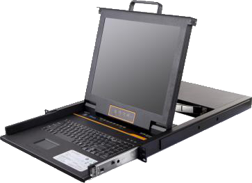

import FileCard from '@site/src/components/FileCard';
import DeadlineProcess from '@site/src/components/DeadlineProcess';
import TaskCard from '@site/src/components/TaskCard';
import ScreenshotCard from '@site/src/components/ScreenshotCard';
import ModernInput from '@site/src/components/ModernInput';
import ExportButton from '@site/src/components/ExportButton';
import { Row, Col } from 'antd';

import PortsSvg from '@site/docs/docs/Lab2/img/ports.svg';

<h3 style={{color: '#006d75', marginTop: 0, marginBottom: 8}}>实验资源</h3>
<DeadlineProcess start={'2025-10-14 18:50:00'} end={'2025-10-28 23:59:59'}/>
<Row gutter={[16, 4]} justify="space-between" style={{marginBottom: -25}}>
    <Col xs={24} sm={24} md={12} lg={24} xl={12} xxl={12}>
        <FileCard file_type={'md'} name={'Lab2 实验报告模板 Markdown版本'} size={'180289'} link={require('@site/assets/templete/md/Lab2 实验报告模板.zip').default} />
    </Col>
    <Col xs={24} sm={24} md={12} lg={24} xl={12} xxl={12}>
        <FileCard file_type={'doc'} name={'Lab2 实验报告模板 Word版本'} size={'214016'} link={require('@site/assets/templete/word/实验报告模版_实验2.doc').default} />
    </Col>
    <Col xs={24} sm={24} md={12} lg={24} xl={12} xxl={12}>
        <FileCard file_type={'pdf'} name={'Lab2 使用二层交换机组网 实验课件'} size={'122365'} link={require('@site/assets/slides/luxq_Lab2.pdf').default} />
    </Col>
</Row>

## 1 实验目的

在Lab1中，我们通过Wireshark“看见”了网络中无形的数据包，理解了数据在协议栈中是如何层层封装的，而在本次及以后的实验中，我们将会自底向上逐步探索网络模型的各层；本次实验，我们就将深入数据链路层，亲手搭建和配置一个由二层交换机组成的局域网

二层交换机是构建现代局域网的核心设备，它工作在OSI模型的第二层——数据链路层，通过学习和记录网络中设备的MAC地址，实现数据帧在端口之间的快速、精确转发；相比于早已被淘汰的集线器的广播模式，交换机极大地提升了网络效率和安全性

通过本次实验，你将：

* 掌握交换机的工作原理与命令行配置方法
* 理解并实践VLAN的划分与隔离作用
* 配置Trunk链路，实现VLAN跨交换机通信
* 探索多交换机间冗余组网、负载平衡的配置方法，理解生成树协议的工作机制

## 2 实验步骤

### 2.0 了解实验室设备

<TaskCard number={1} title="熟悉实验机柜" needScreenshot={false}>

我们的实验将在标准的服务器机柜中进行，首先来熟悉一下它的基本布局

* **机柜顶部**：固定本次实验需要用到的PC1-PC4共4台电脑，机箱上会有标签帮助你识别它们，这些PC的以太网口、串口等所有接口都在机箱后部
* **机柜中间**：你会看到一个可以抽拉出来的设备，这就是KVM（键盘、显示器和鼠标切换器），我们稍后会详细介绍它的用法
* **其余部分**：间隔安装了各种网络设备，例如路由器和防火墙，本次实验暂不涉及这些设备

</TaskCard>

<TaskCard number={2} title="学习使用KVM" needScreenshot={false}>

背景知识：为什么需要KVM

KVM是键盘（Keyboard）、显示器（Video）和鼠标（Mouse）的缩写，它是一种硬件设备，允许用户通过一套键盘、显示器和鼠标来控制多台计算机

想象一个拥有数十甚至上百台服务器的数据中心或实验室，如果每台服务器都配一套独立的键盘、显示器和鼠标，那将是巨大的空间浪费和布线噩梦，KVM的出现就是为了解决这个问题，它将所有计算机的键鼠和视频信号集中起来，我们只需坐在一个控制台前，就可以方便地在不同设备之间切换，进行管理和配置，能够有效避免我们在这种涉及设备众多的实验中异变为八爪章鱼（bushi）

KVM可以让你用一套键鼠和显示器控制机柜内的多台PC，大大节省了空间和操作复杂度

**拉出与收回**：先将KVM从机柜中抽出，如果无法拉出，请寻找顶部的解锁滑块并将其推开
:::warning 推拉KVM时手指务必远离两侧滑轨，以防夹伤
:::
**切换PC**：
  * **快捷键**：不同型号的KVM快捷键不同（参见KVM上的说明贴纸，通常是**双击 `Caps Lock` 键**或 `Scroll Lock` 键），按下快捷键后，屏幕上会弹出一个菜单，你可以通过数字键选择要连接的PC
  * **实体按键**：部分KVM面板上配有实体按键，直接按下对应PC编号的按钮即可切换
  * **USB连接**：部分KVM可以连接一个USB设备，将其透传给被操作的PC，由于KVM的触控板极其难用，你可以通过这种方式改用你的鼠标
  * **唤醒PC**：如果切换后屏幕不亮，说明PC可能处于休眠状态，按任意键即可唤醒

:::tip 提示

由于部分PC可能没有正常关机（如直接断电），开机后可能需要按F1键进入BIOS设置状态，随后可以直接按ESC键退出，进入Windows操作系统

:::

</TaskCard>

<TaskCard number={3} title="找到并连接二层交换机" needScreenshot={false}>

本次实验的主角是二层交换机，你可以通过端口密度来快速区分路由器和交换机，一般而言，交换机的端口非常密集（如12个、24个甚至更多），而路由器的端口则相对较少

我们实验机柜内安装的大部分设备都是路由器（例如Cisco 1921型号），通常没有可用的二层交换机，这时你需要从旁边的存放机柜中取出一台二层交换机，并使用机柜里空闲的（或路由器上的）、与交换机电源接口兼容的供电线缆为其连接供电

存放的交换机可能因为之前的实验配置而设置了无法清除的密码或存在其他无法正常使用的问题，如遇到这种情况请尝试更换另一台交换机；如果实在没有可用的二层交换机，你也可以使用桌上备用的白色Cisco 3560三层交换机来进行实验，不开启三层路由功能时与二层交换机功能无异

由于实验室的网络设备及其扩展卡存在差异，实验室二层交换机可用的端口范围可能有一定不同，对于我们的实验而言，E(10兆)/FE(100兆)/Gi(1000兆) (Ethernet/FastEthernet/GigibitEthernet)接口均可使用，不需要使用和示例绝对相同的接口编号

<PortsSvg style={{zoom: "20%"}} />

如图所示，交换机等设备接口的编号一般会在每列接口的上方/左右侧，且会有箭头灯指示数字对应上方或下方接口；对于接口前缀，你可以`show interfaces`查看

指示灯不亮表示该接口未插入有效线缆（本机/对端关闭接口时同样不亮）；黄色的指示灯表示对应的线路可能存在配置问题，或正在学习；绿色的指示灯表示线路正常，闪烁表示正在进行数据传输

</TaskCard>

<TaskCard number={4} title="认识Console线缆" needScreenshot={false}>

与我们日常使用的PC不同，交换机、路由器这类专业的网络设备通常没有显示器和键盘接口；那么一台全新的、尚未配置IP地址的交换机需要如何进行初始设置呢？答案是带外管理（Out-of-Band Management）

Console端口就是实现带外管理的关键，它提供了一个独立于数据网络的串行通信接口，通过专门的Console线（通常一端是RJ45接口，另一端是RS-232或USB接口）将PC与交换机的Console口连接，我们就可以绕开网络，直接访问设备的命令行界面，进行最底层的配置

由于用于带外管理，请注意Console端口是**不能代替网线**进行数据传输的，相应接口与接线不反映在拓扑图中，只用于配置连接上的网络设备，因此每台网络设备使用一根Console线配置即可；Console线连接到的电脑没有任何要求，你可以选择连接在实验室电脑上，也可以选择连接在自己的电脑上

一般而言，Console口在网络设备上都会使用蓝色标注出来，你可以在设备前/后寻找；而连接电脑时，如连接机柜的电脑，请直接将RS-232接口连接到机箱背后的串口卡上；连接实验室笔记本或自己的电脑时，请使用连接了串口转接线的Console线USB接口一侧连接；实验室不提供MiniUSB接口的Console线缆

:::warning 注意

* 由于RJ45接口的弹片容易在拔插时损坏，实验室现有的Console线固定在接口的能力普遍较差，容易因轻微触动而连接不良；如果发现和网络设备的连接不正常/终端无反应，请检查Console口是否松动
* Console线的一端是RS-232串口，该接口有螺丝用于紧密固定，请你在拔插接口时**务必先拧松螺丝**，以免损伤实验设备

:::

</TaskCard>

<TaskCard number={5} title="认识以太网线" needScreenshot={false}>

相信生活中，你应该或多或少已经见过一条网线，但实验报告中直通/交叉网线又有怎样的区别呢？它们的差异在于内部8芯线缆在RJ45水晶头中的排列顺序，即线序；以太网通信通常分别使用其中的4根线来发送(TX)和接收(RX)数据，而定义具体哪几根的通用线序标准主要有两种：

* **T568A线序**：绿白、绿、橙白、蓝、蓝白、橙、棕白、棕
* **T568B线序**：橙白、橙、绿白、蓝、蓝白、绿、棕白、棕

基于这两种线序，我们可以制作出两种不同的网线：
* **直通线** (**Straight-Through**): 两端水晶头都采用相同的线序标准（通常都是T568B标准），用于连接不同类型的设备，例如PC连交换机；这是因为这些设备的网口针脚定义是互补的，一方的发送端(TX)正好对应另一方的接收端(RX)
* **交叉线** (**Crossover**): 一端水晶头采用T568A标准，另一端采用T568B标准，这使得一端的发送针脚(TX)正好连接到另一端的接收针脚(RX)；它用于连接相同类型的设备，例如PC连PC 或交换机连交换机

关于直通线和交叉线，我们有一个好消息和坏消息：好消息是，现代大多数网络设备（包括我们实验用的较新的交换机）都支持Auto-MDIX功能，端口可以自动检测对端设备的类型和所用线缆的类型，并相应地在内部“翻转”其发送和接收针脚的功能，此时你使用直通线或交叉线通常都能正常工作；坏消息是，实验室的一小部分二层交换机仍然不能混用直通线和交叉线，此时你需要严格按实验指导的要求使用网线（实验室的交叉线为浅蓝色**圆**线）

实验室的交叉线是浅蓝色**圆**线（不要和Console线扁线混淆），上有黄色线标；其他线一般均为直通线

</TaskCard>

:::important 注意

以下实验记录均需结合屏幕截图，进行文字标注和描述，图片应大小合适、关键部分清晰可见，**禁止手机拍屏**，可直接在图片上进行标注，也可以单独用文本进行描述

由于实验室设备有限，本实验允许2人组队完成，请在提交的报告中标注同组同学

:::

### 2.1 单交换机

<TaskCard number={1} title="绘制网络拓扑图" needScreenshot={false}>

背景知识：什么是网络拓扑图？

网络拓扑图（Network Topology Diagram）是用于表示网络结构和布局的示意图，它如同网络的“地图”，直观地展示了网络中各个组件（如计算机、交换机、路由器等）以及它们之间的连接关系，反映以下的信息：

* **物理拓扑**: 关注的是设备的物理布局和线缆的实际连接方式，告诉我们“设备在哪里？”和“线缆如何连接，连接在哪个接口上？”的问题
* **逻辑拓扑**: 关注的是数据在网络中的流向路径，而不关心设备的物理位置，它描述了IP地址的分配、VLAN的划分等逻辑层面的信息

在本实验中，我们绘制的拓扑图兼具物理和逻辑两种属性，既展示PC与交换机端口的物理连接，也需要标明IP地址、VLAN划分等逻辑配置；一份清晰、准确的拓扑图是进行网络配置、管理和故障排查的必备工具

清晰的网络拓扑图是网络设计与排错的基础，请先根据实验要求理解物理拓扑，再动手连接设备；IP地址、VLAN不需要在现在立刻确定，在实验第一部分**相应步骤完成时**，请你再根据实验的实际完成情况，在实验拓扑图上**逐步**清晰地标记出每台PC和交换机的IP地址、PC所属的VLAN，以及PC与交换机连接的具体接口编号，作为你后续配置的蓝图

<ScreenshotCard 
  questionId="Lab2-s1"
  title="拓扑图参考"
  uploadOptions={[
    { id: 'topology', label: '上传实际拓扑图' }
  ]}
>
  
</ScreenshotCard>

</TaskCard>

<TaskCard number={2} title="建立Console连接并查看交换机信息" needScreenshot={false}>

IOS基本命令与操作技巧

本次实验中，我们接触到的交换机使用的是Cisco的IOS（Internetwork Operating System，不是Apple更晚发布的iOS），这是一个功能强大的网络操作系统，几乎所有的配置和管理都是通过命令行完成的，因此熟悉IOS的基本操作是网络工程师的必备技能，也是减少不必要搬砖步骤的重要基础

:::tip 温馨提示

实验报告中填写使用的命令、命令截图等均不要求使用完整命令，且允许使用Tab/?等提示，你可以采用最简洁的方式输入命令以减少工作量

:::

**用户模式与特权模式**: 类似Linux等系统，iOS也存在用户权限的区别，连接成功后，提示符通常为`Switch>`，这表示当前处于用户模式，只能执行一些基本的查看命令，权限受限；输入 `enable`命令后提示符变为`Switch#`，进入特权模式，可以查看所有状态信息并进入全局配置模式

**全局配置模式**：在特权模式下，输入`configure terminal`（可简写为`conf t`），进入全局配置模式，提示符变为`Switch(config)#`，**几乎所有的设备级配置**都在这个模式下进行

**接口配置模式**：要对特定端口进行配置需要全局配置模式进入相应接口的配置模式，例如使用`interface FastEthernet 0/1`（除部分较老的路由器，其他设备上均可简写为`int f0/1`）进入1号端口的配置模式，提示符变为`Switch(config-if)#`

在进行实验时，你需要时刻注意自己所处的模式（即关注当前的提示符），因为不同提示符下操作的对象不同，能进行的操作也不同，这里汇总如下：

| 模式名称 | 提示符示例 | 简述 | 进入命令示例 | 适用配置类型 |
| :--- | :--- | :--- | :--- | :--- |
| **用户模式**  | `Switch>` | 权限最低，只能执行基本查看命令和连接测试 | 首次登录/`exit` | 基本查看/测试 |
| **特权模式**| `Switch#` | 可执行所有查看命令/保存配置/进入配置模式 | `enable`| 查看所有状态/保存配置 |
| **全局配置** | `Switch(config)#` | **设备级配置**的起点绝大多数配置都需从这里开始 | `conf t` | 主机名、密码、时钟、路由协议启动、VLAN创建等 |
| **接口配置**  | `Switch(config-if)#` | 配置特定的物理或逻辑接口 (如端口、子接口) | `interface F0/1` | 端口IP地址/子网掩码/状态等 |
| **线路配置** | `Switch(config-line)#` | 配置用户接入设备的方式，例如通过远程终端 |  `line vty 0 4` | 设置控制台/远程登录的密码、认证方式等 |
| **路由配置** | `Router(config-router)#` | **专门用于配置路由协议**，如 OSPF、BGP、EIGRP、RIP | `router ospf 1` | 配置进程ID、网络范围、区域等路由参数 |
| **VLAN配置** | `Switch(config-vlan)#` | 用于进行特定 VLAN 的配置 | `vlan 10` | VLAN 名称、VTP 模式等 |

---

**命令行技巧**:

* **命令补全**: 输入命令的前几个字母，按下Tab键，系统会自动补全命令
* **命令缩写**: 只要输入的字符能够唯一识别一个命令就可以使用缩写，例如`sh`可代替`show`，请积极使用缩写减轻自己负担
* **寻求帮助**: 在任何模式下输入`?`可以显示当前可用的所有命令，在命令后输入`?`可以查看该命令需要哪些参数
* **历史命令**: 按键盘的向上箭头`↑`可以快速调出之前执行过的命令
* **终端操作**: 在Putty等终端软件中，鼠标左键拖动选择文本即为复制，鼠标右键单击即为粘贴

1. 使用Console控制线连接PC的串口（或USB转串口）与交换机的Console口
2. 在PC上运行终端模拟软件（如Putty，Tabby），连接方式选择`Serial`，速率（Speed）设为`9600`，并选择正确的COM端口号（如`COM1`无法连接，请右键此电脑-管理-设备管理器-端口（COM和LPT），寻找相应设备的端口号）
3. 打开连接后，按几下回车键，若屏幕上出现 Switch> 提示符，则表示连接成功
   :::tip 首次启动提示
   对于一台没有配置的交换机，首次启动时可能会出现`Would you like to enter the initial configuration dialogue? [yes/no]:`的提示，这里我们选择输入 no 并回车，直接进入命令行界面进行手动配置
   :::
4. 输入 `enable` 命令进入特权模式，如交换机设置有密码导致无法进入，请参考以下步骤
    

    
清除Cisco设备的密码

      * **物理连接**: 保持PC与交换机的Console连接
      * **进入ROMMON模式**: 断开交换机电源，用手指按住交换机面板上的`Mode`按钮不放，然后重新接通电源；观察交换机面板的指示灯，等待`SYST`灯由闪烁变为常亮，再变为快速闪烁后，松开`Mode`按钮
      * **初始化Flash**: 在Putty中，你会看到 `switch:` 提示符，这表示进入了ROM监控（ROMMON）模式，输入 `flash_init` 命令初始化闪存文件系统
      * **重命名配置文件**: 输入 `dir flash:` 查看闪存内容，找到名为 `config.text` 的文件（交换机的启动配置文件），输入 `rename flash:config.text flash:config.old` 将其重命名，这样交换机下次启动时就找不到配置文件，会以默认的空配置启动，密码自然也就清除了
      * **重启**: 输入 boot 命令，交换机将加载IOS并以出厂设置启动
    

5. 输入命令`show version`查看当前交换机型号信息并记录：
      * 设备型号：<ModernInput size="large" questionId="lab2-s2-device-model"/>（进行资产管理和故障申报的基础信息）
      * IOS软件版本：<ModernInput size="large" questionId="lab2-s2-ios-version"/>（用于判断设备是否存在已知的安全漏洞（CVE）或软件Bug）
      * 软件映像文件名：<ModernInput size="large" questionId="lab2-s2-image-file"/>（在需要升级或恢复系统时，必须知道正确的文件名）
      * 端口数量：<ModernInput size="large" questionId="lab2-s2-port-count"/>（进行网络规划的基础信息）

</TaskCard>

<TaskCard number={3} title="查看交换机文件系统">

背景知识：交换机的存储器

交换机内部有几种不同类型的存储器，各自承担着不同的角色：

* **Flash（闪存）**: 这是一种非易失性存储器，主要用于存放IOS操作系统映像文件（如.bin文件）和配置文件，通过`show flash`或`dir flash:`命令查看的就是这部分内容
* **NVRAM（非易失性随机访问存储器）**: 用于存放设备的启动配置文件（startup-config），交换机开机时会从这里加载配置
* **RAM（随机访问存储器）**: 这是易失性存储器，用于存放当前正在运行的配置（running-config）、IOS操作系统、MAC地址表、ARP缓存等，**设备断电后，不会留下任何RAM中的内容**，请务必`write`保存所需的配置，以免不慎断电后损失全部工作

输入命令`show flash`或`dir flash:` 查看当前文件系统的内容

<ScreenshotCard 
  questionId="Lab2-s3"
  title="交换机文件系统截图示例"
  uploadOptions={[
    { id: 'flash', label: '截图文件系统内容' }
  ]}
>
  
</ScreenshotCard>

</TaskCard>

<TaskCard number={4} title="查看VLAN配置">

背景知识：VLAN——虚拟局域网

在一个传统的局域网中，所有设备都处于同一个广播域，这意味着任何一台设备发送一个广播帧（例如ARP请求），网络中所有其他设备都会收到并处理它；当网络规模变大时，大量的广播流量会消耗宝贵的网络带宽和设备CPU资源，形成“广播风暴”，严重影响网络性能

**VLAN**（**虚拟局域网**）技术应运而生，它将一个物理上的局域网在逻辑上划分成多个独立的广播域，为什么要这样做呢？主要有以下几个原因：

- **控制广播风暴 (Broadcast Control)**：这是VLAN最主要的功能，将网络划分为多个VLAN，广播流量就被限制在各自的VLAN内部，极大地减少了不必要的流量，提升了网络整体性能
- **增强网络安全 (Security)**：不同VLAN之间的设备在二层上是完全隔离的，无法直接通信，这就像为不同部门或用户组建立了逻辑上的“墙”，防止了未授权的访问
- **提升网络管理的灵活性 (Flexibility)**：VLAN允许网络管理员根据部门、功能或项目等逻辑关系来组织网络，而不是受限于用户的物理位置，当一个员工从一楼搬到三楼时，无需重新布线，只需在交换机上修改端口的VLAN配置，就可以让他继续留在原来的工作网络中，极大地简化了网络管理

默认情况下，一台全新的思科交换机上所有端口都属于 **VLAN 1**，这是一个默认的、不能被删除的管理VLAN

使用命令 `show vlan` 显示交换机当前的VLAN数据库,确认所有端口都默认属于VLAN 1

如果之前存在其它VLAN配置，请进入全局配置模式，使用 `no vlan <vlan-id>` 命令（例如 `no vlan 2`）将其删除，以保证实验环境的纯净

<ScreenshotCard 
  questionId="Lab2-s4"
  title="VLAN配置截图示例"
  uploadOptions={[
    { id: 'vlan', label: '截图VLAN数据' }
  ]}
>
  
</ScreenshotCard>

</TaskCard>

<TaskCard number={5} title="连接PC并测试端口关闭功能">

背景知识：端口状态

交换机端口有两个主要的状态指标：

* **管理状态(Administrative Status)**：指端口是否被人为地开启或关闭，我们使用`shutdown` 命令将其置为`administratively down`状态，使用`no shutdown`命令将其开启
* **线路协议状态(Line Protocol Status)**：指端口在物理层和数据链路层是否正常工作，如果网线没插好、对端设备未开机或双工模式不匹配，这个状态可能就是`down`

一个端口只有在这两个状态都为 up 时，才能正常转发数据

1. 根据你绘制的拓扑图，用直通网线将PC连接到交换机的相应端口
2. 为各台PC配置唯一的、在同一个子网内的静态IP地址，确保它们在同一个子网内（例如192.168.1.x，子网掩码均为255.255.255.0）
   

   
 配置示例与提示 

    考虑到我们搭建的是一个用于测试的内部网络，不妨任意选择一个私有网络为实验主机分配（专为局域网内部使用而保留，不能在公共互联网上路由，不同的内部网络即使使用相同的地址范围/地址也不会发生冲突），例如选择 192.168.0.0/24（子网掩码255.255.255.0），此时192.168.0.H中192.168.0.0作为网络的标识，而H作为主机标识，我们需要为每台PC配置一个独一无二的主机地址

    在分配地址时请注意，一个网段中最小的地址（如 192.168.0.0）是网络ID，最大的地址（如 192.168.0.255）是广播地址，而紧邻网络ID的地址（如 192.168.0.1）通常会作为网关，我们应该避免使用这些特殊地址；为了方便操作记忆，建议你选择与PC序号关联的IP，例如为PC1选择 192.168.0.10，其余PC也按此方式选取

    请注意！由于完成本实验时你尚未学习网络层相关内容，这部分示例与提示的描述为便于你理解进行了高度的简化，子网划分与选择、私有地址范围等知识点请以后续课程学习为准，这也是考试的一个考察重点
   
 
   * Windows10： 控制面板-网络与共享中心-更改网络适配器设置-有线网卡-配置IPv4
   * Windows11： 设置-网络和Internet-属性，如IP分配方式为自动（DHCP），点击编辑修改为手动，启用IPv4并进行配置，DNS可任意填写

3. 在PC上使用`ping`命令测试彼此之间的连通性，确保所有PC都能互相Ping通，如果Ping不通，请仔细检查IP配置和网线连接
    :::warning 注意

    对于实验室的笔记本电脑，建议先禁用其无线网卡，以免同时连接有线网与校网导致非预期行为

    请检查确认涉及的PC是否已关闭网络防火墙（Windows安全中心-防火墙和网络保护-关闭全部类型网络的防火墙），否则无法响应ICMP请求

    :::
4. 进入交换机上某个连接了PC的端口的接口配置模式（如 `interface fastethernet 0/1`），输入 `shutdown` 命令
5. 使用 `show interface fastethernet 0/1` 命令查看该端口的状态，观察其管理状态的变化
6. 在其它PC上再次Ping连接在该关闭端口上的PC，验证其网络连接是否已中断

    <ScreenshotCard 
      questionId="Lab2-s5"
      title="端口关闭测试截图"
      uploadOptions={[
        { id: 'interface-status', label: '截图命令输出' },
        { id: 'ping-result', label: '截图Ping结果' }
      ]}
    />

</TaskCard>

<TaskCard number={6} title="重新启用端口并测试连通性">

:::tip 温馨提示
相信现在你已经意识到了端口未启用的影响，请注意端口默认均是关闭的，当你遇到预料外的网络中断，请确认自己是否`no shutdown`过
:::

在被关闭端口的接口配置模式下，输入 `no shutdown` 命令重新启用该端口，输入命令查看交换机上端口状态，并使用Ping命令检测连接在该端口的PC是否能够联通

<ScreenshotCard 
  questionId="Lab2-s6"
  title="端口启用测试截图"
  uploadOptions={[
    { id: 'interface-up', label: '截图命令输出' },
    { id: 'ping-success', label: '截图Ping结果' }
  ]}
></ScreenshotCard>

</TaskCard>

<TaskCard number={7} title="配置交换机管理IP地址" needRecord={true} needScreenshot={false}>

背景知识：SVI——交换机的虚拟网卡

二层交换机的本质工作是处理数据链路层的以太网帧，它本身并不理解三层（网络层）的IP地址，那为什么我们还要给它配置IP地址呢？

这个IP地址并非用于转发业务数据，而是专用于**管理**，拥有IP地址后，我们就可以通过网络（例如使用Telnet或SSH）远程登录到交换机进行配置和监控，而无需每次都跑到设备旁连接Console线，对于复杂的大型机房来说这一点非常重要

由于物理端口是用于转发数据的，我们不能直接在物理端口上配置IP,取而代之的是我们在一个虚拟的接口上配置IP ，这个接口就是**交换虚拟接口（Switched Virtual Interface, SVI）**；每个VLAN都可以创建一个对应的SVI，命令 `interface vlan <vlan-id>` 创建的就是VLAN的SVI，将IP地址配置在 `interface vlan 1`上，就意味着我们创建了一个属于VLAN 1的管理接口，其IP地址就是交换机的管理IP

需要注意的是，在实际的网络工程实践中，将管理流量保留在默认的VLAN 1通常被认为是不安全的做法

1. 进入VLAN 1的SVI配置模式：`interface vlan 1`
2. 为该接口配置一个**与PC同网段**的IP地址及**与各PC均相同的子网掩码**：`ip address <地址> <掩码>`
3. 在PC上测试是否能Ping通交换机的管理IP地址
4. 若不通请检查VLAN 1接口的状态（`show ip interface brief`），如果状态为down，请在该接口配置模式下使用 `no shutdown` 命令启用它

<ScreenshotCard 
  questionId="Lab2-s7"
  title="交换机IP配置截图"
  uploadOptions={[
    { id: 'cmd', label: '记录输入命令', type: 'text', textConfig: {codeEditor: true, initialLines: 2}},
  ]}
></ScreenshotCard>

</TaskCard>

<TaskCard number={8} title="配置远程登录功能">

背景知识：VTY——虚拟终端线路

VTY（Virtual Teletype）是交换机上用于接受远程登录（如Telnet、SSH）的虚拟线路，一台交换机可以支持多个并发的远程登录会话，`line vty 0 4`命令表示我们正在配置编号从0到4的这5条虚拟线路（仅作为演示，数量本身没有含义）；`login`要求登录这些线路时需要进行身份验证；`password`设置登录时需要输入的密码

请注意：Telnet协议以明文形式传输所有数（包括密码），存在严重的安全风险，生产环境中请使用更安全的SSH协议进行远程管理

1. 打开虚拟终端：`line vty 0 4`
2. 允许远程登录：`login`
3. 设置登录密码：`password 密码`

<ScreenshotCard 
  questionId="Lab2-s8"
  title="远程登录配置截图"
  uploadOptions={[
    { id: 'telnet-config', label: '截图配置命令' }
  ]}
></ScreenshotCard>

</TaskCard>

<TaskCard number={9} title="测试Telnet远程连接">

在PC上运行Putty/Tabby软件，这次连接类型选择telnet协议，并输入刚刚配置的交换机的管理IP地址，通过网络远程连接交换机，并输入密码

<ScreenshotCard 
  questionId="Lab2-s9"
  title="Telnet连接成功截图"
  uploadOptions={[
    { id: 'telnet-success', label: '截图Telnet连接效果' }
  ]}
></ScreenshotCard>

</TaskCard>

<TaskCard number={10} title="使用Wireshark观察网络流量">

背景知识：交换机的工作原理

二层交换机通过维护一张**MAC地址表**（**MAC Address Table**）来实现数据帧的精确转发，这张表记录了“哪个MAC地址的主机连接在哪个端口上”

* **学习**: 当一个数据帧进入交换机某个端口时，交换机会检查该帧的源MAC地址，如果表中没有这个MAC地址的记录，交换机就会将这个MAC地址与进入端口的对应关系学习并添加到表中
* **转发**: 交换机检查帧的目标MAC地址，如果目标MAC在表中能找到对应的出端口，交换机就只将该帧从那个特定端口转发出去（这称为单播）；如果目标MAC在表中找不到（未知单播），或者目标MAC是广播地址（FF:FF:FF:FF:FF:FF）或多播地址，交换机就会将该帧向除进入端口外的所有其他同VLAN端口转发（这称为泛洪/Flooding）

本步骤PC2 Ping PC3时，ICMP响应包的目标MAC是PC2的MAC，是单播帧；交换机会根据MAC地址表精确地将它只转发到连接PC2的端口，因此PC1是抓不到的；而ARP请求是广播帧，交换机会将其泛洪，所以PC1能抓到

你可以通过这样的步骤观察交换机的学习过程：

* 在所有PC Ping 之前，先在交换机上执行`show mac address-table`，观察目前的表项，此时表中可能只有CPU自己的条目或者为空
* 让PC2 Ping PC3
* 立即再次在交换机上执行`show mac address-table`，和最开始的内容进行比较

1. 在PC1上运行Wireshark，开始捕获流经其网卡的数据包
2. 在PC2上持续ping PC3（`ping [PC3_IP] -t`）
3. 观察PC1上的Wireshark，看看是否能捕获到PC2和PC3之间通信的ARP广播包和ICMP单播包；如果看不到ARP包，请在PC2和PC3上执行 `arp -d *` 清除ARP缓存

<ScreenshotCard 
  questionId="Lab2-s10"
  title="Wireshark抓包截图"
  uploadOptions={[
    { id: 'wireshark-capture', label: '截图抓包结果' }
  ]}
></ScreenshotCard>

</TaskCard>

<TaskCard number={11} title="配置端口镜像功能" needRecord={true}>

背景知识：端口镜像（SPAN）

正如上一步所见，交换机的精确转发使得网络管理员难以在不影响网络结构的情况下监听特定端口的流量，为了解决这个问题，交换机提供了端口镜像（Port Mirroring）功能，在Cisco设备上称为SPAN（Switched Port Analyzer）

SPAN可以将一个或多个**源端口（Source Port）的流量（包括进入和流出的）复制一份，发送到一个指定的目的端口（Destination Port）**；我们将网络分析设备（比如装有Wireshark的PC）连接到目的端口，就可以“旁观”源端口的所有通信内容，这对于网络监控和故障排查至关重要

1. 在全局配置模式下配置镜像会话，将一个交换机端口设置为目的端口：`monitor session 1 destination interface [端口]`
2. 将PC1的网线切换到这个镜像端口上
3. 将被监听的PC2和PC3所连的端口设置为被镜像的源端口：`monitor session 1 source interface [端口]`
4. 在PC1上继续运行Wireshark，观察现在是否能抓取到PC2和PC3之间的ICMP单播包

<ScreenshotCard 
  questionId="Lab2-s11"
  title="端口镜像配置截图"
  uploadOptions={[
    { id: 'cmd', label: '记录输入命令', type: 'text', textConfig: {codeEditor: true, initialLines: 3}},
    { id: 'mirror-capture', label: '截图镜像后抓包' }
  ]}
></ScreenshotCard>

</TaskCard>

<TaskCard number={12} title="关闭端口镜像功能" needRecord={true} needScreenshot={false}>

配置为镜像目的端口的接口将不能用于正常的网络通信，完成上一步骤后，请在全局配置模式下输入命令关闭PC1端口的镜像功能（命令：`no monitor session 1 destination interface 端口`），否则该端口不能正常收发数据

<ScreenshotCard 
  questionId="Lab2-s12"
  title="交换机IP配置截图"
  uploadOptions={[
    { id: 'cmd', label: '记录输入命令', type: 'text', textConfig: {codeEditor: true, initialLines: 1}},
  ]}
></ScreenshotCard>

</TaskCard>

<TaskCard number={13} title="创建VLAN并测试隔离效果" needRecord={true}>

现在，我们将体验VLAN的隔离作用

1. 进入全局配置模式，增加VLAN 2：`config terminal`或`vlan database`，`vlan 2`
2. 将PC3、PC4所连接的端口划入VLAN 2，请进入这些端口的接口配置模式：
   - `interface [端口]`
   - `switchport mode access` (将端口模式恢复为默认的接入模式，因为之前班级的同学可能对端口配置有修改)
   - `switchport access vlan 2` (将端口加入VLAN 2)
3. 使用`ping`命令全面测试PC间的连通性，你会发现：
   - 同在VLAN 1的PC1和PC2之间可以ping通
   - 同在VLAN 2的PC3和PC4之间可以ping通
   - 处于不同VLAN的PC之间（如PC1 ping PC3）则无法ping通，证明VLAN成功地隔离了二层通信

<ScreenshotCard 
  questionId="Lab2-s13"
  title="VLAN隔离测试截图"
  uploadOptions={[
    { id: 'cmd', label: '记录输入命令', type: 'text', textConfig: {codeEditor: true, initialLines: 5}},
    { id: 'ping-pc12', label: '截图PC1→2' },
    { id: 'ping-pc13', label: '截图PC1→3' },
    { id: 'ping-pc42', label: '截图PC4→2' },
    { id: 'ping-pc43', label: '截图PC4→3' }
  ]}
></ScreenshotCard>

</TaskCard>

<TaskCard number={14} title="保存交换机配置" needScreenshot={false}>

查看交换机上的运行配置（命令：`show running-config`），复制粘贴本节相关的文本

<ScreenshotCard 
  questionId="Lab2-s14"
  title="记录运行配置"
  uploadOptions={[
    { id: 'config', label: '记录相关运行配置', type: 'text', textConfig: {codeEditor: true, initialLines: 5}}
  ]}
></ScreenshotCard>

</TaskCard>

### 2.2 多交换机

<TaskCard number={15} title="构建双交换机网络拓扑">

现在，我们将网络扩展到两台交换机

1. 新增一台交换机（Switch2），并按照拓扑图将PC2、PC4连接到Switch2上；用一根交叉网线（Cross-over）将两个交换机连接起来；在拓扑图上记录各PC的IP地址、连接端口及所在VLAN：
    <ScreenshotCard 
      questionId="Lab2-s15"
      title="拓扑图参考"
      uploadOptions={[
        { id: 'topology', label: '上传实际拓扑图' }
      ]}
    >
      
    </ScreenshotCard>
2. 使用一根交叉网线（在支持Auto-MDIX的设备上也可使用直通网线）将两台交换机连接起来
3. 在Switch2上同样创建VLAN 2，并将连接PC4的端口划入VLAN 2
4. 用Ping测试PC间（PC1→2，PC3→4）的连通性，你会发现连接在不同交换机上、但都属于VLAN 2的PC之间无法通信（PC3 Ping PC4不通），而属于VLAN 1的PC1和PC2之间却可以Ping通
5. 分别在两台交换机上使用 `show vlan` 查看VLAN信息
    <ScreenshotCard 
      questionId="Lab2-s15"
      title="双交换机VLAN配置截图"
      uploadOptions={[
        { id: 'switch1-vlan', label: '截图Switch1 VLAN数据' },
        { id: 'switch2-vlan', label: '截图Switch2 VLAN数据' },
        { id: 'ping-pc12', label: '截图PC1→2' },
        { id: 'ping-pc34', label: '截图PC3→4' }
      ]}
    />

</TaskCard>

<TaskCard number={16} title="配置VLAN Trunk模式" needRecord={true}>

背景知识：Trunk——跨越交换机的VLAN高速公路

上一步中，为什么同属VLAN 2的PC3和PC4无法通信？因为连接两个交换机的端口默认是接入端口（Access Port），它只能承载一个VLAN的流量，而Access接口默认属于 VLAN 1；因此只有属于VLAN 1的PC能跨VLAN通信，而其他VLAN的数据则无法通过这个接口

为了解决这个问题，我们需要引入**干道链路（Trunk Link）**，Trunk链路就像一条多车道高速公路，可以同时承载来自多个不同VLAN的流量，这是通过**帧标记**（**Frame Tagging**）实现的，当一个以太网帧要通过Trunk链路时，交换机会在帧头和数据之间插入一个额外的“标签”，指明这个帧属于哪个VLAN；目前最主流的标记协议是 **IEEE 802.1Q**，对端交换机收到这个带标签的帧后，读取标签就知道该如何处理它，从而实现了VLAN信息在交换机之间的传递

1. 在两台交换机上，**分别**进入连接彼此的那个端口的接口配置模式
2. 输入 `switchport mode trunk` 命令，将端口模式配置为Trunk
   - 注：现代Cisco交换机上的端口默认模式是`dynamic auto`或`dynamic desirable`，并且它们只支持`dot1q`这一种封装方式，因此封装协议是自动协商的，无需也无法手动指定；而部分老型号交换机可能需要先执行 `switchport trunk encapsulation dot1q` 来指定封装协议为802.1Q
3. 配置完成后，再次测试属于同一VLAN但在不同交换机的PC1与PC2、PC3与PC4之间的连通性，此时它们应该能够均能成功ping通

<ScreenshotCard 
  questionId="Lab2-s16"
  title="VLAN Trunk配置截图"
  uploadOptions={[
    { id: 'cmd', label: '记录输入命令', type: 'text', textConfig: {codeEditor: true, initialLines: 3}},
    { id: 'ping-pc12', label: '截图PC1→2' },
    { id: 'ping-pc34', label: '截图PC3→4' }
  ]}
>
</ScreenshotCard>

</TaskCard>

<TaskCard number={17} title="添加冗余链路并观察STP状态">

背景知识：STP——交换网络中的“交通指挥”

为了提高网络的可靠性，我们经常在交换机之间建立冗余链路，但这样做会带来致命的环路问题，当环路存在时，一个广播帧可以被无休止地循环转发，并且每循环一次都会被复制，迅速形成广播风暴，耗尽所有网络带宽和设备CPU，导致整个网络瘫痪；同时，环路也会导致交换机的MAC地址表剧烈地、反复地更新，造成MAC地址表不稳定

**生成树协议**（**Spanning Tree Protocol, STP**）就是为了解决这个问题而设计的，它的核心思想是在一个具有物理环路的网络中，通过分布式的算法逻辑地**阻塞**（**Block**）掉一些端口，从而在数据转发层面计算并维护一个无环路的树状拓扑；同时STP会持续监控网络状态，一旦当前正在使用的活动链路出现故障，它会自动取消对备份链路端口的阻塞，恢复网络连通性，实现了链路的自动冗余切换

STP算法的核心是网络中的所有交换机通过交换**BPDU**（**Bridge Protocol Data Unit，桥协议数据单元**）消息，来共同完成以下两个步骤：

1. **选举一台根桥（Root Bridge）**: 网络中会依据**网桥ID（Bridge ID）**选举出一个唯一的根桥，Bridge ID由一个可配置的优先级和交换机的MAC地址组成，Bridge ID最小的交换机将成为根桥（即优先级没有差异时，MAC地址最小的为根桥）
2. **为每台非根桥交换机确定一个根端口（Root Port），为每个网段确定一个指定端口（Designated Port）**:
   - **根端口**：在每一台非根桥上，离根桥“最近”的端口，“近”是通过路径开销，通常与链路带宽有关，带宽越高，开销越小
   - **指定端口**：在每一个物理网段（链路）上，离根桥“最近”的端口
   - 所有既不是根端口也不是指定端口的端口，最终都会被置于**阻塞状态（Blocking, BLK）**，它们不转发用户数据，只接收BPDU，从而打破环路

整个过程是自动的，初始时每台交换机都认为自己是根桥，并向邻居发送自己的BPDU；收到邻居的BPDU后，交换机进行比较，如果发现邻居的Bridge ID更优（更小），它就会更新自己的信息，并开始转发这个更优的BPDU；最终全网将对谁是根桥以及每个端口的角色达成一致，形成一棵稳定的生成树

STP的学习分为以下几个阶段，你可以在以下步骤等待时反复输出生成树状态，观察端口状态的变化：

* `Blocking` (阻塞): 仅接收BPDU，不转发数据，防止环路
* `Listening` (侦听): 开始发送和接收BPDU，参与根桥和端口角色的选举，但不学习MAC地址
* `Learning` (学习): 端口角色已确定，开始学习MAC地址，但仍不转发数据，防止临时的转发环路
* `Forwarding` (转发): 端口完全激活，既学习MAC地址也转发数据

每个状态默认会持续一段时间，这就是等待时间的来源

1. 再增加一根网线，连接两台交换机的另外两个空闲端口，形成冗余链路
2. 将这两个新连接的端口也配置为Trunk模式
3. **等待约1分钟**，让STP协议完成计算和收敛
4. 在两台交换机上，输入 `show spanning-tree` 命令，查看4个互联端口状态
5. 根据命令输出，分别在2个VLAN中标出：哪个交换机是根桥（Root Bridge）？哪些端口是转发状态（FWD），哪些是阻塞状态（BLK）？（对于根桥来说，所有链路都是到根桥（它本身）本身最近的链路，所以不会被阻塞，因此根桥上所有接口均处于FWD状态处于正常现象）

<ScreenshotCard 
  questionId="Lab2-s17"
  title="Switch1 STP数据示例"
  uploadOptions={[
    { id: 'switch1-stp', label: '截图Switch1 STP状态' }
  ]}
>
  
</ScreenshotCard>

___

<ScreenshotCard 
  questionId="Lab2-s17"
  title="Switch2 STP数据示例"
  uploadOptions={[
    { id: 'switch2-stp', label: '截图Switch2 STP状态' }
  ]}
>
  
</ScreenshotCard>

</TaskCard>

<TaskCard number={18} title="测试关闭STP的影响">

为了直观感受没有生成树协议后的影响，我们不妨手动关闭生成树协议以观察恐怖的网络风暴

1. 在两台交换机上，分别关闭VLAN 1和VLAN 2的STP：`no spanning-tree vlan [VLAN ID]`
2. 观察交换机互联端口的状态指示灯，它们会开始急速闪烁，这正是广播风暴的迹象
3. 在PC上尝试ping其他设备，你会发现延迟急剧增大，甚至出现大量丢包和超时

<ScreenshotCard 
  questionId="Lab2-s18"
  title="关闭STP影响测试截图"
  uploadOptions={[
    { id: 'ping-delay', label: '截图Ping结果' }
  ]}
>
</ScreenshotCard>

</TaskCard>

<TaskCard number={19} title="重新启用STP并测试恢复">

我们姑且还是不要再折磨可怜的交换机了，现在，让我们重新启用生成树协议：`spanning-tree vlan [VLAN ID]`，让整个网络恢复正常工作，此时你应该能观察到两个交换机的端口状态指示灯恢复缓慢闪动，在PC上用Ping测试网络的延迟应当也会恢复正常

<ScreenshotCard 
  questionId="Lab2-s19"
  title="STP恢复测试截图"
  uploadOptions={[
    { id: 'ping-recovery', label: '截图Ping结果' }
  ]}
/>

</TaskCard>

<TaskCard number={20} title="测试STP故障恢复机制">

如果生成树协议只是找到并阻塞形成环路的线路中的一条，那么这和直接拔掉这根冗余线路，放弃冗余性没有区别了，生成树协议另外强大的一点就是能够动态更新，从而在链路变化或遇到故障时实现自愈；现在，我们模拟主链路故障，观察生成树协议下的链路状态会发生怎样的变化

1. 拔掉那根两个端口**都处于FWD状态**的网线
2. 等待约1分钟，让STP重新收敛
3. 在交换机上再次输入 `show spanning-tree` 命令（有些端口可能已经消失）
4. 观察并在图中标记原先处于BLK状态的端口是否已经转换为了FWD状态，从而接管了数据转发任务

<ScreenshotCard 
  questionId="Lab2-s20"
  title="STP故障恢复截图"
  uploadOptions={[
    { id: 'switch1', label: '截图Switch1端口状态' },
    { id: 'switch2', label: '截图Switch2端口状态' }
  ]}
/>

</TaskCard>

<TaskCard number={21} title="配置端口优先级实现负载均衡" needRecord={true}>

背景知识：利用PVST+实现VLAN负载均衡

标准的STP协议会将冗余链路置于阻塞状态，这意味着备份链路在正常情况下是完全闲置的，对于极其宝贵的带宽而言是巨大损失，思科的**PVST+**（**Per-VLAN Spanning Tree Plus**）协议为每个VLAN都运行一个独立的STP实例，这为我们实现负载均衡（Load Balancing）提供了可能

我们可以通过调整**端口优先级**（**Port Priority**）来影响STP的端口角色选举，优先级数值越小，代表优先级越高（默认128）；通过为不同VLAN在不同链路上设置不同的端口优先级，我们可以“引导”STP为VLAN 1选择一条路径，同时为VLAN 2选择另一条路径，这样两条物理链路就都得到了利用，实现了流量的分担

为了便于描述，我们不妨将两条互联链路分别称为链路A和链路B，我们的目标是：VLAN 1的流量走链路A，链路B作为备份；VLAN 2的流量走链路B，链路A作为备份

1. 配置VLAN 1的流量优先走链路A，在2台交换机上对该网线的接口分别进行配置：`interface 端口1`, `spanning-tree vlan 1 port-priority 16`，此时该链路的优先级高于另一个链路（数值越小，优先级越高，你也可以选择另外的＜128的数值）
2. 配置VLAN 2的流量优先走链路B，在2台交换机上对该网线的接口分别进行配置：`interface 端口2`, `spanning-tree vlan 2 port-priority 16`

<ScreenshotCard 
  questionId="Lab2-s21"
  title="端口优先级配置"
  uploadOptions={[
    { id: 'switch1-cmd', label: '记录Switch1输入命令', type: 'text', textConfig: {codeEditor: true, initialLines: 4}},
    { id: 'switch2-cmd', label: '记录Switch2输入命令', type: 'text', textConfig: {codeEditor: true, initialLines: 4}}
  ]}
/>

</TaskCard>

<TaskCard number={22} title="验证端口优先级配置效果">

将所有网线重新插好，等待STP收敛然后执行`show spanning-tree`，仔细观察VLAN 1和VLAN 2的STP状态，在相应的截图中标记各端口的优先级，哪些端口处于转发状态，哪些端口处于阻塞状态；此时你应该能看到：

* 在VLAN 1的STP实例中，链路A的端口是FWD，链路B的端口是BLK
* 在VLAN 2的STP实例中，链路B的端口是FWD，链路A的端口是BLK

<ScreenshotCard 
  questionId="Lab2-s22"
  title="优先级配置效果验证截图"
  uploadOptions={[
    { id: 'switch1', label: '截图Switch1端口状态' },
    { id: 'switch2', label: '截图Switch2端口状态' }
  ]}
/>

</TaskCard>

<TaskCard number={23} title="测试链路故障时的负载均衡切换">

拔掉其中一根互联的网线（例如链路A），等待STP收敛后，查看端口状态；查看4个互联端口中原先处于BLK状态的端口，是否变成了FWD状态（哪个VLAN发生了变化）

<ScreenshotCard 
  questionId="Lab2-s23"
  title="负载均衡切换测试截图"
  uploadOptions={[
    { id: 'switch1', label: '截图Switch1端口状态' },
    { id: 'switch2', label: '截图Switch2端口状态' }
  ]}
/>

</TaskCard>

<TaskCard number={24} title="保存交换机运行配置" needScreenshot={false}>

记录2个交换机上的运行配置（命令:`show running-config`），复制粘贴本节相关的文本，随后将完整的内容放在文件中（每个交换机一个文件，分别命名为S1.txt、S2.txt）随报告压缩提交

<ScreenshotCard 
  questionId="Lab2-s24"
  title="记录运行配置"
  uploadOptions={[
    { id: 'switch1', label: '记录Switch1运行配置', type: 'text', textConfig: {codeEditor: true, initialLines: 5}},
    { id: 'switch2', label: '记录Switch2运行配置', type: 'text', textConfig: {codeEditor: true, initialLines: 5}}
  ]}
></ScreenshotCard>

</TaskCard>

## 3 实验结果与分析

根据你观察到的实验数据和对实验原理的理解，分别解答以下问题：

* 端口状态显示为administratively down，意味着什么意思？
  <ModernInput size="exlarge" questionId="lab2-analysis-q1"/>
* 在交换机配置为镜像端口前，为什么可以抓取到其他PC之间的ARP请求包，而不能抓取ARP响应包？
  <ModernInput size="exlarge" questionId="lab2-analysis-q2"/>
* PC属于哪个VLAN，是由PC自己可以配置的，还是由交换机决定的？
  <ModernInput size="exlarge" questionId="lab2-analysis-q3"/>
* 同一个VLAN的PC，如果配置了不同长度的子网掩码，能够互相Ping通吗？
  <ModernInput size="exlarge" questionId="lab2-analysis-q4"/>
* 为什么在划分为2个VLAN后，两组PC之间就不能进行IP通信了呢？
  <ModernInput size="exlarge" questionId="lab2-analysis-q5"/>
* 交换机在VLAN Trunk模式下使用的封装协议是什么？
  <ModernInput size="exlarge" questionId="lab2-analysis-q6"/>
* 未启用STP（Spanning Tree Protocol）协议时，交换机之间连接了多条网线后，为什么Ping测试的响应会延迟很大甚至超时？
  <ModernInput size="exlarge" questionId="lab2-analysis-q7"/>
* 从插上网线后开始，交换机的端口状态出现了哪些变化？大约需要多少时间才能成为FWD状态？期间，连接在该端口的计算机是否能够Ping通？
  <ModernInput size="exlarge" questionId="lab2-analysis-q8"/>

## 4 常见问题

## 5 导出实验报告

<ExportButton templatePath={require('@site/assets/base_report/Lab2.zip').default} labName="Lab2" labId="lab2-" />
