import FileCard from '@site/src/components/FileCard';
import DeadlineProcess from '@site/src/components/DeadlineProcess';
import TaskCard from '@site/src/components/TaskCard';
import ScreenshotCard from '@site/src/components/ScreenshotCard';
import ModernInput from '@site/src/components/ModernInput';
import ExportButton from '@site/src/components/ExportButton';
import GridContainer from '@site/src/components/GridContainer';

<h3 style={{color: '#006d75', marginTop: 0, marginBottom: 8}}>实验资源</h3>
<DeadlineProcess start={'2025-10-28 18:50:00'} end={'2025-11-11 23:59:59'}/>
<GridContainer>
        <FileCard file_type={'md'} name={'Lab3 实验报告模板 Markdown版本'} size={'194092'} link={require('@site/assets/templete/md/Lab3 实验报告模板.zip').default} />
        <FileCard file_type={'doc'} name={'Lab3 实验报告模板 Word版本'} size={'247296'} link={require('@site/assets/templete/word/实验报告模版_实验3.doc').default} />
        <FileCard file_type={'pdf'} name={'Lab3 使用三层交换机组网 实验课件'} size={'632105'} link={require('@site/assets/slides/luxq_Lab3-使用三层交换机组网.pdf').default} />
</GridContainer>

## 1 实验目的

在Lab2中，我们已经掌握了如何使用VLAN将一个物理局域网隔离成多个逻辑上的广播域，但这也带来了新的问题：处于不同VLAN的设备默认无法互相通信；本次实验，我们将深入探索网络层，学习如何打破VLAN间的壁垒，实现跨VLAN的数据交换

通过本次实验，你将：
- 掌握并比较“单臂路由”与“三层交换”这两种主流的VLAN间路由技术
- 学习在路由器上配置子接口，理解其在逻辑上分割物理接口的原理
- 学习并实践三层交换机的工作机制与配置方法，感受其高效的路由转发性能

## 2 实验数据记录和处理

:::important 提示
以下实验记录均需结合屏幕截图，进行文字标注和描述，图片应大小合适、关键部分清晰可见，严禁手机拍屏，可直接在图片上进行标注，也可以单独用文本进行描述

记录所使用的命令时，请保留命令前面的提示符，如`Switch2#`、`Router(config)#`等

由于实验室设备有限，本实验允许2人组队完成，请在提交的报告中标注同组同学
:::

### 2.1 单臂路由

背景知识：为什么VLAN间需要路由？

我们在上一个实验中学习到，VLAN的核心作用是在数据链路层（二层）实现网络隔离，将广播帧限制在各自的VLAN内部；这极大地提升了网络的安全性和性能，但也带来一个必然结果：不同VLAN的设备在二层上是完全“老死不相往来”的

然而在真实的网络环境中，不同部门（如销售部和技术部）的设备往往需要互相访问共享资源，这就产生了VLAN间通信的需求；由于二层交换机无法跨越VLAN的边界，这个任务就必须交给能够在不同网段间转发数据包的网络层（三层）设备来完成，这个过程就是**VLAN间路由**

本节我们将学习第一种实现VLAN间路由的技术——**单臂路由（Router-on-a-Stick）**

<TaskCard number={1} title="搭建基础网络拓扑并配置VLAN" needScreenshot={true} needRecord={false}>

在通过VLAN技术成功构建出逻辑隔离的多个广播域后，一个显而易见的问题随之产生，即处于不同VLAN的设备之间默认无法进行二层以上的通信，因为二层交换机的工作范畴仅限于VLAN内部的数据链路层转发，它无法理解网络层的IP地址，也就无法扮演网关的角色

而要打破VLAN间的壁垒以实现跨子网的IP报文路由，就必须引入三层设备——路由器，一种直接的思路是为每个VLAN都分配一个路由器物理接口，但这将极大消耗路由器有限且昂贵的端口资源，当VLAN数量增多时，该方案缺乏扩展性且成本高昂

为解决此问题，更为经济且高效的“单臂路由”方案应运而生，其核心思想在于，利用一条配置为Trunk模式的链路连接交换机与路由器，使这条单一链路足以承载所有VLAN的流量，路由器则在其物理接口上创建多个逻辑子接口，每个子接口封装对应的VLAN ID并作为该VLAN的网关，从而仅凭“单臂”即可完成所有VLAN间的数据路由与转发

接下来，我们将构建一个包含两个逻辑隔离网络的基础环境用于体验单臂路由；将2台PC和1台路由器连接至同1台二层交换机，随后在交换机上创建新的VLAN，并将2台PC所连接的端口分别划入不同的VLAN；为这2台PC配置分属不同网段的IP地址，从而在逻辑上彻底将它们分隔在两个独立的子网和广播域中

:::warning 注意
由于实验室三层交换机（CX3560）数量有限（仅23台，不足以满足全部小组同时实验），本步骤中请尽量不要使用三层交换机代替二层交换机，以便让同学们均能正常完成实验；如三层交换机不足，可考虑和其他小组错开实验，即一组先进行单臂路由部分实验，另一组同时进行三层交换部分实验
:::

这一步是后续所有配置的基础，它模拟了企业网络中不同部门被划分到不同VLAN的典型场景

<ScreenshotCard 
  questionId="Lab3-p1-s1" 
  title="网络拓扑图参考" 
  uploadOptions={[
    { id: 'topology', label: '上传网络拓扑图' }
  ]}
>
  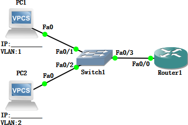
</ScreenshotCard>

</TaskCard>

<TaskCard number={2} title="验证VLAN间隔离" needScreenshot={true} needRecord={false}>

接下来，我们验证上一步VLAN划分是否成功生效：在两台PC上互相尝试用Ping命令通信

预期的结果应该是不通的；这是因为它们处于不同的VLAN，二层交换机会将它们的广播（如ARP请求）和单播流量严格限制在各自的VLAN内部，这也验证了我们确实需要一个三层设备来打破这种隔离

<ScreenshotCard 
  questionId="Lab3-p1-s2" 
  title="PC间Ping结果示例" 
  uploadOptions={[
    { id: 'ping_test', label: '截图Ping结果' }
  ]}
>
  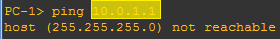
</ScreenshotCard>

</TaskCard>

<TaskCard number={3} title="配置Trunk端口" needScreenshot={false} needRecord={false}>

背景知识：为何交换机与路由器之间需要Trunk

路由器要实现VLAN间路由就必须能够同时接收和发送来自多个VLAN的数据，而如果我们为每个VLAN都用一根单独的物理网线连接到路由器的不同物理端口，当VLAN数量很多时将会极大地浪费路由器上宝贵的物理接口资源

Trunk链路能帮我们解决这个问题，它允许单一物理鏈路承载多个VLAN的流量，交换机会在发送数据帧到Trunk链路前，为其打上802,1Q标签以标明其所属的VLAN，路由器接收到带标签的帧后，就能识别出它来自哪个VLAN，从而进行正确的路由处理

将二层交换机和路由器连接的端口配置成VLAN Trunk模式（原理与配置方法请参考Lab2，无需截图），使其能够承载来自不同VLAN的数据流量

例：配置命令（示例为GNS3模拟的配置截图，使用实际设备请参考实验2）

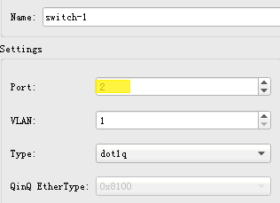

例：配置后的结果（示例为GNS3模拟的结果截图，使用实际设备请参考实验2）

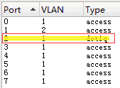

</TaskCard>

<TaskCard number={4} title="配置路由器子接口实现单臂路由" needScreenshot={false} needRecord={true}>

背景知识：子接口——路由器的“虚拟网卡”

**子接口**（**Subinterface**）是一项将单个物理路由器接口在逻辑上划分为多个虚拟接口的技术；在单臂路由场景中，我们为每个需要路由的VLAN都创建一个对应的子接口；

每个子接口都可以被独立配置IP地址，并与一个特定的VLAN ID绑定（通过`encapsulation dot1q`命令）；这样一来，每个子接口就成为了对应VLAN网络的**默认网关**，监听并处理来自该VLAN的数据包；当路由器从一个子接口（例如VLAN 1的网关）收到一个目标地址在另一个VLAN（例如VLAN 2）的数据包时，它会查询自己的路由表，然后将这个数据包从另一个子接口（VLAN 2的网关）转发出去，从而巧妙地利用逻辑接口实现了VLAN间的通信

现在我们开始配置单臂路由的核心部分：

1. 连接路由器的Console口，进入路由器的配置模式
2. 在路由器连接交换机的端口上创建2个子接口（命令：`interface [type] [slot/unit.sub]`，如：`interface e0/1.1`）
3. 配置子接口所属的VLAN（命令：`encapsulation dot1q VLAN编号`）
4. 使用与2台PC一致的子网，分别给2个子接口配置IP地址
5. 激活**接口**和两个子接口（命令：`no shutdown`）

<ScreenshotCard 
  questionId="Lab3-p1-s4" 
  title="路由器子接口配置命令" 
  uploadOptions={[
    { id: 'router_config', label: '记录配置命令', type: 'text', textConfig: {codeEditor: true, initialLines: 6} }
  ]}
/>

</TaskCard>

<TaskCard number={5} title="配置PC的IP地址和默认网关" needScreenshot={true} needRecord={false}>

背景知识：默认网关——跨网段通信的“出口”

当一台PC（源）要发送数据包给另一台设备（目的）时，它首先要做一个关键判断：目的设备是否与自己在同一个子网内？

这个判断过程如下：
* PC用自己的子网掩码和自己的IP地址进行“与”运算，得出自己所在的网络地址
* PC用自己的子网掩码和目的IP地址进行“与”运算，得出目的设备所在网络的地址

如果两个网络地址相同，说明目标就在“本地”，PC会通过ARP协议获取对方的MAC地址，然后直接在二层将数据帧发给对方；

如果两个网络地址不同，说明目标在“远方”，PC无法直接送达，必须把这个“快递”交给一个能通往其他网络的“中转站”，这个中转站就是默认网关（Default Gateway）；此时，PC会通过ARP获取默认网关的MAC地址，然后将数据包发给网关（数据包中的目标IP仍然是最终目的设备，但数据帧的目标MAC是网关的MAC），由网关负责后续的路由转发

因此，为PC正确配置默认网关，是其能够访问外部网络或不同VLAN的关键一步

为了让PC能够将跨网段的流量发送给路由器处理，我们必须为其正确配置默认网关

请根据拓扑图，为两台PC设置静态IP地址，并将其默认网关分别设置为对应VLAN的路由器子接口的IP地址；这个配置告诉PC：“凡是要发送到本地子网以外的数据包，都请发给这个网关地址”，这样路由器才能接管跨VLAN的通信任务

<ScreenshotCard 
  questionId="Lab3-p1-s5" 
  title="PC网络配置示例" 
  uploadOptions={[
    { id: 'pc1_config', label: '截图PC1网络配置' },
    { id: 'pc2_config', label: '截图PC2网络配置' }
  ]}
>
   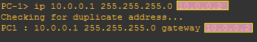
   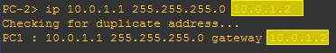
</ScreenshotCard>

</TaskCard>

<TaskCard number={6} title="测试PC与路由器子接口连通性" needScreenshot={true} needRecord={false}>

在进行最终的跨VLAN连通性测试之前，先做一个基础验证；分别在两台PC上Ping它们各自的默认网关地址（即路由器上对应的子接口IP）；如果能Ping通，说明PC到路由器的三层链路是通畅的，这是实现VLAN间路由的前提

<ScreenshotCard 
  questionId="Lab3-p1-s6" 
  title="PC Ping子接口结果示例" 
  uploadOptions={[
    { id: 'pc1_ping_router', label: '截图PC1 Ping结果' },
    { id: 'pc2_ping_router', label: '截图PC2 Ping结果' }
  ]}
>
   
   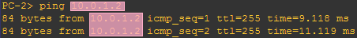
</ScreenshotCard>

</TaskCard>

<TaskCard number={7} title="测试PC间互相连通性" needScreenshot={true} needRecord={false}>

现在是见证成果的时刻，请测试两台分属不同VLAN的PC能否互相ping通

如果配置正确，此时应该能够Ping通，数据包经过源PC → 交换机 → (Trunk链路) → 路由器子接口 → 路由器内部路由 → 另一个路由器子接口 → (Trunk链路) → 交换机 → 目的PC的路径到达目标主机；这个测试的成功标志着我们已经成功配置了单臂路由

<ScreenshotCard 
  questionId="Lab3-p1-s7" 
  title="PC间Ping结果示例" 
  uploadOptions={[
    { id: 'pc_ping_test', label: '截图PC间Ping结果' }
  ]}
>
  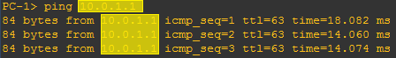
</ScreenshotCard>

</TaskCard>

<TaskCard number={8} title="查看路由器路由表" needScreenshot={true} needRecord={false}>

为了理解路由器是如何做出转发决策的，请查看并截图它的“导航地图”——路由表

使用`show ip route`命令，你会看到路由表中出现了两条标记为C（Connected）的直连路由，分别对应我们配置的两个子接口所在的网段；正是因为这两条路由的存在，路由器才知道如何将数据包从一个VLAN的网段转发到另一个VLAN的网段

<ScreenshotCard 
  questionId="Lab3-p1-s8" 
  title="路由表内容示例" 
  uploadOptions={[
    { id: 'routing_table', label: '截图路由表' }
  ]}
>
  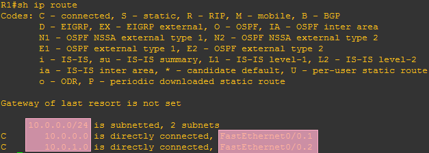
</ScreenshotCard>

</TaskCard>

<TaskCard number={9} title="记录路由器运行配置" needScreenshot={false} needRecord={true}>

记录路由器上的运行配置（命令：`show running-config`），复制粘贴本节相关的文本（完整内容请放在文件中，命名为R1.txt，随报告压缩提交）

<ScreenshotCard 
  questionId="Lab3-p1-s9" 
  title="路由器运行配置" 
  uploadOptions={[
    { id: 'running_config', label: '记录相关配置', type: 'text', textConfig: {codeEditor: true, initialLines: 14} }
  ]}
/>

</TaskCard>

### 2.2 三层交换

背景知识：三层交换——更高效的VLAN间路由

单臂路由虽然能解决VLAN间通信问题，但它在架构上存在一个根本性的场景错配：试图用为广域网设计、端口昂贵且稀少的路由器，去处理局域网内部海量、高并发的跨VLAN流量；这导致了两个核心问题：首先，所有流量都必须通过单一的物理链路进出路由器，该链路极易成为瓶颈；其次，传统路由器（尤其是该场景下的）依赖CPU进行软转发，其性能无法高效应对局域网内部的巨大吞吐需求

三层交换（Layer 3 Switching）技术正是为了解决这种**高密度局域网环境下的高速转发需求**而生的；它在硬件层面集成了二层交换和三层路由功能，其设计的精妙之处在于**功能取舍**：

1.  **保留**了二层交换机**高密度的物理端口**和**低成本**的特性，这满足了局域网连接大量终端的需求
2.  **增加**了一个**为局域网优化的三层路由引擎**；剥离了局域网来说很少用到的、传统路由器昂贵的广域网功能（如BGP、MPLS、深缓存），只专注于用高速ASIC处理最需要的VLAN间IP转发和访问控制

执行三层交换功能的设备被称为三层交换机或多层交换机；相比单臂路由，这种设计的优势在于它实现了**极高的性价比**：

* **高吞吐量与线速转发**：路由过程由专用的ASIC在设备的高速**内部**总线上处理，彻底解决了单臂路由的外部链路瓶颈和CPU软转发瓶颈，使VLAN间转发可以达到“线速”（即不低于链路的理论最大速率）
* **高端口密度与低成本**：以接近二层交换机的成本，提供了数十个具有线速路由能力的端口，这在经济上是传统路由器方案无法比拟的
* **简化拓扑**：无需额外连接和管理路由器，网络结构更简洁高效

本节，我们将体验这种更现代、更高效的VLAN间路由方式

<TaskCard number={1} title="搭建三层交换网络拓扑" needScreenshot={true} needRecord={false}>

我们将在**第一部分的基础**上改造网络，用三层交换机替代路由器；

:::warning 注意
如果你在未完成第一部分的情况下进行本部分的实验，请先完成第一部分中非路由器部分的配置，否则无法正常实验

请注意拓扑图中PC3/4的VLAN分配，往年有很多同学不慎错误配置
:::

1. 移除路由器，将二层交换机与一台三层交换机互联
2. 新增两台PC（PC3、PC4）直接连接到三层交换机上
3. 规划并为新PC分配所在VLAN内的合适IP地址，并在图中标记各设备的IP地址和VLAN

<ScreenshotCard 
  questionId="Lab3-p2-s1" 
  title="三层交换网络拓扑图示例" 
  uploadOptions={[
    { id: 'l3_topology', label: '上传网络拓扑图' }
  ]}
>
  
</ScreenshotCard>

</TaskCard>

<TaskCard number={2} title="配置三层交换机VLAN" needScreenshot={true} needRecord={true}>

与二层交换机一样，三层交换机也需要先创建VLAN并分配端口

1. 在三层交换机上增加1个VLAN
2. 将直连的两台PC（PC3、PC4）的端口分别划入不同的VLAN中；这一步的操作与在二层交换机上完全相同，因为三层功能是构建在二层基础之上的
3. 查看并截图记录配置结果（命令`show vlan`或者`show vlan-switch`）

<ScreenshotCard 
  questionId="Lab3-p2-s2" 
  title="VLAN配置结果示例" 
  uploadOptions={[
    { id: 'vlan_config_cmd', label: '记录配置命令', type: 'text', textConfig: {codeEditor: true, initialLines: 4} },
    { id: 'vlan_show_result', label: '截图配置结果' }
  ]}
>
  
</ScreenshotCard>

</TaskCard>

<TaskCard number={3} title="配置VLAN接口IP地址" needScreenshot={false} needRecord={true}>

现在，我们为VLAN创建三层接口；

1. 进入全局配置模式
2. 使用`interface vlan [VLAN ID]`命令为之前创建的两个VLAN分别创建SVI（交换虚拟接口，概念介绍参见Lab2）
3. 使用`ip address [IP地址] [子网掩码]`为每个SVI配置IP地址，作为对应VLAN的网关

<ScreenshotCard 
  questionId="Lab3-p2-s3" 
  title="VLAN接口IP地址配置" 
  uploadOptions={[
    { id: 'vlan_ip_config', label: '记录配置命令', type: 'text', textConfig: {codeEditor: true, initialLines: 4} }
  ]}
/>

</TaskCard>

<TaskCard number={4} title="启用三层交换机路由功能" needScreenshot={false} needRecord={false}>

默认情况下，许多多层交换机仅作为纯二层设备工作，以防止意外的路由行为；我们需要在全局配置模式下使用`ip routing`命令，明确地开启它的三层路由功能，这样它才能构建路由表并执行数据包的路由转发

</TaskCard>

<TaskCard number={5} title="配置PC的IP地址和默认网关" needScreenshot={true} needRecord={false}>

与之前类似，客户端PC需要知道它们的网关在哪里；请按照拓扑图为PC3和PC4配置IP地址，并将它们的默认网关分别设置为三层交换机上对应VLAN的SVI接口IP地址

<ScreenshotCard 
  questionId="Lab3-p2-s5" 
  title="PC网络配置示例" 
  uploadOptions={[
    { id: 'pc3_config', label: '截图PC3网络配置' },
    { id: 'pc4_config', label: '截图PC4网络配置' }
  ]}
>
   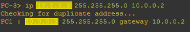
   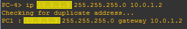
</ScreenshotCard>

</TaskCard>

<TaskCard number={6} title="测试PC与VLAN接口连通性" needScreenshot={true} needRecord={false}>

测试PC3、PC4能否Ping通各自的VLAN接口地址，确保三层链路成功建立

<ScreenshotCard 
  questionId="Lab3-p2-s6" 
  title="Ping VLAN接口结果示例" 
  uploadOptions={[
    { id: 'pc3_ping_vlan', label: '截图PC3 Ping结果' },
    { id: 'pc4_ping_vlan', label: '截图PC4 Ping结果' }
  ]}
>
  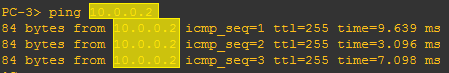
  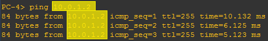
</ScreenshotCard>

</TaskCard>

<TaskCard number={7} title="测试PC间互相连通性" needScreenshot={true} needRecord={false}>

测试三层交换机内部的VLAN间路由功能，请尝试在PC3和PC4之间互相Ping，此时数据包应该能够在三层交换机内部被高速路由转发实现通信

<ScreenshotCard 
  questionId="Lab3-p2-s7" 
  title="PC间Ping结果示例" 
  uploadOptions={[
    { id: 'pc34_ping_test', label: '截图PC3/4间Ping结果' }
  ]}
>
  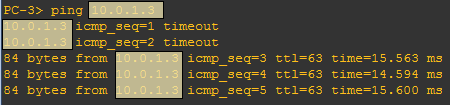
</ScreenshotCard>

</TaskCard>

<TaskCard number={8} title="测试跨交换机VLAN间连通性" needScreenshot={true} needRecord={false}>

现在我们来测试一个更复杂的场景：连接在二层交换机上的PC与连接在三层交换机上的PC之间的通信；请分别尝试从PC1 Ping PC4、从PC2 Ping PC3；你会发现它们之间无法通信，这暴露了我们当前配置中的一个缺陷

<ScreenshotCard 
  questionId="Lab3-p2-s8" 
  title="跨交换机Ping结果示例" 
  uploadOptions={[
    { id: 'pc1_to_pc4', label: '截图PC1→4 Ping结果' },
    { id: 'pc2_to_pc3', label: '截图PC2→3 Ping结果' }
  ]}
>
  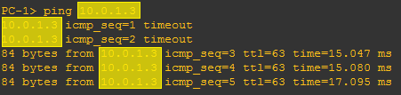

  
</ScreenshotCard>

</TaskCard>

<TaskCard number={9} title="配置三层交换机Trunk端口" needScreenshot={false} needRecord={true}>

先思考无法Ping通的原因，再点开这里

上一步测试失败的原因与单臂路由中遇到的问题类似：二层交换机和三层交换机之间的链路默认是Access模式，只能传输单个VLAN的流量；当PC2（VLAN 2）的数据包想到达作为网关的三层交换机时，由于链路只允许默认VLAN通过，数据包在二层就被丢弃了；因此，我们必须将两台交换机之间的互联链路配置为Trunk模式，以确保所有VLAN的流量都能顺畅地到达三层交换机进行路由

在三层交换机上把与二层交换机互联的端口设置成Trunk模式

<ScreenshotCard 
  questionId="Lab3-p2-s9" 
  title="三层交换机Trunk配置命令" 
  uploadOptions={[
    { id: 'trunk_config_cmd', label: '记录配置命令', type: 'text', textConfig: {codeEditor: true, initialLines: 2} }
  ]}
/>

</TaskCard>

<TaskCard number={10} title="重新测试PC间连通性" needScreenshot={true} needRecord={false}>

在配置好Trunk链路后，再次进行跨交换机的VLAN间连通性测试；此时之前不通的路径应该已经可以Ping通了，这证明Trunk链路成功地将所有VLAN的流量都传递给了三层交换机，使其能够为整个网络提供路由服务

<ScreenshotCard 
  questionId="Lab3-p2-s10" 
  title="配置Trunk后Ping结果示例" 
  uploadOptions={[
    { id: 'pc2_to_pc3_after', label: '截图PC2→3 Ping结果' }
  ]}
>
  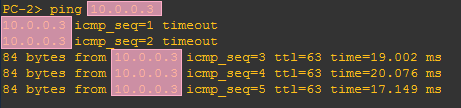
</ScreenshotCard>

</TaskCard>

<TaskCard number={11} title="查看三层交换机路由信息" needScreenshot={true} needRecord={false}>

与路由器一样，三层交换机也维护着一张路由表来指导其转发决策；请使用`show ip route`命令，查看并截图三层交换机的路由信息，你会看到与每个已配置并激活的SVI相对应的直连路由

<ScreenshotCard 
  questionId="Lab3-p2-s11" 
  title="三层交换机路由表示例" 
  uploadOptions={[
    { id: 'l3_routing_info', label: '截图三层交换机路由表' }
  ]}
>
  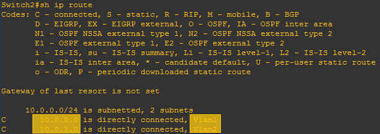
</ScreenshotCard>

</TaskCard>

<TaskCard number={12} title="记录三层交换机运行配置" needScreenshot={false} needRecord={true}>

记录三层交换机上的当前运行配置，复制粘贴本节相关的文本（完整内容请放在文件中，命名为S2.txt，与报告一同压缩提交）

<ScreenshotCard 
  questionId="Lab3-p2-s12" 
  title="三层交换机运行配置" 
  uploadOptions={[
    { id: 'l3_running_config', label: '记录相关运行配置', type: 'text', textConfig: {codeEditor: true, initialLines: 14} }
  ]}
/>

</TaskCard>

## 3 实验结果与分析

根据你观察到的实验数据和对实验原理的理解，分别解答以下问题：

* 为什么路由器的端口可以配置IP地址，而三层交换机的端口跟二层交换机一样不能配置IP地址？
   <ModernInput size="exlarge" questionId="Lab3-q1"/>
* 本实验中为什么要用子接口？有什么好处？使用物理接口可以吗？
   <ModernInput size="exlarge" questionId="Lab3-q2"/>
* 直连三层交换机的PC的默认路由器地址应该设为什么？
   <ModernInput size="exlarge" questionId="Lab3-q3"/>
* 三层交换机和二层交换机互联时，连在二层交换机上VLAN2的PC为什么Ping不通连在三层交换机上VLAN 1的PC？
   <ModernInput size="exlarge" questionId="Lab3-q4"/>
* Ping测试时，为什么一开始有几次不通，后面又通了？
   <ModernInput size="exlarge" questionId="Lab3-q5"/>
* 既然路由器可以实现VLAN间数据交换，为何还要设计三层交换机呢？
   <ModernInput size="exlarge" questionId="Lab3-q6"/>

## 4 常见问题

## 5 导出实验报告

<ExportButton templatePath={require('@site/assets/base_report/Lab3.zip').default} labName="Lab3" labId="lab3-" />
