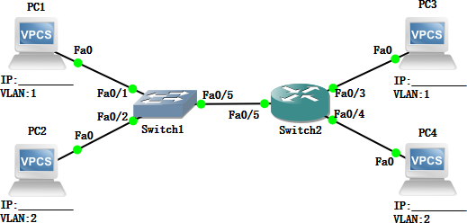
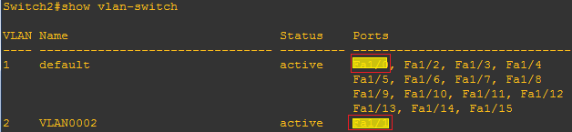

import FileCard from '@site/src/components/FileCard';
import DeadlineProcess from '@site/src/components/DeadlineProcess';
import PlaceHolder from '@site/src/components/PlaceHolder';
import TaskCard from '@site/src/components/TaskCard';
import ScreenshotCard from '@site/src/components/ScreenshotCard';
import ModernInput from '@site/src/components/ModernInput';
import ExportButton from '@site/src/components/ExportButton';
import { Row, Col } from 'antd';

<h3 style={{color: '#006d75', marginTop: 0, marginBottom: 8}}>实验资源</h3>
<DeadlineProcess start={'2025-10-28 18:50:00'} end={'2025-11-11 23:59:59'}/>
<Row gutter={[16, 4]} justify="space-between" style={{marginBottom: -25}}>
    <Col xs={24} sm={24} md={12} lg={24} xl={12} xxl={12}>
        <FileCard file_type={'md'} name={'Lab3 实验报告模板 Markdown版本'} size={'194092'} link={require('@site/assets/templete/md/Lab3 实验报告模板.zip').default} />
    </Col>
    <Col xs={24} sm={24} md={12} lg={24} xl={12} xxl={12}>
        <FileCard file_type={'doc'} name={'Lab3 实验报告模板 Word版本'} size={'247296'} link={require('@site/assets/templete/word/实验报告模版_实验3.doc').default} />
    </Col>
    <Col xs={24} sm={24} md={12} lg={24} xl={12} xxl={12}>
        <FileCard file_type={'pdf'} name={'Lab3 使用三层交换机组网 实验课件'} size={'650417'} link={require('@site/assets/slides/luxq_Lab3-使用三层交换机组网.pdf').default} />
    </Col>
</Row>

<PlaceHolder>

## 1 实验目的

* 掌握并比较两种VLAN间数据交换的方法。
* 学习如何配置子接口；
* 学习掌握三层交换机的工作原理；
* 学习如何配置三层交换机；

## 2 实验数据记录和处理

:::important 提示
以下实验记录均需结合屏幕截图，进行文字标注和描述，图片应大小合适、关键部分清晰可见，严禁手机拍屏，可直接在图片上进行标注，也可以单独用文本进行描述
:::

### 2.1 单臂路由

<TaskCard number={1} title="搭建基础网络拓扑并配置VLAN" needScreenshot={true} needRecord={false}>

将2台PC和一台路由器都连接到一台二层交换机，在交换机上增加1个VLAN，并使得2台PC所连端口分别属于2个VLAN。给2个PC分配不同子网的IP地址

<ScreenshotCard 
  questionId="Lab3-p1-s1" 
  title="网络拓扑图参考" 
  uploadOptions={[
    { id: 'topology', label: '网络拓扑图' }
  ]}
>
  
</ScreenshotCard>

</TaskCard>

<TaskCard number={2} title="验证VLAN间隔离" needScreenshot={true} needRecord={false}>

验证两个PC之间能否Ping通（不同的VLAN之间不通）

<ScreenshotCard 
  questionId="Lab3-p1-s2" 
  title="PC间Ping测试结果" 
  uploadOptions={[
    { id: 'ping_test', label: 'Ping测试截图' }
  ]}
>
  
</ScreenshotCard>

</TaskCard>

<TaskCard number={3} title="配置Trunk端口" needScreenshot={true} needRecord={false}>

将二层交换机和路由器连接的端口配置成VLAN Trunk模式（请参考实验2 进行配置，无需截图）。

例：配置命令（示例为GNS3模拟的配置截图，使用实际设备请参考实验2）

例：配置后的结果（示例为GNS3模拟的结果截图，使用实际设备请参考实验2）

</TaskCard>

<TaskCard number={4} title="配置路由器子接口实现单臂路由" needScreenshot={false} needRecord={true}>

连接路由器的Console口，进入路由器的配置模式。在路由器连接交换机的端口上创建2个子接口（命令：`interface [type] [slot/unit.sub]`，如：`interface e0/1.1`），并配置子接口所属的VLAN（命令：`encapsulation dot1q VLAN编号`），然后使用与2台PC一致的子网，分别给2个子接口配置IP地址，最后激活端口（命令：`no shutdown`）

<ScreenshotCard 
  questionId="Lab3-p1-s4" 
  title="路由器子接口配置命令" 
  uploadOptions={[
    { id: 'router_config', label: '记录配置命令', type: 'text', textConfig: {codeEditor: true, initialLines: 6} }
  ]}
/>

</TaskCard>

<TaskCard number={5} title="配置PC的IP地址和默认网关" needScreenshot={true} needRecord={false}>

按照前述拓扑图，给PC配置IP地址，并将默认路由器地址（gateway）按照所属VLAN，分别设置为路由器的2个子接口的IP地址。

<ScreenshotCard 
  questionId="Lab3-p1-s5" 
  title="PC网络配置截图" 
  uploadOptions={[
    { id: 'pc1_config', label: 'PC1网络配置截图' },
    { id: 'pc2_config', label: 'PC2网络配置截图' }
  ]}
>
   
   
</ScreenshotCard>

</TaskCard>

<TaskCard number={6} title="测试PC与路由器子接口连通性" needScreenshot={true} needRecord={false}>

测试2台PC能否Ping通各自的路由器子接口地址

<ScreenshotCard 
  questionId="Lab3-p1-s6" 
  title="PC Ping路由器子接口测试结果" 
  uploadOptions={[
    { id: 'pc1_ping_router', label: 'PC1 Ping路由器子接口结果' },
    { id: 'pc2_ping_router', label: 'PC2 Ping路由器子接口结果' }
  ]}
>
   
   
</ScreenshotCard>

</TaskCard>

<TaskCard number={7} title="测试PC间互相连通性" needScreenshot={true} needRecord={false}>

测试2台PC能否互相Ping通

<ScreenshotCard 
  questionId="Lab3-p1-s7" 
  title="PC间互相Ping测试结果" 
  uploadOptions={[
    { id: 'pc_ping_test', label: 'PC间Ping测试截图' }
  ]}
>
  
</ScreenshotCard>

</TaskCard>

<TaskCard number={8} title="查看路由器路由表" needScreenshot={true} needRecord={false}>

记录路由器的路由表内容（命令：`show ip route`）

<ScreenshotCard 
  questionId="Lab3-p1-s8" 
  title="路由器路由表内容" 
  uploadOptions={[
    { id: 'routing_table', label: '路由表截图' }
  ]}
>
  
</ScreenshotCard>

</TaskCard>

<TaskCard number={9} title="记录路由器运行配置" needScreenshot={false} needRecord={true}>

记录路由器上的运行配置（命令：`show running-config`)，复制粘贴本节相关的文本（完整的内容请放在文件中，命名为R1.txt）。

<ScreenshotCard 
  questionId="Lab3-p1-s9" 
  title="路由器运行配置" 
  uploadOptions={[
    { id: 'running_config', label: '本节相关运行配置', type: 'text', textConfig: {codeEditor: true, initialLines: 14} }
  ]}
/>

</TaskCard>

### 2.2 三层交换

<TaskCard number={1} title="搭建三层交换网络拓扑" needScreenshot={true} needRecord={false}>

将第一部分的路由器移除后，将二层交换机和一台三层交换机连接，并新增2台PC（PC3、PC4）直接连接到三层交换机，为PC3、PC4分配所在VLAN内的合适IP地址，并在图中标记各设备的IP地址和VLAN

<ScreenshotCard 
  questionId="Lab3-p2-s1" 
  title="三层交换网络拓扑图" 
  uploadOptions={[
    { id: 'l3_topology', label: '三层交换网络拓扑截图' }
  ]}
>
  
</ScreenshotCard>

</TaskCard>

<TaskCard number={2} title="配置三层交换机VLAN" needScreenshot={true} needRecord={true}>

在三层交换机上增加1个VLAN，并使得2台PC所连端口分别属于2个VLAN。

截图：配置结果（命令`show vlan`或者`show vlan-switch`）：

<ScreenshotCard 
  questionId="Lab3-p2-s2" 
  title="三层交换机VLAN配置" 
  uploadOptions={[
    { id: 'vlan_config_cmd', label: 'VLAN配置命令', type: 'text', textConfig: {codeEditor: true, initialLines: 4} },
    { id: 'vlan_show_result', label: 'VLAN配置结果截图' }
  ]}
>
  
</ScreenshotCard>

</TaskCard>

<TaskCard number={3} title="配置VLAN接口IP地址" needScreenshot={false} needRecord={true}>

给2个VLAN接口配置IP地址（命令：`interface vlan VLAN编号`，`ip address IP地址`）

<ScreenshotCard 
  questionId="Lab3-p2-s3" 
  title="VLAN接口IP地址配置" 
  uploadOptions={[
    { id: 'vlan_ip_config', label: 'VLAN接口IP配置命令', type: 'text', textConfig: {codeEditor: true, initialLines: 4} }
  ]}
/>

</TaskCard>

<TaskCard number={4} title="启用三层交换机路由功能" needScreenshot={false} needRecord={false}>

在三层交换机上启用路由功能（命令：ip routing）（在GNS3上用路由器模拟三层交换机时，此步骤不需要）

</TaskCard>

<TaskCard number={5} title="配置PC的IP地址和默认网关" needScreenshot={true} needRecord={false}>

按照前述拓扑图，给PC3、PC4配置IP地址，并将PC3、PC4的默认路由器分别设置为三层交换机2个VLAN接口的IP地址。

<ScreenshotCard 
  questionId="Lab3-p2-s5" 
  title="PC网络配置截图" 
  uploadOptions={[
    { id: 'pc3_config', label: 'PC3网络配置截图' },
    { id: 'pc4_config', label: 'PC4网络配置截图' }
  ]}
>
   
   
</ScreenshotCard>

</TaskCard>

<TaskCard number={6} title="测试PC与VLAN接口连通性" needScreenshot={true} needRecord={false}>

测试PC3、PC4能否Ping通各自的VLAN接口地址

<ScreenshotCard 
  questionId="Lab3-p2-s6" 
  title="PC Ping VLAN接口测试结果" 
  uploadOptions={[
    { id: 'pc3_ping_vlan', label: 'PC3 Ping VLAN接口结果' },
    { id: 'pc4_ping_vlan', label: 'PC4 Ping VLAN接口结果' }
  ]}
>
  
  
</ScreenshotCard>

</TaskCard>

<TaskCard number={7} title="测试PC间互相连通性" needScreenshot={true} needRecord={false}>

测试PC3、PC4能否互相Ping通。

<ScreenshotCard 
  questionId="Lab3-p2-s7" 
  title="PC间互相Ping测试结果" 
  uploadOptions={[
    { id: 'pc34_ping_test', label: 'PC3和PC4互相Ping测试截图' }
  ]}
>
  
</ScreenshotCard>

</TaskCard>

<TaskCard number={8} title="测试跨交换机VLAN间连通性" needScreenshot={true} needRecord={false}>

测试不同交换机上属于不同VLAN的PC间的连通性（如PC1->PC4, PC2->PC3）

<ScreenshotCard 
  questionId="Lab3-p2-s8" 
  title="跨交换机VLAN间连通性测试" 
  uploadOptions={[
    { id: 'pc1_to_pc4', label: 'PC1→PC4 Ping测试截图' },
    { id: 'pc2_to_pc3', label: 'PC2→PC3 Ping测试截图' }
  ]}
>
  
  
</ScreenshotCard>

</TaskCard>

<TaskCard number={9} title="配置三层交换机Trunk端口" needScreenshot={false} needRecord={true}>

如果有些PC之间是不能Ping通的，思考一下是什么原因造成的。接下来在三层交换机上把与二层交换机互联的端口设置成Trunk模式。

<ScreenshotCard 
  questionId="Lab3-p2-s9" 
  title="三层交换机Trunk配置命令" 
  uploadOptions={[
    { id: 'trunk_config_cmd', label: 'Trunk配置命令', type: 'text', textConfig: {codeEditor: true, initialLines: 2} }
  ]}
/>

</TaskCard>

<TaskCard number={10} title="重新测试PC间连通性" needScreenshot={true} needRecord={false}>

再次测试之前不通的PC间的连通性。

<ScreenshotCard 
  questionId="Lab3-p2-s10" 
  title="配置Trunk后连通性测试" 
  uploadOptions={[
    { id: 'pc2_to_pc3_after', label: 'PC2→PC3 Ping测试截图（配置Trunk后）' }
  ]}
>
  
</ScreenshotCard>

</TaskCard>

<TaskCard number={11} title="查看三层交换机路由信息" needScreenshot={true} needRecord={false}>

显示三层交换机上的路由信息

<ScreenshotCard 
  questionId="Lab3-p2-s11" 
  title="三层交换机路由信息" 
  uploadOptions={[
    { id: 'l3_routing_info', label: '三层交换机路由信息截图' }
  ]}
>
  
</ScreenshotCard>

</TaskCard>

<TaskCard number={12} title="记录三层交换机运行配置" needScreenshot={false} needRecord={true}>

记录三层交换机上的当前运行配置, 复制粘贴本节相关的文本（完整的内容请放在文件中，命名为S2.txt）。

<ScreenshotCard 
  questionId="Lab3-p2-s12" 
  title="三层交换机运行配置" 
  uploadOptions={[
    { id: 'l3_running_config', label: '本节相关运行配置', type: 'text', textConfig: {codeEditor: true, initialLines: 14} }
  ]}
/>

</TaskCard>

## 3 实验结果与分析

根据你观察到的实验数据和对实验原理的理解，分别解答以下问题：

* 为什么路由器的端口可以配置IP地址，而三层交换机的端口跟二层交换机一样不能配置IP地址？
   <ModernInput size="exlarge" questionId="Lab3-q1"/>
* 本实验中为什么要用子接口？有什么好处？使用物理接口可以吗？
   <ModernInput size="exlarge" questionId="Lab3-q2"/>
* 直连三层交换机的PC的默认路由器地址应该设为什么？
   <ModernInput size="exlarge" questionId="Lab3-q3"/>
* 三层交换机和二层交换机互联时，连在二层交换机上VLAN2的PC为什么Ping不通连在三层交换机上VLAN 1的PC？
   <ModernInput size="exlarge" questionId="Lab3-q4"/>
* Ping测试时，为什么一开始有几次不通，后面又通了？
   <ModernInput size="exlarge" questionId="Lab3-q5"/>
* 既然路由器可以实现VLAN间数据交换，为何还要设计三层交换机呢？
   <ModernInput size="exlarge" questionId="Lab3-q6"/>

## 4 常见问题

## 5 导出实验报告

<!-- <ExportButton templatePath={require('@site/assets/base_report/Lab3.zip').default} labName="Lab3" labId="lab3-" /> -->

</PlaceHolder>