import FileCard from '@site/src/components/FileCard';
import LinkCard from '@site/src/components/LinkCard';
import DeadlineProcess from '@site/src/components/DeadlineProcess';
import { Row, Col } from 'antd';

<h3 style={{color: '#006d75', marginTop: 0, marginBottom: 8}}>实验资源</h3>
<DeadlineProcess start={'2025-11-11 18:50:00'} end={'2025-11-25 23:59:59'}/>
<Row gutter={[16, 4]} justify="space-between" style={{marginBottom: -25}}>
    <Col xs={24} sm={24} md={12} lg={24} xl={12} xxl={12}>

        <FileCard file_type={'md'} name={'Lab4 实验报告模板 Markdown版本'} size={'446958'} link={require('@site/assets/templete/md/Lab4 实验报告模板.zip').default} />
    </Col>
    <Col xs={24} sm={24} md={12} lg={24} xl={12} xxl={12}>
        <FileCard file_type={'doc'} name={'Lab4 实验报告模板 Word版本'} size={'532480'} link={require('@site/assets/templete/word/实验报告模版_实验4.doc').default} />
    </Col>
    <Col xs={24} sm={24} md={12} lg={24} xl={12} xxl={12}>
        <FileCard file_type={'pdf'} name={'Lab4 静态路由配置 实验课件'} size={'4490633'} link={require('@site/assets/slides/Lab4-静态路由配置.pdf').default} />
    </Col>
    <Col xs={24} sm={24} md={12} lg={24} xl={12} xxl={12}>
        <FileCard file_type={'pdf'} name={'GNS3 抓取STP协议报文'} size={'1204626'} link={require('@site/assets/slides/GNS3模拟环境中使用WireShark抓STP协议报文.pdf').default} />
    </Col>
</Row>

## 一、实验目的

-   学习掌握路由器的工作原理和配置方法；
-   加深路由和交换功能的区别和联系；
-   理解路由表的原理，掌握子网划分原则；
-   理解静态路由的概念，掌握设置静态路由和默认路由的方法；


## 二、实验内容

-   分别采用静态地址分配、动态地址分配构建多种类型的局域网；
-   使用多个路由器连接多个局域网；
-   分别采用以太网、高速串口等方式连接路由器；
-   通过路由器连接真实网络并实现数据通信；
-   在路由器上配置NAT，实现私有网络和共有网络的互联；
-   在各路由器上配置静态路由，实现网络互联互通。


## 三、主要仪器设备

联网的PC机、路由器、交换机

:::important 本实验可使用模拟器，如使用模拟器完成实验，需独立完成实验全部步骤
:::


## 四、操作方法与实验步骤

-   按拓扑图连接路由器、交换机和PC机；
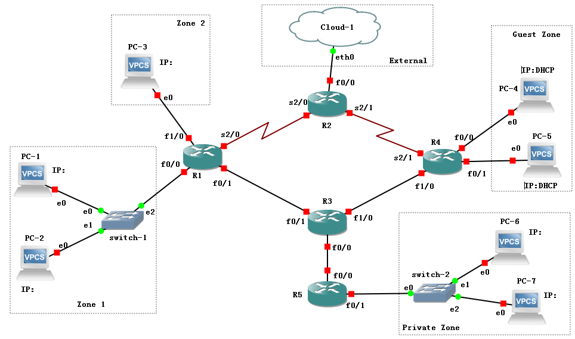
-   设计好每个区域内PC和路由器接口的IP地址及掩码，其中：
    -   Zone1区域的IP子网为10.0.0.0/16；
    -   Zone2区域的IP子网为10.1.0.0/16；
    -   Guest区域使用DHCP动态地址分配，IP子网为172.16.0.0/24和172.16.1.0/24；
    -   Private区域需要经过NAT转换后再和其他区域通信，IP子网为192.168.0.0/24；
    -   External区域代表外部实际网络（即R2的f0/0接口连接的是外部真实网络，如校园网），使用GNS3模拟时，是通过Cloud-1这个特殊设备连接外部网络（具体请参考[功能与设备使用介绍](/docs/GNS3/client-usage#21-网络云)）。
- 为便于记忆，建议路由器之间的接口统一采用192.168.X.Y/24的形式，其中X为两个路由器的编号组合，如12代表R1和R2之间的子网，Y为路由器编号，如192.168.12.1分配给R1的s2/0接口，192.168.12.2分配给R2的s2/0接口。
- 按照上述设计给PC配置合适的IP地址及掩码；
- 按照上述设计给各路由器接口分配合适的IP地址、掩码并激活接口（命令参考下面）：
  ```kotlin
  R1(config)# interface 接口名
  R1(config-if)# ip address IP地址 掩码
  R1(config-if)# no shutdown
  ```
- 给PC配置默认路由器地址，测试跨路由器通信；
- 在R4路由器上配置DHCP服务，步骤如下：
    -   配置路由器接口的IP地址；
    -   定义第一个子网的DHCP地址池（命令：`ip dhcp pool 地址池编号`）；
    -   定义DHCP网络地址（命令： `network IP地址 /子网掩码长度`）；
    -   定义DHCP默认网关（命令： `default-router 默认路由器IP地址`）；
    -   根据需要定义第二个子网的DHCP地址池；
    -   启动DHCP服务（命令： `service dhcp`）；
    -   在PC上运行`ip dhcp`，获取IP地址，并查看获得的IP地址。
-   配置R1、R2路由器之间的串口的数据链路层协议为HDLC，并设置IP地址；
-   配置R2、R4路由器之间的串口的数据链路层协议为PPP，并设置IP地址；
-   在各路由器上配置静态路由，使得不相邻路由器之间能够相互通信（命令：`ip route 目标网络 子网掩码 下一跳地址`）；
-   在R5路由器上配置NAT服务，使得PC6、PC7以R5的f0/0接口的IP地址对外通信。配置步骤如下：
    -   定义内部接口（命令：`interface fa0/1`, `ip nat inside`)，假设fa0/1是连接内部网络的接口；
    -   定义外部接口（命令：`interface fa0/0`，`ip nat outside`)，假设fa0/0是连接外部网络的接口；
    -   设置访问控制列表（命令：`access-list 1 permit 192.168.0.0 0.0.0.255`)，允许网络（假设是192.168.0.0/24）向外访问；
    -   定义从内到外的访问需要进行源地址转换，使用路由器的外部接口地址作为转换后的外部地址（命令：`ip nat inside source list 1 interface fa0/0 overload`)。
-   配置R2的f0/0接口，使其能够与外部真实网络上的主机进行通信（请参考[功能与设备介绍-增加网络云](/docs/GNS3/client-usage#21-网络云)）；
-   使用Ping命令测试各个区域的PC之间的联通性，根据需要在相应的路由器上补充静态路由设置。

:::tip 提示
Ping 是一个**双向过程**，涉及请求主机向目标主机发送请求，随后目标主机返回 ICMP 响应，**任一方向**的通信出现故障，都会导致 Ping 操作失败

因此，当你遇到无法 Ping 通的情况时，建议检查双向路由配置，确保数据包能够顺利到达目标主机，并且**目标主机的响应也能成功返回到源主机**

你可以使用 `traceroute` 命令来帮助定位问题，通过观察数据包在哪个路由器处中断，然后在该路由器上分别 Ping 源主机和目标主机，以确定是哪一侧的路由配置存在问题，从而缩小排查范围
:::

* Cisco IP路由故障排除文档集合

<LinkCard icon="https://www.cisco.com/favicon.ico" title="IP 路由 - 故障排除技术说明" url="https://www.cisco.com/c/zh_cn/tech/ip/ip-routing/tsd-technology-support-troubleshooting-technotes-list.html">故障排除技术说明</LinkCard>

## 五、实验数据记录和处理

:::important 提醒
以下实验记录均需结合屏幕截图，进行文字标注和描述，图片应大小合适、关键部分清晰可见，可直接在图片上进行标注，也可以单独用文本进行描述。
:::


1. 设计好每个PC、路由器各接口的IP地址及掩码，并标注在拓扑图上（后续全部按照这个图进行配置）。

2. 给PC1配置IP地址为10.0.0.X，给PC2配置IP地址为10.0.1.X，其中X为你的学号后2位或后3位（如果3位都为0，往前取，直到3位不全为0，后同不再说明），均使用24位长度的掩码（即255.255.255.0）。然后用Ping检查PC1、PC2之间的连通性（思考为什么不通）。

   Ping结果截图:

   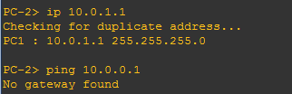

3. 将PC1、PC2的掩码长度均改为16位（即255.255.0.0）。然后用Ping检查PC1、PC2之间的连通性。

   Ping结果截图:

   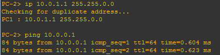

4. 给R1的两个接口f0/0、f1/0分别配置合适的IP地址，掩码长度均为16，并激活接口。然后查看路由表信息。

   输入的配置命令：

   ```kotlin
   示例：
   R1#config t
   Enter configuration commands, one per line. End with CNTL/Z.
   R1(config)#interface fa0/0
   R1(config-if)#ip address [ip] 255.255.0.0
   R1(config-if)#no shut
   R1(config-if)#exit
   R1(config)#interface fa1/0
   R1(config-if)#ip address [ip] 255.255.0.0
   R1(config-if)#no shut
   R1(config-if)#exit
   ```

   路由表信息截图:

   

5. 给PC3配置IP地址10.1.0.X，其中X为你的学号后2位或后3位，掩码长度16位（即255.255.0.0）。然后用Ping检查PC1、PC3之间的连通性。

   Ping结果截图:

   

6. 如果上一步Ping的结果是不通，请给PC1、PC3配置合适的路由器地址（Gateway），并再次检查两者之间的连通性。

   配置命令：

   ```kotlin
   示例
   PC-1> ip 10.0.0.1 255.255.0.0 [gateway]
   Checking for duplicate address...
   PC1 : 10.0.0.1 255.255.0.0 gateway [gateway]
   ```

   ```kotlin
   示例
   PC-3> ip 10.1.0.1 255.255.0.0 [gateway]
   Checking for duplicate address...
   PC1 : 10.1.0.1 255.255.0.0 gateway [gateway]
   ```

   Ping结果截图：

   


7. 给R4的f0/0、f0/1两个接口配置IP地址并激活接口。

   配置命令：

   ```kotlin
   示例
   R4(config)#interface fa0/0
   R4(config-if)#ip address [ip] 255.255.255.0
   R4(config-if)#no shut
   R4(config-if)#exit
   R4(config)#interface fa0/1
   R4(config-if)#ip address [ip] 255.255.255.0
   R4(config-if)#no shut
   ```


8. 在R4上为第一个接口（f0/0）连接的子网配置DHCP服务。

   配置命令：

   ```kotlin
   示例
   R4(config)#ip dhcp pool 1
   R4(dhcp-config)#network 172.16.0.0 /24
   R4(dhcp-config)#default-router 172.16.0.1
   ```


9. 在PC4上使用DHCP动态分配地址，查看获得的IP地址。

   配置命令及获得的IP地址截图：

   


10. 在R4上为第二个接口（f0/1）配置DHCP服务。

    配置命令：

    ```kotlin
    示例
    R4(config)#ip dhcp pool 1
    R4(dhcp-config)#network 172.16.1.0 /24
    R4(dhcp-config)#default-router 172.16.1.1
    ```


11. 在PC5上使用DHCP动态分配地址，查看获得的IP地址。

    配置命令及获得的IP地址截图：

    

12. 用Ping命令测试PC4、PC5之间的连通性。

    Ping结果截图:

    

13. 显示R4上的已分配DHCP主机信息

    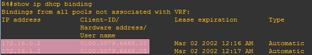

14. 配置R1、R2路由器之间的串口，设置数据链路层协议为HDLC（命令：`encapsulation hdlc`），在其中一台路由器上设置时钟速率（命令：`clock rate 速率值`），设置IP地址，激活接口，并测试两个路由器之间的连通性。

    配置命令：

    

    

    Ping结果截图:

    


15. 配置R4、R2路由器之间的串口，设置IP地址，设置数据链路层协议为PPP（命令：`encapsulation ppp`），设置PPP认证模式为CHAP（命令：`ppp authentication chap`），为对方设置认证用户名和密码（命令：`username R4 password 1234`），用户名默认就是对方的路由器hostname（区分大小写），密码要设置成一样的。激活接口，查看串口状态并测试两个路由器之间的连通性。

    配置命令：

    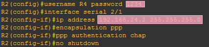

    

    查看串口状态（LCP Open表明PPP的LCP已经协商完成，身份验证通过）：

    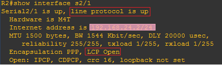

    Ping结果截图：

    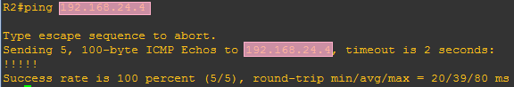


16. 配置R1、R3路由器之间接口的IP地址，激活接口，并测试两个路由器之间的连通性。

    记录:输入的命令，保留命令前提示符，如`R1(config)#` / Ping结果截图


17. 配置R4、R3路由器之间接口的IP地址，激活接口，并测试两个路由器之间的连通性。

    记录：输入的命令，保留命令前提示符，如`R1(config)#` / Ping结果截图


18. 分别测试PC1与PC4、PC1与PC5、PC3与PC4、PC3与PC5之间的连通性。

    记录：PC1→4 / PC1→5 / PC3→4 / PC3→5 Ping结果截图:

      

19. 查看各路由器的路由表信息（命令：`show ip route`），分析上述不能Ping通的原因是缺少了哪些路由信息，为下一步添加路由做准备。

    记录：R1 / R2 / R3 / R4路由表信息截图:

      

20. 在各个路由器上为相应的目标网络（Zone1, Zone2, Guest zone所在子网）添加静态路由（优先选择以太网线路作为下一跳路径），以便上述三个区内的PC能够互相Ping通（不通请仔细分析是哪一台路由器缺少了路由）。记录最后的路由表信息。

    记录：R1 / R2 / R3 / R4上输入的命令，保留命令前提示符，如`R1(config)#`

    ```kotlin
    示例
    R1#config t
    Enter configuration commands, one per line. End with CNTL/Z.
    R1(config)#ip route [subnet] [mask] [next-hop]
    R1(config)#ip route [subnet] [mask] [next-hop]
    ```

    记录：PC1→4 / PC1→5 / PC3→4 / PC3→5 Ping结果截图:

      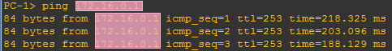

    记录：R1 / R2 / R3 / R4路由表信息截图:

      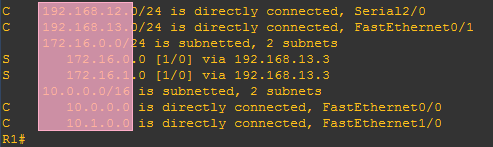

21. 在R1和R4上增加备用路由，选择串口线路作为下一跳的路径，并将路由距离设置成30（命令：`ip
    route 目标网络 子网掩码 下一跳地址 距离`）。此时查看路由表，该新增路由信息并不会出现，但在主路由链路断开时（在R1、R4上关闭与R3连接的端口），该路由会被自动添加进路由表。通过实验验证一下。

    记录：配置命令：

    * R1：

      ```kotlin
      示例
      R1(config)#ip route 172.16.0.0 255.255.255.0 [ip] [mask-length]
      ```

    * R4

    A) R1-R3、R4-R3间链路断开前：

    * R1路由表信息截图

      

    * R4路由表信息截图

      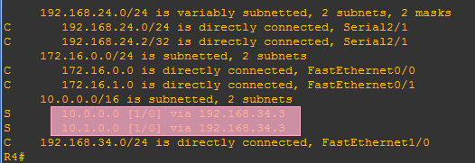

    * PC1上的路由跟踪截图（命令：`trace 目标网络`):

      

    B) R1-R3、R4-R3间链路断开后：

    * R1路由表信息截图:

      

    * R4路由表信息截图:

      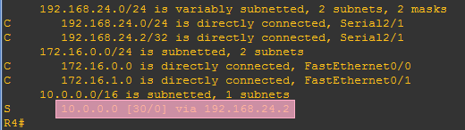

    * PC1上的路由跟踪截图:

      :::tip 提示
      如果不通，请检查R2上是否添加了相应的路由
      :::

      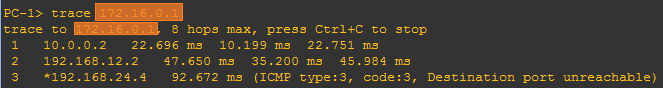

    C) R1-R3、R4-R3间链路重新打开后：

    记录：R1 / R4路由表信息截图

22. 在R1上分别使用f1/0、s2/0接口的IP地址作为源地址，测试到R4的s2/1接口地址的连通性（命令：`ping 目标IP地址 source 源IP地址`），如果有哪个不通，在各个路由器上增加相应的静态路由信息。

    记录：R1 f0/0 → R4 s2/1，R1 f0/1 → R4 s2/1，R1 f1/0 → R4 s2/1，R1 s2/0 → R4 s2/1间的Ping结果截图（Ping通后再截图）:

      

    记录：在R1 / R2 / R3 / R4上补充静态路由的配置命令，保留命令前提示符，如`R1(config)#`

23. 给R3的f0/0（R3-R5之间）接口配置IP地址，给R5各接口配置IP地址，激活接口，并测试两个路由器之间的连通性。

    记录：R3 / R5上输入的配置命令，保留命令前提示符，如`R1(config)#` / Ping结果截图:

24. 给PC6、PC7配置IP地址及默认路由器地址（选R5作为默认路由器），其中PC6地址的主机部分为你的学号后2位或后3位（规则同前）。

    记录：输入的命令，保留命令前提示符，如`R1(config)#`

25. 在R5路由器上配置NAT服务，定义fa0/1接口为**内部接口**，定义fa0/0接口为**外部接口**。配置完成后同时在PC6、PC7上持续Ping路由器R3的fa0/0接口地址（命令：`ping ip地址 -t`），Ping通后在R5上显示NAT信息（命令：`show ip nat translation`），可以看出内部的源IP地址被转换成了外部IP地址。

    :::danger 实验报告模板中，内部/外部接口写反，请按实验文档要求，定义f0/1接口为内部接口，定义f0/0接口为外部接口
    :::

    配置命令：

    ```kotlin
    示例
    R5(config)#interface fa0/1
    R5(config-if)#ip nat inside
    R5(config-if)#exit
    R5(config)#interface fa0/0
    R5(config-if)#ip nat outside
    R5(config-if)#exit
    R5(config)#access-list 1 permit [ip] [mask]
    R5(config)#ip nat inside source list 1 interface fa0/0 overload
    ```

    NAT信息截图：

    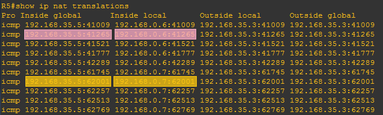


26. 在各路由器上增加静态路由信息，使得PC6能够与Zone1、Zone2、Guest Zone的PC机通信。

    :::tip 提示
    在R5上可以通过设置默认路由方式简化路由配置（命令：`ip route 0.0.0.0 0.0.0.0 默认路由器IP地址`），而Private Zone对其他区域是不可见的，所以在外部路由器上是不需要为其添加路由的（只需要添加R3-R5之间的子网）。
    :::

    记录：R1 / R2 / R3 / R4 / R5上输入的配置命令，保留命令前提示符，如`R1(config)#`

    记录：PC6→1 / 3 / 4 / 5 的Ping结果截图:

      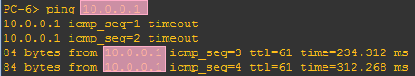

27. 默认情况下，Cloud-1的eth0接口工作在仅主机模式，IP地址是动态分配的，与电脑主机的某个虚拟网卡处于同一个子网。因此配置R2的f0/0接口IP地址时也采用动态分配方式（命令：`ip addess dhcp`）。配置完成后查看R2获得的IP地址，然后在电脑主机上打开命令行，Ping一下R2的IP地址。

    记录：输入的命令，保留命令前提示符，如`R1(config)#`

    记录：电脑主机与R2之间 Ping结果截图：

    

28. 在R2上配置NAT服务，并且在R1上添加电脑主机的子网路由，使得Zone 1的PC机也能与电脑主机通信。提示：定义f0/0接口为外部接口，s2/0为内部接口。

    :::tip 提示
    如果Zone 1的PC机无法与电脑主机通信，建议先检查R2能否Ping通Zone 1 PC机 / 电脑主机，判断问题在于路由配置还是虚拟网卡配置

    如果电脑主机能够Ping通R2，但R2无法Ping通电脑主机，请检查是否关闭了防火墙（Windows安全中心-防火墙与网络保护-分别点击三种网络并关闭其防火墙）
    :::

    R2配置命令：

    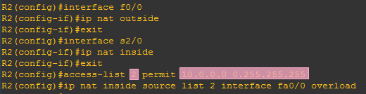

    R1配置命令：

    

    电脑主机的IP地址:

    

    PC1与电脑主机Ping结果截图（请关闭电脑上的防火墙）:

    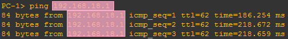


29. 找一个不需要认证、没有地址绑定限制的网络环境（首选实验室、机房，或者自己搭一个环境），首先配置电脑主机的IP地址和默认网关，以便让电脑主机能够正常连接真实网络，再找一台该网络可以Ping通的主机H。

    接下来让R2的f0/0口改为连接Cloud-1的eth2接口（该接口采用桥接模式，如果没有eth2，请参照GNS指南添加一个），使用静态或动态方式给R2的f0/0口配置IP地址（采用动态分配时需要再次输入`ip address dhcp`，以便路由器重新获取IP地址），设置R2的默认路由地址为真实网络上的默认网关，在R1上为主机H的子网配置路由（可以简化配置成默认路由），测试R2以及PC1能否Ping通该主机。

    :::tip 提示
    该网络环境可以用手机热点模拟，电脑和另一台设备连接到该手机热点即可进行实验

    如果Zone 1的PC机无法与电脑主机通信，建议先检查R2能否Ping通Zone 1 PC机 / 主机H，判断问题在于路由配置还是虚拟网卡配置
    :::

    R2配置命令：

    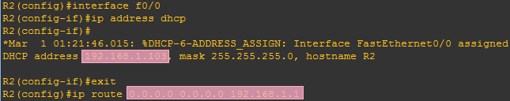

    R1配置命令：

    

    R2与真实网络主机H的Ping结果截图:

    

    PC1与真实网络主机H的Ping结果截图:

    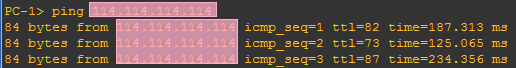

30. 整理各路由器的当前运行配置，选择与本实验相关的内容记录在文本文件中，每个设备一个文件，分别命名为R1.txt、R2.txt等，随实验报告一起打包上传。


## 六、实验结果与分析

根据你观察到的实验数据和对实验原理的理解，分别解答以下问题：

* 路由器的接口为什么会出现：FastEthernet0/1 is up, line protocol is down的状态？
* 路由起什么作用？什么是静态路由？
* 需要为每个PC的IP地址添加路由，还是只需要为其网络地址添加路由？
* 添加静态路由时，下一跳地址是填写本路由器的端口地址，还是对方路由器的端口地址？或者是目的地网络的路由器端口地址？
* 什么是默认路由？添加默认路由的命令格式是什么？
* 在同一个局域网内的2台PC机，IP地址分别为10.0.0.x/24和10.0.1.x/24，都属于VLAN1，一开始不能互相Ping通，为什么把子网掩码长度从24位变成16位，就通了？
* 如果仅仅是为了让不同区域内的PC之间能够互相Ping通，在设置静态路由时，路由器之间互联的子网是否全部都要加入到所有路由器的路由表中？为什么？
