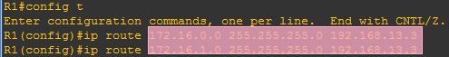
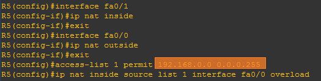

import FileCard from '@site/src/components/FileCard';
import LinkCard from '@site/src/components/LinkCard';
import DeadlineProcess from '@site/src/components/DeadlineProcess';
import TaskCard from '@site/src/components/TaskCard';
import ScreenshotCard from '@site/src/components/ScreenshotCard';
import ModernInput from '@site/src/components/ModernInput';
import ExportButton from '@site/src/components/ExportButton';
import GridContainer from '@site/src/components/GridContainer';

<h3 style={{color: '#006d75', marginTop: 0, marginBottom: 8}}>实验资源</h3>
<DeadlineProcess start={'2025-11-11 18:50:00'} end={'2025-11-25 23:59:59'}/>
<GridContainer>
    <FileCard file_type={'md'} name={'Lab4 实验报告模板 Markdown版本'} size={'446958'} link={require('@site/assets/templete/md/Lab4 实验报告模板.zip').default} />
    <FileCard file_type={'doc'} name={'Lab4 实验报告模板 Word版本'} size={'532480'} link={require('@site/assets/templete/word/实验报告模版_实验4.doc').default} />
    <FileCard file_type={'pdf'} name={'Lab4 静态路由配置 实验课件'} size={'4490633'} link={require('@site/assets/slides/Lab4-静态路由配置.pdf').default} />
    <FileCard file_type={'pdf'} name={'GNS3 抓取STP协议报文'} size={'1204626'} link={require('@site/assets/slides/GNS3模拟环境中使用WireShark抓STP协议报文.pdf').default} />
</GridContainer>

## 1 实验目的

本次实验将深入网络层，你将亲手配置一个由多台路由器连接的复杂网络，从最基础的IP地址配置，到实现跨网段通信的核心技术——路由，你将：

-   学习并掌握路由器的基本工作原理和命令行配置方法
-   深入理解路由与二层交换在功能上的区别与联系
-   理解路由表的原理，并基于子网划分原则进行网络规划
-   掌握静态路由和默认路由的配置方法，实现全网互联互通
-   实践网络地址转换（NAT）和动态主机配置协议（DHCP）等实用网络服务的使用

## 2 实验数据记录和处理

:::important 提醒
以下实验记录均需结合屏幕截图，进行文字标注和描述，图片应大小合适、关键部分清晰可见，可直接在图片上进行标注，也可以单独用文本进行描述。
:::

<TaskCard number={1} title="设计IP地址规划并标注拓扑图" needScreenshot={true} needRecord={false}>

一份清晰、准确的拓扑图是进行网络配置、管理和故障排查的必备工具，请根据实验要求，为网络中的每一台PC、每一台路由器的每一个接口规划好IP地址和子网掩码，并将这些信息清晰地标注在拓扑图上，后续所有配置都将以此为蓝图

1.  **Zone1区域**: IP子网为 `10.0.0.0/16`
2.  **Zone2区域**: IP子网为 `10.1.0.0/16`
3.  **Guest区域**: 使用DHCP动态地址分配，IP子网为 `172.16.0.0/24` 和 `172.16.1.0/24`
4.  **Private区域**: IP子网为 `192.168.0.0/24`，该区域需要经过NAT转换才能与其他区域通信
5.  **External区域**: 代表外部真实网络，在GNS3中通过`Cloud-1`设备模拟
6.  **路由器互联**: 为便于记忆，建议路由器之间的接口统一采用 `192.168.X.Y/24` 的形式，其中X为两个路由器的编号组合（如12代表R1和R2），Y为路由器编号（如192.168.12.1分配给R1）

对于路由器而言，其每个接口往往对应一个不同的子网，因此在设计IP时，请注意在使用网线或交换机连接的接口/设备应处于相同子网

GNS3原生支持在拓扑图上添加文字标注并导出图片，你可以参考[GNS3客户端使用](/docs/GNS3/client-usage)了解使用方式

<ScreenshotCard 
  questionId="Lab4-s1" 
  title="拓扑图示例" 
  uploadOptions={[
    { id: 'topology', label: '上传网络拓扑图' }
  ]}
>
  
</ScreenshotCard>

</TaskCard>

<TaskCard number={2} title="配置PC1、PC2地址并测试连通性（/24掩码）" needScreenshot={true} needRecord={false}>

背景知识：IP地址与子网掩码

IP地址由两部分组成：网络部分（Network ID）和主机部分（Host ID），子网掩码的作用就是明确指出一个IP地址中哪部分是网络ID，哪部分是主机ID

当一台主机（如PC1）要与另一台主机（如PC2）通信时，它会执行以下判断：
1.  将自己的IP地址与自己的子网掩码进行“与”运算，得到自己所在网络的网络地址
2.  将目标主机的IP地址与自己的子网掩码进行“与”运算，得到目标主机所在网络的网络地址
3.  如果两个网络地址相同，说明目标主机与自己在同一个局域网（广播域）内，可以直接通过ARP协议获取对方MAC地址后进行二层通信
4.  如果两个网络地址不同，说明目标主机在外部网络，必须将数据包发送给**默认网关（路由器）**，由路由器负责转发

在本步骤中，PC1的地址为`10.0.0.X/24`，其网络地址是`10.0.0.0`；PC2的地址为`10.0.1.X/24`，PC1根据自己的`/24`掩码计算出PC2的网络地址是`10.0.1.0`，由于`10.0.0.0`不等于`10.0.1.0`，PC1会认为PC2在不同的网络，因此在没有默认网关时无法通信

接下来的两步中，我们将配置不同的子网掩码，并观察连通性的差异，从而直观感受子网掩码在确定网络范围和通信路径上的作用

1.  使用`ip [IP地址]`命令（此时默认为24位子网掩码），为PC1配置IP地址 `10.0.0.X`，为PC2配置IP地址 `10.0.1.X`，其中X为你的学号后2位或后3位；两台PC均使用24位长度的子网掩码，即 `255.255.255.0`
2.  使用 `ping` 命令检查PC1与PC2之间的连通性并截图，思考为什么它们无法通信
  
<ScreenshotCard 
  questionId="Lab4-s2" 
  title="PC间Ping结果示例" 
  uploadOptions={[
    { id: 'ping_result', label: '截图Ping结果' }
  ]}
>
  
</ScreenshotCard>

</TaskCard>

<TaskCard number={3} title="修改掩码并测试连通性（/16掩码）" needScreenshot={true} needRecord={false}>

1.  使用`ip [IP地址] [子网掩码]`命令将PC1和PC2的子网掩码长度均修改为16位，即 `255.255.0.0`
2.  再次使用 `ping` 命令检查PC1与PC2之间的连通性并截图

<ScreenshotCard 
  questionId="Lab4-s3" 
  title="修改掩码后Ping结果示例" 
  uploadOptions={[
    { id: 'ping_result', label: '截图Ping结果' }
  ]}
>
  
</ScreenshotCard>

此时，PC1（`10.0.0.X/16`）计算自己和PC2（`10.0.1.X`）的网络地址时，都会使用`/16`的掩码，得到的结果都是 `10.0.0.0`，因此PC1会认为PC2与自己在同一个局域网内，无需默认网关转发，只需要二层转发即可通信成功

</TaskCard>

<TaskCard number={4} title="配置R1接口并查看路由表" needScreenshot={true} needRecord={true}>

背景知识：路由表与路由转发

路由器是连接不同网络的设备，它的核心工作就是根据**路由表**（**Routing Table**）来决定如何转发数据包，路由表就像一张地图，告诉路由器去往某个目的地网络应该从哪个接口发出，并将数据包交给谁（下一跳）

一台路由器在没有任何静态或动态路由配置的情况下，其路由表中只包含与它**直接相连**的网络信息，这些路由是路由器通过配置接口IP地址自动生成的，通常用字母`C`（Connected）或`L`（Local）标识

一个非常非常非常常见的误区是认为路由器知道的是到达目标主机的完整路径，很多人想当然地以为，网络中的路由器像一个”全知“的导航系统，只要起始路由器知道怎么去往最终目的地，数据包就能顺利到达，这种想法是**完全错误**的

实际上，路由的世界遵循的是“一站一站问路”的“**逐跳转发**”（**Hop-by-Hop Forwarding**）原则，每一台路由器都只关心**下一跳**（**Next Hop**）在哪里，而对数据包去往最终目标的完整路径一无所知

我们可以将路由器的“逐跳转发”机制比作古代的驿站系统来理解——一封从京城送往边疆的信件，其传递过程并非由一个全知的中央系统规划完整路线，京城的驿站只需知道下一站应交给保定府驿站，而保定府驿站也只关心它的下一站是太原府；这个过程在沿途的每一个驿站（路由器）不断重复，每个驿站都只根据自己本地的“站务手册”（路由表）决定下一站（下一跳）的位置，而对信件的最终路径一无所知

网络中的数据包转发也是如此：

1. 起始路由器：只知道要想到达目标网络，需要将数据包从自己的某个接口发给“邻居”路由器A
2. 路由器A：收到数据包后，再次查询自己的路由表，发现要想到达同一个目标网络，需要将数据包转交给“邻居”路由器B
3. ...（中间过程） ：这个过程在路径上的每一台路由器上重复
4. 最终路由器：直到数据包到达一个与目标主机所在的网络直接相连的路由器，该路由器才会通过其直连路由将数据包最终交付给目标主机
   
因此，数据包的成功转发依赖于**路径上每一台路由器的正确配置**，而不仅仅是第一台路由器；如果中间任何一台路由器缺少了去往目标网络的路由信息，数据包就会在该处被丢弃，导致通信失败；这也就是为什么网络工程师在排查网络故障时，常常需要逐一检查路径上所有路由器的路由表，或使用`tracert`寻找断点的位置

1.  进入R1的全局配置模式
2.  根据你的IP规划，为R1的f0/0和f1/0接口分别配置IP地址和16位掩码，并激活接口
3.  配置完成后，在特权模式下使用 `show ip route` 命令查看R1当前的路由表信息

<ScreenshotCard 
  questionId="Lab4-s4" 
  title="R1路由表示例" 
  uploadOptions={[
    { id: 'config_cmd', label: '记录配置命令', type: 'text', textConfig: {initialContent: "R1(config)# interface fa0/0\nR1(config-if)# ip address [ip] 255.255.0.0\nR1(config-if)# no shut\nR1(config-if)# exit\nR1(config)# interface fa1/0\nR1(config-if)# ip address [ip] 255.255.0.0\nR1(config-if)# no shut\nR1(config-if)# exit", codeEditor: true, initialLines: 8} },
    { id: 'routing_table', label: '截图路由表信息' }
  ]}
>
  
</ScreenshotCard>

</TaskCard>

<TaskCard number={5} title="配置PC3并测试跨路由器连通性" needScreenshot={true} needRecord={false}>

1.  为PC3配置IP地址 `10.1.0.X`（X规则同前），子网掩码为16位，即 `255.255.0.0`
2.  使用 `ping` 命令检查PC1与PC3之间的连通性

<ScreenshotCard 
  questionId="Lab4-s5" 
  title="PC1→3 Ping结果示例" 
  uploadOptions={[
    { id: 'ping_result', label: '截图Ping结果' }
  ]}
>
  
</ScreenshotCard>

此时，PC1和PC3位于由R1隔开的两个不同子网中（10.0.0.0/16 和 10.1.0.0/16），它们之间的通信必须经过路由器转发，但由于PC尚未配置网关，它们不知道该把发往外部网络的数据包交给谁，因此 `ping` 会失败

</TaskCard>

<TaskCard number={6} title="配置PC默认网关并重新测试" needScreenshot={true} needRecord={false}>

背景知识：默认网关

对于主机而言，一般它们只连接在一个网络内，如果需要将数据包转发到其他网络，就必须有一个中间角色承担起路由转发的责任，这个中间角色就是**默认网关**

**默认网关（Default Gateway）**本质上是一个路由器的接口IP地址，当一台主机需要发送数据包到其本地子网之外的目的地时，它会将该数据包发送到默认网关，由网关设备（路由器）负责将其转发到其他网络

想一想：默认网关可以和主机不在同一个网络下吗？答案是不可以，三层的转发依赖于二层的转发，我们要能把数据包交给默认网关，就必须知道默认网关接口的MAC地址，而ARP只能在同一广播域内生效；如果默认网关和主机不在同一个网络，那么主机就无法得到其MAC地址，也就无法实现二层的数据传输，更无法实现三层的路由转发

前一步骤告诉了我们默认网关在跨网络通信时的重要性，现在我们来为PC配置默认网关并再次测试：

1.  使用命令`ip [主机IP] [子网掩码] gateway [网关IP]`为PC1配置默认网关，地址为R1面向PC1的接口（f0/0）的IP地址
2.  使用命令`ip [主机IP] [子网掩码] gateway [网关IP]`为PC3配置默认网关，地址为R1面向PC3的接口（f1/0）的IP地址
3.  再次 `ping` PC3，此时PC1和PC3都知道如何将数据包发送给R1，而R1也同时连接着这两个网络，因此应当能够成功转发数据包，通信成功

<ScreenshotCard 
  questionId="Lab4-s6" 
  title="PC1→3 Ping结果示例" 
  uploadOptions={[
    { id: 'pc1_config', label: '截图PC1配置命令' },
    { id: 'pc3_config', label: '截图PC3配置命令' },
    { id: 'ping_result', label: '截图Ping结果' }
  ]}
>
  
</ScreenshotCard>

</TaskCard>

<TaskCard number={7} title="配置R4接口" needScreenshot={false} needRecord={true}>

根据你的IP规划，为R4的f0/0和f0/1两个接口分别配置IP地址并使用 `no shutdown` 命令激活接口

<ScreenshotCard 
  questionId="Lab4-s7" 
  title="R4接口配置命令" 
  uploadOptions={[
    { id: 'config_cmd', label: '记录配置命令', type: 'text', textConfig: {initialContent: "R4(config)# interface fa0/0\nR4(config-if)# ip address [ip] 255.255.255.0\nR4(config-if)# no shutdown\nR4(config-if)# exit\nR4(config)# interface fa0/1\nR4(config-if)# ip address [ip] 255.255.255.0\nR4(config-if)# no shutdown", codeEditor: true, initialLines: 7} }
  ]}
/>

</TaskCard>

<TaskCard number={8} title="配置R4第一个接口的DHCP服务" needScreenshot={false} needRecord={true}>

背景知识：DHCP服务

此前，我们为PC1和PC3等设备手动配置了IP地址，这种方式在设备数量少时是可行的，但请思考一个场景：在一个拥有数百个座位的公共访客区，如果每位访客都需要网络管理员手动配置IP，将会是怎样的灾难？为了解决大规模、高流动性设备的网络接入问题，我们引入了DHCP(Dynamic Host Configuration Protocol)，即动态主机配置协议

DHCP的诞生旨在解决两大核心痛点：手动配置的繁琐低效与IP地址资源的僵化浪费；一方面，在早期网络中为每台设备手动指定IP地址等参数不仅效率低下，还极易因人为失误（例如IP地址冲突）导致网络故障；另一方面，静态分配在面对有限IP资源和大量非固定用户时显得力不从心，试想一个拥有200名员工但仅有126个可用IP地址的公司，若采用静态分配，地址从一开始便宣告不足，更严重的是，当员工出差或移动办公时，分配给他们的IP地址就被白白闲置，而此时其他需要接入网络的设备却可能无地址可用，这无疑造成了巨大的资源浪费

DHCP通过自动化、集中化的方式，它不仅消除了手动配置的麻烦，更关键的是引入了IP地址租约（Lease）的概念，设备只有在需要接入网络时，才会从DHCP服务器租用一个IP地址，并在离开网络（或租约到期）后释放它，让这个地址能被其他用户重新租用，这种动态分配机制极大地提高了IP地址的利用率，使得用有限的地址服务更多的、非同时在线的用户成为可能

在Cisco路由器上配置DHCP服务主要涉及以下步骤：
-   `ip dhcp excluded-address [地址]`：(可选)排除某些地址不被分配，通常用于为服务器、路由器等设备保留静态地址
-   `ip dhcp pool [地址池名称]`：创建一个DHCP地址池
-   `network [网络地址] [子网掩码]`：定义该地址池将要分配的IP地址范围
-   `default-router [网关地址]`：定义分配给客户端的默认网关地址
-   `dns-server [DNS服务器地址]`：(可选)定义分配给客户端的DNS服务器地址

前序步骤中，我们配置的IP都是手动进行分配的，现在，我们在R4上为f0/0接口所连接的子网（`172.16.0.0/24`）配置DHCP服务，定义地址池、网络范围和默认网关，以实现该子网的自动IP分配

<ScreenshotCard 
  questionId="Lab4-s8" 
  title="DHCP服务配置命令" 
  uploadOptions={[
    { id: 'config_cmd', label: '记录配置命令', type: 'text', textConfig: {initialContent: "R4(config)# ip dhcp pool 1\nR4(dhcp-config)# network 172.16.0.0 /24\nR4(dhcp-config)# default-router 172.16.0.1", codeEditor: true, initialLines: 3} }
  ]}
/>

</TaskCard>

<TaskCard number={9} title="PC4使用DHCP获取地址" needScreenshot={true} needRecord={false}>

背景知识：DHCP分配与续约过程

当任何一台DHCP客户端（如你的电脑、手机）接入网络时，它不再需要静态配置，而是会自动向网络中广播一个请求，寻找DHCP服务器，这个过程通常被称为DORA四步交互：

1. Discover：客户端在网络中广播“我是谁、我在哪、谁能给我一个IP地址”的请求
2. Offer：DHCP服务器收到请求后，从自己的地址池中挑选一个尚未分配的IP地址，连同其他网络配置（如网关、DNS）一起，向客户端发出一个“提议”
3. Request：客户端可能会收到多个服务器的提议，它会选择其中一个，并向网络广播一个“请求”，声明它希望接受某个服务器提供的IP地址
4. Acknowledge：被选中的DHCP服务器最终确认该分配，并向客户端发送一个“确认”消息，此后客户端就可以使用这个IP地址上网了

为避免IP地址租约到期后网络中断，如果仍然处在原有网络中，DHCP客户端会自动进行续约，续约过程按时间顺序可分为几个阶段：

1. 租约时间过半(T1)时：客户端会向为其分配IP的DHCP服务器发送单播请求，希望延长租期
2. 租约时间到达87,5%(T2)时：若T1续约失败，客户端会广播请求，向网络中任何一台DHCP服务器寻求续约
3. 租约完全到期时：若续约彻底失败，客户端将放弃现有IP，并重新开始DORA四步交互以获取新的IP地址

在PC4的命令行中输入 `ip dhcp` 命令，使其向网络中发送DHCP请求，获取IP地址、子网掩码和默认网关，并截图查看获取到的配置信息

<ScreenshotCard 
  questionId="Lab4-s9" 
  title="PC4 DHCP地址分配示例" 
  uploadOptions={[
    { id: 'dhcp_result', label: '截图配置命令及获得的IP地址' }
  ]}
>
  
</ScreenshotCard>

</TaskCard>

<TaskCard number={10} title="配置R4第二个接口的DHCP服务" needScreenshot={false} needRecord={true}>

用相似的方式，在R4上为f0/1接口所连接的子网（`172.16.1.0/24`）配置第二个DHCP地址池

<ScreenshotCard 
  questionId="Lab4-s10" 
  title="第二个DHCP池配置命令" 
  uploadOptions={[
    { id: 'config_cmd', label: '记录配置命令', type: 'text', textConfig: {initialContent: "R4(config)# ip dhcp pool 1\nR4(dhcp-config)# network 172.16.1.0 /24\nR4(dhcp-config)# default-router 172.16.1.1", codeEditor: true, initialLines: 3} }
  ]}
/>

</TaskCard>

<TaskCard number={11} title="PC5使用DHCP获取地址" needScreenshot={true} needRecord={false}>

在PC5上同样使用 `ip dhcp` 命令动态获取网络配置，并截图查看结果

<ScreenshotCard 
  questionId="Lab4-s11" 
  title="PC5 DHCP地址分配示例" 
  uploadOptions={[
    { id: 'dhcp_result', label: '截图配置命令及获得的IP地址' }
  ]}
>
  
</ScreenshotCard>

</TaskCard>

<TaskCard number={12} title="测试PC4与PC5连通性" needScreenshot={true} needRecord={false}>

使用 `ping` 命令测试PC4与PC5之间的连通性，由于它们都连接到R4，并且R4的路由表中包含了这两个直接相连的子网，通信应该可以成功

<ScreenshotCard 
  questionId="Lab4-s12" 
  title="PC4→5 Ping结果示例" 
  uploadOptions={[
    { id: 'ping_result', label: '截图Ping结果' }
  ]}
>
  
</ScreenshotCard>

</TaskCard>

<TaskCard number={13} title="查看DHCP分配信息" needScreenshot={true} needRecord={false}>

在R4的特权模式下使用 `show ip dhcp binding` 命令，查看DHCP服务器已经分配出去的IP地址及其对应的客户端MAC地址信息

<ScreenshotCard 
  questionId="Lab4-s13" 
  title="DHCP主机分配信息示例" 
  uploadOptions={[
    { id: 'dhcp_info', label: '截图已分配DHCP主机信息' }
  ]}
>
  
</ScreenshotCard>

</TaskCard>

<TaskCard number={14} title="配置R1-R2串口（HDLC协议）" needScreenshot={true} needRecord={true}>

背景知识：串口、HDLC与时钟速率

**串口**（**Serial Port**）是一种常用于广域网（WAN）连接的接口类型，与以太网不同，它通常用于点对点的长距离连接与以太网不同，它通常用于点对点的长距离连接。在广域网场景中，串口常用于连接地理位置分散的路由器，例如通过电信运营商提供的专线（如T1/E1线路）将不同城市的分支机构网络连接起来；与局域网中常见的以太网接口相比，串口的速率通常较低（如64kbps或1.544Mbps），远低于现代以太网动辄百兆、千兆的速率，其设计侧重于长距离的稳定传输而非高速通信；如今在大多数广域网场景中，这类传统的低速串口连接已基本被速度更快、更可靠的光纤所取代

**HDLC (High-Level Data Link Control)** 是Cisco路由器串口上默认的数据链路层封装协议，它是一个简单的、低开销的协议，适用于连接两台思科设备的点对点链路

**时钟速率**（**Clock Rate**）：在串行通信中，数据是一位一位地传输的，为了让接收端能够正确地同步和解码这些比特流，需要一个时钟信号来规定传输速率，在物理连接中，提供时钟信号的一端被称为**DCE (Data Communications Equipment，数据通信设备)**，而接收时钟信号进行同步的一端被称为**DTE (Data Terminal Equipment，数据终端设备)**，`clock rate` 命令**必须在DCE端配置**

1.  分别进入R1和R2的串口接口配置模式
2.  配置数据链路层协议为HDLC（命令：`encapsulation hdlc`）
3.  在其中一台路由器（DCE端）上设置时钟速率（命令：`clock rate 64000`）
4.  为两个接口配置IP地址并激活接口
    <ScreenshotCard 
      questionId="Lab4-s14" 
      title="R1配置命令示例" 
      uploadOptions={[
        { id: 'r1_config', label: '记录R1配置命令', type: 'text', textConfig: {codeEditor: true, initialLines: 4} }
      ]}
    >
      
    </ScreenshotCard>
    <ScreenshotCard 
      questionId="Lab4-s14" 
      title="R2配置命令示例" 
      uploadOptions={[
        { id: 'r2_config', label: '记录R2配置命令', type: 'text', textConfig: {codeEditor: true, initialLines: 5} }
      ]}
    >
      
    </ScreenshotCard>
5.  使用 `ping` 命令测试两个路由器串口之间的连通性
    <ScreenshotCard 
      questionId="Lab4-s14" 
      title="R1-R2连通性测试示例" 
      uploadOptions={[
        { id: 'ping_result', label: '截图Ping结果' }
      ]}
    >
      
    </ScreenshotCard>

</TaskCard>

<TaskCard number={15} title="配置R4-R2串口（PPP协议）" needScreenshot={true} needRecord={true}>

背景知识：PPP协议

**PPP (Point-to-Point Protocol)** 是另一种常用的广域网数据链路层协议，相比HDLC，PPP是一个开放标准，并且提供了更丰富的功能，如链路质量监控、多协议支持以及重要的**认证**功能；相信同学们在家中配置网络时已经或多或少接触过PPPoE来与ISP认证宽带上网

**认证**是确保只有授权设备才能建立连接的关键步骤，PPP支持两种主要的认证协议：
-   **PAP (Password Authentication Protocol)**：简单的两次握手协议，以明文形式发送用户名和密码，安全性较低
-   **CHAP (Challenge-Handshake Authentication Protocol)**：质询握手认证协议，采用三次握手和MD5哈希算法来验证身份，密码本身不会在链路上明文传输，安全性更高

在CHAP握手过程中，认证方会根据挑战者（对端路由器）报上来的名字（即它的hostname）去本地的username数据库里查找对应的密码，然后用这个密码和随机值进行哈希计算，来验证对方的身份，因此我们配置认证的用户名与密码时，必须确保它们与对端路由器的配置一致，否则认证过程就会失败

目前国内许多运营商仍在使用PAP协议进行认证，因此通过在路由器与WAN口间抓包，我们就能捕获该路由器使用的认证密码，完整的过程可以参考[宽带密码捕获](/blog/adsl)

1.  分别进入R2和R4的串口接口配置模式，为接口配置IP地址并激活
2.  配置数据链路层协议为PPP（命令：`encapsulation ppp`）
3.  配置PPP认证模式为CHAP（命令：`ppp authentication chap`）
4.  在R2上，为R4设置认证的用户名和密码（命令：`username R4 password 1234`），其中用户名必须是对方路由器的`hostname`（区分大小写）
    <ScreenshotCard 
      questionId="Lab4-s15" 
      title="R2配置命令示例" 
      uploadOptions={[
        { id: 'r2_config', label: '记录R2配置命令', type: 'text', textConfig: {codeEditor: true, initialLines: 6} }
      ]}
    >
      
    </ScreenshotCard>
5.  在R4上，为R2设置认证的用户名和密码（命令：`username R2 password 1234`），密码必须与R2上设置的一致
    <ScreenshotCard 
      questionId="Lab4-s15" 
      title="R4配置命令示例" 
      uploadOptions={[
        { id: 'r4_config', label: '记录R4配置命令', type: 'text', textConfig: {codeEditor: true, initialLines: 6} }
      ]}
    >
      
    </ScreenshotCard> 
6.  使用 `show interface [接口名]` 查看串口状态，确认链路状态为 `up` 且线路协议状态也为 `up`，`LCP Open` 表明PPP的链路控制协议已协商完成
    <ScreenshotCard 
      questionId="Lab4-s15" 
      title="串口状态示例" 
      uploadOptions={[
        { id: 'serial_status', label: '截图串口状态（LCP Open）' }
      ]}
    >
      
    </ScreenshotCard>
7.  使用 `ping` 测试两个路由器之间的连通性
    <ScreenshotCard 
      questionId="Lab4-s15" 
      title="连通性测试示例" 
      uploadOptions={[
        { id: 'ping_result', label: '截图Ping结果' }
      ]}
    >
      
    </ScreenshotCard>

</TaskCard>

<TaskCard number={16} title="配置R1-R3接口并测试连通性" needScreenshot={true} needRecord={true}>

根据IP规划，为R1和R3之间的接口配置IP地址，激活接口，并使用 `ping` 命令测试两个路由器间直连链路的连通性

<ScreenshotCard 
  questionId="Lab4-s16" 
  title="R1-R3接口配置与测试" 
  uploadOptions={[
    { id: 'r1_config', label: '记录R1输入的命令', type: 'text', textConfig: {codeEditor: true, initialLines: 3} },
    { id: 'r3_config', label: '记录R3输入的命令', type: 'text', textConfig: {codeEditor: true, initialLines: 3} },
    { id: 'ping_result', label: '截图Ping结果' }
  ]}
/>

</TaskCard>

<TaskCard number={17} title="配置R4-R3接口并测试连通性" needScreenshot={true} needRecord={true}>

根据IP规划，为R4和R3之间的接口配置IP地址，激活接口，并使用 `ping` 命令测试两个路由器之间的连通性

<ScreenshotCard 
  questionId="Lab4-s17" 
  title="R4-R3接口配置与测试" 
  uploadOptions={[
    { id: 'r3_config', label: '记录R3输入的命令', type: 'text', textConfig: {codeEditor: true, initialLines: 3} },
    { id: 'r4_config', label: '记录R4输入的命令', type: 'text', textConfig: {codeEditor: true, initialLines: 3} },
    { id: 'ping_result', label: '截图Ping结果' }
  ]}
/>

</TaskCard>

<TaskCard number={18} title="测试跨路由器PC间连通性" needScreenshot={true} needRecord={false}>

现在，网络中的所有链路都已配置完毕，但路由尚未完全建立，请分别测试PC1与PC4、PC1与PC5、PC3与PC4、PC3与PC5之间的连通性，你会发现这些 `ping` 命令都会失败

<ScreenshotCard 
  questionId="Lab4-s18" 
  title="连通性测试结果示例" 
  uploadOptions={[
    { id: 'pc1_to_pc4', label: '截图PC1→4 结果' },
    { id: 'pc1_to_pc5', label: '截图PC1→5 结果' },
    { id: 'pc3_to_pc4', label: '截图PC3→4 结果' },
    { id: 'pc3_to_pc5', label: '截图PC3→5 结果' }
  ]}
>
  
</ScreenshotCard>

</TaskCard>

<TaskCard number={19} title="查看路由表并分析问题" needScreenshot={true} needRecord={false}>

在R1、R2、R3、R4上分别使用 `show ip route` 命令查看各自的路由表信息，分析为什么上一步的 `ping` 失败的原因是缺少了哪些路由信息，为下一步添加路由做准备

<ScreenshotCard 
  questionId="Lab4-s19" 
  title="路由表信息示例" 
  uploadOptions={[
    { id: 'r1_routing', label: '截图R1路由表' },
    { id: 'r2_routing', label: '截图R2路由表' },
    { id: 'r3_routing', label: '截图R3路由表' },
    { id: 'r4_routing', label: '截图R4路由表' }
  ]}
>
  
</ScreenshotCard>

你会发现，每台路由器只知道与自己直接相连的网络，对于通过其他路由器才能到达的“远程网络”，它们的路由表中并没有相应条目，因此不知道如何转发数据包

</TaskCard>

<TaskCard number={20} title="配置静态路由实现区域互通" needScreenshot={true} needRecord={true}>

背景知识：静态路由

**静态路由**是由网络管理员手动配置的路由条目，它为路由器提供了一条明确的、固定的路径指引；与能够自动发现和适应网络变化的动态路由不同，静态路由的逻辑非常直接，它告诉路由器：“要去往[目标网络]，请将数据包发给[下一跳地址]”

在网络规模较小、拓扑结构稳定或需要对路径有强控制能力的场景下，静态路由的优势便显现出来：它配置简单，不占用额外的CPU和内存资源去运行复杂的路由协议，且路径完全在管理员的掌控之中，非常确定；当然，它的缺点也同样突出，当网络拓扑发生变化时（例如链路中断或新增设备），静态路由无法自动更新，必须由管理员手动修改，否则可能导致路由黑洞或通信中断；此外，很多网络通信都是双向的，配置静态路由时必须确保数据包的返回路径同样畅通

以本实验的拓扑为例，R1若要与Guest Zone（假设为172.16.0.0/24）通信，它本身并不知道路径，因此，我们需要在R1上手动配置一条静态路由，明确指出：“要访问172.16.0.0/24网络，你的下一跳是[R3与R1直连接口的IP]”；这样，当R1收到发往Guest Zone的数据包时，就会根据这条静态规则，将其准确地转发，再由R3负责后续的传递

:::danger 再次提醒
一个极其常见的误解是认为我们在指挥“路由器R1”将数据包发给“路由器R3”，请注意：路由器转发时选择的是要转发到的**目标IP地址**，而非设备，路由转发过程对拓扑一无所知，只进行选择下一条IP-将数据包转发到该IP的过程
:::

1. 在各个路由器上为相应的目标网络（Zone1, Zone2, Guest zone所在子网）添加静态路由（**优先选择以太网线路作为下一跳路径**），以便上述三个区内的PC能够互相Ping通
    <ScreenshotCard 
        questionId="Lab4-s20" 
        title="静态路由配置示例" 
        uploadOptions={[
          { id: 'r1_config', label: '记录R1输入的命令', type: 'text', textConfig: {codeEditor: true, initialLines: 2} },
          { id: 'r2_config', label: '记录R2输入的命令', type: 'text', textConfig: {codeEditor: true, initialLines: 4} },
          { id: 'r3_config', label: '记录R3输入的命令', type: 'text', textConfig: {codeEditor: true, initialLines: 4} },
          { id: 'r4_config', label: '记录R4输入的命令', type: 'text', textConfig: {codeEditor: true, initialLines: 2} }
        ]}
    >
      
    </ScreenshotCard>
2. 测试PC1到PC4、PC1到PC5、PC3到PC4、PC3到PC5之间的连通性，此时应当均能连通，如果不通，请仔细分析是哪一台路由器缺少了路由）
    :::tip 提示
    Ping是一个双向的过程，不仅需要请求包能够到达目标主机，来自目标主机的响应包也需要能够返回给请求主机；因此往返路径上所有路由都需要知道如何到达目标主机和**源主机**，如果无法Ping通，请思考你遗漏了往返路径中哪个节点的配置
    :::
    <ScreenshotCard 
      questionId="Lab4-s20" 
      title="连通性测试结果示例" 
      uploadOptions={[
        { id: 'pc1_to_pc4', label: '截图PC1→4 结果' },
        { id: 'pc1_to_pc5', label: '截图PC1→5 结果' },
        { id: 'pc3_to_pc4', label: '截图PC3→4 结果' },
        { id: 'pc3_to_pc5', label: '截图PC3→5 结果' }
      ]}
    >
      
    </ScreenshotCard>
3. 记录最后的路由表信息
    <ScreenshotCard 
      questionId="Lab4-s20" 
      title="路由表信息示例" 
      uploadOptions={[
        { id: 'r1_routing', label: '截图R1路由表' },
        { id: 'r2_routing', label: '截图R2路由表' },
        { id: 'r3_routing', label: '截图R3路由表' },
        { id: 'r4_routing', label: '截图R4路由表' }
      ]}
    >
      
    </ScreenshotCard>

</TaskCard>

<TaskCard number={21} title="配置备用路由并验证路由切换" needScreenshot={true} needRecord={true}>

背景知识：浮动静态路由与管理距离

**管理距离（Administrative Distance, AD）**是路由器用来衡量不同路由来源可信度的数值，数值越小，代表可信度越高，当路由器通过多种方式（如直连、静态、OSPF、EIGRP等）学习到去往同一目标网络的多条路由时，它会优先选择AD值最小的那条加入路由表，静态路由的默认AD值为1

**浮动静态路由**是一种特殊的静态路由，通过手动为其指定一个比主路由更高的AD值，使其成为一条“备用”路由，它的命令格式为：`ip route [目标网络] [子网掩码] [下一跳地址] [管理距离]`

这条备用路由平时不会出现在路由表中，只有当主路由（AD值更小的那条）因为链路故障等原因从路由表中消失时，它才会“浮现”出来，被激活并加入路由表，从而实现链路的自动备份和切换

1.  在R1和R4上，为对方的PC所在子网添加一条备用路由，选择**经过R2的串口线路**作为下一跳路径，并将管理距离（路由距离）设置为30（命令：`ip route 目标网络 子网掩码 下一跳地址 距离`）
    <ScreenshotCard 
      questionId="Lab4-s21" 
      title="备用路由配置命令" 
      uploadOptions={[
        { id: 'r1_config', label: '记录R1配置命令', type: 'text', textConfig: {codeEditor: true, initialLines: 2} },
        { id: 'r4_config', label: '记录R4配置命令', type: 'text', textConfig: {codeEditor: true, initialLines: 2} }
      ]}
    />  
2.  配置完成后，在**R1-R3、R4-R3 间链路断开前**查看R1和R4的路由表，确认这条AD为30的新增路由没有出现
    <ScreenshotCard 
    questionId="Lab4-s21" 
    title="R1路由表示例" 
    uploadOptions={[
        { id: 'r1_routing_a', label: '截图R1路由表信息' }
    ]}
    >
    
    </ScreenshotCard>
    <ScreenshotCard 
    questionId="Lab4-s21" 
    title="R4路由表示例" 
    uploadOptions={[
        { id: 'r4_routing_a', label: '截图R4路由表信息' }
    ]}
    >
    
    </ScreenshotCard>
3.  在PC1上使用 `traceroute` 命令，追踪到R4的f0/0接口IP数据包路径的变化
    <ScreenshotCard 
    questionId="Lab4-s21" 
    title="路由跟踪示例" 
    uploadOptions={[
        { id: 'trace_result_a', label: '截图PC1路由跟踪结果' }
    ]}
    >
    
    </ScreenshotCard> 
4.  通过 `shutdown` 命令在R1和R4上关闭与R3连接的以太网接口，模拟主链路故障（**R1-R3、R4-R3 间链路断开**）
5.  再次查看R1和R4的路由表，验证备用路由是否已被自动添加进路由表
    <ScreenshotCard 
    questionId="Lab4-s21" 
    title="R1路由表示例" 
    uploadOptions={[
        { id: 'r1_routing_b', label: '截图R1路由表信息' }
    ]}
    >
    
    </ScreenshotCard>
    <ScreenshotCard 
    questionId="Lab4-s21" 
    title="R4路由表示例" 
    uploadOptions={[
        { id: 'r4_routing_b', label: '截图R4路由表信息' }
    ]}
    >
    
    </ScreenshotCard>
6.  使用 `traceroute` 命令观察数据包路径的变化
    :::tip 当主链路断开，备用链路被激活时，数据包的路径发生了改变；现在R2成为了路径上的关键节点。如果R2的路由表中没有去往目的PC网络（如172.16.0.0/24）和源PC网络（10.0.0.0/16）的路由，那么数据包在到达R2时就会被丢弃；因此如果无法Ping通，请检查R2上是否添加了相应的路由
    :::  
    <ScreenshotCard 
    questionId="Lab4-s21" 
    title="路由跟踪示例" 
    uploadOptions={[
        { id: 'trace_result_b', label: '截图PC1路由跟踪结果' }
    ]}
    >
    
    </ScreenshotCard>
7.  重新 `no shutdown` 开启接口，验证**R1-R3、R4-R3 间链路重新打开后**主路由是否恢复
    <ScreenshotCard 
    questionId="Lab4-s21" 
    title="路由表示例" 
    uploadOptions={[
        { id: 'r1_routing_c', label: '截图R1路由表信息' },
        { id: 'r4_routing_c', label: '截图R4路由表信息' }
    ]}
    />

</TaskCard>

<TaskCard number={22} title="测试指定源地址连通性并补充路由" needScreenshot={true} needRecord={true}>

`ping` 命令默认使用出接口的IP地址作为源地址，但我们可以通过 `ping [目标IP] source [源IP或接口]` 的方式，指定一个不同的源地址来发起测试，这对于验证特定网络路径的双向连通性非常有用

在R1上，请分别以其不同接口的IP地址作为源地址，测试到R4的s2/1接口地址的连通性

<ScreenshotCard 
  questionId="Lab4-s22" 
  title="Ping结果示例" 
  uploadOptions={[
    { id: 'f0_0_ping', label: '截图R1 f0/0→R4 s2/1 结果' },
    { id: 'f0_1_ping', label: '截图R1 f0/1→R4 s2/1 结果' },
  ]}
>
  
</ScreenshotCard>

<ScreenshotCard 
  questionId="Lab4-s22" 
  title="Ping结果示例" 
  uploadOptions={[
    { id: 'f1_0_ping', label: '截图R1 f1/0→R4 s2/1 结果' },
    { id: 's2_0_ping', label: '截图R1 s2/0→R4 s2/1 结果' }
  ]}
>
  
</ScreenshotCard>

如果发现不通，请分析是哪台路由器缺少了返回路径的路由信息，并进行补充，如果某个路由器上不需要增加静态路由信息，配置命令填`-`即可

<ScreenshotCard 
  questionId="Lab4-s22" 
  title="补充静态路由配置命令" 
  uploadOptions={[
    { id: 'r1_config', label: '记录R1配置命令', type: 'text', textConfig: {codeEditor: true, initialLines: 1} },
    { id: 'r2_config', label: '记录R2配置命令', type: 'text', textConfig: {codeEditor: true, initialLines: 1} },
    { id: 'r3_config', label: '记录R3配置命令', type: 'text', textConfig: {codeEditor: true, initialLines: 2} },
    { id: 'r4_config', label: '记录R4配置命令', type: 'text', textConfig: {codeEditor: true, initialLines: 2} }
  ]}
/>

</TaskCard>

<TaskCard number={23} title="配置R3-R5接口并测试连通性" needScreenshot={true} needRecord={true}>

给R3的f0/0（R3-R5之间）接口配置IP地址，给R5各接口配置IP地址，激活接口，并测试两个路由器之间的连通性

<ScreenshotCard 
  questionId="Lab4-s23" 
  title="R3-R5接口配置与测试" 
  uploadOptions={[
    { id: 'r3_config', label: '记录R3配置命令', type: 'text', textConfig: {codeEditor: true, initialLines: 2} },
    { id: 'r5_config', label: '记录R5配置命令', type: 'text', textConfig: {codeEditor: true, initialLines: 6} },
    { id: 'ping_result', label: '截图Ping结果' }
  ]}
/>

</TaskCard>

<TaskCard number={24} title="配置PC6、PC7地址" needScreenshot={false} needRecord={true}>

为PC6和PC7配置静态IP地址、子网掩码以及默认网关（选择R5的内部接口地址作为网关），其中PC6的主机号使用你的学号后2位或后3位

<ScreenshotCard 
  questionId="Lab4-s24" 
  title="PC6/PC7网络配置命令" 
  uploadOptions={[
    { id: 'pc6_config', label: '记录PC6配置命令', type: 'text', textConfig: {codeEditor: true, initialLines: 1} },
    { id: 'pc7_config', label: '记录PC7配置命令', type: 'text', textConfig: {codeEditor: true, initialLines: 1} }
  ]}
/>

</TaskCard>

<TaskCard number={25} title="配置R5 NAT服务" needScreenshot={true} needRecord={true}>

背景知识：NAT地址转换

**NAT (Network Address Translation)** 是一种将私有IP地址（如192.168.x.x）转换成公有IP地址的技术，它允许多台使用私有地址的主机共享一个或少数几个公有IP地址来访问外部网络，极大地缓解了IPv4地址耗尽的问题

我们知道，互联网上的每一台设备都需要一个唯一的公有IP地址才能相互通信，然而IPv4地址的总数（约42亿）在互联网飞速发展的今天早已捉襟见肘；为了解决这个问题，IETF划分出了几段 私有IP地址 （如 10.x.x.x ， 172.16.x.x-172.31.x.x ， 192.168.x.x ），这些地址可以在任何组织的内部网络中自由使用和重复使用，但它们不能在公共互联网上被路由；这就好比每个小区内部的“1号楼101室”可以重名，但它们在全市的邮政系统中是无效地址；这就产生了一个矛盾：数量庞大的、使用私有地址的内部设备如何访问公共互联网呢

**NAT (Network Address Translation)** 技术就是为了解决这个矛盾而生的“翻译官”，它通常部署在连接内部私有网络和外部公共网络的网关路由器上，其核心原理是，当一个内部设备（比如IP为 192.168.1.100 的电脑）想要访问外部服务器（比如 google.com ）时，数据包会先到达NAT路由器，路由器会执行一个“偷梁换柱”的操作：它将数据包的源IP地址从私有的 192.168.1.100 替换成自己唯一的、全球可路由的公有IP地址，然后才将数据包发往互联网

但这里有一个关键问题：如果内部网络中有多台设备同时访问互联网，它们的数据包经过NAT转换后，源IP地址都变成了同一个公有IP地址，当外部服务器的响应数据包返回时，路由器如何知道应该将它转交给哪一台内部设备呢，答案是**端口号**

最常用的一种NAT模式，也称为 PAT (Port Address Translation) 或NAPT，在转换IP地址的同时，还会修改数据包的 **源端口号** ；路由器会维护一张 **NAT转换表** ，记录下 [私有IP:私有端口] 到 [公有IP:新端口] 的映射关系；当响应数据包从外部网络返回时，路由器会查找这张表，根据目标端口号准确地将数据包的“收件人”翻译回原来的私有IP和端口，从而确保数据能够准确无误地送达内部的请求者

通过这种方式，NAT允许多台使用私有地址的主机共享一个或少数几个公有IP地址来访问外部网络，不仅极大地缓解了IPv4地址耗尽的压力，也因为隐藏了内部网络的结构而提供了一定程度的安全保护

1.  在R5上配置NAT服务，定义fa0/1为**内部接口**，fa0/0为**外部接口**
    :::danger 实验报告模板中，内部/外部接口写反，请按实验文档要求，定义f0/1接口为内部接口，定义f0/0接口为外部接口
    :::
2.  创建ACL以允许Private区域（`192.168.0.0/24`）的流量
3.  设置NAT规则，将内部流量的源地址转换为R5的fa0/0接口地址；请注意，Access List配置时采用的是通配符掩码，0表示需要精确匹配的位，因此应为子网掩码的取反，例如对于`192.168.0.0/24`，通配符掩码应为`0.0.0.255`
    <ScreenshotCard 
      questionId="Lab4-s25" 
      title="NAT配置命令示例" 
      uploadOptions={[
        { id: 'nat_config', label: '记录配置命令', type: 'text', textConfig: {initialContent: "R5(config)# interface fa0/1\nR5(config-if)# ip nat inside\nR5(config-if)# exit\nR5(config)# interface fa0/0\nR5(config-if)# ip nat outside\nR5(config-if)# exit\nR5(config)# access-list 1 permit [ip] [wildcard-mask]\nR5(config)# ip nat inside source list 1 interface fa0/0 overload",codeEditor: true, initialLines: 8} }
      ]}
    >
      
    </ScreenshotCard>
4.  在PC6和PC7上持续 `ping` R3的fa0/0接口地址（`ping [IP地址] -t`）
5.  `ping` 通后，在R5上使用 `show ip nat translation` 命令查看NAT转换表，观察内部私有地址是如何被转换成外部地址的
    <ScreenshotCard 
      questionId="Lab4-s25" 
      title="NAT转换信息示例" 
      uploadOptions={[
        { id: 'nat_info', label: '截图NAT信息' }
      ]}
    >
      
    </ScreenshotCard>

</TaskCard>

<TaskCard number={26} title="配置路由实现Private Zone与其他区域通信" needScreenshot={true} needRecord={true}>

背景知识：默认路由

**默认路由**，又称“最后选择的网关”，是一条特殊的路由条目，它告诉路由器：如果路由表中没有任何更精确的匹配条目来转发某个数据包，就将该数据包发送到默认路由指定的下一跳地址，其命令格式为 `ip route 0.0.0.0 0.0.0.0 [下一跳IP地址]`，其中`0.0.0.0 0.0.0.0`可以匹配任何目的IP地址

默认路由对于处于网络边缘的“末梢路由器”（Stub Router）非常有用，因为这些路由器通常只有一个出口通向其他网络，无需维护庞大的路由表，只需将所有未知流量都扔给上游路由器即可

1. 在各路由器上增加静态路由信息，使得PC6能够与Zone1、Zone2、Guest Zone的PC机通信，如果某个路由器上不需要增加静态路由信息，配置命令填`-`即可
    :::tip 提示
    在R5上可以通过设置默认路由方式简化路由配置（命令：`ip route 0.0.0.0 0.0.0.0 [默认路由器IP地址]`），而Private Zone对其他区域是不可见的（其源IP地址都被“伪装”成了R5的外部接口IP地址），所以在外部路由器上是不需要也不应该为其添加路由的（只需要添加R3-R5之间的子网）
    :::
    <ScreenshotCard 
      questionId="Lab4-s26" 
      title="各路由器配置命令" 
      uploadOptions={[
        { id: 'r1_config', label: '记录R1配置命令', type: 'text', textConfig: {codeEditor: true, initialLines: 1} },
        { id: 'r2_config', label: '记录R2配置命令', type: 'text', textConfig: {codeEditor: true, initialLines: 1} },
        { id: 'r3_config', label: '记录R3配置命令', type: 'text', textConfig: {codeEditor: true, initialLines: 1} },
        { id: 'r4_config', label: '记录R4配置命令', type: 'text', textConfig: {codeEditor: true, initialLines: 1} },
        { id: 'r5_config', label: '记录R5配置命令', type: 'text', textConfig: {codeEditor: true, initialLines: 1} }
      ]}
    />
2. 使用`ping`命令，检验PC6与PC1、PC3、PC4、PC5的连通性
    <ScreenshotCard 
      questionId="Lab4-s26" 
      title="连通性测试结果示例" 
      uploadOptions={[
        { id: 'pc6_to_pc1', label: '截图PC6→1 结果' },
        { id: 'pc6_to_pc3', label: '截图PC6→3 结果' },
        { id: 'pc6_to_pc4', label: '截图PC6→4 结果' },
        { id: 'pc6_to_pc5', label: '截图PC6→5 结果' }
      ]}
    >
      
    </ScreenshotCard>

</TaskCard>

<TaskCard number={27} title="配置R2动态获取地址并测试与主机连通性" needScreenshot={true} needRecord={true}>

1.  将R2的f0/0接口连接到GNS3中的`Cloud-1`设备（对应VMWare中仅主机模式的虚拟网络适配器），该设备与电脑主机的某个虚拟网卡处于同一子网，IP地址动态分配
2.  进入R2的f0/0接口配置模式，使用 `ip address dhcp` 命令使其作为DHCP客户端动态获取IP地址
3.  配置完成后，使用 `show ip interface brief` 等命令查看R2获取到的IP地址
4.  在你的**电脑主机上**打开命令行（CMD或PowerShell），`ping` R2刚刚获取到的IP地址，测试连通性
    <ScreenshotCard 
      questionId="Lab4-s27" 
      title="连通性测试结果示例" 
      uploadOptions={[
        { id: 'config_cmd', label: '记录输入的命令', type: 'text', textConfig: {codeEditor: true, initialLines: 3} },
        { id: 'r2_ip', label: '截图R2获得的IP地址' },
        { id: 'host_ping', label: '截图主机Ping结果' }
      ]}
    >
      
    </ScreenshotCard>

</TaskCard>

<TaskCard number={28} title="配置R2 NAT实现Zone1与主机通信" needScreenshot={true} needRecord={true}>

GNS3内部的10.x.x.x地址是私有地址，对于外部的真实电脑主机来说是未知的、不可路由的；为了让内部的PC1（10.0.0.X）能和你的电脑主机通信，我们必须在边界路由器R2上配置NAT服务进行地址转换，并在R1上添加电脑主机的子网路由，使得Zone 1的PC机也能与电脑主机通信

1.  在R2上配置NAT，定义f0/0为外部接口，s2/0为内部接口
2.  创建ACL以允许Zone1（10.0.0.0/16）的流量通过
3.  建立NAT转换规则
    <ScreenshotCard 
      questionId="Lab4-s28" 
      title="R2 NAT配置命令示例" 
      uploadOptions={[
        { id: 'r2_config', label: '记录R2配置命令', type: 'text', textConfig: {codeEditor: true, initialLines: 6} }
      ]}
    >
      
    </ScreenshotCard>
4.  在R1上添加一条指向电脑主机所在子网的静态路由，下一跳为R2
    <ScreenshotCard 
      questionId="Lab4-s28" 
      title="R1路由配置命令示例" 
      uploadOptions={[
        { id: 'r1_config', label: '记录R1配置命令', type: 'text', textConfig: {codeEditor: true, initialLines: 1} }
      ]}
    >
      
    </ScreenshotCard>
5.  在电脑主机和PC1上互相 `ping` 测试连通性
    :::tip 提示
    如果Zone 1的PC机无法与电脑主机通信，建议先检查R2能否Ping通Zone 1 PC机 / 电脑主机，判断问题在于路由配置还是虚拟网卡配置；如果电脑主机能够Ping通R2，但R2无法Ping通电脑主机，请检查是否关闭了防火墙（Windows安全中心-防火墙与网络保护-分别点击三种网络并关闭其防火墙）
    :::
    <ScreenshotCard 
      questionId="Lab4-s28" 
      title="主机IP信息示例" 
      uploadOptions={[
        { id: 'host_ip', label: '截图电脑主机IP地址' }
      ]}
    >
      
    </ScreenshotCard>
    <ScreenshotCard 
      questionId="Lab4-s28" 
      title="连通性测试结果示例" 
      uploadOptions={[
        { id: 'ping_result', label: '截图PC1与主机Ping结果' }
      ]}
    >
      
    </ScreenshotCard>

</TaskCard>

<TaskCard number={29} title="连接真实网络并测试" needScreenshot={true} needRecord={true}>

对于虚拟网卡而言，还存在一种桥接模式，此时虚拟设备在真实局域网看来，就如同另一台独立的物理设备，它可以通过DHCP获取真实网络的IP，并与真实网络中的其他主机（如手机、其他电脑）直接通信，我们将在本步骤中测试该功能

1.  寻找一个无需认证的真实网络环境（如手机热点），将你的电脑和另一台设备（主机H）接入该网络
    :::tip 提示
    该网络环境可以用手机热点模拟，电脑和另一台设备连接到该手机热点即可进行实验；如果Zone 1的PC机无法与电脑主机通信，建议先检查R2能否Ping通Zone 1 PC机 / 主机H，判断问题在于路由配置还是虚拟网卡配置
    :::
2.  在GNS3中，将R2的f0/0接口改连到Cloud设备的eth2接口
3.  在R2的f0/0接口上重新使用 `ip address dhcp` 获取真实网络的IP地址
4.  在R2上配置默认路由，指向真实网络环境的默认网关
    <ScreenshotCard 
      questionId="Lab4-s29" 
      title="R2配置命令示例" 
      uploadOptions={[
        { id: 'r2_config', label: '记录R2配置命令', type: 'text', textConfig: {codeEditor: true, initialLines: 3} }
      ]}
    >
      
    </ScreenshotCard>
5.  在R1上配置默认路由，指向R2
    <ScreenshotCard 
      questionId="Lab4-s29" 
      title="R1配置命令示例" 
      uploadOptions={[
        { id: 'r1_config', label: '记录R1配置命令', type: 'text', textConfig: {codeEditor: true, initialLines: 1} }
      ]}
    >
      
    </ScreenshotCard>
6.  测试R2能否 `ping` 通主机H
    <ScreenshotCard 
      questionId="Lab4-s29" 
      title="Ping结果示例" 
      uploadOptions={[
        { id: 'r2_ping', label: '截图R2→H Ping结果' }
      ]}
    >
      
    </ScreenshotCard>
7.  测试PC1能否 `ping` 通主机H
    <ScreenshotCard 
      questionId="Lab4-s29" 
      title="Ping结果示例" 
      uploadOptions={[
        { id: 'pc1_ping', label: '截图PC1→H Ping结果' }
      ]}
    >
      
    </ScreenshotCard>

</TaskCard>

<TaskCard number={30} title="整理路由器运行配置" needScreenshot={false} needRecord={false}>

:::important 本步骤计入最终评分，请务必完整提交相关文件
:::

整理各路由器的当前运行配置，选择与本实验相关的内容记录在文本文件中，每个设备一个文件，分别命名为R1.txt、R2.txt等，随实验报告一起打包上传

</TaskCard>

## 3 实验结果与分析

根据你观察到的实验数据和对实验原理的理解，分别解答以下问题：

* 路由器的接口为什么会出现：FastEthernet0/1 is up, line protocol is down的状态？
  <ModernInput size="exlarge" questionId="Lab4-q1"/>
* 路由起什么作用？什么是静态路由？
  <ModernInput size="exlarge" questionId="Lab4-q2"/>
* 需要为每个PC的IP地址添加路由，还是只需要为其网络地址添加路由？
  <ModernInput size="exlarge" questionId="Lab4-q3"/>
* 添加静态路由时，下一跳地址是填写本路由器的端口地址，还是对方路由器的端口地址？或者是目的地网络的路由器端口地址？
  <ModernInput size="exlarge" questionId="Lab4-q4"/>
* 什么是默认路由？添加默认路由的命令格式是什么？
  <ModernInput size="exlarge" questionId="Lab4-q5"/>
* 在同一个局域网内的2台PC机，IP地址分别为10.0.0.x/24和10.0.1.x/24，都属于VLAN1，一开始不能互相Ping通，为什么把子网掩码长度从24位变成16位，就通了？
  <ModernInput size="exlarge" questionId="Lab4-q6"/>
* 如果仅仅是为了让不同区域内的PC之间能够互相Ping通，在设置静态路由时，路由器之间互联的子网是否全部都要加入到所有路由器的路由表中？为什么？
  <ModernInput size="exlarge" questionId="Lab4-q7"/>

## 4 常见问题

## 5 导出实验报告

<ExportButton templatePath={require('@site/assets/base_report/Lab4.zip').default} labName="Lab4" labId="lab4-" />