import FileCard from '@site/src/components/FileCard';
import LinkCard from '@site/src/components/LinkCard';
import DeadlineProcess from '@site/src/components/DeadlineProcess';
import PlaceHolder from '@site/src/components/PlaceHolder';
import TaskCard from '@site/src/components/TaskCard';
import ScreenshotCard from '@site/src/components/ScreenshotCard';
import ModernInput from '@site/src/components/ModernInput';
import ExportButton from '@site/src/components/ExportButton';
import { Row, Col } from 'antd';

<h3 style={{color: '#006d75', marginTop: 0, marginBottom: 8}}>实验资源</h3>
<DeadlineProcess start={'2025-11-11 18:50:00'} end={'2025-11-25 23:59:59'}/>
<Row gutter={[16, 4]} justify="space-between" style={{marginBottom: -25}}>
    <Col xs={24} sm={24} md={12} lg={24} xl={12} xxl={12}>

        <FileCard file_type={'md'} name={'Lab4 实验报告模板 Markdown版本'} size={'446958'} link={require('@site/assets/templete/md/Lab4 实验报告模板.zip').default} />
    </Col>
    <Col xs={24} sm={24} md={12} lg={24} xl={12} xxl={12}>
        <FileCard file_type={'doc'} name={'Lab4 实验报告模板 Word版本'} size={'532480'} link={require('@site/assets/templete/word/实验报告模版_实验4.doc').default} />
    </Col>
    <Col xs={24} sm={24} md={12} lg={24} xl={12} xxl={12}>
        <FileCard file_type={'pdf'} name={'Lab4 静态路由配置 实验课件'} size={'4490633'} link={require('@site/assets/slides/Lab4-静态路由配置.pdf').default} />
    </Col>
    <Col xs={24} sm={24} md={12} lg={24} xl={12} xxl={12}>
        <FileCard file_type={'pdf'} name={'GNS3 抓取STP协议报文'} size={'1204626'} link={require('@site/assets/slides/GNS3模拟环境中使用WireShark抓STP协议报文.pdf').default} />
    </Col>
</Row>

<PlaceHolder>

## 1 实验目的

-   学习掌握路由器的工作原理和配置方法；
-   加深路由和交换功能的区别和联系；
-   理解路由表的原理，掌握子网划分原则；
-   理解静态路由的概念，掌握设置静态路由和默认路由的方法；


## 二、实验内容

-   分别采用静态地址分配、动态地址分配构建多种类型的局域网；
-   使用多个路由器连接多个局域网；
-   分别采用以太网、高速串口等方式连接路由器；
-   通过路由器连接真实网络并实现数据通信；
-   在路由器上配置NAT，实现私有网络和共有网络的互联；
-   在各路由器上配置静态路由，实现网络互联互通。

## 四、操作方法与实验步骤

-   按拓扑图连接路由器、交换机和PC机；
-   设计好每个区域内PC和路由器接口的IP地址及掩码，其中：
    -   Zone1区域的IP子网为10.0.0.0/16；
    -   Zone2区域的IP子网为10.1.0.0/16；
    -   Guest区域使用DHCP动态地址分配，IP子网为172.16.0.0/24和172.16.1.0/24；
    -   Private区域需要经过NAT转换后再和其他区域通信，IP子网为192.168.0.0/24；
    -   External区域代表外部实际网络（即R2的f0/0接口连接的是外部真实网络，如校园网），使用GNS3模拟时，是通过Cloud-1这个特殊设备连接外部网络（具体请参考[功能与设备使用介绍](/docs/GNS3/client-usage#21-网络云)）。
- 为便于记忆，建议路由器之间的接口统一采用192.168.X.Y/24的形式，其中X为两个路由器的编号组合，如12代表R1和R2之间的子网，Y为路由器编号，如192.168.12.1分配给R1的s2/0接口，192.168.12.2分配给R2的s2/0接口。
- 按照上述设计给PC配置合适的IP地址及掩码；
- 按照上述设计给各路由器接口分配合适的IP地址、掩码并激活接口（命令参考下面）：
  ```kotlin
  R1(config)# interface 接口名
  R1(config-if)# ip address IP地址 掩码
  R1(config-if)# no shutdown
  ```
- 给PC配置默认路由器地址，测试跨路由器通信；
- 在R4路由器上配置DHCP服务，步骤如下：
    -   配置路由器接口的IP地址；
    -   定义第一个子网的DHCP地址池（命令：`ip dhcp pool 地址池编号`）；
    -   定义DHCP网络地址（命令： `network IP地址 /子网掩码长度`）；
    -   定义DHCP默认网关（命令： `default-router 默认路由器IP地址`）；
    -   根据需要定义第二个子网的DHCP地址池；
    -   启动DHCP服务（命令： `service dhcp`）；
    -   在PC上运行`ip dhcp`，获取IP地址，并查看获得的IP地址。
-   配置R1、R2路由器之间的串口的数据链路层协议为HDLC，并设置IP地址；
-   配置R2、R4路由器之间的串口的数据链路层协议为PPP，并设置IP地址；
-   在各路由器上配置静态路由，使得不相邻路由器之间能够相互通信（命令：`ip route 目标网络 子网掩码 下一跳地址`）；
-   在R5路由器上配置NAT服务，使得PC6、PC7以R5的f0/0接口的IP地址对外通信。配置步骤如下：
    -   定义内部接口（命令：`interface fa0/1`, `ip nat inside`)，假设fa0/1是连接内部网络的接口；
    -   定义外部接口（命令：`interface fa0/0`，`ip nat outside`)，假设fa0/0是连接外部网络的接口；
    -   设置访问控制列表（命令：`access-list 1 permit 192.168.0.0 0.0.0.255`)，允许网络（假设是192.168.0.0/24）向外访问；
    -   定义从内到外的访问需要进行源地址转换，使用路由器的外部接口地址作为转换后的外部地址（命令：`ip nat inside source list 1 interface fa0/0 overload`)。
-   配置R2的f0/0接口，使其能够与外部真实网络上的主机进行通信（请参考[功能与设备介绍-增加网络云](/docs/GNS3/client-usage#21-网络云)）；
-   使用Ping命令测试各个区域的PC之间的联通性，根据需要在相应的路由器上补充静态路由设置。

:::tip 提示
Ping 是一个**双向过程**，涉及请求主机向目标主机发送请求，随后目标主机返回 ICMP 响应，**任一方向**的通信出现故障，都会导致 Ping 操作失败

因此，当你遇到无法 Ping 通的情况时，建议检查双向路由配置，确保数据包能够顺利到达目标主机，并且**目标主机的响应也能成功返回到源主机**

你可以使用 `traceroute` 命令来帮助定位问题，通过观察数据包在哪个路由器处中断，然后在该路由器上分别 Ping 源主机和目标主机，以确定是哪一侧的路由配置存在问题，从而缩小排查范围
:::

* Cisco IP路由故障排除文档集合

<LinkCard icon="https://www.cisco.com/favicon.ico" title="IP 路由 - 故障排除技术说明" url="https://www.cisco.com/c/zh_cn/tech/ip/ip-routing/tsd-technology-support-troubleshooting-technotes-list.html">故障排除技术说明</LinkCard>

## 2 实验数据记录和处理

:::important 提醒
以下实验记录均需结合屏幕截图，进行文字标注和描述，图片应大小合适、关键部分清晰可见，可直接在图片上进行标注，也可以单独用文本进行描述。
:::

<TaskCard number={1} title="设计IP地址规划并标注拓扑图" needScreenshot={true} needRecord={false}>

设计好每个PC、路由器各接口的IP地址及掩码，并标注在拓扑图上（后续全部按照这个图进行配置）。

<ScreenshotCard 
  questionId="Lab4-s1" 
  title="IP地址规划拓扑图" 
  uploadOptions={[
    { id: 'topology', label: '上传标注IP地址的拓扑图' }
  ]}
>
  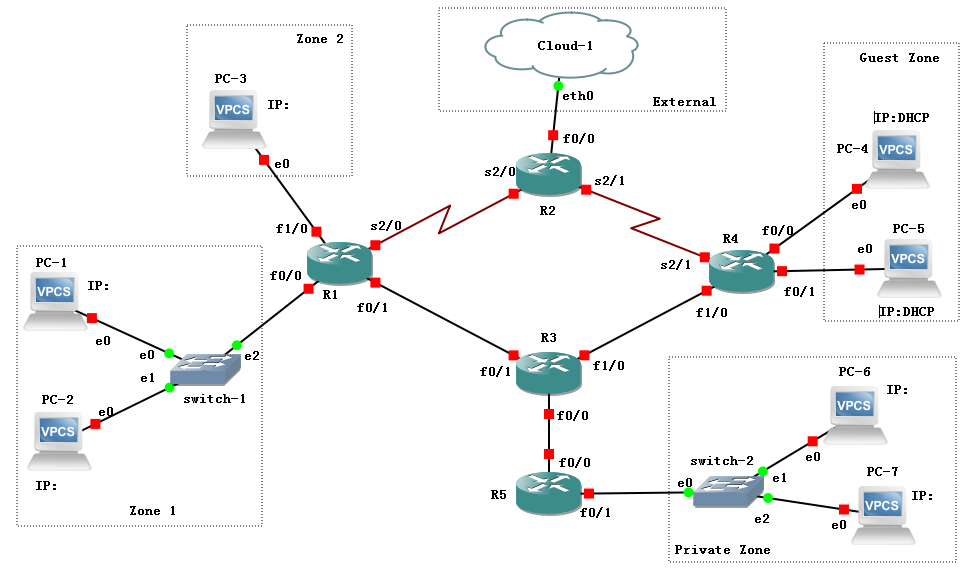
</ScreenshotCard>

</TaskCard>

<TaskCard number={2} title="配置PC1、PC2地址并测试连通性（/24掩码）" needScreenshot={true} needRecord={false}>

给PC1配置IP地址为10.0.0.X，给PC2配置IP地址为10.0.1.X，其中X为你的学号后2位或后3位（如果3位都为0，往前取，直到3位不全为0，后同不再说明），均使用24位长度的掩码（即255.255.255.0）。然后用Ping检查PC1、PC2之间的连通性（思考为什么不通）。

<ScreenshotCard 
  questionId="Lab4-s2" 
  title="PC间Ping测试结果" 
  uploadOptions={[
    { id: 'ping_result', label: '截图Ping结果' }
  ]}
>
  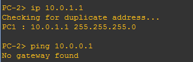
</ScreenshotCard>

</TaskCard>

<TaskCard number={3} title="修改掩码并测试连通性（/16掩码）" needScreenshot={true} needRecord={false}>

将PC1、PC2的掩码长度均改为16位（即255.255.0.0）。然后用Ping检查PC1、PC2之间的连通性。

<ScreenshotCard 
  questionId="Lab4-s3" 
  title="修改掩码后Ping测试结果" 
  uploadOptions={[
    { id: 'ping_result', label: '截图Ping结果' }
  ]}
>
  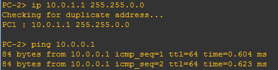
</ScreenshotCard>

</TaskCard>

<TaskCard number={4} title="配置R1接口并查看路由表" needScreenshot={true} needRecord={true}>

给R1的两个接口f0/0、f1/0分别配置合适的IP地址，掩码长度均为16，并激活接口。然后查看路由表信息。

<ScreenshotCard 
  questionId="Lab4-s4" 
  title="R1接口配置与路由表信息" 
  uploadOptions={[
    { id: 'config_cmd', label: '记录配置命令', type: 'text', textConfig: {codeEditor: true, initialLines: 6} },
    { id: 'routing_table', label: '截图路由表信息' }
  ]}
>
  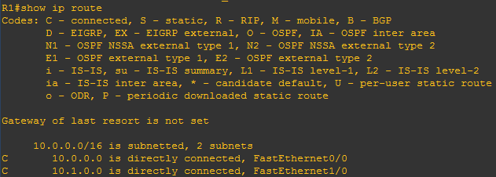
</ScreenshotCard>

</TaskCard>

<TaskCard number={5} title="配置PC3并测试跨路由器连通性" needScreenshot={true} needRecord={false}>

给PC3配置IP地址10.1.0.X，其中X为你的学号后2位或后3位，掩码长度16位（即255.255.0.0）。然后用Ping检查PC1、PC3之间的连通性。

<ScreenshotCard 
  questionId="Lab4-s5" 
  title="PC1与PC3间Ping测试结果" 
  uploadOptions={[
    { id: 'ping_result', label: '截图Ping结果' }
  ]}
>
  
</ScreenshotCard>

</TaskCard>

<TaskCard number={6} title="配置PC默认网关并重新测试" needScreenshot={true} needRecord={false}>

如果上一步Ping的结果是不通，请给PC1、PC3配置合适的路由器地址（Gateway），并再次检查两者之间的连通性。

<ScreenshotCard 
  questionId="Lab4-s6" 
  title="PC网关配置与Ping测试" 
  uploadOptions={[
    { id: 'pc1_config', label: '截图PC1配置命令' },
    { id: 'pc3_config', label: '截图PC3配置命令' },
    { id: 'ping_result', label: '截图Ping结果' }
  ]}
>
  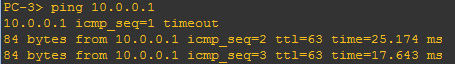
</ScreenshotCard>

</TaskCard>


<TaskCard number={7} title="配置R4接口" needScreenshot={false} needRecord={true}>

给R4的f0/0、f0/1两个接口配置IP地址并激活接口。

<ScreenshotCard 
  questionId="Lab4-s7" 
  title="R4接口配置命令" 
  uploadOptions={[
    { id: 'config_cmd', label: '记录配置命令', type: 'text', textConfig: {codeEditor: true, initialLines: 6} }
  ]}
/>

</TaskCard>

<TaskCard number={8} title="配置R4第一个接口的DHCP服务" needScreenshot={false} needRecord={true}>

在R4上为第一个接口（f0/0）连接的子网配置DHCP服务。

<ScreenshotCard 
  questionId="Lab4-s8" 
  title="DHCP服务配置命令" 
  uploadOptions={[
    { id: 'config_cmd', label: '记录配置命令', type: 'text', textConfig: {codeEditor: true, initialLines: 3} }
  ]}
/>

</TaskCard>

<TaskCard number={9} title="PC4使用DHCP获取地址" needScreenshot={true} needRecord={false}>

在PC4上使用DHCP动态分配地址，查看获得的IP地址。

<ScreenshotCard 
  questionId="Lab4-s9" 
  title="PC4 DHCP地址分配" 
  uploadOptions={[
    { id: 'dhcp_result', label: '截图配置命令及获得的IP地址' }
  ]}
>
  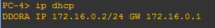
</ScreenshotCard>

</TaskCard>

<TaskCard number={10} title="配置R4第二个接口的DHCP服务" needScreenshot={false} needRecord={true}>

在R4上为第二个接口（f0/1）配置DHCP服务。

<ScreenshotCard 
  questionId="Lab4-s10" 
  title="第二个DHCP池配置命令" 
  uploadOptions={[
    { id: 'config_cmd', label: '记录配置命令', type: 'text', textConfig: {codeEditor: true, initialLines: 3} }
  ]}
/>

</TaskCard>

<TaskCard number={11} title="PC5使用DHCP获取地址" needScreenshot={true} needRecord={false}>

在PC5上使用DHCP动态分配地址，查看获得的IP地址。

<ScreenshotCard 
  questionId="Lab4-s11" 
  title="PC5 DHCP地址分配" 
  uploadOptions={[
    { id: 'dhcp_result', label: '截图配置命令及获得的IP地址' }
  ]}
>
  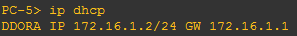
</ScreenshotCard>

</TaskCard>

<TaskCard number={12} title="测试PC4与PC5连通性" needScreenshot={true} needRecord={false}>

用Ping命令测试PC4、PC5之间的连通性。

<ScreenshotCard 
  questionId="Lab4-s12" 
  title="PC间Ping测试结果" 
  uploadOptions={[
    { id: 'ping_result', label: '截图Ping结果' }
  ]}
>
  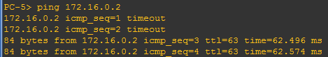
</ScreenshotCard>

</TaskCard>

<TaskCard number={13} title="查看DHCP分配信息" needScreenshot={true} needRecord={false}>

显示R4上的已分配DHCP主机信息

<ScreenshotCard 
  questionId="Lab4-s13" 
  title="DHCP主机分配信息" 
  uploadOptions={[
    { id: 'dhcp_info', label: '截图已分配DHCP主机信息' }
  ]}
>
  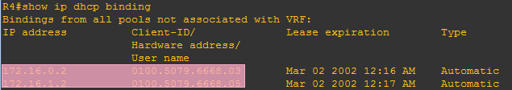
</ScreenshotCard>

</TaskCard>

<TaskCard number={14} title="配置R1-R2串口（HDLC协议）" needScreenshot={true} needRecord={true}>

配置R1、R2路由器之间的串口，设置数据链路层协议为HDLC（命令：`encapsulation hdlc`），在其中一台路由器上设置时钟速率（命令：`clock rate 速率值`），设置IP地址，激活接口，并测试两个路由器之间的连通性。

<ScreenshotCard 
  questionId="Lab4-s14a" 
  title="R1配置命令" 
  uploadOptions={[
    { id: 'r1_config', label: '记录R1配置命令', type: 'text', textConfig: {codeEditor: true, initialLines: 4} }
  ]}
>
  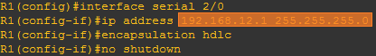
</ScreenshotCard>

<ScreenshotCard 
  questionId="Lab4-s14b" 
  title="R2配置命令" 
  uploadOptions={[
    { id: 'r2_config', label: '记录R2配置命令', type: 'text', textConfig: {codeEditor: true, initialLines: 5} }
  ]}
>
  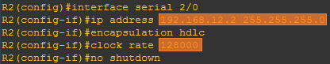
</ScreenshotCard>

<ScreenshotCard 
  questionId="Lab4-s14c" 
  title="R1-R2连通性测试" 
  uploadOptions={[
    { id: 'ping_result', label: '截图Ping结果' }
  ]}
>
  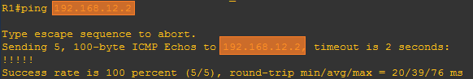
</ScreenshotCard>

</TaskCard>

<TaskCard number={15} title="配置R4-R2串口（PPP协议）" needScreenshot={true} needRecord={true}>

配置R4、R2路由器之间的串口，设置IP地址，设置数据链路层协议为PPP（命令：`encapsulation ppp`），设置PPP认证模式为CHAP（命令：`ppp authentication chap`），为对方设置认证用户名和密码（命令：`username R4 password 1234`），用户名默认就是对方的路由器hostname（区分大小写），密码要设置成一样的。激活接口，查看串口状态并测试两个路由器之间的连通性。LCP Open 表明 PPP 的 LCP 已经协商完成，身份验证通过

<ScreenshotCard 
  questionId="Lab4-s15a" 
  title="R2配置命令" 
  uploadOptions={[
    { id: 'r2_config', label: '记录R2配置命令', type: 'text', textConfig: {codeEditor: true, initialLines: 6} }
  ]}
>
  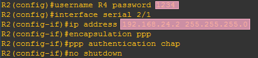
</ScreenshotCard>

<ScreenshotCard 
  questionId="Lab4-s15b" 
  title="R4配置命令" 
  uploadOptions={[
    { id: 'r4_config', label: '记录R4配置命令', type: 'text', textConfig: {codeEditor: true, initialLines: 6} }
  ]}
>
  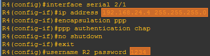
</ScreenshotCard>

<ScreenshotCard 
  questionId="Lab4-s15c" 
  title="串口状态与连通性测试" 
  uploadOptions={[
    { id: 'serial_status', label: '截图串口状态（LCP Open）' },
    { id: 'ping_result', label: '截图Ping结果' }
  ]}
>
  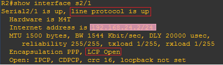
  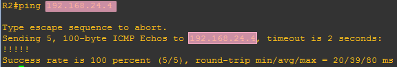
</ScreenshotCard>

</TaskCard>


<TaskCard number={16} title="配置R1-R3接口并测试连通性" needScreenshot={true} needRecord={true}>

配置R1、R3路由器之间接口的IP地址，激活接口，并测试两个路由器之间的连通性。

<ScreenshotCard 
  questionId="Lab4-s16" 
  title="R1-R3接口配置与测试" 
  uploadOptions={[
    { id: 'r1_config', label: '记录R1输入的命令', type: 'text', textConfig: {codeEditor: true, initialLines: 3} },
    { id: 'r3_config', label: '记录R3输入的命令', type: 'text', textConfig: {codeEditor: true, initialLines: 3} },
    { id: 'ping_result', label: '截图Ping结果' }
  ]}
/>

</TaskCard>

<TaskCard number={17} title="配置R4-R3接口并测试连通性" needScreenshot={true} needRecord={true}>

配置R4、R3路由器之间接口的IP地址，激活接口，并测试两个路由器之间的连通性。

<ScreenshotCard 
  questionId="Lab4-s17" 
  title="R4-R3接口配置与测试" 
  uploadOptions={[
    { id: 'r3_config', label: '记录R3输入的命令', type: 'text', textConfig: {codeEditor: true, initialLines: 3} },
    { id: 'r4_config', label: '记录R4输入的命令', type: 'text', textConfig: {codeEditor: true, initialLines: 3} },
    { id: 'ping_result', label: '截图Ping结果' }
  ]}
/>

</TaskCard>

<TaskCard number={18} title="测试跨路由器PC间连通性" needScreenshot={true} needRecord={false}>

分别测试PC1与PC4、PC1与PC5、PC3与PC4、PC3与PC5之间的连通性。

<ScreenshotCard 
  questionId="Lab4-s18" 
  title="PC间连通性测试结果" 
  uploadOptions={[
    { id: 'pc1_to_pc4', label: '截图PC1→4 结果' },
    { id: 'pc1_to_pc5', label: '截图PC1→5 结果' },
    { id: 'pc3_to_pc4', label: '截图PC3→4 结果' },
    { id: 'pc3_to_pc5', label: '截图PC3→5 结果' }
  ]}
>
  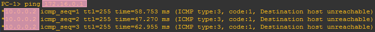
</ScreenshotCard>

</TaskCard>

<TaskCard number={19} title="查看路由表并分析问题" needScreenshot={true} needRecord={false}>

查看各路由器的路由表信息（命令：`show ip route`），分析上述不能Ping通的原因是缺少了哪些路由信息，为下一步添加路由做准备。

<ScreenshotCard 
  questionId="Lab4-s19" 
  title="各路由器路由表信息" 
  uploadOptions={[
    { id: 'r1_routing', label: '截图R1路由表' },
    { id: 'r2_routing', label: '截图R2路由表' },
    { id: 'r3_routing', label: '截图R3路由表' },
    { id: 'r4_routing', label: '截图R4路由表' }
  ]}
>
  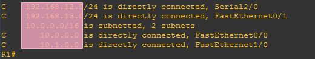
</ScreenshotCard>

</TaskCard>

<TaskCard number={20} title="配置静态路由实现区域互通" needScreenshot={true} needRecord={true}>

在各个路由器上为相应的目标网络（Zone1, Zone2, Guest zone所在子网）添加静态路由（优先选择以太网线路作为下一跳路径），以便上述三个区内的PC能够互相Ping通（不通请仔细分析是哪一台路由器缺少了路由）。记录最后的路由表信息。

<ScreenshotCard 
  questionId="Lab4-s20a" 
  title="各路由器静态路由配置命令" 
  uploadOptions={[
    { id: 'r1_config', label: '记录R1输入的命令', type: 'text', textConfig: {codeEditor: true, initialLines: 2} },
    { id: 'r2_config', label: '记录R2输入的命令', type: 'text', textConfig: {codeEditor: true, initialLines: 4} },
    { id: 'r3_config', label: '记录R3输入的命令', type: 'text', textConfig: {codeEditor: true, initialLines: 4} },
    { id: 'r4_config', label: '记录R4输入的命令', type: 'text', textConfig: {codeEditor: true, initialLines: 2} }
  ]}
/>

<ScreenshotCard 
  questionId="Lab4-s20b" 
  title="PC间连通性测试结果" 
  uploadOptions={[
    { id: 'pc1_to_pc4', label: '截图PC1→4 结果' },
    { id: 'pc1_to_pc5', label: '截图PC1→5 结果' },
    { id: 'pc3_to_pc4', label: '截图PC3→4 结果' },
    { id: 'pc3_to_pc5', label: '截图PC3→5 结果' }
  ]}
>
  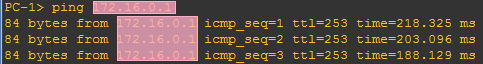
</ScreenshotCard>

<ScreenshotCard 
  questionId="Lab4-s20c" 
  title="各路由器路由表信息" 
  uploadOptions={[
    { id: 'r1_routing', label: '截图R1路由表' },
    { id: 'r2_routing', label: '截图R2路由表' },
    { id: 'r3_routing', label: '截图R3路由表' },
    { id: 'r4_routing', label: '截图R4路由表' }
  ]}
>
  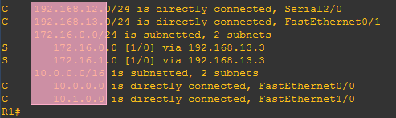
</ScreenshotCard>

</TaskCard>

<TaskCard number={21} title="配置备用路由并验证路由切换" needScreenshot={true} needRecord={true}>

在R1和R4上增加备用路由，选择串口线路作为下一跳的路径，并将路由距离设置成30（命令：`ip route 目标网络 子网掩码 下一跳地址 距离`）。此时查看路由表，该新增路由信息并不会出现，但在主路由链路断开时（在R1、R4上关闭与R3连接的端口），该路由会被自动添加进路由表。通过实验验证一下。

:::tip 提示
B)如果不通，请检查R2上是否添加了相应的路由
:::

<ScreenshotCard 
  questionId="Lab4-s21" 
  title="备用路由配置命令" 
  uploadOptions={[
    { id: 'r1_config', label: '记录R1配置命令', type: 'text', textConfig: {codeEditor: true, initialLines: 2} },
    { id: 'r4_config', label: '记录R4配置命令', type: 'text', textConfig: {codeEditor: true, initialLines: 2} }
  ]}
/>

* **R1-R3、R4-R3 间链路断开前**
    <ScreenshotCard 
    questionId="Lab4-s21" 
    title="R1路由表" 
    uploadOptions={[
        { id: 'r1_routing_a', label: '截图R1路由表信息' }
    ]}
    >
    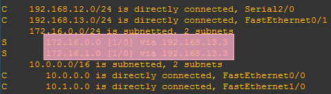
    </ScreenshotCard>
    <ScreenshotCard 
    questionId="Lab4-s21" 
    title="R4路由表" 
    uploadOptions={[
        { id: 'r4_routing_a', label: '截图R4路由表信息' }
    ]}
    >
    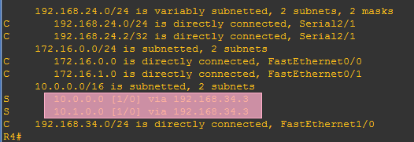
    </ScreenshotCard>
    <ScreenshotCard 
    questionId="Lab4-s21" 
    title="路由跟踪" 
    uploadOptions={[
        { id: 'trace_result_a', label: '截图PC1路由跟踪结果' }
    ]}
    >
    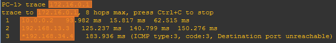
    </ScreenshotCard>
* **R1-R3、R4-R3 间链路断开后**
    <ScreenshotCard 
    questionId="Lab4-s21" 
    title="R1路由表" 
    uploadOptions={[
        { id: 'r1_routing_b', label: '截图R1路由表信息' }
    ]}
    >
    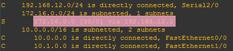
    </ScreenshotCard>
    <ScreenshotCard 
    questionId="Lab4-s21" 
    title="R4路由表" 
    uploadOptions={[
        { id: 'r4_routing_b', label: '截图R4路由表信息' }
    ]}
    >
    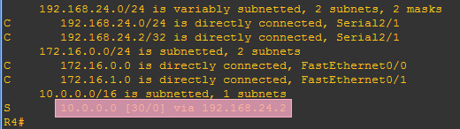
    </ScreenshotCard>
    <ScreenshotCard 
    questionId="Lab4-s21" 
    title="路由跟踪" 
    uploadOptions={[
        { id: 'trace_result_b', label: '截图PC1路由跟踪结果' }
    ]}
    >
    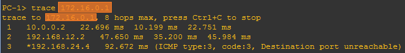
    </ScreenshotCard>
* **R1-R3、R4-R3 间链路重新打开后**
    <ScreenshotCard 
    questionId="Lab4-s21" 
    title="路由表信息" 
    uploadOptions={[
        { id: 'r1_routing_c', label: '截图R1路由表信息' },
        { id: 'r4_routing_c', label: '截图R4路由表信息' }
    ]}
    />

</TaskCard>

<TaskCard number={22} title="测试指定源地址连通性并补充路由" needScreenshot={true} needRecord={true}>

在R1上分别使用f1/0、s2/0接口的IP地址作为源地址，测试到R4的s2/1接口地址的连通性（命令：`ping 目标IP地址 source 源IP地址`），如果有哪个不通，在各个路由器上增加相应的静态路由信息。

<ScreenshotCard 
  questionId="Lab4-s22" 
  title="指定源地址Ping测试结果" 
  uploadOptions={[
    { id: 'f0_0_ping', label: '截图R1 f0/0→R4 s2/1 结果' },
    { id: 'f0_1_ping', label: '截图R1 f0/1→R4 s2/1 结果' },
  ]}
>
  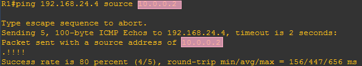
</ScreenshotCard>

<ScreenshotCard 
  questionId="Lab4-s22" 
  title="指定源地址Ping测试结果" 
  uploadOptions={[
    { id: 'f1_0_ping', label: '截图R1 f1/0→R4 s2/1 结果' },
    { id: 's2_0_ping', label: '截图R1 s2/0→R4 s2/1 结果' }
  ]}
>
  
</ScreenshotCard>

如果某个路由器上不需要增加静态路由信息，配置命令填`-`即可

<ScreenshotCard 
  questionId="Lab4-s22" 
  title="补充静态路由配置命令" 
  uploadOptions={[
    { id: 'r1_config', label: '记录R1配置命令', type: 'text', textConfig: {codeEditor: true, initialLines: 1} },
    { id: 'r2_config', label: '记录R2配置命令', type: 'text', textConfig: {codeEditor: true, initialLines: 1} },
    { id: 'r3_config', label: '记录R3配置命令', type: 'text', textConfig: {codeEditor: true, initialLines: 2} },
    { id: 'r4_config', label: '记录R4配置命令', type: 'text', textConfig: {codeEditor: true, initialLines: 2} }
  ]}
/>

</TaskCard>

<TaskCard number={23} title="配置R3-R5接口并测试连通性" needScreenshot={true} needRecord={true}>

给R3的f0/0（R3-R5之间）接口配置IP地址，给R5各接口配置IP地址，激活接口，并测试两个路由器之间的连通性。

<ScreenshotCard 
  questionId="Lab4-s23" 
  title="R3-R5接口配置与测试" 
  uploadOptions={[
    { id: 'r3_config', label: '记录R3配置命令', type: 'text', textConfig: {codeEditor: true, initialLines: 2} },
    { id: 'r5_config', label: '记录R5配置命令', type: 'text', textConfig: {codeEditor: true, initialLines: 6} },
    { id: 'ping_result', label: '截图Ping结果' }
  ]}
/>

</TaskCard>

<TaskCard number={24} title="配置PC6、PC7地址" needScreenshot={false} needRecord={true}>

给PC6、PC7配置IP地址及默认路由器地址（选R5作为默认路由器），其中PC6地址的主机部分为你的学号后2位或后3位（规则同前）。

<ScreenshotCard 
  questionId="Lab4-s24" 
  title="PC6/PC7网络配置命令" 
  uploadOptions={[
    { id: 'pc6_config', label: '记录PC6配置命令', type: 'text', textConfig: {codeEditor: true, initialLines: 1} },
    { id: 'pc7_config', label: '记录PC7配置命令', type: 'text', textConfig: {codeEditor: true, initialLines: 1} }
  ]}
/>

</TaskCard>

<TaskCard number={25} title="配置R5 NAT服务" needScreenshot={true} needRecord={true}>

在R5路由器上配置NAT服务，定义fa0/1接口为**内部接口**，定义fa0/0接口为**外部接口**。配置完成后同时在PC6、PC7上持续Ping路由器R3的fa0/0接口地址（命令：`ping ip地址 -t`），Ping通后在R5上显示NAT信息（命令：`show ip nat translation`），可以看出内部的源IP地址被转换成了外部IP地址。

:::danger 实验报告模板中，内部/外部接口写反，请按实验文档要求，定义f0/1接口为内部接口，定义f0/0接口为外部接口
:::

<ScreenshotCard 
  questionId="Lab4-s25" 
  title="NAT配置命令" 
  uploadOptions={[
    { id: 'nat_config', label: '记录配置命令', type: 'text', textConfig: {initialContent: "R5(config)# interface fa0/1\nR5(config-if)# ip nat inside\nR5(config-if)# exit\nR5(config)# interface fa0/0\nR5(config-if)# ip nat outside\nR5(config-if)# exit\nR5(config)# access-list 1 permit [ip] [mask]\nR5(config)# ip nat inside source list 1 interface fa0/0 overload",codeEditor: true, initialLines: 8} }
  ]}
>

</ScreenshotCard>

<ScreenshotCard 
  questionId="Lab4-s25" 
  title="NAT转换信息" 
  uploadOptions={[
    { id: 'nat_info', label: '截图NAT信息' }
  ]}
>
  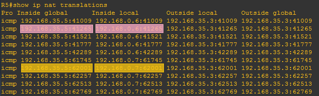
</ScreenshotCard>

</TaskCard>

<TaskCard number={26} title="配置路由实现Private Zone与其他区域通信" needScreenshot={true} needRecord={true}>

在各路由器上增加静态路由信息，使得PC6能够与Zone1、Zone2、Guest Zone的PC机通信。

:::tip 提示
在R5上可以通过设置默认路由方式简化路由配置（命令：`ip route 0.0.0.0 0.0.0.0 默认路由器IP地址`），而Private Zone对其他区域是不可见的，所以在外部路由器上是不需要为其添加路由的（只需要添加R3-R5之间的子网）。
:::

如果某个路由器上不需要增加静态路由信息，配置命令填`-`即可

<ScreenshotCard 
  questionId="Lab4-s26" 
  title="各路由器配置命令" 
  uploadOptions={[
    { id: 'r1_config', label: '记录R1配置命令', type: 'text', textConfig: {codeEditor: true, initialLines: 1} },
    { id: 'r2_config', label: '记录R2配置命令', type: 'text', textConfig: {codeEditor: true, initialLines: 1} },
    { id: 'r3_config', label: '记录R3配置命令', type: 'text', textConfig: {codeEditor: true, initialLines: 1} },
    { id: 'r4_config', label: '记录R4配置命令', type: 'text', textConfig: {codeEditor: true, initialLines: 1} },
    { id: 'r5_config', label: '记录R5配置命令', type: 'text', textConfig: {codeEditor: true, initialLines: 1} }
  ]}
/>

<ScreenshotCard 
  questionId="Lab4-s26" 
  title="PC6连通性测试结果" 
  uploadOptions={[
    { id: 'pc6_to_pc1', label: '截图PC6→1 结果' },
    { id: 'pc6_to_pc3', label: '截图PC6→3 结果' },
    { id: 'pc6_to_pc4', label: '截图PC6→4 结果' },
    { id: 'pc6_to_pc5', label: '截图PC6→5 结果' }
  ]}
>
  
</ScreenshotCard>

</TaskCard>

<TaskCard number={27} title="配置R2动态获取地址并测试与主机连通性" needScreenshot={true} needRecord={true}>

默认情况下，Cloud-1的eth0接口工作在仅主机模式，IP地址是动态分配的，与电脑主机的某个虚拟网卡处于同一个子网。因此配置R2的f0/0接口IP地址时也采用动态分配方式（命令：`ip addess dhcp`）。配置完成后查看R2获得的IP地址，然后在电脑主机上打开命令行，Ping一下R2的IP地址。

<ScreenshotCard 
  questionId="Lab4-s27" 
  title="R2 与主机连通性测试" 
  uploadOptions={[
    { id: 'config_cmd', label: '记录输入的命令', type: 'text', textConfig: {codeEditor: true, initialLines: 3} },
    { id: 'r2_ip', label: '截图R2获得的IP地址' },
    { id: 'host_ping', label: '截图主机Ping结果' }
  ]}
>
  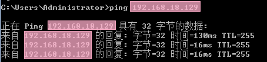
</ScreenshotCard>

</TaskCard>

<TaskCard number={28} title="配置R2 NAT实现Zone1与主机通信" needScreenshot={true} needRecord={true}>

在R2上配置NAT服务，并且在R1上添加电脑主机的子网路由，使得Zone 1的PC机也能与电脑主机通信。提示：定义f0/0接口为外部接口，s2/0为内部接口。

:::tip 提示
如果Zone 1的PC机无法与电脑主机通信，建议先检查R2能否Ping通Zone 1 PC机 / 电脑主机，判断问题在于路由配置还是虚拟网卡配置

如果电脑主机能够Ping通R2，但R2无法Ping通电脑主机，请检查是否关闭了防火墙（Windows安全中心-防火墙与网络保护-分别点击三种网络并关闭其防火墙）
:::

<ScreenshotCard 
  questionId="Lab4-s28" 
  title="R2 NAT配置命令" 
  uploadOptions={[
    { id: 'r2_config', label: '记录R2配置命令', type: 'text', textConfig: {codeEditor: true, initialLines: 6} }
  ]}
>
  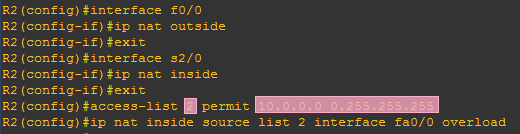
</ScreenshotCard>

<ScreenshotCard 
  questionId="Lab4-s28" 
  title="R1路由配置命令" 
  uploadOptions={[
    { id: 'r1_config', label: '记录R1配置命令', type: 'text', textConfig: {codeEditor: true, initialLines: 1} }
  ]}
>
  
</ScreenshotCard>

<ScreenshotCard 
  questionId="Lab4-s28" 
  title="主机IP" 
  uploadOptions={[
    { id: 'host_ip', label: '截图电脑主机IP地址' }
  ]}
>
  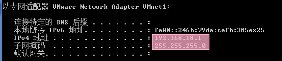
</ScreenshotCard>
<ScreenshotCard 
  questionId="Lab4-s28" 
  title="主机与PC1连通性测试" 
  uploadOptions={[
    { id: 'ping_result', label: '截图PC1与主机Ping结果' }
  ]}
>
  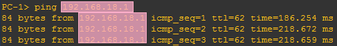
</ScreenshotCard>

</TaskCard>

<TaskCard number={29} title="连接真实网络并测试" needScreenshot={true} needRecord={true}>

找一个不需要认证、没有地址绑定限制的网络环境（首选实验室、机房，或者自己搭一个环境），首先配置电脑主机的IP地址和默认网关，以便让电脑主机能够正常连接真实网络，再找一台该网络可以Ping通的主机H。

接下来让R2的f0/0口改为连接Cloud-1的eth2接口（该接口采用桥接模式，如果没有eth2，请参照GNS指南添加一个），使用静态或动态方式给R2的f0/0口配置IP地址（采用动态分配时需要再次输入`ip address dhcp`，以便路由器重新获取IP地址），设置R2的默认路由地址为真实网络上的默认网关，在R1上为主机H的子网配置路由（可以简化配置成默认路由），测试R2以及PC1能否Ping通该主机。

:::tip 提示
该网络环境可以用手机热点模拟，电脑和另一台设备连接到该手机热点即可进行实验

如果Zone 1的PC机无法与电脑主机通信，建议先检查R2能否Ping通Zone 1 PC机 / 主机H，判断问题在于路由配置还是虚拟网卡配置
:::

<ScreenshotCard 
  questionId="Lab4-s29" 
  title="R2配置命令" 
  uploadOptions={[
    { id: 'r2_config', label: '记录R2配置命令', type: 'text', textConfig: {codeEditor: true, initialLines: 3} }
  ]}
>
  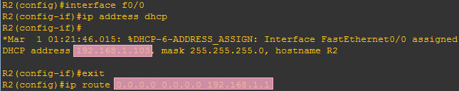
</ScreenshotCard>

<ScreenshotCard 
  questionId="Lab4-s29" 
  title="R1配置命令" 
  uploadOptions={[
    { id: 'r1_config', label: '记录R1配置命令', type: 'text', textConfig: {codeEditor: true, initialLines: 1} }
  ]}
>
  
</ScreenshotCard>

<ScreenshotCard 
  questionId="Lab4-s29" 
  title="R2与主机H的Ping结果" 
  uploadOptions={[
    { id: 'r2_ping', label: '截图R2与主机H的Ping结果' }
  ]}
>
  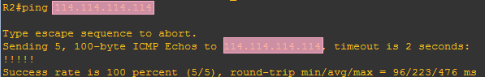
</ScreenshotCard>
<ScreenshotCard 
  questionId="Lab4-s29" 
  title="PC1与主机H的Ping结果" 
  uploadOptions={[
    { id: 'pc1_ping', label: '截图PC1与主机H的Ping结果' }
  ]}
>
  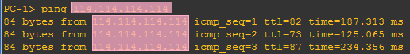
</ScreenshotCard>

</TaskCard>

<TaskCard number={30} title="整理路由器运行配置" needScreenshot={false} needRecord={false}>

整理各路由器的当前运行配置，选择与本实验相关的内容记录在文本文件中，每个设备一个文件，分别命名为R1.txt、R2.txt等，随实验报告一起打包上传。

</TaskCard>

## 3 实验结果与分析

根据你观察到的实验数据和对实验原理的理解，分别解答以下问题：

* 路由器的接口为什么会出现：FastEthernet0/1 is up, line protocol is down的状态？
  <ModernInput size="exlarge" questionId="Lab4-q1"/>
* 路由起什么作用？什么是静态路由？
  <ModernInput size="exlarge" questionId="Lab4-q2"/>
* 需要为每个PC的IP地址添加路由，还是只需要为其网络地址添加路由？
  <ModernInput size="exlarge" questionId="Lab4-q3"/>
* 添加静态路由时，下一跳地址是填写本路由器的端口地址，还是对方路由器的端口地址？或者是目的地网络的路由器端口地址？
  <ModernInput size="exlarge" questionId="Lab4-q4"/>
* 什么是默认路由？添加默认路由的命令格式是什么？
  <ModernInput size="exlarge" questionId="Lab4-q5"/>
* 在同一个局域网内的2台PC机，IP地址分别为10.0.0.x/24和10.0.1.x/24，都属于VLAN1，一开始不能互相Ping通，为什么把子网掩码长度从24位变成16位，就通了？
  <ModernInput size="exlarge" questionId="Lab4-q6"/>
* 如果仅仅是为了让不同区域内的PC之间能够互相Ping通，在设置静态路由时，路由器之间互联的子网是否全部都要加入到所有路由器的路由表中？为什么？
  <ModernInput size="exlarge" questionId="Lab4-q7"/>

## 4 常见问题

## 5 导出实验报告

<!-- <ExportButton templatePath={require('@site/assets/base_report/Lab4.zip').default} labName="Lab4" labId="lab4-" /> -->

</PlaceHolder>