import FileCard from '@site/src/components/FileCard';
import LinkCard from '@site/src/components/LinkCard';
import DeadlineProcess from '@site/src/components/DeadlineProcess';
import TaskCard from '@site/src/components/TaskCard';
import ScreenshotCard from '@site/src/components/ScreenshotCard';
import ModernInput from '@site/src/components/ModernInput';
import ExportButton from '@site/src/components/ExportButton';
import GridContainer from '@site/src/components/GridContainer';

<h3 style={{color: '#006d75', marginTop: 0, marginBottom: 8}}>实验资源</h3>
<DeadlineProcess start={'2025-11-25 18:50:00'} end={'2025-12-09 23:59:59'}/>

<GridContainer>
    <FileCard file_type={'md'} name={'Lab5 实验报告模板 Markdown版本'} size={'742709'} link={require('@site/assets/templete/md/Lab5 实验报告模板.zip').default} />
    <FileCard file_type={'doc'} name={'Lab5 实验报告模板 Word版本'} size={'941568'} link={require('@site/assets/templete/word/实验报告模版_实验5.doc').default} />
    <FileCard file_type={'pdf'} name={'Lab5 动态路由协议OSPF配置 实验课件'} size={'5090922'} link={require('@site/assets/slides/在Cisco路由器上的路由协议.pdf').default} />
</GridContainer>

## 1 实验目的

在Lab4中我们通过静态路由和默认路由，一条一条地设计好了网络的路由转发方式，这种方法在网络拓扑固定时行之有效，但它无法应对真实世界中链路中断或拓扑变更带来的挑战，同时对于复杂网络而言也会带来巨大的工作量；本次实验将带你体会动态路由协议的重要性，探索路由器如何自行发现路径、计算最优路由，并在网络变化时快速自愈

我们将首先配置经典的距离矢量协议RIP，体会其简便性及其在路径选择上的局限性，以此作为后续对比的基准；随后，我们将深入本次实验的核心——OSPF（开放最短路径优先）协议；与RIP截然不同，OSPF是一种基于链路状态的动态路由协议，能够实现高效的路由信息传播和极快的网络收敛；为了驾驭大型网络，OSPF还引入了‘区域’的概念，我们将从单区域配置开始，逐步构建跨越骨干区、标准区、甚至是通过虚链路连接的复杂多域网络

通过本次实验，你将：

* 理解链路状态路由协议的工作原理
* 理解OSPF协议的工作机制
* 掌握配置和调试OSPF协议的方法

## 2 实验数据记录和处理

:::important 提示
以下实验记录均需结合屏幕截图，进行文字标注和描述，图片应大小合适、关键部分清晰可见，可直接在图片上进行标注，也可以单独用文本进行描述

记录输入的命令时，直接粘贴文字即可（保留命令前面的提示符，如R1#）

调试时，可参考Cisco提供的故障排除技术说明：
<LinkCard icon="https://www.cisco.com/favicon.ico" title="IP 路由 - 故障排除技术说明" url="https://www.cisco.com/c/zh_cn/tech/ip/ip-routing/tsd-technology-support-troubleshooting-technotes-list.html">故障排除技术说明</LinkCard>
:::

### 2.0 设计网络拓扑并进行初始配置

<TaskCard number={1} title="设计IP地址方案并标注拓扑图" needScreenshot={true} needRecord={false}>
请根据实验拓扑图和实验要求，为每个PC及路由器的各个接口设计一套完整、合理的IP地址和子网掩码方案，并标注在拓扑图上：
* Area 0使用10.0.0.0/16的网络地址进行分配，每个子网分别使用10.0.0.0/24、10.0.1.0/24、10.0.2.0/24等子网地址；其中点对点连接的路由器之间的子网使用10.0.123.240/28进行分配以最大程度的节约地址，例如使用串行掩码方案，网络地址部分为30位，每个子网刚好有2个可用地址（去掉1个主机地址部分全0的和1个主机地址部分全1的），可以按如下方式进行分配：
    * R1-R2互联接口: 10.0.123.241/30、10.0.123.242/30，子网地址：10.0.123.240/30
    * R1-R3互联接口: 10.0.123.245/30、10.0.123.246/30，子网地址：10.0.123.244/30
    * 依次类推，R2、R3、R4、R6之间的子网为（只需要4个地址）：10.0.123.248/29，去掉全0全1地址后，还有6个地址可用
* Area 1、Area 2、Area 3使用10.X.0.0/16的网络地址进行分配，其中X为Area编号，例如Area 1的3个子网分别使用10.1.0.0/24、10.1.1.0/24、10.1.2.0/24等子网地址（同一个交换机上的多台路由器的接口属于同一个子网）

<ScreenshotCard 
  questionId="Lab5-p0-s1" 
  title="网络拓扑图示例" 
  uploadOptions={[
    { id: 'topology', label: '上传标注IP地址的拓扑图' }
  ]}
>
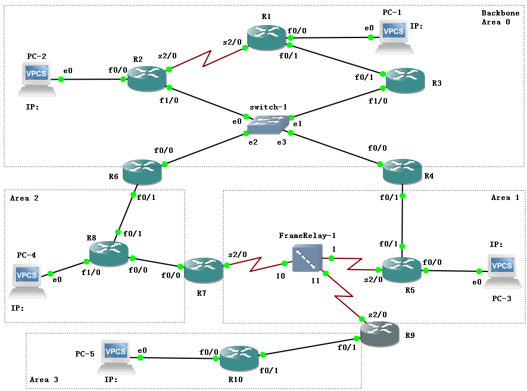
</ScreenshotCard>

</TaskCard>

<TaskCard number={2} title="配置路由器接口和PC网络参数" needScreenshot={true} needRecord={true}>
在配置任何动态路由协议之前，我们必须确保网络中所有链路层和网络层的基本连通性是正常的，这是后续路由协议能够成功建立邻居关系并交换路由信息的前提

1.  根据你在上一步规划的拓扑图，为路由器R1、R2、R3的各个接口配置IP地址和子网掩码，并激活这些接口
    * 进入接口配置模式: `interface [接口类型/编号]` (例如: `interface fastethernet 0/0`)
    * 配置IP地址: `ip address [IP地址] [子网掩码]`
    * 激活接口: `no shutdown`
    * 对于串口，还需配置封装协议和时钟速率（在DCE端）：`encapsulation hdlc`, `clock rate 128000`

    <ScreenshotCard 
      questionId="Lab5-p0-s2" 
      title="路由器接口配置命令" 
      uploadOptions={[
        { id: 'r1_config', label: '记录R1配置命令', type: 'text', textConfig: {initialContent: "R1(config)# interface f0/0\nR1(config-if)# ip addr [ip] 255.255.255.0\nR1(config-if)# no shutdown\nR1(config-if)# exit\nR1(config)# interface f0/1\nR1(config-if)# ip addr [ip] 255.255.255.252\nR1(config-if)# no shutdown\nR1(config-if)# exit\nR1(config)# interface s2/0\nR1(config-if)# ip addr [ip] 255.255.255.252\nR1(config-if)# encapsulation hdlc\nR1(config-if)# clock rate 128000\nR1(config-if)# no shutdown", codeEditor: true, initialLines: 13} },
        { id: 'r2_config', label: '记录R2配置命令', type: 'text', textConfig: {initialContent: "R2(config)# interface f0/0\nR2(config-if)# ip addr [ip] 255.255.255.0\nR2(config-if)# no shutdown\nR2(config-if)# exit\nR2(config)# interface f1/0\nR2(config-if)# ip addr [ip] 255.255.255.248\nR2(config-if)# no shutdown\nR2(config-if)# exit\nR2(config)# interface s2/0\nR2(config-if)# ip addr [ip] 255.255.255.252\nR2(config-if)# encapsulation hdlc\nR2(config-if)# no shutdown", codeEditor: true, initialLines: 10} },
        { id: 'r3_config', label: '记录R3配置命令', type: 'text', textConfig: {initialContent: "R3 (config)#interface f0/1\nR3(config-if)# ip addr [ip] 255.255.255.252\nR3(config-if)# no shutdown\nR3(config-if)# exit\nR3(config)# interface f1/0\nR3(config-if)# no shutdown\nR3(config-if)# ip addr [ip] 255.255.255.248", codeEditor: true, initialLines: 7} }
      ]}
    />

2.  为PC1和PC2配置静态IP地址、子网掩码以及默认网关
3.  在PC上使用 `ping` 命令测试其与直连路由器网关地址的连通性，确保链路正常工作

    <ScreenshotCard 
      questionId="Lab5-p0-s2" 
      title="PC1→R1连通性测试示例" 
      uploadOptions={[
        { id: 'pc1_to_r1', label: '截图PC1→R1测试结果' }
      ]}
    >
      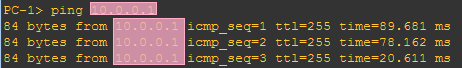
    </ScreenshotCard>

    <ScreenshotCard 
      questionId="Lab5-p0-s2" 
      title="PC2→R2连通性测试示例" 
      uploadOptions={[
        { id: 'pc2_to_r2', label: '截图PC2→R2测试结果' }
      ]}
    >
      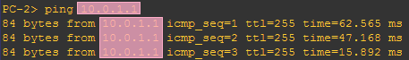
    </ScreenshotCard>

</TaskCard>

### 2.1 配置RIP用于对照

<TaskCard number={3} title="配置RIP动态路由协议" needScreenshot={false} needRecord={true}>

背景知识：RIP协议简介

路由信息协议（Routing Information Protocol, RIP）是一种经典的**距离矢量**（**Distance-Vector**）路由协议；它的工作原理可以通俗地理解为“听信邻居”；每台运行RIP的路由器都会周期性地向其直连邻居广播自己的整张路由表，即“我能去往这些地方，代价分别是多少跳”；路由器收到邻居的路由信息后，简单地将其合并到自己的路由表中，然后又将这张新表广播给其他邻居，这个过程也被称为“基于传闻的路由”（routing by rumor）

RIP使用**跳数**（**Hop Count**）作为衡量路径优劣的唯一度量（Metric），也就是到达目标网络需要经过的路由器数量；这种机制的巨大缺陷在于它完全忽略了链路的带宽、延迟、负载等关键性能指标；在RIP的视角里，一条1000M的高速光纤链路和一条64K的低速串行链路，只要都是一跳，成本就是完全相同的；这种简单化的度量方式在现代复杂网络中显然是不够智能的，这也是它被OSPF等更先进的链路状态协议取代的主要原因

值得注意的是，与其他距离矢量路由协议相同的是，RIP也具有“坏消息传得慢”的劣势，为了防止路由环路并维持网络稳定性，RIP依赖于一套严格的计时器机制（以下为Cisco路由器上的默认值）：

* 更新计时器 (Update, 30s)：路由器每30秒向邻居发送一次完整的路由表更新
* 失效计时器 (Invalid, 180s)：如果180秒内未收到某条路由的更新，该路由会被标记为“可能不可达”（Metric置为16）
* 抑制计时器 (Hold-down, 180s)：当一条路由变为不可达时，路由器会启动倒计时，在此期间拒绝接受关于该网络均等或更差的路由更新，主要是为了防止网络中的错误路由信息（如因延迟导致的环路）被重新学习
* 刷新计时器 (Flush, 240s)：如果240秒内仍未收到更新，该路由条目将彻底从路由表中删除

距离矢量路由协议中，节点仅从邻居处学习路由信息，无法获得网络拓扑的全貌，如果一个节点连接目的地的链路断开，它会尝试使用邻居的路由，但邻居可能还未察觉链路变化，并向它通告一条经过它自己的旧路由，这使得两个节点陷入一个循环，它们会不断向对方发送更新信息，并在此过程中将路径成本逐渐推向无穷大，结合RIP计时器机制较长的等待时间，收敛过程极其缓慢

为了更好地理解OSPF协议的先进性，我们首先配置一个经典的距离矢量协议——RIP，并观察其行为，作为后续实验的参照基准

1.  在R1, R2, R3上分别进入全局配置模式，使用 `router rip` 命令启动RIP路由进程
2.  配置RIP使用版本2：`version 2`，该版本支持无类别域间路由（CIDR），能够正确传递子网掩码信息，是现代网络的基本要求
3.  使用 `network [网络地址]` 命令宣告与路由器直连的网络，激活相应接口上的RIP协议，并开始向外通告这些网络；注意这里我们只填写网络地址，不填写子网掩码

<ScreenshotCard 
  questionId="Lab5-p1-s3" 
  title="RIP协议配置命令" 
  uploadOptions={[
    { id: 'rip_r1', label: '记录R1配置命令', type: 'text', textConfig: {initialContent: "R1(config)# router rip\nR1(config-router)# network [subnet]\nR1(config-router)# version 2", codeEditor: true, initialLines: 4} },
    { id: 'rip_r2', label: '记录R2配置命令', type: 'text', textConfig: {initialContent: "R2(config)# router rip\nR2(config-router)# version 2\nR2(config-router)# network [subnet]", codeEditor: true, initialLines: 4} },
    { id: 'rip_r3', label: '记录R3配置命令', type: 'text', textConfig: {initialContent: "R3(config)# router rip\nR3(config-router)# version 2\nR3(config-router)# network [subnet]", codeEditor: true, initialLines: 4} }
  ]}
/>

</TaskCard>

<TaskCard number={4} title="查看RIP路由表并跟踪路由" needScreenshot={true} needRecord={false}>
配置完成后，我们验证一下RIP协议是否按预期工作，并分析其路径选择的结果

1.  在R1上使用 `show ip route` 命令查看路由表，标出到PC2子网的路由，下一跳是哪个路由器
    <ScreenshotCard 
      questionId="Lab5-p1-s4" 
      title="R1路由表示例" 
      uploadOptions={[
        { id: 'r1_route', label: '截图R1路由表（标出到PC2子网的路由，下一跳是哪个路由器）' }
      ]}
    >
      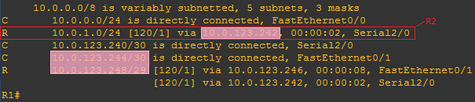
    </ScreenshotCard>
2.  在R2上使用 `show ip route` 命令查看路由表，标出到PC1子网的路由，下一跳是哪个路由器
    <ScreenshotCard 
      questionId="Lab5-p1-s4" 
      title="R2路由表示例" 
      uploadOptions={[
        { id: 'r2_route', label: '截图R2路由表' }
      ]}
    >
      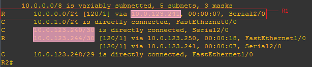
    </ScreenshotCard>
3.  在R3上使用 `show ip route` 命令查看路由表
    <ScreenshotCard 
      questionId="Lab5-p1-s4" 
      title="R3路由表示例" 
      uploadOptions={[
        { id: 'r3_route', label: '截图R3路由表' }
      ]}
    >
      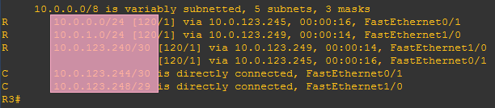
    </ScreenshotCard>
4.  分析从PC1所在子网到PC2所在子网的路由条目，记录其下一跳地址和度量值（跳数）
5.  在PC1上使用 `tracert [PC2_IP]` 命令跟踪到PC2的路径，可以看到经过的路由器顺序是R1、<ModernInput size="medium" questionId="Lab5-p1-q4-1"/>，路由表中的路径选择应当与实际数据转发路径一致
    <ScreenshotCard 
      questionId="Lab5-p1-s4" 
      title="路由跟踪结果示例" 
      uploadOptions={[
        { id: 'pc1_to_pc2_trace', label: '截图PC1→2路由跟踪' }
      ]}
    >
      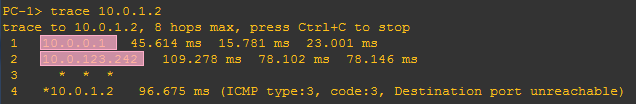
    </ScreenshotCard>

</TaskCard>

### 2.2 配置单域OSPF（Area 0）

现在，我们正式进入本次实验的核心——OSPF协议；我们将首先在一个单一的区域（Area 0）内配置OSPF，并将其与之前的RIP进行深入比较，以体会链路状态协议的有效性

背景知识：OSPF协议基础

开放最短路径优先（Open Shortest Path First, OSPF）是一种**链路状态**（**Link-State**）路由协议，它从根本上改变了路由器认知网络的方式；与RIP听信邻居的机制不同，OSPF让每台路由器都负责探测并描述自身接口的状态、IP地址、以及与哪些邻居相连等拓扑信息，然后将这些信息打包成**链路状态通告**（**Link-State Advertisement, LSA**），并将其在网络中泛洪；最终，网络中的所有路由器都会收到所有其他路由器的LSA，从而在各自的内存中构建出一张完全相同的、上帝视角的网络拓扑图，这张图被称为**链路状态数据库**（**Link-State Database, LSDB**）；有了这张完整的地图后，每台路由器便可以独立运行SPF（最短路径优先）算法，计算出以自己为根（起点）的、到达网络中所有目的地的无环路最短路径树，并将计算出的最优路径加载到自己的路由表中

**Router ID**: 在OSPF网络中，每台路由器都必须有一个唯一的32位标识符，称为Router ID，其格式与IP地址相同；它如同路由器的“身份证号”，用于在整个自治系统中唯一标识一台路由器；Router ID的选举遵循一个明确的优先级顺序：
1.  首先，使用通过 `router-id` 命令手动配置的值，这是最推荐的方式，因为它稳定且可预测
2.  若未手动配置，则选择所有已激活（up/up）的Loopback（环回）接口中，IP地址数值最大的一个；由于Loopback是逻辑接口，永远不会物理宕机，使用其IP作为Router ID非常稳定，是工程实践中的首选
3.  若既未手动配置，也没有可用的Loopback接口，则选择所有已激活的物理接口中，IP地址数值最大的一个；这种方式的缺点在于，一旦该物理接口宕机，Router ID就可能发生改变，导致整个OSPF邻居关系重置，引发网络震荡

**Area与进程ID**: 为了提高可扩展性，OSPF允许将一个大型网络划分成多个区域（Area），所有区域都必须直接连接到一个称为**骨干区域**（**Backbone Area**）的特殊区域，即 **Area 0**；而在`router ospf [process-id]`命令中，**进程ID**仅用于在单台路由器上区分不同的OSPF进程，它只具有本地意义，不同路由器上的进程ID无需相同

<TaskCard number={5} title="配置R1的OSPF协议" needScreenshot={false} needRecord={true}>

背景知识：Network命令/宣告究竟做了什么

一眼看去，我们很可能会误以为 `network` 命令的作用是“告诉邻居我有这个网段”，但实际上在Cisco IOS中，`network` 命令的真正作用是**对相关接口启用OSPF协议**，这更类似一个筛选器，路由器会拿你输入的网络号+通配符掩码去匹配自己身上所有接口的IP地址

一旦某个接口的IP地址落入了 `network` 命令指定的范围内，路由器就会在这个接口上执行两个动作：第一，**激活OSPF协议**，从该接口开始发送和接收Hello包以寻找邻居；第二，**将该接口所属的网段信息提取出来**，封装进LSA（链路状态通告）中，并向其他通过验证的邻居发送；所以，我们所说的“宣告网络”，本质上是在指定哪些接口可以被OSPF考虑，只有参与了进程的接口，其路由信息才会被发布出去，同时该接口也才具备转发OSPF数据的能力

1.  在R1上使用 `router ospf [pid]` 启动OSPF进程，其中进程ID（pid）请设置为你学号的后两位（若为00则向前取值）
2.  使用 `network [网络地址] [通配符掩码] area 0` 命令将R1的所有直连网络宣告进Area 0

:::tip
**通配符掩码（Wildcard Mask）** 与子网掩码的作用相反，其中`0`表示对应位必须精确匹配，`1`表示对应位可以是任意值

例如，对于子网`192.168.1.0/24`，其子网掩码为`255.255.255.0`，而通配符掩码为`0.0.0.255`
:::

<ScreenshotCard 
  questionId="Lab5-p2-s5" 
  title="R1 OSPF配置命令" 
  uploadOptions={[
    { id: 'r1_ospf', label: '记录R1 OSPF配置命令', type: 'text', textConfig: {initialContent: "R1(config)# router ospf [pid]\nR1(config-router)# network [subnet] [wildcard-mask] area 0", codeEditor: true, initialLines: 3} }
  ]}
/>

</TaskCard>

<TaskCard number={6} title="配置R2的回环接口和OSPF协议" needScreenshot={false} needRecord={true}>

 背景知识：回环接口 

回环接口是一种特殊的、完全由软件实现的虚拟网络接口，它不与任何物理硬件（如网卡）相关联，其核心作用是在设备内部创建一个自我通信的闭环通道，当一个应用程序向回环地址发送数据时，这些数据并不会被发送到外部网络，而是在操作系统的TCP/IP协议栈内部被“回环”，直接传递给同一设备上的目标应用程序

这种机制的稳定性源于其纯软件的本质，物理网络接口的可用性受制于多种外部因素，例如网线连接是否松动、端口是否损坏或网络设备是否故障，任何一个环节出现问题都可能导致接口失效，而回环接口独立于所有这些物理依赖，只要操作系统的网络协议栈正常加载并运行，它就始终处于活动状态，这种“永不掉线”的特性使其成为一个极其可靠的端点

正因为其高度的可靠性，回环接口在网络实践中扮演着多个关键角色，在网络应用开发和测试阶段，开发者可以利用回环接口在单台机器上同时部署和调试客户端与服务器端程序，而无需搭建复杂的物理测试环境，在网络故障排查时， `ping 127.0.0.1` 是一个基础且有效的诊断步骤，成功响应即表明本地的TCP/IP配置是正确的，此外，在复杂的动态路由协议（如OSPF或BGP）中，通常会将路由器的ID设置为其回环接口的IP地址，因为物理接口的地址可能会改变或接口会宕机，而使用稳定的回环地址作为身份标识，可以防止因物理链路的瞬时中断而引发整个网络路由的非必要动荡和重新计算，从而显著提升网络的整体稳定性

为了给R2提供一个稳定可靠的Router ID，我们将为其配置一个Loopback接口
1.  创建Loopback 0接口并配置IP地址：`interface loopback 0`，`ip address [IP地址] [子网掩码]`
2.  启动R2的OSPF进程，并将包括Loopback接口在内的所有接口宣告进Area 0

<ScreenshotCard 
  questionId="Lab5-p2-s6" 
  title="R2回环接口及OSPF配置命令" 
  uploadOptions={[
    { id: 'r2_ospf', label: '记录R2配置命令', type: 'text', textConfig: {initialContent: "R2(config)# interface loopback 0\nR2(config-if)# ip address [ip] 255.255.255.252\nR2(config-if)# exit\nR2(config)# router ospf [pid]\nR2(config-router)# network [subnet] [mask] area 0", codeEditor: true, initialLines: 6} }
  ]}
/>

</TaskCard>

<TaskCard number={7} title="配置R3的OSPF协议并指定Router ID" needScreenshot={false} needRecord={true}>
与R2不同的是，我们为R3手动指定Router ID，这是ID选择方式中最高权重的一种

1.  启动R3的OSPF进程
2.  使用 `router-id [x.x.x.x]` 命令手动为R3指定一个Router ID
3.  将R3的所有接口宣告进Area 0

<ScreenshotCard 
  questionId="Lab5-p2-s7" 
  title="R3 OSPF配置命令" 
  uploadOptions={[
    { id: 'r3_ospf', label: '记录R3配置命令', type: 'text', textConfig: {initialContent: "R3(config)# router ospf [pid]\nR3(config-router)# router-id [x.x.x.x]\nR3(config-router)# network 10.0.0.0 [mask] area 0", codeEditor: true, initialLines: 4} }
  ]}
/>

</TaskCard>

<TaskCard number={8} title="查看OSPF数据库并分析Router ID" needScreenshot={true} needRecord={false}>

背景知识：链路与链路状态数据库

在OSPF协议中，**链路**（**Link**）这个词不仅仅指物理上的网线，它指的是路由器上的一个**接口**及其相关的**状态信息**；具体来说，一个链路状态包含的信息有：这个接口的IP地址和掩码是多少、接口的带宽（决定了Cost）是多少、接口连接了哪些邻居路由器、接口现在的物理状态是Up还是Down

路由器将这些零散的信息打包成一个数据包，这就是**LSA（链路状态通告）**；你可以把LSA想象成路由器发出的自我介绍，里面详细描述了自己周围的情况；OSPF协议的核心任务，就是确保网络中每一台路由器都能收到所有其他路由器发出的介绍，当一台路由器收集齐了全网所有人的LSA后，它就拥有了**LSDB**（**链路状态数据库**）；LSDB本质上就是一张精细的网络全拓扑地图，有了这张图，路由器就可以在一定程度上开启上帝视角，清晰地计算出从自己出发到达任何地点的最优路径

现在，我们来深入OSPF的核心，查看每台路由器构建出的网络“路书”——链路状态数据库（LSDB），并验证我们的Router ID配置，结合之前的配置分析每个Router ID是如何被选举出来的（手动指定、最大Loopback IP或最大物理接口IP）

1.  在R1上分别使用 `show ip ospf database` 命令查看它们的LSDB，标出路由器的Router ID，从输出可知：
    * R1的Router ID为<ModernInput size="large" questionId="Lab5-p2-q8-1"/>（取自接口<ModernInput size="medium" questionId="Lab5-p2-q8-2"/>的IP）
    * 与R1连接的有<ModernInput size="small" questionId="Lab5-p2-q8-3"/>个路由器，其ID分别是<ModernInput size="large" questionId="Lab5-p2-q8-4"/>、<ModernInput size="large" questionId="Lab5-p2-q8-5"/>
    * 有<ModernInput size="small" questionId="Lab5-p2-q8-6"/>条链路，其ID分别是<ModernInput size="large" questionId="Lab5-p2-q8-7"/>、<ModernInput size="large" questionId="Lab5-p2-q8-8"/>

    <ScreenshotCard 
      questionId="Lab5-p2-s8" 
      title="R1 OSPF数据库示例" 
      uploadOptions={[
        { id: 'r1_ospf_db', label: '截图R1 OSPF数据库' }
      ]}
    >
      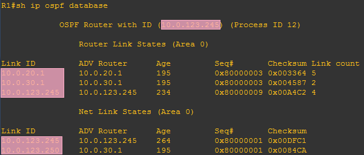
    </ScreenshotCard>
2.  在R2上分别使用 `show ip ospf database` 命令查看它们的LSDB，标出路由器的Router ID，从输出可知：
    * R2的Router ID为<ModernInput size="large" questionId="Lab5-p2-q8-9"/>（取自接口<ModernInput size="medium" questionId="Lab5-p2-q8-10"/> 的IP）
    * 与R2连接的有<ModernInput size="small" questionId="Lab5-p2-q8-11"/>个路由器，其ID分别是<ModernInput size="large" questionId="Lab5-p2-q8-12"/>、<ModernInput size="large" questionId="Lab5-p2-q8-13"/>
    * 有<ModernInput size="small" questionId="Lab5-p2-q8-14"/>条链路，其ID分别是<ModernInput size="large" questionId="Lab5-p2-q8-15"/>、<ModernInput size="large" questionId="Lab5-p2-q8-16"/>

    <ScreenshotCard 
      questionId="Lab5-p2-s8" 
      title="R2 OSPF数据库示例" 
      uploadOptions={[
        { id: 'r2_ospf_db', label: '截图R2 OSPF数据库' }
      ]}
    >
      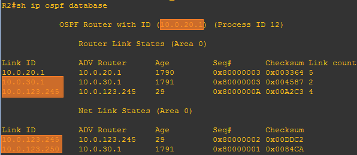
    </ScreenshotCard>

3.  在R3上分别使用 `show ip ospf database` 命令查看它们的LSDB，标出路由器的Router ID，从输出可知：
    * R3的Router ID为<ModernInput size="large" questionId="Lab5-p2-q8-17"/>（手动指定）
    * 与R3连接的有<ModernInput size="small" questionId="Lab5-p2-q8-18"/>个路由器，其ID分别是<ModernInput size="large" questionId="Lab5-p2-q8-19"/>、<ModernInput size="large" questionId="Lab5-p2-q8-20"/>
    * 有<ModernInput size="small" questionId="Lab5-p2-q8-21"/>条链路，其ID分别是<ModernInput size="large" questionId="Lab5-p2-q8-22"/>、<ModernInput size="large" questionId="Lab5-p2-q8-23"/>

    <ScreenshotCard 
      questionId="Lab5-p2-s8" 
      title="R3 OSPF数据库示例" 
      uploadOptions={[
        { id: 'r3_ospf_db', label: '截图R3 OSPF数据库' }
      ]}
    >
      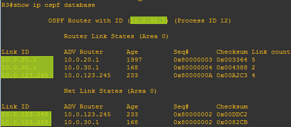
    </ScreenshotCard>

</TaskCard>

<TaskCard number={9} title="显示R1的OSPF接口数据" needScreenshot={true} needRecord={false}>

背景知识：DR与BDR的选举

在以太网这类**多路访问网络**（**Multi-Access Network**）中，如果每台路由器都与其他所有路由器建立邻接关系，那么邻接关系的数量将以 `n×(n-1)/2` 的规模爆炸式增长，这会导致网络中充斥着大量重复的LSA泛洪和确认信息，造成严重的性能问题；为了解决这个“邻居数量爆炸”的挑战，OSPF引入了**指定路由器**（**Designated Router, DR**）和**备份指定路由器**（**Backup Designated Router, BDR**）的选举机制

这个机制的核心思想是，在该网段中选举出一位“班长”（DR）和一位“副班长”（BDR）；网段内所有其他路由器（称为DROther）都只与DR和BDR建立完全的邻接关系，并只将自己的LSA“汇报”给DR；然后，由DR这位“班长”统一负责，将收集到的LSA信息泛洪给网段内的所有其他路由器；BDR则时刻监听，一旦DR发生故障，它会立即接管DR的工作；这种的设计极大地减少了OSPF协议流量，将一个网状的邻接关系优化为了一个星型的邻接关系，显著提高了网络的可扩展性；DR和BDR的选举主要基于接口的OSPF优先级（0-255，默认为1，数值越大越优），若优先级相同，则比较Router ID（越大越优）

背景知识：OSPF Metric（Cost）计算方法

在RIP中，无论带宽多少，经过一个路由器就计为1跳；而在OSPF中，路径的度量值（Metric）被称为 **Cost（开销）**，它与接口的带宽成反比，Cisco路由器默认使用以下公式计算接口的Cost值：

Cost = Reference Bandwidth / Interface Bandwidth

默认的参考带宽为100 Mbps，因此意味着带宽越高，Cost越低，路径越优，Cisco设备上常见接口的Cost值如下：

- **10 Mbps Ethernet**: 100,000,000 / 10,000,000 = 10
- **100 Mbps FastEthernet**: 100,000,000 / 100,000,000 = 1
- **Serial (1.544 Mbps)**: 100,000,000 / 1,544,000 ≈ 64
- **Loopback**: 视为逻辑接口，Cost默认为 1

需要注意的是，由于默认参考带宽是比较小的100Mbps，而OSPF的Cost不支持小数，向下取整但最小为1，此时100Mbps、1Gbps和10Gbps接口的Cost计算结果都会取整为1，在现代千兆网络环境中，通常需要手动调整参考带宽（`auto-cost reference-bandwidth`）来更好地区分高速链路，但在本次实验的基础环境中，我们仍沿用默认值；GNS3中的Cisco路由器使用的参考带宽和这里略有不同，因此你看到的Cost可能和这里存在差异，你可以放心忽略，无需另行调整

1.  在R1上使用 `show ip ospf interface` 命令，查看各个接口上详细的OSPF运行参数，标记各接口的cost值，网络类型，邻接关系及其Router ID，广播类型的网络再标出DR（Designed Router）或者BDR（Backup Designed Router）角色
2.  对S2/0接口的运行参数分析：连接的网络类型为<ModernInput size="medium" questionId="Lab5-p2-q9-1"/>，Cost=<ModernInput size="small" questionId="Lab5-p2-q9-2"/>，邻居Router ID=<ModernInput size="large" questionId="Lab5-p2-q9-3"/>
    <ScreenshotCard 
      questionId="Lab5-p2-s9" 
      title="R1 s2/0接口OSPF数据示例" 
      uploadOptions={[
        { id: 'r1_s20', label: '截图R1 s2/0接口OSPF数据' }
      ]}
    >
      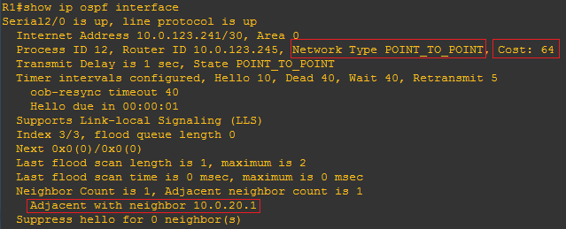
    </ScreenshotCard>
3.  对F0/1接口的运行参数分析：
    * F0/1连接的网络类型为<ModernInput size="medium" questionId="Lab5-p2-q9-4"/>，Cost=<ModernInput size="small" questionId="Lab5-p2-q9-5"/>，邻居Router ID=<ModernInput size="large" questionId="Lab5-p2-q9-6"/>
    * DR的Router ID是<ModernInput size="large" questionId="Lab5-p2-q9-7"/>，接口IP是<ModernInput size="large" questionId="Lab5-p2-q9-8"/>
    * BDR的Router ID是<ModernInput size="large" questionId="Lab5-p2-q9-9"/>，接口IP是<ModernInput size="large" questionId="Lab5-p2-q9-10"/>
  
    <ScreenshotCard 
      questionId="Lab5-p2-s9" 
      title="R1 f0/1接口OSPF数据示例" 
      uploadOptions={[
        { id: 'r1_f01', label: '截图R1 f0/1接口OSPF数据' }
      ]}
    >
      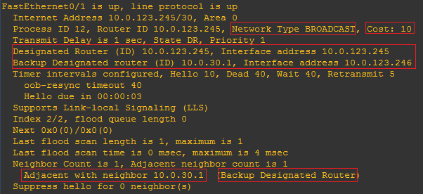
    </ScreenshotCard>
4.  对F0/0接口的运行参数分析：
    * F0/0连接的网络类型为<ModernInput size="medium" questionId="Lab5-p2-q9-11"/>，Cost=<ModernInput size="small" questionId="Lab5-p2-q9-12"/>
    * DR的Router ID是<ModernInput size="large" questionId="Lab5-p2-q9-13"/>，接口IP是<ModernInput size="large" questionId="Lab5-p2-q9-14"/>
    
    <ScreenshotCard 
      questionId="Lab5-p2-s9" 
      title="R1 f0/0接口OSPF数据示例" 
      uploadOptions={[
        { id: 'r1_f00', label: '截图R1 f0/0接口OSPF数据' }
      ]}
    >
      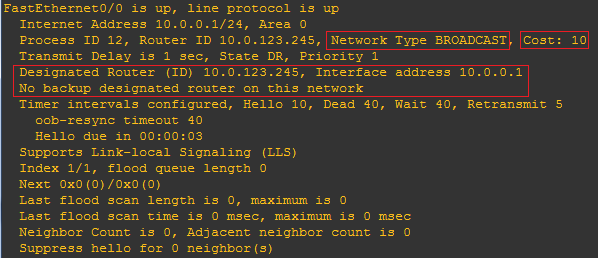
    </ScreenshotCard>

</TaskCard>

<TaskCard number={10} title="查看OSPF路由表并与RIP比较" needScreenshot={true} needRecord={false}>

背景知识：管理距离

当一台路由器通过多种不同的路由协议（例如，同时运行RIP和OSPF）学习到去往同一个目标网络的多条路径时，它必须做出选择，决定将哪一条路径放入最终的路由表中；这个决策的依据就是**管理距离**（**Administrative Distance, AD**）

AD是一个0到255之间的整数，它并不衡量路径的优劣（如带宽或跳数），而是代表路由来源的**可信度**；数值越小，表示来源越可靠，路由器就越倾向于相信它；Cisco设备为每种路由来源都分配了一个默认的AD值，这形成了一个内置的信任链：
*   直连网络：0 (最可信，因为是自己的接口)
*   静态路由：1 (由管理员手动配置，高度可信，当然其AD也可以像Lab4那样手动调整)
*   **OSPF**：110
*   **RIP**：120

在这个信任链中，OSPF（110）的可靠性高于RIP（120）；因此，当RIP和OSPF同时为同一个目标网络提供路由时，路由器会毫不犹豫地选择OSPF的路径，并将其安装到路由表中

查看R1、R2、R3的路由表，找到由OSPF学习到的路由（以`O`标记），观察与RIP比较OSPF所选择的路由的差异有何不同、两者的优先级有何差异

1.  再次使用 `show ip route` 查看R1的路由表；由输出可知，对PC2所在网络，OSPF选择的下一跳IP地址是<ModernInput size="large" questionId="Lab5-p2-q10-1"/>，由于OSPF的路由管理距离为110，比RIP的管理距离120优先级更高，所以把之前RIP选择的路由替换了
    <ScreenshotCard 
      questionId="Lab5-p2-s10" 
      title="R1路由表示例" 
      uploadOptions={[
        { id: 'r1_route_ospf', label: '截图R1路由表' }
      ]}
    >
        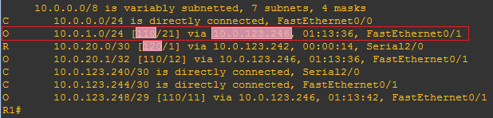
    </ScreenshotCard>
2.  再次使用 `show ip route` 查看R2的路由表；从输出可知，对PC1所在网络，OSPF选择的下一跳IP地址是<ModernInput size="large" questionId="Lab5-p2-q10-2"/>
    <ScreenshotCard 
      questionId="Lab5-p2-s10" 
      title="R2路由表示例" 
      uploadOptions={[
        { id: 'r2_route_ospf', label: '截图R2路由表' }
      ]}
    >
        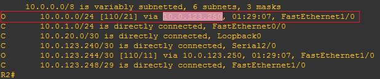
    </ScreenshotCard>
3.  再次使用 `show ip route` 查看R3的路由表
    <ScreenshotCard 
      questionId="Lab5-p2-s10" 
      title="R3路由表示例" 
      uploadOptions={[
        { id: 'r3_route_ospf', label: '截图R3路由表' }
      ]}
    >
        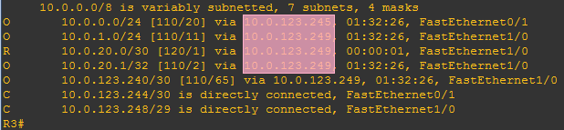
    </ScreenshotCard>
4.  在PC1上再次使用 `tracert` 跟踪到PC2的路径，观察到此时经过的路由器顺序是R1、<ModernInput size="small" questionId="Lab5-p2-q10-3"/>、<ModernInput size="small" questionId="Lab5-p2-q10-4"/>
    <ScreenshotCard 
      questionId="Lab5-p2-s10" 
      title="路由跟踪结果" 
      uploadOptions={[
        { id: 'pc1_to_pc2_ospf', label: '截图PC1→PC2路由跟踪' }
      ]}
    >
        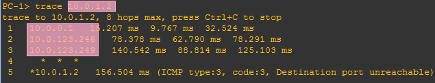
    </ScreenshotCard>

</TaskCard>

<TaskCard number={11} title="测试链路中断后的路由表变化" needScreenshot={true} needRecord={false}>
链路状态协议的一大核心优势就是能够对网络拓扑变化做出快速响应，即快速收敛；现在我们来模拟一次链路故障，观察OSPF的自愈能力

1.  在R1或R3上，进入连接两台路由器的接口的配置模式，使用 `shutdown` 命令关闭该接口
2.  稍等片刻，待OSPF检测到链路中断并完成重新计算后，再次使用 `show ip route` 查看R1的路由表
3.  观察并标记到达PC2所在子网的路由是否发生了变化，新的下一跳指向了哪里

<ScreenshotCard 
  questionId="Lab5-p2-s11" 
  title="R1路由表示例" 
  uploadOptions={[
    { id: 'r1_route_after_shutdown', label: '截图R1路由表' }
  ]}
>
    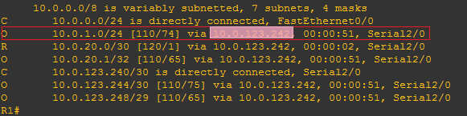
</ScreenshotCard>

</TaskCard>

<TaskCard number={12} title="观察重启后Router ID的变化" needScreenshot={true} needRecord={false}>
为什么在配置OSPF时，我们一般选择Loopback接口作为ID来源呢？接下来我们将观察路由器重启的变化，感受Router ID稳定性的重要性

1.  在R1上使用 `write` 命令保存当前配置，然后右键该路由器- `reload` 重启路由器
2.  待R1重启完成后，再次使用 `show ip ospf database` 查看其OSPF数据库，可以看到R1的Router ID变成了<ModernInput size="large" questionId="Lab5-p2-q12-1"/>，取自接口<ModernInput size="small" questionId="Lab5-p2-q12-2"/>的IP地址

    <ScreenshotCard 
      questionId="Lab5-p2-s12" 
      title="R1 OSPF数据库示例" 
      uploadOptions={[
        { id: 'r1_db_after_reload', label: '截图R1 OSPF数据库' }
      ]}
    >
        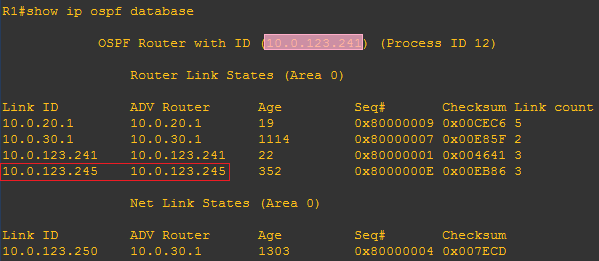
    </ScreenshotCard>
由于在上一步中，我们关闭了R1原先作为Router ID来源的物理接口f0/1，其上的IP地址也暂时不可用，OSPF在重启后会重新选举一个当前可用的、IP地址最大的物理接口作为新的Router ID，而原来的Router ID也未消失，看上去是来自另一台不存在的路由器；而回环接口不会断开，OSPF优先选择后就不会遇到这种情况

</TaskCard>

<TaskCard number={13} title="观察OSPF邻接关系建立过程" needScreenshot={true} needRecord={true}>

背景知识：OSPF邻居状态机

两台OSPF路由器从相互发现到最终建立完全的邻接关系（Adjacency），需要经历一个严谨而有序的过程，这个过程由**邻居状态机**（Neighbor State Machine）定义；它确保了只有在双方都满足特定条件，并且完成LSDB同步后，才能成为真正的“战友”；主要状态包括：
*   **Down**: 初始状态，尚未收到来自邻居的任何Hello包
*   **Init**: 收到了邻居的Hello包，但包中没有包含自己的Router ID；这就像你跟邻居打了个招呼，但他还没回应你，表明通信是单向的
*   **2-Way**: 双向通信已建立；双方都在对方的Hello包中看到了自己的Router ID，确认了彼此的存在；在广播网络中，此状态下会开始选举DR和BDR；对于DROther类型的路由器，邻居关系将停留在此状态
*   **ExStart**: 这是建立完全邻接关系的第一步；双方开始协商主从关系（基于Router ID大小），并确定初始的数据库描述（DBD）序列号，为后续的LSDB同步做准备
*   **Exchange**: 相互交换DBD（Database Description）包；DBD包并不包含完整的LSA，而是LSA的摘要信息（像一个目录），用于高效地告知对方自己拥有哪些“地图”
*   **Loading**: 对比收到的“目录”（DBD）和自己的LSDB，路由器会发现自己缺失或版本过旧的“地图”；它会通过发送LSR（链路状态请求）向邻居请求这些特定的LSA，邻居则用LSU（链路状态更新）来回应，LSU中包含了完整的LSA信息
*   **Full**: LSDB完全同步，两台路由器的“地图”达成一致；至此，完全邻接关系正式建立，它们可以相互计算路由并转发数据了

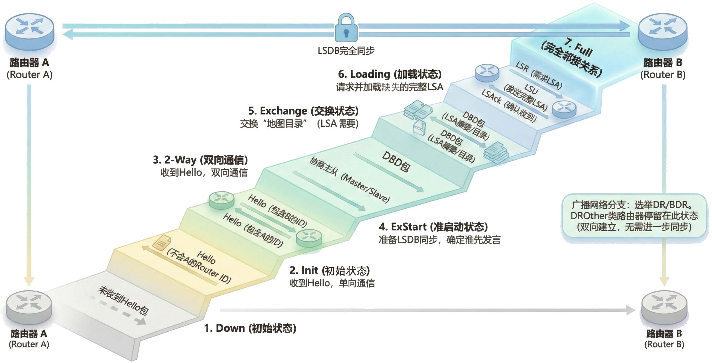

1.  在R1上开启OSPF事件调试：`debug ip ospf events`以实时显示OSPF协议的交互过程
2.  重新激活之前被关闭的R1-R3链路接口（在R1或R3上重新`no shutdown`该接口）
    :::tip 提示
    OSPF协议中，当路由器收到来自邻居的hello数据包时，它必须在自己的hello数据包中列出发送方路由器ID，以向该邻居进行确认

    Init状态表示路由器已收到来自其邻居的hello数据包，但接收路由器ID未包含在hello数据包中，因此，要想看到Init状态，需要R3在未收到R1 hello数据包时发送自己的hello数据包（此时不含R1路由器ID），并被R1接收

    你可以在R1发送了一个hello数据包时立刻打开R3对应的接口，此时R3发送的首个hello数据包应该就满足这一条件，这需要你卡到合适的Timing，可能需要多次尝试
    ::: 
3.  观察R1终端输出的调试信息，记录下R1与R3重新建立邻接关系时经历的<ModernInput size="medium" questionId="Lab5-p2-q13-1"/>、<ModernInput size="medium" questionId="Lab5-p2-q13-2"/>、<ModernInput size="medium" questionId="Lab5-p2-q13-3"/>、<ModernInput size="medium" questionId="Lab5-p2-q13-4"/>、<ModernInput size="medium" questionId="Lab5-p2-q13-5"/>5个状态变化
    <ScreenshotCard 
      questionId="Lab5-p2-s13" 
      title="邻接关系建立事件记录示例" 
      uploadOptions={[
        { id: 'ospf_events', label: '截图R1和R3重新建立邻接关系的OSPF事件记录' }
      ]}
    >
        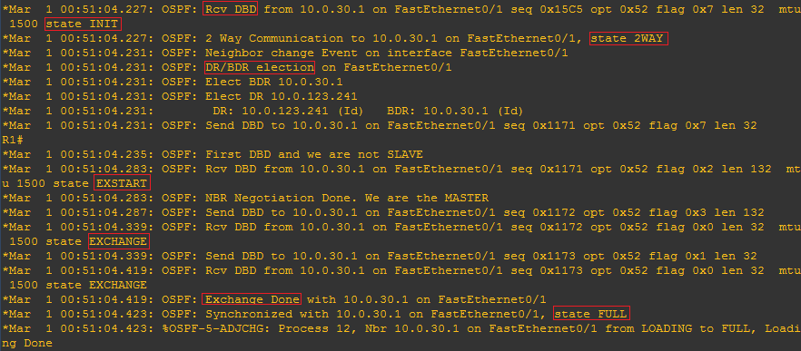
    </ScreenshotCard>
4.  待邻居关系达到 `Full` 状态后关闭调试（命令：`no debug ip ospf events`）
5.  在R1上使用 `show ip ospf neighbor detail` 命令，查看邻居关系的最终状态
    <ScreenshotCard 
      questionId="Lab5-p2-s13" 
      title="R1邻居信息示例" 
      uploadOptions={[
        { id: 'r1_neighbor', label: '截图R1 OSPF邻居详细信息' }
      ]}
    >
        
    </ScreenshotCard>
6.  为R4和R6配置IP地址和OSPF（均属于Area 0），并观察它们在广播网络中的邻居关系；你会发现，由于DR/BDR机制，非DR/BDR的路由器之间只会建立到`2-Way`的邻居关系，而不会形成完全的`Full`邻接关系

</TaskCard>

<TaskCard number={14} title="配置R4和R6的OSPF协议" needScreenshot={true} needRecord={true}>

 背景知识：邻居关系和邻接关系

在OSPF协议中，“邻居”（Neighbor）和“邻接”（Adjacency）是两个明确不同的概念，它们描述了路由器之间关系的两个不同阶段和深度

* **邻居关系**是基础，当两台在同一网段的OSPF路由器启动后，它们会开始通过`224.0.0.5`这个特定的组播地址周期性地发送Hello报文，如果一台路由器收到了来自另一台路由器的Hello报文，并且在自己发出的Hello报文的邻居列表中也看到了对方的Router ID，就意味着双向通信已经建立，此时，这两台路由器就形成了**邻居关系**，状态达到**2-Way**，这个阶段仅仅意味着“我们互相看见了对方，并且确认了基本的通信参数是一致的”，但它们并不会交换详细的路由信息，也就是链路状态数据库（LSDB）
* **邻接关系**是在邻居关系之上建立的更高级、更深入的关系，只有形成了邻接关系的路由器之间，才会进行完整的链路状态数据库的交换和同步，这个过程涉及到交换数据库描述报文（DBD），以及在必要时使用链路状态请求（LSR）、链路状态更新（LSU）和链路状态确认（LSAck）报文来请求和发送缺失的LSA（链路状态通告），最终达到双方LSDB完全一致的**Full**状态，可以说，邻居只是“认识”，而邻接则是“信任并交换情报的伙伴”

那么，是不是所有的邻居都会发展成邻接关系呢，并非如此，这取决于它们所在的**网络类型**

1.  在**点对点**（**Point-to-Point**）或**点对多点**（**Point-to-Multipoint**）网络中，由于链路结构简单，任何成功建立邻居关系的路由器都会直接继续发展，形成邻接关系
2.  在**广播多路访问**（**Broadcast Multi-Access**）网络（如以太网）中，情况就变得复杂，如果一个广播域内有N台路由器，而它们之间两两都建立邻接关系，就会形成 `N×(N-1)/2` 个邻接关系，这意味着任何一台路由器的状态变化都会引发大量的LSA泛滥，每台路由器都需要处理来自其他所有路由器的更新，造成巨大的冗余和资源浪费

为了优化这个过程，OSPF在这种网络类型中引入了**指定路由器**（**DR**）和**备份指定路由器**（**BDR**）的角色，选举产生DR和BDR后：
*   所有非DR/BDR的路由器（称为**DROther**）**只会**与DR和BDR建立**邻接关系**（达到Full状态）
*   DROther之间虽然互为邻居，但关系会停留在**2-Way**状态，**不会**形成邻接关系
*   这样，路由信息的交换就有了统一的集散点，所有DROther只将自己的LSA发送给DR（和BDR），再由DR统一向网段内的所有路由器泛洪，这极大地减少了广播网络中邻接关系的数量，从 `N×(N-1)/2` 个减少到 `2N-3` 个，显著降低了协议开销

总结来说，邻居关系是建立邻接关系的前提，但只有在需要交换路由信息时，邻居关系才会升级为邻接关系，在广播网络中，通过选举DR/BDR来有选择性地建立邻接关系，是OSPF协议高效运行的关键设计之一

1.  为R4、R6的回环接口与f0/0接口配置IP地址并激活
2.  启用OSPF进程并将相应接口在Area 0宣告
    <ScreenshotCard 
    questionId="Lab5-p2-s14" 
    title="记录R4与R6的OSPF配置命令" 
    uploadOptions={[
        { id: 'r4_config', label: '记录R4配置命令', type: 'text', textConfig: {codeEditor: true, initialLines: 7} },
        { id: 'r6_config', label: '记录R6配置命令', type: 'text', textConfig: {codeEditor: true, initialLines: 7} }
    ]}
    />
3.  查看R4的OSPF邻居关系，由于处在广播网络中，R4与R6虽然是邻居关系（`2-WAY`），但不建立邻接关系
    <ScreenshotCard 
    questionId="Lab5-p2-s14" 
    title="截图R4的邻居关系" 
    uploadOptions={[
        { id: 'r4_neighbor', label: '截图R4邻居关系' }
    ]}
    >
        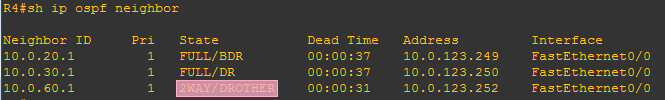
    </ScreenshotCard>
4.  查看R6的OSPF邻居关系，由于处在广播网络中，R4与R6虽然是邻居关系（`2-WAY`），但不建立邻接关系
    <ScreenshotCard 
    questionId="Lab5-p2-s14" 
    title="R6邻居关系示例" 
    uploadOptions={[
        { id: 'r6_neighbor', label: '截图R6邻居关系' }
    ]}
    >
        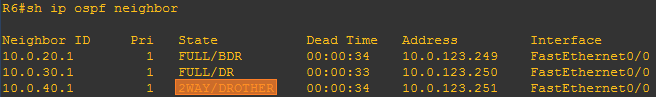
    </ScreenshotCard>

</TaskCard>

### 2.3 配置多域OSPF

随着网络规模的扩大，将所有路由器都放在一个单一的OSPF区域中会带来性能瓶颈；为了解决这个问题，OSPF引入了多区域（Multi-Area）的概念，这使得OSPF能够支持极其庞大的网络

背景知识：多域OSPF与LSA类型

将OSPF网络划分为多个区域，其核心动机是为了提升网络的**可扩展性**和**稳定性**；想象一个巨大的网络，任何一条链路的微小抖动都会导致LSA在全网泛洪，迫使每一台路由器都重新运行耗费CPU资源的SPF算法；通过划分区域，可以将这种拓扑变化的影响限制在区域内部；区域内的路由器只需维护本区域详细的拓扑信息，而对于其他区域，它们只需要知道如何到达那里即可，无需关心其内部的复杂细节；这大大减少了LSDB的规模和SPF的计算频率，使得网络更加稳定和高效

**区域边界路由器**（**Area Border Router, ABR**）是多域OSPF架构的关键角色；它像一个“边境海关”，同时连接着骨干区域（Area 0）和一个或多个非骨干区域；ABR负责维护其所连接的每个区域的LSDB，并将一个区域的路由信息以**摘要**（**Summary**）的形式，生成新的LSA，通告给另一个区域

为了实现这种信息的分级管理，OSPF定义了多种LSA类型，其中最核心的有：
*   **Type 1 (Router LSA)**: 由区域内的**所有路由器**产生，用于描述自身的链路状态和开销；它就像每个路由器的“自我介绍”，只在**区域内部**泛洪
*   **Type 2 (Network LSA)**: 由广播网络或NBMA网络中的**DR**产生，用于描述该网段上有哪些路由器；它就像DR发布的“网段成员名单”，也只在**区域内部**泛洪
*   **Type 3 (Summary LSA)**: 由**ABR**产生，用于将一个区域的路由信息（以网络前缀的形式）通告给其他区域；它就像ABR发布的“跨区域路标”，在整个OSPF域中泛洪（除特定类型的末梢区域外），告知其他区域的路由器“要到某个网段，请来找我”

在多区域设计中，并非所有区域都需要维护全网明细路由，如果一个非骨干区域只有一个出口（即只有一个ABR连接到骨干区域），或者该区域内的路由器性能较弱，我们可以将其配置为 Stub Area（末梢区域）；Stub区域不允许外部路由（Type 5 LSA）进入，部分变种甚至不允许区域间汇总路由（Type 3 LSA）进入；此时ABR会自动向Stub区域内下发一条默认路由（Default Route），替代繁杂的外部明细路由；这极大地缩小了区域内路由器的LSDB规模，节省了内存和CPU资源

需要注意的是，Stub区域不能包含虚链路（Virtual Link），也不能包含ASBR

<TaskCard number={15} title="配置Area 1并测试区域间路由" needScreenshot={true} needRecord={true}>

背景知识：为什么要划分区域？

你可能会想，既然Area之间也需要和Area内一样通信，那么为什么还要划分区域呢？原因是如果将全球所有的路由器都放在同一个OSPF区域内，每一台路由器都需要维护一张包含全球所有链路细节的庞大地图（LSDB），这会带来灾难性的后果：首先，LSDB会占用巨大的内存空间；其次，运行SPF算法计算路由会消耗极高的CPU资源；最致命的是，网络边缘任何一条链路的震荡（频繁Up/Down）都会导致LSA全网泛洪，迫使全网所有路由器重新计算路由，导致整个网络长期处于不稳定状态

为了解决由于规模带来的性能和稳定性问题，OSPF引入了**区域（Area）**的概念进行层次化设计；我们将网络划分为一个个小的独立区域，区域内部依然维护详细的拓扑地图，但区域之间只交换简要的路由信息（就像只告诉你去北京的方向，而不告诉你北京内部胡同怎么走）；这样，某个区域内部的拓扑变化（如接口断开）只会触发本区域内的路由器重新计算SPF，而不会波及到整个网络，有效地将故障隔离在局部，极大地提高了大型网络的可扩展性和稳定性

1.  为R4和R5的相关接口配置IP地址并激活
2.  在R4和R5上启动OSPF进程，并根据拓扑图将R4和R5连接到Area 1的接口宣告进 **Area 1**（命令: `network [subnet] [wildcard-mask] area 1`）；此时R4成为了连接Area 0和Area 1的ABR
    <ScreenshotCard 
      questionId="Lab5-p3-s15" 
      title="R4和R5配置命令" 
      uploadOptions={[
        { id: 'r4_area1', label: '记录R4配置命令', type: 'text', textConfig: {initialContent: "R4(config)# interface f0/1\nR4(config-if)# ip address [ip] 255.255.255.0\nR4(config-if)# no shutdown\nR4(config)# router ospf [pid]\nR4(config-router)# network [subnet] 0.0.255.255 area 1", codeEditor: true, initialLines: 6} },
        { id: 'r5_area1', label: '记录R5配置命令', type: 'text', textConfig: {initialContent: "R5(config)# interface f0/1\nR5(config-if)# \nR5(config-if)# \nR5(config)# interface f0/0\nR5(config-if)# \nR5(config-if)# \nR5(config)# interface loopback 0\nR5(config-if)# \nR5(config)# \nR5(config-router)# ", codeEditor: true, initialLines: 10} }
      ]}
    />
3.  为PC3配置IP地址和相应的默认网关
    <ScreenshotCard 
      questionId="Lab5-p3-s15" 
      title="PC3网络配置示例" 
      uploadOptions={[
        { id: 'pc3_config', label: '记录PC3配置', type: 'text', textConfig: {codeEditor: true, initialLines: 1} }
      ]}
    >
        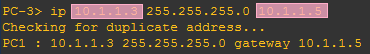
    </ScreenshotCard>
4.  等待OSPF收敛后，使用 `show ip route` 在R2（Area 0内部路由器）上查看路由表，并标记出来自其他区域的**区域间路由**（**Inter-Area Route**）条目（`O IA`）；由路由表可知，目标为Area 1中的子网的下一跳IP地址均为<ModernInput size="large" questionId="Lab5-p3-q15-1"/>，从<ModernInput size="medium" questionId="Lab5-p3-q15-2"/>接口发出
    <ScreenshotCard 
      questionId="Lab5-p3-s15" 
      title="R2路由表示例" 
      uploadOptions={[
        { id: 'r2_route_ia', label: '截图R2路由表' }
      ]}
    >
        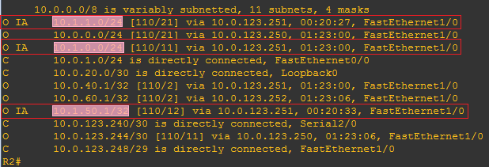
    </ScreenshotCard>
5.  等待OSPF收敛后，使用 `show ip route` 在R5（Area 1内部路由器）上查看路由表，并标记出来自其他区域的**区域间路由**（**Inter-Area Route**）条目（`O IA`）；由路由表可知，目标为Area 0中的子网的下一跳IP地址均为<ModernInput size="large" questionId="Lab5-p3-q15-3"/>，从<ModernInput size="medium" questionId="Lab5-p3-q15-4"/>接口发出
    <ScreenshotCard 
      questionId="Lab5-p3-s15" 
      title="R5路由表示例" 
      uploadOptions={[
        { id: 'r5_route_ia', label: '截图R5路由表' }
      ]}
    >
        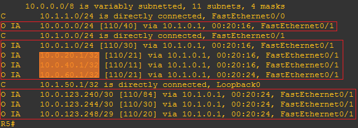
    </ScreenshotCard>
6.  在PC3上 `ping` PC1，测试跨区域的连通性
    <ScreenshotCard 
      questionId="Lab5-p3-s15" 
      title="PC3→1连通性测试示例" 
      uploadOptions={[
        { id: 'pc3_to_pc1', label: '截图PC3→1测试结果' }
      ]}
    >
        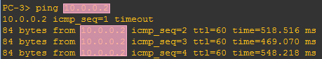
    </ScreenshotCard>

</TaskCard>

<TaskCard number={16} title="查看多域OSPF数据库信息" needScreenshot={true} needRecord={false}>
通过对比不同位置路由器的LSDB，我们可以清晰地看到区域划分带来的信息隔离和摘要效果

1.  在R2（Area 0内部）上使用 `show ip ospf database` 命令查看LSDB；由输出可观察到R2没有Area 1的具体信息，但是该区域的子网地址<ModernInput size="large" questionId="Lab5-p3-q16-1"/>、<ModernInput size="large" questionId="Lab5-p3-q16-2"/>、<ModernInput size="large" questionId="Lab5-p3-q16-3"/>由路由器<ModernInput size="large" questionId="Lab5-p3-q16-4"/>汇聚后以区域间链路的形式进行通告
    <ScreenshotCard 
      questionId="Lab5-p3-s16" 
      title="R2 OSPF数据库示例" 
      uploadOptions={[
        { id: 'r2_ospf_db', label: '截图R2 OSPF数据库' }
      ]}
    >
        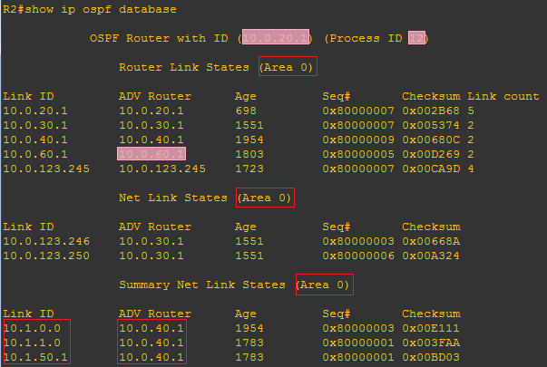
    </ScreenshotCard>
2.  在R5（Area 1内部）上使用 `show ip ospf database` 命令查看LSDB；由输出可观察到R5没有Area 0的具体信息，但是该区域的子网地址全部由路由器<ModernInput size="large" questionId="Lab5-p3-q16-5"/>汇聚后以区域间链路的形式进行通告
    <ScreenshotCard 
      questionId="Lab5-p3-s16" 
      title="R5 OSPF数据库示例" 
      uploadOptions={[
        { id: 'r5_ospf_db', label: '截图R5 OSPF数据库' }
      ]}
    >
        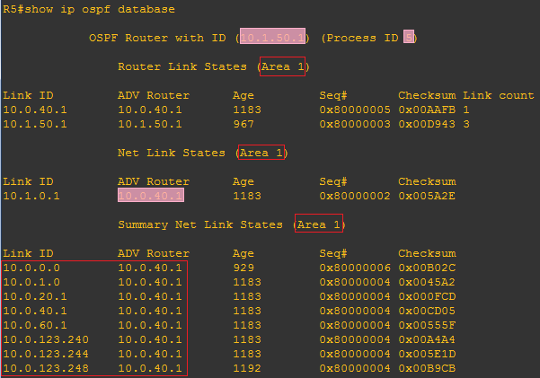
    </ScreenshotCard>
3.  在R4（ABR）上使用 `show ip ospf database` 命令查看LSDB；由输出可观察到R4有Area 1和Area 0的具体信息，由于R4是区域边界路由器（ABR），所以对区域内的链路进行了汇聚，然后以区域间路由的形式向其他区域进行链路状态通告（LSA），其中：
    * 向Area 0通告的属于Area 1的链路有<ModernInput size="large" questionId="Lab5-p3-q16-6"/>、<ModernInput size="large" questionId="Lab5-p3-q16-7"/>、<ModernInput size="large" questionId="Lab5-p3-q16-8"/>；
    * 向Area 1通告的属于Area 0的链路有<ModernInput size="large" questionId="Lab5-p3-q16-9"/>、<ModernInput size="large" questionId="Lab5-p3-q16-10"/>、<ModernInput size="large" questionId="Lab5-p3-q16-11"/>、<ModernInput size="large" questionId="Lab5-p3-q16-12"/>、<ModernInput size="large" questionId="Lab5-p3-q16-13"/>、<ModernInput size="large" questionId="Lab5-p3-q16-14"/>、<ModernInput size="large" questionId="Lab5-p3-q16-15"/>、<ModernInput size="large" questionId="Lab5-p3-q16-16"/>
    
    <ScreenshotCard 
      questionId="Lab5-p3-s16" 
      title="R4 OSPF数据库示例" 
      uploadOptions={[
        { id: 'r4_ospf_db_abr', label: '截图R4 OSPF数据库' }
      ]}
    >
        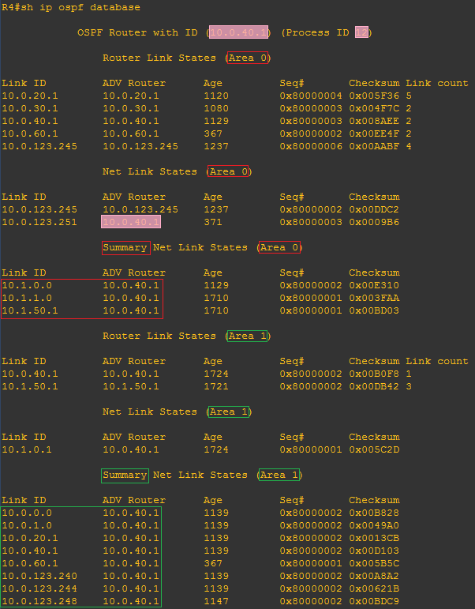
    </ScreenshotCard>

</TaskCard>

<TaskCard number={17} title="查看区域边界路由器ABR信息" needScreenshot={true} needRecord={false}>

为了查看路由器是如何确定区域边界路由器（ABR）的，我们可以使用 `show ip ospf border-routers` 命令

1.  在R1（Area 0内部）上分别执行该命令，查看它们学习到的关于ABR（R4）的信息；由输出可知，当前已知的区域0内的ABR的IP地址为<ModernInput size="large" questionId="Lab5-p3-q17-1"/>，下一跳IP地址为<ModernInput size="large" questionId="Lab5-p3-q17-2"/>
    <ScreenshotCard 
      questionId="Lab5-p3-s17" 
      title="R1 ABR信息示例" 
      uploadOptions={[
        { id: 'r1_abr', label: '截图R1 ABR信息' }
      ]}
    >
        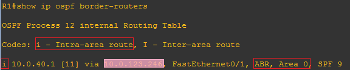
    </ScreenshotCard>
2.  在R5（Area 1内部）上分别执行该命令，查看它们学习到的关于ABR（R4）的信息；由输出可知，当前已知的区域1内的ABR的IP地址为<ModernInput size="large" questionId="Lab5-p3-q17-3"/>，下一跳IP地址为<ModernInput size="large" questionId="Lab5-p3-q17-4"/>
    <ScreenshotCard 
      questionId="Lab5-p3-s17" 
      title="R5 ABR信息示例" 
      uploadOptions={[
        { id: 'r5_abr', label: '截图R5 ABR信息' }
      ]}
    >
        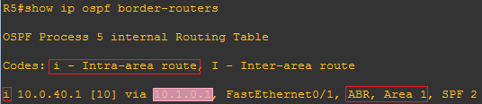
    </ScreenshotCard>

</TaskCard>

<TaskCard number={18} title="配置Area 2并测试连通性" needScreenshot={true} needRecord={true}>

1.  按照拓扑图为R6的F0/1接口、R8的各接口配置IP地址并激活相应接口
2.  为PC4配置IP地址与默认网关
3.  在R6和R8上启动OSPF，并将各接口宣告进 **Area 2**，此时R6成为连接Area 0和Area 2的ABR
    <ScreenshotCard 
      questionId="Lab5-p3-s18" 
      title="R6和R8配置命令" 
      uploadOptions={[
        { id: 'r6_area2', label: '记录R6配置命令', type: 'text', textConfig: {initialContent: "R6(config)#interface f0/1\nR6(config-if)# \nR6(config-if)# \nR6(config)# \nR6(config-router)# ", codeEditor: true, initialLines: 5} },
        { id: 'r8_area2', label: '记录R8配置命令', type: 'text', textConfig: {initialContent: "R8(config)# interface f0/1\nR8(config-if)# \nR8(config-if)# \nR8(config)# interface f0/0\nR8(config-if)# \nR8(config-if)# \nR8(config)# interface f1/0\nR8(config-if)# \nR8(config-if)# \nR8(config)# interface loopback 0\nR8(config-if)# \nR8(config)# \nR8(config-router)# ", codeEditor: true, initialLines: 13} }
      ]}
    />
4.  等待网络收敛后，在R8上查看路由表，并标记出到Area 1网络的区域间路由；由输出可知，区域间路由包含了Area 1和Area 0的地址，其中Area 1的子网地址有<ModernInput size="large" questionId="Lab5-p3-q18-1"/>、<ModernInput size="large" questionId="Lab5-p3-q18-2"/>、<ModernInput size="large" questionId="Lab5-p3-q18-3"/>
    <ScreenshotCard 
      questionId="Lab5-p3-s18" 
      title="R8路由表示例" 
      uploadOptions={[
        { id: 'r8_route', label: '截图R8路由表' }
      ]}
    >
        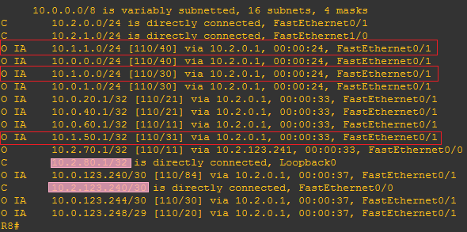
    </ScreenshotCard>
5.  测试PC4与PC1（跨Area 0）的连通性
    <ScreenshotCard 
      questionId="Lab5-p3-s18" 
      title="PC4→1连通性测试示例" 
      uploadOptions={[
        { id: 'pc4_to_pc1', label: '截图PC4→1测试结果' }
      ]}
    >
        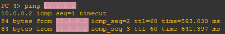
    </ScreenshotCard>
6.  测试PC4与PC3（跨Area 0和Area 1）的连通性
    <ScreenshotCard 
      questionId="Lab5-p3-s18" 
      title="PC4→3连通性测试示例" 
      uploadOptions={[
        { id: 'pc4_to_pc3', label: '截图PC4→3测试结果' }
      ]}
    >
        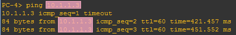
    </ScreenshotCard>

</TaskCard>

<TaskCard number={19} title="配置Frame Relay数据链路" needScreenshot={true} needRecord={false}>

背景知识：帧中继与NBMA网络

**帧中继**（**Frame Relay**）是一种较早期的广域网技术，它在数据链路层通过**虚电路**（**Virtual Circuit**）来转发数据，而非像以太网那样进行广播；每个虚电路通过一个**数据链路连接标识符**（**DLCI**）来唯一识别；帧中继网络是一种典型的**非广播多路访问**（**Non-Broadcast Multi-Access, NBMA**）网络

NBMA网络的特点是，网络中的多台设备虽然在同一个逻辑网段（如IP子网），但它们之间不能像以太网那样通过广播或多播直接通信；任意两台设备间的通信都必须通过中心节点（即帧中继交换机）建立的点对点虚电路进行；这个特性给那些依赖广播/多播来自动发现邻居的路由协议（如OSPF和EIGRP）带来了挑战；默认情况下，OSPF在帧中继链路上会尝试选举DR/BDR，但由于无法发送多播Hello包，选举会失败，邻居关系也无法建立

打开GNS3中的Frame Relay交换机，按下表配置Frame Relay数据链路，定义两条永久虚电路（PVC）：一条从R5到R7，另一条从R5到R9，具体方法可参考[功能与设备介绍-Frame Relay交换机](/docs/GNS3/client-usage#24-frame-relay交换机)

| 源接口 | Source Port:DLCI | Destination Port:DLCI | 目标接口 |
|:---:|:---:|:---:|:---:|
| R5 s2/0,1 | 1:101 | 10:202 | R7 s2/0 |
| R5 s2/0,2 | 1:102 | 11:203 | R9 s2/0 |

<ScreenshotCard 
  questionId="Lab5-p3-s19" 
  title="Frame Relay交换机配置" 
  uploadOptions={[
    { id: 'fr_switch_config', label: '截图FR交换机虚链路配置表' }
  ]}
/>

</TaskCard>

<TaskCard number={20} title="配置R5的Frame Relay子接口" needScreenshot={false} needRecord={true}>

为了在单个物理接口上承载多条虚电路，我们需要再次使用**子接口**（**Subinterface**）技术

1.  进入R5的物理接口s2/0，将其封装类型设置为 `encapsulation frame-relay`，由于GNS3自带的FR交换机只支持ANSI模式，而路由器默认的是Cisco模式，还需要使用`frame-relay lmi-type ANSI`命令，随后激活接口
2.  创建两个点对多点（multipoint）类型的子接口：`interface s2/0.1 multipoint` 和 `interface s2/0.2 multipoint`
3.  为每个子接口配置IP地址，并使用 `frame-relay interface-dlci [dlci]` 命令将其与**相应的**DLCI绑定，dlci值等于上一步Frame Relay交换机上定义的数据链路相关DLCI值
4.  将R5的s2/0接口宣告进Area 1

<ScreenshotCard 
  questionId="Lab5-p3-s20" 
  title="R5 Frame Relay配置命令" 
  uploadOptions={[
    { id: 'r5_fr_config', label: '记录R5配置命令', type: 'text', textConfig: {initialContent: "R5(config)# interface s2/0\nR5(config-if)# encapsulation frame-relay\nR5(config-if)# frame-relay lmi-type ANSI\nR5(config-if)# no shutdown\nR5(config-if)# exit\nR5(config)# interface s2/0.1 multipoint\nR5(config-subif)# ip address [ip] 255.255.255.0\nR5(config-subif)# frame-relay interface-dlci [dlci]\nR5(config-fr-dlci)# exit\nR5(config-subif)# exit\nR5(config)# interface s2/0.2 multipoint\nR5(config-subif)# ip address [ip] 255.255.255.0\nR5(config-subif)# frame-relay interface-dlci [dlci]\nR5(config-fr-dlci)# exit\nR5(config-subif)# exit", codeEditor: true, initialLines: 15} }
  ]}
/>

</TaskCard>

<TaskCard number={21} title="配置R7的Frame Relay接口及OSPF" needScreenshot={true} needRecord={true}>

1.  为R7的各接口配置IP地址并激活，其中回环接口和f0/0接口属于Area 2，s2/0接口属于Area 1
2.  配置s2/0接口的封装协议为 `encapsulation frame-relay`，并指定对应的 `frame-relay interface-dlci [dlci]`，DLCI值设为Frame Relay交换机上R5-R7之间数据链路的相关DLCI值
3.  在R7上 `ping` R5的IP地址，测试连通性；由于是点对点连接，应该只有一个子接口地址可以ping通

<ScreenshotCard 
  questionId="Lab5-p3-s21" 
  title="R7配置命令" 
  uploadOptions={[
    { id: 'r7_fr_config', label: '记录R7配置命令', type: 'text', textConfig: {initialContent: "R7(config)# interface f0/0\nR7(config-if)# \nR7(config-if)# \nR7(config)# interface s2/0\nR7(config-if)# （IP地址）\nR7(config-if)# （封装协议）\nR7(config-if)# （LMI）\nR7(config-if)# （DLCI）\nR7(config-if)# （激活）\nR7(config)# interface loopback 0\nR7(config-if)# \nR7(config)# \nR7(config-router)# \nR7(config-router)# ", codeEditor: true, initialLines: 14} },
    { id: 'r7_fr_map', label: '截图R7 FR映射' },
    { id: 'r5_fr_map', label: '截图R5 FR映射' },
    { id: 'r7_ping_r5', label: '截图R7→R5连通性' }
  ]}
/>

</TaskCard>

<TaskCard number={22} title="配置R9的Frame Relay接口及OSPF" needScreenshot={true} needRecord={true}>

1.  为R9的各接口配置IP地址并激活，其中回环接口和f0/1接口属于Area 3，s2/0接口属于Area 1
2.  配置s2/0接口的封装协议为 `encapsulation frame-relay`，并指定对应的 `frame-relay interface-dlci [dlci]`，DLCI值设为Frame Relay交换机上R5-R9之间数据链路的相关DLCI值
3.  在R9上测试与R5的连通性，由于R5-R9采用的是点对点Frame Relay连接，只有R5的1个子接口地址可以通；如果在R5上测试，需要加上参数`source s2/0`指定接口
4.  测试R9到R7的连通性；你会发现此时无法ping通，这是R5、R7、R9通过帧中继交换机连接的形式是非广播式多路访问，虽然路由器在同一个IP子网，但由于数据链路不是广播式的，所以在没有建立点对点数据链路的情况下，即使在同一IP子网内也无法通信

<ScreenshotCard 
  questionId="Lab5-p3-s22" 
  title="R9配置命令" 
  uploadOptions={[
    { id: 'r9_fr_config', label: '记录R9配置命令', type: 'text', textConfig: {initialContent: "R9(config)# interface f0/1\nR9(config-if)# \nR9(config-if)# \nR9(config)# interface s2/0\nR9(config-if)# （IP地址）\nR9(config-if)# （封装协议）\nR9(config-if)# （LMI）\nR9(config-if)# （DLCI）\nR9(config-if)# （激活）\nR9(config)# interface loopback 0\nR9(config-if)# \nR9(config)# \nR9(config-router)# \nR9(config-router)# ", codeEditor: true, initialLines: 14} },
    { id: 'r9_fr_map', label: '截图R9 FR映射' },
    { id: 'r9_ping_r5', label: '截图R9→R5测试结果' },
    { id: 'r9_ping_r7', label: '截图R9→R7测试结果' }
  ]}
/>

</TaskCard>

<TaskCard number={23} title="查看NBMA网络中的OSPF邻居关系" needScreenshot={true} needRecord={false}>

在解决NBMA问题之前，我们先来观察一下默认配置下的失败状态：在R5, R7, R9上分别使用 `show ip ospf neighbor` 查看OSPF邻居关系；你会发现邻居关系无法建立，这是因为OSPF默认将帧中继接口视为广播网络类型，需要选举DR/BDR，但在非广播的NBMA环境中，路由器之间无法通过多播Hello包相互发现，导致选举失败，无法正常建立三者间的邻居关系

<ScreenshotCard 
  questionId="Lab5-p3-s23" 
  title="R5邻居关系（配置前）" 
  uploadOptions={[
    { id: 'r5_neighbor_before', label: '截图R5邻居关系' },
    { id: 'r7_neighbor_before', label: '截图R7邻居关系' },
    { id: 'r9_neighbor_before', label: '截图R9邻居关系' }
  ]}
/>

</TaskCard>

<TaskCard number={24} title="配置点对多点网络类型" needScreenshot={true} needRecord={true}>

为了解决NBMA环境下的邻居发现问题，我们需要手动将OSPF网络类型更改为点对多点模式，该模式下OSPF不再尝试选举DR/BDR，而是通过单播Hello包来发现和维护邻居关系，从而适应NBMA网络的环境
1.  分别在R5, R7, R9的帧中继接口（或子接口）下，使用命令 `ip ospf network point-to-multipoint`
2.  稍等片刻后，再次使用 `show ip ospf neighbor` 查看邻居关系，此时应该能够成功建立

<ScreenshotCard 
  questionId="Lab5-p3-s24" 
  title="配置点对多点网络类型命令" 
  uploadOptions={[
    { id: 'r5_p2mp', label: '记录R5配置命令', type: 'text', textConfig: {initialContent: "R5(config)# interface s2/0.1\nR5(config-subif)# \nR5(config)# interface s2/0.2\nR5(config-subif)# ", codeEditor: true, initialLines: 4} },
    { id: 'r7_p2mp', label: '记录R7配置命令', type: 'text', textConfig: {initialContent: "R7(config)# interface s2/0\nR7(config-if)# ", codeEditor: true, initialLines: 2} },
    { id: 'r9_p2mp', label: '记录R9配置命令', type: 'text', textConfig: {initialContent: "R9(config)# interface s2/0\nR9(config-if)# ",codeEditor: true, initialLines: 2} },
    { id: 'r5_neighbor_after', label: '截图R5邻居关系' },
    { id: 'r7_neighbor_after', label: '截图R7邻居关系' },
    { id: 'r9_neighbor_after', label: '截图R9邻居关系' }
  ]}
/>

</TaskCard>

<TaskCard number={25} title="观察Area间路由信息交换规则" needScreenshot={true} needRecord={false}>

OSPF有一个非常重要的设计规则：所有非骨干区域都必须与Area 0相连，且**所有区域间的路由信息都必须通过Area 0进行中转**，非骨干区域之间不能直接交换路由信息，我们可以通过对以下路由器OSPF数据库中Summary Net Link部分的观察来验证这一规则

1.  在R5上使用 `show ip ospf database` 查看OSPF数据库，观察得知，Area 1所有的的聚合路由都是由区域边界路由器(ABR)<ModernInput size="large" questionId="Lab5-p3-q25-1"/>宣告的，而R7作为Area 1和Area 2的ABR，却没有向Area 1宣告Area 2的路由信息，是因为所有的Area都只和Area 0进行路由信息交换
    <ScreenshotCard 
      questionId="Lab5-p3-s25" 
      title="R5 OSPF数据库示例" 
      uploadOptions={[
        { id: 'r5_ospf_db_summary', label: '截图R5 OSPF数据库' }
      ]}
    >
        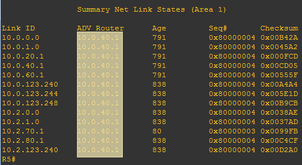
    </ScreenshotCard>
2.  在R8上使用 `show ip ospf database` 查看OSPF数据库，观察得知，Area 2所有的的聚合路由都是由区域边界路由器(ABR)<ModernInput size="large" questionId="Lab5-p3-q25-2"/>宣告的，而R7作为Area 1和Area 2的ABR，也没有向Area 2宣告Area 1的路由信息
    <ScreenshotCard 
      questionId="Lab5-p3-s25" 
      title="R8 OSPF数据库示例" 
      uploadOptions={[
        { id: 'r8_ospf_db_summary', label: '截图R8 OSPF数据库' }
      ]}
    >
        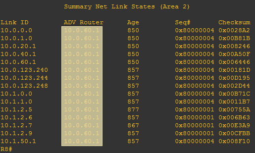
    </ScreenshotCard>
3.  在R7上使用 `show ip ospf database` 查看OSPF数据库，观察得知，Area 1所有的的聚合路由都是由区域边界路由器(ABR)<ModernInput size="large" questionId="Lab5-p3-q25-3"/>宣告的，Area 2所有的的聚合路由都是由区域边界路由器(ABR)<ModernInput size="large" questionId="Lab5-p3-q25-4"/>宣告的
    <ScreenshotCard 
      questionId="Lab5-p3-s25" 
      title="R7 OSPF数据库示例" 
      uploadOptions={[
        { id: 'r7_ospf_db_summary', label: '截图R7 OSPF数据库' }
      ]}
    >
        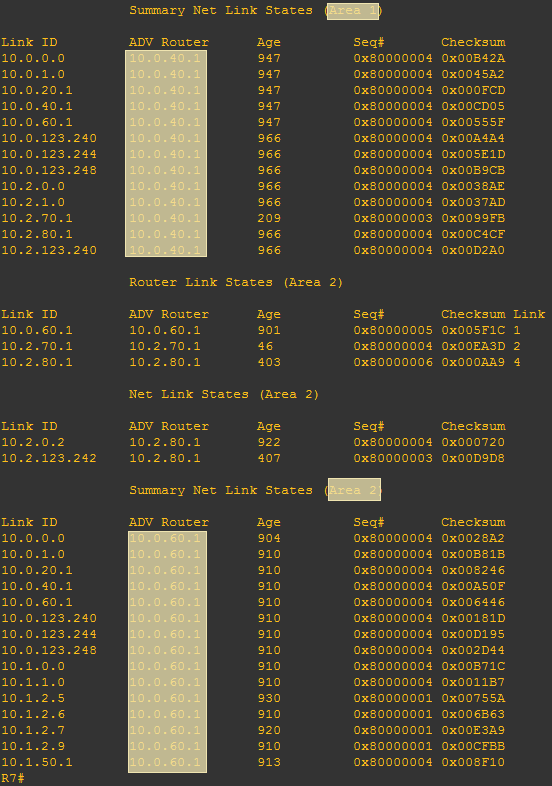
    </ScreenshotCard>

</TaskCard>

<TaskCard number={26} title="查看指定网络的路由信息" needScreenshot={true} needRecord={false}>

在R8上使用 `show ip route [目标网络地址]` 命令，查看去往PC3所在子网的路由条目，观察得知，前往子网<ModernInput size="large" questionId="Lab5-p3-q26-1"/>的下一跳IP地址是<ModernInput size="large" questionId="Lab5-p3-q26-2"/>，是路由器<ModernInput size="medium" questionId="Lab5-p3-q26-3"/>

<ScreenshotCard 
  questionId="Lab5-p3-s26" 
  title="R8→PC3网络路由信息示例" 
  uploadOptions={[
    { id: 'r8_route_to_pc3', label: '截图R8路由信息' }
  ]}
>
    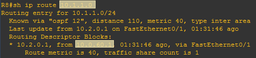
</ScreenshotCard>

</TaskCard>

<TaskCard number={27} title="测试链路中断对路由信息的影响" needScreenshot={true} needRecord={false}>

1.  在R6上关闭其连接Area 0的f0/0接口，切断Area 2与骨干区域的直接连接
2.  在R8上再次查看路由信息，观察得知，前往子网<ModernInput size="large" questionId="Lab5-p3-q27-1"/>的路由已经不存在
3.  在R7上查看路由信息，观察得知，前往子网<ModernInput size="large" questionId="Lab5-p3-q27-2"/>的路由是存在的，但是由于Area 2和Area 1不直接交换路由信息，R7没有向Area 2宣告路由的存在
4.  重新使用 `no shutdown` 打开R6的f0/0接口，观察R8的路由信息是否能够恢复

<ScreenshotCard 
  questionId="Lab5-p3-s27" 
  title="R8路由信息示例" 
  uploadOptions={[
    { id: 'r8_route_after_shutdown', label: '截图R8路由信息' },
    { id: 'r7_route_pc3', label: '截图R7路由信息' }
  ]}
/>

</TaskCard>

<TaskCard number={28} title="配置非骨干网直连区域 Area 3" needScreenshot={true} needRecord={true}>

现在我们将创建一个完全没有物理链路连接到Area 0的区域——Area 3，以此来直观地展示OSPF中“所有区域必须连接骨干区”这一规则的重要性

1.  为R10和PC5配置IP地址并激活接口，将R10的接口全部宣告进 **Area 3**
2.  为PC5配置IP地址和默认路由
3.  使用 `show ip ospf database` 查看R10的OSPF数据库，观察可知没有其他Area的信息，因为Area 3和Area 1不直接交换信息
4.  使用 `show ip route` 查看R10的路由表，观察可知没有其他Area的信息，因为OSPF数据库中缺乏相关数据

<ScreenshotCard 
  questionId="Lab5-p3-s28" 
  title="R10配置命令" 
  uploadOptions={[
    { id: 'r10_config', label: '记录R10配置命令', type: 'text', textConfig: {initialContent: "R10(config)# interface f0/1\nR10(config-if)# \nR10(config-if)# \nR10(config)# interface f0/0\nR10(config-if)# \nR10(config-if)# \nR10(config)# interface loopback 0\nR10(config-if)# \nR10(config)# \nR10(config-router)# ", codeEditor: true, initialLines: 10} },
    { id: 'r10_ospf_db', label: '截图R10 OSPF数据库' },
    { id: 'r10_route', label: '截图R10路由表' }
  ]}
/>

你会发现，由于Area 3没有物理上直接连接到Area 0，它无法学习到任何来自其他区域的路由信息，成为了一个路由“孤岛”

</TaskCard>

<TaskCard number={29} title="建立虚链路连接Area 3和Area 0" needScreenshot={true} needRecord={true}>

背景知识：骨干区域规则与虚链路（Virtual Link）

OSPF采用了一种星型的区域架构，规定**所有非骨干区域**（**Area 1, 2, ...**）**必须直接物理连接到骨干区域**（**Area 0**），并且区域间的路由交互必须经由Area 0中转；这一硬性规定的目的是为了防止区域间路由环路的产生，因为Area 0充当了所有流量交换的中心枢纽，类似于星型拓扑的中心点，逻辑上不可能出现环路

然而在现实网络部署中，由于物理线路限制或企业合并等原因，可能会出现某个区域（如实验中的Area 3）无法物理直连到Area 0的情况；为了在不铺设新光纤的情况下解决这个问题，OSPF设计了**虚链路**（**Virtual Link**）技术；它允许我们在一个中间区域（Transit Area，如Area 1）上建立一条逻辑上的、点对点的隧道，使得边缘区域的ABR与骨干区域的ABR可以视为彼此是直连的；这条虚链路在逻辑上属于Area 0的一部分，修补了断裂的骨干连接，确保了OSPF的连接规则得到满足

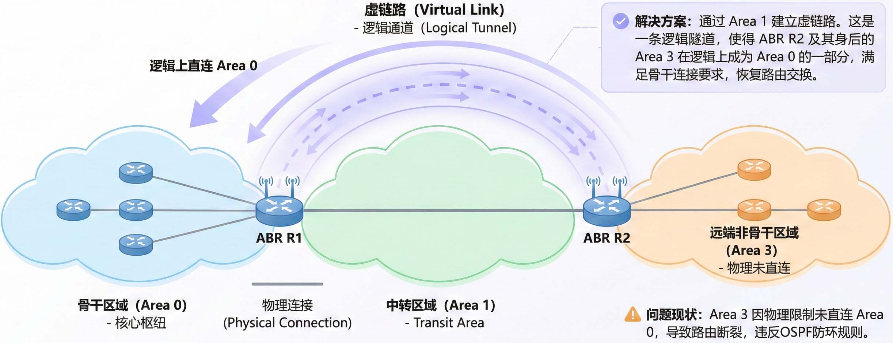

通过这条隧道，远端的非骨干区域（如本实验中的Area 3）就可以在逻辑上与骨干区域相连，从而能够正常地收发区域间的路由信息（Type 3 LSA）；这确保了即使在物理连接不满足条件的情况下“所有区域必须连接到Area 0”这一OSPF的基本设计原则仍然能够得以维持；需要注意的是，虽然控制层面逻辑上经过了Area 0，但实际数据流量在穿越中间区域时会沿物理最短路径直接转发，既维持了“所有区域必须连接到Area 0”的设计原则，也会避免物理上的无效绕路

1.  在R9（Area 1/3的ABR）和R4（Area 0/1的ABR）之间，通过传输区域Area 1建立虚链路（命令：`area [area-id] virtual-link RID`），其中area-id写1，RID写**对方的Router ID**
    <ScreenshotCard 
      questionId="Lab5-p3-s29" 
      title="虚链路配置命令" 
      uploadOptions={[
        { id: 'r4_vlink', label: '记录R4配置命令', type: 'text', textConfig: {initialContent: "R4(config)# \nR4(config-router)# ", codeEditor: true, initialLines: 2} },
        { id: 'r9_vlink', label: '记录R9配置命令', type: 'text', textConfig: {initialContent: "R9(config)# \nR9(config-router)# ",codeEditor: true, initialLines: 2} }
      ]}
    />
2.  配置完成后，使用 `show ip ospf virtual-links` 检查虚链路是否成功建立，观察可知：
    * R4通过区域<ModernInput size="small" questionId="Lab5-p3-q29-1"/>的接口<ModernInput size="medium" questionId="Lab5-p3-q29-2"/>与R9（RID是<ModernInput size="large" questionId="Lab5-p3-q29-3"/>）建立了虚链路，使用的Cost值为<ModernInput size="small" questionId="Lab5-p3-q29-4"/>
    * R9通过区域<ModernInput size="small" questionId="Lab5-p3-q29-5"/>的接口<ModernInput size="medium" questionId="Lab5-p3-q29-6"/>与R4（RID是<ModernInput size="large" questionId="Lab5-p3-q29-7"/>）建立了虚链路，使用的Cost值为<ModernInput size="small" questionId="Lab5-p3-q29-8"/>
    
    <ScreenshotCard 
      questionId="Lab5-p3-s29" 
      title="R4虚链路状态" 
      uploadOptions={[
        { id: 'r4_vlink_show', label: '截图R4虚链路状态' },
        { id: 'r9_vlink_show', label: '截图R9虚链路状态' }
      ]}
    />
3.  配置完成后，使用 `show ip ospf neighbor` 命令检查邻居关系是否成功建立，观察可知：
    *   R4通过接口<ModernInput size="medium" questionId="Lab5-p3-q29-9"/>与R9（RID是<ModernInput size="large" questionId="Lab5-p3-q29-10"/>）建立了邻接关系
    *   R9通过接口<ModernInput size="medium" questionId="Lab5-p3-q29-11"/>与R4（RID是<ModernInput size="large" questionId="Lab5-p3-q29-12"/>）建立了邻接关系

    <ScreenshotCard 
      questionId="Lab5-p3-s29" 
      title="R4邻居信息（虚链路）" 
      uploadOptions={[
        { id: 'r4_neighbor_vlink', label: '截图R4邻居信息' },
        { id: 'r9_neighbor_vlink', label: '截图R9邻居信息' }
      ]}
    />

</TaskCard>

<TaskCard number={30} title="查看虚链路建立后R10的路由信息" needScreenshot={true} needRecord={false}>

现在虚链路已经打通，我们来验证一下Area 3是否已被成功接入OSPF骨干网络

1.  在虚链路成功建立后，再次使用 `show ip route` 查看R10的路由表，标出PC1、PC2、PC3所在子网的相关记录
2.  使用 `show ip ospf database` 查看R10的OSPF数据库，观察可知所有其他区域路由信息均由区域边界路由器<ModernInput size="large" questionId="Lab5-p3-q30-1"/>宣告

<ScreenshotCard 
  questionId="Lab5-p3-s30" 
  title="R10路由表（虚链路建立后）" 
  uploadOptions={[
    { id: 'r10_route_after_vlink', label: '截图R10路由表（标出PC1、PC2、PC3所在子网）' },
    { id: 'r10_db_after_vlink', label: '截图R10 OSPF数据库' }
  ]}
/>

</TaskCard>

<TaskCard number={31} title="配置路由聚合" needScreenshot={true} needRecord={false}>

背景知识：路由聚合/汇总

你可能会担心，如果Area0的子网非常非常非常多，每一个微小的子网（如 `10.0.1.0/24`, `10.0.2.0/24` 等）都会以独立的LSA形式通告给Area 1、Area 2等其他区域，这不会给其他Area的路由器带来很大的开销吗？的确，如果Area 0中有1000个子网，其他区域的路由器路由表中就会增加1000条路由条目，这不仅消耗内存，更重要的是，如果Area 0中某一个子网的链路不稳定，震荡信息会传播到所有区域，引起全网路由表的动荡

**路由聚合（Route Summarization）**，又称路由汇总，就是解决这个问题的有效方式，指的是将多个连续的子网合并成一个单一的、范围更大的超网（Supernet）的过程；在OSPF中，路由聚合通常在ABR上进行，它是一项优化网络性能和稳定性的关键技术

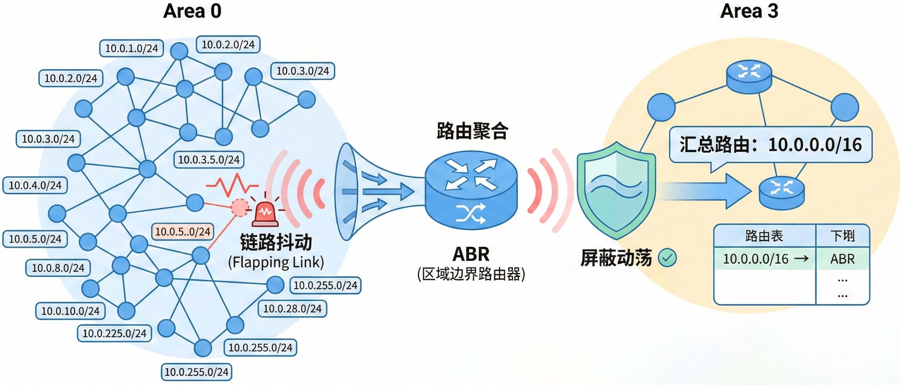

其核心作用体现在两方面：
*   **减小路由表规模**：用一条汇总路由（如`10.0.0.0/16`）来代替多条明细路由（如`10.0.1.0/24`, `10.0.2.0/24`, …），可以显著减小下游区域路由器的路由表大小；更小的路由表意味着更少的内存占用和更快的路由查找速度，从而降低了路由器的CPU负担
*   **增强网络稳定性**：路由聚合可以有效地将区域内的拓扑变化“隐藏”起来；例如，如果Area 0中的一个子网链路发生抖动（频繁地up/down），如果没有聚合，ABR会不断地向其他区域泛洪更新的LSA；而进行了聚合后，只要汇总地址范围内的网络整体仍然可达，ABR就不会向其他区域发送LSA更新，从而避免了网络震荡的传播，提高了整个OSPF域的稳定性

1.  在R9的OSPF配置模式下，使用 `area [area-id] range [ip_net] [mask]` 命令，将来自Area 0的多个`10.0.x.x`子网汇总成一条`10.0.0.0 255.255.0.0`的路由，并通告给Area 3
2.  配置完成后，查看R9和R10的路由表，标出合并的那条路由
    * R9上，合并的路由采用了特殊的接口<ModernInput size="medium" questionId="Lab5-p3-q31-1"/>作为下一跳；这是一个防环机制，如果R9收到一个去往未知`10.0.x.x`子网的数据包，它会将其丢弃，而不是错误地发回Area 1
    * R10上，下一跳的IP地址是<ModernInput size="large" questionId="Lab5-p3-q31-2"/>，是路由器<ModernInput size="medium" questionId="Lab5-p3-q31-3"/>的接口

    <ScreenshotCard 
      questionId="Lab5-p3-s31" 
      title="R9路由表（路由聚合后）" 
      uploadOptions={[
        { id: 'r9_route_summary', label: '截图R9路由表' },
        { id: 'r10_route_summary', label: '截图R10路由表' }
      ]}
    />

</TaskCard>

<TaskCard number={32} title="保存路由器配置文件" needScreenshot={false} needRecord={false}>

整理各路由器的当前运行配置，选择与本实验相关的内容记录在文本文件中，每个设备一个文件，分别命名为R1.txt、R2.txt等，随实验报告一起打包上传

</TaskCard>

## 3 实验结果与分析

根据你观察到的实验数据和对实验原理的理解，分别解答以下问题：

* 在一个网络中各路由器的OSPF进程号是否一定要相同？一个路由器上可以配置多个进程号吗？
  <ModernInput size="exlarge" questionId="Lab5-q1"/>
* 未手工指定Router ID时，如果没有给回环接口配置IP地址，会从哪一个接口选取地址作为Router ID？如果给回环接口配置了IP地址，又会从哪一个接口选取地址作为Router ID？
  <ModernInput size="exlarge" questionId="Lab5-q2"/>
* 如果Router ID对应的接口down了，路由器会自动重新选择另一个接口地址作为新的Router ID吗？
  <ModernInput size="exlarge" questionId="Lab5-q3"/>
* 宣告网络属于哪个area的命令中，网络地址后面的参数是子网掩码吗？为什么要写成0.0.255.255，而不是255.255.0.0？
  <ModernInput size="exlarge" questionId="Lab5-q4"/>
* 是不是所有其他Area上的路由器都只和Area 0上的路由器进行路由信息交换？虚链路的作用是什么？
  <ModernInput size="exlarge" questionId="Lab5-q5"/>
* 为什么要在区域边界路由器上进行路由合并？
  <ModernInput size="exlarge" questionId="Lab5-q6"/>

## 4 常见问题

## 5 导出实验报告

<ExportButton templatePath={require('@site/assets/base_report/Lab5.zip').default} labName="Lab5" labId="lab5-" />