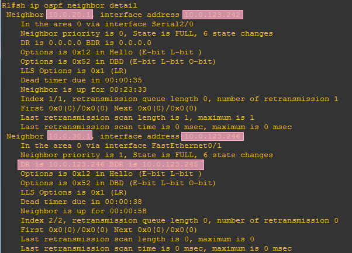

import FileCard from '@site/src/components/FileCard';
import LinkCard from '@site/src/components/LinkCard';
import DeadlineProcess from '@site/src/components/DeadlineProcess';
import PlaceHolder from '@site/src/components/PlaceHolder';
import TaskCard from '@site/src/components/TaskCard';
import ScreenshotCard from '@site/src/components/ScreenshotCard';
import ModernInput from '@site/src/components/ModernInput';
import ExportButton from '@site/src/components/ExportButton';
import { Row, Col } from 'antd';

<h3 style={{color: '#006d75', marginTop: 0, marginBottom: 8}}>实验资源</h3>
<DeadlineProcess start={'2025-11-25 18:50:00'} end={'2025-12-09 23:59:59'}/>

<Row gutter={[16, 4]} justify="space-between" style={{marginBottom: -25}}>
    <Col xs={24} sm={24} md={12} lg={24} xl={12} xxl={12}>
        <FileCard file_type={'md'} name={'Lab5 实验报告模板 Markdown版本'} size={'742709'} link={require('@site/assets/templete/md/Lab5 实验报告模板.zip').default} />
    </Col>
    <Col xs={24} sm={24} md={12} lg={24} xl={12} xxl={12}>
        <FileCard file_type={'doc'} name={'Lab5 实验报告模板 Word版本'} size={'941568'} link={require('@site/assets/templete/word/实验报告模版_实验5.doc').default} />
    </Col>
    <Col xs={24} sm={24} md={12} lg={24} xl={12} xxl={12}>
        <FileCard file_type={'pdf'} name={'Lab5 动态路由协议OSPF配置 实验课件'} size={'5090922'} link={require('@site/assets/slides/在Cisco路由器上的路由协议.pdf').default} />
    </Col>
</Row>

<PlaceHolder>

## 1 实验目的

* 理解链路状态路由协议的工作原理。
* 理解OSPF协议的工作机制。
* 掌握配置和调试OSPF协议的方法。

## 二、实验内容

-   使用网线连接PC和路由器，并配置PC和路由器各端口的IP地址，让PC彼此能够与路由器接口互相Ping通；
-   用网线连接多个路由器，并配置互联端口的IP地址，使直接连接的2个路由器能相互Ping通；
-   在Area 0的路由器上启用OSPF动态路由协议，让各路由器能够互相学习到新的路由信息，进而使区域内的PC能够相互Ping通；
-   在Area 1的路由器上启用OSPF动态路由协议，让区域内和区域间各路由器能够互相学习到新的路由信息；
-   在Area 2的路由器上启用OSPF动态路由协议，在NBMA（非广播多路访问）网络拓扑上配置OSPF协议，让区域内和区域间各路由器能够互相学习到新的路由信息；
-   在Area 3（不与Area 0直接连接）的路由器上启用OSPF动态路由协议，在边界路由器上建立虚链路，让Area 3的路由器能够学习到新的路由信息，进而使Area 3的路由器能够学习到其他区域的路由信息；
-   在上述各种情况下，观察各路由器上的路由表和OSPF运行数据，并验证各PC能够相互Ping通；
-   断开某些链路，观察OSPF事件和路由表变化；
-   在Area边界路由器上配置路由聚合。

## 四、操作方法与实验步骤

-   按照拓扑图连接PC和路由器，其中R1-R2之间采用串口连接，数据链路层协议使用HDLC；R5、R7、R8之间采用Frame Relay交换机连接（Frame Relay交换机的配置请参考GNS3指南）。
-   设计好PC和路由器各端口的IP地址、子网掩码。分配地址时请遵循下面的规则：
-   配置各PC的的默认网关，分别设置为所连路由器的相应端口IP地址；
-   配置各路由器互联端口的IP地址，使直连的2个路由器能相互Ping通；
-   先后给路由器R1、R2、R3配置RIP协议和OSPF协议，比较两者选择的路由差别（RIP不考虑线路带宽，只考虑经过的路由器个数，OSPF考虑线路cost，带宽越大，cost越小）；
-   给Area 1、Area 2的路由器配置OSPF协议，观察区域间路由信息交换；
-   给Area 3的路由器配置OSPF协议。由于Area 3没有物理上直接与Area 0连接，所以需要利用Area 1作为中介，在R4和R9之间为Area 3建立一个虚链路。
-   观察各路由器的路由表，查看路由器做出的选择是否符合预期；
-   通过Ping检查各PC之间的联通性；
-   实时显示路由器之间交换的路由信息事件，理解OSPF协议交互过程；
-   断开某些网络连接，查看OSPF的数据变化以及路由表的变化，并测试PC间的联通性；

:::warning 注意
对于路由表、宣告网络等涉及多项的配置，不存在“输入错误后可以再输入正确内容覆盖”，所有输入的命令均会被加入表项，对实验产生影响

如果你对此类指令不慎输错，请使用`no [完整错输指令内容]`撤销；在遇到难以解决的问题时，请先检查运行配置是否符合预期
:::

### RIP相关命令参考

-   在路由器上启用RIP协议：`Router(config)# router rip`
-   将路由器各接口（子网）加入路由宣告：`Router(config-router)# network[<ip_net]`

### OSPF相关命令参考

- 给路由器的回环接口配置地址
  ```kotlin
  Router(config)# interface loopback 0
  Router(config-if)# ip address [ip] [mask]
  ```
- 在路由器上启用OSPF协议：`Router(config)# router ospf [process-id]`
- 配置路由器接口（子网）所属Area ID：`Router(config-router)# network [ip_net] [mask] area [area-id]`
- 查看路由器的OSPF数据库（可以查看Router ID）：`Router# show ip ospf database`
- 手工指定Router ID：`Router(config-router)# router-id `
  更换Router ID需要重启路由器或清除OSPF状态才能生效, 其中：
    * 重启路由器命令：`Router# reload`
    * 清除OSPF状态命令：`Router# clear ip ospf process`
- 观察各路由器的OSPF邻居关系，在广播网络中，为减少通信量，会自动选出一个DR（Designated Router）和一个BDR（Backup Designated Router），其他路由器只与DR、BDR成为邻接关系：`Router# show ip ospf neighbor detail`
- 观察路由器的OSPF接口状态（可以查看cost值）：`Router# show ip ospf interface`
- 打开事件调试，实时显示路由器之间交换的路由信息事件：`Router# debug ip ospf events`
  观察完毕后，可以关闭调试信息显示：`Router# no debug ip ospf events`
- 在两个区域边界路由器之间建立虚链路，`[area-id]`填写用于传递数据的区域ID，`[router ID]`分别设为对方的Router ID：`Router(config-router)# area [area-id] virtual-link [router ID]`
- 在区域边界路由器上手工进行路由合并：`Router(config-router)# area [area-id] range [ip_net] [mask]`

### Cisco IP路由故障排除文档集合

<LinkCard icon="https://www.cisco.com/favicon.ico" title="IP 路由 - 故障排除技术说明" url="https://www.cisco.com/c/zh_cn/tech/ip/ip-routing/tsd-technology-support-troubleshooting-technotes-list.html">故障排除技术说明</LinkCard>


## 2 实验数据记录和处理

:::important 提示
以下实验记录均需结合屏幕截图，进行文字标注和描述，图片应大小合适、关键部分清晰可见，可直接在图片上进行标注，也可以单独用文本进行描述。
记录输入的命令时，直接粘贴文字即可（保留命令前面的提示符，如R1#）。
:::

<TaskCard number={1} title="设计IP地址方案并标注拓扑图" needScreenshot={true} needRecord={false}>

参考实验操作方法的说明，设计好每个PC、路由器各接口的IP地址及掩码，并标注在拓扑图上。
    * Area 0使用10.0.0.0/16的网络地址进行扩展，每个子网分别使用10.0.0.0/24、10.0.1.0/24、10.0.2.0/24等子网地址。其中点对点连接的路由器之间的子网使用10.0.123.240/28进行扩展，可以最大程度的节约地址，例如使用串行掩码方案，网络地址部分为30位，每个子网刚好有2个可用地址（去掉1个主机地址部分全0的和1个主机地址部分全1的），可以按如下方式进行分配：
        * R1-R2互联接口: 10.0.123.241/30、10.0.123.242/30，子网地址：10.0.123.240/30;
        * R1-R3互联接口: 10.0.123.245/30、10.0.123.246/30，子网地址：10.0.123.244/30;
        * 依次类推，R2、R3、R4、R6之间的子网为（只需要4个地址）：10.0.123.248/29，去掉全0全1地址后，还有6个地址可用。
    * Area 1、Area 2、Area 3使用10.X.0.0/16的网络地址进行扩展，其中X为Area编号，例如Area 1的3个子网分别使用10.1.0.0/24、10.1.1.0/24、10.1.2.0/24等子网地址（同一个交换机上的多台路由器的接口属于同一个子网）。

<ScreenshotCard 
  questionId="Lab5-s1" 
  title="网络拓扑图及IP地址规划" 
  uploadOptions={[
    { id: 'topology', label: '上传标注IP地址的拓扑图' }
  ]}
/>


</TaskCard>

<TaskCard number={2} title="配置路由器接口和PC网络参数" needScreenshot={true} needRecord={true}>

给路由器R1、R2、R3各接口配置IP地址并激活。配置PC1、PC2的IP地址和默认网关，测试PC1与R1、PC2与R2的连通性。

<ScreenshotCard 
  questionId="Lab5-s2" 
  title="路由器接口配置命令" 
  uploadOptions={[
    { id: 'r1_config', label: '记录R1配置命令', type: 'text', textConfig: {codeEditor: true, initialLines: 13} },
    { id: 'r2_config', label: '记录R2配置命令', type: 'text', textConfig: {codeEditor: true, initialLines: 10} },
    { id: 'r3_config', label: '记录R3配置命令', type: 'text', textConfig: {codeEditor: true, initialLines: 7} }
  ]}
>
   R1配置命令示例：

   ```kotlin
   R1 (config) #interface f0/0
   R1 (config-if) #ip addr [ip] 255.255.255.0
   R1 (config-if) #no shutdown
   R1 (config-if) #exit
   R1 (config) #interface f0/1
   R1 (config-if) #ip addr [ip] 255.255.255.252
   R1 (config-if) #no shutdown
   R1 (config-if) #exit
   R1 (config) #interface s2/0
   R1 (config-if) #ip addr [ip] 255.255.255.252
   R1 (config-if) #encapsulation hdlc
   R1 (config-if) #clock rate 128000
   R1 (config-if) #no shutdown
   ```

   R2配置命令示例：

   ```kotlin
   R2 (config) #interface f0/0
   R2 (config-if) #ip addr [ip] 255.255.255.0
   R2 (config-if) #no shutdown
   R2 (config-if) #exit
   R2 (config) #interface f1/0
   R2 (config-if) #ip addr [ip] 255.255.255.248
   R2 (config-if) #no shutdown
   R2 (config-if) #exit
   R2 (config) #interface s2/0
   R2 (config-if) #ip addr [ip] 255.255.255.252
   R2 (config-if) #encapsulation hdlc
   R2 (config-if) #no shutdown
   ```

   R3配置命令示例：

   ```kotlin
   R3 (config) #interface f0/1
   R3 (config-if) #ip addr [ip] 255.255.255.252
   R3 (config-if) #no shutdown
   R3 (config-if) #exit
   R3 (config) #interface f1/0
   R3 (config-if) #no shutdown
   R3 (config-if) #ip addr [ip] 255.255.255.248
   ```
</ScreenshotCard>

<ScreenshotCard 
  questionId="Lab5-s2" 
  title="PC1到R1连通性测试" 
  uploadOptions={[
    { id: 'pc1_to_r1', label: '截图PC1→R1' }
  ]}
>
   
</ScreenshotCard>

<ScreenshotCard 
  questionId="Lab5-s2" 
  title="PC2到R2连通性测试" 
  uploadOptions={[
    { id: 'pc2_to_r2', label: '截图PC2→R2' }
  ]}
>
   
</ScreenshotCard>

</TaskCard>


### 2.1 配置RIP（用于和OSPF进行比较）

<TaskCard number={3} title="配置RIP动态路由协议" needScreenshot={false} needRecord={true}>

在R1、R2、R3上启用RIP动态路由协议，并宣告各接口所在子网地址（版本要设置成2）。

<ScreenshotCard 
  questionId="Lab5-p1-s3" 
  title="RIP协议配置命令" 
  uploadOptions={[
    { id: 'rip_r1', label: '记录R1配置命令', type: 'text', textConfig: {codeEditor: true, initialLines: 4} },
    { id: 'rip_r2', label: '记录R2配置命令', type: 'text', textConfig: {codeEditor: true, initialLines: 4} },
    { id: 'rip_r3', label: '记录R3配置命令', type: 'text', textConfig: {codeEditor: true, initialLines: 4} }
  ]}
>
   R1配置命令示例：

   ```kotlin
   R1 (config) #router rip
   R1 (config-router) #network [subnet]
   R1 (config-router) #version 2
   ```

   R2配置命令示例：

   ```kotlin
   R2 (config) #router rip
   R2 (config-router) #version 2
   R2 (config-router) #network [subnet]
   ```

   R3配置命令示例：

   ```kotlin
   R3 (config) #router rip
   R3 (config-router) #version 2
   R3 (config-router) #network [subnet]
   ```
</ScreenshotCard>

</TaskCard>


<TaskCard number={4} title="查看RIP路由表并跟踪路由" needScreenshot={true} needRecord={false}>

查看R1、R2、R3的路由表，跟踪PC1到PC2的路由。

<ScreenshotCard 
  questionId="Lab5-p1-s4" 
  title="R1路由表" 
  uploadOptions={[
    { id: 'r1_route', label: '截图R1路由表（标出到PC2子网的路由）' }
  ]}
>
   R1路由表示例（标出到PC2子网的路由，下一跳是哪个路由器）：

   
</ScreenshotCard>

<ScreenshotCard 
  questionId="Lab5-p1-s4" 
  title="R2路由表" 
  uploadOptions={[
    { id: 'r2_route', label: '截图R2路由表（标出到PC1子网的路由）' }
  ]}
>
   R2路由表示例（标出到PC1子网的路由，下一跳是哪个路由器）：

   
</ScreenshotCard>

<ScreenshotCard 
  questionId="Lab5-p1-s4" 
  title="R3路由表" 
  uploadOptions={[
    { id: 'r3_route', label: '截图R3路由表' }
  ]}
>
   R3路由表示例：

   
</ScreenshotCard>

<ScreenshotCard 
  questionId="Lab5-p1-s4" 
  title="路由跟踪结果" 
  uploadOptions={[
    { id: 'pc1_to_pc2_trace', label: '截图PC1→PC2路由跟踪' }
  ]}
>
   PC1→PC2的路由跟踪：（经过的路由器顺序是R1、<ModernInput size="medium" questionId="Lab5-p1-q4-1"/>）

   
</ScreenshotCard>

</TaskCard>


### 2.2 配置单域OSPF（Area 0）

<TaskCard number={5} title="配置R1的OSPF协议" needScreenshot={false} needRecord={true}>

启用路由器R1的OSPF动态路由协议，并配置各接口所属区域（为Area 0），其中进程ID请设置为学号的后2位（全0者往前取值）。

<ScreenshotCard 
  questionId="Lab5-p2-s5" 
  title="R1 OSPF配置命令" 
  uploadOptions={[
    { id: 'r1_ospf', label: '记录R1 OSPF配置命令', type: 'text', textConfig: {codeEditor: true, initialLines: 3} }
  ]}
>
   R1配置命令示例：

   ```kotlin
   R1 (config) #router ospf [pid]
   R1 (config-router) #network [subnet] [mask] area 0
   ```
</ScreenshotCard>

</TaskCard>

<TaskCard number={6} title="配置R2的回环接口和OSPF协议" needScreenshot={false} needRecord={true}>

先给R2的回环接口配置IP地址。然后再启用路由器R2的OSPF动态路由协议，设置包括回环接口在内的各接口所属区域（为Area 0）。

<ScreenshotCard 
  questionId="Lab5-p2-s6" 
  title="R2回环接口及OSPF配置命令" 
  uploadOptions={[
    { id: 'r2_ospf', label: '记录R2配置命令', type: 'text', textConfig: {codeEditor: true, initialLines: 6} }
  ]}
>
   R2配置命令示例：

   ```kotlin
   R2 (config) #interface loopback 0
   R2 (config-if) #ip address [ip] 255.255.255.252
   R2 (config-if) #exit
   R2 (config) #router ospf [pid]
   R2 (config-router) #network [subnet] [mask] area 0
   ```
</ScreenshotCard>

</TaskCard>

<TaskCard number={7} title="配置R3的OSPF协议并指定Router ID" needScreenshot={false} needRecord={true}>

启用路由器R3的OSPF动态路由协议，手工指定Router ID，并设置各接口所属区域为Area 0。

<ScreenshotCard 
  questionId="Lab5-p2-s7" 
  title="R3 OSPF配置命令" 
  uploadOptions={[
    { id: 'r3_ospf', label: '记录R3配置命令', type: 'text', textConfig: {codeEditor: true, initialLines: 4} }
  ]}
>
   R3配置命令示例：

   ```kotlin
   R3 (config) #router ospf [pid]
   R3 (config-router) #router-id [x.x.x.x]
   R3 (config-router) #network 10.0.0.0 [mask] area 0
   ```
</ScreenshotCard>

</TaskCard>


<TaskCard number={8} title="查看OSPF数据库并分析Router ID" needScreenshot={true} needRecord={false}>

查看OSPF数据库，并标出各路由器的Router ID。

<ScreenshotCard 
  questionId="Lab5-p2-s8-r1" 
  title="R1的OSPF数据库" 
  uploadOptions={[
    { id: 'r1_ospf_db', label: '截图R1 OSPF数据库' }
  ]}
>
   

   从上图可知，R1的Router ID为<ModernInput size="large" questionId="Lab5-p2-q8-1"/>（取自接口<ModernInput size="medium" questionId="Lab5-p2-q8-2"/>的IP）；与R1连接的有<ModernInput size="small" questionId="Lab5-p2-q8-3"/>个路由器，其ID分别是<ModernInput size="large" questionId="Lab5-p2-q8-4"/>、<ModernInput size="large" questionId="Lab5-p2-q8-5"/>， 有<ModernInput size="small" questionId="Lab5-p2-q8-6"/>条链路，其ID分别是<ModernInput size="large" questionId="Lab5-p2-q8-7"/>、<ModernInput size="large" questionId="Lab5-p2-q8-8"/>。
</ScreenshotCard>

<ScreenshotCard 
  questionId="Lab5-p2-s8-r2" 
  title="R2的OSPF数据库" 
  uploadOptions={[
    { id: 'r2_ospf_db', label: '截图R2 OSPF数据库' }
  ]}
>
   

   从上图可知，R2的Router ID为<ModernInput size="large" questionId="Lab5-p2-q8-9"/>（取自接口<ModernInput size="medium" questionId="Lab5-p2-q8-10"/> 的IP）；与R2连接的有<ModernInput size="small" questionId="Lab5-p2-q8-11"/>个路由器，其ID分别是<ModernInput size="large" questionId="Lab5-p2-q8-12"/>、<ModernInput size="large" questionId="Lab5-p2-q8-13"/>， 有<ModernInput size="small" questionId="Lab5-p2-q8-14"/>条链路，其ID分别是<ModernInput size="large" questionId="Lab5-p2-q8-15"/>、<ModernInput size="large" questionId="Lab5-p2-q8-16"/>。
</ScreenshotCard>

<ScreenshotCard 
  questionId="Lab5-p2-s8-r3" 
  title="R3的OSPF数据库" 
  uploadOptions={[
    { id: 'r3_ospf_db', label: '截图R3 OSPF数据库' }
  ]}
>
   

   从上图可知，R3的Router ID为<ModernInput size="large" questionId="Lab5-p2-q8-17"/>；与R3连接的有<ModernInput size="small" questionId="Lab5-p2-q8-18"/>个路由器，其ID分别是<ModernInput size="large" questionId="Lab5-p2-q8-19"/>、<ModernInput size="large" questionId="Lab5-p2-q8-20"/>， 有<ModernInput size="small" questionId="Lab5-p2-q8-21"/>条链路，其ID分别是<ModernInput size="large" questionId="Lab5-p2-q8-22"/>、<ModernInput size="large" questionId="Lab5-p2-q8-23"/>。
</ScreenshotCard>

</TaskCard>


<TaskCard number={9} title="显示R1的OSPF接口数据" needScreenshot={true} needRecord={false}>

在路由器R1上显示OSPF接口数据（命令：`show ip ospf interface`），标记各接口的cost值，网络类型，邻接关系及其Router ID，广播类型的网络再标出DR（Designed Router）或者BDR（Backup Designed Router）角色。

<ScreenshotCard 
  questionId="Lab5-p2-s9-s20" 
  title="R1的s2/0接口OSPF数据" 
  uploadOptions={[
    { id: 'r1_s20', label: '截图R1 s2/0接口' }
  ]}
>
   

   从图可知，s2/0连接的网络类型为<ModernInput size="medium" questionId="Lab5-p2-q9-1"/>，Cost=<ModernInput size="small" questionId="Lab5-p2-q9-2"/>，邻居Router ID=<ModernInput size="large" questionId="Lab5-p2-q9-3"/>
</ScreenshotCard>

<ScreenshotCard 
  questionId="Lab5-p2-s9-f01" 
  title="R1的f0/1接口OSPF数据" 
  uploadOptions={[
    { id: 'r1_f01', label: '截图R1 f0/1接口' }
  ]}
>
   

   f0/1连接的网络类型为<ModernInput size="medium" questionId="Lab5-p2-q9-4"/>，Cost=<ModernInput size="small" questionId="Lab5-p2-q9-5"/>，邻居Router ID=<ModernInput size="large" questionId="Lab5-p2-q9-6"/>，DR的Router ID是<ModernInput size="large" questionId="Lab5-p2-q9-7"/>，接口IP是<ModernInput size="large" questionId="Lab5-p2-q9-8"/>，BDR的Router ID是<ModernInput size="large" questionId="Lab5-p2-q9-9"/>，接口IP是<ModernInput size="large" questionId="Lab5-p2-q9-10"/>
</ScreenshotCard>

<ScreenshotCard 
  questionId="Lab5-p2-s9-f00" 
  title="R1的f0/0接口OSPF数据" 
  uploadOptions={[
    { id: 'r1_f00', label: '截图R1 f0/0接口' }
  ]}
>
   

   f0/0连接的网络类型为<ModernInput size="medium" questionId="Lab5-p2-q9-11"/>，Cost=<ModernInput size="small" questionId="Lab5-p2-q9-12"/>，DR的Router ID是<ModernInput size="large" questionId="Lab5-p2-q9-13"/>，接口IP是<ModernInput size="large" questionId="Lab5-p2-q9-14"/>
</ScreenshotCard>

</TaskCard>


<TaskCard number={10} title="查看OSPF路由表并与RIP比较" needScreenshot={true} needRecord={false}>

查看R1、R2、R3的路由表，与RIP比较，OSPF所选择的路由有何不同，谁的优先级高？跟踪PC1到PC2的路由。

<ScreenshotCard 
  questionId="Lab5-p2-s10" 
  title="R1路由表（OSPF）" 
  uploadOptions={[
    { id: 'r1_route_ospf', label: '截图R1路由表' }
  ]}
>
    R1路由表示例：（从图可知，对于PC2的网络，OSPF选择的下一跳IP地址是<ModernInput size="large" questionId="Lab5-p2-q10-1"/>，由于OSPF的路由管理距离为110，比RIP的管理距离120优先级更高，所以把之前RIP选择的路由替换了）

    
</ScreenshotCard>

<ScreenshotCard 
  questionId="Lab5-p2-s10" 
  title="R2路由表（OSPF）" 
  uploadOptions={[
    { id: 'r2_route_ospf', label: '截图R2路由表' }
  ]}
>
    R2路由表示例：（从图可知，对于PC1的网络，OSPF选择的下一跳IP地址是<ModernInput size="large" questionId="Lab5-p2-q10-2"/>）

    
</ScreenshotCard>

<ScreenshotCard 
  questionId="Lab5-p2-s10" 
  title="R3路由表（OSPF）" 
  uploadOptions={[
    { id: 'r3_route_ospf', label: '截图R3路由表' }
  ]}
>
    R3路由表示例：

    
</ScreenshotCard>

<ScreenshotCard 
  questionId="Lab5-p2-s10" 
  title="路由跟踪结果" 
  uploadOptions={[
    { id: 'pc1_to_pc2_ospf', label: '截图PC1→PC2路由跟踪' }
  ]}
>
    PC1→PC2的路由跟踪：（经过的路由器顺序是R1、<ModernInput size="medium" questionId="Lab5-p2-q10-3"/>、<ModernInput size="medium" questionId="Lab5-p2-q10-4"/>）

    
</ScreenshotCard>

</TaskCard>


<TaskCard number={11} title="测试链路中断后的路由表变化" needScreenshot={true} needRecord={false}>

断开R1和R3的接口（在R1或R3上`shutdown`该接口），再次显示R1的路由表，标记到达PC2所在子网的下一跳。

<ScreenshotCard 
  questionId="Lab5-p2-s11" 
  title="R1路由表（断开R1-R3链路后）" 
  uploadOptions={[
    { id: 'r1_route_after_shutdown', label: '截图R1路由表' }
  ]}
>
    
</ScreenshotCard>

</TaskCard>

<TaskCard number={12} title="观察重启后Router ID的变化" needScreenshot={true} needRecord={false}>

保存R1配置后（在R1上输入命令：`write`）重启路由器（右键菜单`reload`），查看R1的Router ID是否发生变化。原因是由于接口f0/1断开了，故其上的IP地址也暂时不可用，OSPF于是选择了另一个可用IP地址作为Router ID，而原来的Router ID也未消失，看上去是来自另一台不存在的路由器。而R2配置了回环接口，OSPF会优先选择不会断开的回环接口的IP地址作为Router ID，就不会出现上述情况。

<ScreenshotCard 
  questionId="Lab5-p2-s12" 
  title="R1的OSPF数据库（重启后）" 
  uploadOptions={[
    { id: 'r1_db_after_reload', label: '截图R1 OSPF数据库' }
  ]}
>
    变成了<ModernInput size="large" questionId="Lab5-p2-q12-1"/>，取自<ModernInput size="medium" questionId="Lab5-p2-q12-2"/>接口的IP地址。

    
</ScreenshotCard>

</TaskCard>

<TaskCard number={13} title="观察OSPF邻接关系建立过程" needScreenshot={true} needRecord={true}>

在R1上打开OSPF事件调试（命令：`debug ip ospf events`），然后重新连接R1和R3的接口（在R1或R3上`no shutdown`该接口），等与R3的邻居关系为Full后关闭debug，最后查看邻居关系。

:::tip 提示
OSPF协议中，当路由器收到来自邻居的hello数据包时，它必须在自己的hello数据包中列出发送方路由器ID，以向该邻居进行确认

Init状态表示路由器已收到来自其邻居的hello数据包，但接收路由器ID未包含在hello数据包中，因此，要想看到Init状态，需要R3在未收到R1 hello数据包时发送自己的hello数据包（此时不含R1路由器ID），并被R1接收

你可以在R1发送了一个hello数据包时立刻打开R3对应的接口，此时R3发送的首个hello数据包应该就满足这一条件
:::

<ScreenshotCard 
  questionId="Lab5-p2-s13-events" 
  title="邻接关系建立事件记录" 
  uploadOptions={[
    { id: 'ospf_events', label: '截图OSPF事件记录' }
  ]}
>
    R1和R3重新建立邻接关系的事件记录：（从图可知，邻接关系建立经历了5个状态，分别是<ModernInput size="medium" questionId="Lab5-p2-q13-1"/>、<ModernInput size="medium" questionId="Lab5-p2-q13-2"/>、<ModernInput size="medium" questionId="Lab5-p2-q13-3"/>、<ModernInput size="medium" questionId="Lab5-p2-q13-4"/>、<ModernInput size="medium" questionId="Lab5-p2-q13-5"/>）

    
</ScreenshotCard>

<ScreenshotCard 
  questionId="Lab5-p2-s13-neighbor" 
  title="R1邻居信息" 
  uploadOptions={[
    { id: 'r1_neighbor', label: '截图R1 OSPF邻居详细信息' }
  ]}
>
    
</ScreenshotCard>

<ScreenshotCard 
  questionId="Lab5-p2-s13" 
  title="R4和R6配置命令" 
  uploadOptions={[
    { id: 'r4_r6_config', label: '记录R4/R6配置命令', type: 'text', textConfig: {codeEditor: true, initialLines: 8} }
  ]}
>
    给R4、R6的回环接口、f0/0接口配置IP地址并激活，启用OSPF协议，接口均属于Area 0。过一会儿查看R4和R6的邻居信息（由于R2、R3、R4、R6在同一个广播网络中，四台路由器并不会都成为邻接关系，而是选出DR、BDR，然后各路由器与DR、BDR进行路由信息交换）。
</ScreenshotCard>

<ScreenshotCard 
  questionId="Lab5-p2-s13" 
  title="R4邻居关系" 
  uploadOptions={[
    { id: 'r4_neighbor', label: '截图R4邻居关系' }
  ]}
>
    R4上查看邻居关系示例（与R6是邻居，但不建立邻接关系，重启后可能会变化）：

    
</ScreenshotCard>

<ScreenshotCard 
  questionId="Lab5-p2-s13" 
  title="R6邻居关系" 
  uploadOptions={[
    { id: 'r6_neighbor', label: '截图R6邻居关系' }
  ]}
>
    R6上查看邻居关系示例（与R4是邻居，但不建立邻接关系，重启后可能会变化）：

    
</ScreenshotCard>

</TaskCard>


### 2.3 配置多域OSPF

<TaskCard number={15} title="配置Area 1并测试区域间路由" needScreenshot={true} needRecord={true}>

给R4的f0/1接口、R5的回环接口、f0/1和f0/0接口配置IP地址、激活端口，并启用OSPF协议，各接口均属于Area 1。配置PC3的IP地址和默认路由。过一会儿，查看R2、R5上的路由表，标出区域间路由（IA），测试PC3与PC1的连通性。

<ScreenshotCard 
  questionId="Lab5-p3-s15-config" 
  title="R4和R5配置命令" 
  uploadOptions={[
    { id: 'r4_area1', label: '记录R4配置命令', type: 'text', textConfig: {codeEditor: true, initialLines: 6} },
    { id: 'r5_area1', label: '记录R5配置命令', type: 'text', textConfig: {codeEditor: true, initialLines: 10} }
  ]}
>
    R4配置命令示例：

    ```kotlin
    R4 (config) #interface f0/1
    R4 (config-if) #ip address [ip] 255.255.255.0
    R4 (config-if) #no shutdown
    R4 (config) #router ospf [pid]
    R4 (config-router) #network [subnet] 0.0.255.255 area 1
    ```

    R5配置命令示例：

    ```kotlin
    R5(config)#interface f0/1
    R5(config-if)#
    R5(config-if)#
    R5(config)#interface f0/0
    R5(config-if)#
    R5(config-if)#
    R5(config)#interface loopback 0
    R5(config-if)#
    R5(config)#
    R5(config-router)#
    ```
</ScreenshotCard>

<ScreenshotCard 
  questionId="Lab5-p3-s15-pc3" 
  title="PC3网络配置" 
  uploadOptions={[
    { id: 'pc3_config', label: '截图PC3配置' }
  ]}
>
    
</ScreenshotCard>

<ScreenshotCard 
  questionId="Lab5-p3-s15" 
  title="R2路由表（区域间路由）" 
  uploadOptions={[
    { id: 'r2_route_ia', label: '截图R2路由表' }
  ]}
>
    R2的路由表：目标为Area 1中的子网的下一跳IP地址均为<ModernInput size="large" questionId="Lab5-p3-q15-1"/>，从<ModernInput size="medium" questionId="Lab5-p3-q15-2"/>接口发出。

    
</ScreenshotCard>

<ScreenshotCard 
  questionId="Lab5-p3-s15" 
  title="R5路由表（区域间路由）" 
  uploadOptions={[
    { id: 'r5_route_ia', label: '截图R5路由表' }
  ]}
>
    R5的路由表：目标为Area 0中的子网的下一跳IP地址均为<ModernInput size="large" questionId="Lab5-p3-q15-3"/>，从<ModernInput size="medium" questionId="Lab5-p3-q15-4"/>接口发出。

    
</ScreenshotCard>

<ScreenshotCard 
  questionId="Lab5-p3-s15" 
  title="PC3到PC1连通性测试" 
  uploadOptions={[
    { id: 'pc3_to_pc1', label: '截图PC3→PC1' }
  ]}
>
    
</ScreenshotCard>

</TaskCard>


<TaskCard number={16} title="查看多域OSPF数据库信息" needScreenshot={true} needRecord={false}>

分别在R2、R4、R5上显示OSPF数据库信息，关注是否出现其他Area的信息。

<ScreenshotCard 
  questionId="Lab5-p3-s16-r2" 
  title="R2的OSPF数据库" 
  uploadOptions={[
    { id: 'r2_ospf_db', label: '截图R2 OSPF数据库' }
  ]}
>
    R2：没有Area 1的具体信息，但是该区域的子网地址<ModernInput size="large" questionId="Lab5-p3-q16-1"/>、<ModernInput size="large" questionId="Lab5-p3-q16-2"/>、<ModernInput size="large" questionId="Lab5-p3-q16-3"/>由路由器<ModernInput size="large" questionId="Lab5-p3-q16-4"/>汇聚后以区域间链路的形式进行通告。

    
</ScreenshotCard>

<ScreenshotCard 
  questionId="Lab5-p3-s16-r5" 
  title="R5的OSPF数据库" 
  uploadOptions={[
    { id: 'r5_ospf_db', label: '截图R5 OSPF数据库' }
  ]}
>
    R5：没有Area 0的具体信息，但是该区域的子网地址全部由路由器<ModernInput size="large" questionId="Lab5-p3-q16-5"/>汇聚后以区域间链路的形式进行通告。

    
</ScreenshotCard>

<ScreenshotCard 
  questionId="Lab5-p3-s16-r4" 
  title="R4的OSPF数据库（ABR）" 
  uploadOptions={[
    { id: 'r4_ospf_db_abr', label: '截图R4 OSPF数据库' }
  ]}
>
    R4：有Area 1和Area 0的具体信息，由于R4是区域边界路由器（ABR），所以对区域内的链路进行了汇聚，然后以区域间路由的形式向其他区域进行链路状态通告（LSA），其中：

    向Area 0通告的属于Area 1的链路有<ModernInput size="large" questionId="Lab5-p3-q16-6"/>、<ModernInput size="large" questionId="Lab5-p3-q16-7"/>、<ModernInput size="large" questionId="Lab5-p3-q16-8"/>；

    向Area 1通告的属于Area 0的链路有<ModernInput size="large" questionId="Lab5-p3-q16-9"/>、<ModernInput size="large" questionId="Lab5-p3-q16-10"/>、<ModernInput size="large" questionId="Lab5-p3-q16-11"/>、<ModernInput size="large" questionId="Lab5-p3-q16-12"/>、<ModernInput size="large" questionId="Lab5-p3-q16-13"/>、<ModernInput size="large" questionId="Lab5-p3-q16-14"/>、<ModernInput size="large" questionId="Lab5-p3-q16-15"/>、<ModernInput size="large" questionId="Lab5-p3-q16-16"/>。

    
</ScreenshotCard>

</TaskCard>

<TaskCard number={17} title="查看区域边界路由器ABR信息" needScreenshot={true} needRecord={false}>

分别在R1、R5上查看区域边界路由器（ABR）信息（命令：`show ip ospf border-routers`）

<ScreenshotCard 
  questionId="Lab5-p3-s17-r1" 
  title="R1的ABR信息" 
  uploadOptions={[
    { id: 'r1_abr', label: '截图R1 ABR信息' }
  ]}
>
    R1：当前已知的区域0内的ABR的IP地址为<ModernInput size="large" questionId="Lab5-p3-q17-1"/>，下一跳IP地址为<ModernInput size="large" questionId="Lab5-p3-q17-2"/>。

    
</ScreenshotCard>

<ScreenshotCard 
  questionId="Lab5-p3-s17-r5" 
  title="R5的ABR信息" 
  uploadOptions={[
    { id: 'r5_abr', label: '截图R5 ABR信息' }
  ]}
>
    R5：当前已知的区域1内的ABR的IP地址为<ModernInput size="large" questionId="Lab5-p3-q17-3"/>，下一跳IP地址为<ModernInput size="large" questionId="Lab5-p3-q17-4"/>。

    
</ScreenshotCard>

</TaskCard>


<TaskCard number={18} title="配置Area 2并测试连通性" needScreenshot={true} needRecord={true}>

给R6的f0/1、R8的各接口配置IP地址并激活，启用OSPF协议，各接口均属于Area 2。配置PC4的IP地址和默认路由。过一会，查看R8上的路由表，标出Area 1的区域间路由，测试PC4与PC1、PC3的连通性。

<ScreenshotCard 
  questionId="Lab5-p3-s18-config" 
  title="R6和R8配置命令" 
  uploadOptions={[
    { id: 'r6_area2', label: '记录R6配置命令', type: 'text', textConfig: {codeEditor: true, initialLines: 5} },
    { id: 'r8_area2', label: '记录R8配置命令', type: 'text', textConfig: {codeEditor: true, initialLines: 13} }
  ]}
>
    R6配置命令示例：

    ```kotlin
    R6(config)#interface f0/1
    R6(config-if)#
    R6(config-if)#
    R6(config)#
    R6(config-router)#
    ```

    R8配置命令示例：

    ```kotlin
    R8(config)#interface f0/1
    R8(config-if)#
    R8(config-if)#
    R8(config)#interface f0/0
    R8(config-if)#
    R8(config-if)#
    R8(config)#interface f1/0
    R8(config-if)#
    R8(config-if)#
    R8(config)#interface loopback 0
    R8(config-if)#
    R8(config)#
    R8(config-router)#
    ```
</ScreenshotCard>

<ScreenshotCard 
  questionId="Lab5-p3-s18-routing" 
  title="R8路由表" 
  uploadOptions={[
    { id: 'r8_route', label: '截图R8路由表' }
  ]}
>
    R8的路由表：如图所示，区域间路由包含了Area 1和Area 0的地址，其中Area 1的子网地址有<ModernInput size="large" questionId="Lab5-p3-q18-1"/>、<ModernInput size="large" questionId="Lab5-p3-q18-2"/>、<ModernInput size="large" questionId="Lab5-p3-q18-3"/>。

    
</ScreenshotCard>

<ScreenshotCard 
  questionId="Lab5-p3-s18" 
  title="PC4到PC1连通性测试" 
  uploadOptions={[
    { id: 'pc4_to_pc1', label: '截图PC4→PC1' }
  ]}
>
    
</ScreenshotCard>

<ScreenshotCard 
  questionId="Lab5-p3-s18" 
  title="PC4到PC3连通性测试" 
  uploadOptions={[
    { id: 'pc4_to_pc3', label: '截图PC4→PC3' }
  ]}
>
    
</ScreenshotCard>

</TaskCard>


<TaskCard number={19} title="配置Frame Relay数据链路" needScreenshot={true} needRecord={false}>

如果之前未配置Frame Relay数据链路，请在此时进行配置（参考[功能与设备介绍-Frame Relay交换机](/docs/GNS3/client-usage#24-frame-relay交换机)）。

    |    源接口    | Source Port:DLCI | Destination Port:DLCI |  目标接口   |
     |:---------:|:----------------:|:---------------------:|:-------:|
     | R5 s2/0.1 |      1:101       |        10:202         | R7 s2/0 |
     | R5 s2/0.2 |      1:102       |        11:203         | R9 s2/0 |

<ScreenshotCard 
  questionId="Lab5-p3-s19" 
  title="Frame Relay交换机配置" 
  uploadOptions={[
    { id: 'fr_switch_config', label: '截图FR交换机虚链路配置表' }
  ]}
/>

</TaskCard>

<TaskCard number={20} title="配置R5的Frame Relay子接口" needScreenshot={false} needRecord={true}>

给R5的s2/0接口配置封装协议为Frame Relay（命令：`encapsulation frame-relay`，由于GNS3自带的FR交换机只支持ANSI模式，而路由器默认的是Cisco，所以需再加一句`frame-relay lmi-type ANSI`)并激活，然后创建2个子接口，配置其IP地址、接口DLCI（命令：`frame-relay interface-dlci [dlci]`, dlci值等于Frame Relay交换机上定义的数据链路相关DLCI值），最后配置R5的s2/0接口属于Area 1。

<ScreenshotCard 
  questionId="Lab5-p3-s20" 
  title="R5 Frame Relay配置命令" 
  uploadOptions={[
    { id: 'r5_fr_config', label: '记录R5配置命令', type: 'text', textConfig: {codeEditor: true, initialLines: 15} }
  ]}
>
    R5配置命令示例：

    ```kotlin
    R5 (config) #interface s2/0
    R5 (config-if) #encapsulation frame-relay
    R5 (config-if) #frame-relay lmi-type ANSI
    R5 (config-if) #no shutdown
    R5 (config-if) #exit
    R5 (config) #interface s2/0.1 multipoint
    R5 (config-subif) #ip address [ip] 255.255.255.0
    R5 (config-subif) #frame-relay interface-dlci [dlci]
    R5 (config-fr-dlci) #exit
    R5 (config-subif) #exit
    R5 (config) #interface s2/0.2 multipoint
    R5 (config-subif) #ip address [ip] 255.255.255.0
    R5 (config-subif) #frame-relay interface-dlci [dlci]
    R5 (config-fr-dlci) #exit
    R5 (config-subif) #exit
    ```
</ScreenshotCard>

</TaskCard>


<TaskCard number={21} title="配置R7的Frame Relay接口及OSPF" needScreenshot={true} needRecord={true}>

给R7的各接口配置IP地址、激活，其中回环接口和f0/0接口属于Area 2，s2/0接口属于Area 1，配置s2/0封装协议为Frame Relay，DLCI值设为Frame Relay交换机上R5-R7之间数据链路的相关DLCI值。

<ScreenshotCard 
  questionId="Lab5-p3-s21-config" 
  title="R7配置命令" 
  uploadOptions={[
    { id: 'r7_fr_config', label: '记录R7配置命令', type: 'text', textConfig: {codeEditor: true, initialLines: 14} }
  ]}
>
    R7配置命令示例：

    ```kotlin
    R7(config)#interface f0/0
    R7(config-if)#
    R7(config-if)#
    R7(config)#interface s2/0
    R7(config-if)# （IP地址）
    R7(config-if)# （封装协议）
    R7(config-if)# （LMI）
    R7(config-if)# （DLCI）
    R7(config-if)# （激活）
    R7(config)#interface loopback 0
    R7(config-if)#
    R7(config)#
    R7(config-router)#
    R7(config-router)#
    ```
</ScreenshotCard>

<ScreenshotCard 
  questionId="Lab5-p3-s21" 
  title="R7 Frame Relay映射" 
  uploadOptions={[
    { id: 'r7_fr_map', label: '截图R7 FR映射' }
  ]}
/>

<ScreenshotCard 
  questionId="Lab5-p3-s21" 
  title="R5 Frame Relay映射" 
  uploadOptions={[
    { id: 'r5_fr_map', label: '截图R5 FR映射' }
  ]}
/>

<ScreenshotCard 
  questionId="Lab5-p3-s21" 
  title="R7到R5连通性测试" 
  uploadOptions={[
    { id: 'r7_ping_r5', label: '截图R7→R5连通性' }
  ]}
>
在R7上测试到R5的连通性（由于R5-R7采用的是点对点Frame Relay连接，只有R5的1个子接口地址可以通）
</ScreenshotCard>

</TaskCard>

<TaskCard number={22} title="配置R9的Frame Relay接口及OSPF" needScreenshot={true} needRecord={true}>

给R9的各接口配置IP地址、激活，其中回环接口和f0/1接口属于Area 3，s2/0接口属于Area 1，配置s2/0封装协议为Frame Relay，DLCI值设为Frame Relay交换机上R5-R9之间数据链路的相关DLCI值。

<ScreenshotCard 
  questionId="Lab5-p3-s22-config" 
  title="R9配置命令" 
  uploadOptions={[
    { id: 'r9_fr_config', label: '记录R9配置命令', type: 'text', textConfig: {codeEditor: true, initialLines: 14} }
  ]}
>
    R9配置命令示例：

    ```kotlin
    R9(config)#interface f0/1
    R9(config-if)#
    R9(config-if)#
    R9(config)#interface s2/0
    R9(config-if)# （IP地址）
    R9(config-if)# （封装协议）
    R9(config-if)# （LMI）
    R9(config-if)# （DLCI）
    R9(config-if)# （激活）
    R9(config)#interface loopback 0
    R9(config-if)#
    R9(config)#
    R9(config-router)#
    R9(config-router)#
    ```
</ScreenshotCard>

<ScreenshotCard 
  questionId="Lab5-p3-s22" 
  title="R9 Frame Relay映射" 
  uploadOptions={[
    { id: 'r9_fr_map', label: '截图R9 FR映射' }
  ]}
/>

<ScreenshotCard 
  questionId="Lab5-p3-s22" 
  title="R9到R5连通性测试" 
  uploadOptions={[
    { id: 'r9_ping_r5', label: '截图R9→R5连通性' }
  ]}
>
在R9上测试到R5的连通性（由于R5-R9采用的是点对点Frame Relay连接，只有R5的1个子接口地址可以通。如果在R5上测试，需要加上参数`source s2/0`指定接口）
</ScreenshotCard>

<ScreenshotCard 
  questionId="Lab5-p3-s22" 
  title="R9到R7连通性测试（不通）" 
  uploadOptions={[
    { id: 'r9_ping_r7', label: '截图R9→R7连通性（不通）' }
  ]}
>
在R9上测试到R7的连通性（R5、R7、R9通过帧中继交换机连接的形式称为非广播式多路访问，虽然路由器在同一个IP子网，但由于数据链路不是广播式的，所以在没有建立点对点数据链路的情况下，是不能通信的）
</ScreenshotCard>

</TaskCard>

<TaskCard number={23} title="查看NBMA网络中的OSPF邻居关系" needScreenshot={true} needRecord={false}>

分别在R5、R7、R9上查看OSPF邻居关系（此时OSPF认为当前链路属于广播式，需要先竞选出DR，而实际网络为非广播式的，因此三者之间的邻居关系暂时不能建立）

<ScreenshotCard 
  questionId="Lab5-p3-s23" 
  title="R5邻居关系（配置前）" 
  uploadOptions={[
    { id: 'r5_neighbor_before', label: '截图R5邻居关系' }
  ]}
/>

<ScreenshotCard 
  questionId="Lab5-p3-s23" 
  title="R7邻居关系（配置前）" 
  uploadOptions={[
    { id: 'r7_neighbor_before', label: '截图R7邻居关系' }
  ]}
/>

<ScreenshotCard 
  questionId="Lab5-p3-s23" 
  title="R9邻居关系（配置前）" 
  uploadOptions={[
    { id: 'r9_neighbor_before', label: '截图R9邻居关系' }
  ]}
/>

</TaskCard>

<TaskCard number={24} title="配置点对多点网络类型" needScreenshot={true} needRecord={true}>

分别在R5、R7、R9上配置s2/0的接口为点对多点的网络类型（命令：`ip ospf network point-to-multipoint`），然后再次查看邻居关系。

<ScreenshotCard 
  questionId="Lab5-p3-s24-config" 
  title="配置点对多点网络类型命令" 
  uploadOptions={[
    { id: 'r5_p2mp', label: '记录R5配置命令', type: 'text', textConfig: {codeEditor: true, initialLines: 4} },
    { id: 'r7_p2mp', label: '记录R7配置命令', type: 'text', textConfig: {codeEditor: true, initialLines: 2} },
    { id: 'r9_p2mp', label: '记录R9配置命令', type: 'text', textConfig: {codeEditor: true, initialLines: 2} }
  ]}
>
    R5配置命令示例：

    ```kotlin
    R5(config)#interface s2/0.1
    R5(config-subif)#
    R5(config)#interface s2/0.2
    R5(config-subif)#
    ```

    R7配置命令示例：

    ```kotlin
    R7(config)#interface s2/0
    R7(config-if)#
    ```

    R9配置命令示例：

    ```kotlin
    R9(config)#interface s2/0
    R9(config-if)#
    ```
</ScreenshotCard>

<ScreenshotCard 
  questionId="Lab5-p3-s24" 
  title="R5邻居关系（配置后）" 
  uploadOptions={[
    { id: 'r5_neighbor_after', label: '截图R5邻居关系' }
  ]}
/>

<ScreenshotCard 
  questionId="Lab5-p3-s24" 
  title="R7邻居关系（配置后）" 
  uploadOptions={[
    { id: 'r7_neighbor_after', label: '截图R7邻居关系' }
  ]}
/>

<ScreenshotCard 
  questionId="Lab5-p3-s24" 
  title="R9邻居关系（配置后）" 
  uploadOptions={[
    { id: 'r9_neighbor_after', label: '截图R9邻居关系' }
  ]}
/>

</TaskCard>

<TaskCard number={25} title="观察Area间路由信息交换规则" needScreenshot={true} needRecord={false}>

分别在R5、R8、R7上查看OSPF数据库（命令：`show ip ospf database`），观察Summary Net Link部分，你发现了什么现象？

<ScreenshotCard 
  questionId="Lab5-p3-s25-r5" 
  title="R5的OSPF数据库" 
  uploadOptions={[
    { id: 'r5_ospf_db_summary', label: '截图R5 OSPF数据库' }
  ]}
>
    R5的OSPF数据库：观察得知，Area 1所有的的聚合路由都是由区域边界路由器(ABR)<ModernInput size="large" questionId="Lab5-p3-q25-1"/>宣告的，而R7作为Area 1和Area 2的ABR，却没有向Area 1宣告Area 2的路由信息，是因为所有的Area都只和Area 0进行路由信息交换。

    
</ScreenshotCard>

<ScreenshotCard 
  questionId="Lab5-p3-s25-r8" 
  title="R8的OSPF数据库" 
  uploadOptions={[
    { id: 'r8_ospf_db_summary', label: '截图R8 OSPF数据库' }
  ]}
>
    R8的OSPF数据库：观察得知，Area 2所有的的聚合路由都是由区域边界路由器(ABR)<ModernInput size="large" questionId="Lab5-p3-q25-2"/>宣告的，而R7作为Area 1和Area 2的ABR，也没有向Area 2宣告Area 1的路由信息。

    
</ScreenshotCard>

<ScreenshotCard 
  questionId="Lab5-p3-s25-r7" 
  title="R7的OSPF数据库" 
  uploadOptions={[
    { id: 'r7_ospf_db_summary', label: '截图R7 OSPF数据库' }
  ]}
>
    R7的OSPF数据库：观察得知，Area 1所有的的聚合路由都是由区域边界路由器(ABR)<ModernInput size="large" questionId="Lab5-p3-q25-3"/>宣告的，Area 2所有的的聚合路由都是由区域边界路由器(ABR)<ModernInput size="large" questionId="Lab5-p3-q25-4"/>宣告的。

    
</ScreenshotCard>

</TaskCard>

<TaskCard number={26} title="查看指定网络的路由信息" needScreenshot={true} needRecord={false}>

在R8上查看去往PC3所在网络的路由信息（命令：`show ip route [ip network]`）

<ScreenshotCard 
  questionId="Lab5-p3-s26" 
  title="R8到PC3网络的路由信息" 
  uploadOptions={[
    { id: 'r8_route_to_pc3', label: '截图R8路由信息' }
  ]}
>
    R8的路由信息：观察得知，前往子网<ModernInput size="large" questionId="Lab5-p3-q26-1"/>的下一跳IP地址是<ModernInput size="large" questionId="Lab5-p3-q26-2"/>，是路由器<ModernInput size="medium" questionId="Lab5-p3-q26-3"/>。

    
</ScreenshotCard>

</TaskCard>

<TaskCard number={27} title="测试链路中断对路由信息的影响" needScreenshot={true} needRecord={false}>

断开路由器R6的f0/0接口（命令：`shutdown`），等候片刻，在R8上再次查看路由信息。

<ScreenshotCard 
  questionId="Lab5-p3-s27-r8" 
  title="R8路由信息（断开R6后）" 
  uploadOptions={[
    { id: 'r8_route_after_shutdown', label: '截图R8路由信息' }
  ]}
>
    R8的路由信息：观察得知，前往子网<ModernInput size="large" questionId="Lab5-p3-q27-1"/>的路由已经不存在。
</ScreenshotCard>

<ScreenshotCard 
  questionId="Lab5-p3-s27-r7" 
  title="R7路由信息" 
  uploadOptions={[
    { id: 'r7_route_pc3', label: '截图R7路由信息' }
  ]}
>
    看看R7有没有PC3的路由信息：观察得知，前往子网<ModernInput size="large" questionId="Lab5-p3-q27-2"/>的路由是存在的，但是由于Area 2和Area 1不直接交换路由信息，R7没有向Area 2宣告路由的存在。

    重新打开R6的f0/0接口，稍候再次查看R8的路由信息是否恢复。
</ScreenshotCard>

</TaskCard>

<TaskCard number={28} title="配置Area 3（R10）" needScreenshot={true} needRecord={true}>

给R10的f0/0、f0/1接口配置IP地址并激活，启用OSPF协议，各接口均属于Area 3。配置PC5的IP地址和默认路由。过一会，查看R10上的路由表和OSPF数据库。

<ScreenshotCard 
  questionId="Lab5-p3-s28-config" 
  title="R10配置命令" 
  uploadOptions={[
    { id: 'r10_config', label: '记录R10配置命令', type: 'text', textConfig: {codeEditor: true, initialLines: 10} }
  ]}
>
    R10配置命令示例：

    ```kotlin
    R10(config)#interface f0/1
    R10(config-if)#
    R10(config-if)#
    R10(config)#interface f0/0
    R10(config-if)#
    R10(config-if)#
    R10(config)#interface loopback 0
    R10(config-if)#
    R10(config)#
    R10(config-router)#
    ```
</ScreenshotCard>

<ScreenshotCard 
  questionId="Lab5-p3-s28-db" 
  title="R10的OSPF数据库和路由表" 
  uploadOptions={[
    { id: 'r10_ospf_db', label: '截图R10 OSPF数据库' },
    { id: 'r10_route', label: '截图R10路由表' }
  ]}
>
    R10的OSPF数据库：观察可知，数据库中没有其他Area的信息，因为Area 3和Area 1不直接交换信息

    R10的路由表：观察可知，路由表中没有其他Area的信息，因为OSPF数据库中缺乏相关数据。
</ScreenshotCard>

</TaskCard>

<TaskCard number={29} title="建立虚链路连接Area 3和Area 0" needScreenshot={true} needRecord={true}>

在Area 1上的两个边界路由器R9、R4之间为Area 3和Area 0创建虚链路（命令：`area [area-id] virtual-link RID`），这样Area 3就能和Area 0进行路由信息交换了。其中，area-id写1，RID写对方的Router ID，稍候查看虚链路建立情况（命令：`show ip ospf virtual-links`）和邻居信息（命令：`show ip ospf neighbor`）。

<ScreenshotCard 
  questionId="Lab5-p3-s29-config" 
  title="虚链路配置命令" 
  uploadOptions={[
    { id: 'r4_vlink', label: '记录R4配置命令', type: 'text', textConfig: {codeEditor: true, initialLines: 2} },
    { id: 'r9_vlink', label: '记录R9配置命令', type: 'text', textConfig: {codeEditor: true, initialLines: 2} }
  ]}
>
    R4配置命令示例：

    ```kotlin
    R4(config)#
    R4(config-router)#
    ```

    R9配置命令示例：

    ```kotlin
    R9(config)#
    R9(config-router)#
    ```
</ScreenshotCard>

<ScreenshotCard 
  questionId="Lab5-p3-s29" 
  title="R4虚链路状态" 
  uploadOptions={[
    { id: 'r4_vlink_show', label: '截图R4虚链路状态' }
  ]}
>
    查看R4虚链路：观察得知，R4通过区域<ModernInput size="small" questionId="Lab5-p3-q29-1"/>的接口<ModernInput size="medium" questionId="Lab5-p3-q29-2"/>与R9（RID是<ModernInput size="large" questionId="Lab5-p3-q29-3"/>）建立了虚链路，使用的Cost值为<ModernInput size="small" questionId="Lab5-p3-q29-4"/>。
</ScreenshotCard>

<ScreenshotCard 
  questionId="Lab5-p3-s29" 
  title="R9虚链路状态" 
  uploadOptions={[
    { id: 'r9_vlink_show', label: '截图R9虚链路状态' }
  ]}
>
    查看R9虚链路：观察得知，R9通过区域<ModernInput size="small" questionId="Lab5-p3-q29-5"/>的接口<ModernInput size="medium" questionId="Lab5-p3-q29-6"/>与R4（RID是<ModernInput size="large" questionId="Lab5-p3-q29-7"/>）建立了虚链路，使用的Cost值为<ModernInput size="small" questionId="Lab5-p3-q29-8"/>。
</ScreenshotCard>

<ScreenshotCard 
  questionId="Lab5-p3-s29" 
  title="R4邻居信息（虚链路）" 
  uploadOptions={[
    { id: 'r4_neighbor_vlink', label: '截图R4邻居信息' }
  ]}
>
    查看R4邻居信息：观察得知，R4通过接口<ModernInput size="medium" questionId="Lab5-p3-q29-9"/>与R9（RID是<ModernInput size="large" questionId="Lab5-p3-q29-10"/>）建立了邻接关系。
</ScreenshotCard>

<ScreenshotCard 
  questionId="Lab5-p3-s29" 
  title="R9邻居信息（虚链路）" 
  uploadOptions={[
    { id: 'r9_neighbor_vlink', label: '截图R9邻居信息' }
  ]}
>
    查看R9邻居信息：观察得知，R9通过接口<ModernInput size="medium" questionId="Lab5-p3-q29-11"/>与R4（RID是<ModernInput size="large" questionId="Lab5-p3-q29-12"/>）建立了邻接关系。
</ScreenshotCard>

</TaskCard>

<TaskCard number={30} title="查看虚链路建立后R10的路由信息" needScreenshot={true} needRecord={false}>

再次显示R10的路由表和OSPF数据库，标出PC1、PC2、PC3所在的子网相关记录。

<ScreenshotCard 
  questionId="Lab5-p3-s30" 
  title="R10路由表（虚链路建立后）" 
  uploadOptions={[
    { id: 'r10_route_after_vlink', label: '截图R10路由表（标出PC1、PC2、PC3所在子网）' }
  ]}
/>

<ScreenshotCard 
  questionId="Lab5-p3-s30" 
  title="R10 OSPF数据库（虚链路建立后）" 
  uploadOptions={[
    { id: 'r10_db_after_vlink', label: '截图R10 OSPF数据库' }
  ]}
>
    R10的OSPF数据库：观察得知，所有其他区域路由信息均由区域边界路由器<ModernInput size="large" questionId="Lab5-p3-q30-1"/>宣告。
</ScreenshotCard>

</TaskCard>

<TaskCard number={31} title="配置路由聚合" needScreenshot={true} needRecord={false}>

在R9上手工合并Area 0上的子网路由（命令：`area 0 range [ip_net] [mask]`，其中`ip_net`写成10.0.0.0，mask写成255.255.0.0，表示10.0.x.x这些网络都在area 0上），然后显示R9和R10的路由表，看看所指定的子网是否合并了路由。

<ScreenshotCard 
  questionId="Lab5-p3-s31-r9" 
  title="R9路由表（路由聚合后）" 
  uploadOptions={[
    { id: 'r9_route_summary', label: '截图R9路由表（标出聚合路由）' }
  ]}
>
    R9的路由表：标出合并的那条路由，这条路由采用了特殊的接口<ModernInput size="medium" questionId="Lab5-p3-q31-1"/>作为下一跳。
</ScreenshotCard>

<ScreenshotCard 
  questionId="Lab5-p3-s31-r10" 
  title="R10路由表（路由聚合后）" 
  uploadOptions={[
    { id: 'r10_route_summary', label: '截图R10路由表（标出聚合路由）' }
  ]}
>
    R10的路由表：标出合并的那条路由，这条路由下一跳的IP地址是<ModernInput size="large" questionId="Lab5-p3-q31-2"/>，是路由器<ModernInput size="medium" questionId="Lab5-p3-q31-3"/>的接口。
</ScreenshotCard>

</TaskCard>

<TaskCard number={32} title="保存路由器配置文件" needScreenshot={false} needRecord={false}>

整理各路由器的当前运行配置，选择与本实验相关的内容记录在文本文件中，每个设备一个文件，分别命名为R1.txt、R2.txt等，随实验报告一起打包上传。

</TaskCard>


## 3 实验结果与分析

根据你观察到的实验数据和对实验原理的理解，分别解答以下问题：

* 在一个网络中各路由器的OSPF进程号是否一定要相同？一个路由器上可以配置多个进程号吗？
  <ModernInput size="exlarge" questionId="Lab5-q1"/>
* 未手工指定Router ID时，如果没有给回环接口配置IP地址，会从哪一个接口选取地址作为Router ID？如果给回环接口配置了IP地址，又会从哪一个接口选取地址作为Router ID？
  <ModernInput size="exlarge" questionId="Lab5-q2"/>
* 如果Router ID对应的接口down了，路由器会自动重新选择另一个接口地址作为新的Router ID吗？
  <ModernInput size="exlarge" questionId="Lab5-q3"/>
* 宣告网络属于哪个area的命令中，网络地址后面的参数是子网掩码吗？为什么要写成0.0.255.255，而不是255.255.0.0？
  <ModernInput size="exlarge" questionId="Lab5-q4"/>
* 是不是所有其他Area上的路由器都只和Area 0上的路由器进行路由信息交换？虚链路的作用是什么？
  <ModernInput size="exlarge" questionId="Lab5-q5"/>
* 为什么要在区域边界路由器上进行路由合并？
  <ModernInput size="exlarge" questionId="Lab5-q6"/>

## 4 常见问题

## 5 导出实验报告

<!-- <ExportButton templatePath={require('@site/assets/base_report/Lab5.zip').default} labName="Lab5" labId="lab5-" />

<!-- </PlaceHolder> --> -->