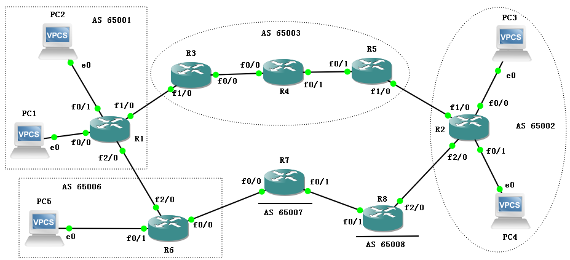
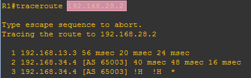
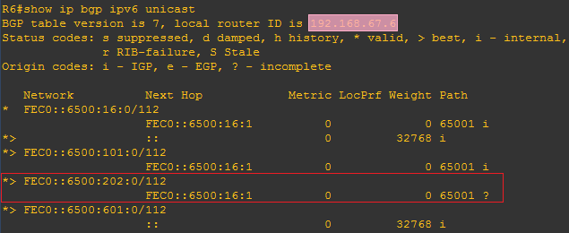

import FileCard from '@site/src/components/FileCard';
import DeadlineProcess from '@site/src/components/DeadlineProcess';
import PlaceHolder from '@site/src/components/PlaceHolder';
import TaskCard from '@site/src/components/TaskCard';
import ScreenshotCard from '@site/src/components/ScreenshotCard';
import ModernInput from '@site/src/components/ModernInput';
import ExportButton from '@site/src/components/ExportButton';
import GridContainer from '@site/src/components/GridContainer';

<h3 style={{color: '#006d75', marginTop: 0, marginBottom: 8}}>实验资源</h3>
<DeadlineProcess start={'2025-12-09 18:50:00'} end={'2025-12-23 23:59:59'}/>

<GridContainer>
    <FileCard file_type={'md'} name={'Lab6 实验报告模板 Markdown版本'} size={'935496'} link={require('@site/assets/templete/md/Lab6 实验报告模板.zip').default} />
    <FileCard file_type={'doc'} name={'Lab6 实验报告模板 Word版本'} size={'1111552'} link={require('@site/assets/templete/word/实验报告模版_实验6.doc').default} />
    <FileCard file_type={'pdf'} name={'Lab6 动态路由协议BGP配置 实验课件'} size={'1721069'} link={require('@site/assets/slides/Lab6_BGP路由协议.pdf').default} />
</GridContainer>

 
:::warning 本实验文档仍在施工，部分内容可能不准确、部分讲解内容缺失、暂时无法导出实验报告，如遇到问题可随时和助教反馈
:::

:::tip 温馨提示

BGP协议的更新需要时间，且最终结果与配置等的时序相关，由于本实验相对较为复杂，基本不可能与示例按完全相同的时序、环境完成实验，因此通常截图中效果与示例会存在出入，因此本实验中你只需要确保**正确进行配置并达成预期效果**即不会被扣除分数，无需与示例保持绝对一致

如果你确实希望截图与示例相似，可尝试开关相关接口/清除BGP信息强制学习状态变化（但可能无效）

:::

## 1 实验目的

在Lab5中我们学习了OSPF协议，它在单个自治系统（AS）内部表现优异，能快速收敛并计算最短路径；然而，当我们要连接全球成千上万个不同的网络时，OSPF就显得力不从心

本次实验我们将探索互联网的基石——边界网关协议（BGP），它是唯一能够处理互联网规模路由的协议，负责在不同的自治系统之间交换路由信息；通过本次实验，你将：
* 深化对距离向量路由协议工作原理的理解
* 理解BGP协议的工作机制
* 掌握配置和调试BGP协议的方法

## 2 实验数据记录和处理

:::important 提示
以下实验记录均需结合屏幕截图，进行文字标注和描述，图片应大小合适、关键部分清晰可见，可直接在图片上进行标注，也可以单独用文本进行描述
:::

<TaskCard number={1} title="设计网络拓扑并规划IP地址" needScreenshot={true} needRecord={false}>

请根据实验拓扑图和地址规划要求，设计好每个PC、路由器各接口的IP地址及掩码，并标注在拓扑图上

1.  **IPv4互联地址**：为了方便记忆与管理，路由器互联接口使用 `192.168.xy.z/24` 的格式
    *   其中 `x` 和 `y` 是相连两台路由器的编号（小号在前，大号在后）
    *   `z` 是本路由器编号
    *   例如：R1连接R3的f1/0接口IP为 `192.168.13.1/24`，R3连接R1的f1/0接口IP为 `192.168.13.3/24`
2.  **IPv4终端地址**：PC与路由器的连接使用私网地址 `10.0.x.y/24`
    *   其中 `x` 为子网号，`y` 为主机地址
3.  **IPv6地址**：
    *   R1、R2、R6的f0/1接口，R1、R6的f2/0接口，以及PC2、PC4、PC5配置IPv6地址（其余部分均只配置IPv4地址）
    *   使用站点本地地址（Site-Local Address），格式为 `FEC0::x:y:z/112`
    *   其中 `x`、`y` 为子网号，`z` 为主机地址
    *   **注意**：`FEC0::/10` 前缀相当于IPv4的私网地址；接口配置后会自动生成 `FE80::/10` 的链路本地地址（Link-Local Address），路由器之间通常使用Link-Local地址作为下一跳

<ScreenshotCard 
  questionId="Lab6-p0-s1" 
  title="网络拓扑图及IP地址规划" 
  uploadOptions={[
    { id: 'topology', label: '上传标注IP地址的拓扑图' }
  ]}
>

</ScreenshotCard>
</TaskCard>

背景知识：iBGP与eBGP的区别

BGP协议根据邻居所属的自治系统（AS）不同，有两种运行模式：**eBGP（External BGP）**和**iBGP（Internal BGP）**，虽然它们使用的是同一种协议语言，报文格式也完全相同，但它们在路由传递的规则和运行机制上却有着天壤之别，这种差异主要源于**防环机制**的不同；为了防止路由环路，BGP在不同场景下采用了截然不同的策略：

| 特性 | eBGP (External BGP) | iBGP (Internal BGP) |
| :--- | :--- | :--- |
| **应用场景** | 不同自治系统之间 | 同一个自治系统内部 |
| **防环机制** | **AS_PATH**：接收到的路由若包含自己的AS号则丢弃 | **水平分割**：从iBGP邻居学到的路由，不传给其他iBGP邻居 |
| **TTL值** | 默认为1 (要求物理直连) | 默认为255 (允许跨多跳) |
| **路由修改** | 转发时会修改下一跳 (Next-Hop) 为自己 | 转发时**保留原始下一跳**不变 |

在eBGP中，AS之间天然具有物理分界，路由每经过一个AS都会盖上AS号，一旦路由器收到包含自己AS号的路由就会丢弃，完美防环；但在iBGP内部，路由是在同一个AS内传递，AS_PATH属性不会发生变化，这就导致AS内部极易产生路由环路；因此，BGP制定了严格的**iBGP水平分割原则**：从一个iBGP邻居学到的路由信息，禁止再转发给其他的iBGP邻居

### 2.1  配置iBGP

我们需要在AS 65003**内部**建立BGP连接，即iBGP，但BGP自身并不具备自动发现邻居和寻找到达邻居路径的能力，因此在建立BGP会话之前我们必须先配置底层的内部网关协议（IGP），这里我们使用上个实验用到的OSPF

<TaskCard number={2} title="配置R3、R4、R5的OSPF动态路由" needScreenshot={false} needRecord={true}>

背景知识：为什么配置BGP之前必须先配置OSPF？（Underlay与Overlay的概念）

在看到这个步骤后你可能会想，我们不是做过OSPF实验了吗，OSPF怎么还在追我？（划掉）既然BGP是路由协议，为什么它不能像OSPF一样自己发现邻居、自己计算路径，反而需要先运行一个OSPF呢；这涉及到网络架构中**底层网络**（**Underlay**）与**覆盖网络**（**Overlay**）的根本区别；BGP与OSPF、RIP等协议在工作机制上有着本质不同，BGP是应用层路由协议，它使用TCP端口179来建立连接；这意味着两台路由器想要建立BGP邻居，首先必须建立一条TCP连接，而TCP连接建立的硬性前提是：双方的IP地址在网络层必须已经是连通的

在同一个自治系统（AS）内部（即iBGP场景），路由器往往不是物理直连的，例如本实验中的R3和R5，它们中间隔着路由器R4；如果我们希望在R3和R5的Loopback接口之间建立一条稳定、不受物理接口翻动影响的TCP连接，R3就必须在发起TCP连接请求之前，已经在路由表中拥有了到达R5 Loopback接口的路由条目，否则TCP SYN包根本无法发出；而这些AS内部的基础路由可达性，BGP自身无法提供（这会陷入“先有鸡还是先有蛋”的死循环），必须依赖OSPF这样的内部网关协议（IGP）来计算和打通

因此，OSPF在这里扮演了**Underlay**的角色，负责提供基础设施的互联互通，确保AS内部的每一台路由器都能ping通彼此的Loopback接口，打好地基；而BGP则是运行在Underlay之上的**Overlay**网络，负责承载庞大的客户路由和业务数据；如果把网络比作物流系统，那么OSPF负责的是连通工业园区的厂区内部路，而BGP负责在园区之间规划卡车的运输路线（业务路由传递），二者各司其职，缺一不可

1.  分别进入R3、R4、R5的全局配置模式
2.  为各路由器的回环接口（Loopback 0）和物理接口配置正确的IP地址并激活（命令：`interface loopback 0`，`ip address [ip] [mask]`）
3.  启用OSPF路由协议（命令：`router ospf [process-id]`），其中进程ID请设置为学号的后2位（全0者往前取值）
4.  使用`network`命令宣告所有直连网段到骨干区域Area 0（命令：`network [network-address] [wildcard-mask] area 0`），确保AS 65003内部的IP连通性

<ScreenshotCard 
  questionId="Lab6-p1-s2" 
  title="R3配置命令" 
  uploadOptions={[
    { id: 'r3_config', label: '记录R3配置命令', type: 'text', textConfig: {initialContent: "R3(config)# interface f0/0\nR3(config-if)# \nR3(config-if)# \nR3(config)# interface f1/0\nR3(config-if)# \nR3(config-if)# \nR3(config)# interface loopback 0\nR3(config-if)# \nR3(config)# router ospf\nR3(config-router)# ", codeEditor: true, initialLines: 10} },
    { id: 'r4_config', label: '记录R4配置命令', type: 'text', textConfig: {initialContent: "R4(config)# interface f0/0\nR4(config-if)# \nR4(config-if)# \nR4(config)# interface f0/1\nR4(config-if)# \nR4(config-if)# \nR4(config)# interface loopback 0\nR4(config-if)# \nR4(config)# \nR4(config-router)# ", codeEditor: true, initialLines: 10} },
    { id: 'r5_config', label: '记录R5配置命令', type: 'text', textConfig: {initialContent: "R5(config)# interface f0/1\nR5(config-if)# \nR5(config-if)# \nR5(config)# interface f1/0\nR5(config-if)# \nR5(config-if)# \nR5(config)# interface loopback 0\nR5(config-if)# \nR5(config)# \nR5(config-router)# ", codeEditor: true, initialLines: 10} }
  ]}
/>

</TaskCard>

<TaskCard number={3} title="查看路由表并测试连通性" needScreenshot={true} needRecord={false}>

确保底层的IGP（OSPF）工作正常是BGP建立的前提，我们需要验证R3能否Ping通R5的回环口，因为我们稍后将使用这个回环口来建立BGP会话

1.  使用 `show ip route` 查看R3、R4、R5的路由表，确认OSPF路由（标记为O）已正常学习到
    <ScreenshotCard 
      questionId="Lab6-p1-s3" 
      title="路由表示例" 
      uploadOptions={[
        { id: 'r3_route', label: '截图R3路由表' },
        { id: 'r4_route', label: '截图R4路由表' },
        { id: 'r5_route', label: '截图R5路由表' }
      ]}
    >
      
    </ScreenshotCard>
2.  在R3上使用带源地址的Ping命令测试与R5的回环口连通性（命令：`ping [R5-Loopback-IP] source loopback 0`），只有当Ping通时，后续的BGP TCP连接才能建立
    <ScreenshotCard 
      questionId="Lab6-p1-s3" 
      title="Ping测试示例" 
      uploadOptions={[
        { id: 'ping_result', label: '截图R3→R5 Ping结果' }
      ]}
    >
      
    </ScreenshotCard>

</TaskCard>

<TaskCard number={4} title="配置R3和R5的BGP邻居关系" needScreenshot={false} needRecord={true}>

背景知识：iBGP防环机制与全互联要求

在iBGP内部，路由是在同一个AS内传递，AS_PATH属性不会发生变化，这就导致AS内部极易产生路由环路；因此，BGP制定了严格的**iBGP水平分割原则**：从一个iBGP邻居学到的路由信息，禁止再转发给其他的iBGP邻居；这意味着，如果R3通过iBGP把路由传给了R4，R4是绝对不会再传给R5的，这会导致路由传递中断；为了解决这个问题，我们在AS内部要求所有运行BGP的路由器必须建立**全互联**（**Full Mesh**）的邻居关系，即R3不仅要和R4建邻居，还得直接和R5建邻居，确保每一台路由器都能直接从源头收到路由更新

值得注意的是，全互联并不是唯一的解决方式；对于我们这个只有3台路由器的AS 65003来说这很容易（3条连接），但想象一下拥有1000台路由器的电信级网络，需要建立的TCP会话数量将高达 **N×(N-1)/2**，即近50万个连接！这会瞬间耗尽路由器的CPU和内存资源，且配置维护工作量巨大；为了解决这个问题，现实世界的网络（非本实验环境）通常会引入**路由反射器（Route Reflector, RR）**，作为特权打破者被允许将从iBGP邻居学到的路由转发给其他iBGP邻居；这样所有普通路由器只需和RR建立连接，大大减少了会话数量；虽然本实验规模较小采用了全互联模式，但你需要知道在大型网络中打破水平分割限制的RR才是常态

为了保证iBGP会话的稳定性，使用**Loopback接口**建立邻居是比较稳妥的选择；物理链路在实际网络中非常脆弱，光纤抖动都会导致IP不可达，进而导致BGP会话中断（Session Flap）和全网路由震荡；而Loopback接口只要路由器还开机就永远处于Up状态，配合OSPF的多路径冗余能力，即使物理链路断了一条，只要还有备用路径，BGP会话就能保持稳定

1.  在R3和R5上启动BGP协议（命令：`router bgp 65003`），因为在相同的AS，我们应该配置相同的AS
2.  使用 `network` 命令宣告各自直连的网络（命令：`network [ip-address] mask [subnet-mask]`）
3.  添加邻居（命令：`neighbor [Remote-IP] remote-as 65003`），此处**Remote-IP**应填写对方的Loopback接口IP地址

<ScreenshotCard 
  questionId="Lab6-p1-s4" 
  title="R3配置命令示例" 
  uploadOptions={[
    { id: 'r3_bgp_config', label: '记录R3 BGP配置命令', type: 'text', textConfig: {initialContent: "R3(config)# \nR3(config-router)# \nR3(config-router)# \nR3(config-router)# ",codeEditor: true, initialLines: 4} },
    { id: 'r5_bgp_config', label: '记录R5 BGP配置命令', type: 'text', textConfig: {initialContent: "R5(config)# \nR5(config-router)# \nR5(config-router)# \nR5(config-router)# ",codeEditor: true, initialLines: 4} }
  ]}
>
   
</ScreenshotCard>

</TaskCard>

<TaskCard number={5} title="查看BGP邻居关系并排查连接问题" needScreenshot={true} needRecord={false}>

背景知识：BGP—《生活在TCP上》

在配置BGP邻居时，你可能会感到奇怪：RIP使用UDP（端口520），OSPF直接封装在IP包中（协议号89），为什么BGP反而要使用普通的**TCP**（**端口179**）来建立连接？这看起来好像不如OSPF“底层”和高效

根本原因在于**数据量与可靠性**，RIP和OSPF通常只在几十台、几百台路由器的网络中运行，路由信息量相对较小；而BGP承载的是整个互联网的路由表，目前已超过**132万条**前缀，如果BGP像OSPF一样直接在IP层广播LSA，不仅会瞬间塞满带宽，而且其较大的数据也要求BGP自己去实现复杂的报文分片、重传、确认和流控机制

<iframe class="cf-radar-embed" width="800" height="438" src="https://radar.cloudflare.com/embed/BgpRoutingStats?locale=zh-CN&widgetState=%7B%7D&ref=%2Fzh-cn%2Frouting" title="Cloudflare Radar - 路由统计信息" loading="lazy" style={{border: 0, width: '100%'}}></iframe>

那么此时最聪明的设计必然就是“偷懒”了：既然TCP已经提供了完美的可靠传输、滑动窗口流控和分片重组功能，我们为什么不直接利用它呢？通过建立TCP连接，BGP只需要关注路由策略本身，而将“如何保证132万条路由一条不漏地传给对方”这个艰巨任务甩锅给了TCP，这也是为什么BGP建立邻居必须单播指定IP（Unicast），而不能像OSPF那样通过组播自动发现（Multicast）的原因

背景知识：BGP状态机

在检查BGP邻居状态时， **Active** 这个单词非常具有误导性，英语中Active意味着“活跃、积极”，听起来还不错，对吧？但在BGP的状态机中，**Active 是一个坏状态**，为了更好地理解BGP的运行情况，我们不妨详细了解一下BGP状态机

BGP的状态流转通常是：`Idle`（初始） -> `Connect`（尝试TCP三次握手） -> `OpenSent`（握手成功，发送参数） -> `OpenConfirm`（参数确认） -> `Established`（成功建立），简化的状态机图如下；其中Idle（空闲）是初始状态，表示路由器正在查找路由表以确定如何到达邻居；Connect（连接）和Active（活跃）容易混淆，Connect表示正在尝试发起TCP三次握手，而Active通常表示TCP连接建立失败正在重试；如果你看到邻居状态长期停留在Active，这通常意味着网络不可达或配置错误

成功建立TCP连接后，会进入OpenSent和OpenConfirm状态，双方开始交换Open报文，协商版本、AS号、Hold Time等参数；只有当参数协商一致且没有任何错误时，才会最终进入**Established**（**已建立**）状态，此时双方才开始真正交换路由更新（Update报文）

仅仅配置了`neighbor`命令并不意味着邻居关系就能建立，BGP基于TCP连接且对安全性要求较高，源IP地址的匹配至关重要，我们来观察一下直接建立邻居会发生什么问题

1.  在R3上使用命令查看BGP邻居关系（命令：`show ip bgp neighbor`），观察得知，邻居的IP是<ModernInput size="large" questionId="Lab6-p1-s5-r3-ip"/>，链路类型属于<ModernInput size="medium" questionId="Lab6-p1-s5-r3-type"/>，状态是<ModernInput size="medium" questionId="Lab6-p1-s5-r3-state"/>，但现象是没有活动的TCP连接
    <ScreenshotCard 
      questionId="Lab6-p1-s5" 
      title="R3邻居关系示例" 
      uploadOptions={[
        { id: 'r3_neighbor', label: '截图R3邻居关系' }
      ]}
    >
      
    </ScreenshotCard>
2.  在R5上使用命令查看BGP邻居关系（命令：`show ip bgp neighbor`），观察得知，邻居的IP是<ModernInput size="large" questionId="Lab6-p1-s5-r5-ip"/>，链路类型属于<ModernInput size="medium" questionId="Lab6-p1-s5-r5-type"/>，状态是<ModernInput size="medium" questionId="Lab6-p1-s5-r5-state"/>，但现象是没有活动的TCP连接
    <ScreenshotCard 
      questionId="Lab6-p1-s5" 
      title="R5邻居关系示例" 
      uploadOptions={[
        { id: 'r5_neighbor', label: '截图R5邻居关系' }
      ]}
    />
3.  观察发现状态始终无法到达 `Established`，此时开启调试开关（命令：`debug ip bgp`），查看控制台输出的错误信息，可见错误原因是被对方拒绝连接，是因为R3默认使用了**物理出接口**的IP地址作为源地址，而R5配置的邻居地址是R3的<ModernInput size="medium" questionId="Lab6-p1-s5-interface"/>，因邻居地址不符被拒绝
    <ScreenshotCard 
      questionId="Lab6-p1-s5" 
      title="调试信息示例" 
      uploadOptions={[
        { id: 'debug_msg', label: '截图Debug信息' }
      ]}
    >
      
    </ScreenshotCard>
4.  观察完毕后，务必关闭调试（命令：`no debug ip bgp`），以免消耗过多系统资源/干扰截图

</TaskCard>

<TaskCard number={6} title="设置BGP更新源并验证邻居关系" needScreenshot={true} needRecord={true}>

背景知识：更新源与BGP的安全性检查

BGP作为互联网路由的神经系统，承载着全球一百余万条核心路由，任何错误的路由注入都可能瞬间导致网络瘫痪或流量劫持在全球传播，为了确保路由信息的绝对可信，BGP在建立邻居关系时身份验证是必要的

BGP邻居的建立过程，本质上就是两个IP地址之间建立TCP连接的过程，而BGP为了安全性，对TCP连接的双方身份有着极其严格的校验机制；当你配置了命令 `neighbor 5.5.5.5 remote-as 65003` 时，你的路由器就处于一种“既严苛又专一”的状态，它在等待TCP连接时，会检查进入的TCP SYN包的**源IP地址**，如果源IP不是 `5.5.5.5`，它会直接认为这是非法连接并拒绝

然而，在默认情况下，Cisco路由器在发起TCP连接（或发送任何数据包）时，会遵循标准的IP路由规则，即**数据包从哪个接口发出，就使用该接口的IP地址作为源IP**；在本实验中，R3去往R5的Loopback口（5.5.5.5）时，根据OSPF计算的路由，数据包必须从R3的物理接口f0/0发出，因此TCP SYN包的源IP就是物理接口地址 `192.168.34.3`；当这个数据包到达R5时，R5查阅自己的BGP配置表，发现自己等待的是来自 `3.3.3.3` 的连接，而眼前这个 `192.168.34.3` 是个陌生人，于是R5会毫不留情地发送TCP RST（重置）报文拒绝连接，这就是你明明Ping通了却建不起邻居的原因，必须通过 `update-source` 命令强制修改TCP握手的源地址才能解决

为了解决上述源地址不匹配的问题，我们需要强制指定BGP在建立会话时使用Loopback接口的地址作为源地址，这在iBGP配置中是标准操作

1.  分别在R3、R5的BGP进程下，对邻居配置更新源（命令：`neighbor [Neighbor-IP] update-source loopback 0`），设置为回环接口
    <ScreenshotCard 
      questionId="Lab6-p1-s6" 
      title="R3配置命令示例" 
      uploadOptions={[
        { id: 'r3_update_source', label: '记录R3配置命令', type: 'text', textConfig: {initialContent: "R3(config)# \nR3(config-router)# ",codeEditor: true, initialLines: 2} },
        { id: 'r5_update_source', label: '记录R5配置命令', type: 'text', textConfig: {initialContent: "R5(config)# \nR5(config-router)# ",codeEditor: true, initialLines: 2} }
      ]}
    >
      
    </ScreenshotCard>
2.  等待几十秒，在R3上使用 `show ip bgp neighbor` 查看邻居关系，确认状态是否变为 `ESTAB`（已建立）；观察得知，与R5的邻居关系已经建立，对方的连接端口是<ModernInput size="medium" questionId="Lab6-p1-s6-r3-port"/>
    <ScreenshotCard 
      questionId="Lab6-p1-s6" 
      title="R3邻居关系示例" 
      uploadOptions={[
        { id: 'r3_neighbor', label: '截图R3邻居关系' }
      ]}
    >
      
    </ScreenshotCard>
3.  在R5上使用 `show ip bgp neighbor` 查看邻居关系，确认状态是否变为 `Established`（已建立）；观察得知，与R3的邻居关系已经建立，对方的连接端口是<ModernInput size="medium" questionId="Lab6-p1-s6-r5-port"/>
    <ScreenshotCard 
      questionId="Lab6-p1-s6" 
      title="R5邻居关系示例" 
      uploadOptions={[
        { id: 'r5_neighbor_established', label: '截图R5邻居关系' }
      ]}
    >
      
    </ScreenshotCard>

</TaskCard>

<TaskCard number={7} title="查看BGP数据库和路由表" needScreenshot={true} needRecord={false}>

背景知识：BGP路由状态与管理距离

在路由器的核心逻辑中，当针对同一个目标网络存在多种来源不同的路由协议时，我们必须有一个标准来确定“谁更可信”，这个标准就是我们在前几个实验反复提到的**管理距离（Administrative Distance, AD）**，AD值越小代表可信度越高；而比较有趣的是在管理距离方面Cisco路由器对iBGP和eBGP有着区别对待：

| 路由协议 | 默认管理距离 (AD) | 信任程度解读 |
| :--- | :--- | :--- |
| **Connected** (直连) | 0 | 绝对可信 |
| **Static** (静态) | 1 | 管理员指定的真理 |
| **eBGP** | **20** | 外部权威路由，优先于内部协议 |
| **OSPF** | 110 | 内部标准协议 |
| **iBGP** | **200** | 内部传递的外部路由，信任度最低 |

为什么iBGP的信任度（200）要比OSPF（110）低这么多？这很大程度上是处于**防环**和**递归查找**的考虑；iBGP路由的下一跳通常不是直连的，需要依赖IGP（如OSPF）来递归查找物理出接口；如果iBGP的AD值小于OSPF，那么当路由器通过iBGP学到一条指向AS内部某个路由器的路由时（例如AS内的互联接口），它会优先将这条iBGP路由放入路由表，覆盖掉OSPF的路由；这会导致递归查找失败或逻辑死循环

因此，我们必须强行规定：在AS内部，底层的IGP（OSPF）拥有绝对的权威；任何通过iBGP学到的、但OSPF也知道的路由（通常是AS内的直连网段），都必须给OSPF让路；这种BGP因为AD值竞争失败而无法写入路由表的现象，就被称为**RIB-Failure**，它在 `show ip bgp` 中用状态码 `r` 标记；这并不是错误，而是一种健康的保护机制，确保底层网络的稳定性优于上层业务路由

1.  在R3上使用 `show ip bgp` 命令查看BGP数据库，标注iBGP路由；观察可知，存在<ModernInput size="small" questionId="Lab6-p1-s7-r3-count"/>条状态码=r的路由（表示没有成功写入路由表）
    <ScreenshotCard 
      questionId="Lab6-p1-s7" 
      title="R3 BGP数据库示例" 
      uploadOptions={[
        { id: 'r3_bgp_db', label: '截图R3 BGP数据库' }
      ]}
    >
      
    </ScreenshotCard>
2.  在R5上使用 `show ip bgp` 命令查看BGP数据库，标出iBGP路由
    <ScreenshotCard 
      questionId="Lab6-p1-s7" 
      title="R5路由表示例" 
      uploadOptions={[
        { id: 'r5_route_table', label: '截图R5路由表' }
      ]}
    />
3.  在R3上使用 `show ip route` 查看路由表；观察可知，网络地址<ModernInput size="large" questionId="Lab6-p1-s7-r3-net1"/>、<ModernInput size="large" questionId="Lab6-p1-s7-r3-net2"/>在路由表中已存在比BGP优先级高的OSPF路由，所以BGP的路由信息没有成功写入
    <ScreenshotCard 
      questionId="Lab6-p1-s7" 
      title="R3路由表示例" 
      uploadOptions={[
        { id: 'r3_route_table', label: '截图R3路由表' }
      ]}
    >
      
    </ScreenshotCard>
4.  在R5上使用 `show ip route` 查看路由表，标出BGP数据库中存在但优先级更高的OSPF路由
    <ScreenshotCard 
      questionId="Lab6-p1-s7" 
      title="R5 BGP数据库示例" 
      uploadOptions={[
        { id: 'r5_bgp_db', label: '截图R5 BGP数据库' }
      ]}
    />

</TaskCard>

### 2.2  配置eBGP

现在我们将扩展网络，配置不同自治系统（AS）之间的连接，这称为外部BGP（eBGP）

<TaskCard number={8} title="配置R1、R2、R6、R7、R8的eBGP" needScreenshot={false} needRecord={true}>

背景知识：BGP也有“买路钱”——Transit与Peering

为什么连接不同AS需要BGP，而不能直接用OSPF互联？除了两种协议能够承载复杂度的差异外，背后也反映了**互联网的经济逻辑**；OSPF追求“最短路径”，但商业网络中“最短”往往不等于“最省钱”或“合法”，互联网连接主要分为两种商业模式：

1.  **转接（Transit）**：这是一种**付费**关系；像我们家庭宽带接入ISP，或者小ISP接入骨干网ISP，下游必须向上游支付“买路钱”，上游才会把全网的路由表发给你，允许你访问整个互联网
2.  **对等（Peering）**：这是一种**免费**关系，两个规模相当的内容商或ISP（例如腾讯和阿里，或中国电信和AT&T）直接拉光纤互联，因为流量相互抵消且对双方都有益，所以通常不收费，但这种连接是**私有**的，双方只交换自己的用户路由，绝不会帮对方转发去往第三方的流量（因为没钱赚）

BGP之所以复杂，是因为它必须提供足够多的属性（如Local Preference）来执行这些合同：**“如果有免费的Peering路，绝对不走付费的Transit路”**，即使Transit的物理距离短一点，BGP是目前唯一能承载这些金钱与策略关系的协议

1.  分别在R1、R2、R6、R7、R8上激活路由器互联的接口，并配置正确的IP地址
2.  启用BGP协议（命令：`router bgp [AS-Number]`），注意每个路由器应按拓扑图配置属于自己AS的AS号（例如R1为65001）
3.  使用 `network [network] mask [subnet-mask]` 命令宣告所有直连网络
4.  添加邻居（命令：`neighbor [Direct-IP] remote-as [Remote-AS]`），注意此处IP为对方直连物理接口的IP，AS号为对方的AS号

<ScreenshotCard 
  questionId="Lab6-p2-s8" 
  title="R1配置命令示例" 
  uploadOptions={[
    { id: 'r1_config', label: '记录R1配置命令', type: 'text', textConfig: {codeEditor: true, initialLines: 11} },
    { id: 'r2_config', label: '记录R2配置命令', type: 'text', textConfig: {initialContent: "R2(config)# interface f1/0\nR2(config-if)# \nR2(config-if)# \nR2(config)# interface f2/0\nR2(config-if)# \nR2(config-if)# \nR2(config)# \nR2(config-router)# \nR2(config-router)# \nR2(config-router)# \nR2(config-router)# ",codeEditor: true, initialLines: 11} },
    { id: 'r6_config', label: '记录R6配置命令', type: 'text', textConfig: {initialContent: "R6(config)# interface f0/0\nR6(config-if)# \nR6(config-if)# \nR6(config)# interface f2/0\nR6(config-if)# \nR6(config-if)# \nR6(config)# \nR6(config-router)# \nR6(config-router)# \nR6(config-router)# \nR6(config-router)# ",codeEditor: true, initialLines: 11} },
    { id: 'r7_config', label: '记录R7配置命令', type: 'text', textConfig: {initialContent: "R7(config)# interface f0/0\nR7(config-if)# \nR7(config-if)# \nR7(config)# interface f0/1\nR7(config-if)# \nR7(config-if)# \nR7(config)# \nR7(config-router)# \nR7(config-router)# \nR7(config-router)# \nR7(config-router)# ",codeEditor: true, initialLines: 11} },
    { id: 'r8_config', label: '记录R8配置命令', type: 'text', textConfig: {initialContent: "R8(config)# interface f0/1\nR8(config-if)# \nR8(config-if)# \nR8(config)# interface f2/0\nR8(config-if)# \nR8(config-if)# \nR8(config)# \nR8(config-router)# \nR8(config-router)# \nR8(config-router)# \nR8(config-router)# ",codeEditor: true, initialLines: 11} }
  ]}
>
   
</ScreenshotCard>

</TaskCard>

<TaskCard number={9} title="配置R3和R5的外部BGP邻居" needScreenshot={false} needRecord={true}>

AS 65003是一个中转AS，我们需要在边界路由器R3和R5上配置对外的eBGP连接，使其分别连接到AS 65001（R1）和AS 65002（R2）注意此处是eBGP连接，应使用物理直连IP地址

1.  在R3上配置与R1的eBGP邻居关系，R1的AS号为65001（命令：`neighbor [R1-IP] remote-as 65001`）
2.  在R5上配置与R2的eBGP邻居关系，R2的AS号为65002（命令：`neighbor [R2-IP] remote-as 65002`）

<ScreenshotCard 
  questionId="Lab6-p2-s9" 
  title="R3配置命令示例" 
  uploadOptions={[
    { id: 'r3_ebgp_config', label: '记录R3配置命令', type: 'text', textConfig: {initialContent: "R3(config)# \nR3(config-router)# ",codeEditor: true, initialLines: 2} }, 
    { id: 'r5_ebgp_config', label: '记录R5配置命令', type: 'text', textConfig: {initialContent: "R5(config)# \nR5(config-router)# ",codeEditor: true, initialLines: 2} }
  ]}
>
</ScreenshotCard>

</TaskCard>

<TaskCard number={10} title="查看各路由器的BGP邻居关系" needScreenshot={true} needRecord={false}>

背景知识：BGP的迟钝与增量更新机制

习惯了RIP每30秒广播一次完整路由表或是OSPF周期性刷新LSA的同学，初次接触BGP时往往会对它的安静与迟钝感到不适应，一旦BGP邻居建立并完成了初次的全量路由交换，只要网络拓扑没有变化，它们之间可能几天几夜都不会交换任何路由更新报文，只靠微小的Keepalive包维持心跳，这就是BGP的**增量更新**机制，考虑到互联网路由表极其庞大，如果像RIP那样周期性发送完整路由表，全球骨干网的带宽瞬间就会被路由更新耗尽，根本无法传输用户数据，因此BGP的设计哲学是“No news is good news”，路由器只在网络发生变化时才发送Update报文，且只包含变化的那一条路由，这种机制赋予了BGP极高的扩展性，但也意味着一旦发生隐性故障排查起来会比周期性协议困难得多

除了安静，BGP还显得反应迟缓，默认情况下Keepalive时间是60秒，Hold Time超时时间更是长达180秒，这意味着如果一条网线断了且没有物理层报警，BGP可能需要整整3分钟才会意识到邻居故障并开始切换路由（因此实验中“等待一会儿”可能真的需要等待比较久），这种看似迟钝的设计其实是为了互联网的绝对稳定性，全球BGP路由表已超过90万条，如果像OSPF那样稍有风吹草动就立刻计算拓扑，全球的路由器将时刻处于震荡之中，CPU根本承受不住，所以BGP宁可收敛慢一点也要保证稳定；当然在有需要时，BGP也能做到足够灵敏，在现代数据中心内部，我们可以利用BFD技术可以将故障检测时间缩短到毫秒级

配置完成后，逐一检查各路由器的邻居状态，确保所有直连的AS边界都已建立起正常的会话（State为Established）

1. 在R1上查看邻居关系（命令：`show ip bgp neighbor`），标出Link类型和对方的IP、连接状态（找出关键信息进行截图）；观察可知，R1的两个邻居的IP分别为<ModernInput size="large" questionId="Lab6-p2-s10-r1-ip1"/>、<ModernInput size="large" questionId="Lab6-p2-s10-r1-ip2"/>，链路类型均为<ModernInput size="medium" questionId="Lab6-p2-s10-r1-type"/>
    <ScreenshotCard 
      questionId="Lab6-p2-s10" 
      title="R1邻居关系示例" 
      uploadOptions={[
        { id: 'r1_neighbor1', label: '截图R1邻居关系1' },
        { id: 'r1_neighbor2', label: '截图R1邻居关系2' }
      ]}
    >
        
        
    </ScreenshotCard>
2. 在R2上查看邻居关系（命令：`show ip bgp neighbor`），标出Link类型和对方的IP、连接状态（找出关键信息进行截图）；观察可知，R2邻居的IP分别为<ModernInput size="large" questionId="Lab6-p2-s10-r2-ip1"/>、<ModernInput size="large" questionId="Lab6-p2-s10-r2-ip2"/>，链路类型均为<ModernInput size="medium" questionId="Lab6-p2-s10-r2-type"/>
    <ScreenshotCard 
      questionId="Lab6-p2-s10" 
      title="R2邻居关系示例" 
      uploadOptions={[
        { id: 'r2_neighbor1', label: '截图R2邻居关系1' },
        { id: 'r2_neighbor2', label: '截图R2邻居关系2' }
      ]}
    />
3. 在R3上查看邻居关系（命令：`show ip bgp neighbor`），标出Link类型和对方的IP、连接状态（找出关键信息进行截图）；观察可知，R3的iBGP邻居的IP为<ModernInput size="large" questionId="Lab6-p2-s10-r3-igp"/>，eBGP邻居的IP为<ModernInput size="large" questionId="Lab6-p2-s10-r3-ebgp"/>
    <ScreenshotCard 
      questionId="Lab6-p2-s10" 
      title="R3邻居关系示例" 
      uploadOptions={[
        { id: 'r3_neighbor1', label: '截图R3邻居关系1' },
        { id: 'r3_neighbor2', label: '截图R3邻居关系2' }
      ]}
    >
        
        
    </ScreenshotCard>
4. 在R5上查看邻居关系（命令：`show ip bgp neighbor`），标出Link类型和对方的IP、连接状态（找出关键信息进行截图）；观察可知，R5的iBGP邻居的IP为<ModernInput size="large" questionId="Lab6-p2-s10-r5-igp"/>，eBGP邻居的IP为<ModernInput size="large" questionId="Lab6-p2-s10-r5-ebgp"/>
    <ScreenshotCard 
      questionId="Lab6-p2-s10" 
      title="R5邻居关系示例" 
      uploadOptions={[
        { id: 'r5_neighbor1', label: '截图R5邻居关系1' },
        { id: 'r5_neighbor2', label: '截图R5邻居关系2' }
      ]}
    />
5. 在R6上查看邻居关系（命令：`show ip bgp neighbor`），标出Link类型和对方的IP、连接状态（找出关键信息进行截图）；观察可知，R6的两个邻居的IP分别为<ModernInput size="large" questionId="Lab6-p2-s10-r6-ip1"/>、<ModernInput size="large" questionId="Lab6-p2-s10-r6-ip2"/>，链路类型均为<ModernInput size="medium" questionId="Lab6-p2-s10-r6-type"/>
    <ScreenshotCard 
      questionId="Lab6-p2-s10" 
      title="R6邻居关系示例" 
      uploadOptions={[
        { id: 'r6_neighbor1', label: '截图R6邻居关系1' },
        { id: 'r6_neighbor2', label: '截图R6邻居关系2' }
      ]}
    />
6. 在R7上查看邻居关系（命令：`show ip bgp neighbor`），标出Link类型和对方的IP、连接状态（找出关键信息进行截图）；观察可知，R7的两个邻居的IP分别为<ModernInput size="large" questionId="Lab6-p2-s10-r7-ip1"/>、<ModernInput size="large" questionId="Lab6-p2-s10-r7-ip2"/>，链路类型均为<ModernInput size="medium" questionId="Lab6-p2-s10-r7-type"/>
    <ScreenshotCard 
      questionId="Lab6-p2-s10" 
      title="R7邻居关系示例" 
      uploadOptions={[
        { id: 'r7_neighbor1', label: '截图R7邻居关系1' },
        { id: 'r7_neighbor2', label: '截图R7邻居关系2' }
      ]}
    />
7. 在R8上查看邻居关系（命令：`show ip bgp neighbor`），标出Link类型和对方的IP、连接状态（找出关键信息进行截图）；观察可知，R8的两个邻居的IP分别为<ModernInput size="large" questionId="Lab6-p2-s10-r8-ip1"/>、<ModernInput size="large" questionId="Lab6-p2-s10-r8-ip2"/>，链路类型均为<ModernInput size="medium" questionId="Lab6-p2-s10-r8-type"/>
    <ScreenshotCard 
      questionId="Lab6-p2-s10" 
      title="R8邻居关系示例" 
      uploadOptions={[
        { id: 'r8_neighbor1', label: '截图R8邻居关系1' },
        { id: 'r8_neighbor2', label: '截图R8邻居关系2' }
      ]}
    />

</TaskCard>

<TaskCard number={11} title="查看R1的BGP数据库并分析路由" needScreenshot={true} needRecord={false}>

背景知识：BGP选路原则（AS_PATH）

BGP通常被视为路径矢量协议，它的路径并不是我们通常追踪到的路由路径，而是**AS_PATH**属性，在BGP数据库中，AS Path属性记录了路由经过的所有AS号，越短的路径越容易被选为最佳路径（`>`）；AS_PATH在BGP机制中扮演着两个至关重要的角色：第一是**绝对的防环**，路由器在接收路由时会扫描AS_PATH列表，一旦发现自己的AS号已在其中，就说明这条路由在互联网上转了一圈又回来了，为了防止死循环，路由器会直接丢弃该更新

第二是**商业决策导向的选路**，这也是BGP非常独特的一点；与OSPF计算带宽、RIP计算跳数不同，BGP在选路时遵循一套复杂的流程，其中AS_PATH长度是最关键的指标之一：

| 优先级 | 选路属性 | 含义与商业逻辑 |
| :--- | :--- | :--- |
| 1 | Weight | (Cisco私有) 本地权重，完全由管理员手工指定 |
| 2 | Local Preference | 本地优先级，决定流量**离开**本AS时走哪个出口 |
| 3 | Local Origin | 本地始发的路由优先 |
| 4 | **AS_PATH Length** | **经过的AS数量越少越优** |
| 5 | Origin Code | IGP > EGP > Incomplete |
| 6 | MED | 邻居建议的属性，决定流量**进入**本AS时走哪个入口 |

除去前面的本地属性，可以看到对BGP而言最重要的就是AS_PATH依据，通常倾向于选择AS_PATH最短的路径，这反映了非常直接的商业逻辑——虽然“AS跳数少”并不物理上等同于“延迟低”或“带宽大”（因为一个AS内部可能极其庞大且拥堵），但经过的AS越少，需要跨越的运营商也就越少，通常也意味着更低的结算成本（AS间建立BGP Transit往往需要一方爆金币）和更简单的管理关系

1.  等待一会儿，让BGP路由在全网传播收敛
2.  在路由器R1查看BGP数据库（命令：`show ip bgp`），注意观察`Path`一列，标出到达R2-R5间子网、R6-R7间子网、R7-R8间子网以及R2-R8间子网的最佳路由（标记为 > 的为最佳路由），并分析其经过的AS路径是否是最短的；观察可知：
    * 到达R2-R5间子网的下一跳是<ModernInput size="medium" questionId="Lab6-p2-s11-r25-nh"/>，经过的AS路径为<ModernInput size="medium" questionId="Lab6-p2-s11-r25-path"/>
    * 到达R6-R7间子网的下一跳是<ModernInput size="medium" questionId="Lab6-p2-s11-r67-nh"/>，经过的AS路径为<ModernInput size="medium" questionId="Lab6-p2-s11-r67-path"/>
    * 到达R7-R8间子网的路由有<ModernInput size="small" questionId="Lab6-p2-s11-r78-count"/>条，其中最佳路由的下一跳是<ModernInput size="medium" questionId="Lab6-p2-s11-r78-nh"/>，经过的AS路径最短，AS号依次为<ModernInput size="medium" questionId="Lab6-p2-s11-r78-path"/>
    * 到达R8-R2间子网的路由有<ModernInput size="small" questionId="Lab6-p2-s11-r82-count"/>条，其中最佳路由的下一跳是<ModernInput size="medium" questionId="Lab6-p2-s11-r82-nh"/>，经过的AS路径最短，AS号依次为<ModernInput size="medium" questionId="Lab6-p2-s11-r82-path"/>

    <ScreenshotCard 
      questionId="Lab6-p2-s11" 
      title="R1 BGP数据库示例" 
      uploadOptions={[
        { id: 'r1_bgp_db', label: '截图R1 BGP数据库' }
      ]}
    >
        
    </ScreenshotCard>

</TaskCard>

<TaskCard number={12} title="查看R2的BGP数据库并分析路由" needScreenshot={true} needRecord={false}>

在路由器R2查看BGP数据库，标出到达R1-R3间子网、R1-R6间子网、R6-R7间子网以及R7-R8间子网的最佳路由、经过的AS路径；观察可知：
* 到达R1-R3间子网的下一跳是<ModernInput size="medium" questionId="Lab6-p2-s12-r13-nh"/>，经过的AS路径为<ModernInput size="medium" questionId="Lab6-p2-s12-r13-path"/>
* 到达R7-R8间子网的下一跳是<ModernInput size="medium" questionId="Lab6-p2-s12-r78-nh"/>，经过的AS路径为<ModernInput size="medium" questionId="Lab6-p2-s12-r78-path"/>
* 到达R1-R6间子网的路由有<ModernInput size="small" questionId="Lab6-p2-s12-r16-count"/>条，其中最佳路由的下一跳是<ModernInput size="medium" questionId="Lab6-p2-s12-r16-nh"/>，经过的AS路径最短，AS号依次为<ModernInput size="medium" questionId="Lab6-p2-s12-r16-path"/>
* 到达R6-R7间子网的路由有<ModernInput size="small" questionId="Lab6-p2-s12-r67-count"/>条，其中最佳路由的下一跳是<ModernInput size="medium" questionId="Lab6-p2-s12-r67-nh"/>，经过的AS路径最短，AS号依次为<ModernInput size="medium" questionId="Lab6-p2-s12-r67-path"/>

<ScreenshotCard 
  questionId="Lab6-p2-s12" 
  title="R2 BGP数据库示例" 
  uploadOptions={[
    { id: 'r2_bgp_db', label: '截图R2 BGP数据库' }
  ]}
>
</ScreenshotCard>

</TaskCard>

<TaskCard number={13} title="查看R1路由表并验证BGP路由" needScreenshot={true} needRecord={false}>

BGP选择出的最佳路由应该最终被写入到IP路由表中，因此我们可以通过查看路由表验证BGP是否正常工作

在路由器R1上查看路由表（命令：`show ip route`），标出到达R2-R5间子网、R6-R7间子网、R7-R8间子网以及R2-R8间子网的路由，检查它们是否标记为`B`（BGP），且下一跳与BGP数据库一致

<ScreenshotCard 
  questionId="Lab6-p2-s13" 
  title="R1的路由表" 
  uploadOptions={[
    { id: 'r1_route_table', label: '截图R1路由表' }
  ]}
/>

</TaskCard>

<TaskCard number={14} title="查看R2路由表并验证BGP路由" needScreenshot={true} needRecord={false}>

在路由器R2上查看路由表，标出到达R1-R3间子网、R1-R6间子网、R6-R7间子网以及R7-R8间子网的路由，是否与BGP数据库中的最佳路由一致

<ScreenshotCard 
  questionId="Lab6-p2-s14" 
  title="R2的路由表" 
  uploadOptions={[
    { id: 'r2_route_table', label: '截图R2路由表' }
  ]}
/>

</TaskCard>

<TaskCard number={15} title="观察链路故障后的BGP路由切换" needScreenshot={true} needRecord={false}>

BGP具有动态适应网络拓扑变化的能力，我们将通过切断一条链路来验证BGP的自动切换功能

1.  在路由器R6查看BGP数据库，记录当前到达R2-R5间子网的最佳路由、经过的AS路径（应走最短路）；观察可知，到达R2-R5间子网的最佳路由的下一跳为<ModernInput size="large" questionId="Lab6-p2-s15-before"/>
    <ScreenshotCard 
      questionId="Lab6-p2-s15" 
      title="R6 BGP数据库示例" 
      uploadOptions={[
        { id: 'r6_bgp_before', label: '截图断开前R6 BGP数据库' }
      ]}
    >
        
    </ScreenshotCard>
2.  在R1上关闭R1-R3互联端口（命令：`interface f1/0`, `shutdown`），切断通过AS 65003的路径
3.  等待BGP收敛（可能需要几秒到一分钟），在R6上再次查看BGP数据库，观察到达R2-R5间子网的最佳路由是否切换到了备用路径；观察可知，到达R2-R5间子网的最佳路由的下一跳变为<ModernInput size="large" questionId="Lab6-p2-s15-after"/>
    <ScreenshotCard 
      questionId="Lab6-p2-s15" 
      title="R6的BGP数据库变化" 
      uploadOptions={[
        { id: 'r6_bgp_after', label: '截图断开后R6 BGP数据库' }
      ]}
    >
    </ScreenshotCard>

</TaskCard>

### 2.3  路由重分发

在大型网络中，BGP负责AS间的路由，而AS内部的路由器通常只运行IGP（如OSPF），如何让AS内部的普通路由器（不运行BGP的路由器）知道如何到达外部网络，是一个关键问题，本节我们将先体验“路由黑洞”的问题，理解路由重分发的必要性并进行路由重分发

<TaskCard number={16} title="测试路由连通性并追踪路由路径" needScreenshot={true} needRecord={false}>

背景知识：控制与数据层面的脱节——路由黑洞

路由黑洞（Route Blackhole）是BGP网络设计中最经典、也最容易让我们初学者困惑的现象，要理解它，我们不妨把路由器的功能拆分为**控制平面**和**数据平面**两个独立的层面：

*   **控制平面（信令传递）**：R3（入口）和R5（出口）运行了BGP，它们之间通过TCP会话成功建立连接，并交换了外部网络的路由信息；在R3看来，它明确知道“要去往R2的网段，下一跳是R5”，全网的路由表在BGP视图下看起来是连通的
*   **数据平面（报文转发）**：当真正的数据包进入网络时，R3根据BGP路由将数据包转发给它的物理直连下一跳——中间路由器R4；问题就在这里了：R4是AS内部的普通路由器，它只运行了OSPF但没有运行BGP，它的路由表里只有AS内部的路由，压根不知道那些外部的BGP网段（如R2的网段）存在

当R4收到这个目的地址为外部网段的数据包时，它查阅自己的路由表，结果是“查无此人”（Destination Unreachable）；根据路由器的默认行为就只能选择直接丢弃数据包；这就像R3和R5在空中设置了航线（BGP会话）传递信令，但底下的公路（数据转发路径）在R4这里断了，数据包掉进了无底洞，也就是“路由黑洞”，其本质是**中间设备缺乏外部路由信息**导致的转发失败；解决办法通常是将BGP路由引入到IGP中（重分发），或者在AS内部建立全互联的MPLS隧道

1.  重新激活R1-R3之间的端口（命令：`interface f1/0`, `no shutdown`），等待R1重新选择R3作为到达R2-R8间子网的最佳BGP路由，测试R1是否能Ping通R2-R8互联端口
    <ScreenshotCard 
      questionId="Lab6-p3-s16" 
      title="Ping测试示例" 
      uploadOptions={[
        { id: 'ping_result', label: '截图Ping结果' }
      ]}
    >
        
    </ScreenshotCard>
2.  跟踪R1到该子网的路由（命令：`traceroute [ip-addr]`，如果需要提前终止可按Ctrl+6），观察数据包是在哪里丢弃的；观察可知路由追踪在路由器<ModernInput size="medium" questionId="Lab6-p3-s16-router"/>中断了
    <ScreenshotCard 
      questionId="Lab6-p3-s16" 
      title="路由跟踪示例" 
      uploadOptions={[
        { id: 'traceroute_result', label: '截图路由跟踪结果' }
      ]}
    >
        
    </ScreenshotCard>

</TaskCard>

<TaskCard number={17} title="分析R3和R4的路由表" needScreenshot={true} needRecord={false}>

为了深入理解“路由黑洞”，我们来对比一下运行BGP的边界路由器R3和不运行BGP的内部路由器R4的路由表

1.  查看R3的BGP数据库，标记到达R2-R8间子网的BGP最佳路由，确认R3知道如何转发；观察可知，到达R2-R8间子网的最佳路由的下一跳IP地址是<ModernInput size="large" questionId="Lab6-p3-s17-r3-nh"/>
    <ScreenshotCard 
      questionId="Lab6-p3-s17" 
      title="R3 BGP数据库示例" 
      uploadOptions={[
        { id: 'r3_bgp_db', label: '截图R3 BGP数据库' }
      ]}
    >
        
    </ScreenshotCard>
2.  查看R3的路由表，观察可知，到达R2-R8间子网的下一跳IP地址<ModernInput size="large" questionId="Lab6-p3-s17-r3-bgp"/>（属于R2）是由BGP写入的；去往该地址的下一跳IP地址<ModernInput size="large" questionId="Lab6-p3-s17-r3-ospf"/>（属于R4）是由OSPF写入的
    <ScreenshotCard 
      questionId="Lab6-p3-s17" 
      title="R3路由表示例" 
      uploadOptions={[
        { id: 'r3_route_table', label: '截图R3路由表' }
      ]}
    >
        
    </ScreenshotCard>
3.  查看R4的路由表，确认是否存在R2-R8间子网的路由信息；观察可知，由于R4上缺少相应的路由，因此不能Ping通，默认情况下，未启用同步功能，BGP就不会考虑AS内部是否存在相关路由，导致路由黑洞
    <ScreenshotCard 
      questionId="Lab6-p3-s17" 
      title="R4路由表示例" 
      uploadOptions={[
        { id: 'r4_route_table', label: '截图R4路由表' }
      ]}
    >
        
    </ScreenshotCard>

</TaskCard>

<TaskCard number={18} title="启用BGP同步功能并观察路由变化" needScreenshot={true} needRecord={true}>

背景知识：BGP同步规则（Synchronization）

为了从机制上根除“路由黑洞”问题，早期的BGP协议设计者制定了一条极其保守的**同步规则**；这条规则的逻辑是：为了防止中间设备（如R4）因没有路由而丢包，BGP路由器（如R3）在向外（eBGP邻居）通告一条从内部（iBGP邻居）学来的路由之前，必须先检查自己的IGP路由表（OSPF）里是否也存在这条路由；如果IGP里没有，说明AS内部的传输通道还没准备好转发这类流量，那么BGP就应该“保持沉默”，暂停对外通告该路由，从而避免将外部流量**吸引**到一个无法转发的黑洞中

虽然同步规则在逻辑上完美解决了黑洞问题，但在今天的互联网规模下它已不再适用；启用同步意味着必须将全球数十万条BGP路由全部注入到内部的OSPF协议中（重分发），这会瞬间撑爆IGP路由器的内存和CPU，导致网络瘫痪；因此，现代Cisco IOS默认都是关闭同步功能的（`no synchronization`）；在现代网络架构中，我们通常采用**MPLS（多协议标签交换）**或**GRE隧道**技术，在R3和R5之间建立一条“隧道”直接穿过R4，使得R4只需要转发隧道封装包（基于AS内部标签或IP）而无需知道外部路由，从而优雅地解决黑洞问题，我们这里的重分发和开启同步更多处于教学演示原理的需要

1.  分别在R3、R5的BGP进程中打开同步功能（命令：`synchronization`）并等待一会儿（由于OSPF里还没有这条路由，BGP会认为该路由“不同步”而将其抑制，即从路由表中撤销）
    <ScreenshotCard 
      questionId="Lab6-p3-s18" 
      title="R3 配置命令示例" 
      uploadOptions={[
        { id: 'r3_sync_config', label: '记录R3配置命令', type: 'text', textConfig: {initialContent: "R3(config)# \nR3(config-router)# ",codeEditor: true, initialLines: 2} },
        { id: 'r5_sync_config', label: '记录R5配置命令', type: 'text', textConfig: {initialContent: "R5(config)# \nR5(config-router)# ",codeEditor: true, initialLines: 2} }
      ]}
    >
    </ScreenshotCard>
2. 查看R3的BGP数据库；观察可知，到达R2-R8间子网的路由有<ModernInput size="small" questionId="Lab6-p3-s18-r3-count"/>条；其中最佳路由的下一跳为<ModernInput size="large" questionId="Lab6-p3-s18-r3-nh"/>（属于R1），因为同步功能打开后，BGP判断AS内部缺少相应的路由，因此不选择本AS作为转发路径
    <ScreenshotCard 
      questionId="Lab6-p3-s18" 
      title="R3 BGP数据库示例" 
      uploadOptions={[
        { id: 'r3_bgp_sync', label: '截图R3 BGP数据库' }
      ]}
    >
        
    </ScreenshotCard>
3.  查看R3的路由表；观察可知，到达R2-R8间子网的下一跳IP为<ModernInput size="large" questionId="Lab6-p3-s18-r3-rt-ip"/>，属于路由器<ModernInput size="medium" questionId="Lab6-p3-s18-r3-rt-router"/>
    <ScreenshotCard 
      questionId="Lab6-p3-s18" 
      title="R3路由表示例" 
      uploadOptions={[
        { id: 'r3_route_sync', label: '截图R3路由表' }
      ]}
    >
        
    </ScreenshotCard>
4.  查看R1的BGP数据库；观察可知，到达R2-R8间子网的最佳路由的下一跳为<ModernInput size="large" questionId="Lab6-p3-s18-r1-nh"/>，属于路由器<ModernInput size="medium" questionId="Lab6-p3-s18-r1-router"/>；由于使用了水平分裂方式，R3并没有向R1报告关于这个子网的路由，因为R3选的下一跳是R1
    <ScreenshotCard 
      questionId="Lab6-p3-s18" 
      title="R1 BGP数据库示例" 
      uploadOptions={[
        { id: 'r1_bgp_sync', label: '截图R1 BGP数据库' }
      ]}
    >
        
    </ScreenshotCard>
5.  用Ping测试R1到达R2-R8互联端口的联通性，并跟踪路由
    <ScreenshotCard 
      questionId="Lab6-p3-s18" 
      title="Ping测试示例" 
      uploadOptions={[
        { id: 'ping_sync', label: '截图Ping结果' }
      ]}
    >
        
    </ScreenshotCard>
6.  跟踪R1到达R2-R8互联端口的路由；观察可知依次经过了路由器<ModernInput size="medium" questionId="Lab6-p3-s18-tr1"/>、<ModernInput size="medium" questionId="Lab6-p3-s18-tr2"/>、<ModernInput size="medium" questionId="Lab6-p3-s18-tr3"/>、<ModernInput size="medium" questionId="Lab6-p3-s18-tr4"/>
    <ScreenshotCard 
      questionId="Lab6-p3-s18" 
      title="路由跟踪示例" 
      uploadOptions={[
        { id: 'traceroute_sync', label: '截图路由跟踪结果' }
      ]}
    />

</TaskCard>

<TaskCard number={19} title="在OSPF中启用BGP重分发" needScreenshot={true} needRecord={true}>

解决路由黑洞更常见的方法是路由重分发（Redistribution），即将BGP学到的路由注入到IGP（OSPF）中，让内部路由器（R4）知道如何到达外部网络，从而也满足了“同步”的条件

1.  在R3、R5的OSPF协议中启用BGP重分发功能（命令：`router ospf [pid]`，`redistribute bgp [AS-number] subnets`）
    <ScreenshotCard 
      questionId="Lab6-p3-s19" 
      title="R3 配置命令示例" 
      uploadOptions={[
        { id: 'r3_redist_config', label: '记录R3配置命令', type: 'text', textConfig: {initialContent: "R3(config)# \nR3(config-router)# ",codeEditor: true, initialLines: 2} },
        { id: 'r5_redist_config', label: '记录R5配置命令', type: 'text', textConfig: {initialContent: "R5(config)# \nR5(config-router)# ",codeEditor: true, initialLines: 2} }
      ]}
    >
    </ScreenshotCard>
2.  等一会儿，查看R3的OSPF数据库，确认出现了外部LSA；观察可知，OSPF从BGP中重分发了AS外部链路的信息，但是R3-R1的直连网络<ModernInput size="large" questionId="Lab6-p3-s19-r3-net"/>没有被本路由器重分发
    <ScreenshotCard 
      questionId="Lab6-p3-s19" 
      title="R3 OSPF数据库示例" 
      uploadOptions={[
        { id: 'r3_ospf_db', label: '截图R3 OSPF数据库' }
      ]}
    >
        
    </ScreenshotCard>
3.  查看RR5的OSPF数据库，确认出现了外部LSA；观察可知，OSPF从BGP中重分发了AS外部链路的信息，但是R5-R2的直连网络<ModernInput size="large" questionId="Lab6-p3-s19-r5-net"/>没有被本路由器重分发
    <ScreenshotCard 
      questionId="Lab6-p3-s19" 
      title="R5 OSPF数据库示例" 
      uploadOptions={[
        { id: 'r5_ospf_db', label: '截图R5 OSPF数据库' }
      ]}
    >
        
    </ScreenshotCard>
4.  查看R4的路由表是否出现了AS外部的路由信息（O E2 类型）；观察可知，R4上增加了AS外部的路由信息，此时到达R2-R8间子网的下一跳为<ModernInput size="large" questionId="Lab6-p3-s19-r4-nh1"/>和<ModernInput size="large" questionId="Lab6-p3-s19-r4-nh2"/>（优先级相同），因为重分发后OSPF将在AS内部传播BGP的外部路由信息
    <ScreenshotCard 
      questionId="Lab6-p3-s19" 
      title="R4路由表示例" 
      uploadOptions={[
        { id: 'r4_route_redist', label: '截图R4路由表' }
      ]}
    >
        
    </ScreenshotCard>

</TaskCard>

<TaskCard number={20} title="清除BGP信息并观察路由重新选择" needScreenshot={true} needRecord={false}>

背景知识：硬重置与软重置

在本步骤中，我们使用了 `clear ip bgp *` 命令，这是一个**硬重置（Hard Reset）**命令，它会强制**断开**底层的TCP连接，导致所有邻居关系中断、路由表清空，然后重新经历三次握手和漫长的路由交换过程，在生产环境中，这相当于一次小型网络事故，会导致业务瞬间中断

为了避免这种冲击，BGP引入了**软重置（Soft Reset）**机制（命令：`clear ip bgp * soft`）
* **出站软重置**：路由器重新根据策略检查一遍路由表，把符合新策略的路由重新发给邻居（不该发的撤回）
* **入站软重置**（Route Refresh能力）：路由器向邻居发送一个特殊的Refresh报文，请求邻居：“请把你的路由表重新发我一份，我要重新过滤一遍”

整个过程TCP连接不断开，业务流量几乎不受影响，因此在生产环境中除非遇到无法解决的Bug**永远优先使用软重置**，如果使用硬重置玩炸了请不要供出TA（bushi）

重分发生效后，且同步已开启，BGP会检测到IGP路由已存在从而解除抑制，我们需要强制刷新BGP表来观察这一变化

1.  在R3上清除BGP信息（命令：`clear ip bgp *`），强制触发更新
2.  等待一段时间后，在R1上查看BGP数据库观察到达R2-R8间子网的最佳BGP路由（应恢复为指向R3）；观察可知，到达R2-R8间子网的路由有<ModernInput size="small" questionId="Lab6-p3-s20-count"/>条，其中最佳路由的下一跳为<ModernInput size="large" questionId="Lab6-p3-s20-nh"/>（属于路由器<ModernInput size="medium" questionId="Lab6-p3-s20-router"/>）
    <ScreenshotCard 
      questionId="Lab6-p3-s20" 
      title="R1 BGP数据库示例" 
      uploadOptions={[
        { id: 'r1_bgp_clear', label: '截图R1 BGP数据库' }
      ]}
    >
        
    </ScreenshotCard>
3.  查看R1的路由表；观察可知，到达R2-R8间子网的下一跳IP为<ModernInput size="large" questionId="Lab6-p3-s20-rt-ip"/>，属于路由器<ModernInput size="medium" questionId="Lab6-p3-s20-rt-router"/>
    <ScreenshotCard 
      questionId="Lab6-p3-s20" 
      title="R1路由表示例" 
      uploadOptions={[
        { id: 'r1_route_clear', label: '截图R1路由表' }
      ]}
    >
        
    </ScreenshotCard>
4.  在R1上跟踪到达R2-R8间子网的路由，验证路径是否穿越了AS 65003；观察可知，依次经过了路由器<ModernInput size="medium" questionId="Lab6-p3-s18-tr1"/>、<ModernInput size="medium" questionId="Lab6-p3-s18-tr2"/>、<ModernInput size="medium" questionId="Lab6-p3-s18-tr3"/>、<ModernInput size="medium" questionId="Lab6-p3-s18-tr4"/>
    <ScreenshotCard 
      questionId="Lab6-p3-s20" 
      title="路由跟踪示例" 
      uploadOptions={[
        { id: 'traceroute_clear', label: '截图路由跟踪结果' }
      ]}
    >
        
    </ScreenshotCard>

</TaskCard>

<TaskCard number={21} title="在BGP中启用OSPF重分发" needScreenshot={true} needRecord={true}>

背景知识：重分发的双向需求

在配置重分发时，一个常见的认知误区是：“我只要在R3上把BGP重分发进OSPF，R4就能通了”，实际上，通信永远是**双向**的
1.  **去程**：BGP进OSPF -> R4学到了去往外部（R2）的路由 -> R4能把包发出去
2.  **回程**：当R2回复数据包时，数据包到达AS边界R3，R3查表发现目标是R4（内部IP），如果R3没有通过BGP把AS内部的网段（OSPF路由）宣告或重分发出去，外面的R2根本就不知道R4的存在

因此，**路由重分发通常需要双向配置**（或者配合network命令宣告），或者在单向重分发后保证另一方向有默认路由（Default Route）指引，否则就会陷入Ping得出回不来的尴尬局面

双向通信要求双向路由可达；之前我们把BGP注入了OSPF，现在需要反过来将AS内部的路由（如R4 Loopback）注入BGP，通告给外界

1.  在R3上的BGP中启用OSPF路由重分发功能（命令：`router bgp [AS-number]`, `redistribute ospf [pid]`）
    <ScreenshotCard 
      questionId="Lab6-p3-s21" 
      title="R3配置命令示例" 
      uploadOptions={[
        { id: 'r3_bgp_redist_config', label: '记录R3配置命令', type: 'text', textConfig: {initialContent: "R3(config)# \nR3(config-router)# ",codeEditor: true, initialLines: 2} }
      ]}
    />
2.  查看R3的BGP数据库，标记新增的路由信息；观察可知，新增的路由分别是：<ModernInput size="large" questionId="Lab6-p3-s21-net1"/>、<ModernInput size="large" questionId="Lab6-p3-s21-net2"/>、<ModernInput size="large" questionId="Lab6-p3-s21-net3"/>，因为重分发后，BGP将在AS之间传播OSPF的内部路由信息
    <ScreenshotCard 
      questionId="Lab6-p3-s21" 
      title="R3 BGP数据库示例" 
      uploadOptions={[
        { id: 'r3_bgp_ospf_redist', label: '截图R3 BGP数据库' }
      ]}
    >
        
    </ScreenshotCard>
3.  等待一会，在R8上查看BGP数据库，观察AS 65003的内部相关路由信息是否存在；观察可知，AS 65003内部子网的路由有<ModernInput size="small" questionId="Lab6-p3-s21-r8-count"/>条，其中到达R3的回环口的最佳路由的下一跳为<ModernInput size="large" questionId="Lab6-p3-s21-r8-r3"/>，到达R4的回环口的最佳路由的下一跳为<ModernInput size="large" questionId="Lab6-p3-s21-r8-r4"/>
    <ScreenshotCard 
      questionId="Lab6-p3-s21" 
      title="R8 BGP数据库示例" 
      uploadOptions={[
        { id: 'r8_bgp_as65003', label: '截图R8 BGP数据库' }
      ]}
    >
        
    </ScreenshotCard>

</TaskCard>

<TaskCard number={22} title="配置R1和PC1" needScreenshot={false} needRecord={true}>

为了进行端到端的测试，我们需要先配置接入的PC设备

1.  激活R1上的f0/0端口，配置IP地址
2.  在BGP中宣告与PC1的该直连网络（命令：`router bgp [as]`, `network [network] mask [mask]`）
3.  配置PC1的IP地址和默认网关

<ScreenshotCard 
  questionId="Lab6-p3-s22" 
  title="R1 配置命令示例" 
  uploadOptions={[
    { id: 'r1_pc_config', label: '记录R1配置命令', type: 'text', textConfig: {initialContent: "R1(config)# interface f0/0\nR1(config-if)# \nR1(config-if)# \nR1(config)# \nR1(config-router)# ",codeEditor: true, initialLines: 5} },
    { id: 'pc1_config', label: '记录PC1配置命令', type: 'text', textConfig: {initialContent: "PC1> ", codeEditor: true, initialLines: 1} }
  ]}
/>

</TaskCard>

<TaskCard number={23} title="配置R2和PC3并测试连通性" needScreenshot={true} needRecord={true}>

1.  激活R2上的f0/0端口，配置IP地址
2.  在BGP中宣告与PC3的该直连网络（命令：`router bgp [as]`, `network [network] mask [mask]`）
3.  配置PC3的IP地址和默认网关
4.  测试PC1-PC3之间的连通性

<ScreenshotCard 
  questionId="Lab6-p3-s23" 
  title="R2 配置命令示例" 
  uploadOptions={[
    { id: 'r2_pc_config', label: '记录R2配置命令', type: 'text', textConfig: {initialContent: "R2(config)# interface f0/0\nR2(config-if)# \nR2(config-if)# \nR2(config)# \nR2(config-router)# ",codeEditor: true, initialLines: 5} },
    { id: 'pc3_config', label: '记录PC3配置命令', type: 'text', textConfig: {initialContent: "PC3> ", codeEditor: true, initialLines: 1} },
    { id: 'pc1_pc3_ping', label: '截图PC1→PC3 Ping结果' }
  ]}
/>

</TaskCard>

### 2.4  路由过滤

BGP强大的地方在于其丰富的路由策略控制能力，我们将在本节通过`distribute-list`来直接干预路由传播的过程

<TaskCard number={24} title="查看R7到达PC3子网的路由" needScreenshot={true} needRecord={false}>

在配置过滤策略前，我们先查看当前的状态，查看R7的BGP数据库中PC3所在子网的最佳路由；观察可知到达PC3子网的最佳路由的下一跳是<ModernInput size="large" questionId="Lab6-p4-s24-r7"/>

<ScreenshotCard 
  questionId="Lab6-p4-s24" 
  title="R7 BGP数据库示例" 
  uploadOptions={[
    { id: 'r7_bgp_before_filter', label: '截图R7 BGP数据库' }
  ]}
>
    
</ScreenshotCard>

</TaskCard>

<TaskCard number={25} title="配置路由过滤并观察效果" needScreenshot={true} needRecord={false}>

背景知识：BGP路由过滤与访问列表

如果说OSPF和RIP是追求“自动、快速、全网通达”的简单策略，那么BGP的商业需求就为它显著增加了复杂度，如我们前文所述，跨越不同ISP或企业网络的边界时，连通性往往受到商业合同、安全规则和流量成本的制约，因此BGP绝不能仅仅实现AS的联通，同时也需要实现**策略控制（Policy Control）**，允许管理员精确控制每一条路由的去留

在本步骤中使用的 `distribute-list` 仅仅是BGP庞大策略控制选项中比较简单的一个，它相对简单粗暴地决定接收或拒绝哪些路由；在实际的大型网络中，网络工程师会使用 **Route-map（路由图）** 来对路由进行精细操作，例如：
*   修改 **Local Preference** 属性，强制让本公司的流量走带宽更便宜的ISP链路
*   修改 **MED (Multi-Exit Discriminator)** 属性，告诉邻居“从上面这条路进入我的网络更近”
*   利用 **Community (团体)** 属性，给路由打上标签，实现跨AS的批量策略控制

1.  在R8上创建访问列表（命令：`access-list [id] deny [subnet] [mask]`, `access-list [id] permit any`），用于匹配要过滤的路由（注意ACL末尾隐含deny all，所以如果只deny一条，需要显式permit any）
2.  在BGP进程中配置路由过滤（命令：`neighbor [router-id] distribute-list [access-list-id] out`），抑制向R7传播关于PC3子网的更新（这样可以实现前往PC3子网的数据不经过AS 65008）
    <ScreenshotCard 
      questionId="Lab6-p4-s25" 
      title="R8配置命令示例" 
      uploadOptions={[
        { id: 'r8_filter_config', label: '记录R8配置命令', type: 'text', textConfig: {initialContent: "R8(config)# \nR8(config)# \nR8(config)# \nR8(config-router)# ",codeEditor: true, initialLines: 4} }
      ]}
    >
        
    </ScreenshotCard>
3.  在R8上查看生效的访问列表（命令：`show ip access-lists`），注意访问列表是有顺序的，前面优先，如需修改请全部删除后重新按顺序添加
    <ScreenshotCard 
      questionId="Lab6-p4-s25" 
      title="R8访问列表示例" 
      uploadOptions={[
        { id: 'r8_access_list', label: '截图R8访问列表' }
      ]}
    >
        
    </ScreenshotCard>
4.  等待一段时间后再次查看R8的BGP数据库中PC3所在子网的最佳路由（命令：`show ip bgp [subnet]`，可以通过命令`clear ip bgp *`强制更新）
    <ScreenshotCard 
      questionId="Lab6-p4-s25" 
      title="R8 BGP数据库示例" 
      uploadOptions={[
        { id: 'r8_bgp_after_filter', label: '截图R8 BGP数据库' }
      ]}
    >
        
    </ScreenshotCard>
5.  查看R7的BGP数据库中PC3所在子网的最佳路由（命令：`show ip bgp [subnet]`）；观察可知，R8上到达PC3子网的最佳路由的下一跳是<ModernInput size="large" questionId="Lab6-p4-s25-r8"/>，该路由被过滤，没有传递给R7，因此R7上到达PC3子网的最佳路由的下一跳是<ModernInput size="large" questionId="Lab6-p4-s25-r7"/>，数据不再经过AS 65008了
    <ScreenshotCard 
      questionId="Lab6-p4-s25" 
      title="R7 BGP数据库示例" 
      uploadOptions={[
        { id: 'r7_bgp_after_filter', label: '截图R7 BGP数据库' }
      ]}
    >
        
    </ScreenshotCard>

</TaskCard>

### 2.5  IPv6双栈路由

互联网正在向IPv6过渡，本节我们将学习如何在现有的网络架构中引入IPv6，以及如何利用隧道技术穿越不支持IPv6的IPv4网络

<TaskCard number={26} title="配置R1的IPv6地址" needScreenshot={true} needRecord={true}>

背景知识：IPv6地址与规划

IPv6地址长128位，采用冒号十六进制表示法，书写时遵循两大压缩原则：一是**省略前导零**，如`0DB8`写为`DB8`；二是**零位压缩**，连续的零组可用双冒号`::`代替（例如`2001:0:0:0:0:0:0:1`缩写为`2001::1`），但为防歧义，全地址中双冒号只能出现一次，常用的一些地址有类型有：

| 类型 | 前缀 | 对应IPv4 | 场景与规划建议 |
| :--- | :--- | :--- | :--- |
| **全球单播 (GUA)** | `2000::/3` | 公网IP | 全球唯一互联网地址，运营商通常分配`/48`，企业内部再划分`/64`到各VLAN |
| **唯一本地 (ULA)** | `FC00::/7` | 私网IP | 局域网专用，公网不可路由，推荐使用`FD00::/8`段规划内网，替代旧版Site-Local |
| **站点本地 (Site-Local)** | `FC00::/7` | 私网IP | 类似于IPv4的私网地址，现在已被IETF废弃，由UTF举报 |
| **链路本地 (Link-Local)** | `FE80::/10` | 169.254.x.x | 仅在直连链路有效，接口自动生成，是路由邻居建立及作为网关下一跳的基础 |

除上述单播地址外，还有一些比较特殊的IPv6地址：

* **IPv4映射地址**：`::ffff:IPv4地址`（例如 `::ffff:192.168.1.5`）；这是为了兼容性设计的，让支持双栈的操作系统应用程序能使用IPv6 Socket去处理IPv4的流量，常见于服务器日志中
* **组播地址**：`FF00::/8`；IPv6取消了广播，改用组播，其中 `FF02::1` 代表链路内所有节点，`FF02::2` 代表链路内所有路由器
* **环回与未指定**：`::1` 等同于 `127.0.0.1`，用于本机测试；`::`（全零）仅在设备启动未获地址时作为源IP使用

1.  激活R1上的f0/1端口，配置IPv6的site-local地址（命令：`ipv6 address fec0::101:1/112`）；给f2/0口配置IPv6的site-local地址
    <ScreenshotCard 
      questionId="Lab6-p5-s26" 
      title="R1配置命令示例" 
      uploadOptions={[
        { id: 'r1_ipv6_config', label: '记录R1配置命令', type: 'text', textConfig: {initialContent: "R1(config)# interface f0/1\nR1(config-if)# ipv6 address [ip]\nR1(config-if)# no shutdown\nR1(config-if)# exit\nR1(config)# interface f2/0\nR1(config-if)# ipv6 address [ip]\nR1(config-if)# exit",codeEditor: true, initialLines: 7} }
      ]}
    />
2.  查看IPv6接口（命令：`show ipv6 interface`），标记自动分配的link-local地址；观察可知，系统为f0/1端口自动分配的链路本地地址为<ModernInput size="large" questionId="Lab6-p5-s26-f01"/>，为f2/0端口自动分配的链路本地地址为<ModernInput size="large" questionId="Lab6-p5-s26-f20"/>
    <ScreenshotCard 
      questionId="Lab6-p5-s26" 
      title="R1 IPv6接口示例" 
      uploadOptions={[
        { id: 'r1_ipv6_if', label: '截图R1 IPv6接口' }
      ]}
    >
        
        
    </ScreenshotCard>

</TaskCard>

<TaskCard number={27} title="配置R6的IPv6地址并测试连通性" needScreenshot={true} needRecord={true}>

1.  给R6的f2/0、f0/1端口配置IPv6的site-local地址，查看IPv6接口并标记自动分配的link-local地址；观察可知，系统为f0/1端口自动分配的链路本地地址为<ModernInput size="large" questionId="Lab6-p5-s27-f01"/>，为f2/0端口自动分配的链路本地地址为<ModernInput size="large" questionId="Lab6-p5-s27-f20"/>
    <ScreenshotCard 
      questionId="Lab6-p5-s27" 
      title="R6 IPv6接口示例" 
      uploadOptions={[
        { id: 'r6_ipv6_config', label: '记录R6配置命令', type: 'text', textConfig: {initialContent: "R6(config)# interface f2/0\nR6(config-if)# \nR6(config)# interface f0/1\nR6(config-if)# \nR6(config-if)# （激活端口）",codeEditor: true, initialLines: 5} },
        { id: 'r6_ipv6_if', label: '截图R6 IPv6接口' }
      ]}
    >
        
        
    </ScreenshotCard>
2.  在R1上分别测试到R6的site-local和link-local地址的连通性（注意：Ping Link-Local地址时需指定出接口）
    <ScreenshotCard 
      questionId="Lab6-p5-s27" 
      title="Ping测试示例" 
      uploadOptions={[
        { id: 'r1_r6_ping', label: '截图R1→R6 Ping结果' }
      ]}
    >
        
    </ScreenshotCard>

</TaskCard>

<TaskCard number={28} title="配置IPv6单播路由和BGP邻居" needScreenshot={true} needRecord={true}>

背景知识：MP-BGP（多协议BGP）

早期的BGP-4协议设计时只考虑了IPv4单播网络，随着网络技术的演进，我们面临着IPv6、组播、以及MPLS VPN等多种新型业务的需求；如果为每一种新业务都重新开发一个像BGP这样复杂的路由协议，网络设备的资源消耗和管理复杂度将是灾难性的；为了解决这个问题，IETF对BGP进行了扩展，诞生了**MP-BGP（Multiprotocol BGP）**

MP-BGP的核心思想是**传输与业务分离**，它引入了地址族（Address Family）的概念；路由器之间只需要建立一条TCP连接（BGP会话），就可以在这个单一的管道中同时传递IPv4、IPv6、VPNv4等多种不同类型的路由信息，它们共享同一套会话维护机制、防环机制和选路逻辑，但所承载的数据内容互不干扰；这种高度模块化的设计，使得BGP成为了当今网络世界中承载能力最强、适应性最广的万能协议

1.  分别在R1、R6上启用IPv6单播路由（命令：`ipv6 unicast-routing`）
2.  进入BGP的IPv6地址族配置模式（命令：`router bgp [as]`, `address-family ipv6`）
3.  宣告直连网络（命令：`network [ipv6-prefix]/[length]`），并互相设置对方为IPv6邻居（命令：`neighbor [ipv6-addr] remote-as [as]`, `neighbor [ipv6-addr] activate`）
    <ScreenshotCard 
      questionId="Lab6-p5-s28" 
      title="R1配置命令示例" 
      uploadOptions={[
        { id: 'r1_ipv6_bgp_config', label: '记录R1配置命令', type: 'text', textConfig: {initialContent: "R1(config)# ipv6 unicast-routing\nR1(config)# router bgp 65001\nR1(config-router)# address-family ipv6\nR1(config-router-af)# network fec0::6500:101:0/112\nR1(config-router-af)# network fec0::6500:16:0/112\nR1(config-router-af)# neighbor [ip] remote-as 65006\nR1(config-router-af)# exit\nR1(config-router)# exit", codeEditor: true, initialLines: 8} },
        { id: 'r6_ipv6_bgp_config', label: '记录R6配置命令', type: 'text', textConfig: {initialContent: "R6(config)# （启用IPv6单播路由）\nR6(config)# （进入BGP配置）\nR6(config-router)# （进入IPv6地址族配置模式）\nR6(config-router-af)# （宣告直连网络）\nR6(config-router-af)# （宣告直连网络）\nR6(config-router-af)# （设置邻居关系）",codeEditor: true, initialLines: 6} }
      ]}
    />
4.  在R6查看IPv6单播邻居信息（命令：`show bgp ipv6 unicast neighbors`）；观察可知与IPv6地址<ModernInput size="large" questionId="Lab6-p5-s28-r6"/>的邻居状态关系已为Established
    <ScreenshotCard 
      questionId="Lab6-p5-s28" 
      title="R6 IPv6邻居信息示例" 
      uploadOptions={[
        { id: 'r6_ipv6_neighbor', label: '截图R6 IPv6邻居信息' }
      ]}
    >
        
    </ScreenshotCard>
5.  在R1查看IPv6单播邻居信息（命令：`show bgp ipv6 unicast neighbors`）；观察可知与IPv6地址<ModernInput size="large" questionId="Lab6-p5-s28-r1"/>的邻居状态关系已为Established
    <ScreenshotCard 
      questionId="Lab6-p5-s28" 
      title="R1 IPv6邻居信息示例" 
      uploadOptions={[
        { id: 'r1_ipv6_neighbor', label: '截图R1 IPv6邻居信息' }
      ]}
    >
        
    </ScreenshotCard>

</TaskCard>

<TaskCard number={29} title="配置PC2的IPv6地址并测试" needScreenshot={true} needRecord={true}>

1.  给PC2配置IPv6的site-local地址（命令：`ip [ipv6-address]/[prefix-len]`），由于系统会自动配置链路本地的地址并发现本地链路上的默认路由器，这里我们不需要配置默认路由器
    <ScreenshotCard 
      questionId="Lab6-p5-s29" 
      title="PC2配置命令示例" 
      uploadOptions={[
        { id: 'pc2_ipv6_config', label: '记录PC2配置命令', type: 'text', textConfig: {initialContent: "PC2> ip [ip]",codeEditor: true, initialLines: 2} }
      ]}
    />
2.  查看IPv6信息（命令：`show ipv6`），标出链路本地地址及路由器的MAC地址；观察可知，链路本地地址为：<ModernInput size="large" questionId="Lab6-p5-s29-link"/>，路由器的MAC地址为：<ModernInput size="large" questionId="Lab6-p5-s29-mac"/>
    <ScreenshotCard 
      questionId="Lab6-p5-s29" 
      title="PC2 IPv6配置示例" 
      uploadOptions={[
        { id: 'pc2_ipv6_info', label: '截图PC2 IPv6配置' }
      ]}
    >
        
    </ScreenshotCard>
3.  用Ping测试与R1的连通性
    <ScreenshotCard 
      questionId="Lab6-p5-s29" 
      title="Ping测试示例" 
      uploadOptions={[
        { id: 'pc2_r1_ping', label: '截图PC2→R1 Ping结果' }
      ]}
    >
        
    </ScreenshotCard>

</TaskCard>

<TaskCard number={30} title="配置PC5的IPv6地址并测试" needScreenshot={true} needRecord={true}>

1.  给PC5配置IPv6地址（命令：`ip [ipv6-address]/[prefix-len]`）
2.  查看IPv6信息（命令：`show ipv6`），标出链路本地地址及路由器的MAC地址；观察可知，链路本地地址为：<ModernInput size="large" questionId="Lab6-p5-s30-link"/>，路由器的MAC地址为：<ModernInput size="large" questionId="Lab6-p5-s30-mac"/>
3.  用Ping测试与R6的连通性

<ScreenshotCard 
  questionId="Lab6-p5-s30" 
  title="PC5配置命令" 
  uploadOptions={[
    { id: 'pc5_ipv6_config', label: '记录PC5配置命令', type: 'text', textConfig: {initialContent: "PC5>", codeEditor: true, initialLines: 1} },
    { id: 'pc5_ipv6_info', label: '截图PC5 IPv6配置' },
    { id: 'pc5_r6_ping', label: '截图PC5→R6 Ping结果' }
  ]}
>
</ScreenshotCard>

</TaskCard>

<TaskCard number={31} title="查看IPv6路由表并测试PC间连通性" needScreenshot={true} needRecord={false}>

1. 查看R1的IPv6路由表（命令：`show ipv6 route`），标出BGP路由
    <ScreenshotCard 
      questionId="Lab6-p5-s31" 
      title="R1 IPv6路由表示例" 
      uploadOptions={[
        { id: 'r1_ipv6_route', label: '截图R1 IPv6路由表' }
      ]}
    >
        
    </ScreenshotCard>
2. 用Ping测试PC2到PC5的连通性
    <ScreenshotCard 
      questionId="Lab6-p5-s31" 
      title="Ping测试示例" 
      uploadOptions={[
        { id: 'pc2_pc5_ping', label: '截图PC2→PC5 Ping结果' }
      ]}
    >
        
    </ScreenshotCard>

</TaskCard>

<TaskCard number={32} title="配置R2和PC4的IPv6" needScreenshot={true} needRecord={true}>

1.  激活R2上的f0/1端口，配置IPv6的site-local地址；启用IPv6单播路由
2.  给PC4配置IPv6地址
3.  用Ping测试PC4和R2、PC2的连通性；观察可知，此时由于路由器<ModernInput size="medium" questionId="Lab6-p5-s32-router"/>没有<ModernInput size="large" questionId="Lab6-p5-s32-route"/>的IPv6路由，无法Ping通

<ScreenshotCard 
  questionId="Lab6-p5-s32" 
  title="R2配置命令示例" 
  uploadOptions={[
    { id: 'r2_ipv6_config', label: '记录R2配置命令', type: 'text', textConfig: {initialContent: "R2(config)# interface f0/1\nR2(config-if)# \nR2(config-if)# \nR2(config)# （启用IPv6单播路由）",codeEditor: true, initialLines: 4} },
    { id: 'pc4_ipv6_config', label: '记录PC4配置命令', type: 'text', textConfig: {initialContent: "PC4> ",codeEditor: true, initialLines: 1} },
    { id: 'pc4_r2_ping', label: '截图PC4→R2 Ping结果' }
  ]}
/>

</TaskCard>

<TaskCard number={33} title="创建IPv6隧道" needScreenshot={true} needRecord={false}>

背景知识：使用隧道连接IPv6孤岛

在当前全球网络向IPv6过渡的漫长时期，我们面临的一个典型场景是：互联网的核心骨干网（Transit AS）大部分仍主要运行IPv4，而企业或校园网边缘已经开始部署IPv6，这就形成了许多被IPv4海洋包围的IPv6孤岛；为了让这些互不相连的IPv6孤岛能够通信，立刻推翻现有的IPv4骨干网重建显然是不现实的，更理性高效的方式是利用**隧道（Tunneling）技术**来实现跨越

本实验中使用的 `IPv6 over IPv4` 隧道，其工作原理很像我们购物时包裹的双层包装，外层包装满足物流的需要，而内层包装满足商家和我们的需求；当R1（IPv6边界路由器）收到一个要发往远端的IPv6数据包时，它发现中间路径只支持IPv4，于是它会将整个IPv6数据包作为负载，塞进一个IPv4数据包，并给这个IPv4包打上源IP（R1的IPv4接口）和目的IP（R2的IPv4接口）；中间的IPv4网络设备（如R3、R4、R5）只看得到外层的IPv4包头，因此像转发普通IPv4包一样将其送达R2；R2收到后，剥去外层的IPv4信封，取出里面的IPv6原始数据包继续转发；这使得我们能够在不需要升级中间核心网络的情况下快速实现IPv6的互联互通

1.  分别在R1和R2上创建IPv6隧道（命令：`interface Tunnel [id]`）
2.  设置隧道IPv6地址（命令：`ipv6 address [address]/[mask_length]`），注意两端地址必须在同一网段
3.  设置隧道源接口（命令：`tunnel source [interface-number]`），必须选取已配置IPv4的接口
4.  设置隧道的目标IPv4地址为**对方**的IPv4接口地址（命令：`tunnel destination [ipv4-address]`）
5.  设置隧道模式为手工配置（命令：`tunnel mode ipv6ip`）

<ScreenshotCard 
  questionId="Lab6-p5-s33" 
  title="R1隧道配置示例" 
  uploadOptions={[
    { id: 'r1_tunnel_config', label: '截图R1隧道配置' }
  ]}
>
    
</ScreenshotCard>

<ScreenshotCard 
  questionId="Lab6-p5-s33" 
  title="R2隧道配置示例" 
  uploadOptions={[
    { id: 'r2_tunnel_config', label: '截图R2隧道配置' }
  ]}
>
    
</ScreenshotCard>

</TaskCard>

<TaskCard number={34} title="配置IPv6静态路由并测试" needScreenshot={true} needRecord={true}>

1.  在R1、R2上为对方的IPv6子网设置静态路由（命令：`ipv6 route [ipv6-network] Tunnel [id]`）,下一跳为隧道接口
    <ScreenshotCard 
      questionId="Lab6-p5-s34" 
      title="R1静态路由配置示例" 
      uploadOptions={[
        { id: 'r1_ipv6_static', label: '记录R1静态路由配置', type: 'text', textConfig: {codeEditor: true, initialLines: 1} },
        { id: 'r2_ipv6_static', label: '记录R2静态路由配置', type: 'text', textConfig: {initialContent: "R2(config)# ", codeEditor: true, initialLines: 1} }
      ]}
    >
        
    </ScreenshotCard>
2.  用Ping测试PC2到PC4之间的连通性
    <ScreenshotCard 
      questionId="Lab6-p5-s34" 
      title="Ping测试示例" 
      uploadOptions={[
        { id: 'pc2_pc4_ping', label: '截图PC2→PC4 Ping结果' }
      ]}
    >
        
    </ScreenshotCard>

</TaskCard>

<TaskCard number={35} title="配置PC5子网静态路由并分析" needScreenshot={true} needRecord={true}>

1.  在R2上为PC5的子网设置静态路由（命令：`ipv6 route [pc5-subnet] Tunnel [id]`），下一跳为隧道接口
2.  用Ping测试PC5到PC4之间的连通性；观察可知从路由器<ModernInput size="medium" questionId="Lab6-p5-s35-router"/>返回没有路由的错误
3.  如果不通，查看R6上的路由信息，思考下为什么；观察可知，R6上没有<ModernInput size="large" questionId="Lab6-p5-s35-route"/>的路由

<ScreenshotCard 
  questionId="Lab6-p5-s35" 
  title="R2静态路由配置" 
  uploadOptions={[
    { id: 'r2_pc5_static', label: '记录R2静态路由配置', type: 'text', textConfig: {initialContent: "R2(config)# （设置静态路由）", codeEditor: true, initialLines: 1} },
    { id: 'pc5_pc4_ping_fail', label: '截图PC5→PC4 Ping结果' },
    { id: 'r6_ipv6_route', label: '截图R6 IPv6路由表' }
  ]}
/>

</TaskCard>

<TaskCard number={36} title="重分发IPv6静态路由" needScreenshot={true} needRecord={false}>

R1知道去往R2的隧道，但R6不知道，我们需要把R1上的静态IPv6路由重分发进BGP，告知R6

1.  在R1的BGP IPv6地址族配置中重分发静态路由（命令：`redistribute static`）
    <ScreenshotCard 
      questionId="Lab6-p5-s36" 
      title="R1重分发配置示例" 
      uploadOptions={[
        { id: 'r1_redist_static', label: '记录R1重分发配置', type: 'text', textConfig: {initialContent: "R1(config)# \nR1(config-router)# \nR1(config-router-af)# ", codeEditor: true, initialLines: 3} }
      ]}
    >
        
    </ScreenshotCard>
2.  查看R6的BGP数据库，标记新出现的R2的IPv6网络路由
    <ScreenshotCard 
      questionId="Lab6-p5-s36" 
      title="R6 BGP数据库示例" 
      uploadOptions={[
        { id: 'r6_bgp_static', label: '截图R6 BGP数据库' }
      ]}
    >
        
    </ScreenshotCard>
3.  查看R6的路由表，标记新出现的R2的IPv6网络路由
    <ScreenshotCard 
      questionId="Lab6-p5-s36" 
      title="R6路由表示例" 
      uploadOptions={[
        { id: 'r6_route_static', label: '截图R6路由表' }
      ]}
    >
        
    </ScreenshotCard>
4.  再次用Ping测试PC5到PC4之间的连通性
    <ScreenshotCard 
      questionId="Lab6-p5-s36" 
      title="Ping测试示例" 
      uploadOptions={[
        { id: 'pc5_pc4_ping_success', label: '截图PC5→PC4 Ping结果' }
      ]}
    >
        
    </ScreenshotCard>

</TaskCard>

<TaskCard number={37} title="记录路由器运行配置" needScreenshot={false} needRecord={false}>

整理各路由器的当前运行配置，选择与本实验相关的内容记录在文本文件中，每个设备一个文件，分别命名为R1.txt、R2.txt等，随实验报告一起打包上传

</TaskCard>

## 3 实验结果与分析

根据你观察到的实验数据和对实验原理的理解，分别解答以下问题：

- 在AS内部两个BGP邻居是否一定要直接连接？如果不直接连接，它们之间是如何获得到达对方的路由的？需要和OSPF那样建立虚链路吗？
  <ModernInput size="exlarge" questionId="Lab6-q1"/>
- 默认情况下，BGP根据什么条件决定最佳路由？
  <ModernInput size="exlarge" questionId="Lab6-q2"/>
- 为什么未启用同步时，R1选择AS65003作为到达R2的转发路径时，R3和R5的路由表都存在去往R2的路由，但实际却不能Ping通？
  <ModernInput size="exlarge" questionId="Lab6-q3"/>
- 为什么未启用路由重分发时，R4没有外部网络的路由？
  <ModernInput size="exlarge" questionId="Lab6-q4"/>
- 为什么PC可以不设置IPv6的默认路由器？路由器可以吗？
  <ModernInput size="exlarge" questionId="Lab6-q5"/>
- R1和R2两边的IPv6网络是采用什么技术通过IPv4的网络进行通信的？R6的IPv6网络又是如何实现与R2的IPv6网络通信的？
  <ModernInput size="exlarge" questionId="Lab6-q6"/>

## 4 常见问题

## 5 导出实验报告

<!-- <ExportButton templatePath={require('@site/assets/base_report/Lab6.zip').default} labName="Lab6" labId="lab6-" /> -->
