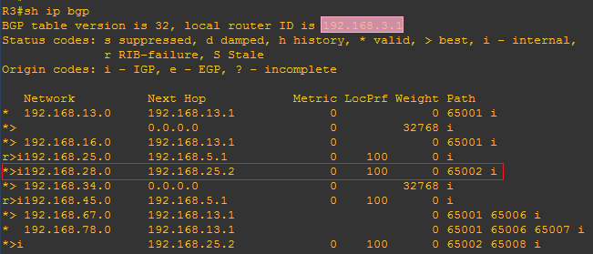
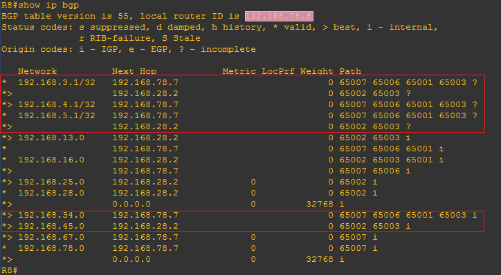
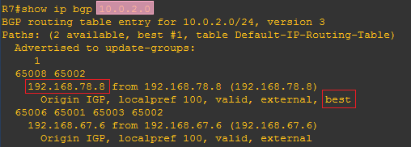

import FileCard from '@site/src/components/FileCard';
import DeadlineProcess from '@site/src/components/DeadlineProcess';
import PlaceHolder from '@site/src/components/PlaceHolder';
import TaskCard from '@site/src/components/TaskCard';
import ScreenshotCard from '@site/src/components/ScreenshotCard';
import ModernInput from '@site/src/components/ModernInput';
import ExportButton from '@site/src/components/ExportButton';
import { Row, Col } from 'antd';

<h3 style={{color: '#006d75', marginTop: 0, marginBottom: 8}}>实验资源</h3>
<DeadlineProcess start={'2025-12-09 18:50:00'} end={'2025-12-23 23:59:59'}/>

<Row gutter={[16, 4]} justify="space-between" style={{marginBottom: -25}}>
    <Col xs={24} sm={24} md={12} lg={24} xl={12} xxl={12}>
        <FileCard file_type={'md'} name={'Lab6 实验报告模板 Markdown版本'} size={'935496'} link={require('@site/assets/templete/md/Lab6 实验报告模板.zip').default} />
    </Col>
    <Col xs={24} sm={24} md={12} lg={24} xl={12} xxl={12}>
        <FileCard file_type={'doc'} name={'Lab6 实验报告模板 Word版本'} size={'1111552'} link={require('@site/assets/templete/word/实验报告模版_实验6.doc').default} />
    </Col>
    <Col xs={24} sm={24} md={12} lg={24} xl={12} xxl={12}>
        <FileCard file_type={'pdf'} name={'Lab6 动态路由协议BGP配置 实验课件'} size={'1721069'} link={require('@site/assets/slides/Lab6_BGP路由协议.pdf').default} />
    </Col>
</Row>

<PlaceHolder>

## 1 实验目的

* 理解距离向量路由协议的工作原理。
* 理解BGP协议的工作机制。
* 掌握配置和调试BGP协议的方法。


## 二、实验内容

-   创建多种类型的网络，各自成为一个独立的AS
-   AS内部路由器配置成启用OSPF路由协议
-   在同一个AS边界上的路由器启用BGP协议，形成邻居关系
-   在不同AS边界路由器上启用BGP协议，直连路由器之间建立邻居关系
-   观察各路由器上的路由表和BGP运行数据，并验证各PC能够相互Ping通
-   断开某些链路，观察BGP事件和路由表变化
-   在AS边界路由器上配置路由聚合
-   在AS间进行多径负载均衡

## 四、操作方法与实验步骤

按照下面的拓扑图连接路由器和PC机。每个自治系统（AS）均分配1个独立的AS号。其中，AS 65003内部运行OSPF路由协议，R6、R7、R8分别代表一个AS。


### 实验主要步骤

* 配置路由器各接口的IP地址（除了R1的f0/1、R2的f0/0接口配置IPv6的地址外，其他均配置IPv4的地址）, 使直连的2个路由器能相互Ping通，为方便记忆，建议使用192.168.xy.x/24、192.168.xy.y/24形式的地址，其中x,y分别是相连路由器的编号, 例如可以设置R1连接R3的f1/0接口IP为192.168.13.1，R3连接R1的f1/0接口IP为192.168.13.3，其他类推；
* 在各AS边界路由器之间建立邻居关系；
* 在AS 65003内部的两头边界路由器（R3、R5）之间建立邻居关系；
* 在AS 65003内部启用OSPF路由协议，并启用重分发机制，让OSPF和BGP之间信息互通；
* 在R8上配置路由过滤，使得到达PC3子网的路由不经过AS 65008；
* 给PC1、PC3配置IPv4地址，使用10.0.x.y/24的形式的私网地址，其中x为子网号，y为主机地址；
* 给R1、R2、R6的f0/1接口、R1、R6的f2/0接口以及PC2、PC4、PC5配置IPv6的地址，使用FEC0:\: x:y:z/112形式的站点本地地址，其中x、y为子网号，z为主机地址；
* IPv6的地址分配规则：
    * FEC0::/10前缀的地址是IPv6站点本地地址段（site-local），相当于IPv4的私网地址段；
    * FE80::/10前缀的地址是用于IPv6链路本地的地址段（link-local）。给接口配置site-local地址时会自动分配link-local地址，也可以手工配置link-local地址。由于同一个接口可以配置多个IPv6地址，为避免路由学习时产生多个Next-hop，路由器只把link-local地址作为Next-hop。路由器会自动通告link-local地址的前缀，PC可以根据这些信息自动配置link-local地址，并发现路由。
* 在R1和R2之间建立隧道，使得配置了IPv6的主机之间能通过中间的IPv4网络相互通信。


### BGP知识点

* 64512-65534之间的AS号属于私有AS号，不在互联网出现。
* 两个路由器都在同一个AS，称为iBGP邻居，链路称为内部link。iBGP邻居之间的链路可以为非直连链路，数据需要通过其他路由器转发。
* 两个路由器分属于不同的AS，称为eBGP邻居，链路称为外部link。
* BGP路由状态：*表示有效路由，>表示最佳路由，i表示内部路由，r表示写入路由表时被拒绝，原因可能是路由表中已存在优先级更高的同样路由。比如OSPF属于内部网关路由协议，优先级比外部网关路由协议BGP高。
* 多个AS之间互相连接，从R1到R2存在多条AS间的路径，例如：
    * 65001->65003->65002
    * 65001->65006->65007-65009->65002
    * 65001->65006->65008->65009->65002
* BGP选择最佳路由的依据有很多，默认是选择经过最少AS数量的路径，不以接口速度带宽为标准。
* 路由器在发送BGP消息时，可能使用物理接口的IP地址作为源地址，这样会因为与对方配置的邻居地址不符，导致无法建立邻居关系。因此需要设置更新源为回环接口，可以避免这种情况发生。
* 同步功能是让BGP等待内部路由器(如R4)学到了外部路由后才对外发布。重分发功能是把其他路由协议（如BGP）学习到的路由添加到自己数据库中(如OSPF)。
* 路由聚合是将路由表中下一跳相同的多个网络合并成一个网络，这样可以减少路由表的大小，加速路由器转发处理速度。


### BGP相关命令

* 在路由器R1上启用BGP协议, 设置AS号，并宣告直连网络：
  ```kotlin
  R1(config)# router bgp <AS-Number>
  R1(config-router)# network x.x.x.x mask x.x.x.x
  ```
* 把对方增加为AS内部的邻居（AS-Number设置为相同的AS号）
  ```kotlin
  R1(config-router)# neighbor [IP-Address] remote-as [AS-Number]
  ```
* 对方增加为AS间的邻居（IP-Address为对方的IP，AS-Number设置为对方的AS号）：
  ```kotlin
  R1(config-router)# neighbor [IP-Address] remote-as [AS-Number]
  ```
* 查看邻居关系：
  ```kotlin
  R1# show ip bgp neighbor
  ```
* 打开bgp调试：
  ```kotlin
  R1# debug ip bgp
  ```
* 查看BGP数据库：
  ```kotlin
  R1# show ip bgp
  ```
* 启用BGP同步功能：
  ```kotlin
  R1(config-router)# synchronization
  ```
* 设置BGP更新源为回环接口（IP-Addr设置为对方的回环口IP）：
  ```kotlin
  R1(config-router)# neighbor [IP-Addr] update-source loopback 0
  ```
* 在BGP中启用路由重分发功能，从OSPF中重分发路由信息：
  ```kotlin
  R1(config)# router bgp [AS-Number]
  R1(config-router)# redistribute ospf [process-id]
  ```
* 在OSPF中启用重分发功能，从BGP中重分发路由信息：
  ```kotlin
  R1(config)# router ospf [process-id]
  R1(config-router)# redistribute bgp [AS-Number] subnets
  ```
* 聚合路由（summary-only参数的含义是只传递聚合后的路由，as-set参数的含义是在传播网络时加上AS属性，避免出现循环路由）：
  ```kotlin
  R1(config-route)# aggregate-address [ip network] [subnet mask] summary-only as-set
  ```
* 设置允许多条路径：
  ```kotlin
  R1(config-route)# maximum-paths 2
  ```


## 2 实验数据记录和处理

:::important 提示
以下实验记录均需结合屏幕截图，进行文字标注和描述，图片应大小合适、关键部分清晰可见，可直接在图片上进行标注，也可以单独用文本进行描述。
:::

<TaskCard number={1} title="设计网络拓扑并规划IP地址" needScreenshot={true} needRecord={false}>

参考实验操作方法的说明，设计好每个PC、路由器各接口的IP地址及掩码（除了PC2、PC4、PC5以及与之相连的路由器接口配置IPv6的地址外，其他均配置IPv4的地址），并标注在拓扑图上。

<ScreenshotCard 
  questionId="Lab6-p0-s1" 
  title="网络拓扑图及IP地址规划" 
  uploadOptions={[
    { id: 'topology', label: '上传标注IP地址的拓扑图' }
  ]}
/>

</TaskCard>


### 2.1  配置iBGP

<TaskCard number={2} title="配置R3、R4、R5的OSPF动态路由" needScreenshot={false} needRecord={true}>

分别在R3、R4、R5上配置回环端口、各物理接口的IP地址，激活OSPF动态路由协议，宣告直连网络。其中进程ID请设置为学号的后2位（全0者往前取值）。

<ScreenshotCard 
  questionId="Lab6-p1-s2" 
  title="R3配置命令" 
  uploadOptions={[
    { id: 'r3_config', label: '记录R3配置命令', type: 'text', textConfig: {initialContent: "R3(config)# interface f0/0\nR3(config-if)# \nR3(config-if)# \nR3(config)# interface f1/0\nR3(config-if)# \nR3(config-if)# \nR3(config)# interface loopback 0\nR3(config-if)# \nR3(config)# router ospf\nR3(config-router)# ", codeEditor: true, initialLines: 10} },
    { id: 'r4_config', label: '记录R4配置命令', type: 'text', textConfig: {initialContent: "R4(config)# interface f0/0\nR4(config-if)# \nR4(config-if)# \nR4(config)# interface f0/1\nR4(config-if)# \nR4(config-if)# \nR4(config)# interface loopback 0\nR4(config-if)# \nR4(config)# \nR4(config-router)# ", codeEditor: true, initialLines: 10} },
    { id: 'r5_config', label: '记录R5配置命令', type: 'text', textConfig: {initialContent: "R5(config)# interface f0/1\nR5(config-if)# \nR5(config-if)# \nR5(config)# interface f1/0\nR5(config-if)# \nR5(config-if)# \nR5(config)# interface loopback 0\nR5(config-if)# \nR5(config)# \nR5(config-router)# ", codeEditor: true, initialLines: 10} }
  ]}
>

</ScreenshotCard>

</TaskCard>


<TaskCard number={3} title="查看路由表并测试连通性" needScreenshot={true} needRecord={false}>

查看R3、R4、R5的路由表，并在R3上用Ping测试与R5的回环口（用回环口作为源地址，命令：`ping [IP-addr] source loopback 0`）之间的联通性。

<ScreenshotCard 
  questionId="Lab6-p1-s3" 
  title="路由表示例" 
  uploadOptions={[
    { id: 'r3_route', label: '截图R3路由表' },
    { id: 'r4_route', label: '截图R4路由表' },
    { id: 'r5_route', label: '截图R5路由表' }
  ]}
>
   
</ScreenshotCard>

<ScreenshotCard 
  questionId="Lab6-p1-s3" 
  title="Ping测试示例" 
  uploadOptions={[
    { id: 'ping_result', label: '截图R3→R5 Ping结果' }
  ]}
>
   
</ScreenshotCard>

</TaskCard>


<TaskCard number={4} title="配置R3和R5的BGP邻居关系" needScreenshot={false} needRecord={true}>

启动R3、R5上的BGP协议（配置成同一个AS），宣告直连网络，然后把对方增加为AS内部的邻居（命令：`neighbor [IP-Address] remote-as [AS-Number]`），IP-Address为对方回环接口的IP，AS-Number设置为相同的AS号。

<ScreenshotCard 
  questionId="Lab6-p1-s4" 
  title="R3配置命令示例" 
  uploadOptions={[
    { id: 'r3_bgp_config', label: '记录R3 BGP配置命令', type: 'text', textConfig: {codeEditor: true, initialLines: 4} },
    { id: 'r5_bgp_config', label: '记录R5 BGP配置命令', type: 'text', textConfig: {initialContent: "R5(config)# \nR5(config-router)# \nR5(config-router)# \nR5(config-router)# ",codeEditor: true, initialLines: 4} }
  ]}
>
   
</ScreenshotCard>

</TaskCard>


<TaskCard number={5} title="查看BGP邻居关系并排查连接问题" needScreenshot={true} needRecord={false}>

分别在R3、R5上查看BGP邻居关系（命令：`show ip bgp neighbor`），标出Link类型和对方的IP、连接状态。如果没有活动的TCP连接，打开调试开关（命令：`debug ip bgp`），查看错误原因。观察完毕关掉调试（命令：`no debug ip bgp`）。

   R3的邻居关系：观察得知，邻居的IP是<ModernInput size="large" questionId="Lab6-p1-s5-r3-ip"/>，链路类型属于<ModernInput size="medium" questionId="Lab6-p1-s5-r3-type"/>，状态是<ModernInput size="medium" questionId="Lab6-p1-s5-r3-state"/>，但现象是没有活动的TCP连接。
<ScreenshotCard 
  questionId="Lab6-p1-s5" 
  title="R3邻居关系示例" 
  uploadOptions={[
    { id: 'r3_neighbor', label: '截图R3邻居关系' }
  ]}
>
   
</ScreenshotCard>

R5的邻居关系：观察得知，邻居的IP是<ModernInput size="large" questionId="Lab6-p1-s5-r5-ip"/>，链路类型属于<ModernInput size="medium" questionId="Lab6-p1-s5-r5-type"/>，状态是<ModernInput size="medium" questionId="Lab6-p1-s5-r5-state"/>，但现象是没有活动的TCP连接。

<ScreenshotCard 
  questionId="Lab6-p1-s5" 
  title="R5邻居关系示例" 
  uploadOptions={[
    { id: 'r5_neighbor', label: '截图R5邻居关系' }
  ]}
/>

   打开debug后的消息：错误原因是被对方拒绝连接，是因为R3默认使用了物理接口的IP地址作为源地址，而R5配置的邻居地址是R3的
   ，因邻居地址不符被拒绝。

<ScreenshotCard 
  questionId="Lab6-p1-s5" 
  title="调试信息示例" 
  uploadOptions={[
    { id: 'debug_msg', label: '截图Debug信息' }
  ]}
>
   
</ScreenshotCard>

</TaskCard>


<TaskCard number={6} title="设置BGP更新源并验证邻居关系" needScreenshot={true} needRecord={true}>

在R3、R5上设置BGP更新源为回环接口（命令：`neighbor [IP-Addr] update-source loopback 0`），等待一会儿，再次查看邻居关系，标记连接状态是否已建立（ESTAB）。

<ScreenshotCard 
  questionId="Lab6-p1-s6" 
  title="R3配置命令示例" 
  uploadOptions={[
    { id: 'r3_update_source', label: '记录R3配置命令', type: 'text', textConfig: {codeEditor: true, initialLines: 2} },
    { id: 'r5_update_source', label: '记录R5配置命令', type: 'text', textConfig: {initialContent: "R5(config)# \nR5(config-router)# ",codeEditor: true, initialLines: 2} }
  ]}
>
   
</ScreenshotCard>

R3的邻居关系：观察得知，与R5的邻居关系已经建立，对方的连接端口是<ModernInput size="medium" questionId="Lab6-p1-s6-r3-port"/>。

<ScreenshotCard 
  questionId="Lab6-p1-s6" 
  title="R3邻居关系示例" 
  uploadOptions={[
    { id: 'r3_neighbor', label: '截图R3邻居关系' }
  ]}
>
   

   
</ScreenshotCard>

R5的邻居关系：观察得知，与R3的邻居关系已经建立，对方的连接端口是<ModernInput size="medium" questionId="Lab6-p1-s6-r5-port"/>。

<ScreenshotCard 
  questionId="Lab6-p1-s6" 
  title="R5邻居关系示例" 
  uploadOptions={[
    { id: 'r5_neighbor_established', label: '截图R5邻居关系' }
  ]}
/>

</TaskCard>


<TaskCard number={7} title="查看BGP数据库和路由表" needScreenshot={true} needRecord={false}>

在R3、R5上查看BGP数据库（命令：`show ip bgp`），并查看路由表信息。

R3的BGP数据库（标出iBGP路由）：观察得知，存在<ModernInput size="small" questionId="Lab6-p1-s7-r3-count"/>条状态码=r的路由（表示没有成功写入路由表）。
<ScreenshotCard 
  questionId="Lab6-p1-s7" 
  title="R3 BGP数据库示例" 
  uploadOptions={[
    { id: 'r3_bgp_db', label: '截图R3 BGP数据库' }
  ]}
>
   
</ScreenshotCard>

R3的路由表：观察得知，网络地址<ModernInput size="large" questionId="Lab6-p1-s7-r3-net1"/>、<ModernInput size="large" questionId="Lab6-p1-s7-r3-net2"/>在路由表中已存在比BGP优先级高的OSPF路由，所以BGP的路由信息没有成功写入。

<ScreenshotCard 
  questionId="Lab6-p1-s7" 
  title="R3路由表示例" 
  uploadOptions={[
    { id: 'r3_route_table', label: '截图R3路由表' }
  ]}
>
   
</ScreenshotCard>


<ScreenshotCard 
  questionId="Lab6-p1-s7" 
  title="R5 BGP数据库示例" 
  uploadOptions={[
    { id: 'r5_bgp_db', label: '截图R5 BGP数据库（标出iBGP路由）' }
  ]}
/>

<ScreenshotCard 
  questionId="Lab6-p1-s7" 
  title="R5路由表示例" 
  uploadOptions={[
    { id: 'r5_route_table', label: '截图R5路由表（标出BGP数据库中存在但优先级更高的OSPF路由）' }
  ]}
/>

</TaskCard>

### 2.2  配置eBGP

<TaskCard number={8} title="配置R1、R2、R6、R7、R8的eBGP" needScreenshot={false} needRecord={true}>

在R1、R2、R6、R7、R8上激活路由器互联的接口，配置IP地址，启用BGP协议，每个路由器使用不同的AS号，宣告所有直连网络，把直接连接的对方增加为AS间的邻居（命令：`neighbor [IP-Address] remote-as [AS-Number]`），IP-Address为对方的IP，AS-Number设置为对方的AS号。

<ScreenshotCard 
  questionId="Lab6-p2-s8" 
  title="R1配置命令示例" 
  uploadOptions={[
    { id: 'r1_config', label: '记录R1配置命令', type: 'text', textConfig: {codeEditor: true, initialLines: 11} },
    { id: 'r2_config', label: '记录R2配置命令', type: 'text', textConfig: {initialContent: "R2(config)# interface f1/0\nR2(config-if)# \nR2(config-if)# \nR2(config)# interface f2/0\nR2(config-if)# \nR2(config-if)# \nR2(config)# \nR2(config-router)# \nR2(config-router)# \nR2(config-router)# \nR2(config-router)# ",codeEditor: true, initialLines: 11} },
    { id: 'r6_config', label: '记录R6配置命令', type: 'text', textConfig: {initialContent: "R6(config)# interface f0/0\nR6(config-if)# \nR6(config-if)# \nR6(config)# interface f2/0\nR6(config-if)# \nR6(config-if)# \nR6(config)# \nR6(config-router)# \nR6(config-router)# \nR6(config-router)# \nR6(config-router)# ",codeEditor: true, initialLines: 11} },
    { id: 'r7_config', label: '记录R7配置命令', type: 'text', textConfig: {initialContent: "R7(config)# interface f0/0\nR7(config-if)# \nR7(config-if)# \nR7(config)# interface f0/1\nR7(config-if)# \nR7(config-if)# \nR7(config)# \nR7(config-router)# \nR7(config-router)# \nR7(config-router)# \nR7(config-router)# ",codeEditor: true, initialLines: 11} },
    { id: 'r8_config', label: '记录R8配置命令', type: 'text', textConfig: {initialContent: "R8(config)# interface f0/1\nR8(config-if)# \nR8(config-if)# \nR8(config)# interface f2/0\nR8(config-if)# \nR8(config-if)# \nR8(config)# \nR8(config-router)# \nR8(config-router)# \nR8(config-router)# \nR8(config-router)# ",codeEditor: true, initialLines: 11} }
  ]}
>
   
</ScreenshotCard>

</TaskCard>


<TaskCard number={9} title="配置R3和R5的外部BGP邻居" needScreenshot={false} needRecord={true}>

在R3、R5上分配配置R1、R2为外部BGP邻居。

<ScreenshotCard 
  questionId="Lab6-p2-s9" 
  title="R3配置命令示例" 
  uploadOptions={[
    { id: 'r3_ebgp_config', label: '记录R3配置命令', type: 'text', textConfig: {initialContent: "R3(config)# \nR3(config-router)# ",codeEditor: true, initialLines: 2} }, 
    { id: 'r5_ebgp_config', label: '记录R5配置命令', type: 'text', textConfig: {initialContent: "R5(config)# \nR5(config-router)# ",codeEditor: true, initialLines: 2} }
  ]}
>
</ScreenshotCard>

</TaskCard>


<TaskCard number={10} title="查看各路由器的BGP邻居关系" needScreenshot={true} needRecord={false}>

在各路由器上查看邻居关系，标出Link类型和对方的IP、连接状态（找出关键信息进行截图）。

R1的邻居关系：R1的两个邻居的IP分别为<ModernInput size="large" questionId="Lab6-p2-s10-r1-ip1"/>、<ModernInput size="large" questionId="Lab6-p2-s10-r1-ip2"/>，链路类型均为<ModernInput size="medium" questionId="Lab6-p2-s10-r1-type"/>。

<ScreenshotCard 
  questionId="Lab6-p2-s10" 
  title="R1邻居关系示例" 
  uploadOptions={[
    { id: 'r1_neighbor', label: '截图R1邻居关系1' }
  ]}
>
    

    
</ScreenshotCard>
R2的邻居关系：R2邻居的IP分别为<ModernInput size="large" questionId="Lab6-p2-s10-r2-ip1"/>、<ModernInput size="large" questionId="Lab6-p2-s10-r2-ip2"/>，链路类型均为<ModernInput size="medium" questionId="Lab6-p2-s10-r2-type"/>。

<ScreenshotCard 
  questionId="Lab6-p2-s10" 
  title="R2邻居关系示例" 
  uploadOptions={[
    { id: 'r2_neighbor', label: '截图R2邻居关系' }
  ]}
/>

R3的邻居关系：R3的iBGP邻居的IP为<ModernInput size="large" questionId="Lab6-p2-s10-r3-igp"/>，eBGP邻居的IP为<ModernInput size="large" questionId="Lab6-p2-s10-r3-ebgp"/>。

<ScreenshotCard 
  questionId="Lab6-p2-s10" 
  title="R3邻居关系示例" 
  uploadOptions={[
    { id: 'r3_neighbor', label: '截图R3邻居关系1' }
  ]}
>
    

    
</ScreenshotCard>

R5的邻居关系：R5的iBGP邻居的IP为<ModernInput size="large" questionId="Lab6-p2-s10-r5-igp"/>，eBGP邻居的IP为<ModernInput size="large" questionId="Lab6-p2-s10-r5-ebgp"/>。

<ScreenshotCard 
  questionId="Lab6-p2-s10" 
  title="R5邻居关系示例" 
  uploadOptions={[
    { id: 'r5_neighbor', label: '截图R5邻居关系' }
  ]}
/>

R6的邻居关系：R6的两个邻居的IP分别为<ModernInput size="large" questionId="Lab6-p2-s10-r6-ip1"/>、<ModernInput size="large" questionId="Lab6-p2-s10-r6-ip2"/>，链路类型均为<ModernInput size="medium" questionId="Lab6-p2-s10-r6-type"/>。

<ScreenshotCard 
  questionId="Lab6-p2-s10" 
  title="R6邻居关系示例" 
  uploadOptions={[
    { id: 'r6_neighbor', label: '截图R6邻居关系' }
  ]}
/>

R7的邻居关系：R7的两个邻居的IP分别为<ModernInput size="large" questionId="Lab6-p2-s10-r7-ip1"/>、<ModernInput size="large" questionId="Lab6-p2-s10-r7-ip2"/>，链路类型均为<ModernInput size="medium" questionId="Lab6-p2-s10-r7-type"/>。

<ScreenshotCard 
  questionId="Lab6-p2-s10" 
  title="R7邻居关系示例" 
  uploadOptions={[
    { id: 'r7_neighbor', label: '截图R7邻居关系' }
  ]}
/>

R8的邻居关系：R8的两个邻居的IP分别为<ModernInput size="large" questionId="Lab6-p2-s10-r8-ip1"/>、<ModernInput size="large" questionId="Lab6-p2-s10-r8-ip2"/>，链路类型均为<ModernInput size="medium" questionId="Lab6-p2-s10-r8-type"/>。

<ScreenshotCard 
  questionId="Lab6-p2-s10" 
  title="R8邻居关系示例" 
  uploadOptions={[
    { id: 'r8_neighbor', label: '截图R8邻居关系' }
  ]}
/>

</TaskCard>


<TaskCard number={11} title="查看R1的BGP数据库并分析路由" needScreenshot={true} needRecord={false}>

等待一会儿，在路由器R1查看BGP数据库，标出到达R2-R5间子网、R6-R7间子网、R7-R8间子网以及R2-R8间子网的最佳路由（标记为 > 的为最佳路由）、经过的AS路径。

<ScreenshotCard 
  questionId="Lab6-p2-s11" 
  title="R1 BGP数据库示例" 
  uploadOptions={[
    { id: 'r1_bgp_db', label: '截图R1 BGP数据库' }
  ]}
>
    
</ScreenshotCard>

    观察得知：

    * 到达R2-R5间子网的下一跳是<ModernInput size="large" questionId="Lab6-p2-s11-r25-nh"/>，经过的AS路径为<ModernInput size="large" questionId="Lab6-p2-s11-r25-path"/>；
    * 到达R6-R7间子网的下一跳是<ModernInput size="large" questionId="Lab6-p2-s11-r67-nh"/>，经过的AS路径为<ModernInput size="large" questionId="Lab6-p2-s11-r67-path"/>；
    * 到达R7-R8间子网的路由有<ModernInput size="small" questionId="Lab6-p2-s11-r78-count"/>条，其中最佳路由的下一跳是<ModernInput size="large" questionId="Lab6-p2-s11-r78-nh"/>，经过的AS路径最短，AS号依次为<ModernInput size="large" questionId="Lab6-p2-s11-r78-path"/>；
    * 到达R8-R2间子网的路由有<ModernInput size="small" questionId="Lab6-p2-s11-r82-count"/>条，其中最佳路由的下一跳是<ModernInput size="large" questionId="Lab6-p2-s11-r82-nh"/>，经过的AS路径最短，AS号依次为<ModernInput size="large" questionId="Lab6-p2-s11-r82-path"/>。

</TaskCard>


<TaskCard number={12} title="查看R2的BGP数据库并分析路由" needScreenshot={true} needRecord={false}>

在路由器R2查看BGP数据库，标出到达R1-R3间子网、R1-R6间子网、R6-R7间子网以及R7-R8间子网的最佳路由、经过的AS路径。

<ScreenshotCard 
  questionId="Lab6-p2-s12" 
  title="R2 BGP数据库示例" 
  uploadOptions={[
    { id: 'r2_bgp_db', label: '截图R2 BGP数据库' }
  ]}
>
</ScreenshotCard>
    观察得知：

    * 到达R1-R3间子网的下一跳是<ModernInput size="large" questionId="Lab6-p2-s12-r13-nh"/>，经过的AS路径为<ModernInput size="large" questionId="Lab6-p2-s12-r13-path"/>；
    * 到达R7-R8间子网的下一跳是<ModernInput size="large" questionId="Lab6-p2-s12-r78-nh"/>，经过的AS路径为<ModernInput size="large" questionId="Lab6-p2-s12-r78-path"/> ；
    * 到达R1-R6间子网的路由有<ModernInput size="small" questionId="Lab6-p2-s12-r16-count"/>条，其中最佳路由的下一跳是<ModernInput size="large" questionId="Lab6-p2-s12-r16-nh"/>，经过的AS路径最短，AS号依次为<ModernInput size="large" questionId="Lab6-p2-s12-r16-path"/>；
    * 到达R6-R7间子网的路由有<ModernInput size="small" questionId="Lab6-p2-s12-r67-count"/>条，其中最佳路由的下一跳是<ModernInput size="large" questionId="Lab6-p2-s12-r67-nh"/>，经过的AS路径最短，AS号依次为<ModernInput size="large" questionId="Lab6-p2-s12-r67-path"/> 。

</TaskCard>


<TaskCard number={13} title="查看R1路由表并验证BGP路由" needScreenshot={true} needRecord={false}>

在路由器R1上查看路由表，标出到达R2-R5间子网、R6-R7间子网、R7-R8间子网以及R2-R8间子网的路由，是否与BGP数据库中的最佳路由一致。

<ScreenshotCard 
  questionId="Lab6-p2-s13" 
  title="R1的路由表" 
  uploadOptions={[
    { id: 'r1_route_table', label: '截图R1路由表' }
  ]}
/>

</TaskCard>

<TaskCard number={14} title="查看R2路由表并验证BGP路由" needScreenshot={true} needRecord={false}>

在路由器R2上查看路由表，标出到达R1-R3间子网、R1-R6间子网、R6-R7间子网以及R7-R8间子网的路由，是否与BGP数据库中的最佳路由一致。

<ScreenshotCard 
  questionId="Lab6-p2-s14" 
  title="R2的路由表" 
  uploadOptions={[
    { id: 'r2_route_table', label: '截图R2路由表' }
  ]}
/>

</TaskCard>

<TaskCard number={15} title="观察链路故障后的BGP路由切换" needScreenshot={true} needRecord={false}>

在路由器R6查看BGP数据库，标出到达R2-R5间子网的最佳路由、经过的AS路径。然后在R1上关闭R1-R3互联端口后（命令：`interface f1/0`, `shutdown`），在R6上观察到达R2-R5间子网的最佳路由有无变化。

    R6的BGP数据库（当前）：到达R2-R5间子网的最佳路由的下一跳为<ModernInput size="large" questionId="Lab6-p2-s15-before"/>。
<ScreenshotCard 
  questionId="Lab6-p2-s15" 
  title="R6 BGP数据库示例" 
  uploadOptions={[
    { id: 'r6_bgp_before', label: '截图断开前R6 BGP数据库' }
  ]}
>
    
</ScreenshotCard>
    R6的BGP数据库（断开连接后）：观察得知，到达R2-R5间子网的最佳路由的下一跳变为<ModernInput size="large" questionId="Lab6-p2-s15-after"/>。

<ScreenshotCard 
  questionId="Lab6-p2-s15" 
  title="R6的BGP数据库变化" 
  uploadOptions={[
    { id: 'r6_bgp_after', label: '截图断开后R6 BGP数据库' }
  ]}
>
</ScreenshotCard>

</TaskCard>


### 2.3  路由重分发

<TaskCard number={16} title="测试路由连通性并追踪路由路径" needScreenshot={true} needRecord={false}>

重新激活R1-R3之间的端口（命令：`no shutdown`），等待R1重新选择R3作为到达R2-R8间子网的最佳BGP路由。然后测试R1是否能Ping通R2-R8互联端口，并跟踪R1到该子网的路由（命令：`traceroute ip-addr`，如果提前终止，可按Ctrl+6）。

<ScreenshotCard 
  questionId="Lab6-p3-s16" 
  title="Ping测试示例" 
  uploadOptions={[
    { id: 'ping_result', label: '截图Ping结果' }
  ]}
>
    
</ScreenshotCard>

<ScreenshotCard 
  questionId="Lab6-p3-s16" 
  title="路由跟踪示例" 
  uploadOptions={[
    { id: 'traceroute_result', label: '截图路由跟踪结果' }
  ]}
>
    
</ScreenshotCard>

路由跟踪结果：得到的现象是在路由器<ModernInput size="medium" questionId="Lab6-p3-s16-router"/>中断了。

</TaskCard>


<TaskCard number={17} title="分析R3和R4的路由表" needScreenshot={true} needRecord={false}>

查看R3的BGP数据库和路由表，标记到达R2-R8间子网的BGP最佳路由。查看R4的路由表是否存在R2-R8间子网的路由信息。

<ScreenshotCard 
  questionId="Lab6-p3-s17" 
  title="R3 BGP数据库示例" 
  uploadOptions={[
    { id: 'r3_bgp_db', label: '截图R3 BGP数据库' }
  ]}
>
    
</ScreenshotCard>

R3的BGP数据库：观察得知，到达R2-R8间子网的最佳路由的下一跳IP地址是<ModernInput size="large" questionId="Lab6-p3-s17-r3-nh"/>。

<ScreenshotCard 
  questionId="Lab6-p3-s17" 
  title="R3路由表示例" 
  uploadOptions={[
    { id: 'r3_route_table', label: '截图R3路由表' }
  ]}
>
    
</ScreenshotCard>

R3的路由表：观察得知，

* 到达R2-R8间子网的下一跳IP地址<ModernInput size="large" questionId="Lab6-p3-s17-r3-bgp"/>（属于R2）是由BGP写入的。
* 去往该地址的下一跳IP地址<ModernInput size="large" questionId="Lab6-p3-s17-r3-ospf"/>（属于R4）是由OSPF写入的。

<ScreenshotCard 
  questionId="Lab6-p3-s17" 
  title="R4路由表示例" 
  uploadOptions={[
    { id: 'r4_route_table', label: '截图R4路由表' }
  ]}
>
    
</ScreenshotCard>

R4的路由表：观察得知，由于R4上缺少相应的路由，因此不能Ping通。默认情况下，未启用同步功能，BGP就不会考虑AS内部是否存在相关路由，导致路由黑洞。

</TaskCard>


<TaskCard number={18} title="启用BGP同步功能并观察路由变化" needScreenshot={true} needRecord={true}>

打开R3、R5的BGP同步功能（命令：`synchronization`），等一会儿查看R3、R1到达R2-R8间子网的BGP最佳路由是否发生变化。用Ping测试R1到达R2-R8互联端口的联通性，并跟踪路由。

<ScreenshotCard 
  questionId="Lab6-p3-s18" 
  title="R3 配置命令示例" 
  uploadOptions={[
    { id: 'r3_sync_config', label: '记录R3配置命令', type: 'text', textConfig: {initialContent: "R3(config)# \nR3(config-router)# ",codeEditor: true, initialLines: 2} },
    { id: 'r5_sync_config', label: '记录R5配置命令', type: 'text', textConfig: {initialContent: "R5(config)# \nR5(config-router)# ",codeEditor: true, initialLines: 2} }
  ]}
>
</ScreenshotCard>

<ScreenshotCard 
  questionId="Lab6-p3-s18" 
  title="R3 BGP数据库示例" 
  uploadOptions={[
    { id: 'r3_bgp_sync', label: '截图R3 BGP数据库' }
  ]}
>
    
</ScreenshotCard>

R3的BGP数据库：观察得知，

* 到达R2-R8间子网的路由有<ModernInput size="small" questionId="Lab6-p3-s18-r3-count"/>条
* 其中最佳路由的下一跳为<ModernInput size="large" questionId="Lab6-p3-s18-r3-nh"/>（属于R1），因为同步功能打开后，BGP判断AS内部缺少相应的路由，因此不选择本AS作为转发路径。

<ScreenshotCard 
  questionId="Lab6-p3-s18" 
  title="R3路由表示例" 
  uploadOptions={[
    { id: 'r3_route_sync', label: '截图R3路由表' }
  ]}
>
    
</ScreenshotCard>

R3的路由表：到达R2-R8间子网的下一跳IP为<ModernInput size="large" questionId="Lab6-p3-s18-r3-rt-ip"/>，属于路由器<ModernInput size="medium" questionId="Lab6-p3-s18-r3-rt-router"/>。

<ScreenshotCard 
  questionId="Lab6-p3-s18" 
  title="R1 BGP数据库示例" 
  uploadOptions={[
    { id: 'r1_bgp_sync', label: '截图R1 BGP数据库' }
  ]}
>
    
</ScreenshotCard>

R1的BGP数据库：观察得知，

* 到达R2-R8间子网的最佳路由的下一跳为<ModernInput size="large" questionId="Lab6-p3-s18-r1-nh"/>
* 属于路由器<ModernInput size="medium" questionId="Lab6-p3-s18-r1-router"/>。由于使用了水平分裂方式，R3并没有向R1报告关于这个子网的路由，因为R3选的下一跳是R1。

<ScreenshotCard 
  questionId="Lab6-p3-s18" 
  title="Ping测试示例" 
  uploadOptions={[
    { id: 'ping_sync', label: '截图Ping结果' }
  ]}
>
    
</ScreenshotCard>

<ScreenshotCard 
  questionId="Lab6-p3-s18" 
  title="路由跟踪示例" 
  uploadOptions={[
    { id: 'traceroute_sync', label: '截图路由跟踪结果' }
  ]}
/>

路由跟踪结果：观察得知，依次经过了这些路由器：<ModernInput size="medium" questionId="Lab6-p3-s18-tr1"/>、<ModernInput size="medium" questionId="Lab6-p3-s18-tr2"/>、<ModernInput size="medium" questionId="Lab6-p3-s18-tr3"/>、<ModernInput size="medium" questionId="Lab6-p3-s18-tr4"/>。

</TaskCard>


<TaskCard number={19} title="在OSPF中启用BGP重分发" needScreenshot={true} needRecord={true}>

在R3、R5的OSPF协议中启用BGP重分发功能（命令：`router ospf [pid]`，`redistribute bgp [AS-number] subnets`），等一会儿，查看R3、R5的OSPF数据库，以及R4的路由表是否出现了AS外部的路由信息。

<ScreenshotCard 
  questionId="Lab6-p3-s19" 
  title="R3 配置命令示例" 
  uploadOptions={[
    { id: 'r3_redist_config', label: '记录R3配置命令', type: 'text', textConfig: {initialContent: "R3(config)# \nR3(config-router)# ",codeEditor: true, initialLines: 2} },
    { id: 'r5_redist_config', label: '记录R5配置命令', type: 'text', textConfig: {initialContent: "R5(config)# \nR5(config-router)# ",codeEditor: true, initialLines: 2} }
  ]}
>
</ScreenshotCard>

<ScreenshotCard 
  questionId="Lab6-p3-s19" 
  title="R3 OSPF数据库示例" 
  uploadOptions={[
    { id: 'r3_ospf_db', label: '截图R3 OSPF数据库' }
  ]}
>
    
</ScreenshotCard>

R3的OSPF数据库：观察得知，OSPF从BGP中重分发了AS外部链路的信息，但是R3-R1的直连网络<ModernInput size="large" questionId="Lab6-p3-s19-r3-net"/>没有被本路由器重分发。

<ScreenshotCard 
  questionId="Lab6-p3-s19" 
  title="R5 OSPF数据库示例" 
  uploadOptions={[
    { id: 'r5_ospf_db', label: '截图R5 OSPF数据库' }
  ]}
>
    
</ScreenshotCard>

R5的OSPF数据库：观察得知，OSPF从BGP中重分发了AS外部链路的信息，但是R5-R2的直连网络<ModernInput size="large" questionId="Lab6-p3-s19-r5-net"/>没有被本路由器重分发。

<ScreenshotCard 
  questionId="Lab6-p3-s19" 
  title="R4路由表示例" 
  uploadOptions={[
    { id: 'r4_route_redist', label: '截图R4路由表' }
  ]}
>
    
</ScreenshotCard>

R4的路由表：观察得知，R4上增加了AS外部的路由信息。此时，到达R2-R8间子网的下一跳为<ModernInput size="large" questionId="Lab6-p3-s19-r4-nh1"/>和<ModernInput size="large" questionId="Lab6-p3-s19-r4-nh2"/>（优先级相同）。因为重分发后，OSPF将在AS内部传播BGP的外部路由信息。

</TaskCard>


<TaskCard number={20} title="清除BGP信息并观察路由重新选择" needScreenshot={true} needRecord={false}>

在R3上清除BGP信息（命令：`clear ip bgp *`），等待一段时间后，在R1上查看到达R2-R8间子网的最佳BGP路由，以及R1的路由表，并在R1上跟踪到达R2-R8间子网的路由。

<ScreenshotCard 
  questionId="Lab6-p3-s20" 
  title="R1 BGP数据库示例" 
  uploadOptions={[
    { id: 'r1_bgp_clear', label: '截图R1 BGP数据库' }
  ]}
>
    
</ScreenshotCard>

R1的BGP数据库：观察得知，

* 到达R2-R8间子网的路由有<ModernInput size="small" questionId="Lab6-p3-s20-count"/>条
* 其中最佳路由的下一跳为<ModernInput size="large" questionId="Lab6-p3-s20-nh"/>（属于路由器<ModernInput size="medium" questionId="Lab6-p3-s20-router"/>）。

<ScreenshotCard 
  questionId="Lab6-p3-s20" 
  title="R1路由表示例" 
  uploadOptions={[
    { id: 'r1_route_clear', label: '截图R1路由表' }
  ]}
>
    
</ScreenshotCard>

R1的路由表：到达R2-R8间子网的下一跳IP为<ModernInput size="large" questionId="Lab6-p3-s20-rt-ip"/>，属于路由器<ModernInput size="medium" questionId="Lab6-p3-s20-rt-router"/>。

<ScreenshotCard 
  questionId="Lab6-p3-s20" 
  title="路由跟踪示例" 
  uploadOptions={[
    { id: 'traceroute_clear', label: '截图路由跟踪结果' }
  ]}
>
    
</ScreenshotCard>

路由跟踪结果：观察得知，依次经过了这些路由器：<ModernInput size="medium" questionId="Lab6-p3-s18-tr1"/>、<ModernInput size="medium" questionId="Lab6-p3-s18-tr2"/>、<ModernInput size="medium" questionId="Lab6-p3-s18-tr3"/>、<ModernInput size="medium" questionId="Lab6-p3-s18-tr4"/>。

</TaskCard>


<TaskCard number={21} title="在BGP中启用OSPF重分发" needScreenshot={true} needRecord={true}>

在R3上的BGP中启用OSPF路由重分发功能（命令：router bgp [AS-number], redistribute ospf [pid]），然后查看R3的BGP数据库，标记新增的路由信息。等待一会，在R8上查看AS 65003的内部相关路由信息是否存在。

<ScreenshotCard 
  questionId="Lab6-p3-s21" 
  title="R3配置命令示例" 
  uploadOptions={[
    { id: 'r3_bgp_redist_config', label: '记录R3配置命令', type: 'text', textConfig: {initialContent: "R3(config)# \nR3(config-router)# ",codeEditor: true, initialLines: 2} }
  ]}
/>

<ScreenshotCard 
  questionId="Lab6-p3-s21" 
  title="R3 BGP数据库示例" 
  uploadOptions={[
    { id: 'r3_bgp_ospf_redist', label: '截图R3 BGP数据库' }
  ]}
>
    
</ScreenshotCard>

R3的BGP数据库：观察得知，新增的路由分别是：<ModernInput size="large" questionId="Lab6-p3-s21-net1"/>、<ModernInput size="large" questionId="Lab6-p3-s21-net2"/>、<ModernInput size="large" questionId="Lab6-p3-s21-net3"/>。因为重分发后，BGP将在AS之间传播OSPF的内部路由信息。

<ScreenshotCard 
  questionId="Lab6-p3-s21" 
  title="R8 BGP数据库示例" 
  uploadOptions={[
    { id: 'r8_bgp_as65003', label: '截图R8 BGP数据库' }
  ]}
>
    
</ScreenshotCard>

R8的BGP数据库：观察得知，AS 65003内部子网的路由有<ModernInput size="small" questionId="Lab6-p3-s21-r8-count"/>条，其中到达R3的回环口的最佳路由的下一跳为<ModernInput size="large" questionId="Lab6-p3-s21-r8-r3"/>，到达R4的回环口的最佳路由的下一跳为<ModernInput size="large" questionId="Lab6-p3-s21-r8-r4"/>。

</TaskCard>


<TaskCard number={22} title="配置R1和PC1" needScreenshot={false} needRecord={true}>

激活R1上的f0/0端口，配置IP地址，宣告BGP直连网络。配置PC1的IP地址和默认网关。

<ScreenshotCard 
  questionId="Lab6-p3-s22" 
  title="R1 配置命令示例" 
  uploadOptions={[
    { id: 'r1_pc_config', label: '记录R1配置命令', type: 'text', textConfig: {initialContent: "R1(config)# interface f0/0\nR1(config-if)# \nR1(config-if)# \nR1(config)# \nR1(config-router)# ",codeEditor: true, initialLines: 5} },
    { id: 'pc1_config', label: '记录PC1配置命令', type: 'text', textConfig: {initialContent: "PC1> ", codeEditor: true, initialLines: 1} }
  ]}
/>

</TaskCard>

<TaskCard number={23} title="配置R2和PC3并测试连通性" needScreenshot={true} needRecord={true}>

激活R2上的f0/0端口，配置IP地址，宣告BGP直连网络。配置PC3的IP地址和默认网关。测试PC1-PC3之间的连通性。

<ScreenshotCard 
  questionId="Lab6-p3-s23" 
  title="R2 配置命令示例" 
  uploadOptions={[
    { id: 'r2_pc_config', label: '记录R2配置命令', type: 'text', textConfig: {initialContent: "R2(config)# interface f0/0\nR2(config-if)# \nR2(config-if)# \nR2(config)# \nR2(config-router)# ",codeEditor: true, initialLines: 5} },
    { id: 'pc3_config', label: '记录PC3配置命令', type: 'text', textConfig: {initialContent: "PC3> ", codeEditor: true, initialLines: 1} },
    { id: 'pc1_pc3_ping', label: '截图PC1→PC3 Ping结果' }
  ]}
/>

</TaskCard>


### 2.4  路由过滤

<TaskCard number={24} title="查看R7到达PC3子网的路由" needScreenshot={true} needRecord={false}>

查看R7的BGP数据库中PC3所在子网的最佳路由。

<ScreenshotCard 
  questionId="Lab6-p4-s24" 
  title="R7 BGP数据库示例" 
  uploadOptions={[
    { id: 'r7_bgp_before_filter', label: '截图R7 BGP数据库' }
  ]}
>
    
</ScreenshotCard>

R7的BGP数据库：当前，到达PC3子网的最佳路由的下一跳是<ModernInput size="large" questionId="Lab6-p4-s24-r7"/>。

</TaskCard>

<TaskCard number={25} title="配置路由过滤并观察效果" needScreenshot={true} needRecord={false}>

在R8上创建访问列表（命令：`access-list [id] deny [subnet] [mask]`），配置路由过滤（命令：`neighbor [router-id] distribute-list [access-list-id] out`），用于抑制向R7传播关于PC3子网的更新（这样可以实现前往PC3子网的数据不经过AS 65008），等待一段时间后再次查看R7、R8的BGP数据库中PC3所在子网的最佳路由（可以通过命令`clear ip bgp *`强制更新）。

<ScreenshotCard 
  questionId="Lab6-p4-s25" 
  title="R8配置命令示例" 
  uploadOptions={[
    { id: 'r8_filter_config', label: '截图R8配置命令' }
  ]}
>
    
</ScreenshotCard>

<ScreenshotCard 
  questionId="Lab6-p4-s25" 
  title="R8访问列表示例" 
  uploadOptions={[
    { id: 'r8_access_list', label: '截图R8访问列表' }
  ]}
>
    
</ScreenshotCard>

查看R8生效的访问列表：（访问列表是有顺序的，前面优先。如需修改，请全部删除后重新按顺序添加）

<ScreenshotCard 
  questionId="Lab6-p4-s25" 
  title="R8 BGP数据库示例" 
  uploadOptions={[
    { id: 'r8_bgp_after_filter', label: '截图R8 BGP数据库' }
  ]}
>
    
</ScreenshotCard>

<ScreenshotCard 
  questionId="Lab6-p4-s25" 
  title="R7 BGP数据库示例" 
  uploadOptions={[
    { id: 'r7_bgp_after_filter', label: '截图R7 BGP数据库' }
  ]}
>
    
</ScreenshotCard>

观察得知：R8上到达PC3子网的最佳路由的下一跳是<ModernInput size="large" questionId="Lab6-p4-s25-r8"/>，该路由被过滤，没有传递给R7，因此，R7上到达PC3子网的最佳路由的下一跳是<ModernInput size="large" questionId="Lab6-p4-s25-r7"/>，数据不再经过AS 65008了。

</TaskCard>


### 2.5  IPv6双栈路由

<TaskCard number={26} title="配置R1的IPv6地址" needScreenshot={true} needRecord={true}>

激活R1上的f0/1端口，配置IPv6的site-local地址；给f2/0口配置IPv6的site-local地址。查看IPv6接口（命令：`show ipv6 interface`），标记自动分配的link-local地址。

<ScreenshotCard 
  questionId="Lab6-p5-s26" 
  title="R1配置命令示例" 
  uploadOptions={[
    { id: 'r1_ipv6_config', label: '记录R1配置命令', type: 'text', textConfig: {initialContent: "R1(config)# interface f0/1\nR1(config-if)# ipv6 address [ip]\nR1(config-if)# no shutdown\nR1(config-if)# exit\nR1(config)# interface f2/0\nR1(config-if)# ipv6 address [ip]\nR1(config-if)# exit",codeEditor: true, initialLines: 7} }
  ]}
/>

<ScreenshotCard 
  questionId="Lab6-p5-s26" 
  title="R1 IPv6接口示例" 
  uploadOptions={[
    { id: 'r1_ipv6_if', label: '截图R1 IPv6接口' }
  ]}
>
    

    
</ScreenshotCard>

查看R1的IPv6接口，观察得知：

* 系统为f0/1端口自动分配的链路本地地址为<ModernInput size="large" questionId="Lab6-p5-s26-f01"/>。
* 系统为f2/0端口自动分配的链路本地地址为<ModernInput size="large" questionId="Lab6-p5-s26-f20"/>。

</TaskCard>


<TaskCard number={27} title="配置R6的IPv6地址并测试连通性" needScreenshot={true} needRecord={true}>

给R6的f2/0、f0/1端口配置IPv6的site-local地址，查看IPv6接口，标记自动分配的link-local地址。在R1上分别测试到R6的site-local和link-local地址的连通性。

<ScreenshotCard 
  questionId="Lab6-p5-s27" 
  title="R6配置命令示例" 
  uploadOptions={[
    { id: 'r6_ipv6_config', label: '记录R6配置命令', type: 'text', textConfig: {initialContent: "R6(config)# interface f2/0\nR6(config-if)# \nR6(config)# interface f0/1\nR6(config-if)# \nR6(config-if)# （激活端口）",codeEditor: true, initialLines: 5} }
  ]}
/>

<ScreenshotCard 
  questionId="Lab6-p5-s27" 
  title="R6 IPv6接口示例" 
  uploadOptions={[
    { id: 'r6_ipv6_if', label: '截图R6 IPv6接口' }
  ]}
>
    

    
</ScreenshotCard>

查看R6的IPv6接口，观察得知：

* 系统为f0/1端口自动分配的链路本地地址为<ModernInput size="large" questionId="Lab6-p5-s27-f01"/>。
* 系统为f2/0端口自动分配的链路本地地址为<ModernInput size="large" questionId="Lab6-p5-s27-f20"/>。

<ScreenshotCard 
  questionId="Lab6-p5-s27" 
  title="Ping测试示例" 
  uploadOptions={[
    { id: 'r1_r6_ping', label: '截图R1→R6 Ping结果' }
  ]}
>
    
</ScreenshotCard>

</TaskCard>


<TaskCard number={28} title="配置IPv6单播路由和BGP邻居" needScreenshot={true} needRecord={true}>

分别在R1、R6上启用IPv6单播路由（命令：`ipv6 unicast-routing`），宣告直连网络，互相设置对方为IPv6邻居。然后查看IPv6单播邻居信息（命令：`show ip bgp ipv6 unicast neighbors`）。

<ScreenshotCard 
  questionId="Lab6-p5-s28" 
  title="R1配置命令示例" 
  uploadOptions={[
    { id: 'r1_ipv6_bgp_config', label: '记录R1配置命令', type: 'text', textConfig: {initialContent: "R1(config)# ipv6 unicast-routing\nR1(config)# router bgp 65001\nR1(config-router)# address-family ipv6\nR1(config-router-af)# network fec0::6500:101:0/112\nR1(config-router-af)# network fec0::6500:16:0/112\nR1(config-router-af)# neighbor [ip] remote-as 65006\nR1(config-router-af)# exit\nR1(config-router)# exit", codeEditor: true, initialLines: 8} },
    { id: 'r6_ipv6_bgp_config', label: '记录R6配置命令', type: 'text', textConfig: {initialContent: "R6(config)# （启用IPv6单播路由）\nR6(config)# （进入BGP配置）\nR6(config-router)# （进入IPv6地址族配置模式）\nR6(config-router-af)# （宣告直连网络）\nR6(config-router-af)# （宣告直连网络）\nR6(config-router-af)# （设置邻居关系）",codeEditor: true, initialLines: 6} }
  ]}
>

</ScreenshotCard>

<ScreenshotCard 
  questionId="Lab6-p5-s28" 
  title="R6 IPv6邻居信息示例" 
  uploadOptions={[
    { id: 'r6_ipv6_neighbor', label: '截图R6 IPv6邻居信息' }
  ]}
>
    
</ScreenshotCard>

查看R6的IPv6的邻居信息：与IPv6地址<ModernInput size="large" questionId="Lab6-p5-s28-r6"/>的邻居状态关系已为Established。

<ScreenshotCard 
  questionId="Lab6-p5-s28" 
  title="R1 IPv6邻居信息示例" 
  uploadOptions={[
    { id: 'r1_ipv6_neighbor', label: '截图R1 IPv6邻居信息' }
  ]}
>
    
</ScreenshotCard>

查看R1的IPv6的邻居信息：与IPv6地址<ModernInput size="large" questionId="Lab6-p5-s28-r1"/>的邻居状态关系已为Established。

</TaskCard>


<TaskCard number={29} title="配置PC2的IPv6地址并测试" needScreenshot={true} needRecord={true}>

给PC2配置IPv6的site-local地址（系统会自动配置链路本地的地址，并发现本地链路上的默认路由器，因此不需要配置默认路由器）。查看IPv6信息（命令：`show ipv6`），标出链路本地地址及路由器的MAC地址。测试下与R1的连通性。

<ScreenshotCard 
  questionId="Lab6-p5-s29" 
  title="PC2配置命令示例" 
  uploadOptions={[
    { id: 'pc2_ipv6_config', label: '记录PC2配置命令', type: 'text', textConfig: {initialContent: "PC2> ip [ip]",codeEditor: true, initialLines: 2} }
  ]}
/>

<ScreenshotCard 
  questionId="Lab6-p5-s29" 
  title="PC2 IPv6配置示例" 
  uploadOptions={[
    { id: 'pc2_ipv6_info', label: '截图PC2 IPv6配置' }
  ]}
>
    
</ScreenshotCard>

链路本地地址为：<ModernInput size="large" questionId="Lab6-p5-s29-link"/>，路由器的MAC地址为：<ModernInput size="large" questionId="Lab6-p5-s29-mac"/>。

<ScreenshotCard 
  questionId="Lab6-p5-s29" 
  title="Ping测试示例" 
  uploadOptions={[
    { id: 'pc2_r1_ping', label: '截图PC2→R1 Ping结果' }
  ]}
>
    
</ScreenshotCard>

</TaskCard>

<TaskCard number={30} title="配置PC5的IPv6地址并测试" needScreenshot={true} needRecord={true}>

给PC5配置IPv6地址。查看IPv6信息，标出链路本地地址及路由器的MAC地址。测试下与R6的连通性。

<ScreenshotCard 
  questionId="Lab6-p5-s30" 
  title="PC5配置命令" 
  uploadOptions={[
    { id: 'pc5_ipv6_config', label: '记录PC5配置命令', type: 'text', textConfig: {initialContent: "PC5>", codeEditor: true, initialLines: 1} },
    { id: 'pc5_ipv6_info', label: '截图PC5 IPv6配置' },
    { id: 'pc5_r6_ping', label: '截图PC5→R6 Ping结果' }
  ]}
>
</ScreenshotCard>

链路本地地址为：<ModernInput size="large" questionId="Lab6-p5-s30-link"/>，路由器的MAC地址为：<ModernInput size="large" questionId="Lab6-p5-s30-mac"/>。

</TaskCard>

<TaskCard number={31} title="查看IPv6路由表并测试PC间连通性" needScreenshot={true} needRecord={false}>

查看R1的IPv6路由表（命令：`show ipv6 route`），标出BGP路由，并测试PC2到PC5的连通性。

<ScreenshotCard 
  questionId="Lab6-p5-s31" 
  title="R1 IPv6路由表示例" 
  uploadOptions={[
    { id: 'r1_ipv6_route', label: '截图R1 IPv6路由表' }
  ]}
>
    
</ScreenshotCard>

<ScreenshotCard 
  questionId="Lab6-p5-s31" 
  title="Ping测试示例" 
  uploadOptions={[
    { id: 'pc2_pc5_ping', label: '截图PC2→PC5 Ping结果' }
  ]}
>
    
</ScreenshotCard>

</TaskCard>


<TaskCard number={32} title="配置R2和PC4的IPv6" needScreenshot={true} needRecord={true}>

激活R2上的f0/1端口，配置IPv6的site-local地址；启用IPv6单播路由。给PC4配置IPv6地址，并测试下PC4和R2、PC2的连通性。

<ScreenshotCard 
  questionId="Lab6-p5-s32" 
  title="R2配置命令示例" 
  uploadOptions={[
    { id: 'r2_ipv6_config', label: '记录R2配置命令', type: 'text', textConfig: {initialContent: "R2(config)# interface f0/1\nR2(config-if)# \nR2(config-if)# \nR2(config)# （启用IPv6单播路由）",codeEditor: true, initialLines: 4} },
    { id: 'pc4_ipv6_config', label: '记录PC4配置命令', type: 'text', textConfig: {initialContent: "PC4> ",codeEditor: true, initialLines: 1} }
  ]}
/>

<ScreenshotCard 
  questionId="Lab6-p5-s32" 
  title="Ping测试示例" 
  uploadOptions={[
    { id: 'pc4_r2_ping', label: '截图PC4→R2 Ping结果' }
  ]}
/>

PC4→PC2的Ping测试结果：此时由于路由器<ModernInput size="medium" questionId="Lab6-p5-s32-router"/>没有<ModernInput size="large" questionId="Lab6-p5-s32-route"/>的IPv6路由，无法Ping通。

</TaskCard>

<TaskCard number={33} title="创建IPv6隧道" needScreenshot={true} needRecord={false}>

分别在R1和R2上创建IPv6隧道（命令：`interface Tunnel [id]`），设置隧道IPv6地址（命令：`ipv6 address [address]/[mask_length]`），设置隧道源接口（命令：`tunnel source [interface-number]`），设置隧道的目标IPv4地址（命令：`tunnel destination [ipv4-address]`），设置隧道模式为手工配置（命令：`tunnel mode ipv6ip`）。两路由器隧道的IPv6地址要在同一个子网，目标地址设置为对方的IPv4接口地址。隧道源接口必须使用配置了IPv4地址的接口。

<ScreenshotCard 
  questionId="Lab6-p5-s33" 
  title="R1隧道配置示例" 
  uploadOptions={[
    { id: 'r1_tunnel_config', label: '截图R1隧道配置' }
  ]}
>
    
</ScreenshotCard>

<ScreenshotCard 
  questionId="Lab6-p5-s33" 
  title="R2隧道配置示例" 
  uploadOptions={[
    { id: 'r2_tunnel_config', label: '截图R2隧道配置' }
  ]}
>
    
</ScreenshotCard>

</TaskCard>


<TaskCard number={34} title="配置IPv6静态路由并测试" needScreenshot={true} needRecord={true}>

在R1、R2上为对方的IPv6子网设置静态路由（命令：`ipv6 route [ipv6-network] Tunnel [id]`）,下一跳为隧道接口。然后在PC2上测试到PC4之间的连通性。

<ScreenshotCard 
  questionId="Lab6-p5-s34" 
  title="R1静态路由配置示例" 
  uploadOptions={[
    { id: 'r1_ipv6_static', label: '记录R1静态路由配置', type: 'text', textConfig: {codeEditor: true, initialLines: 1} },
    { id: 'r2_ipv6_static', label: '记录R2静态路由配置', type: 'text', textConfig: {initialContent: "R2(config)# ", codeEditor: true, initialLines: 1} }
  ]}
>
    
</ScreenshotCard>

<ScreenshotCard 
  questionId="Lab6-p5-s34" 
  title="Ping测试示例" 
  uploadOptions={[
    { id: 'pc2_pc4_ping', label: '截图PC2→PC4 Ping结果' }
  ]}
>
    
</ScreenshotCard>

</TaskCard>

<TaskCard number={35} title="配置PC5子网静态路由并分析" needScreenshot={true} needRecord={true}>

在R2上为PC5的子网设置静态路由，下一跳为隧道接口。然后在PC5上测试到PC4之间的连通性。如果不通，查看R6上的路由信息，思考下为什么。

<ScreenshotCard 
  questionId="Lab6-p5-s35" 
  title="R2静态路由配置" 
  uploadOptions={[
    { id: 'r2_pc5_static', label: '记录R2静态路由配置', type: 'text', textConfig: {initialContent: "R2(config)# （设置静态路由）", codeEditor: true, initialLines: 1} }
  ]}
/>

<ScreenshotCard 
  questionId="Lab6-p5-s35" 
  title="Ping测试示例" 
  uploadOptions={[
    { id: 'pc5_pc4_ping_fail', label: '截图PC5→PC4 Ping结果' }
  ]}
/>

PC5→PC4的Ping测试结果：观察得知，从路由器<ModernInput size="medium" questionId="Lab6-p5-s35-router"/>返回没有路由的错误。

<ScreenshotCard 
  questionId="Lab6-p5-s35" 
  title="R6 IPv6路由表示例" 
  uploadOptions={[
    { id: 'r6_ipv6_route', label: '截图R6 IPv6路由表' }
  ]}
/>

R6的IPv6路由表：观察得知，R6上没有<ModernInput size="large" questionId="Lab6-p5-s35-route"/>的路由。

</TaskCard>

<TaskCard number={36} title="重分发IPv6静态路由" needScreenshot={true} needRecord={false}>

在R1的BGP中重分发IPv6的静态路由（命令：`redistribute static`），然后查看R6的BGP数据库，标记新出现的R2的IPv6网络路由。再次在PC5上测试到PC4之间的连通性。

<ScreenshotCard 
  questionId="Lab6-p5-s36" 
  title="R1重分发配置示例" 
  uploadOptions={[
    { id: 'r1_redist_static', label: '截图R1重分发配置' }
  ]}
>
    
</ScreenshotCard>

<ScreenshotCard 
  questionId="Lab6-p5-s36" 
  title="R6 BGP数据库示例" 
  uploadOptions={[
    { id: 'r6_bgp_static', label: '截图R6 BGP数据库' }
  ]}
>
    
</ScreenshotCard>

<ScreenshotCard 
  questionId="Lab6-p5-s36" 
  title="R6路由表示例" 
  uploadOptions={[
    { id: 'r6_route_static', label: '截图R6路由表' }
  ]}
>
    
</ScreenshotCard>

<ScreenshotCard 
  questionId="Lab6-p5-s36" 
  title="Ping测试示例" 
  uploadOptions={[
    { id: 'pc5_pc4_ping_success', label: '截图PC5→PC4 Ping结果' }
  ]}
>
    
</ScreenshotCard>

</TaskCard>

<TaskCard number={37} title="记录路由器运行配置" needScreenshot={false} needRecord={false}>

整理各路由器的当前运行配置，选择与本实验相关的内容记录在文本文件中，每个设备一个文件，分别命名为R1.txt、R2.txt等，随实验报告一起打包上传。

</TaskCard>


## 3 实验结果与分析

根据你观察到的实验数据和对实验原理的理解，分别解答以下问题：

- 在AS内部两个BGP邻居是否一定要直接连接？如果不直接连接，它们之间是如何获得到达对方的路由的？需要和OSPF那样建立虚链路吗？
  <ModernInput size="exlarge" questionId="Lab6-q1"/>
- 默认情况下，BGP根据什么条件决定最佳路由？
  <ModernInput size="exlarge" questionId="Lab6-q2"/>
- 为什么未启用同步时，R1选择AS65003作为到达R2的转发路径时，R3和R5的路由表都存在去往R2的路由，但实际却不能Ping通？
  <ModernInput size="exlarge" questionId="Lab6-q3"/>
- 为什么未启用路由重分发时，R4没有外部网络的路由？
  <ModernInput size="exlarge" questionId="Lab6-q4"/>
- 为什么PC可以不设置IPv6的默认路由器？路由器可以吗？
  <ModernInput size="exlarge" questionId="Lab6-q5"/>
- R1和R2两边的IPv6网络是采用什么技术通过IPv4的网络进行通信的？R6的IPv6网络又是如何实现与R2的IPv6网络通信的？
  <ModernInput size="exlarge" questionId="Lab6-q6"/>

## 4 常见问题

## 5 导出实验报告

<!-- <ExportButton templatePath={require('@site/assets/base_report/Lab6.zip').default} labName="Lab6" labId="lab6-" /> -->

</PlaceHolder>