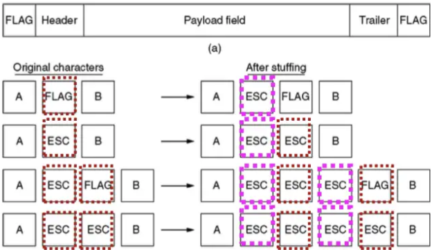

import {DotChartOutlined} from "@ant-design/icons";
import LinkCard from '@site/src/components/LinkCard';
import FileCard from '@site/src/components/FileCard';
import DeadlineProcess from '@site/src/components/DeadlineProcess';
import SocketServerInit from '@site/src/components/SocketServerInit';
import SocketServerThreads from '@site/src/components/SocketServerThreads';
import IconHeader from "@site/src/components/IconHeader";
import { Row, Col } from 'antd';

<h3 style={{color: '#006d75', marginTop: 0, marginBottom: 8}}>实验资源</h3>

<DeadlineProcess start={'2024-09-21 13:25:00'} end={'2024-12-29 23:59:59'}/>
<Row gutter={[16, 4]} justify="space-between" style={{marginBottom: -25}}>
    <Col xs={24} sm={24} md={12} lg={24} xl={12} xxl={12}>
        <FileCard file_type={'md'} name={'Lab7 实验报告模板 Markdown版本'} size={'29705'} link={require('@site/assets/templete/md/Lab7 实验报告模板.zip').default} />
    </Col>
    <Col xs={24} sm={24} md={12} lg={24} xl={12} xxl={12}>
        <FileCard file_type={'doc'} name={'Lab7 实验报告模板 Word版本'} size={'68096'} link={require('@site/assets/templete/word/实验报告模版_实验7.doc').default} />
    </Col>
    <Col xs={24} sm={24} md={12} lg={24} xl={12} xxl={12}>
        <FileCard file_type={'pdf'} name={'Lab7 基于Socket实现自定义协议通信 实验课件'} size={'1967383'} link={require('@site/assets/slides/luxq_Socket编程.pdf').default} />
    </Col>
</Row>
<br/>
:::important 以下指导仅供参考，在满足实验报告中要求的前提下，我们对你的具体实现方式没有要求，你可以自由进行设计与开发
:::

## 0 实验目的与意义

* 深化知识理解：通过Socket API使用实践，增加对网络应用程序的了解，对网络通信的过程与原理获得更鲜活直接的体验与理解
* 提高开发技能：接触日志工具/版本控制工具/自动化测试工具，锻炼协作开发能力与技巧，增强自主学习能力
* 设计自定义协议：通过自己动手设计网络通信协议，体会数据的编码与解码、错误检测与恢复机制的作用与原则
* 实现并发处理：学会处理并发客户端连接，提高处理并发请求的能力，适应当下计算资源并行化与网络应用高并发化的发展趋势

## 1 初试Socket——年轻人的第一个服务端

现实应用中的服务端往往需要考虑到高并发、高可用及安全性等各种各样丰富的特性，但为了方便你上手了解Socket通信的基本方式，我们不妨先实现一个“朴素”的服务端，在本步骤中，我们的服务端将会支持以下能力：

* 接受最多1个客户端连接
* 与客户端建立连接后，发送欢迎信息并结束连接

实现这些功能所需要的代码非常简单，参考实验课件，你应当可以在几分钟内轻松完成

```cpp
// 引入一些必要的头文件
#include <iostream>
#include <string>
#include <cstring> // For memset
#include <unistd.h> // For close
#include <sys/socket.h> // For socket functions
#include <netinet/in.h> // For sockaddr_in

#define SERVER_PORT [你的学号后4位]

int main() {
    int serverSocket, clientSocket;
    struct sockaddr_in serverAddress, clientAddress;
    socklen_t clientAddressLength = sizeof(clientAddress);
    const char* greetingMessage = "Hello from server!";

    // 创建socket
    serverSocket = socket(AF_INET, SOCK_STREAM, 0);
    if (serverSocket < 0) {
        std::cerr << "[Error] Failed to create socket" << std::endl;
        return -1;
    }

    // 设置服务器地址信息
    memset(&serverAddress, 0, sizeof(serverAddress));
    serverAddress.sin_family = AF_INET;
    serverAddress.sin_addr.s_addr = INADDR_ANY;
    serverAddress.sin_port = htons(SERVER_PORT);

    // 绑定socket到本地地址
    if (bind(serverSocket, (struct sockaddr*)&serverAddress, sizeof(serverAddress)) < 0) {
        std::cerr << "[Error] Binding failed" << std::endl;
        return -1;
    }

    // 开始监听客户端的连接请求
    if (listen(serverSocket, 1) < 0) { // 最大连接数为1
        std::cerr << "[Error] Listening failed" << std::endl;
        return -1;
    }
    std::cout << "[Info] Server is listening on port " << SERVER_PORT << "..." << std::endl;

    // 接受客户端连接
    clientSocket = accept(serverSocket, (struct sockaddr*)&clientAddress, &clientAddressLength);
    if (clientSocket < 0) {
        std::cerr << "[Error] Accepting connection failed" << std::endl;
        return -1;
    }

    std::cout << "[Info] Connected to client!" << std::endl;
    // 向客户端发送问好消息
    send(clientSocket, greetingMessage, strlen(greetingMessage), 0);

    // 关闭sockets
    close(clientSocket);
    close(serverSocket);

    return 0;
}
```

完成这部分代码的编写后运行，一般情况下，我们的服务端就会完成绑定并开始监听设定好端口上的连接，由于此时我们还没有客户端，服务端将会被阻塞在`accept()`上，直到有客户端连接

现在，你可以运行测试程序，在下方填入框架、服务端的运行地址，点击发起测试并观察

<SocketServerInit />

我们的测试程序将会模拟一个Socket客户端，与你提供的服务端建立连接并转发所有收到的消息，如果一切正常，我们的服务端将会提示有客户端连接，你也可以在上方组件中看到服务端发来的问候信息

接下来的实验中，我们将从这个毛坯级的服务端开始，逐步为它添加更多的功能，实现最终多客户端、多功能支持的Socket通信

### 1.1 添加Glog日志输出[可选]

在示例代码中，我们添加了一些必要的输出语句以便于你Debug/观察服务端的运行情况，而确保这些输出信息清晰可定位可能会显得比较麻烦，为了简化日志输出，你可以考虑使用Google提供的Glog日志库

以下是一个简单的使用示例，我们提供了一个Glog封装类（使用时我们在`main()`中创建了相应的对象，从而使其在主进程结束时自动析构，避免潜在的内存泄漏等问题），你可以**修改日志保存路径与前缀**后编译体验：

```cpp
#include <iostream>
#include <glog/logging.h> // For glog

class GlogWrapper{ // 封装Glog
public:
    GlogWrapper(char* program) {
        google::InitGoogleLogging(program);
    // highlight-next-line
        FLAGS_log_dir="PATH/prefix_"; //设置log文件保存路径及前缀
        FLAGS_alsologtostderr = true; //设置日志消息除了日志文件之外是否去标准输出
        FLAGS_colorlogtostderr = true; //设置记录到标准输出的颜色消息（如果终端支持）
        FLAGS_stop_logging_if_full_disk = true;   //设置是否在磁盘已满时避免日志记录到磁盘
        // FLAGS_stderrthreshold=google::WARNING; //指定仅输出特定级别或以上的日志
        google::InstallFailureSignalHandler();
    }
    ~GlogWrapper() { google::ShutdownGoogleLogging(); }
};

int main(int argc, char* argv[]) {
    // 初始化 glog
    auto glog = GlogWrapper(argv[0]);

    // 记录不同级别的日志
    LOG(INFO) << "This is an info message.";
    LOG(WARNING) << "This is a warning message.";
    LOG(ERROR) << "This is an error message.";
    // 相当于LOG(ERROR) + return -1；
    // LOG(FATAL) << "This is a fatal message. The program will terminate after this message.";

    // 条件日志
    int x = 2;
    LOG_IF(INFO, x % 2 == 0) << "x is even.";
    LOG_IF(INFO, x % 2 != 0) << "x is odd.";

    // 每n次循环记录一条日志
    for (int i = 0; i < 5; ++i) { LOG_EVERY_N(INFO, x) << "Log every " << x << " iter, current iter：" << i; }
    // 触发段错误，演示崩溃处理效果
    int *p = nullptr;
    p[0] = 0;
}
```

使用`g++`，指定`-lglog`连接Glog库（例：`g++ test.cpp -lglog`），运行编译得到的程序后效果如下：


Glog将会以`Lyyyymmdd hh:mm:ss.uuuuuu threadid file:line] msg`的格式输出日志信息，我们后续的代码的日志输出均会使用Glog，后续不再赘述，关于Glog的完整介绍，请参阅官方文档：

<LinkCard title="Google Logging Library" url="https://google.github.io/glog/stable/logging/#log-files"  icon="https://google.github.io/glog/stable/assets/images/favicon.png">
{"User Guide - Logging"}
</LinkCard>


## 2 客户端实现

有了最基础的服务端，我们可以如法炮制，实现一个极其基础的客户端

```cpp
#include <iostream>
#include <string>
#include <cstring> // For memset
#include <unistd.h> // For close
#include <sys/socket.h> // For socket functions
#include <arpa/inet.h> // For inet_addr
#include <glog/logging.h> // For glog

// 定义服务端地址和端口
#define SERVER_ADDRESS "127.0.0.1"
#define SERVER_PORT [你的学号后4位]

class GlogWrapper{ /* 封装Glog */ };

int main(int argc, char* argv[]) {
    // 初始化 glog
    auto glog = GlogWrapper(argv[0]);
    int clientSocket;
    struct sockaddr_in serverAddress;
    char buffer[1024] = {0};

    // 创建socket
    clientSocket = socket(AF_INET, SOCK_STREAM, 0);
    LOG_IF(FATAL, clientSocket < 0) << "[Error] Failed to create socket";

    // 设置服务器地址信息
    memset(&serverAddress, 0, sizeof(serverAddress));
    serverAddress.sin_family = AF_INET;
    serverAddress.sin_port = htons(SERVER_PORT);
    serverAddress.sin_addr.s_addr = inet_addr(SERVER_ADDRESS);

    // 连接到服务器
    LOG_IF(FATAL, connect(clientSocket, (struct sockaddr*)&serverAddress, sizeof(serverAddress)) < 0)
        << "[Error] Connection failed";

    LOG(INFO) << "[Info] Connected to server at " << SERVER_ADDRESS << ":" << SERVER_PORT;

    // 接收消息
    ssize_t bytesReceived = recv(clientSocket, buffer, sizeof(buffer) - 1, 0);
    if (bytesReceived > 0) {
        buffer[bytesReceived] = '\0';
        LOG(INFO) << "[Info] Message from server: " << buffer;
    } else {
        LOG(ERROR) << "[Error] Failed to receive data";
    }

    // 关闭socket
    close(clientSocket);

    return 0;
}
```

<IconHeader type="lab" title="测试2 客户端连接与接收测试"/>

完成客户端的编写后，指定客户端连接端口为服务端设定的端口，编译后同时运行服务端和客户端（你可以打开多个终端窗口，分别运行服务端、客户端），此时你应当可以在客户端上接收到服务端发来的信息。


## 3 添加多线程能力

现在我们拥有了一对可以通信一次的服务端/客户端，但这样的服务端/客户端显然距离可以实际使用还有很大的距离——设想一下，在以下几种情况下，现有的简单通信模型可能会遇到哪些挑战：

- 若多个客户端几乎同时向服务端请求特定数据

  服务端同时只能处理一个客户端的请求，如果轮流处理各个客户端，则可能在没有请求的客户端上浪费时间/增加有实际请求客户端的响应延迟

- 在用户于客户端输入控制指令的过程中，服务端恰好发送了下线信息

  客户端忙于处理用户输入，没有关注到服务器离线，导致意料外的失败请求

显而易见，我们的程序面临的主要问题是缺乏有效的**并发处理机制**，这使得它在面对并发任务时表现不佳。为了改善这一状况，我们有必要引入更高级的处理策略，比如多线程编程。通过创建多个线程，每个线程专注于处理一个客户端或特定类型的任务，我们可以显著提高系统的效率和响应速度。这样不仅能够让服务端更好地服务于多位客户端，还能确保即使在高负载下也能保持良好的性能和稳定性。

C++11开始，非平台相关的`thread`库的引入使得创建一个新线程变得比较简单，因此这里我们选择使用`std::thread`类（你仍然可以选择使用`pthread`等替代），传入需要在线程中执行的函数及其参数，创建专门处理特定客户端请求的线程对象。

关于`std::thread`的详细介绍，请阅读：

<LinkCard title="std::thread - cppreference.com" url="https://zh.cppreference.com/w/cpp/thread/thread"  icon="https://zh.cppreference.com/favicon.ico">
{"类 thread 表示单个执行线程。线程允许多个函数同时执行。"}
</LinkCard>

### 3.1 服务端多线程改造

```cpp
...
#include <vector>
#include <thread> // For threading
// highlight-next-line
#define MAX_CLIENT_QUEUE 20

void handleClient(int clientSocket) {
    // 向客户端发送问候消息并关闭连接
}

int main(int argc, char* argv[]) {
    // 初始化Glog - 创建socket - 设置服务器地址信息 - 绑定socket到本地地址 - 开始监听客户端的连接请求
    if (listen(serverSocket, MAX_CLIENT_QUEUE) < 0) { ... }
// highlight-next-line
    std::vector<std::thread> threads; // 存储线程对象
    while(true) {
        // 接受新的连接请求
        clientSocket = accept(serverSocket, (struct sockaddr*)&clientAddress, &addressLength);
        LOG_IF(ERROR, clientSocket < 0) << "A client failed to connect.";
        LOG_IF(INFO, clientSocket >= 0) << "A client has connected";
        ...
// highlight-start
        // 创建新线程处理客户端请求
        threads.emplace_back(handleClient, clientSocket);
// highlight-end
    }
    ...
}
```

修改后，我们的代码中主线程仍然负责初始化Socket并循环接受客户端的连接请求，而与第一步中的服务端不同的是，与客户端建立连接后，我们将传入一个处理客户端连接的函数指针与客户端连接句柄，创建相应的客户端处理线程，此时，主线程可以继续处理连接请求而不必关注客户端后续的请求，与客户端间的通信完全地交给了该线程处理

完成多线程能力的实现后，你可以在下方测试组件中填入服务端地址/设置的最大客户端数量，点击发起测试检查服务端的并发处理能力

<SocketServerThreads />

我们的测试框架将会根据你设定的最大客户端数量，创建相应数量的客户端，并反馈每个客户端连接结果与响应，如果一切正常，你应当看到每个客户端都成功连接并受到了来自服务端的消息

### 3.2 客户端多线程改造

由于本部分与下一部分有一定重合，我们建议你在开始实践前，将两部分内容都完整阅读一遍

客户端的多线程需求主要来自用户输入、客户端呈现与服务器指示间的并行性，由于涉及到消息的产生（服务器指示）与消费（客户端呈现），我们不能简单粗暴地将这几个功能分解为不同线程了事，需要对几个线程进行同步

我们不妨先回顾（预习？）一下操作系统中重要的`Producer-Consumer`问题（也被称为`Bounded-buffer Problem`），在该问题中，生产者会产生item存放到buffer中，而消费者可以将数据从buffer中取出item消费

考虑到并行情况下，生产和消费可能同时发生，而对buffer内item的操作并非原子的，需要一定时间完成，这将导致`race condition`的产生

```cpp
// buffer大小为N
semaphore mutex = 1;
semaphore empty = N;
semaphore full  = 0;
```

我们使用3个信号量解决这一问题，`mutex`用于确保同一时刻生产者与消费者仅有一个能对buffer进行操作，而`empty`、`full`则用于确保0\<n\<N，维护buffer占用情况的上下有界

在我们的客户端中，存储传入数据包的消息队列即是我们需要关注的buffer，Socket连接处理线程作为生产者，将接收到的服务器发送来的数据包写入buffer；而消息呈现线程作为消费者，从buffer中取出数据包反馈给用户

区别在于，对于我们的需求，buffer可以视为无限大，因此我们可以简化为使用一个互斥锁`mutex`和一个条件变量`conditional_variable`解决

```cpp
mutex mtx;
condition_variable response;
queue<packet> msgQueue;
```

#### 生产者

```cpp
unique_lock<mutex> msgLock(mtx); // acquire lock for message queue
...
msgQueue.push(pktIn);
response.notify_all(); // notify consumer to present the message
```

我们首先获取对消息队列的互斥锁，完成操作后通知消费者处理信息，对锁的占用会随着离开作用域后`unique_lock`的析构自动释放

#### 消费者

```cpp
unique_lock<mutex> msgLock(mtx);
while(msgQueue.empty()) response.wait(msgLock);
// Get response from queue and output it
...
```

消费者侧我们同样先获得对消息队列的互斥锁，等待生产者产出消息后进行消费，条件变量在等待时会自动释放锁，在从等待状态恢复后自动重新获取锁

需要注意的一点是，wait有时会在没有任何线程调用notify的情况下返回，这种情况就是有名的[spurious wakeup](https://docs.microsoft.com/zh-cn/windows/desktop/api/synchapi/nf-synchapi-sleepconditionvariablecs)，因此一般在使用时，我们会将条件判断由`if`修改为`while`，确保被唤醒后确实符合唤醒条件再继续运行

:::info 虚假唤醒
指的是在多线程环境下，多个线程等待在同一个条件上，等到条件满足时，所有等待的线程都被唤醒，但由于多个线程执行的顺序不同，后面竞争到锁、获得运行权的线程在运行时条件已经不再满足，线程应该睡眠但是却继续往下运行的一种现象。
:::


## 4 通信协议设计——设计属于你的语言

目前我们的服务端/客户端只能传递固定的消息，没有理解变长消息/往来的请求与指示的能力，这是因为我们还没有在服务端-客户端之间设计一套沟通的语言，也即通信协议。通信协议是指双方实体完成通信或服务所必须遵循的规则和约定；通过通信信道和设备互连起来的多个不同地理位置的数据通信系统，要使其能协同工作实现信息交换和资源共享，它们之间必须具有共同的语言；**交流什么、怎样交流及何时交流**，都必须遵循某种互相都能接受的规则，这个规则就是通信协议。

在本部分中，我们将带你设计属于自己的通信协议，规范化服务端-客户端间的通信方式。

对于数据包的设计，我们主要关注以下几点：

* 定界——如何区分连续到达的两个数据包？如何辨别数据包内控制信息等各类字段的具体位置？
* 透明传输——协议应当能承载任何允许传输的数据而不会对其产生意料外的改变

为了解决这些问题，我们不妨观察一下现有协议的解决方式：

### 4.1 数据包定界——以帧定界为例

* **字符计数法**

  

  发送方在每帧的首个字段，标记该帧长度，接收方接收到首个字段即了解该帧总长度

  对于我们的Socket通信而言，可以认为传输层已帮我们解决了纠错问题，无需担心出错，因此这样的方式也是可行的

* **字节填充的标志字节法** `Byte Stuffing`

  

  每一帧使用特殊的标记字节作为帧界，如传输的数据内包含标记字节，则需进行转义与恢复，以保证透明传输

* **比特填充的标志比特法** `Bit Stuffing`

  

  以特殊的位模式作为帧界，对于传输数据内的位模式，自动填0/恢复以保证透明传输

### 4.2 字段定界

* **固定头部 + 变长数据体结构**

  | 例：0 - 1b |   1 - 2b   | 2 - 10b  | 10 - ?b  |
    |:--------:| :--------: | :------: | :------: |
  |   消息类型   | 消息子类型 | 消息长度 | 变长数据 |

    - **头部设计**：定义一个固定长度的头部，其中包含必要的控制信息（如消息类型、长度等），这使得接收方能够正确解析消息

    - **数据体设计**：数据体的长度可以根据需要变化，头部中应包含指示数据体长度的信息

    - **优点**：简单明了，易于实现和解析

    - **缺点**：头部固定占用一定的传输空间，对于非常短的消息来说可能不太划算

* **带有标签的数据字段**

  HTTP协议即是一个例子，在HTTP头部，每个字段都是由一个名称和一个值组成，中间用冒号（:）分隔。字段名和字段值之间可以有空格，但不是必需的；每一对键值后面会跟一个换行符（CRLF，即`\r\n`）表示字段的结束

  由于Lab8需要在Lab7基础上完成，你可以在设计协议时提前考虑这一点，为后续实验预留充分的扩展空间

  ```HTTP
  HTTP/1.1 200 OK\r\n
  // highlight-start
  Date: Wed, 02 Aug 2024 12:00:00 GMT\r\n
  Server: Apache/2.4.41 (Unix)\r\n
  Content-Length: 123\r\n
  Content-Type: text/html; charset=UTF-8\r\n
  // highlight-end
  \r\n
  <html>
      <head>
      	<title>Example Page</title>
      </head>
      <body>
          <h1>Hello, World!</h1>
          <p>This is an example of an HTTP response.</p>
      </body>
  </html>
  ```

    - **标签化字段**：每个消息由一系列带有标签的字段组成，字段间使用分界标识标记，或在字段首部标记字段长度

    - **优点**：非常灵活，可以轻松添加新的消息类型或字段而不需要改变整个协议

    - **缺点**：可能需要处理变长内容中的分界标识以保证透明传输，增加了潜在的复杂性；标签开销较大

* **使用TLV（Tag-Length-Value）格式**

  ```yaml
  # 假定约定用户名/密码的TAG分别为1/2
  TAG (1 byte): 0x01
  LENGTH (1 byte): 0x08
  VALUE (13 bytes): 0x68656c6c6f6f40776f726c642e636f6d # ASCII 表示 'helloo@world.com'
  TAG (1 byte): 0x02
  LENGTH (1 byte): 0x02
  VALUE (4 bytes): 0x31323334  # ASCII 表示 '1234'
  # 得到的数据包：01 08 68656c6c6f40776f726c642e636f6d 02 31323334
  ```

    - **TLV结构**：每个消息元素都由类型标签（Tag）、长度（Length）和值（Value）三部分组成

    - **优点**：非常灵活，可以轻松添加新的消息类型或字段而不需要改变整个协议；标签与头部开销友好

    - **缺点**：解析较为复杂；可读性较差

### 4.3 自定义通信协议

以上是一些比较经典的示例，你可以根据这些例子各自的优缺点，结合其思路或采用新方法，设计你自己的通信协议，具体来说，需要考虑好以下几个问题：

* 定义两个数据包的边界如何识别
* 定义数据包的类型表示方式（请求、指示、响应等）
* 定义数据包内数据字段的格式

在开始设计前，你可以提前了解Lab8的实验内容，在设计实现时为支持HTTP协议预留空间，可以减少后续实验的工作量

:::warning 实现通信协议时，禁止照搬/抄袭“前人智慧”，无脑使用定长数据包将使后续实验完成产生困难
:::

设计完成通信协议后，我们的服务端/客户端即在沟通方式上达成一致，后续的通信都将使用相同的格式进行

### 4.4 数据包序列化

设计良好的通信协议对于实现设备间高效、可靠的数据传输至关重要。然而，以字节流或比特流形式存在的原始数据难以直接利用，试想以下，如果所有功能都需要对数据包特定位置逐个字节/比特读写，那该是多让人掉头发的事情！为提高开发、测试及后续维护等各阶段的工作效率，我们的程序中必然采用特定的数据结构来表示协议中的数据包。

然而，C++中的数据结构并不适合直接在网络上传输，这意味着在网络传输过程中，我们仍然需要采用字节流或比特流的形式，这种必要的转化即被称为序列化；相反地，将接收到的字节流或比特流还原成原来的数据结构的过程则称为反序列化。序列化与反序列化确保了不同系统间可以顺利交换信息，同时保持数据的一致性和完整性。

值得注意的是，在遵循相同协议的服务端和客户端之间，序列化与反序列化的规则也必须保持一致。这意味着无论是在发送端还是接收端，处理数据的方式应当相同，从而保证双方能够正确理解和解析对方发送的数据，这种共性使得我们**可以且需要**对服务端/客户端应用一致的Socket处理逻辑

因此，你可以考虑**自行**对Socket进行封装，接收传入的数据包，按照协议完成序列化后，调用原生Socket API完成数据发送，在接收方按照协议反序列化。此时我们的服务端/客户端只需要组装/分析定义好的数据包即可完成通信，而无需处理Socket底层实现


以下是一个封装的例子，封装序列化/反序列化逻辑后，我们可以使用和原生Socket传输字节流类似的接口，传输我们的数据包数据结构，还可以通过运算符重载，使你封装好的Socket具有类似`std::cin` / `std::cout`的特性，进一步简化你的开发过程：
```cpp
class mySocket{
protected:
    ... // Socket infomation
public:
    mySocket(...) :(...) { ... }; // Constructors
    ~mySocket() { /* closes the socket before exit */ }
    ... // Getters
    // socket utilities
    bool send(packet &pkt) const { /* serialize & send */ }
    auto recv(packet &pkt) { /* recv & deserialize */ }
    // Operator overloaded for easier use
    bool operator==(...) const { ... }
    friend mySocket& operator>>(...);
};
```

封装后，每个连接对应一个`mySocket`对象，你可以通过管理`mySocket`对象实现对连接的管理，同时也可以通过对象生存期的控制，在析构时自动完成下线告知、关闭socket等操作，简化通信过程


## 5 运行控制

截至目前，我们的服务端/客户端仍然处于脱缰野马的状态，用户无法输入控制以对功能进行请求，在本部分中，我们将会完善服务端/客户端，使之响应我们的控制

### 5.1 退出逻辑

几乎所有程序都会有结束运行的时刻，但不同进程结束的方式往往会产生不同的结果。强制终止进程的方式过于简单粗暴，使得我们的程序通常不能处理好“身后事”（如：释放内存、告知客户端连接中止等），因此本部分中，我们将带你实现合理的退出逻辑，使你的服务端/客户端能够优雅地结束运行。

:::important 在按照实验报告要求测试服务器断连等情况时，如果无论如何均无法避免服务端向客户端发送下线告知消息，请考虑暂时注释本部分代码，以模拟异常退出/断联状态，如仍然无法模拟相应情况，请考虑使用实体机进行相应步骤测试
:::

你可能已经意识到，退出信号作为一种用户输入，也需要与其他功能并行处理，因此，这里为你提供了2种可能的设计思路：

* 主线程处理退出信号

  为了接受用户的退出信号，你可以将原来Socket初始化的逻辑交给一个子线程运行，在主线程中循环读入用户输入进行相应的操作

* 接管退出信号

  在平时运行程序时，相信你已经习惯于使用`Ctrl + C`组合键中止程序运行，那么，是否有可能在用户按下组合键时，先处理结束运行需要完成的各项事务，再按照一般流程退出程序呢？答案是肯定的，`csignal`库为我们提供了注册自定义信号处理函数的方式，只需要编写退出处理函数，再注册到相应的信号，即可在产生相应信号时自动处理退出逻辑

  ```cpp
  // include necessary header
  ...
  #include <csignal> // exit signal handling

  void exitHandler(int signal) {
      // handle tasks before exit
      ...
      exit(0);
  }

  int main(int argc, char** argv) {
  // highlight-start
      // Register exit handler to exit signals
      signal(SIGINT,  exitHandler); // Ctrl + C
      signal(SIGQUIT, exitHandler); // Ctrl + '\'
      signal(SIGHUP,  exitHandler); // current user log off
    // highlight-end
      ...
      // start normal operation
      ...
  }
  ```

在获取到退出信号后，我们不能直接退出主线程——其他子线程仍然需要完成退出，幸运的是，全局变量对于同一进程的各个线程也是全局可见的，因此你可以定义一个全局`boolean`变量用于指示结束运行，将原本的无限循环条件替换为该变量；通过在退出处理函数内对该变量的修改，各个子线程在下次循环即会退出（在退出处理函数完成此步骤前，请先将所有Socket`close()`，使子线程自动结束在`recv()`的阻塞状态，从而进入下次循环并退出）

### 5.2 用户输入处理 - 客户端

:::important 服务端不需要接受用户输入控制，仅需要实现退出逻辑
:::

客户端提供了较多功能，要让用户能够使用，我们就需要支持接受用户输入选择功能，这部分相对较为简单，你需要实现以下功能：

* 根据当前状态，向用户展示可选功能
  * 未连接服务器时：连接服务器 / 退出
  * 连接服务器时：断开连接 / 请求服务端时间 / 请求服务端名称 / 请求服务端已连接客户端列表 / 发送消息 / 退出

* 持续读入用户输入
* 根据用户输入，按照设计的通信协议组装相应的数据包

可能对你有些微帮助：

* 指定读入行的截止字符 `getline([istream], [string], [截止字符]);`

* 结构化绑定  `C++17`开始可用

  对于含多元素容器，如`pair[int, string]`，可直接将其解构并绑定到指定的局部变量上，这使得遍历`map`等时可以避免较模糊的`.first`/`.second`

  ```cpp
  std::map<std::string, int> list;
  // highlight-start
  // Structural Binding
  for(auto const& [addr, port] : list) { cout << addr << port; }
  // highlight-end
  // Previous method, What the hell is .first ?
  for(auto const& iter : list) { cout << iter.first << iter.second; }
  ```

* 输出格式化

  引入`iomanip`库，可指定输出每个元素所占宽度/对齐/空白填充方式等，实现格式化输出

  ```cpp
  cout << a << setw(6) << b << setw(22) << c << setw(16) << d << endl;
  ```

* ……

你可以自由设计客户端功能展示与选择的形式，我们对此不作过多要求；交互形式上，采用CLI/GUI均可，但使用GUI/复杂CLI交互没有额外加分


## 6 功能实现

### 6.1 整体逻辑

在完成上述步骤后，我们的服务端/客户端已经非常接近于可用状态了，现在，我们只需要添加具体功能实现的逻辑，即可让两端间传递有效数据

具体来说，我们需要按照以下流程，处理来自用户或客户端的请求：

* 通过用户输入或通过Socket接收数据包，接受请求输入
* 解析请求类型与需求
* 根据请求类型，完成相应操作并生成相应反馈
* 将反馈信息作为响应提供给用户/客户端

以下是一个较为粗略的实现思路框架，供你参考：

```cpp
// process request for different functions
pkt func1Handler(params) { ... }
pkt func2Handler(params) { ... }
...

// retrive request and dispach tasks
void connectionHandler(int socket) {
	while (!shouldExit) {
        // get request from user input or client request packet
        // parse target function
        if (func1) res = func1Handler(params);
        if (func2) res = func2Handler(params);
        ...
        // construct and provide response
    }
}
```

在上述实现中，我们在无限循环中持续处理新的请求，并根据需求类型，将任务分派给其他函数，产生相应的响应结果。

软件工程/OOP告诉我们，好的软件设计应当做到“高内聚、低耦合”，而一个好的内聚模块，应当尽可能只做好一件事。因此，我们的请求处理部分应当尽可能关注请求的接收与响应任务，而对于相对无关的生成客户端列表、获取当前时间等职能，则不应该处理其业务逻辑。

为了保持高内聚度，这里我们选择将这些独立的职能拆分为单独的处理函数，根据类型进行相应的调用。可以看到，对模块进行拆分后，我们能够更清晰地分别了解请求处理部分与其他功能部分的业务逻辑，降低了后续Debug/扩展的难度。

### 6.2 服务器功能实现

具体来说，你需要实现以下功能：

* 断开连接请求

  移除当前客户端连接记录；结束连接处理子线程

* 获取时间/名字/客户端请求

  根据设计的通信协议，组装相应的响应数据返回给客户端

* 发送消息请求

  尝试向用户请求的客户端发送消息；发送后，根据设计的通信协议，将发送结果（客户端不存在/发送成功等）组装相应的响应数据返回给客户端

每次循环，你都需要调用`recv()`接收客户端发来的数据包，接收完成后，根据请求类型，调用对应处理函数，将处理结果组装为响应数据包，发送给客户端

### 6.3 客户端功能实现

在前序步骤中，我们已经完成了用户输入的处理逻辑，因此本步骤中，我们只需要分别实现被调用功能的具体逻辑，并实现信息的呈现即可

#### 功能调用

具体来说，你需要实现以下功能：

* 断开功能

  关闭Socket连接（析构封装Socket）；更新连接状态为未连接；结束连接处理子线程

* 获取时间/名字/客户端功能

  根据设计的通信协议，组装相应的请求数据包，发送给服务端

* 发送消息功能

  接受用户输入的目标客户端与发送内容，请用户输入客户端的列表编号和要发送的内容，根据设计的通信协议，组装相应的请求数据包，发送给服务端

* 退出功能

  如已和服务器建立连接，关闭Socket连接（析构封装Socket）；退出程序

每次循环，你都需要接受用户输入，根据功能类型，调用对应处理函数，将处理结果组装为请求数据包，发送给服务端

#### 消息呈现

进行功能调用后，服务端会返回相应的响应数据包，其他客户端也可能借助服务端向我们的客户端发送消息，我们需要将这些信息以合理的形式呈现出来

由于接受用户输入会阻塞当前线程，你需要以单独一个线程处理消息的呈现逻辑，以确保消息的及时展示

消息呈现线程从消息队列中取出消息，根据消息类型选择合适的格式进行展示，其与Socket连接处理线程的同步问题解决请参照[3.2节](/docs/Lab7_page#32-客户端多线程改造)

### 6.4 功能测试

<IconHeader type="lab" title="测试4 功能效果测试"/>
你需要使用Wireshark开始数据包捕获，使用客户端连接服务端，分别请求获取时间、获取名字、获取客户端列表、发送消息功能，观察客户端（含接收消息的客户端）与服务端的显示、Wireshark抓取到的数据包情况，并截图填入实验报告

<IconHeader type="lab" title="测试5 断连效果测试"/>
:::important 本步骤是为了增强你对TCP连接状态的理解，不是要求断开网络连接后清除异常连接，请按照你观察到的实际情况进行记录与分析
:::

拔掉客户端的网线，然后退出客户端程序。观察客户端的TCP连接状态，并使用Wireshark观察客户端是否发出了TCP连接释放的消息。同时观察服务端的TCP连接状态在较长时间内（10分钟以上）是否发生变化。

再次连上客户端的网线，重新运行客户端程序。选择连接功能，连上后选择获取客户端列表功能，查看之前异常退出的连接是否还在。选择给这个之前异常退出的客户端连接发送消息，出现了什么情况？

<IconHeader type="lab" title="测试6 连续请求响应测试"/>
你需要使用Wireshark开始数据包捕获，使用客户端连续请求获取时间100次（你可以修改代码，使每次调用请求时间功能均会发出100个数据包），记录客户端接收到的响应数量是否匹配（你可以在代码内加入收到时间次数的计数器），并观察Wireshark抓取到的数据包数量是否匹配，将结果截图填入实验报告

<IconHeader type="lab" title="测试7 多客户端连续请求响应测试"/>
你需要使用Wireshark开始数据包捕获，使用多个客户端连接服务端，同时开始连续请求获取时间100次（你可以修改代码，使每次调用请求时间功能均会发出100个数据包），观察客户端（含接收消息的客户端）与服务端的显示情况，并截图填入实验报告

<IconHeader type="lab" title="测试8 TCP断开连接后状态观察"/>
客户端主动断开连接后，使用netstat -an查看当时的TCP连接状态是什么，并注意该状态保持的时间长度
