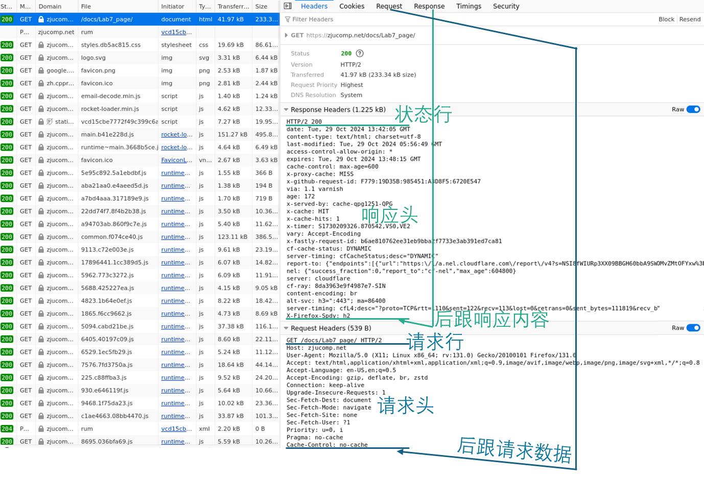

import {Alert} from 'antd';
import FileCard from '@site/src/components/FileCard';
import DeadlineProcess from '@site/src/components/DeadlineProcess';
import { Row, Col } from 'antd';
import MappedCollapse from "@site/src/components/CollapseContent";
import HTTPVersions, {HTTPMethods, HTTPMethodsExtras, cacheAttrInfo, negotiationAttrInfo, resourceAttrInfo, securityAttrInfo} from '@site/src/compData/HTTPInfo.js';
import IconHeader from "@site/src/components/IconHeader";
import LinkCard from '@site/src/components/LinkCard';
import Tabs from '@theme/Tabs';
import TabItem from '@theme/TabItem';

<Alert message="文档尚未编写完成，请先参考实验PPT与报告模板步骤，如对实验有疑问可先钉钉提问，感谢理解" type="warning" showIcon/>
<br/>

<h3 style={{color: '#006d75', marginTop: 0, marginBottom: 8}}>实验资源</h3>

<DeadlineProcess start={'2024-09-21 13:25:00'} end={'2024-12-29 23:59:59'}/>

<Row gutter={[16, 4]} justify="space-between" style={{marginBottom: -25}}>
    <Col xs={24} sm={24} md={12} lg={24} xl={12} xxl={12}>
        <FileCard file_type={'md'} name={'Lab8 实验报告模板 Markdown版本'} size={'26341'} link={require('@site/assets/templete/md/Lab8 实验报告模板.zip').default} />
    </Col>
    <Col xs={24} sm={24} md={12} lg={24} xl={12} xxl={12}>
        <FileCard file_type={'doc'} name={'Lab8 实验报告模板 Word版本'} size={'61440'} link={require('@site/assets/templete/word/实验报告模版_实验8.doc').default} />
    </Col>
    <Col xs={24} sm={24} md={12} lg={24} xl={12} xxl={12}>
    </Col>
</Row>
<br/>
:::important 以下指导仅供参考，在满足实验报告中要求的前提下，我们对你的具体实现方式没有要求，你可以自由进行设计与开发
:::

## 0 实验目的与意义

* 深化知识理解：通过Socket API使用实践，增加对网络应用程序的了解，对网络通信的过程与原理获得更鲜活直接的体验与理解
* 提高开发技能：接触日志工具/版本控制工具/自动化测试工具，锻炼协作开发能力与技巧，增强自主学习能力
* 设计自定义协议：通过自己动手设计网络通信协议，体会数据的编码与解码、错误检测与恢复机制的作用与原则
* 实现并发处理：学会处理并发客户端连接，提高处理并发请求的能力，适应当下计算资源并行化与网络应用高并发化的发展趋势

## 1 初识HTTP——概念浅析

HTTP，即超文本传输协议（Hyper Text Transfer Protocol），定义了客户端（通常是Web浏览器）与服务器之间请求和响应的格式。HTTP的简单与强大使其成为了互联网上应用最广泛的网络协议之一，无论是访问网页，还是在线APP加载，都有HTTP的身影

在这一部分，我们将带你了解HTTP相关的基本概念，你可以边学习边打开开发者工具（Ctrl + Shift + J 或 F12），选择网络Tab后刷新页面重载，观察网页加载过程发生的动作，加深对相应知识的理解


如果你的列表中显示的信息较少，可以右键顶部字段（如“名称”），并勾选想要查看的字段，我们推荐你选择方法、状态、域

为了便于你清晰地观察和筛选头字段，开发人员工具有时会对头部进行结构化解析，这个过程可能会丢弃HTTP版本等信息，你可以开启Raw开关查看原始的响应（Edge不支持该特性）


关于更多信息，请参见你所使用的浏览器的开发者文档

<Tabs className="unique-tabs"  groupId="browser">
    <TabItem value="Microsoft Edge">
        <LinkCard title="网络功能参考" url="https://learn.microsoft.com/zh-cn/microsoft-edge/devtools-guide-chromium/network/reference"  icon="https://learn.microsoft.com/favicon.ico">
            {"网络功能参考 - Microsoft Edge Developer Documentation | Microsoft Learn"}
        </LinkCard>
    </TabItem>
    <TabItem value="Google Chrome">
        <LinkCard title="网络功能参考" url="https://developer.chrome.com/docs/devtools/network/reference?hl=zh-cn"  icon="
https://www.gstatic.com/devrel-devsite/prod/v0e3f58103119c4df6fb3c3977dcfd0cb669bdf6385f895761c1853a4b0b11be9/chrome/images/favicon.png">
            {"网络功能参考 | Chrome Dev Tools | Chrome for Developers"}
        </LinkCard>
    </TabItem>
    <TabItem value="Mozilla Firefox">
        <LinkCard title="Network Monitor" url="https://firefox-source-docs.mozilla.org/devtools-user/network_monitor/"  icon="https://firefox-source-docs.mozilla.org/_static/firefox.ico">
            {"Network Monitor - Firefox  Source Docs Documentation"}
        </LinkCard>
    </TabItem>
</Tabs>


### 1.1 HTTP版本演进

过去三十年间，为了适应通讯与计算技术的迅猛发展，万维网联盟（W3C）和互联网工程任务组（IETF）也在对HTTP进行持续的迭代，目前最新的HTTP版本是HTTP/3.0；在实验中，你只需要实现HTTP/1.0版本的部分基本特性即可，其他HTTP版本的特性仅供你延伸学习，我们的理论课程也会覆盖这部分内容

<MappedCollapse items={HTTPVersions} defaultActiveKey={['HTTP/1.0']} size={'small'} />

<IconHeader type="tryout" title="动手试1 观察自己加载网页使用的HTTP版本" style={{paddingTop: 16}}/>

选中一个网络请求，查看其版本（Edge不支持该查看，需要使用Wireshark抓包）


实际上，我们浏览网页时使用的HTTP版本与客户端-中间网络设备-服务端中每个环节的支持情况都息息相关，尽管HTTP/3带来了各方面的显著优化，但架构的调整也使得互联网尚需时日才能更好地兼容与适配，目前最主流使用的版本仍然是HTTP/2

<div style={{position: "relative", width:'100%', height: '400px'}}>
    <iframe style={{position: 'absolute', width: '100%', height: '100%'}} src="https://radar.cloudflare.com/embed/HttpVersionXY?botClass=&chartState=%7B%22showAnnotations%22%3Atrue%2C%22xy.hiddenSeries%22%3A%5B%5D%2C%22xy.highlightedSeries%22%3Anull%2C%22xy.previousVisible%22%3Atrue%7D" title="Cloudflare Radar - HTTP/1.x vs. HTTP/2 vs. HTTP/3" loading="lazy"></iframe>
</div>
### 1.2 HTTP协议格式介绍


#### 1.2.1 HTTP请求

* 请求行：请求方法  URI  HTTP版本
* 请求头：以key: value键值对的形式，描述请求的属性，键值对间以CRLF（\r\n）间隔
* 空行：使用一个CRLF表示报头结束，接下来是正文内容
* 请求正文：请求相关的信息和数据，正文可以为空，如果存在请求正文，则请求头会使用一个`Content-Length`属性标记正文长度

#### 1.2.1 HTTP响应

* 状态行：HTTP版本  状态码  状态码描述
* 响应头：以key: value键值对的形式，描述响应的属性，键值对间以CRLF（\r\n）间隔
* 空行：使用一个CRLF表示报头结束，接下来是正文内容
* 响应正文：响应的数据，正文可以为空，如果存在正文，则响应头会使用一个`Content-Length`属性标记正文长度

可以注意到，HTTP协议很好地定义了每个数据包自身的几个关键信息：我要去哪（请求URI）以怎样的方式（头部属性）做什么（HTTP方法），具体是（正文），后续部分中，我们会逐一讲解各个部分，带你逐步实现一个较为完整的Web服务器

<IconHeader type="tryout" title="动手试2 观察一对HTTP请求与响应" />

你可以打开开发人员工具-网络，刷新一下页面，观察每个请求和响应的情况



在实际应用中，我们的浏览器或应用程序会发起HTTP请求，Web服务器则会根据请求进行相应的操作，并组装并返回相应的HTTP响应数据包

由于HTTP/2及以前的版本中，整个通信过程都是基于TCP协议的，我们只需要以在Lab7 Socket编程的基础上进行一些简单的修改，就能搭建起一个简单的“Hello World”Web服务器

具体来说，此时的客户端由我们的浏览器充当，而服务端则需要简单调整连接后的处理逻辑，在建立Socket连接后，服务器固定返回一段符合HTTP响应格式的数据包，然后关闭连接即可

```cpp
// retrive request and dispach tasks
void connectionHandler(int socket) {
	while (!shouldExit) {
        // construct and provide response
        string response = "HTTP/1.0 200\r\nContent-Length: 12\r\n\r\nHello World!";
        // send response
        ...
        // close the connection
    }
}
```

<IconHeader type="lab" title="测试1 测试Hello World Web服务器" />

在浏览器内输入127.0.0.1:[你学号的后4位，首位为0则在前面补1]，观察浏览器是否显示了“Hello World”


## 2 HTTP方法浅析

在HTTP协议中，方法是指客户端与服务器之间交互时使用的**动词**，它们定义了请求的目的和期望的行为

通过这些方法，客户端可以向服务器表达不同的操作意图，如获取资源、提交数据或删除资源等，一般来说，我们最为常用的是GET和POST方法，另一些方法在特定情况下会非常有用

<MappedCollapse items={HTTPMethods} defaultActiveKey={['GET方法']} extras={HTTPMethodsExtras} size={'small'}/>
<IconHeader type="tryout" title="动手试2 使用不同HTTP方法并观察请求与响应" />

你可以点击测试按钮，发起相应方法的请求，并在开发人员工具中观察请求与相应情况

你可能已经注意到了——POST方法能携带数据并返回响应，看起来我们提到的其他方法也可以通过POST方法加参数实现。那么，为什么要专门分为这些不同的HTTP方法呢？除了遵守RESTful架构，进行面向资源的标准化设计的目的以外，也有对以下特性的考量：

- **幂等性**：指的是连续多次相同的请求对服务器状态**不会造成额外的影响**。例如，删除某个文件的操作是幂等的，即无论删除请求发送多少次，最终的结果都是该文件在服务器上处于已删除状态，不会导致服务器凭空生成新文件或恢复已删除的文件等“闹鬼”一样的现象。对于不甚可靠的网络环境来说，幂等性尤为重要，因为请求可能会因网络延迟、重试机制等原因而被重复发送。幂等性能够确保数据的**一致性和可预测性**，即使不慎进行了重复操作，也能保证业务的安全进行。

- **缓存**：缓存机制允许将响应结果存储在客户端或其他中间节点，以便后续请求可以直接使用缓存的数据，而无需再次向服务器发起请求。这不仅减少了服务器的负载，还提高了响应速度。例如，`GET` 请求通常被认为是可缓存的，因为它们主要用于获取资源，且不会改变服务器状态。合理利用缓存可以显著提升用户体验和系统性能。


|  方法  | GET/HEAD/OPTION | PUT/DELETE | POST/PATCH |
| :----: | :-------------: | :--------: | :--------: |
| 幂等性 |        √        |     √      |     ×      |
|  缓存  |        √        |     ×      |     ×      |

现在，我们可以根据对几种方法的要求，实现对HTTP请求方法的解析

```cpp
void getHandler(info, pkt) {}
void postHandler(info, pkt) {}
...

// retrive request and dispach tasks
void connectionHandler(int socket) {
	while (!shouldExit) {
        // extract HTTP methods
        ...
        // handle request according to method, construct response
        if (method == "GET") getHandler(info, pkt);
        if (method == "POST") postHandler(info, pkt);
        ...
        // return response
        ...
        // close the connection
    }
}
```

<IconHeader type="lab" title="测试2 测试HTTP方法解析" />

为了便于测试你对方法的提取是否正确，请你根据不同的方法，以如下格式进行返回：

```cpp
GET → "HTTP/1.0 200\r\nContent-Length: 4\r\n\r\nGET#"
POST → "HTTP/1.0 200\r\nContent-Length: 4\r\n\r\nPOST"
```

我们的测试程序将会测试你实现的程序，检验各种情况下是否能正确解析请求的HTTP方法，返回相应的值


## 3 头字段解析

HTTP方法能够有效地表示请求的类型，然而，对于请求本身及其携带的数据，我们还需要更多的属性信息才能高效地解析与应用

对于HTTP协议而言，这一需求是通过头字段实现的，HTTP的头字段由键值对(`key: value`)组成，键值对之间使用CRLF分隔，一些头字段只能用于请求头或响应头，而另一些头字段则在请求头和响应头均可使用，具体来说，头字段可以描述：

:::info 提示
以下内容供你学习参考，实验中，你只需要支持必需的**Content-Length**和**Content-Type**字段即可，其他字段可以忽略
:::

* **资源属性**  如资源的类型、编码方式、最后修改时间等，帮助接收方正确处理接收到的数据

    <MappedCollapse items={resourceAttrInfo} size={'small'}/>

* **缓存属性**  指示资源是否能/如何被缓存，从而提高网络性能，优化用户体验

    <MappedCollapse items={cacheAttrInfo} size={'small'}/>

* **安全/隐私属性**  如要求身份验证、限制跨域请求等，用于增强用户的安全性和隐私保护

    <MappedCollapse items={securityAttrInfo} size={'small'}/>

* **机制协商**  如接收方的内容类型偏好或处理能力，以便发出方选择最适合的内容进行响应

    <MappedCollapse items={negotiationAttrInfo} size={'small'}/>

在前序步骤中，我们已经将HTTP请求的各部分进行了分离，得到了完全由头字段组成的请求头，由于HTTP使用CRLF分隔，你可以将请求头转化为一个`istringstream`，逐个读入直到遇到结尾，即可很方便地将请求头进一步分解为一个个头字段


为了检验你对头字段的解析，我们不妨实现一个简单的WebEcho功能，具体步骤如下：

* 解析头字段，得到`Content-Length`字段的值，并读入相应长度的正文

* 组装响应数据包，至少要包含`Content-Length`、`Content-Type`字段，响应正文为解析到的请求正文的完整内容

* 返回响应数据包并关闭连接

我们的测试服务对你的WebEcho功能有以下几点要求：

* 测试服务可能会随机添加各种头字段，对于不要求支持的字段，你的程序应当能正确处理（可以选择直接忽略），并正常返回响应

* 测试服务会生成随机长度的请求正文，你返回的`Content-Length`、`Content-Type`字段及响应正文内容需要与该请求正文完全匹配

<IconHeader type="lab" title="测试3 测试服务器的WebEcho功能" />


## 4 统一资源标识符 URI

随着互联网的发展，人类每天在互联网上产生的数据体量也在急速膨胀，面对浩如烟海的资源，如果没有合理的方式对其进行标记，那么我们的组织、管理和访问就会无异于大海捞针

在这个背景下，统一资源标识符URI（Uniform Resource Identifier）应运而生，它为互联网上的资源提供了一种标准化的命名和定位机制，极大地便利了资源的发现与访问过程

URI是一种字符串，用于唯一地标识互联网上的资源。它可以指向任何类型的资源，包括文档、图片、视频流、服务入口点等，URI的设计目的是为了确保每个资源在全球范围内都能被唯一识别

根据其功能和结构的不同，URI可以进一步划分为URL和URN两种类型。

* **统一资源定位符URL（Uniform Resource Locator） **

  最常见的URI形式，提供了访问特定资源的路径和方法，URL不仅告诉计算机资源是什么，更重要的是说明了如何找到并获取这个资源，一个典型的URL结构如下所示：

  ```makefile
  scheme://host[:port]/path?query#fragment
  ```

  - **scheme**：指定访问资源时使用的协议类型，如HTTP、HTTPS、FTP等

  - **host**：资源所在的主机名或IP地址

  - **port**：可选字段，指定主机上的端口号，默认情况下，不同的协议会使用不同的端口，例如HTTP默认使用80端口，HTTPS使用443端口

  - **path**：资源在服务器上的具体位置

  - **query**：可选字段，用于传递给服务器的查询参数，通常以键值对的形式出现

  - **fragment**：可选字段，用于指示页面内部的一个特定部分或元素，通常用于页面内的导航，比如通过http://zjucomp.net/docs/Lab8_page#3-%E7%BB%9F%E4%B8%80%E8%B5%84%E6%BA%90%E6%A0%87%E8%AF%86%E7%AC%A6-uri访问本文档时，可以直接跳转到第4部分

* **统一资源名称URN（Uniform Resource Name）**

  URN更关注于资源的身份标识而非物理位置，旨在提供一种持久不变的名字空间，即使资源的实际位置发生变化，其URN仍然保持不变，它的格式通常为：

  ```cpp
  <nns>:<specifics>
  ```

  * **nns**：命名空间标识符，用于定义URN所属的命名空间
  * **specifics**：命名空间内的具体标识符，用于唯一确定资源
