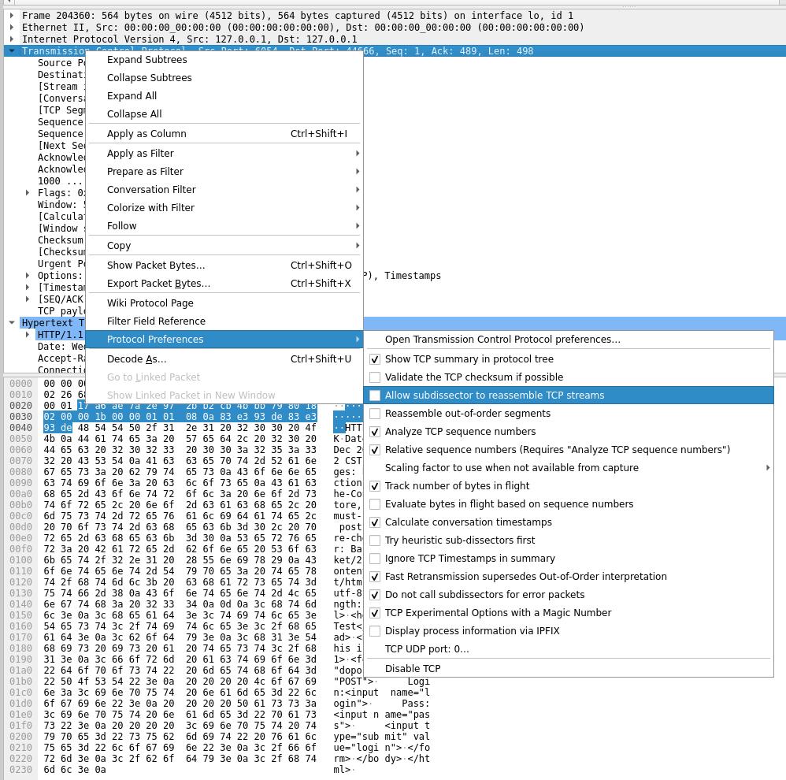

本页面将收集并解答一些Wireshark使用中遇到的问题，欢迎你提问/分享你解决遇到问题的方法

* Lab8可以正常加载网页/图片，完成登录验证，但Wireshark里响应包不能被正常识别为HTTP数据包/解析混乱

  部分版本的Wireshark默认启用了TCP reassembly，请在数据包详情栏右键HTTP协议，选择ProtocalPreferences/协议首选项，关闭"Allow subdissector to reassemble TCP streams"

  

  