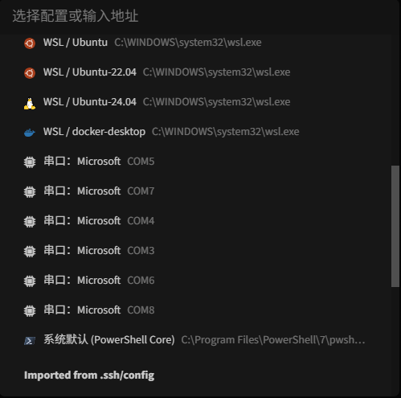
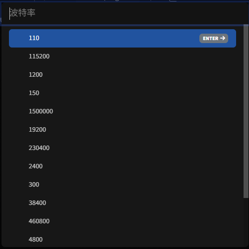

import FileCard from '@site/src/components/FileCard';
import LinkCard from '@site/src/components/LinkCard';
import { Alert } from 'antd';
import Tabs from '@theme/Tabs';
import TabItem from '@theme/TabItem';

# 实验终端辅助插件

:::important 温馨提示

辅助插件不是完成实验的必选工具，也与考核完全无关，你可以任意选择完成实验时使用的终端工具

助教缺少可供测试的macOS设备，本文档内非Windows端设备的步骤可能存在错误，如遇问题请及时联系助教纠正
:::

## 1 插件功能

由于实体机/GNS3模拟实验中需要频繁截图与标记，为帮助同学们减轻完成实验报告的负担，助教开发了专门的实验终端辅助插件，具体来说，该插件提供功能如下：

* 自动划分每次命令的输入与结果，可快速对指定命令及其输出进行截图导出
* 生成结果图像后，可快速按实验报告要求标注指定字段

具体使用方法：

* 在终端中正常执行实验命令

  

* 当需要截图时，点击工具栏的 📷 按钮，打开命令选择面板，点选需要截图的命令与结果

  命令导出面板的按钮依次是：清除选择、将图片复制到剪贴板（可直接粘贴到Word/Typora等）、将图片保存为文件、对图片进行标记、关闭

  如程序的识别出现问题，你可勾选按行选择，进行更细粒度的选择

  

* 如实验报告步骤要求进行标注，可点击标注按钮打开标注面板

  标注面板的按钮功能依次是：选择标注线/框、下划线标记、框选标记、删除选中标记、颜色选择、复制到剪贴板（可直接粘贴到Word/Typora等）、保存为文件、关闭

  


## 2 工具安装

### 2.1 Putty安装

为实现对连接历史信息的正常访问，我们需要借助Putty提供的`plink`连接到GNS3内的设备

<Tabs className="unique-tabs"  groupId="operating-systems">
<TabItem value="Windows">

<LinkCard title="Download Putty: latest Release" url="https://www.chiark.greenend.org.uk/~sgtatham/putty/latest.html" icon="https://www.chiark.greenend.org.uk/~sgtatham/putty/putty.ico">A free implementation of SSH and Telnet for Windows and Unix platforms, along with an xterm terminal emulator.</LinkCard>

打开Putty官方网站，根据你的系统架构选择合适的安装包下载并安装

</TabItem>
<TabItem value="macOS">
在macOS上安装Putty相对复杂，你需要先安装一系列依赖组件。请严格遵循以下步骤：

-  从Mac App Store安装Xcode

   <LinkCard title="Xcode on the Mac App Store" url="https://apps.apple.com/us/app/xcode/id497799835" icon="https://developer.apple.com/assets/elements/icons/xcode/xcode-128x128_2x.png">Xcode includes everything developers need to create great applications for Mac, iPhone, iPad, Apple TV, and Apple Watch.</LinkCard>

-  为Xcode安装Xcode命令行工具

   <LinkCard title="Downloads - Apple Developer" url="https://developer.apple.com/download/all/" icon="https://developer.apple.com/favicon.ico">Download Command Line Tools for Xcode.</LinkCard>

-  打开终端，输入`sudo xcodebuild -license`并按提示接受Xcode许可协议，如没有接受许可协议相关的内容或遇到报错，请尝试改用`sudo /Applications/Xcode.app/Contents/Developer/usr/bin/xcodebuild`

-  下载并安装与macOS版本的MacPorts

    <LinkCard title="The MacPorts Project -- Installing MacPorts" url="https://www.macports.org/install.php" icon="https://www.macports.org/img/macports-logo-top.png">An open-source community initiative to design an easy-to-use system for compiling, installing, and upgrading open-source software on macOS.</LinkCard>

-  在终端执行`sudo port -v selfupdate`更新 MacPorts

-  在终端执行`sudo port install putty`安装Putty

</TabItem>
<TabItem value="Linux">

你可使用发行版自带的包管理器直接安装Putty

```bash
sudo apt update
sudo apt install putty
```

安装完成后，在终端中输入 `putty` 即可启动
</TabItem>
</Tabs>

### 2.2 Tabby安装

Tabby是一款面向Windows，macOS与Linux的高度可扩展的终端模拟器、SSH和串行客户端，可实现实体机、模拟机的实验操作，我们的辅助插件基于Tabby的能力开发

<LinkCard title="Releases - Eugeny/tabby" url="https://github.com/Eugeny/tabby/releases" icon="
https://tabby.sh/32bf32ff6c87e8d18932.svg">A terminal for a more modern age</LinkCard>


### 2.3 实验终端辅助插件安装

<LinkCard title="Releases · tabby-compnet-lab-helper" url="https://github.com/lvmiao233/tabby-compnet-lab-helper/releases" icon="https://github.githubassets.com/favicons/favicon.svg">实验终端辅助插件</LinkCard>

* 从Github Release下载最新版本的插件压缩包并进行解压，解压后的目录格式应当类似：

   ```
   tabby-compnet-lab-helper/
   ├── dist/
   └── package.json
   ```

* 打开Tabby终端，进入设置 (Settings) → 插件 (Plugins)

  

* 点击"插件目录"按钮，将解压好的插件复制到插件目录下的`node_modules`目录（如果不存在，请先创建一个）

  

* 重启Tabby，重启后，工具栏应该出现 📷 图标按钮

  

## 3 连接与配置

### 3.1 实体机连接

* 点击配置与连接，创建新的串口连接标签页
  
   
* 点击所需的串口，如果找不到，请直接输入`COM{串口号}`，如`COM6`
  
   
* 选择波特率，一般请选择9600
  
   

### 3.2 GNS3终端配置

为了在GNS3中指定启动带有辅助插件的Tabby终端，我们需要对GNS3进行一些额外的配置

* 创建辅助启动脚本

   由于telnet的限制，使用telnet连接到GNS3中的网络设备时我们将无法查看历史命令，给正常实验记录带来困难，Putty提供的plink单独实现了历史输出的记录与显示功能，因此我们选择让Tabby使用plink启动连接，这需要在合适的位置（路径建议不含中文/特殊符号/空格）创建一个启动脚本

   :::important 注意

   请将脚本内plink的文件路径替换为你设备上的实际路径   
   :::

   <Tabs className="unique-tabs"  groupId="operating-systems">
      <TabItem value="Windows">
   ```batch
   @echo off
   "C:\Program Files\PuTTY\plink.exe" -telnet %1 -P %2
   ```
      </TabItem>
      <TabItem value="macOS">
   ```bash
   #!/bin/bash
   /usr/local/bin/plink -telnet "$1" -P "$2"
   ```
      </TabItem>
      <TabItem value="Linux">
   ```bash
   #!/bin/bash
   /usr/bin/plink -telnet "$1" -P "$2"
   ```
      </TabItem>
   </Tabs>

* 打开GNS3的首选项，选择General-Console Applications，点击Edit

  

* 选择Custom终端，按以下格式填写，其中，`"path\to\Tabby"`是你的Tabby可执行文件路径，`"path\to\script"`是前序步骤创建的脚本的文件路径

  
