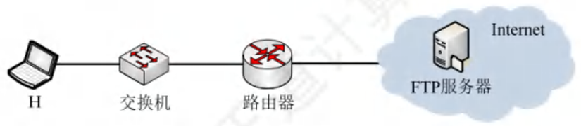

import FileCard from '@site/src/components/FileCard';
import { Alert } from 'antd';
import GridContainer from '@site/src/components/GridContainer';
import QuestionCard from '@site/src/components/QuestionCard';
import Answer from '@site/src/components/Answer';

<Alert message={"解析内容持续更新中，如有疑问请通过钉钉/微信/Issue提问"} type="info" showIcon style={{marginBottom: 16}}/>

<h3 style={{color: '#006d75', marginTop: 0, marginBottom: 8}}>章节资源</h3>
<GridContainer>
    <FileCard file_type={'pdf'} name={'7 Application Layer'} size={'14776102'} link={require('@site/assets/slides/7_ApplicationLayer.pdf').default} />
</GridContainer>

## 题目解析

<QuestionCard source={["25王道 P275-4", "23年统考"]}>
### 某网络拓扑如图所示，主机H登录FTP服务器后，向服务器上传一个大小为18000B的文件F。假设H为传输F建立数据连接时，选择的初始序号为100, MSS=1000B, 拥塞控制初始阈值为4MSS, RTT=10ms,忽略TCP段的传输时延；在F的传输过程中，H均以MSS段向服务器发送数据，且未发生差错、丢包和乱序现象。

3)在H通过数据连接发送F的过程中，当H收到确认序号为2101的确认段时，H的拥塞窗口调整为多少?
<Answer>
答案：3000

快启动阶段，每有1字节被ACK，窗口增加1

ACK 2101，即100-2100传输成功，初始窗口为1000，确认了2000字节，则窗口为3000

注意TCP慢启动时，尽管最终效果上看，每一批传输之后窗口*2，但并不总是能发送一整个窗口长度再一次收到整个窗口对应的ACK，每次回来的ACK可能只会确认其中一部分，每确认1b，窗口+1
</Answer>
</QuestionCard>
