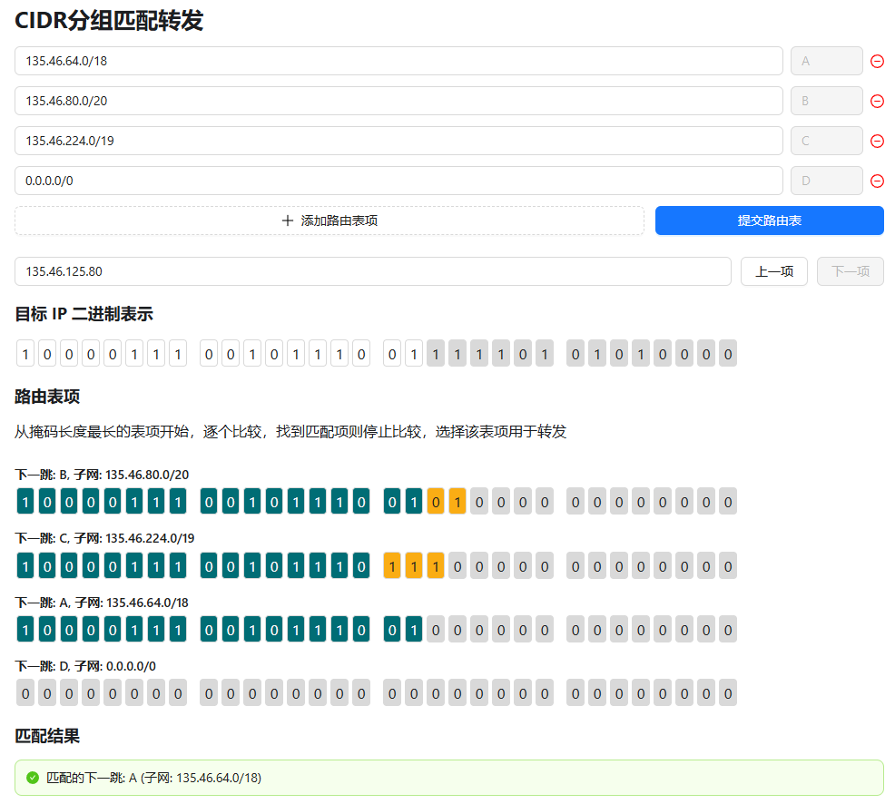

:::warning 提醒

文档网站不提供100题的下载与原文内容，请自行由其他渠道获取

:::

## Chapter 1

[1] “The transport layer is concerned with the syntax and semantics of the information transmitted.”有误，应该是表示层

## Chapter 2

[6] take turns，轮流→分时

[7] 奈奎斯特 2×4×4=32

[8] 不是有噪声就只用香农定理，噪声和码元的表达能力都是传输速率的一个限制因素，显然计算极限速率时，我们应该取限制更大的一个；本题中奈奎斯特定律算出的速率会更低，因此选A

[10] ICMP属于网络层

[15] Thermal noise 热噪声；Crosstalk between two close wires  两条线路凑近以后产生串扰

## Chapter 3

[21] 陷阱题，可以纠错3位错误的纠错码只是至少可以检查6位错误，想想这个场景：能纠正4位错误的纠错码应当可以检查至少8位错误，那么如果只能检查7位错误，就只能纠正3位错误

[23] 一般默认发送=接收

## Chapter 4

[26] 争用期要≥RTT，题目中100ms是端到端，RTT要×2

[29] 累积确认，确认5的时候已经确认0-5 

[30] 无线传输中，冲突指的是多个节点同时向一个节点发送数据；这类题目中，我们一般默认设备接收信号的范围和发出信号的范围相等，因此，当一个节点能收到CTS时，接收方也能收到该节点传输的数据

    情况B的图例如下，虽然发送方位置能接收到X传输的数据，但接收方处只能收到发出方传输的数据，此时X进行传输不会导致冲突
    

    情况D的图例如下，由于接收站在X的信号范围内，如果X也在此时发送，则会导致冲突：
    

    本类题型只对照文字是难以判断节点的位置关系的，建议同学们画图

[32] 转发表不一定是一个接口对应一个唯一MAC：如果某个接口连接了一个Hub，那么一个接口可能对应多个MAC；因此，只要转发表没有对应表项，直接向来源接口以外的其他接口广播，即使某些接口已经有对应的MAC记录

## Chapter 5
[33] 私有地址包含：
    * 10.0.0.0/8  10.0.0.0 - 10.255.255.255
    * 172.16.0.0/12 172.16.0.0 - 172.31.255.255
    * 192.168.0.0/16 192.168.0.0 -192.168.255.255
      
    另外，问能否分配的地址时，小心：组播地址/环回地址/网络地址/广播地址 不可以用于分配

[35] B选项位数不够

[38] Link-State Routing只交换链路状态信息，不交换完整路由表

[40] 过程参考下图，这里的计算器可以在[网络层 Network Layer](/notes/network) 找到
    

[47] 把去R2可达的所有网络列出来，然后合并即可

## Chapter 6

[53] 100-219 共120byte

[54] 收到219，期待接下来接收220

[55] 220-339 共120byte

## Chapter 7 

[61] 无话可说，背吧

[62] HTTP/1.1开始，默认持久连接

[63] HTTP基于TCP

[64] 相关概念：
    * Caching 缓存 - 减少重新加载的需求
    * Server Replication 扩充服务器 - 负载均衡，降低每个服务器的负载，避免服务器被请求打爆
    * CDN（content delivery network）- 缓存一些热门内容的数据，这样请求时可以代服务器提供，节约资源，提高效率

[65] 相关概念：
    * PPP 连接到ISP
    * ARP 获取默认网关MAC地址
    * UDP DNS基于UDP，用DNS协议解析网站域名

## Other

[77] 30dB一定要转化为比值，也就是1000:1；转换后代入香农定理，约为80kbps，利用率50%，实际40kbps

[79] 需要保证争用期≥RTT

    图中已知速率100Mbps，最小帧长64B（如果最小帧长满足条件，则更大帧长一定也可以），则争用期64×8/(100×10^6)=5.12×10^-6 s；RTT = H3-Hub传播延迟 + 再生延迟 + Hub-H4传播延迟  + H4-Hub传播延迟 + 再生延迟 + Hub-H3传播延迟；

    由此可以得到    总往返传播延迟=RTT - 2×再生延迟 = 2.05×10^-6 s，乘信号传播速度再 / 2得到距离205m

[80] 在该网络不可达前，由于路由已收敛，R3处收到R1/R2到达该网络距离均为2

    R3判断不可达后，不会直接将距离设置为16，而是根据目前掌握的全部距离向量信息，认为可以从R1或R2到达此网络，更新与该网络的距离为2+1=3，下一跳为R1或R2

    收到R3通告的距离向量后，（由于R1还未收到通告，距离不变），此时R2发现从R1转发距离最小（2+1=3），因此进行更新，距离变为3，下一跳变为R1

    本题是RIP坏消息传得慢的一个实例

[81] 由于从R1向Internet转发跳数更少，R2会选择L0接口；由于30位子网掩码下，R1 接口地址为201.1.3.9，该子网中只剩下201.1.3.10可以分配，因此R2 L0必然是该IP；由于内部是私有地址，访问外部网络需要NAT，重写地址后即为R2 L0的地址

[82] 选项解析：
    A. H1和H2在同一子网，走交换机就可以通信
    B. H2和H3不在同一子网，但题目中E0接口没有说有子接口，因此只会有一个IP，也就是说H1/2和H3/4使用的默认网关必然有一个是错的，不可能都能正常向外部网络通信
    C. 同理H1和H3不在同一子网，双方有一个默认网关是错误的，无法向其他子网转发消息
    D. H3和H4在同一子网，类A

[83] 可能情况：
    * 0 - 缓存命中
    * 4- 根， .com， xyz.com，abc.xyz.com
      
    注意abc.xyz.com的权威域名服务器管理的是*.abc.xyz.com，可以直接查到www.abc.xyz.com，不会再去www.abc.xyz.com这一级

## Transport layer

[92] 1 2 4 7，B还没来得及开始取就塞满了

[93] 进行组播时，传输层使用的一定是UDP

## Application layer
[96] MX是邮件交换记录，值应该是邮件服务器，比如mail.zju.edu.com