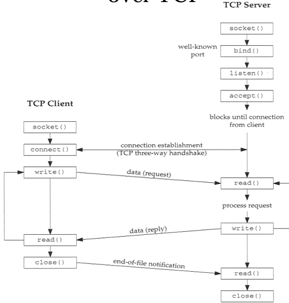

import TCPControlSimulation from "@site/src/visualizations/TCPControlSimulation";
import FileCard from '@site/src/components/FileCard';
import { Alert } from 'antd';
import GridContainer from '@site/src/components/GridContainer';
import QuestionCard from '@site/src/components/QuestionCard';
import Answer from '@site/src/components/Answer';

<Alert title={"解析内容持续更新中，如有疑问请通过钉钉/微信/Issue提问"} type="info" showIcon style={{marginBottom: 16}}/>

<h3 style={{color: '#006d75', marginTop: 0, marginBottom: 8}}>章节资源</h3>
<GridContainer>
    <FileCard file_type={'pdf'} name={'6 Transport Layer'} size={'5051668'} link={require('@site/assets/slides/6_TransportLayer.pdf').default} />
    <FileCard file_type={'pdf'} name={'BBR拥塞控制算法'} size={'2132938'} link={require('@site/assets/slides/BBR congestion-based congestion control_2016.pdf').default} />
</GridContainer>

## TCP 拥塞控制模拟

发生拥塞时，慢开始门限`ssthresh`即会设置为出现拥塞时发送方`cwnd`的一半（通常向下取整），但不能小于2

<TCPControlSimulation />

## 题目解析

<QuestionCard source={["Test"]}>
### Which is correct about state management for TCP?

A. When the application calls an accept primitive, the TCP entity changes its state from CLOSED to LISTEN and waits for a connection to arrive.

B. Once a segment with only the SYN flag is received, the TCP entity will send a segment with only the ACK flags, and change its state from LISTEN to ESTABLISHED.

C. When the application calls a connect primitive, the TCP entity sends a segment with only the SYN flag, and changes its state from SYN_SENT to ESTABLISHED upon receiving a segment with only the ACK flags. SYN+ACK

D. After sending a segment with only the SYN flag, once it receives a segment with only the SYN flags, the TCP entity will send a segment with SYN+ACK flag and change its state from SYN_SENT to SYN_RCVD.

<Answer>
答案：D

A. accept()错误，应为listen()

B/C. only the ACK错误，应为SYN+ACK

注：

* 被动打开指的是，服务器开始监听，处于被动等待客户端发起连接的状态；调用listen开始监听是服务器主动进行的操作
* 绿色：服务端，红色：客户端，黑色：异常情况处理方式
</Answer>
</QuestionCard>

<QuestionCard source={["概念-TCP C/S通信流程"]}>
### Outline of a Client-Server Network Interaction over TCP

</QuestionCard>

<QuestionCard source={["概念-快重传", "概念-超时"]}>
### 为什么超时cwnd置1，dup ACK减半？
<Answer>
请考虑：超时事件发生和收到3个冗余ACK,哪个意味着网络拥塞程度更严重？[25王道 P260-3]

通过分析不难发现，在收到3个冗余ACK的情况下，网络虽然拥塞，但至少还有ACK报文段能被正确交付。而当超时发生时，说明网络可能已经拥塞得连ACK 报文段都传输不了，发送方只能等待超时后重传数据。

因此，超时事件发生时，网络拥塞更严重，发送方就应该最大限度地抑制数据发送量，所以cwnd置为1；收到3个冗余ACK时，网络拥塞不是很严重，发送方稍微抑制一下发送的数据量即可，所以cwnd减半。
</Answer>
</QuestionCard>

<QuestionCard source={["25王道 P244-32"]}>
### 甲和乙刚建立 TCP 连接，并约定最大段长为 2KB，假设乙总是及时清空缓存，保证接收窗口始终为 20KB，ssthresh 为 16KB，若双向传输时间为 10ms，发送时延忽略不计,且没有发生拥塞的情况，则经过()甲的发送窗口第一次达到20KB。

A. 40ms&emsp;&emsp;&emsp;B. 50ms&emsp;&emsp;&emsp;C. 60ms&emsp;&emsp;&emsp;D.70ms

<Answer>
电子版答案有误，实体书已更正，答案为B 50ms
</Answer>
</QuestionCard>
