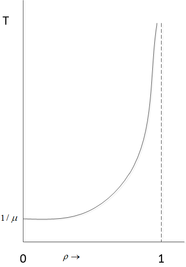
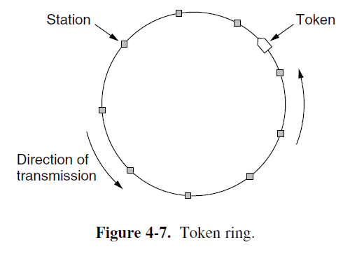

import LinkPeekCard from "@site/src/components/LinkPeekCard";
import FileCard from '@site/src/components/FileCard';
import { Alert } from 'antd';
import GridContainer from '@site/src/components/GridContainer';
import QuestionCard from '@site/src/components/QuestionCard';
import Answer from '@site/src/components/Answer';

<h3 style={{color: '#006d75', marginTop: 0, marginBottom: 8}}>章节资源</h3>
<GridContainer>
  <FileCard file_type={'pdf'} name={'4 Medium Access Control Sublayer'} size={'3309134'} link={require('@site/assets/slides/4_MACLayer.pdf').default} />
</GridContainer>

## 课件内容

:::tip 以下内容用于为快速检索相关内容提供索引，内容经自动解析与转换，请以PDF版本课件为准
:::

### The Key Issue in This Chapter

*   Network links can be divided into two categories:
    *   Point-to-point connections (Chapter 2, Chapter 3)
    *   Broadcasting channels (Chapter 4)
        *   Multiaccess channels or random access channels
*   In any broadcasting network, **the key issue is how to determine who gets to use the channel where there is competition for it.**
    *   The protocol used to determine who goes next on a multiaccess channel belongs to a sublayer of the data link layer called the **MAC (Medium Access Control) sublayer.**
    *   The MAC sublayer is especially important in LANs, particularly wireless ones because **wireless is naturally a broadcast channel.**

### Outline
*   4.1 The Channel Allocation Problem
*   4.2 Multiple Access Protocols
*   4.3 Ethernet
*   4.4 Wireless LANS (802.11 WiFi)
*   4.8 Data Link Layer Switching

### The Channel Allocation Problem
*   **Static channel allocation**
    *   FDMA: if there are N users, the bandwidth is divided into N equal-sized portions, with each user being assigned one portion.
    *   Simple and efficient allocation mechanism but will have problems when the number of senders is large and varying or the traffic is **bursty** (突发性).
        *   When some users are **quiescent**, their bandwidth is simply lost. They are not using it, and no one else is allowed to use it either.
        *   The data traffic is extremely **bursty**: most of the channels will be idle most of the time.
*   **Dynamic channel allocation — Statistical Multiplexing**

#### Static Channel Allocation
*   In order to analysis the poor performance of static channel allocation, we will turn to some simple queueing theory calculation.
*   **Preliminary Queueing Theory**
    *   Consider any system that has a **capacity C**, the maximum rate at which it can perform work.
    *   Assume that **R** represents the **average rate** at which work is demanded from this system.
        *   If R < C, then the system can “handle” the demands placed upon it.
        *   Whereas if R > C then the system capacity is insufficient and all the unpleasant and catastrophic effects of saturation will be experienced.
    *   However, even when R < C we still experience a different set of unpleasantnesses that come about because the **irregularity of the demands.**
    *   Such queues arise from two **unpredictable** sources:
        *   The first is the unscheduled arrival times of the customers; — **the arrival times**
        *   The second is the random demand (duration of service) that each customer requires of the system. — **the service times**

### Preliminary Queueing Theory
*   **Queueing Theory**: the characterization of the arrival times and the service times and the evaluation of their effect on queueing phenomena form the essence of queueing theory.
*   Let Cₙ denote the *n*th customer to arrive at a queueing facility
    *   τₙ = arrival time for Cₙ.
    *   tₙ = τₙ − τₙ₋₁ = interarrival time between Cₙ and Cₙ₋₁.
    *   xₙ = service time for Cₙ.
*   It is the sequence of random variables tₙ and xₙ that really drives the queueing system. All these random variables are selected *independently*. We can define two generic random variables:
    *   t̃ = interarrival time
    *   x̃ = service time
*   Associated with each is a probability distribution function (PDF)
    *   A(t) = P[t̃ ≤ t]
    *   B(x) = P[x̃ ≤ x]
*   The related probability density function (pdf), namely
    *   a(t) = dA(t)/dt
    *   b(x) = dB(x)/dx
*   Some important **moments** associated with these random variables are
    *   E[t̃] = mean interarrival time = 1/λ, *where λ is the average arrival rate.*
    *   E[x̃] = mean service time = 1/μ
*   The study of queues naturally breaks into three cases:
    *   elementary queueing theory
    *   intermediate queueing theory
    *   advanced queueing theory
*   What distinguishes these three cases are the assumptions regarding a(t) and b(x).
*   In order to name the different kinds of systems, a rather simple shorthand notation is used for describing queues.
    *   A three-component description **A/B/m**, which denotes an m-server queueing system where A and B “describe” the interarrival time distribution and service time distribution, respectively.
    *   A and B take on values from the following set of symbols, which are what distributions they refer to:
        *   **M** = exponential (i.e. Markovian)
        *   **Er** = r-stage Erlangian
        *   **Hr** = r-stage Hyperexponential
        *   **D** = Deterministic
        *   **G** = General
    *   The simplest interesting system is the **M/M/1** queue in which we have *exponential* interarrival times, *exponential* service times, and a single server.

#### General Results
*   The most important system parameter for G/G/1 is the *utilization factor ρ*, defined as the product of the average arrival rate of customers to the system times the average service time each requires
    *   `ρ = λx̃`
    *   This quantity gives the *fraction of time* that the *single* server is *busy* and is also equal to the ratio of the rate at which work arrives to the system divided by the capacity of the system to do work R/C.
*   In the multiple-server system G/G/m the corresponding definition of the utilization factor ρ is
    *   `ρ = λx̃ / m`
    *   Which is also equal to R/C and may be interpreted as the expected fraction of busy servers when each server has the same distribution of service time.
*   ρ is the expected fraction of the system’s capacity that is in use.
    *   In all cases a **stable** system (one that yields finite average delays and queue lengths) is one for which 0 ≤ ρ < 1.
    *   The closer ρ approaches unity, the larger are the queues and the waiting time.
*   **The average time in system** is simply related to the average service time and the average waiting time through the fundamental equation
    *   `T = x̃ + W`
    *   The quantity W reflects the price we must pay for sharing a given resource (server) with other customers (waiting time in a queue).
*   **Little’s Result** — which relates the average number in the system to the average arrival rate and the average time spent in that system, namely
    *   `N̄ = λT`
*   The average queue size is
    *   `N̄_q = λW`
*   In G/G/m, these quantities are related by
    *   `N̄_q = N̄ - mρ`
    *   ρ is the expected fraction of the system’s capacity that is in use.
    *   m is the number of servers
    *   可以理解为系统中平均客户数减去正在被服务的客户数就是正在等待服务的客户数了 (This can be understood as: the average number of customers in the system minus the number of customers currently being served equals the number of customers waiting for service.)
*   A second common and general raw is to relate the rate at which accumulation within a system occurs as a function of the input and output rates to and from the system.
    *   Let Eₖ denote the system state in which k customers are present.
    *   Pₖ(t) = P[N(t) = k] — the probability of the system state at time t is Eₖ.
        *   `d(Pₖ(t)) / dt = [flow rate of probability into Eₖ at time t] - [flow rate of probability out of Eₖ at time t]`
    *   Time-dependent relation
    *   Now consider a **stable** system, for which the probability Pₖ(t) has a limiting value (as t → ∞) which we denote by pₖ. (This represents the fraction of time that the system will contain k customers in the steady state.)

#### The M/M/1 queue
*   This system has a **Poisson input** (with an average arrival rate λ)
*   The probability Pₖ(t) of k arrivals in an interval whose duration is t sec is given by
    *   `Pₖ(t) = ((λt)ᵏ / k!) * e⁻ˡᵗ`
*   The average number of arrivals during this interval is
    *   `N̄(t) = Σ[k=0 to ∞] kPₖ(t) = Σ[k=0 to ∞] k * ((λt)ᵏ / k!) * e⁻ˡᵗ = λt`
    *   > So the average arrival rate in a unit time is λ
*   This system has a Poisson input (with an average arrival rate λ)
*   The average service time is x̃ = 1/μ
*   The probability of having k customers in the system is given by pₖ = (1−ρ)ρᵏ
*   Then the average number in the system is
    *   `N̄ = Σ[k=0 to ∞] kpₖ = ρ / (1-ρ), 0 < ρ < 1`
*   Using **Little’s result** and the average time in the system T is
    *   `N̄ = λT => T = N̄/λ = (ρ/(1-ρ))/λ = (1/μ)/(1-ρ)` (∵ ρ = λx̄ = λ/μ)
*   The W is
    *   `W = N̄_q/λ, N̄_q = N̄ - mρ = N̄ - ρ = ρ²/(1-ρ), W = (ρ/μ)/(1-ρ)` (where m=1)

*   The average delay T as a function of ρ for M/M/1
    *   `T = x̃ + W = 1/μ + (ρ/μ)/(1-ρ) = (1/μ)/(1-ρ)`
    *   > x̃ is the average service time
    *   > W is the average waiting time in a queue
    *   > The closer ρ approaches unity, the larger are the queues and the waiting time.

### The Performance of Static FDM
*   The mean time delay T to send a frame onto a channel of capacity C bps (Note only one channel here).
    *   We *assume* that the frames arrive randomly with an average arrival rate of λ frames/sec, and that the frames vary in length with an average length of 1/μ bits.
    *   With these parameters, the average service time of the channel is 1/μC frames/sec.
        *   `x̃ = (1/μ) / C = 1/(μC)`
        *   > The time used to send a frame with length of 1/μ bits (the average service time, or the average transmission delay is 1/μC).
    *   The utilization factor `ρ = λx̃`
    *   According to the results of the M/M/1 queue
        *   `T = x̃ / (1-ρ) = (1/μC) / (1 - λ/(μC)) = 1 / (μC - λ)`
        *   > Note that the red μ is equal to μC here.
*   Let us divide the single channel into N independent subchannels, each with capacity C/N bps.
*   The mean input rate on each of the subchannels will now be λ/N.
*   According to the results of an M/M/m queue, the mean time delay will be
    *   `T_N = 1 / (μ(C/N) - (λ/N)) = N / (μC - λ) = NT`
*   The mean delay for the divided channel is N times worse than if all the frames were somehow magically arranged orderly in a big central queue.

### Key Assumptions of Dynamic Channel Allocation
*   Underlying all dynamic channel allocation methods are the following five key assumptions:
    *   **Independent Traffic.** The model consists of N independent stations (e.g. computers, telephones), each with a program or user that generates frames for transmission. Once a frame has been generated, the station is blocked and does nothing until the frame has been successfully transmitted. The frames are generated unpredictably but at a constant rate.
    *   **Single Channel.** A single channel is available. All stations can transmit on it and all can receive from it. The stations are assumed to be equally capable.
    *   **Observable Collisions.** If two frames are transmitted simultaneously, they overlap in time and this results in **collision**. All stations can detect the collision when it occurred. A collided frame must be transmitted again later. (wired channels vs. wireless channels)
*   Underlying all dynamic channel allocation methods are the following five key assumptions:
    *   **Continuous or Slotted Time.** Frame transmission can begin at any instant, or must begin at the start of a slot. A slot may contain 0, 1, or more frames, corresponding to an idle slot, a successful transmission, or a collision, respectively.
    *   **Carrier Sense or No Carrier Sense.** With the carrier sense assumption, stations can tell if the channel is in use before trying to use it. No station will attempt to use the channel while it is sensed as busy (wired channels). If there is no carrier sense, stations cannot sense the channel before trying to use it. They just go ahead and transmit. Only later can they determine whether the transmission was successful (wireless channels).

### Multiple Access Protocols

#### ALOHA
*   **ALOHA** (starts out in pristine in the early 1970s by Norman Abramson at the Univ. of Hawaii)
    *   Try to connect users on remote islands to the main computer in Honolulu.
    *   Each user terminal sharing the same upstream frequency to send frames to the central computer.
    *   Two versions of ALOHA: **pure** and **slotted**.
*   **Pure ALOHA**
    *   In the ALOHA system, after each station has sent its frame to the central computer, this computer **rebroadcasts** the frame to all of the stations. A sending station can thus listen for the broadcast from the hub to see if its frame has gotten through.
    *   If the frame was destroyed, the sender just waits a random amount of time and sends it again.

*If the first bit of a new frame overlaps with just the last bit of a frame that has almost finished, both frames will be totally destroyed.*

*   An interesting question is: what is **the efficiency** of an ALOHA channel?
    *   What fraction of all transmitted frames escape collisions under these chaotic circumstances?
*   Let the “frame time” denote the amount of time needed to transmit the standard, fixed-length frame (i.e., the frame length divided by the bit rate, that is, the transmission delay).
*   We assume that the new frames generated by the stations are well modeled by a **Poisson** distribution with a mean of N frames per frame time.
    *   If N > 1, the user community is generating frames at a higher rate than the channel can handle, and nearly every frame will suffer a collision.
    *   For reasonable throughput, we would expect 0 < N < 1.
*   In addition to the new frames, the stations also generate retransmissions of frames that previously suffered collisions. We assume that the old and new frames combined are modeled by a **Poisson** distribution, with mean of G frames per frame time.
    *   G ≥ N
    *   At low load (i.e. N ≈ 0), there will be few collisions, hence few retransmissions, so G ≈ N.
    *   At high load, there will be many collisions, so G > N.
    *   Under all loads, **the throughput S**, is just the offered load, G times the probability P₀ of a transmission succeeding — that is **S = GP₀**.

*   Under what conditions will the shaded frame arrive undamaged?
    *   Let t be the time required to send one frame.
    *   If any other user has generated a frame between time t₀ and t₀ + t, the beginning of that frame will collide with the *end* of the shaded one.
    *   Any other frame started between t₀ + t and t₀ + 2t will bump into the *beginning* of the shaded frame.
*   The probability that *k* frames are generated during a given frame time, in which G frames are expected, is given by the **Poisson** distribution
    *   `P[k] = (Gᵏ * e⁻ᴳ) / k!`
    *   (G ~ λt)
*   The probability of zero frames is just e⁻ᴳ.
*   In an interval two frame times long (2t), the mean number of frames generated is 2G.
*   The probability of no frames being initiated during the **entire vulnerable period** is thus given by P₀ = e⁻²ᴳ.
*   Using the throughput S = GP₀ => **S = Ge⁻²ᴳ**.

*   We do the derivative of the throughput S = Ge⁻²ᴳ with respect to G:
    *   e⁻²ᴳ − 2Ge⁻²ᴳ = 0 → G = 0.5, S = (1/2)e⁻¹ = 0.1839

#### Slotted ALOHA
*   Roberts (1972) published a method for **doubling** the capacity of an ALOHA system.
*   His proposal was to divide time into discrete intervals called **slots**, each interval corresponding to one frame.
*   This approach requires the users to **agree on slot boundaries.**
    *   One way to achieve synchronization would be to have one special station emit a pip at the start of each interval, like a clock.
    *   This halves the vulnerable period (t). Because in slotted ALOHA, a station can only send data at the start boundary of a slot.
*   The probability of no other traffic during the same slot as our test frame is then e⁻ᴳ, which leads to S = Ge⁻ᴳ. The probability of a collision is then just 1 − e⁻ᴳ.
*   **Slotted ALOHA peaks at G = 1, with a throughput of S = 1/e or about 0.368, twice that of pure ALOHA.**

*   The probability of a transmission requiring exactly k attempts (i.e. k − 1 collisions followed by one success) is
    *   `Pₖ = e⁻ᴳ(1 - e⁻ᴳ)ᵏ⁻¹`
*   The expected number of transmissions E is
    *   `E = Σ[k=1 to ∞] kPₖ = Σ[k=1 to ∞] ke⁻ᴳ(1 - e⁻ᴳ)ᵏ⁻¹ = eᴳ`
    *   > As a result of the exponential dependence of E upon G, small increases in the channel load can drastically reduce its performance.

#### Carrier Sense Multiple Access Protocols
*   With slotted ALOHA, the best channel utilization that can be achieved is 1/e. This low result is hardly surprising, since with stations transmitting at will, *without knowing what the other stations are doing* there are bound to be many collisions.
*   In LANs, it is often possible for stations to detect what other stations are doing, and thus adapt their behavior accordingly.
    *   Protocols in which stations listen for a carrier (i.e., a transmission) and act accordingly are called **carrier sense protocols.**
*   **1-persistent CSMA** (Carrier Sense Multiple Access)
    *   When a station has data to send, it first listens to the channel to see if anyone else is transmitting at that moment.
    *   If the channel is idle, the station sends its data. Otherwise, if the channel is busy, the station just waits until it becomes idle. Then the station transmit a frame.
    *   If a collision occurs, the station waits a random amount of time and starts all over again.
    *   The protocol is called **1-persistent** because the station transmits with a probability of 1 when it finds the channel idle.
*   **Nonpersistent CSMA**
    *   When a station has data to send, it first listens to the channel to see if anyone else is transmitting at that moment.
    *   If no one else is sending, the station begins doing so itself.
    *   However, if the channel is already in use, the station does not continually sense it for the purpose of seizing it immediately upon detecting the end of previous transmission. Instead, it waits a **random period of time and then repeats the algorithm.**
    *   This algorithm leads to better channel utilization but longer delays than 1-persistent CSMA.
*   **p-persistent CSMA**
    *   This protocol applies to **slotted channels.**
    *   When a station becomes ready to send, it senses the channel. **If it is idle, it transmits with a probability p.** With a probability q = 1− p, **it defers until the next slot.** If that slot is also idle, it either transmits or defers again, with probabilities p and q. This process is repeated until either the frame has been transmitted or another station has begun transmitting.
    *   If the station initially senses that the channel is busy, it waits until the next slot and applies the above algorithm.

#### CSMA with Collision Detection
*   Improvement: abort their transmissions as soon as they detect a collision.
    *   The basis of the classic Ethernet LAN (Ethernet with a bus topology).
*   **Collision detection** can be done as the station’s hardware must listen to the channel while it is transmitting. If the signal it reads back is different from the signal it is putting out, it knows that a collision is occurring.
*   The model for CSMA/CD will consists of alternating **contention** and **transmission** periods, with **idle** periods occurring when all stations are quiet.

*   Suppose that two stations both begin transmitting at exactly time t₀. **How long will it take them to realize that they have collided?**
    *   Consider the worst-case scenario. Let the time for a signal to propagate between the two *farthest* stations be τ. (propagation delay)
    *   At t₀, one station begins transmitting. At t₀ + τ − ε, an instant before the signal arrives at the most distant station, that station also begins transmitting. Of course, it detects the collision almost instantly and stops, but the little *noise burst* caused by the collision does not get back to the original station until time 2τ − ε. In other words, in the worst case a station cannot be sure that it has seized the channel until it has transmitted for 2τ without hearing a collision.
    *   We can think of CSMA/CD contention as a slotted ALOHA system with a slot width of **2τ**.

#### Collision Free Protocols
*   Although collisions do not occur with CSMA/CD once a station has unambiguously captured the channel, they can still occur during the contention period.
    *   These collision adversely affect the system performance, especially when the **bandwidth-delay product** is large, such as when the cable is long (i.e., large τ) and the frames are short.
    *   Not only do collisions reduce bandwidth, but they make the time to send a frame variable, which is not a good fit for real-time traffic such as voice over IP.
*   In the following, we will examine some protocols the resolve the contention for the channel **without any collisions at all,** not even during the contention period.
    *   Though most of them are NOT currently used in major systems, but may be used in future systems.
    *   Using the model of Fig.4-5 with its discrete contention slots.

###### A Bit-Map Protocol — Reservation Protocol
*   Each contention period consists of exactly N slots.
*   In general, station j may announce that it has a frame to send by inserting a 1 bit into slot j. after all N slots have passed by, each station has complete knowledge of which stations wish to transmit.
*   At that point, they begin transmitting frames in numerical order.
*   Since everyone agrees on who goes next, there will never be an collisions.
*   After the last ready station has transmitted its frame, an event all stations can easily monitor, another N-bit contention period is begun.

###### Token Passing
*   To pass a small message called a **token** from one station to the next in a predefined order.
*   If a station has a frame queued for transmission when it receives the token, it can send that frame before it passes the token to the next station.
*   Problem: frames are also transmitted in the direction of the token. This way they will circulate around the ring and reach whichever station is destination. However, to stop the frame circulating indefinitely (like the token), some station needs to remove it from the ring. This station may be either the one that originally sent the frame, after it has gone through a complete circle, or the station that was the intended recipient of the frame.
*   Do not need a physical ring to implement token passing.

###### Binary Countdown
*   A problem with the basic bit-map protocol, and by extension token passing, is that the overhead is 1 bit per station, so it **does not scale well to networks with thousands of stations.**
*   A station want to use the channel now broadcasts its address as a binary bit string, starting with the high-order bit.
*   For example, if stations 0010, 0100, 1001 and 1010 are all trying to get the channel, in the first bit time the stations transmit 0, 0, 1, 1, respectively. These are ORed together to form a 1. Station 0010 and 0100 see the 1 and know that a higher-numbered station is competing the channel, so they give up for the current round. Stations 1001 and 1010 continues. The next bit is 0, and both stations continue. The next is 1, so station 1001 gives up. The winner is station 1010 because it has the highest address.
*   Higher-numbered stations have a higher priority than lower-numbered stations.

#### Limited-Contention Protocols
*   Two important performance measures for channel acquisition in a broadcast network: **delay at low load** and **channel efficiency at high load.**
    *   Under conditions of *light load*, contention (i.e., pure or slotted ALOHA) is preferable due to its low delay (since collisions are rare).
    *   At *heavy load*, the collision-free protocols are much preferred because the channel efficiency improves (since the overheads are fixed.)
*   **Limited-contention Protocols** — to combine the best properties of the contention and collision-free protocols.
    *   The contention protocols we have studied have been symmetric: each station attempts to acquire the channel with the same probability *p*.
    *   The probability that some station successfully acquires the channel during a given slot is the probability that any one station transmit, with probability *p*, and all other *k* − 1 stations defer, each with probability 1 − *p*. The value is *kp*(1−*p*)ᵏ⁻¹.
*   We differentiate *kp*(1−*p*)ᵏ⁻¹ with respect to *p*, the best value of *p* is 1/*k*.
    *   `Pr[success with optimal p] = ((k-1)/k)ᵏ⁻¹`
    *   > As soon as the number of stations reaches 5, the probability has dropped close to its asymptotic value of 1/e.

*   From Fig. 4-9, it is fairly obvious that the probability of some station acquiring the channel can be increased only by decreasing the amount of competition.
    *   To divide the stations into (not necessarily disjoint) groups
    *   Only the members in group 0 are permitted for compete for slot 0. If one of them succeeds, it acquires the channel and transmits its frame. If the slot lies fallow or if there is a collision, the members of group 1 contend for slot 1, etc.
    *   By making an appropriate division of stations into groups, the amount of contention for each slot can be reduced, thus **operating each slot near the left end of Fig. 4-9.**
    *   With many stations per slot when the load is low and few (or even just one station per slot when the load is high).

###### The Adaptive Tree Walk Protocol
*   To think of the stations as the leaves of a binary tree

*In the first contention slot following a successful frame transmission, slot 0, all stations are permitted to try to acquire the channel. If one of them does so, fine. If there is a collision, then during slot 1 only those stations falling under node 2 in the tree may compete. If one of them acquires the channel. The slot following the frame is reserved for those stations under node 3. if, on the other hand, two or more stations under node 2 want to transmit, there will be a collision during slot 1, in which case it is node 4’s turn during slot 2.*

*   The heavier the load, the farther down the tree the search should begin.
*   Notice that each node at level *i* has a fraction 2⁻ⁱ of the station below it.
*   If the *q* ready stations are uniformly distributed, the expected number of them below a specific node at level *i* is just 2⁻ⁱ*q*.
*   We would expect the optimal level to begin searching the tree to be the one at which the mean number of contending stations per slot is 1, that is, the level at which 2⁻ⁱ*q* =1 → *i* = log₂*q*.

#### Wireless LAN Protocols
*   Wireless is more complicated than the wired case
    *   Nodes may have different coverage areas — doesn’t fit carrier sense
    *   Nodes cannot hear while sending — because the transmit power is much higher than the receive power, so cannot detect collisions.
*   So 802.11 ≠ CSMA/CD

###### Different Coverage Areas
*   Wireless signal is broadcast and received nearby, where there is sufficient SNR.

Here Node A send a message to Node B, and at the same time Node C also want to send a message to Node B, but Node C cannot hear Node A, because Node C is out of its cover range.

###### The Hidden Terminal Problem
*   Nodes A and C are **hidden terminals** when sending to Node B
    *   Both Node A and Node C **cannot** hear each other to coordinate. So if both of them simultaneously send a message to Node B, then their messages will collide at B.
    *   Caused by limited coverage areas of different nodes
    *   We want to avoid the inefficiency of collisions.

###### The Exposed Terminal Problem
*   Node B and Node C are **exposed terminals** when they are sending messages to Node A and Node D, respectively
    *   Since Node B and Node C are within the radio range of each other, so they can hear each other. Actually they don’t collide, because their receiver is A and D, respectively.
    *   Caused by limited coverage areas of different nodes
    *   We want to send **concurrently** to increase performance.

###### Nodes Cannot Hear while Sending
*   In wireless system, the received signal at a station may be tiny, perhaps a million times fainter than the signal that is being transmitted.
    *   For wired LANs, detecting collisions and **aborting early** can lower their cost.
    *   But for wireless LANs, a node can **hardly hear anything while sending messages**, so more waste time than wired LAN.

###### Possible Solution: MACA
*   **MACA** (Multiple Access with Collision Avoidance, Karn, 1990)
    *   A **short handshake** before sending a frame
*   Protocol rules:
    *   1. A sender node transmits a **RTS** (Request-To-Send, with frame length)
    *   2. The receiver replies with a **CTS** (Clear-To-Send, with frame length)
    *   3. Sender transmits the frame while nodes hearing the CTS stay silent
    *   Collisions on the RTS/CTS are still possible, but less likely.

*   Any station hearing the **RTS** is clearly close to A and must remain silent long enough for the CTS to be transmitted back to A without conflict.
*   Any station hearing the **CTS** is clearly close to B and must remain silent during the upcoming data transmission, whose length it can tell by examining the CTS frame.

####### MACA: Hidden Terminals
*   A → B with hidden terminal C
    *   1. A sends a RTS to B
    *   2. B sends a CTS to A, but can also be received by C
    *   3.1. When C receives the CTS, it may remain silent until A finished sending
    *   3.2. When A receives the CTS, A sends a frame to B.

####### MACA: Exposed Terminals
*   B → A, C → D as B and C are exposed terminals
    *   1.1 B sends a RTS to A, and to C also
    *   1.2 C sends a RTS to D, and to B also
    *   2.1 A sends a CTS to B
    *   2.2 D sends a CTS to C
    *   3.1 B sends a frame to A, and to C also (there may be a mess at C but not interfere with the receiver A )
    *   3.2 C sends a frame to D, and to B also (there may be a mess at B but not interfere with the receiver D )

### Ethernet
#### Ethernet (IEEE 802.3)
*   Two kinds of Ethernet exist:
    *   **Classical Ethernet** (3 to 10 Mbps)
    *   **Switched Ethernet**, in which devices called switches are used to connect different computers, runs at 100, 1000 and 10,000 Mbps, in forms called **fast Ethernet**, **gigabit Ethernet**, and **10 gigabit Ethernet**.
    *   Over the cables, information was sent using the **Manchester encoding**.

*   **Ethernet brief history**
    *   In the mid-1970s, the Ethernet with a **bus topology** was invented by Bob Metcalfe and David Boggs.
        *   A **broadcast** LAN
    *   By the late 1990s, the Ethernet was installed using a **hub-based star topology**
        *   A **hub** is a **physical layer device** that acts on individual bits rather than frames.
        *   Still a **broadcast** LAN, because when a bit arrives at one interface, the hub simply re-creates the bit, boosts its energy strength, and transmits the bit onto all the other interfaces.
    *   In the early 2000s Ethernet experienced yet another major evolutionary change, the hub at the center was replaced with a **switch** — a **switch-based star topology (switched Ethernet)**
        *   A **switch** is a **link layer device**. Modern switches are full-duplex.
        *   In a switch-base Ethernet LAN there are no collisions, and therefore, there is no need for a MAC protocol.

*   Ethernet is by far the most prevalent wired LAN technology.
*   All of the Ethernet technologies provide **connectionless service** to the network layer.
    *   This layer-2 connectionless service is analogous to IP’s layer-3 datagram service and UDP’s layer-4 connectionless service.
    *   This lack of reliable transport (at the link layer) helps to make Ethernet simple and cheap.

#### Ethernet Frame Structure

*   **(I)** First comes a **Preamble** of 8 bytes, each containing the bit pattern 10101010 (with the exception of the last byte, in which the last 2 bits are set to 11).
*   The last byte is called the **Start of Frame** delimiter for 802.3. The Manchester encoding of this pattern produces a 10-MHz square wave for 6.4 μsec to allow the receiver’s clock to **synchronize** with the sender’s.
*   **(II)** Next come two **addresses** (MAC addresses), one for the destination and one for the source. They are each 6 bytes long.
    *   The first transmitted bit of the destination address is a 0 for ordinary addresses and a 1 for group addresses.
    *   The special address consisting of all 1 bits is reserved for **broadcasting**.
    *   The **48-bit** number of address. The first 3 bytes of the address field are assigned by IEEE and indicate a manufacturer (2²⁴). The manufacturer assigns the last 3 bytes of the address and programs the complete address into the NIC before it is sold (2²⁴).
*   **(III)** The **Type or Length** field
    *   The **Type** field specifies which process to give the frame to.
        *   For example, a type code of **0x0800** means that the data contains an **IPv4 packet**.
    *   Any number there less than or equal to 0x600 (1536) can be interpreted as **Length**, and any number greater than 0x600 can be interpreted as **Type**.
*   **(IV)** The **Data** field (46 to 1500 bytes).
    *   This field carries the IP datagram, The **maximum transmission unit (MTU)** of Ethernet is **1500 bytes**. This means that if the IP datagram exceeds 1500 bytes, then the host has to *fragment* the datagram.
    *   The *minimum* size of the data is 46 bytes. Ethernet requires that a **valid frame must be at least 64 bytes long** from destination address to checksum, including both.
*   **(V)** In order to distinguish valid frames from garbage, Ethernet requires that **valid frames must be at least 64 bytes long, from destination address to checksum.**

> For a 10-Mbps LAN with a maximum length of 2500 meters and four repeaters, the RTT has been determined to be nearly 50 μsec in the worst case. At 10-Mbps, a bit takes 100 nsec, so 500 bits is the smallest frame that is guaranteed to work, this number was rounded up to 512 bits or 64 bytes.

*   The final field is the **Checksum** (4 bytes). It is a 32-bit CRC.

#### CSMA/CD with Binary Exponential Backoff
*   Classic Ethernet uses the **1-persistent CSMA/CD algorithm.**
    *   A station senses the channel when it has a frame to send and send the frame as soon as the channel becomes idle.
*   How the random interval is determined when a collision occurs?
    *   After a collision, time is divided into discrete slots whose length is equal to the worst-case round-trip propagation time on the Ethernet (2τ).
        *   To accommodate the longest path allowed by Ethernet, the slot time has been set to 512 bit times (one bit duration is 100 nsec), or 51.2μsec.
    *   After *i* collisions when *i* ≤ 10, a random number *k* between 0 and 2ⁱ-1 slot times is chosen.
    *   After 10 collisions have been reached, the randomization interval is frozen at a maximum of 1023 slots.
    *   After 16 collisions, the controller **throws in the towel** and reports failure back to the computer.

#### Ethernet Performance
*   The performance of classic Ethernet under conditions of heavy and constant load, that is, with *k* stations always ready to transmit.
*   If each station transmits during a contention slot with probability *p*, the probability A that some station acquires the channel in that slot is A = *kp*(1−*p*)ᵏ⁻¹.
    *   A is maximized when *p* = 1/*k*, with A → 1/e as *k* →∞.
*   The probability that the **contention interval has exactly j slots** in it is A(1−A)ʲ⁻¹, so the **mean number of slots per contention** is given by
    *   `Σ[j=0 to ∞] jA(1−A)ʲ⁻¹ = 1/A`
*   Since each slot has a duration 2τ, the **mean contention interval** w = 2τ/A (1/A is the mean number of slots per contention).
    *   Assuming optimal *p*, the mean number of contention slots is never more than e, so 2τe ≈ 5.4τ.
*   If the mean frame takes P sec to transmit, when many stations have frames to send,
    *   `Channel efficiency = P / (P + 2τ/A)` (4-6)
    *   > Here we see where the maximum cable distance between any two stations enters into the performance figures. The **longer the cable, the longer the contention interval**, which is why the Ethernet standard specifies a maximum cable length.

*   It is instructive to formulate Eq. (4-6) in terms of the frame length, F, the network bandwidth, B, the cable length, L, and the speed of signal propagation, c, for the optimal case of *e* contention slots per frame. With **P = F/B**, Eq. (4-6) becomes
    *   `Channel efficiency = 1 / (1 + 2BLe/cF)` (4-7)
    *   > τ = L/c
    *   > A = 1/e

#### Switched Ethernet
*   **Hub and Switch**
    *   Hubs just connect several cables together, but do not increase capacity because they are logically equivalent to the single long cable of classical Ethernet.
    *   But a switch contains a high-speed backplane (背板) that connects all of the ports.

*   Switches only output frames to the ports for which those frames are destined, but hubs will output frames to all its ports except the source port.
    *   This step requires the switch to be able to work out which ports correspond to which addresses (Sec 4.8).
        *   This restriction provides better isolation so that traffic will not easily escape and fall into the wrong hands (~ security).
    *   The backplane typically runs at many Gbps using a proprietary protocol.
*   **In a hub, all stations are in the same collision domain. But in a switch, each port is its own independent collision domain.**

#### Ethernet Technologies
*   There are many other Ethernet technologies have been standardized over the years by the IEEE 802.3 CSMA/CD (Ethernet) working group.
    *   For example: 10BASE-T, 10BASE-2, 100BASE-T, 1000BASE-LX and 10GBASE-T
    *   “**BASE**” refers to baseband Ethernet, meaning that the physical media only carries Ethernet traffic; almost all of the 802.3 standards are for baseband Ethernet.
    *   The final part of acronym refers to the physical media itself. Generally, a “**T**” refers to **twisted-pair copper wires.**
    *   **Ethernet is both a link-layer and a physical-layer specification.**

#### Fast Ethernet
*   Fast Ethernet allows interconnection by either hubs or switches.
*   To ensure that the CSMA/CD algorithm continues to work, the relationship between the minimum frame size the maximum cable length must be maintained as the network speed goes up from 10Mbps to 100Mbps.
*   100Base-FX cables are too long to permit a 100-Mbps hub with the normal Ethernet collision algorithm. **These cables must instead be connected to a switch and operate in a full-duplex mode so that there are no collisions.**

| Name | Cable | Max. segment | Advantages |
| :--- | :--- | :--- | :--- |
| 100Base-T4 | Twisted pair | 100 m | Uses category 3 UTP |
| 100Base-TX | Twisted pair | 100 m | Full duplex at 100 Mbps (Cat 5 UTP) |
| 100Base-FX | Fiber optics | 2000 m | Full duplex at 100 Mbps; long runs |

#### Gigabit Ethernet
*   All configurations of gigabit Ethernet use **point-to-point links.**
*   Also like fast Ethernet, gigabit Ethernet supports two different modes of operation: **full-duplex mode** and **half-duplex mode**.
    *   **Full-duplex mode:** there is a **central switch** connected to computers (or other switches) on the periphery. The CSMA-CD protocol is not used, since no contention is possible.

*   Gigabit Ethernet supports two different modes of operation: full-duplex mode and half-duplex mode.
    *   **Half-duplex mode:** the computers are connected to a **hub** rather than a switch.
    *   Because a 64-byte frame (the shortest allowed) can now be transmitted 100 times faster than in classical Ethernet, the maximum cable length must be 100 times less.
        *   **Carrier extension:** the hardware add its own padding after the normal frame to extend the frame to **512 bytes**. (~512bit in fast Ethernet)
        *   **Frame bursting:** a sender is allowed to transmit a concatenated sequence of multiple frames in a single transmission.
*   **Jumbo frames** allow for frames up to 9 KB (~1500 bytes)

| Name | Cable | Max. segment | Advantages |
| :--- | :--- | :--- | :--- |
| 1000Base-SX | Fiber optics | 550 m | Multimode fiber (50, 62.5 microns) |
| 1000Base-LX | Fiber optics | 5000 m | Single (10 μ) or multimode (50, 62.5 μ) |
| 1000Base-CX | 2 Pairs of STP | 25 m | Shielded twisted pair |
| 1000Base-T | 4 Pairs of UTP | 100 m | Standard category 5 UTP |

#### 10-Gigabit Ethernet
*   All versions of 10-gigabit Ethernet support only **full-duplex operation.**
    *   CSMA/CD is no longer part of the design.
    *   The standards concentrate on the details of physical layers that can run at very high speed.
    *   10GBase-SR, 10GBase-LR, and 10GBase-ER sends a serial stream of information that is produced by scrambling the data bits, then encoding them with a 64B/66B code.
    *   10GBase-CX4 uses a cable with four pairs of twinaxial copper wiring. Each pair uses 8B/10B coding
    *   10GBase-T uses UTP cables, each of the four twisted pairs is used to send 2500Mbps in both directions.

| Name | Cable | Max. segment | Advantages |
| :--- | :--- | :--- | :--- |
| 10GBase-SR | Fiber optics | Up to 300 m | Multimode fiber (0.85μ) |
| 10GBase-LR | Fiber optics | 10 km | Single-mode fiber (1.3μ) |
| 10GBase-ER | Fiber optics | 40 km | Single-mode fiber (1.5μ) |
| 10GBase-CX4 | 4 Pairs of twinax | 15 m | Twinaxial copper |
| 10GBase-T | 4 Pairs of UTP | 100 m | Category 6a UTP |

### Wireless LANS (802.11 WiFi)
#### 802.11 WiFi
*   802.11 networks can be used in two modes
    *   In **infrastructure mode**, each client is associated with an AP (Access Point), and APs may be connected together by a wired network.
    *   **Ad hoc network**, there is no access point, and each computer can sent frames to each other directly.

#### 802.11 Protocol Stack
*   The data link layer in all the 802.11 protocols is split into two or more sublayers.
    *   The **MAC** (Medium Access Control) sublayer determines how the channel is allocated, that is, who gets to transmit next.
    *   The **LLC** (Logical Link Layer) is to hide the differences between the different 802 variants and make them indistinguishable as far as the network layer is concerned.

#### 802.11 Physical Layer
*   **(I)** All of the 802.11 techniques use short-range radios to transmit signals in either the 2.4 GHz or the 5GHz **ISM** (Industrial, Scientific and Medical) frequency bands.
    *   Unlicensed
    *   All of the transmission methods define multiple rates.
*   **802.11b** supports rates of 1, 2, 5.5, and 11Mbps. The spreading sequence is a Barker sequence.
    *   Its **autocorrelation is low except when the sequences are aligned.**
    *   To send at a rate of 1 Mbps, the Barker sequence is used with BPSK modulation to send 1 bit per 11 chips.
    *   To send at a rate of 2 Mbps, the Barker sequence is used with QPSK modulation to send 2 bit per 11 chips.
    *   At higher rates, use a technique called CCK (Complementary Code Keying) to construct codes instead of the Barker sequence.
*   **(II) 802.11a** supports rates from 6 to 54 Mbps in the 5 GHz ISM band
    *   Based on OFDM: bits are sent over 52 subcarriers in parallel, 48 carrying data and 4 used for synchronization.
    *   Each symbol last 4μs and sends 1, 2, 4, or 6 bits. The bits are coded for error correction with a binary convolutional code first, so only ½, 1/3, or ¾ are not redundant.
*   **802.11g:** it copies the OFDM modulation methods of 802.11a but operates in the narrow 2.4-GHz ISM band along with 802.11b. It offers the same rate of 802.11a (6 to 54 Mbps)
*   **802.11n**
    *   MIMO (Multiple Input Multiple Output) techniques.

#### The 802.11 MAC Sublayer Protocol
*   Problems with wireless:
    *   **Half duplex:** cannot transmit and listen for noise bursts at the same time on a single frequency.
    *   **Limited Range:** The **hidden** station problem and the **exposed** station problem

*   The 802.11 tries to avoid collision with a protocol called **CSMA/CA (CSMA with Collision Avoidance)**, very similar to CSMA/CD
    *   Channel sensing before sending
    *   Exponential backoff after collision

*   Compared to Ethernet, there are main two differences:
    *   1. **starting backoffs early** helps to avoid collision
    *   2. **acknowledgements** are used to infer collision because collision cannot be detected.
*   Two modes of operations (~ backoff)
    *   **DCF** (Distributed Coordination Function) because each station acts independently.
    *   **PCF** (Point Coordinate Function) in which the AP may act as the BS in the cellular network.
        *   PCF is not used in practice because there is normally no way to prevent stations in another nearby network from transmitting competing traffic.
*   To reduce ambiguities about which station is sending, 802.11 defines channel sensing to consists of **physical sensing** and **virtual sensing.**
*   **Method 1: Physical sensing**
    *   If idle, just starts transmitting. Does not sense channel while transmitting.
    *   If collision occurs, wait random time, using Ethernet binary exponential backoff algorithm
    *   Be used to transmit *RTS frame*.
*   **Method 2: Virtual Sensing**
    *   Scenario: A wants to send to B. C is a station within range of A. D is a station within range of B but not within range of A.
        *   C----A----B----D
    *   A sends **RTS frame** to B to request permission, B sends **CTS frame** back to grant permission. Then A sends data, and starts an ACK timer.
    *   C receives RTS frame, assert virtual channel busy, indicated by **NAV**(Network Allocation Vector)
    *   D hears CTS, assert NAV
    *   Note: the NAV signals are **NOT** transmitted; they are just **internal reminder** to keep quiet for a certain period of time.

*   CSMA/CA with physical and virtual sensing is the core of the 802.11 protocol.
*   However, there are several other mechanisms to improve its performance
*   **1. Reliability**
    *   To **lower the transmission rate** to increase successful transmission
    *   To improve the chance of the frame getting through undamaged is to send **shorter frames.**
        *   802.11 allow frames to be split into smaller pieces, called **fragments**. The fragments are individually numbered and acknowledged using a stop-and-wait protocol, and have their own checking-sums.
        *   Fragment increases the throughput by restricting retransmissions to bad fragments rather than the entire frame
        *   The NAV mechanism keeps other stations quiet only until the next acknowledgement.
*   **2. Power** — the basic mechanism for saving power builds on **beacon** frames.
    *   AP broadcasts a beacon frame periodically
    *   10 to 100 times per second
    *   contain hopping sequences, dwell times, …
    *   stations reply for poll, bandwidths are allocated to them.
    *   power management: tells a station to go to sleep
*   **3. Quality of Services** — After a frame has been sent, a certain amount of *idle time* is required before any station may send a frame to check that the channel is no longer in use. The trick is to define different time intervals for different kinds of frames.
    *   The interval between regular data frames is called the **DIFS** (DCF Interface Spacing)
    *   Four different priority levels (EIFS to report a bad or unknown frame)

#### The 802.11 Frame Structure
*   **(I)** The 802.11 standard defines three different classes of frames in the air: **data, control, and management**
*   The format of a data frame
    *   **Address fields:** data frames sent to or from an AP, but the AP may be a relay point, so the **Address 3 gives a distant destination.**

*   **(II)** The format of a data frame
    *   *Protocol Version:* set to 00
    *   *Type:* data, control, or management; *Subtype:* RTS, CTS, or ACK of control frame; **for a regular data frame (without quality of service), they are set to 10 and 0000 in binary.**
    *   *To DS* and *From DS:* to indicate whether the fame is going to or coming from the networks connected to the APs.
    *   *More Fragments:* more fragments will follow;
    *   *Retry:* retransmission;
    *   *Pwr:* sleep state;
    *   *More data:* sender has additional frames;
    *   *The Protected Frame bit:* encrypted using WEP;
    *   *The Order bit:* processed strictly in order;
    *   *Duration:* time the frame and its acknowledgement takes; it also exists in control frame.
    *   *Sequence:* 16 bits, 12 for frame, 4 for fragment.
*   **(III)**
    *   **Management frames:** similar to data frames, except without one of the base station addresses, because management frames are restricted to a single cell.
    *   **Control frames:** shorter
        *   only one or two addresses
        *   no *Data* field, and no *Sequence* field
        *   *Subtype* field: usually RTS, CTS, or ACK

#### Services
*   Each 802.11 LAN must provide **nine services.**
*   **Distribution services:** provided by AP (base station), relate to managing cell membership and interacting with stations outside the cell.
    *   **Association:** This service is used by mobile station to connect to base station.
    *   **Disassociation:** Either the station or the base station may disassociate, thus breaking the relationship.
    *   **Reassociation:** used when stations move from one cell to another (~ handoff in cellular networks).
    *   **Authentication:** depend on the security scheme, i.e. WPA2 defined in the 802.11i
    *   **Distribution:** a base station provides this service to forward frames to the destination: directly ( destination is within this station) , or over cable (otherwise)
    *   **Integration:** translate 802.11 frame to the format of non-802.11 destination network.
    *   **Privacy:** encryption AES (Advanced Encryption Standard)
    *   **QoS** traffic scheduling service
    *   **Related to using of spectrum:** transmit power control service and dynamic frequency selection service

### Data Link Layer Switching
*   We can use **bridges** (or **switches**) to join multiple physical LANs into a single logical LAN.
*   We can also treat one physical LAN as multiple logical LANs, called **VLANs (Virtual LANs)**
*   LANs can be connected by devices called **bridges** (or **switches**), which operate in the data link layer
*   Bridges examine the data link layer addresses to do routing, can transport IPv4, IPv6, AppleTalk, ATM, etc.
*   **Why multiple LANs:**
    *   due to the autonomy of their owners
    *   geographically spread over several buildings separated by considerable distances, cheaper than optical fiber cable.
    *   to accommodate large load, most traffic is restricted to a single LAN and does not add load to the backbone
    *   physical distance is too great(e.g. more than 2.5 km for Ethernet)
    *   **reliability:** by deciding what to forward and what not to forward, bridges act like fire doors in a building, preventing a berserk (发疯的) node from outputing continuous garbage streams to other segment.
    *   **bridges can contribute to security:** promiscuous mode

#### Learning Bridge
*   **(I)** All of the stations attached to the **same port on a bridge belong to the same collision domain,** and this is different than the collision domain for other ports.

*   **(II)** The bridge must decide whether to **forward or discard** each frame, and, if the former, on which port to output the frame.
    *   This decision is made by using the destination address.
*   A simple way to implement this scheme is to have a big **(hash) table.** This table can list each possible destination and which output port it belongs to.
*   **When the bridges are first plugged in, all the hash tables are empty.** None of the bridges know where any of destinations are, so they use a **flooding algorithm.**
    *   Every incoming frame for an unknown destination is output on all the ports to which the bridge is connected except the one it arrived on.
    *   Once a destination is known, frames destined for it are put only on the proper port.
*   **(III)** The bridge operate in **promiscuous mode,** so they see every frame sent on any of their ports.
*   **By looking at the source addresses, they can tell which machines are accessible on which ports.**
    
    *   For example, if bridge B1 sees a frame on port 3 coming from C, it knows that C must be reachable via port 3, so it makes an entry in its hash table. Any subsequent frame addressed to C coming in to B1 on any other port will be forward to port 3.
*   **(IV)** But the network topology is **dynamic** because some machines and bridges are power up and down and move around.
*   To handle dynamic topologies, whenever a hash table entry is made, the **arrival time** of the frame is noted in the entry. **Whenever a frame whose source is already in the table arrives, its entry is updated with the current time.**
    *   The time associated with every entry tells the last time a frame from that machine was seen.
*   **Periodically,** a process in the bridge scans the hash table and **purges all entries more than a few minutes old.**
    *   If a machine is quiet for a few minutes, any traffic sent to it will have to be flooded until it next sends a frame itself.
*   **(V)** The routing procedure for an incoming frame depends on the port it arrives on (the source port) and the address to which it is destined (the destination address)
    *   1. If the port for the destination address is the same as the source port, discard the frame.
    *   2. If the port for the destination address and the source port are different, forward the frame on to the destination port.
    *   3. If the destination port is unknown, use flooding and send the frame on all ports except the source port.
    
    *   (For example, if B send a frame to C)

#### Protocol Processing at a Bridge
*   In the general case, **relays at a given layer can rewrite the headers for that layer.**

#### Bridges from 802.x to 802.y
*   A bridge connecting *k* different LANs will have *k* different MAC sublayers and *k* different physical layers, one for each type.

#### Spanning Tree Bridges
*   May have a **loop** in the topology
    *   Redundancy for increasing reliability
    *   Or by simple mistakes (i.e. to plug a cable in a wrong port)
*   **Loop links will cause some serious problems.**
    *   For Example, if station A want to send a frame to a previously unobserved destination, so each bridge will flood the frame.

在实体机上做 Lab2，如果两台交换机存在回路，并且把 spanning tree 功能关掉，会出现如下信息：“flapping between port fax/y and faw/z”

#### Spanning Tree
*   The solution to this difficulty is switches collectively find a **spanning tree** for the topology.
    *   A spanning tree is a subset of links that is a **tree** (no loops) and reaches all switches.
    *   There is a **unique path** from each source to each destination

###### Spanning Tree Algorithm
*   **(I)** To build the spanning tree, the switches run a distributed algorithm.
*   Each switch periodically broadcasts a **configuration message** out all of its ports to neighbors and processes the messages it receives from other bridges. These messages are **not forwarded,** since their purposes is to build the tree, which can then be used for forwarding.
    *   1. Select a root node (switch with the **lowest** address (MAC address) )
    *   2. Grow the tree as shortest distances from the root (using the lowest address to break distance ties).
    *   3. Turn off the port for forwarding if they are not on the spanning tree.
*   **(II) Details:**
    *   Each switch *initially* believes it is the root of the tree.
    *   Each switch sends *periodic* updates to neighbors with: its **address, address of root,** and **distance (in hops) to root.**
    *   Switches favor ports with shorter distance to lowest root.
        *   To use lowest address to break distance tie.

###### Spanning Tree Example
*   **1st round, sending:**
    *   A sends (A, A, 0) to say it is root.
    *   B, C, D, E and F do likewise

*   **1st round, receiving:**
    *   A still think it is root (A, A, 0)
    *   B still think it is root (B, B, 0)
    *   C updates to (C, A, 1)
    *   D updates to (D, C, 1)
    *   E updates to (E, A, 1)
    *   F updates to (F, B, 1)
  

*   **2nd round, sending:**
    *   nodes send their update states
*   **2st round, receiving:**
    *   A still think it is root (A, A, 0)
    *   B updates to (B, A, 2) via C
    *   C remains (C, A, 1)
    *   D updates to (D, A, 2) via C
    *   E remains (E, A, 1)
    *   F remains (F, B, 1)

*   **3rd round, sending:**
    *   nodes send their update states
*   **3rd round, receiving:**
    *   A remains (A, A, 0)
    *   B remains (B, A, 2) via C
    *   C remains (C, A, 1)
    *   D remains (D, A, 2) via C-left
    *   E remains (E, A, 1)
    *   F updates (F, A, 3) via B (or via D)

*   **4th round**
    *   Steady-state has been reached
    *   Nodes turn off forwarding that is not on the spanning tree
*   **Algorithms continues to run**
    *   Adapts by timing out information
    *   E.g., if A fails, other nodes forget it, and B will become the new root.
    *   > The algorithm for constructing the spanning tree was invented by **Radia Perlman.**

*   **Forwarding proceeds as usual on the Spanning Tree**
    *   For example: initially D want to send a frame to F (because F is previously unobserved by D, so each switch flooding the frame to the ports it connected except the incoming one. The **red** arrows denote the flooding process)
*   And F sends back to D (the **blue** arrows) — **backward learning**
*   Note the black lines means physical connections between switches.

###### The poem of the Spanning Tree algorithm
> I think that I shall never see
> A graph more lovely than a tree.
> A tree whose crucial property
> Is loop-free connectivity.
> A tree which must be sure to span.
> So packets can reach every LAN.
> First the Root must be selected
> By ID it is elected.
> Least cost paths from Root are traced
> In the tree these paths are placed.
> A mesh is made by folks like me
> Then bridges find a spanning tree

#### Repeaters, Hubs, Bridges, Switches, Routers, and Gateways
*   The key to understanding these devices is to realize that **they operate in different layers**
    *   The layer matters because **different devices use different pieces of information to decide how to switch.**

###### Repeaters and Hubs (Physical Layer)
*   **Repeaters** are analog devices
    *   To clean up and amplify the input signals
    *   Not understand frames, packets, or headers. They understand the symbols that encode bits as volts.
*   **Hubs** joint a number of lines
    *   All the lines coming into a hub must operate at the same speed.
    *   Usually do not amplify the incoming signals
    *   Do not examine the link layer addresses or use them in any way.

###### Bridges and Switches (Data Link Layer)
*   **Bridge:** unlike in a hub, each port is isolated to be its own collision domain; if the port has a full-duplex point-to-point line, the CSMA/CD algorithm is not needed.
    *   Only output the frame on the port where it is needed
    *   can forward multiple frames at the same time.
    *   The input lines can run at different speeds, but when buffer space is run out, frames will be discarded.
    *   Originally intended to be able to joint different kinds of LANs, but **modern bridges usually work for one network type.**
        *   Reformatting, security, priority
*   **Switch** ≈ bridge in the Ethernet

###### Routers (Network Layer)
*   Router will use the packet header to choose an output line.
    *   Do not see the frame addresses and does not know whether the packet came in on a LAN or a point-to-point line.
    *   **Can joint different types of LANs.**

###### Gateways
*   Gateways can operator at the transportation layer for the application layer.
    *   reformatting

#### Virtual LANs (VLANs)
*   **(I)** A building with centralized wiring using hubs and a switch:

*   **(II)** Network administrators like to group users on LANs
    *   **logically** (according to department)
    *   rather than **physically** (according to location).
*   **Reasons:**
    *   **Security:** promiscuous mode
    *   **Load:** one department is not willing to donate their bandwidth to other department, they should not be on the same LAN.
    *   **Broadcast traffic:** to keep LANs no larger than they need to be, the impact of broadcast traffic is reduced.
*   Virtual LANs can **decouple** the logical topology from the physical topology. — To rewire buildings entirely *in software*.
    *   Based on **VLAN-aware switches.**
    *   Often the VLANs are informally named by colors, since it is then possible to print color diagrams showing the physical layout of the machines.

*   **(III)** To make the VLANs function correctly, configuration tables have to be set up *automatically* in the bridges.
    *   Note: a frame is **NOT** allowed to be forwarded to port with different VLAN ID.
        *   When a frame comes in from, say, the gray VLAN, it must be forwarded on all the ports marked with a G.
        *   **A port may be labeled with multiple VLAN colors.**

*   **(IV)** To implement this scheme, bridges need to know to which VLAN an incoming frame belongs?
    *   The IEEE 802 committee changed the Ethernet header and published **IEEE 802.1Q**, in 1998. The new format contains a **VLAN tag.**
    *   Note that VLANs are based on VLAN-aware switches.
        *   The VLAN fields are only actually used by the switches, not by the user machines.
        *   When a frame enters the VLAN-aware portion of the network, a tag is added to represent the VLAN membership.

#### Interconnecting VLAN Switches
*   Ports in each VLAN form a **broadcast domain.**
*   **VLAN trunking:** a special port on each switch is configured as a trunk port to interconnect the two VLAN switches.
*   **The trunk port belongs to all VLANs,** and frames sent to any VLAN are forward over the trunk link to the other switches.
*   How does a switch know that a frame arriving on a trunk port belongs to a particular VLAN? — An extended Ethernet frame format **802.1Q**

#### The 802.1Q Frame Format
*   The only change is the addition of a **pair of 2-byte fields.**
    *   **VLAN protocol ID (0X8100)** since this number is larger than 1500, all Ethernet cards interpret it as a **type** rather than a length.
    *   The 2nd 2-byte field contains three subfields: the **3-bit priority**, **CFI** (Canonical format indicator, it was originally intended to indicate the order of the bits in the MAC addresses (little-endian vs. big-endian)), and the **VLAN identifier** is an index into a table to find out which ports to send it on. This table can be auto-configured.

*   The only change is the addition of a pair of 2-byte fields.
    *   **Under 802.1Q, the maximum frame size is extended from 1,518 bytes to 1,522 bytes.**
    *   The minimum frame size remains 64 bytes, but a bridge may extend the minimum size frame from 64 to 68 bytes on transmission.

### Main Points
*   **(I)**
    *   **ALOHA**
        *   Pure ALOHA vs slotted ALOHA
    *   **Carrier Sense Multiple Access Protocols**
        *   1-persistent CSMA
        *   *p*-persistent CSMA
        *   Nonpersistent CSMA
        *   CSMA/CD (Collision Detection)
    *   **Collision Free Protocols**
        *   A Bit-Map Protocol
        *   Token Passing
        *   Binary Countdown
        *   Limited-contention Protocols
    *   **Ethernet Frame Structure**
*   **(II)**
    *   **MACA** (Multiple Access with Collision Avoidance, Karn, 1990)
        *   The exposed terminal problem
        *   The hidden terminal problem
    *   **802.11 WiFi**
    *   **Virtual LANs**
        *   Trunk port
        *   802.1Q Frame Format
    *   **Physical layer devices:** repeater, hub
    *   **Data link layer devices:** bridge, switch
    *   **Network layer device:** router
    *   **Transportation layer and above layer device:** gateway

### References
*   A.S. Tanenbaum, and D.J. Wetherall, Computer Networks, 5th Edition, Prentice Hall, 2011.
*   https://www.win.tue.nl/~iadan/queueing.pdf
*   L. Kleinrock, Queueing Systems, vol II: Computer Applications, John Wiley & Sons, 1976.
    *   https://www.lk.cs.ucla.edu/index.html (Prof. Leonard Kleinrock)
*   https://standards.ieee.org/standard/802_11-2007.html
*   陆魁军，计算机网络工程实践教程-基于Cisco路由器和交换机，浙江大学出版社，2006.
*   J. F. Kurose and K.W. Ross, Computer Networking — A Top-down Approach, 5th Edition, Pearson Education Inc., 2010.
