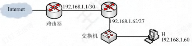
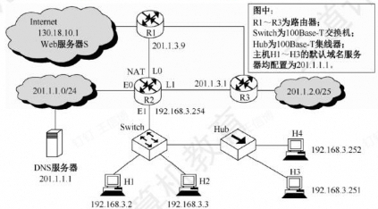

import SubnetCalculator from "@site/src/visualizations/CIDRSubnetting";
import IPMatchingComponent from "@site/src/visualizations/CIDR";
import FileCard from '@site/src/components/FileCard';
import { Alert } from 'antd';
import GridContainer from '@site/src/components/GridContainer';
import QuestionCard from '@site/src/components/QuestionCard';
import Answer from '@site/src/components/Answer';

<Alert message={"解析内容持续更新中，如有疑问请通过钉钉/微信/Issue提问"} type="info" showIcon style={{marginBottom: 16}}/>

<h3 style={{color: '#006d75', marginTop: 0, marginBottom: 8}}>章节资源</h3>
<GridContainer>
    <FileCard file_type={'pdf'} name={'5 Network Layer'} size={'7491147'} link={require('@site/assets/slides/5_Network Layer.pdf').default} />
</GridContainer>

[//]: # (文件名与其他章节的差异是有意为之，因为Docusarus无法处理以“Network”作为文件名（大小写敏感）的文档，使首页崩溃)

[//]: # (不要尝试修改该文件名使之与其他命名格式一致)

## CIDR子网划分计算

<SubnetCalculator/>

## CIDR分组匹配转发

<IPMatchingComponent />

## 题目解析

<QuestionCard source={["25王道 P153-4"]}>
### 下列关于IP分组的首部检验和字段的说法中，正确的是( )

A. 检验和字段检查的范围是整个IP分组

B. 计算检验和的方法是对首部的每个16比特按反码运算求和再取反码

C. 若网络层发现检验和错误，则丢弃该IP分组并发送ICMP差错报文

D. IP分组的检验和的计算需要加入一个伪首部

<Answer>
答案：B

IP提供的是不可靠服务，没有提供确认机制，如果出现校验和错误，则直接丢弃，不做任何处理

DF=1，但长度超过MTU时，需要发送差错报文
</Answer>
</QuestionCard>

<QuestionCard source={["25王道 P154-21", "24王道 P155-19"]}>
### 一个网段的网络号为198.90.10.0/27，最多可以分成( )个子网，每个子网最多具有( )个有效的IP地址

A. 8,30&emsp;&emsp;&emsp;B. 4,62&emsp;&emsp;&emsp;C. 16,14&emsp;&emsp;&emsp;D. 32,6

<Answer>
答案：A

我们通常认为被分配到的子网需要有能分配给主机的地址，即主机部分至少2位，则最多能划3位用于划分子网，即8个子网

本题前后两问是独立情景，不要结合在一起思考
</Answer>
</QuestionCard>

<QuestionCard source={["25王道 P159-68", "24王道 P159-58", "22年统考"]}>
### 下图所示网络中的主机H的子网掩码与默认网关分别是

A. 255.255.255.192，192.168.1.1

B. 255.255.255.192，192.168.1.62

C. 255.255.255.224，192.168.1.1

D. 255.255.255.224，192.168.1.62

<Answer>
答案：D

默认网关一般选择和设备在同一子网的最近的路由器，注意左侧路由器和H不在同一网络

尽管选择可分配地址范围（不含网络地址/广播地址）的最低/高地址作为路由器接口地址比较方便，但不是必须，请根据实际情况确定，不要看到.1就无脑选择
</Answer>
</QuestionCard>

<QuestionCard source={["25王道 P161-14"]}>
### 某网络拓扑如下图所示，RI和R2为路由器，Switch为交换机，Hub为集线器，Web服务器S、主机H1-H6和路由器各接口的IP地址如图中所示。请回答：

3)假设H1和R1的ARP缓存初始均为空，交换机的交换表也为空，H1向H6发送一个IP分组P，H6收到P后向H1发送一个响应IP分组A，则能收到**封装P**的以太网帧的主机，以及能收到封装A的以太网帧的主机分别有哪些?
<Answer>
答案：H4 H5 H6

请注意，题目问的是封装P的以太网帧，不要将不含P的ARP等帧考虑在内；H1~3一侧的详细过程如下：

* H1想发送数据，发现H6和自己不在一个子网，需要交给默认网关（R1 E0）转发
* H1检查自己的ARP缓存，发现没有默认网关（R1 E0）对应表项，需要通过ARP协议获取相应MAC
* H1发送源MAC为自己MAC，目标MAC为全1的广播帧
* 交换机收到H1 ARP请求，将H1的MAC地址记录在转发表，并向其他接口广播该请求包
* H2/3、R1 E0收到广播包，R1发现是自己的IP，进行回应，H2/3判断与自己无关，丢弃不管
* 交换机收到R1向H1的ARP响应，由于之前H1的MAC地址已经进入了转发表，直接向H1所在接口转发
* H1收到ARP响应，知道了R1的MAC地址
* H1开始发送数据P，此时交换机转发表已经有R1表项，直接向R1所在接口转发，因此H2/H3不会接收到
</Answer>
</QuestionCard>

<QuestionCard source={["25王道 P195-25", "24王道 P186-16", "16年统考"]}>
### 假设下图中的R1、R2、R3采用RIP交换路由信息，且均已收敛。若R3检测到网络201.1.2.0/25不可达，并向R2通告一次新的距离向量，则R2更新后，其到达该网络的距离是()

A.2&emsp;&emsp;&emsp;B.3&emsp;&emsp;&emsp;C.16&emsp;&emsp;&emsp;D.17

<Answer>
答案：B

在该网络不可达前，由于路由已收敛，R3处收到R1/R2到达该网络距离均为2

R3判断不可达后，不会直接将距离设置为16，而是根据目前掌握的全部距离向量信息，认为可以从R1或R2到达此网络，更新与该网络的距离为2+1=3，下一跳为R1或R2

收到R3通告的距离向量后，（由于R1还未收到通告，距离不变），此时R2发现从R1转发距离最小（2+1=3），因此进行更新，距离变为3，下一跳变为R1

本题是RIP坏消息传得慢的一个实例
</Answer>
</QuestionCard>

<QuestionCard source={["概念-DHCP是否广播"]}>
### DHCP不同类型数据包发送方法
DHCPDISCOVERY 广播

DHCPOFFER 广播/单播均可，看C/S两端的配置等

DHCPREQUEST 通常广播，续期时通常单播
</QuestionCard>